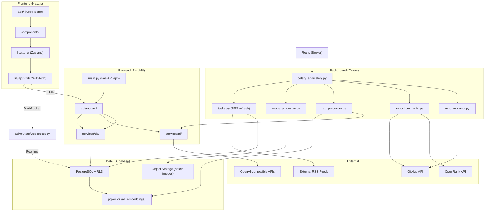
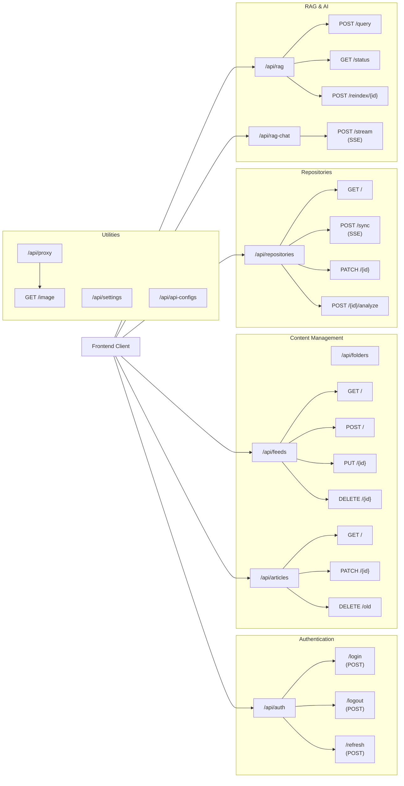
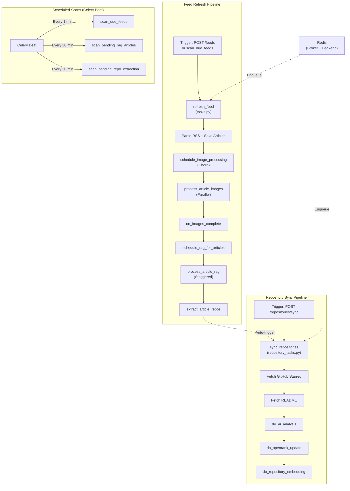
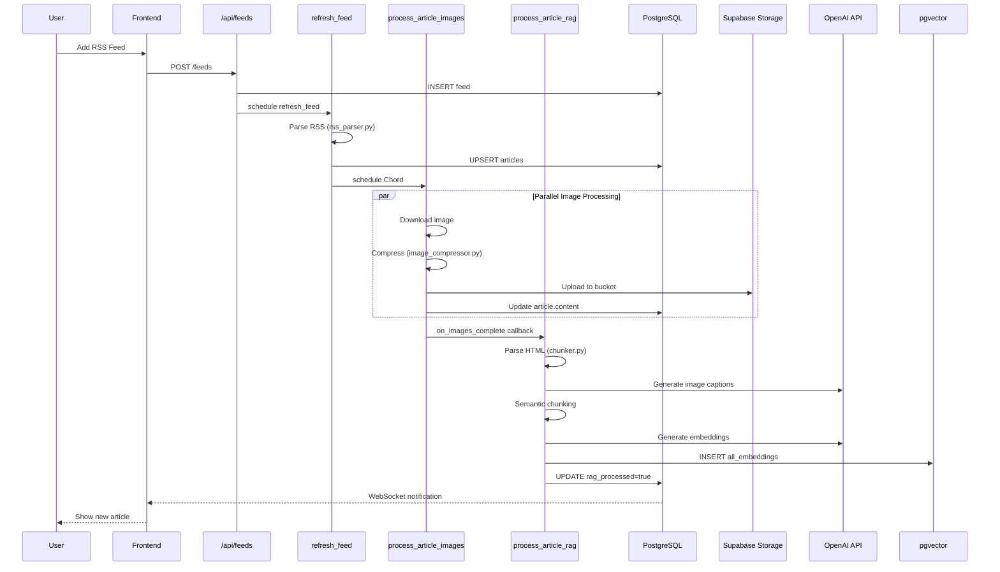
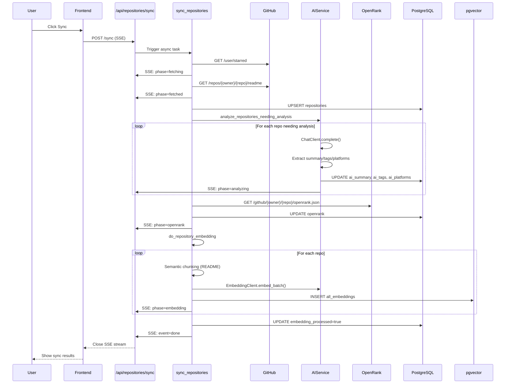
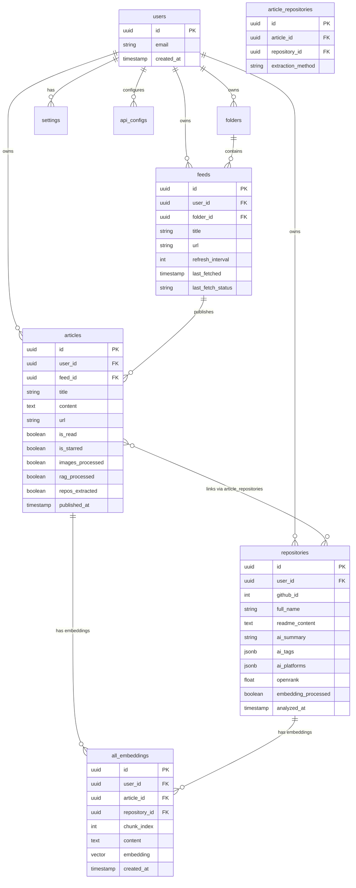
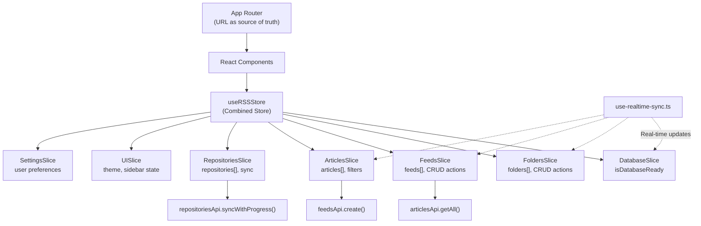
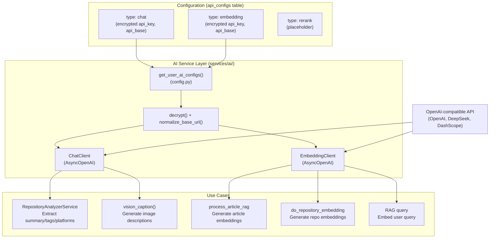
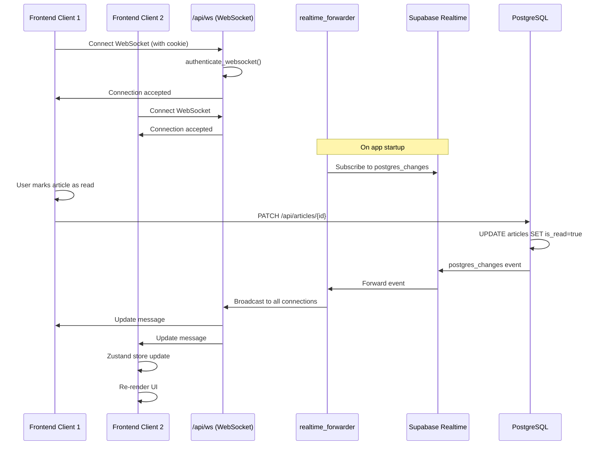
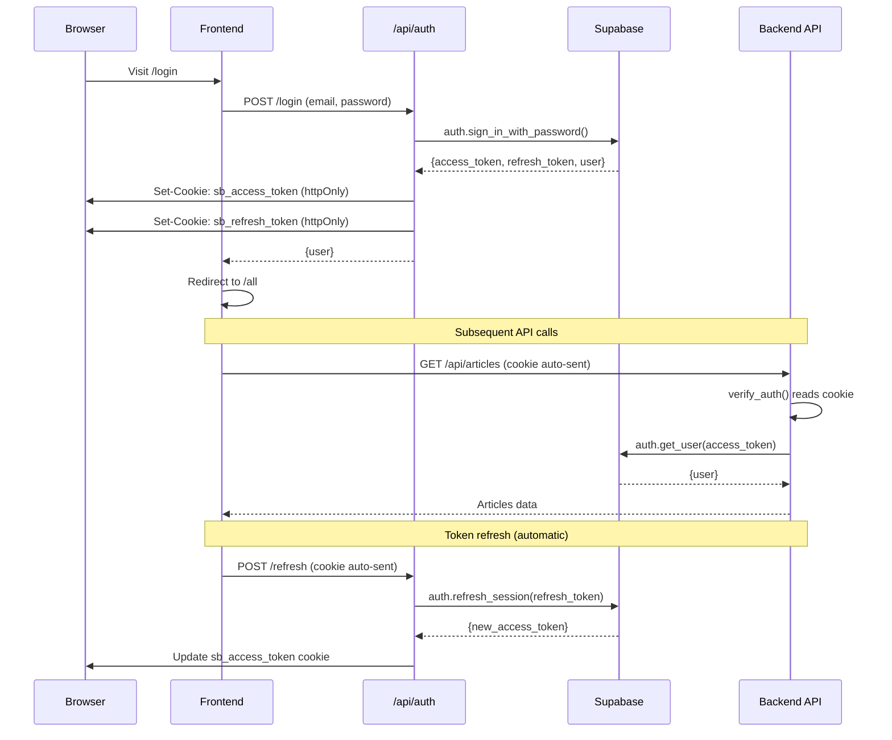

# Overview

Relevant source files

The following files were used as context for generating this wiki page:

- [CLAUDE.md](CLAUDE.md)
- [backend/app/api/routers/feeds.py](backend/app/api/routers/feeds.py)
- [backend/app/api/routers/rag.py](backend/app/api/routers/rag.py)
- [backend/app/api/routers/repositories.py](backend/app/api/routers/repositories.py)
- [backend/app/api/routers/websocket.py](backend/app/api/routers/websocket.py)
- [backend/app/celery_app/CLAUDE.md](backend/app/celery_app/CLAUDE.md)
- [backend/app/celery_app/celery.py](backend/app/celery_app/celery.py)
- [backend/app/celery_app/image_processor.py](backend/app/celery_app/image_processor.py)
- [backend/app/celery_app/rag_processor.py](backend/app/celery_app/rag_processor.py)
- [backend/app/celery_app/repository_tasks.py](backend/app/celery_app/repository_tasks.py)
- [backend/app/celery_app/tasks.py](backend/app/celery_app/tasks.py)
- [backend/app/main.py](backend/app/main.py)
- [backend/app/schemas/repositories.py](backend/app/schemas/repositories.py)
- [backend/app/services/ai/CLAUDE.md](backend/app/services/ai/CLAUDE.md)
- [backend/app/services/ai/__init__.py](backend/app/services/ai/__init__.py)
- [backend/app/services/ai/clients.py](backend/app/services/ai/clients.py)
- [backend/app/services/ai/config.py](backend/app/services/ai/config.py)
- [backend/app/services/ai/repository_service.py](backend/app/services/ai/repository_service.py)
- [backend/app/services/db/repositories.py](backend/app/services/db/repositories.py)
- [backend/app/services/openrank_service.py](backend/app/services/openrank_service.py)
- [backend/app/services/rag/CLAUDE.md](backend/app/services/rag/CLAUDE.md)
- [backend/app/services/rag/__init__.py](backend/app/services/rag/__init__.py)
- [backend/app/services/rag/chunker.py](backend/app/services/rag/chunker.py)
- [backend/app/services/repository_analyzer.py](backend/app/services/repository_analyzer.py)
- [backend/scripts/030_add_repository_openrank.sql](backend/scripts/030_add_repository_openrank.sql)
- [frontend/components/add-feed-dialog.tsx](frontend/components/add-feed-dialog.tsx)
- [frontend/components/repository/repository-card.tsx](frontend/components/repository/repository-card.tsx)
- [frontend/components/repository/repository-page.tsx](frontend/components/repository/repository-page.tsx)
- [frontend/lib/api/repositories.ts](frontend/lib/api/repositories.ts)
- [frontend/lib/store/repositories.slice.ts](frontend/lib/store/repositories.slice.ts)
- [frontend/lib/types.ts](frontend/lib/types.ts)

## Purpose and Scope

SaveHub is an AI-powered knowledge management system that combines RSS feed aggregation, GitHub repository tracking, and semantic search capabilities. This document provides a high-level overview of the system architecture, core technologies, major components, and data flows.

For detailed information about specific subsystems:
- System design patterns and architectural decisions: [System Architecture](#3)
- Frontend implementation details: [Frontend Application](#4)
- Backend service layer: [Backend Services](#5)
- Background processing pipelines: [Background Processing](#6)
- Database schema and vector storage: [Data Layer](#7)
- AI integration and configuration: [AI Integration](#8)

**Sources:** [CLAUDE.md:14-21](), [backend/app/main.py:1-88](), [frontend/lib/types.ts:1-147]()

---

## Core Technologies

SaveHub is built as a **monorepo** with three distinct layers:

| Layer | Technology Stack | Location |
|-------|-----------------|----------|
| **Frontend** | Next.js 14 (App Router), React 18, Zustand, shadcn/ui, TypeScript | `frontend/` |
| **Backend** | FastAPI, Supabase Python SDK, Pydantic | `backend/app/` |
| **Background Processing** | Celery, Redis (broker), AsyncIO | `backend/app/celery_app/` |
| **Database** | Supabase PostgreSQL, pgvector, Object Storage | Managed service |
| **AI Services** | OpenAI-compatible APIs (OpenAI, DeepSeek, DashScope) | External |

**Sources:** [CLAUDE.md:14-21](), [backend/app/main.py:43-76](), [backend/app/celery_app/celery.py:1-117]()

---

## System Architecture Overview

**Description:** SaveHub follows a three-tier architecture with clear separation between frontend (user interaction), backend (API and business logic), and background processing (asynchronous tasks). The frontend communicates with the backend via HTTP and WebSocket. Background workers consume tasks from Redis and interact with external services.

**Sources:** [backend/app/main.py:43-88](), [backend/app/celery_app/celery.py:26-116](), [frontend/lib/store/index.ts](), [CLAUDE.md:46-64]()

---

## Main Components and File Structure

### Frontend Components

| Path | Responsibility |
|------|---------------|
| `frontend/app/` | Next.js App Router pages and layouts |
| `frontend/components/` | Reusable React components (article list, repository cards, chat UI) |
| `frontend/lib/store/` | Zustand state management with 7 slices (database, folders, feeds, articles, repositories, UI, settings) |
| `frontend/lib/api/` | API client layer with `fetchWithAuth` for authenticated requests |

**Sources:** [CLAUDE.md:46-64](), [frontend/lib/types.ts:76-101]()

### Backend Components

| Path | Responsibility |
|------|---------------|
| `backend/app/main.py` | FastAPI application entry point, router registration, CORS middleware |
| `backend/app/api/routers/` | API endpoints (`articles.py`, `feeds.py`, `repositories.py`, `rag.py`, `rag_chat.py`, etc.) |
| `backend/app/services/db/` | Database service layer (`ArticleService`, `FeedService`, `RepositoryService`, `RagService`) |
| `backend/app/services/ai/` | AI client abstractions (`ChatClient`, `EmbeddingClient`, `RepositoryAnalyzerService`) |
| `backend/app/schemas/` | Pydantic models for request/response validation |

**Sources:** [backend/app/main.py:43-88](), [backend/app/api/routers/repositories.py:1-486]()

### Background Processing Components

| Path | Responsibility |
|------|---------------|
| `backend/app/celery_app/celery.py` | Celery configuration, beat schedule, task routing |
| `backend/app/celery_app/tasks.py` | RSS feed refresh tasks (`refresh_feed`, `refresh_feed_batch`, `scan_due_feeds`) |
| `backend/app/celery_app/image_processor.py` | Image download, compression, upload (`process_article_images`) |
| `backend/app/celery_app/rag_processor.py` | RAG embedding generation (`process_article_rag`) |
| `backend/app/celery_app/repository_tasks.py` | GitHub sync (`sync_repositories`, `do_repository_embedding`) |
| `backend/app/celery_app/repo_extractor.py` | Extract GitHub repos from article content (`extract_article_repos`) |

**Sources:** [backend/app/celery_app/CLAUDE.md:1-150](), [backend/app/celery_app/celery.py:26-116]()

---

## Core Features

SaveHub provides three primary content management workflows:

### 1. RSS Feed Management

Users subscribe to RSS feeds, which are automatically refreshed at configurable intervals. Articles are parsed, images are downloaded and optimized, and content is indexed for semantic search.

**Key routers:** `api/routers/feeds.py`, `api/routers/articles.py`  
**Background tasks:** `refresh_feed`, `process_article_images`, `process_article_rag`  
**Database tables:** `feeds`, `articles`, `all_embeddings`

**Sources:** [backend/app/api/routers/feeds.py:1-220](), [backend/app/celery_app/tasks.py:256-446]()

### 2. GitHub Repository Tracking

Users connect their GitHub account to sync starred repositories. The system fetches README content, generates AI-powered summaries and tags, retrieves OpenRank metrics, and creates embeddings for semantic search.

**Key routers:** `api/routers/repositories.py`  
**Background tasks:** `sync_repositories`, `do_ai_analysis`, `do_repository_embedding`  
**Database tables:** `repositories`, `all_embeddings`, `article_repositories`

**Sources:** [backend/app/api/routers/repositories.py:48-301](), [backend/app/celery_app/repository_tasks.py:496-637]()

### 3. AI-Powered Chat & Search

Users can search across both articles and repositories using natural language queries. The system uses Self-RAG (Retrieval-Augmented Generation) to retrieve relevant content and generate answers with inline references.

**Key routers:** `api/routers/rag.py`, `api/routers/rag_chat.py`  
**Services:** `RagService.search()`, `search_all_embeddings` RPC  
**Database:** `all_embeddings` table with pgvector similarity search

**Sources:** [backend/app/api/routers/rag.py:83-150](), [backend/app/services/db/rag.py]()

---

## HTTP API Endpoints

**Description:** All API endpoints require authentication via JWT token stored in `sb_access_token` cookie. The `verify_auth` dependency validates tokens on each request. SSE (Server-Sent Events) endpoints are used for long-running operations like repository sync and AI chat streaming.

**Sources:** [backend/app/main.py:58-76](), [backend/app/dependencies.py](), [backend/app/api/routers/repositories.py:48-301]()

---

## Background Task Orchestration

SaveHub uses Celery with Redis as the broker to handle asynchronous processing. Tasks are organized into several pipelines with dependencies:

**Description:** Background tasks follow a pipeline pattern where each stage triggers the next. The feed refresh pipeline processes articles through image optimization and RAG indexing. The repository sync pipeline fetches data from GitHub, runs AI analysis, and generates embeddings. Celery Beat provides scheduled scanning for missed processing.

**Sources:** [backend/app/celery_app/CLAUDE.md:5-76](), [backend/app/celery_app/celery.py:98-116](), [backend/app/celery_app/tasks.py:256-918]()

---

## Data Flow: Article Ingestion

**Description:** Article ingestion follows a multi-stage pipeline: RSS parsing → image processing → RAG indexing. Each stage updates database status fields (`images_processed`, `rag_processed`, `repos_extracted`) to track progress and enable selective reprocessing.

**Sources:** [backend/app/celery_app/tasks.py:57-217](), [backend/app/celery_app/image_processor.py:108-258](), [backend/app/celery_app/rag_processor.py:87-267]()

---

## Data Flow: Repository Sync

**Description:** Repository sync uses Server-Sent Events (SSE) to stream progress updates to the frontend. The process fetches metadata from GitHub, analyzes README content with AI, retrieves OpenRank metrics, and generates embeddings for semantic search. All phases run synchronously within the API request for immediate user feedback.

**Sources:** [backend/app/api/routers/repositories.py:48-301](), [backend/app/celery_app/repository_tasks.py:35-278](), [backend/app/services/repository_analyzer.py:19-103]()

---

## Database Schema Overview

**Description:** SaveHub uses a multi-tenant database design with RLS (Row Level Security) enforcing `user_id` isolation. The `all_embeddings` table unifies vector search across articles and repositories using pgvector. Processing status is tracked via boolean flags (`images_processed`, `rag_processed`, `embedding_processed`) to enable selective reprocessing and compensatory scans.

**Sources:** [backend/scripts/](), [backend/app/services/db/repositories.py:1-565](), [backend/app/services/db/rag.py]()

---

## State Management (Frontend)

The frontend uses Zustand with 7 modular slices for state management:

**Description:** Zustand slices are organized by domain concern. View state (selected feed, article filters) is derived from URL params using Next.js App Router, not stored in Zustand. Real-time updates arrive via WebSocket and trigger store updates. Each slice manages its own API calls through `lib/api/` client modules.

**Sources:** [frontend/lib/store/index.ts](), [frontend/lib/store/repositories.slice.ts:1-107](), [CLAUDE.md:68-78]()

---

## AI Service Integration

**Description:** AI configuration is stored encrypted in the `api_configs` table. The `services/ai/` module provides unified client abstractions (`ChatClient`, `EmbeddingClient`) that work with any OpenAI-compatible API. URL normalization ensures consistent `/v1` suffix for SDK compatibility. All AI operations use async/await with proper timeout and retry handling.

**Sources:** [backend/app/services/ai/config.py:1-166](), [backend/app/services/ai/clients.py:1-310](), [backend/app/services/ai/repository_service.py:1-397]()

---

## Real-Time Synchronization

**Description:** SaveHub uses a dual-channel synchronization strategy: HTTP for mutations (optimistic updates), WebSocket for real-time subscriptions. The `realtime_forwarder` service subscribes to Supabase's postgres_changes and broadcasts updates to all authenticated WebSocket clients. Frontend optimistically updates local state, then receives authoritative updates via WebSocket.

**Sources:** [backend/app/services/supabase_realtime.py](), [backend/app/api/routers/websocket.py:1-102](), [frontend/lib/hooks/use-realtime-sync.ts]()

---

## Authentication Flow

**Description:** SaveHub uses cookie-based JWT authentication. Both frontend and backend use Supabase SDK for auth operations. The `verify_auth` dependency validates the `sb_access_token` cookie on every request. Token refresh is handled automatically by `fetchWithAuth` when tokens expire. WebSocket connections authenticate using the same cookie mechanism.

**Sources:** [backend/app/dependencies.py](), [backend/app/api/routers/auth.py](), [frontend/lib/api/fetch-client.ts]()

---

## Deployment Entry Points

| Component | Entry Point | Command |
|-----------|-------------|---------|
| **Frontend** | `frontend/package.json` | `pnpm dev` (development) `pnpm build && pnpm start` (production) |
| **Backend API** | `backend/app/main.py` | `uvicorn app.main:app --reload` |
| **Celery Worker** | `backend/app/celery_app/celery.py` | `celery -A app.celery_app worker` |
| **Celery Beat** | `backend/app/celery_app/celery.py` | `celery -A app.celery_app beat` |
| **Flower (monitoring)** | Celery management | `celery -A app.celery_app flower` |

**Environment Variables Required:**
- `SUPABASE_URL`, `SUPABASE_ANON_KEY` (frontend + backend)
- `SUPABASE_SERVICE_ROLE_KEY` (backend only, for Celery tasks)
- `REDIS_URL` (backend only, for Celery)
- `ENCRYPTION_KEY` (backend only, for API config encryption)

**Sources:** [CLAUDE.md:22-44](), [backend/app/main.py:1-12](), [backend/app/celery_app/celery.py:24-37]()