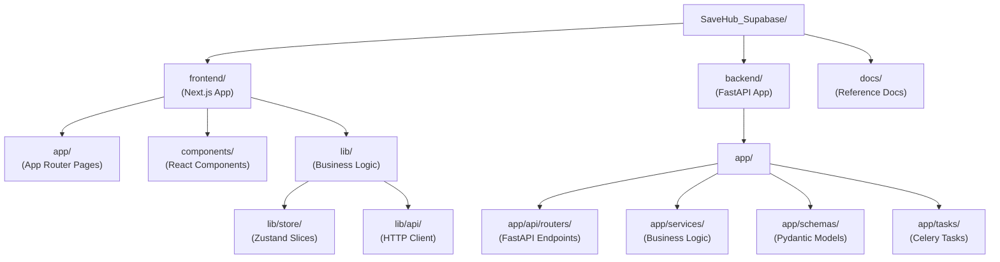
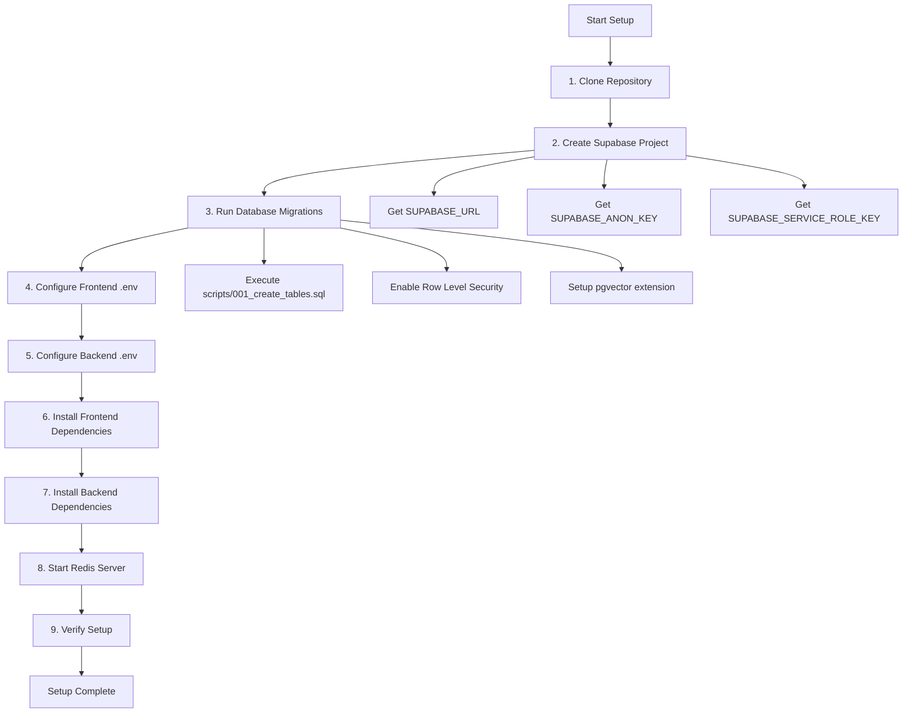
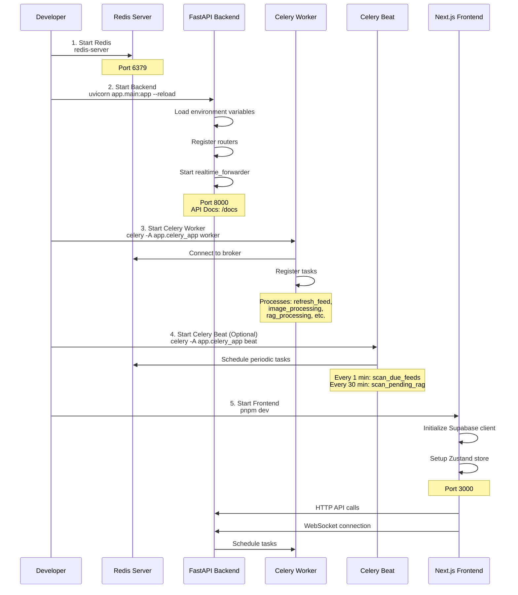

# Getting Started

<details>
<summary>Relevant source files</summary>

The following files were used as context for generating this wiki page:

- [CLAUDE.md](CLAUDE.md)
- [backend/app/api/routers/websocket.py](backend/app/api/routers/websocket.py)
- [backend/app/main.py](backend/app/main.py)
- [frontend/CLAUDE.md](frontend/CLAUDE.md)
- [frontend/app/(reader)/settings/storage/page.tsx](frontend/app/(reader)/settings/storage/page.tsx)
- [frontend/components/edit-feed-form.tsx](frontend/components/edit-feed-form.tsx)

</details>


This page provides step-by-step instructions for setting up SaveHub's development environment, running the application locally, and understanding the monorepo structure. It covers initial installation, environment configuration, and verification steps to ensure all services are running correctly.

For architectural design decisions and inter-service communication patterns, see [System Architecture](#3). For production deployment considerations, see [Deployment & Operations](#10).

---

## Prerequisites

SaveHub requires the following tools installed on your development machine:

| Tool | Version | Purpose |
|------|---------|---------|
| **Node.js** | 18.x or higher | Frontend runtime (Next.js) |
| **pnpm** | 8.x or higher | Frontend package manager |
| **Python** | 3.10 or higher | Backend runtime (FastAPI) |
| **pip** | Latest | Backend package manager |
| **Redis** | 6.x or higher | Task queue broker (Celery) |
| **Supabase Account** | N/A | PostgreSQL database + object storage |

**Optional but recommended:**
- **Git** - Version control
- **Docker** - For running Redis locally
- **Supabase CLI** - Database migration management

Sources: [CLAUDE.md:1-121]()

---

## Monorepo Structure Overview

SaveHub uses a monorepo architecture with clear separation between frontend, backend, and documentation. Understanding this structure is critical for navigation and development.

### Directory Layout



### Key Entry Points

| Layer | Entry Point | Purpose |
|-------|-------------|---------|
| **Frontend** | `frontend/app/layout.tsx` | Next.js root layout, Supabase client initialization |
| **Frontend** | `frontend/lib/store/index.ts` | Zustand store with 7 slices |
| **Backend** | `backend/app/main.py` | FastAPI application, middleware, router registration |
| **Backend** | `backend/app/celery_app.py` | Celery worker configuration and task discovery |
| **Database** | `backend/scripts/001_create_tables.sql` | Initial schema creation script |

Sources: [CLAUDE.md:46-64](), [frontend/CLAUDE.md:40-56]()

---

## Initial Setup

Follow these steps to set up the development environment. Each step must be completed before proceeding to the next.



### Step 1: Clone Repository

```bash
git clone https://github.com/InvisibleQAQ/SaveHub_Supabase.git
cd SaveHub_Supabase
```

### Step 2: Create Supabase Project

1. Visit [supabase.com](https://supabase.com) and create a new project
2. Note your project's credentials from Settings → API:
   - Project URL (e.g., `https://xxxxx.supabase.co`)
   - `anon` public key
   - `service_role` secret key (requires password confirmation)

### Step 3: Run Database Migrations

Execute the schema creation script in Supabase SQL Editor:

1. Open Supabase Dashboard → SQL Editor
2. Copy contents of [backend/scripts/001_create_tables.sql:1-end]()
3. Execute the script to create:
   - Core tables: `feeds`, `articles`, `folders`, `repositories`
   - Supporting tables: `settings`, `api_configs`, `all_embeddings`
   - RLS policies for user isolation
   - pgvector extension for embeddings

**Critical tables created:**
- `feeds` - RSS feed subscriptions with refresh scheduling
- `articles` - Article content with processing status flags
- `repositories` - GitHub repositories with AI analysis results
- `all_embeddings` - Unified vector store for semantic search

Sources: [frontend/CLAUDE.md:52-54](), [backend/scripts/001_create_tables.sql]()

---

## Environment Configuration

SaveHub requires separate environment configurations for frontend and backend services.

### Frontend Environment (`frontend/.env`)

Create `frontend/.env` with the following variables:

```bash
# Supabase Configuration (Required)
NEXT_PUBLIC_SUPABASE_URL=https://xxxxx.supabase.co
NEXT_PUBLIC_SUPABASE_ANON_KEY=eyJhbGciOiJIUzI1NiIsInR5cCI6IkpXVCJ9...

# WebSocket Configuration (Optional)
# Development: Auto-connects to ws://localhost:8000
# Production: Specify full WebSocket URL or use reverse proxy
NEXT_PUBLIC_FASTAPI_WS_URL=ws://localhost:8000
NEXT_PUBLIC_WS_PORT=8000
```

**Variable descriptions:**

| Variable | Purpose | Source |
|----------|---------|--------|
| `NEXT_PUBLIC_SUPABASE_URL` | Supabase project URL | Supabase Dashboard → Settings → API |
| `NEXT_PUBLIC_SUPABASE_ANON_KEY` | Public API key for client-side auth | Supabase Dashboard → Settings → API |
| `NEXT_PUBLIC_FASTAPI_WS_URL` | WebSocket endpoint (production) | Backend deployment URL |
| `NEXT_PUBLIC_WS_PORT` | WebSocket port (development) | Backend port (default: 8000) |

The frontend uses `@supabase/ssr` for cookie-based authentication via [frontend/lib/supabase/client.ts]() and [frontend/lib/supabase/server.ts]().

Sources: [CLAUDE.md:86-91](), [frontend/CLAUDE.md:78-92]()

### Backend Environment (`backend/.env`)

Create `backend/.env` with the following variables:

```bash
# Supabase Configuration (Required)
SUPABASE_URL=https://xxxxx.supabase.co
SUPABASE_ANON_KEY=eyJhbGciOiJIUzI1NiIsInR5cCI6IkpXVCJ9...
SUPABASE_SERVICE_ROLE_KEY=eyJhbGciOiJIUzI1NiIsInR5cCI6IkpXVCJ9...

# Redis Configuration (Required)
REDIS_URL=redis://localhost:6379/0

# Security Configuration
JWT_SECRET_KEY=your-secret-key-here-use-openssl-rand-hex-32
ENCRYPTION_KEY=your-32-byte-base64-encoded-key-here

# OpenAI Configuration (Optional - for AI features)
OPENAI_API_KEY=sk-...
OPENAI_API_BASE=https://api.openai.com/v1
OPENAI_MODEL=gpt-4-turbo-preview
OPENAI_EMBEDDING_MODEL=text-embedding-3-small

# GitHub Configuration (Optional - for repository sync)
GITHUB_TOKEN=ghp_...

# Network Configuration (Optional)
HTTPX_TIMEOUT=45  # HTTP client timeout in seconds
```

**Variable descriptions:**

| Variable | Purpose | Required | Default |
|----------|---------|----------|---------|
| `SUPABASE_URL` | Supabase project URL | Yes | N/A |
| `SUPABASE_ANON_KEY` | Public API key for RLS client | Yes | N/A |
| `SUPABASE_SERVICE_ROLE_KEY` | Admin key for background tasks (bypasses RLS) | Yes | N/A |
| `REDIS_URL` | Celery broker connection string | Yes | `redis://localhost:6379/0` |
| `JWT_SECRET_KEY` | Secret for token validation | Yes | N/A |
| `ENCRYPTION_KEY` | AES-256-GCM key for API config encryption | Yes | N/A |
| `OPENAI_API_KEY` | OpenAI API key for AI features | No | N/A |
| `OPENAI_API_BASE` | OpenAI-compatible API endpoint | No | `https://api.openai.com/v1` |
| `GITHUB_TOKEN` | GitHub personal access token | No | N/A |
| `HTTPX_TIMEOUT` | HTTP request timeout (for slow networks) | No | `45` |

**HTTPX Timeout Configuration:**

The backend monkey-patches httpx default timeout to handle slow network environments (e.g., China mainland) as shown in [backend/app/main.py:7-12]():

```python
import httpx
_HTTPX_TIMEOUT = float(os.environ.get("HTTPX_TIMEOUT", "45"))
httpx._config.DEFAULT_TIMEOUT_CONFIG = httpx.Timeout(_HTTPX_TIMEOUT)
```

This must happen **before** importing any Supabase modules to prevent SSL handshake timeouts.

Sources: [CLAUDE.md:93-98](), [backend/app/main.py:1-12]()

---

## Installing Dependencies

### Frontend Dependencies

```bash
cd frontend
pnpm install
```

This installs dependencies defined in [frontend/package.json]():
- **Next.js 14** - React framework with App Router
- **@supabase/ssr** - Server-side rendering support for Supabase auth
- **zustand** - State management (7 slices)
- **@radix-ui/** - Headless UI primitives (via shadcn/ui)
- **zod** - Runtime type validation
- **date-fns** - Date formatting utilities

### Backend Dependencies

```bash
cd backend
pip install -r requirements.txt
```

This installs dependencies defined in [backend/requirements.txt]():
- **fastapi** - Web framework
- **uvicorn** - ASGI server
- **supabase** - Python SDK for database operations
- **celery[redis]** - Distributed task queue
- **feedparser** - RSS/Atom feed parsing
- **openai** - OpenAI API client for embeddings and chat
- **cryptography** - AES-256-GCM encryption for API configs

Sources: [CLAUDE.md:22-43]()

---

## Running the Application

SaveHub requires four concurrent processes for full functionality. Start them in separate terminal windows in the following order:



### 1. Start Redis Server

Redis is required for Celery task queue.

**Using Docker (Recommended):**
```bash
docker run -d --name redis -p 6379:6379 redis:7-alpine
```

**Using Local Installation:**
```bash
# macOS (via Homebrew)
brew services start redis

# Linux (systemd)
sudo systemctl start redis

# Windows (via WSL or direct installation)
redis-server
```

Verify Redis is running:
```bash
redis-cli ping
# Expected output: PONG
```

### 2. Start FastAPI Backend

The backend serves HTTP APIs and WebSocket connections.

```bash
cd backend
uvicorn app.main:app --reload --port 8000
```

**Startup sequence** ([backend/app/main.py:29-41]()):
1. Load environment variables via `python-dotenv`
2. Configure logging with daily rotation
3. Start `realtime_forwarder` for Postgres change subscriptions
4. Register 12 routers: `rss`, `auth`, `feeds`, `folders`, `articles`, `settings`, `api_configs`, `websocket`, `queue`, `health`, `proxy`, `rag`, `github`, `repositories`, `rag_chat`

**Available endpoints:**
- API documentation: `http://localhost:8000/docs`
- Health check: `http://localhost:8000/health`
- WebSocket endpoint: `ws://localhost:8000/api/ws/realtime`

Sources: [backend/app/main.py:1-88]()

### 3. Start Celery Worker

Celery processes background tasks for RSS feed refresh, image processing, RAG processing, and repository sync.

**Windows:**
```bash
cd backend
celery -A app.celery_app worker --loglevel=info --pool=solo
```

**Linux/macOS:**
```bash
cd backend
celery -A app.celery_app worker --loglevel=info --concurrency=5
```

**Task types registered:**
- `refresh_feed` - Fetch and parse RSS feeds
- `schedule_image_processing` - Download and optimize article images
- `process_article_rag` - Generate embeddings with vision captions
- `extract_article_repos` - Extract GitHub URLs from articles
- `sync_repositories` - Fetch starred repositories from GitHub
- `analyze_repository` - AI-powered README analysis
- `generate_repository_embeddings` - Create repository embeddings

**Monitoring (Optional):**
```bash
# Terminal 4: Flower dashboard
cd backend
celery -A app.celery_app flower --port=5555
# Access at http://localhost:5555
```

Sources: [frontend/CLAUDE.md:59-76](), [CLAUDE.md:40-43]()

### 4. Start Celery Beat (Optional)

Celery Beat schedules periodic tasks for compensatory scans.

```bash
cd backend
celery -A app.celery_app beat --loglevel=info
```

**Scheduled tasks:**
- Every 1 minute: `scan_due_feeds` - Check for feeds due for refresh
- Every 30 minutes: `scan_pending_rag_articles` - Retry failed RAG processing
- Every 30 minutes: `scan_pending_repo_extraction` - Retry failed repo extraction

This is optional for development but recommended for production to ensure eventual consistency.

### 5. Start Next.js Frontend

The frontend provides the user interface and communicates with the backend via HTTP and WebSocket.

```bash
cd frontend
pnpm dev
```

**Startup sequence:**
1. Initialize Supabase client with cookie-based auth ([frontend/lib/supabase/client.ts]())
2. Setup Zustand store with 7 slices ([frontend/lib/store/index.ts]())
3. Connect WebSocket for real-time sync ([frontend/hooks/use-realtime-sync.ts]())
4. Load initial data from backend APIs

**Access the application:**
- Frontend UI: `http://localhost:3000`
- Auto-redirects to `/all` (all articles view)

Sources: [CLAUDE.md:24-30](), [frontend/CLAUDE.md:46-50]()

---

## Verification Steps

After starting all services, verify the setup is working correctly.

### 1. Backend API Health Check

```bash
curl http://localhost:8000/health
# Expected: {"status":"healthy"}

curl http://localhost:8000/api/health
# Expected: {"status":"healthy","service":"rss-api"}
```

Sources: [backend/app/main.py:79-88]()

### 2. WebSocket Connection

Open browser DevTools and check WebSocket connection in the Network tab:
- URL: `ws://localhost:8000/api/ws/realtime`
- Status: `101 Switching Protocols`
- Frames: Periodic ping/pong messages

The WebSocket authenticates via HttpOnly cookie `sb_access_token` ([backend/app/api/routers/websocket.py:22-42]()):

```python
COOKIE_NAME_ACCESS = "sb_access_token"

async def authenticate_websocket(websocket: WebSocket) -> str | None:
    access_token = websocket.cookies.get(COOKIE_NAME_ACCESS)
    # ... validates token and returns user_id
```

Sources: [backend/app/api/routers/websocket.py:1-122]()

### 3. Celery Task Queue

Check Celery worker logs for task registration:
```
[tasks]
  . app.tasks.feed_tasks.refresh_feed
  . app.tasks.image_tasks.schedule_image_processing
  . app.tasks.rag_tasks.process_article_rag
  . app.tasks.repo_tasks.extract_article_repos
  . app.tasks.repo_tasks.sync_repositories
```

### 4. Database Connection

The frontend checks database readiness on app load via [frontend/app/(reader)/layout.tsx]():
- If tables exist: Loads data and renders UI
- If tables missing: Shows `DatabaseSetup` component with SQL script instructions

### 5. Frontend Authentication

1. Click "Sign In" in the top-right corner
2. Authenticate via Supabase Auth UI
3. Verify redirect back to `/all` after successful login
4. Check browser cookies for `sb_access_token` and `sb_refresh_token`

Sources: [frontend/CLAUDE.md:141-146]()

---

## Development Workflow

### Common Development Tasks

| Task | Command | Location |
|------|---------|----------|
| **Add new API endpoint** | Add router in `backend/app/api/routers/` | Register in [backend/app/main.py:58-76]() |
| **Add new Zustand action** | Edit slice in `frontend/lib/store/*.slice.ts` | Export in [frontend/lib/store/index.ts]() |
| **Add new page** | Create `frontend/app/(reader)/*/page.tsx` | Use `ArticlePageLayout` wrapper |
| **Add new database table** | Write SQL migration in `backend/scripts/` | Execute in Supabase SQL Editor |
| **Add new Celery task** | Create task in `backend/app/tasks/` | Auto-discovered by Celery |

### Hot Reload

All services support hot reload during development:

- **Frontend**: Next.js Fast Refresh updates components on save
- **Backend**: `uvicorn --reload` restarts on Python file changes
- **Celery**: Restart worker manually after task changes (no auto-reload)

### Logging

Both frontend and backend use structured logging:

**Frontend** ([frontend/lib/logger.ts]()):
```typescript
import { logger } from "@/lib/logger"
logger.info({ userId, feedId }, 'Feed refreshed')
logger.error({ error }, 'Failed to parse feed')
```

**Backend** ([backend/app/core/logging_config.py]()):
```python
import logging
logger = logging.getLogger(__name__)
logger.info(f"Starting Supabase Realtime forwarder...")
```

Sources: [frontend/CLAUDE.md:391-416]()

---

## Troubleshooting Common Setup Issues

### Redis Connection Refused

**Symptom:**
```
celery.exceptions.ImproperlyConfigured: 
Cannot connect to redis://localhost:6379/0
```

**Solution:**
1. Verify Redis is running: `redis-cli ping`
2. Check `REDIS_URL` in `backend/.env`
3. If using Docker: Ensure container is running

### Supabase Connection Timeout

**Symptom:**
```
httpx.ConnectTimeout: timed out
```

**Solution:**
Increase `HTTPX_TIMEOUT` in `backend/.env`:
```bash
HTTPX_TIMEOUT=60  # Increase from default 45 seconds
```

This is particularly important for slow network environments. The timeout is configured at [backend/app/main.py:7-12]() and must be set before importing Supabase modules.

### Database Tables Not Found

**Symptom:**
Frontend shows "Database Setup Required" screen

**Solution:**
1. Execute [backend/scripts/001_create_tables.sql]() in Supabase SQL Editor
2. Verify tables exist: Check Supabase Dashboard → Database → Tables
3. Refresh browser page

### WebSocket Authentication Failed

**Symptom:**
WebSocket closes immediately with code 4001 (Unauthorized)

**Solution:**
1. Verify you're logged in (check for `sb_access_token` cookie)
2. Check backend logs for authentication errors
3. Ensure `SUPABASE_ANON_KEY` matches between frontend and backend `.env`

Sources: [backend/app/api/routers/websocket.py:89-95]()

### Celery Task Not Executing

**Symptom:**
Feed refresh scheduled but no articles appear

**Solution:**
1. Check Celery worker logs for task registration
2. Verify Redis connection in worker logs
3. Check backend logs for task scheduling confirmation
4. Use Flower dashboard to inspect task state: `http://localhost:5555`

### Port Already in Use

**Symptom:**
```
Error: Address already in use
```

**Solution:**
```bash
# Find process using port 8000
lsof -i :8000  # macOS/Linux
netstat -ano | findstr :8000  # Windows

# Kill the process or change port
uvicorn app.main:app --reload --port 8001
```

Sources: [CLAUDE.md:1-121](), [frontend/CLAUDE.md:1-480](), [backend/app/main.py:1-88]()

---

## Next Steps

After successfully setting up the development environment:

1. **Understand the architecture**: Read [System Architecture](#3) to learn about design patterns and inter-service communication
2. **Explore authentication**: See [Authentication & Security](#3.1) for JWT handling and RLS patterns
3. **Learn state management**: Review [State Management](#4.1) for Zustand store architecture
4. **Study background processing**: Check [Background Processing](#6) for Celery task patterns
5. **Add a new feature**: Follow [Development Guide](#9) for best practices and common patterns

The application is now ready for development. All services are running, and you can begin adding features or modifying existing functionality.