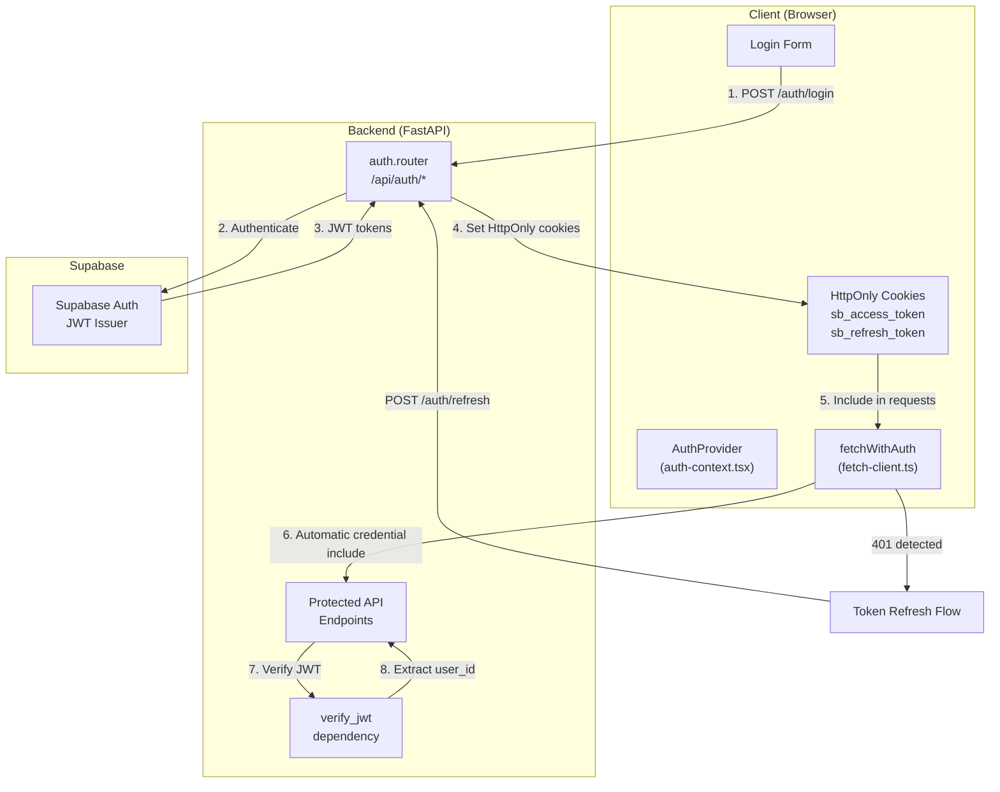
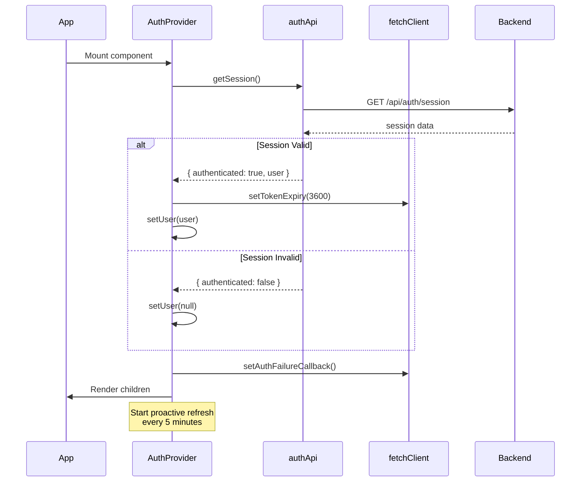
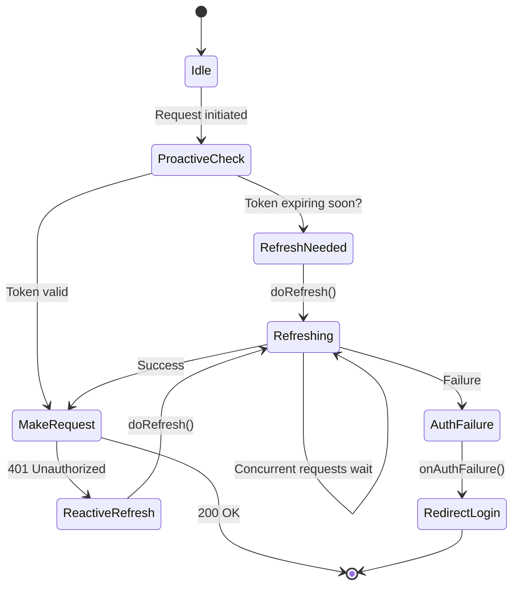
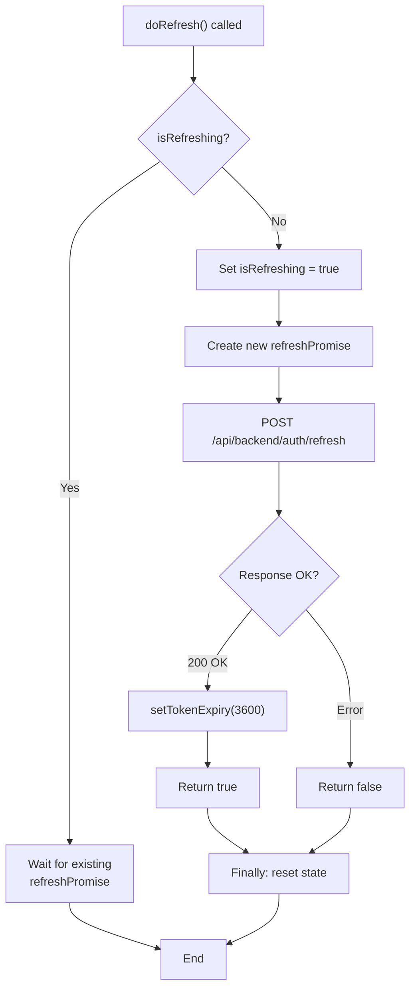
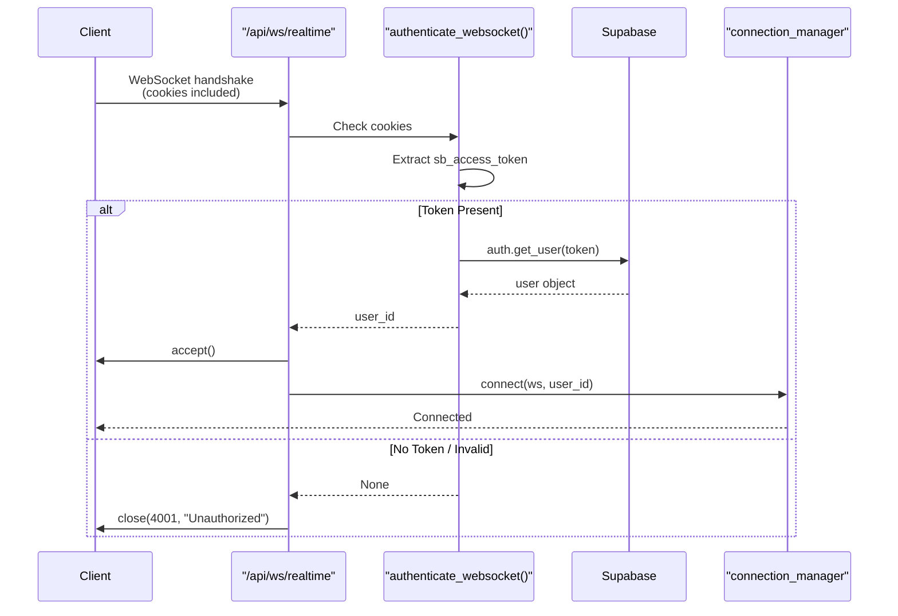
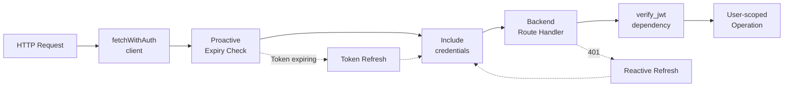
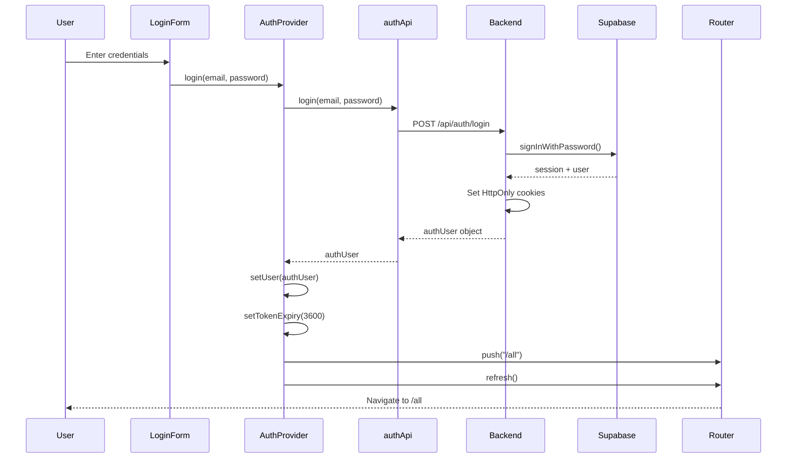
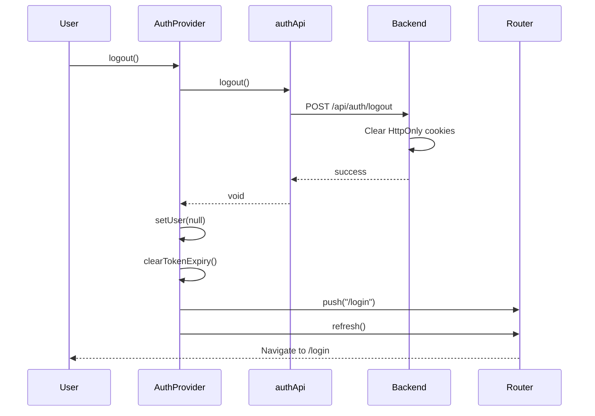

# Authentication & Security

<details>
<summary>Relevant source files</summary>

The following files were used as context for generating this wiki page:

- [CLAUDE.md](CLAUDE.md)
- [backend/app/api/routers/websocket.py](backend/app/api/routers/websocket.py)
- [backend/app/main.py](backend/app/main.py)
- [frontend/hooks/use-realtime-sync.ts](frontend/hooks/use-realtime-sync.ts)
- [frontend/lib/api-validation.ts](frontend/lib/api-validation.ts)
- [frontend/lib/api/api-configs.ts](frontend/lib/api/api-configs.ts)
- [frontend/lib/api/articles.ts](frontend/lib/api/articles.ts)
- [frontend/lib/api/feeds.ts](frontend/lib/api/feeds.ts)
- [frontend/lib/api/fetch-client.ts](frontend/lib/api/fetch-client.ts)
- [frontend/lib/api/folders.ts](frontend/lib/api/folders.ts)
- [frontend/lib/api/github.ts](frontend/lib/api/github.ts)
- [frontend/lib/api/settings.ts](frontend/lib/api/settings.ts)
- [frontend/lib/context/auth-context.tsx](frontend/lib/context/auth-context.tsx)

</details>


## Purpose and Scope

This document covers authentication mechanisms, token management, and security features in the SaveHub application. Topics include JWT-based authentication, automatic token refresh, WebSocket authentication, and security protections.

For state management and API client layer details, see [State Management](#4.1) and [API Client Layer](#4.5). For real-time synchronization security, see [Real-time Synchronization](#3.2).

---

## Authentication Architecture

SaveHub uses **Supabase Auth** for JWT-based authentication with HttpOnly cookies for secure token storage. The system implements automatic token refresh with mutex protection to prevent race conditions.

### Authentication Flow Overview



**Sources:** [backend/app/main.py:59-76](), [frontend/lib/context/auth-context.tsx:1-142](), [frontend/lib/api/fetch-client.ts:1-239]()

---

## Frontend Authentication

### AuthProvider and Context

The `AuthProvider` component manages authentication state and provides authentication methods to the application.

#### AuthContext Structure

| Field | Type | Purpose |
|-------|------|---------|
| `user` | `AuthUser \| null` | Current authenticated user |
| `isLoading` | `boolean` | Initial session check status |
| `isAuthenticated` | `boolean` | Derived from user presence |
| `login` | `(email, password) => Promise<void>` | Login method |
| `register` | `(email, password) => Promise<void>` | Registration method |
| `logout` | `() => Promise<void>` | Logout method |
| `refreshSession` | `() => Promise<boolean>` | Manual session refresh |

**Sources:** [frontend/lib/context/auth-context.tsx:21-29]()

#### Initialization Flow



**Sources:** [frontend/lib/context/auth-context.tsx:43-86]()

### Token Storage (HttpOnly Cookies)

Tokens are stored in **HttpOnly cookies** for security, preventing JavaScript access and XSS attacks.

#### Cookie Configuration

| Cookie Name | Content | Properties |
|-------------|---------|------------|
| `sb_access_token` | JWT access token | HttpOnly, Secure (production), SameSite |
| `sb_refresh_token` | JWT refresh token | HttpOnly, Secure (production), SameSite |

These cookies are:
- Set by backend auth endpoints: `/api/auth/login`, `/api/auth/register`, `/api/auth/refresh`
- Automatically included in all API requests via `credentials: "include"`
- Cleared on logout: `/api/auth/logout`

**Sources:** [backend/app/api/routers/websocket.py:22]()

---

## Automatic Token Refresh

The `fetchWithAuth` client implements automatic token refresh with mutex protection to handle concurrent requests.

### Token Refresh State Machine



**Sources:** [frontend/lib/api/fetch-client.ts:115-165]()

### Refresh Logic Implementation

The refresh mechanism uses a **mutex lock** to ensure only one refresh happens at a time.

#### Key State Variables

```typescript
interface RefreshState {
  isRefreshing: boolean
  refreshPromise: Promise<boolean> | null
}

// Token expiry tracking
let tokenExpiresAt: number | null = null

// Buffer time: refresh 5 minutes before expiry
const EXPIRY_BUFFER_MS = 5 * 60 * 1000
```

**Sources:** [frontend/lib/api/fetch-client.ts:16-56]()

#### doRefresh() Function



**Sources:** [frontend/lib/api/fetch-client.ts:115-144]()

### Proactive vs Reactive Refresh

| Refresh Type | Trigger | Purpose |
|--------------|---------|---------|
| **Proactive** | Token expiring within 5 minutes | Prevent 401 errors before they happen |
| **Reactive** | 401 response received | Recover from expired token |
| **Manual** | User action via `refreshSession()` | Support explicit refresh UI |

#### Proactive Refresh Schedule

The `AuthProvider` runs proactive refresh every 5 minutes when user is authenticated:

**Sources:** [frontend/lib/context/auth-context.tsx:73-86]()

---

## Backend Authentication

### JWT Verification Dependency

Backend routes use a `verify_jwt` dependency to authenticate requests. This dependency:
1. Extracts JWT from `sb_access_token` cookie
2. Validates token with Supabase
3. Returns `user_id` for use in route handlers

**Note:** The actual `verify_jwt` implementation is in `backend/app/api/dependencies/auth.py` (not provided in files).

### WebSocket Authentication

WebSocket connections authenticate via cookie **before** accepting the connection.

#### WebSocket Authentication Flow



**Sources:** [backend/app/api/routers/websocket.py:30-61](), [backend/app/api/routers/websocket.py:64-122]()

#### WebSocket Authentication Implementation

```python
async def authenticate_websocket(websocket: WebSocket) -> str | None:
    # Get access token from cookie (available before accept())
    access_token = websocket.cookies.get(COOKIE_NAME_ACCESS)
    
    if not access_token:
        return None
    
    try:
        client = get_supabase_client()
        user_response = client.auth.get_user(access_token)
        return user_response.user.id if user_response.user else None
    except Exception:
        return None
```

**Sources:** [backend/app/api/routers/websocket.py:30-61]()

---

## Security Features

### CORS Configuration

The FastAPI backend configures CORS middleware to control cross-origin access.

#### CORS Settings

```python
app.add_middleware(
    CORSMiddleware,
    allow_origins=["*"],  # Adjust for production
    allow_credentials=True,
    allow_methods=["*"],
    allow_headers=["*"],
)
```

**Production Considerations:**
- Replace `allow_origins=["*"]` with specific frontend domains
- Enable `allow_credentials=True` required for HttpOnly cookies
- Restrict methods/headers if needed

**Sources:** [backend/app/main.py:50-56]()

### API Key Encryption

API configurations (OpenAI, DeepSeek, etc.) store encrypted API keys in the database.

#### API Config Security

| Feature | Implementation |
|---------|----------------|
| Storage | `api_configs` table with encrypted `api_key` field |
| Encryption | Backend-side encryption (implementation in service layer) |
| Access Control | User-scoped via `user_id` foreign key |
| Validation | `validateApiConfig()` validates without storing keys |

**Sources:** [frontend/lib/api/api-configs.ts:1-221](), [frontend/lib/api-validation.ts:1-127]()

### SSRF Protection

The image proxy endpoint implements SSRF (Server-Side Request Forgery) protection when fetching external images.

**Note:** SSRF protection details are in the image proxy implementation, which validates URLs and restricts access to internal networks. See [Articles Management](#5.1) for image proxy details.

### Request Authentication Chain

All authenticated API requests follow this chain:



**Sources:** [frontend/lib/api/fetch-client.ts:185-238]()

---

## URL Skip List

Certain URLs bypass authentication handling to prevent refresh loops:

```typescript
const SKIP_AUTH_URLS = [
  "/api/backend/auth/login",
  "/api/backend/auth/register",
  "/api/backend/auth/refresh",
  "/api/backend/auth/logout",
  "/api/backend/auth/session",
]
```

These endpoints are excluded from:
- Proactive token refresh checks
- Reactive 401 handling
- Automatic retry logic

**Sources:** [frontend/lib/api/fetch-client.ts:28-34]()

---

## Authentication Methods

### Login Flow



**Sources:** [frontend/lib/context/auth-context.tsx:88-94]()

### Logout Flow



**Sources:** [frontend/lib/context/auth-context.tsx:104-110]()

### Registration Flow

Registration follows the same pattern as login, but calls `/api/auth/register` endpoint instead.

**Sources:** [frontend/lib/context/auth-context.tsx:96-102]()

---

## Token Expiry Management

### Token Expiry State

The fetch client tracks token expiry to enable proactive refresh:

```typescript
// Set after successful login/refresh
setTokenExpiry(expiresInSeconds: number): void

// Clear on logout
clearTokenExpiry(): void

// Check if refresh needed
isTokenExpiringSoon(): boolean
```

**Token Validity:** Supabase default is 3600 seconds (1 hour).

**Buffer:** System refreshes 5 minutes (300 seconds) before expiry.

**Sources:** [frontend/lib/api/fetch-client.ts:74-98]()

### Expiry Timeline

```mermaid
gantt
    title Token Lifecycle (1 hour validity)
    dateFormat X
    axisFormat %M min
    
    section Token
    Valid token            :0, 3300000
    Refresh buffer (5 min) :3300000, 300000
    Expired                :3600000, 300000
    
    section Actions
    Proactive refresh triggered :milestone, 3300000, 0
    Reactive refresh (401)      :milestone, 3600000, 0
```



---

## Session Persistence

Sessions persist across browser restarts through:
1. **HttpOnly cookies** stored by browser
2. **Session check on mount** in AuthProvider
3. **Automatic refresh** if token valid but expiring

### Session Check on Application Load

```typescript
useEffect(() => {
  const checkSession = async () => {
    try {
      const session = await authApi.getSession()
      if (session.authenticated && session.user) {
        setUser(session.user)
        setTokenExpiry(3600)  // Initialize expiry tracking
      } else {
        setUser(null)
      }
    } catch {
      setUser(null)
    } finally {
      setIsLoading(false)
    }
  }
  
  checkSession()
}, [])
```

**Sources:** [frontend/lib/context/auth-context.tsx:51-70]()

---

## Error Handling

### Authentication Failure Callback

The fetch client calls `onAuthFailure()` when refresh fails:

```typescript
setAuthFailureCallback(() => {
  setUser(null)
  router.push("/login")
})
```

This callback is set by AuthProvider and triggers:
1. User state cleared
2. Navigation to login page

**Sources:** [frontend/lib/context/auth-context.tsx:43-48](), [frontend/lib/api/fetch-client.ts:66-68]()

### 401 Handling

When a request returns 401:
1. `fetchWithAuth` attempts token refresh
2. If refresh succeeds, request is retried once
3. If refresh fails, `onAuthFailure()` is called

**Sources:** [frontend/lib/api/fetch-client.ts:221-235]()

---

## Integration with API Clients

All API client modules use `fetchWithAuth` for automatic authentication:

```typescript
// Example: articles.ts
const response = await fetchWithAuth(API_BASE, {
  method: "GET",
})
```

This provides:
- Automatic `credentials: "include"` 
- Proactive token refresh
- Reactive 401 handling
- Transparent retry after refresh

**Sources:** [frontend/lib/api/articles.ts:130-132](), [frontend/lib/api/feeds.ts:94-96](), [frontend/lib/api/folders.ts:63-65](), [frontend/lib/api/settings.ts:66-68](), [frontend/lib/api/api-configs.ts:83-85]()