# Real-time Synchronization

<details>
<summary>Relevant source files</summary>

The following files were used as context for generating this wiki page:

- [CLAUDE.md](CLAUDE.md)
- [backend/app/api/routers/websocket.py](backend/app/api/routers/websocket.py)
- [backend/app/main.py](backend/app/main.py)
- [frontend/hooks/use-realtime-sync.ts](frontend/hooks/use-realtime-sync.ts)
- [frontend/lib/api-validation.ts](frontend/lib/api-validation.ts)
- [frontend/lib/api/api-configs.ts](frontend/lib/api/api-configs.ts)
- [frontend/lib/api/articles.ts](frontend/lib/api/articles.ts)
- [frontend/lib/api/feeds.ts](frontend/lib/api/feeds.ts)
- [frontend/lib/api/fetch-client.ts](frontend/lib/api/fetch-client.ts)
- [frontend/lib/api/folders.ts](frontend/lib/api/folders.ts)
- [frontend/lib/api/github.ts](frontend/lib/api/github.ts)
- [frontend/lib/api/settings.ts](frontend/lib/api/settings.ts)
- [frontend/lib/context/auth-context.tsx](frontend/lib/context/auth-context.tsx)

</details>


## Purpose

This document explains SaveHub's real-time synchronization architecture, which enables multi-client consistency by propagating database changes to all connected clients via WebSocket. The system uses a three-layer architecture: Postgres NOTIFY triggers, a backend realtime forwarder service, and frontend WebSocket subscriptions that update Zustand store state.

For HTTP API operations and request/response patterns, see [Backend Services](#5). For frontend state management patterns, see [State Management](#4.1). For authentication mechanisms, see [Authentication & Security](#3.1).

---

## Architecture Overview

SaveHub implements a **dual-channel synchronization strategy**: HTTP APIs handle mutations (commands), while WebSocket handles real-time subscriptions (queries). This follows CQRS principles and enables both optimistic updates and eventual consistency.

**Diagram: Real-time Synchronization Flow**

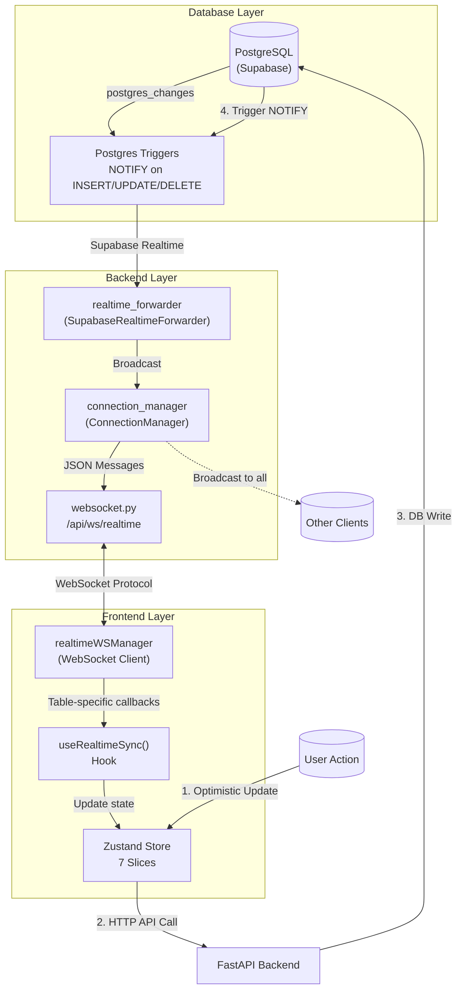

**Sources:** [backend/app/main.py:25-40](), [backend/app/api/routers/websocket.py:64-121](), [frontend/hooks/use-realtime-sync.ts:1-124]()

### Key Components

| Component | Location | Purpose |
|-----------|----------|---------|
| `realtime_forwarder` | `backend/app/services/supabase_realtime.py` | Subscribes to Supabase postgres_changes, broadcasts to WebSocket clients |
| `connection_manager` | `backend/app/services/realtime.py` | Manages active WebSocket connections, handles user-scoped broadcasting |
| `websocket.py` | `backend/app/api/routers/websocket.py` | WebSocket endpoint with cookie-based authentication |
| `realtimeWSManager` | `frontend/lib/realtime-ws.ts` | Frontend WebSocket client with reconnection logic |
| `useRealtimeSync()` | `frontend/hooks/use-realtime-sync.ts` | React hook that registers store update callbacks |

---

## Backend WebSocket Infrastructure

### Realtime Forwarder Service

The `realtime_forwarder` service is the bridge between Supabase's Postgres changes and the backend's WebSocket connections. It starts during application lifespan and runs continuously.

**Lifecycle Management:**

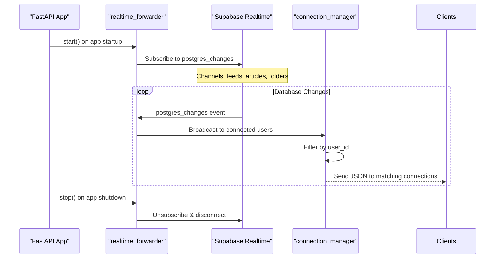

**Sources:** [backend/app/main.py:29-40]()

The forwarder subscribes to three tables: `feeds`, `articles`, and `folders`. Each subscription receives `INSERT`, `UPDATE`, and `DELETE` events with the changed row data.

**Sources:** [backend/app/api/routers/websocket.py:70-84]()

### WebSocket Endpoint

The WebSocket endpoint at `/api/ws/realtime` provides the client-facing interface for real-time updates.

**Endpoint Definition:**

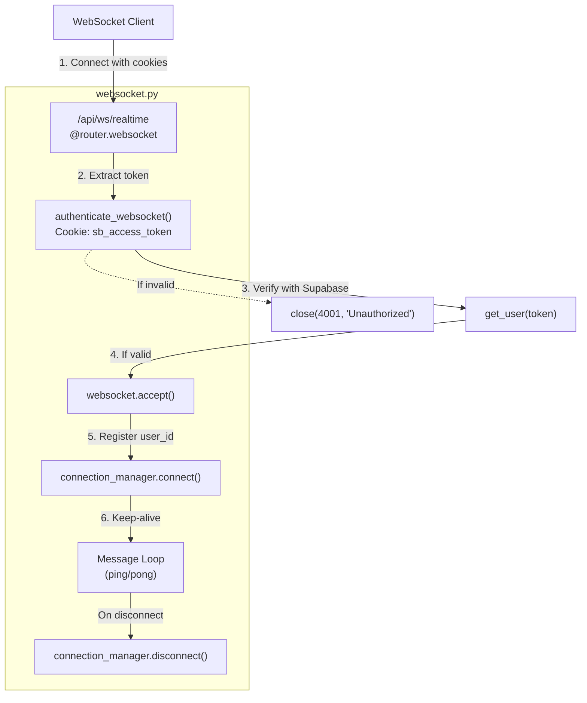

**Sources:** [backend/app/api/routers/websocket.py:64-121]()

**Authentication Flow:**

The WebSocket uses the same cookie-based authentication as HTTP endpoints:

1. Client connects with `sb_access_token` cookie
2. Server extracts token from `websocket.cookies.get(COOKIE_NAME_ACCESS)`
3. Token is validated using `client.auth.get_user(access_token)`
4. If valid, connection is accepted and registered with `user_id`
5. If invalid, connection is rejected with code `4001` (Unauthorized)

**Sources:** [backend/app/api/routers/websocket.py:30-61](), [backend/app/api/routers/websocket.py:21-22]()

### Connection Manager

The `connection_manager` service maintains a registry of active connections indexed by `user_id`, enabling user-scoped message broadcasting. This ensures clients only receive updates for their own data.

**Connection Registry Structure:**

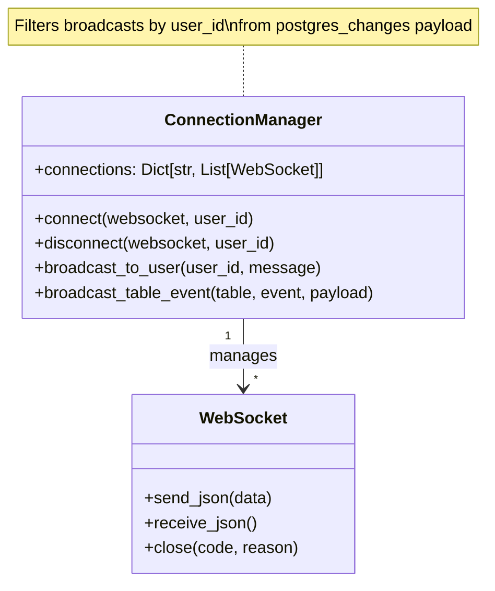

**Sources:** [backend/app/api/routers/websocket.py:12]()

---

## Frontend WebSocket Client

### Connection Management

The frontend uses `realtimeWSManager` (defined in `frontend/lib/realtime-ws.ts`) to manage WebSocket connections with automatic reconnection logic.

**WebSocket Client Features:**

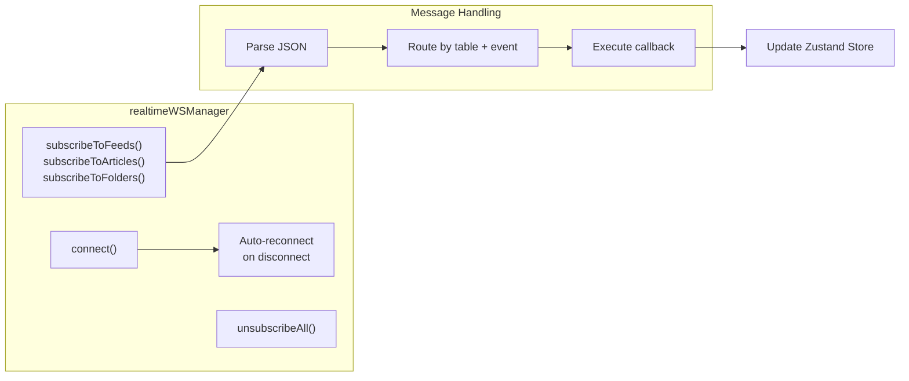

**Connection Lifecycle:**

The connection is established when the component mounts and uses credentials from HttpOnly cookies automatically sent with the WebSocket handshake.

**Sources:** [frontend/hooks/use-realtime-sync.ts:11-12]()

### Subscription System

The `useRealtimeSync()` hook registers callbacks for each table type. These callbacks transform database rows into frontend types and update the store.

**Diagram: Subscription Registration**

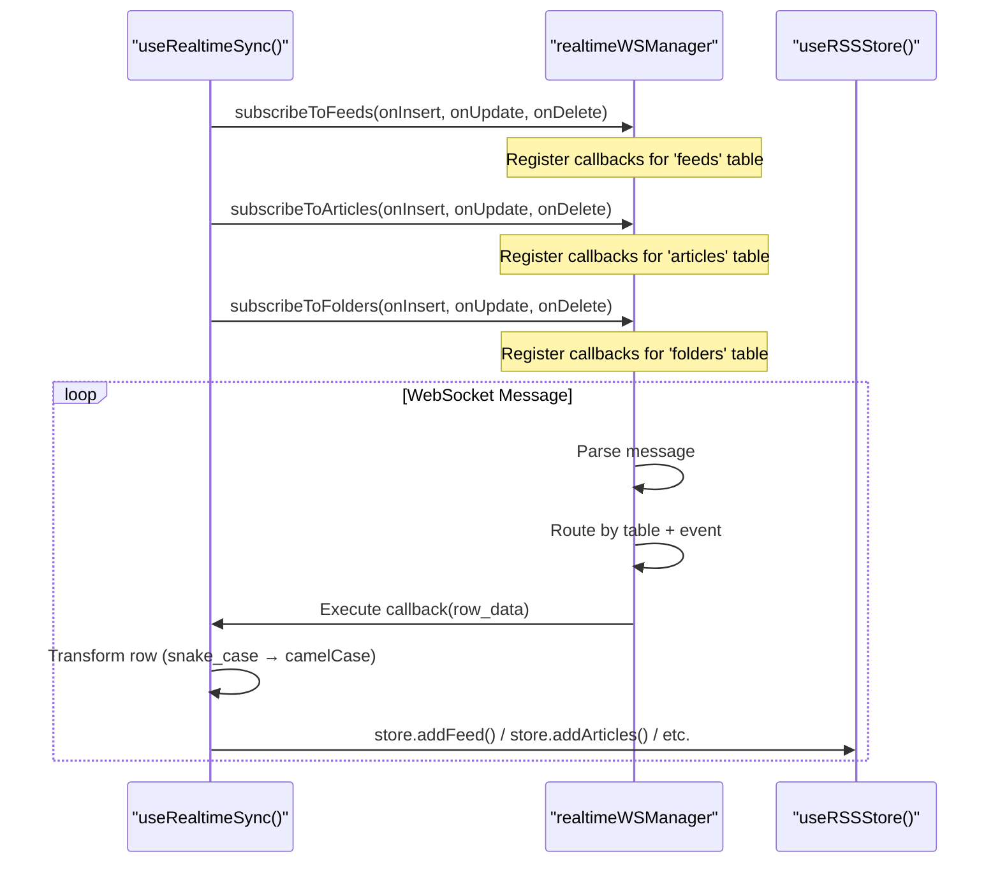

**Sources:** [frontend/hooks/use-realtime-sync.ts:14-114]()

### Feed Subscription Example

**Insert Handler:**

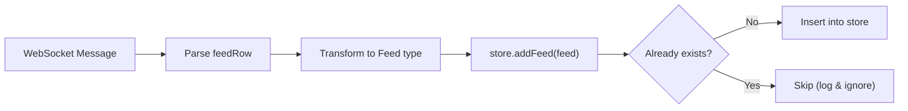

The insert handler transforms the database row format to the frontend `Feed` type:

- `feed_id` → `feedId`
- `folder_id` → `folderId`
- `unread_count` → `unreadCount`
- `refresh_interval` → `refreshInterval`
- `last_fetched` → `lastFetched` (Date object)
- `enable_deduplication` → `enableDeduplication`

**Sources:** [frontend/hooks/use-realtime-sync.ts:14-55]()

### Article Subscription Example

**Update Handler:**

Articles have special handling for updates because they need to merge with existing article state rather than replace it entirely. This preserves fields that may not be included in the update event.

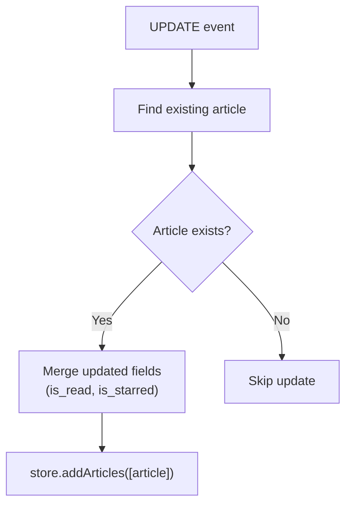

**Sources:** [frontend/hooks/use-realtime-sync.ts:58-95]()

### Folder Subscription Example

Folder operations are simpler since folders have fewer fields and less complex state interactions:

- **INSERT**: `store.addFolder(folder)` 
- **UPDATE**: `store.renameFolder(id, name)`
- **DELETE**: `store.removeFolder(id)`

**Sources:** [frontend/hooks/use-realtime-sync.ts:98-114]()

---

## Message Protocol

### Message Format

All WebSocket messages are JSON with a consistent structure:

```json
{
  "type": "postgres_changes",
  "table": "feeds" | "articles" | "folders",
  "event": "INSERT" | "UPDATE" | "DELETE",
  "payload": {
    "new": { ...row_data } | null,
    "old": { ...row_data } | null
  }
}
```

**Field Descriptions:**

| Field | Type | Description |
|-------|------|-------------|
| `type` | `"postgres_changes"` | Message type identifier |
| `table` | `string` | Database table name |
| `event` | `string` | Database operation type |
| `payload.new` | `object \| null` | New row data (INSERT/UPDATE) |
| `payload.old` | `object \| null` | Old row data (UPDATE/DELETE) |

**Sources:** [backend/app/api/routers/websocket.py:75-84]()

### Event Types by Table

**Feeds Table:**

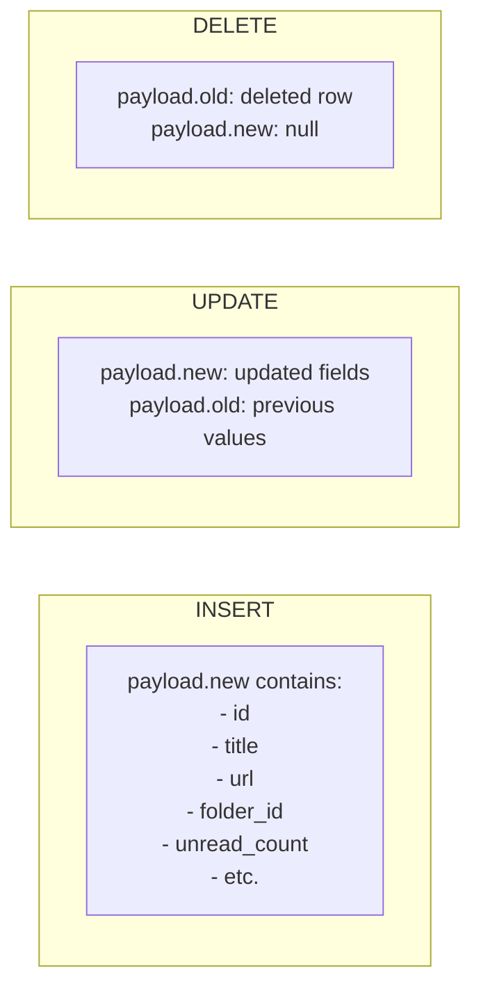

**Articles Table:**

The `articles` table events include computed fields like `repository_count` that join with the `article_repositories` table.

**Sources:** [frontend/hooks/use-realtime-sync.ts:73]()

**Folders Table:**

Folder events are simpler, containing only:
- `id` (string)
- `name` (string)
- `order` (number)
- `created_at` (ISO timestamp)

**Sources:** [frontend/hooks/use-realtime-sync.ts:98-114]()

### Heartbeat Protocol

Clients can send ping messages to verify connection health:

**Request:**
```json
{ "type": "ping" }
```

**Response:**
```json
{ "type": "pong" }
```

**Sources:** [backend/app/api/routers/websocket.py:108-109]()

---

## Connection Lifecycle

### Startup Sequence

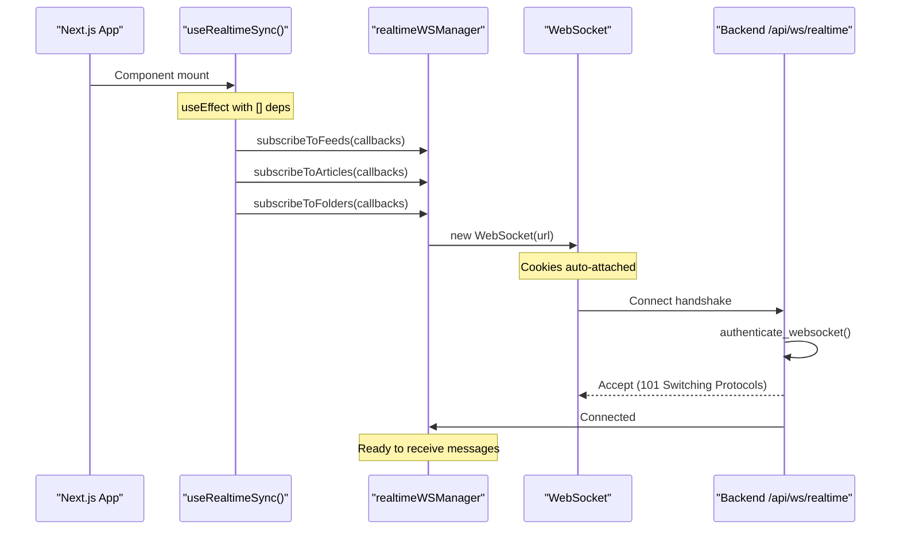

**Sources:** [frontend/hooks/use-realtime-sync.ts:11-21]()

### Message Processing Flow

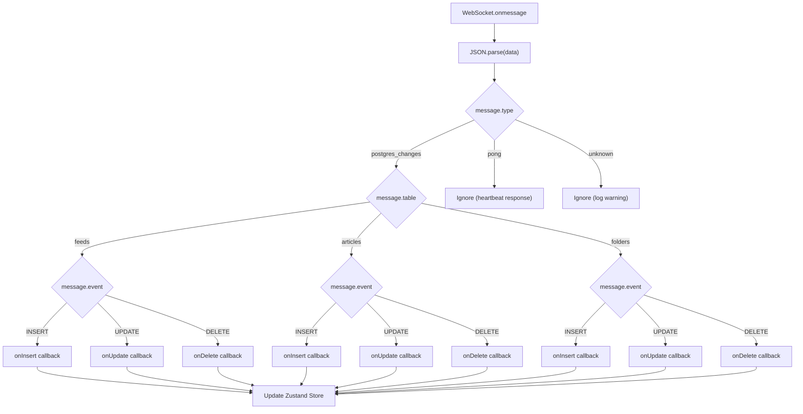

**Sources:** [frontend/hooks/use-realtime-sync.ts:14-114]()

### Cleanup Sequence

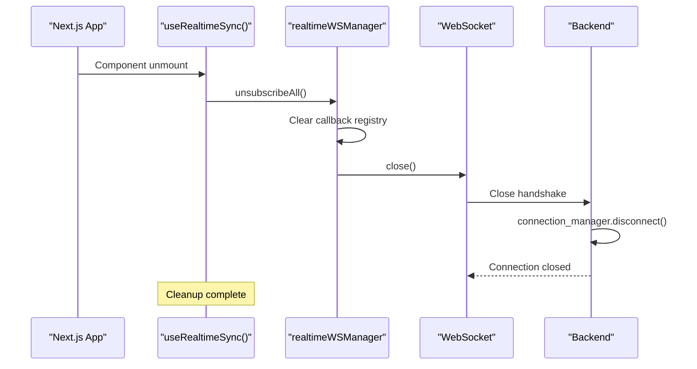

**Sources:** [frontend/hooks/use-realtime-sync.ts:116-120]()

---

## Synchronization Patterns

### Optimistic Updates

SaveHub uses **optimistic UI updates** for user-initiated actions, combined with WebSocket reconciliation for eventual consistency.

**Diagram: Optimistic Update Flow**

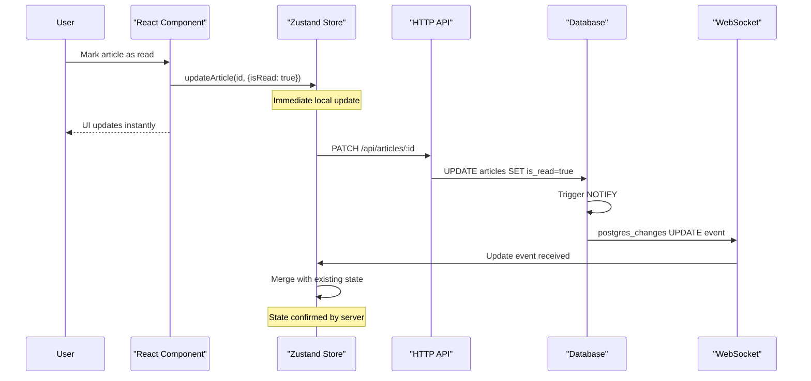

**Example from Articles API:**

The `updateArticle` function in the store immediately updates local state, then calls the backend API. If the API call fails, the optimistic update remains (no rollback), but the WebSocket will reconcile state on the next update from any source.

**Sources:** [frontend/lib/api/articles.ts:185-207]()

### Multi-Client Consistency

When one client modifies data, all other connected clients receive the change via WebSocket:

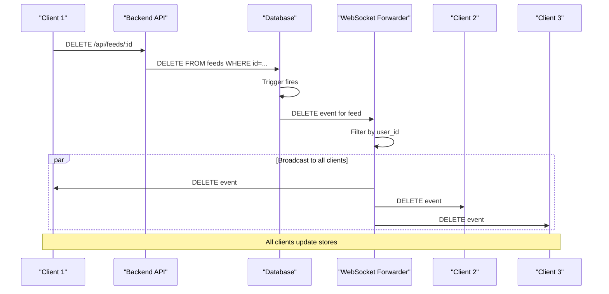

**Sources:** [backend/app/api/routers/websocket.py:70-84]()

### Rate Limiting and Deduplication

The frontend subscription handlers implement deduplication logic to handle race conditions:

1. **INSERT events** check if the item already exists before adding
2. **UPDATE events** merge changes with existing state
3. **DELETE events** use filter to safely remove even if already gone

**Example: Feed Insert Deduplication**

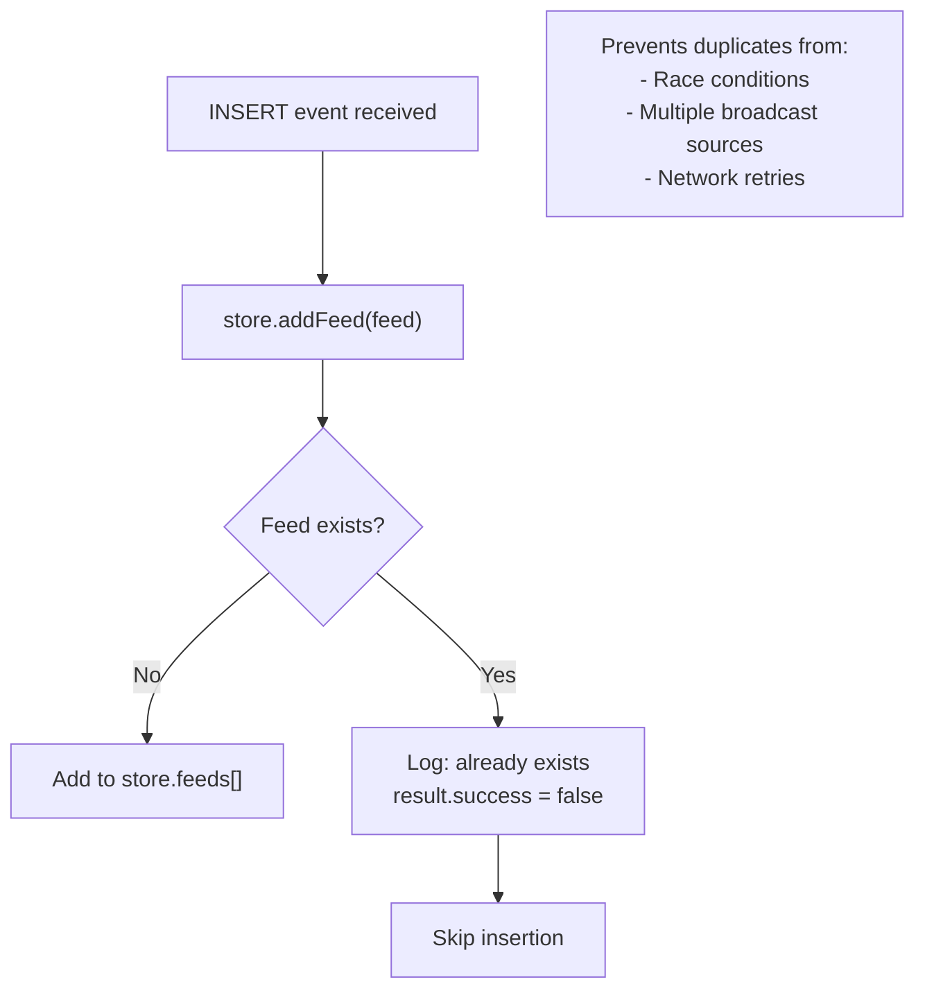

**Sources:** [frontend/hooks/use-realtime-sync.ts:30-33]()

### Authentication Token Refresh

WebSocket connections use the same cookie-based authentication as HTTP requests. The `fetchWithAuth` client handles proactive token refresh, but WebSocket connections require special handling:

**Token Expiry Handling:**

1. WebSocket uses `sb_access_token` cookie for authentication
2. If cookie expires, WebSocket authentication will fail on reconnect
3. The `AuthProvider` runs proactive refresh every 5 minutes
4. On refresh, new cookie is set, and future WebSocket reconnections use updated token

**Sources:** [frontend/lib/context/auth-context.tsx:72-86](), [frontend/lib/api/fetch-client.ts:151-156]()

### Error Handling

**Connection Errors:**

When the WebSocket connection fails or is rejected:

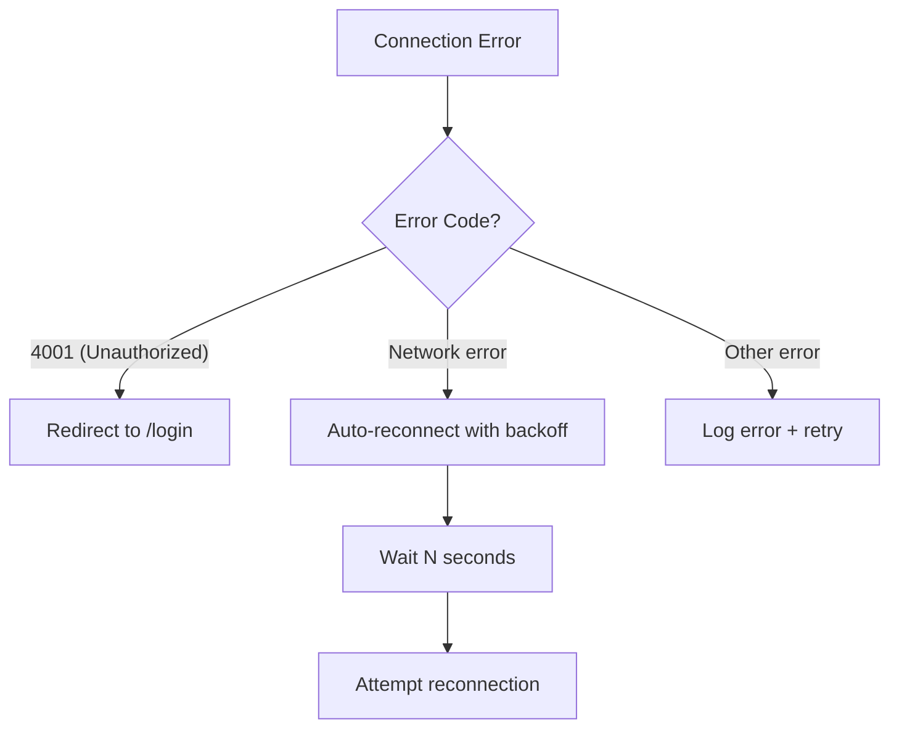

**Message Processing Errors:**

If a callback throws an error during message processing, the error is logged but other subscriptions continue processing:

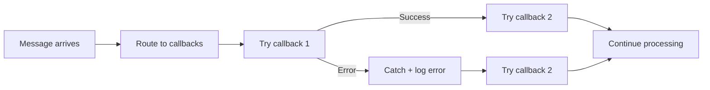

**Sources:** [backend/app/api/routers/websocket.py:111-117]()

---

## Integration Points

### HTTP API Integration

The real-time system complements HTTP APIs, creating a dual-channel pattern:

| Channel | Purpose | Examples |
|---------|---------|----------|
| **HTTP** | Commands (mutations) | Create feed, update article, delete folder |
| **WebSocket** | Queries (subscriptions) | Real-time updates, multi-client sync |

**Sources:** [frontend/lib/api/articles.ts](), [frontend/lib/api/feeds.ts](), [frontend/lib/api/folders.ts]()

### Zustand Store Integration

All WebSocket callbacks ultimately update the Zustand store through the same methods used by user actions, ensuring consistent state management:

**Store Methods Used:**

- `store.addFeed()` - Adds or updates feed
- `store.updateFeed()` - Partial update
- `store.removeFeed()` - Delete
- `store.addArticles()` - Batch upsert
- `store.addFolder()` - Add folder
- `store.renameFolder()` - Update folder name
- `store.removeFolder()` - Delete folder

**Sources:** [frontend/hooks/use-realtime-sync.ts:30-113]()

### Authentication Context Integration

The WebSocket authentication integrates with the `AuthProvider` context:

1. `AuthProvider` manages login/logout and token refresh
2. `setAuthFailureCallback()` registers logout handler
3. WebSocket receives HttpOnly cookies automatically
4. Failed WebSocket auth triggers the same logout flow as HTTP 401

**Sources:** [frontend/lib/context/auth-context.tsx:43-47]()