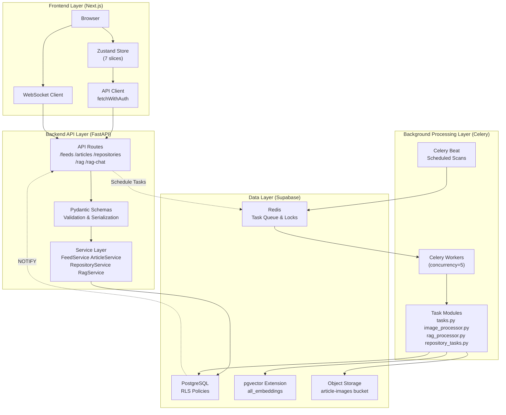
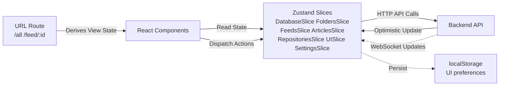
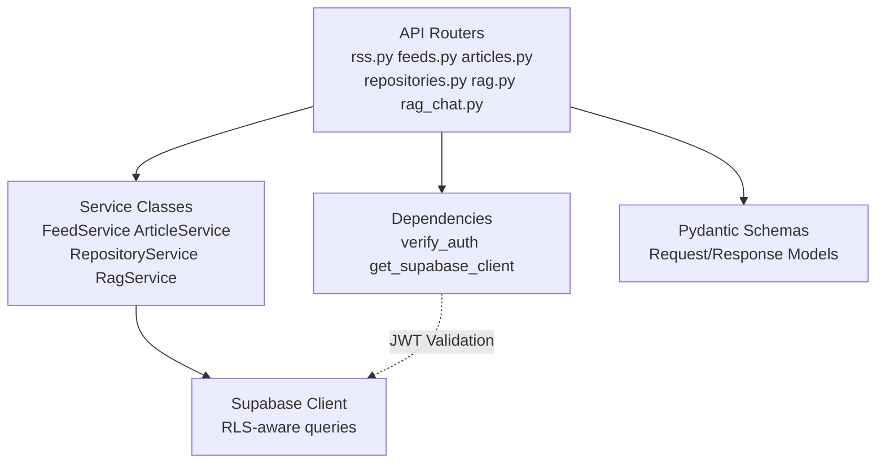
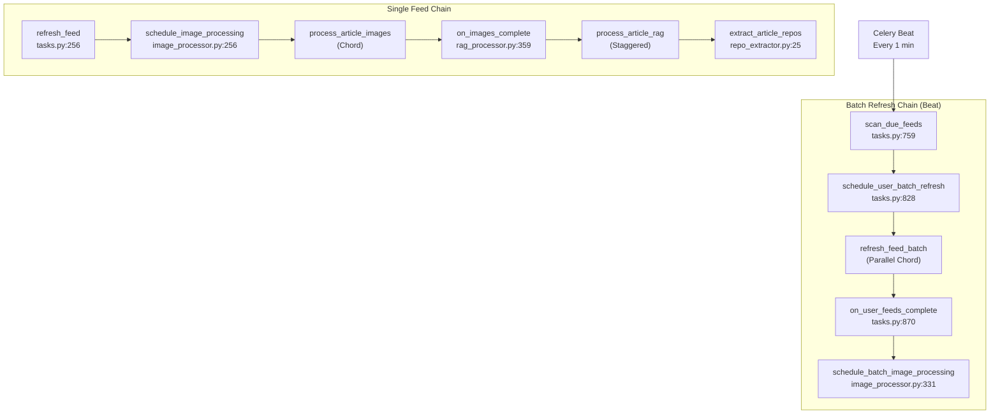
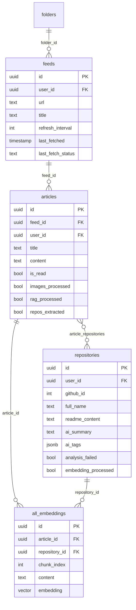
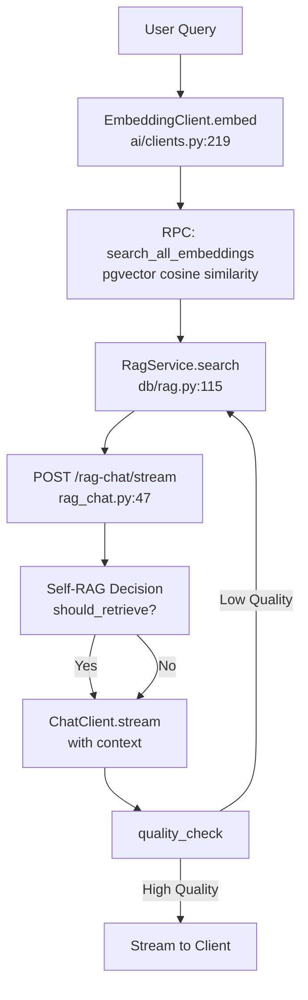
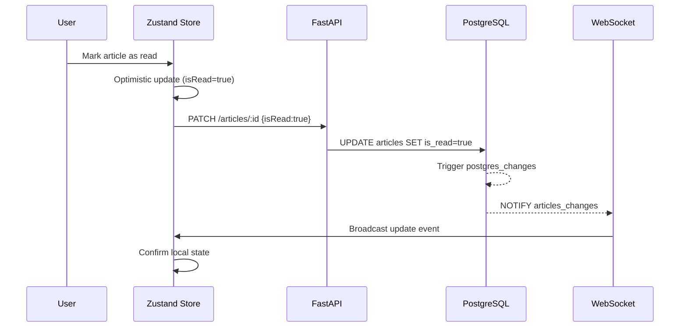
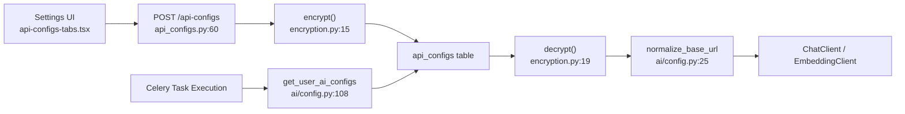

# System Architecture

<details>
<summary>Relevant source files</summary>

The following files were used as context for generating this wiki page:

- [CLAUDE.md](CLAUDE.md)
- [backend/app/api/routers/feeds.py](backend/app/api/routers/feeds.py)
- [backend/app/api/routers/rag.py](backend/app/api/routers/rag.py)
- [backend/app/api/routers/repositories.py](backend/app/api/routers/repositories.py)
- [backend/app/api/routers/websocket.py](backend/app/api/routers/websocket.py)
- [backend/app/celery_app/CLAUDE.md](backend/app/celery_app/CLAUDE.md)
- [backend/app/celery_app/celery.py](backend/app/celery_app/celery.py)
- [backend/app/celery_app/image_processor.py](backend/app/celery_app/image_processor.py)
- [backend/app/celery_app/rag_processor.py](backend/app/celery_app/rag_processor.py)
- [backend/app/celery_app/repository_tasks.py](backend/app/celery_app/repository_tasks.py)
- [backend/app/celery_app/tasks.py](backend/app/celery_app/tasks.py)
- [backend/app/main.py](backend/app/main.py)
- [backend/app/schemas/repositories.py](backend/app/schemas/repositories.py)
- [backend/app/services/ai/CLAUDE.md](backend/app/services/ai/CLAUDE.md)
- [backend/app/services/ai/__init__.py](backend/app/services/ai/__init__.py)
- [backend/app/services/ai/clients.py](backend/app/services/ai/clients.py)
- [backend/app/services/ai/config.py](backend/app/services/ai/config.py)
- [backend/app/services/ai/repository_service.py](backend/app/services/ai/repository_service.py)
- [backend/app/services/db/repositories.py](backend/app/services/db/repositories.py)
- [backend/app/services/openrank_service.py](backend/app/services/openrank_service.py)
- [backend/app/services/rag/CLAUDE.md](backend/app/services/rag/CLAUDE.md)
- [backend/app/services/rag/__init__.py](backend/app/services/rag/__init__.py)
- [backend/app/services/rag/chunker.py](backend/app/services/rag/chunker.py)
- [backend/app/services/repository_analyzer.py](backend/app/services/repository_analyzer.py)
- [backend/scripts/030_add_repository_openrank.sql](backend/scripts/030_add_repository_openrank.sql)
- [frontend/components/add-feed-dialog.tsx](frontend/components/add-feed-dialog.tsx)
- [frontend/components/repository/repository-card.tsx](frontend/components/repository/repository-card.tsx)
- [frontend/components/repository/repository-page.tsx](frontend/components/repository/repository-page.tsx)
- [frontend/lib/api/repositories.ts](frontend/lib/api/repositories.ts)
- [frontend/lib/store/repositories.slice.ts](frontend/lib/store/repositories.slice.ts)
- [frontend/lib/types.ts](frontend/lib/types.ts)

</details>


This document provides an architectural overview of SaveHub's major subsystems and their interactions. It covers the technology stack, architectural layers, content processing tracks, and key design patterns that enable SaveHub's functionality as an AI-powered RSS reader with GitHub repository integration and RAG-based semantic search.

For authentication flows and security mechanisms, see [Authentication & Security](#3.1). For real-time synchronization details, see [Real-time Synchronization](#3.2).

---

## Technology Stack

SaveHub is built on a **monorepo architecture** with clear separation between frontend, backend, and background processing layers:

| Layer | Technology | Purpose |
|-------|-----------|---------|
| **Frontend** | Next.js 14 (App Router), React 18, Zustand, Shadcn UI | User interface and client-side state management |
| **Backend API** | FastAPI, Supabase Python SDK | HTTP API endpoints and business logic |
| **Background Processing** | Celery, Redis | Asynchronous task execution (RSS refresh, AI processing) |
| **Database** | Supabase (PostgreSQL + pgvector) | Data persistence and vector similarity search |
| **Real-time** | WebSocket (FastAPI), Supabase Realtime | Live data synchronization across clients |
| **External APIs** | GitHub API, OpenRank API, OpenAI-compatible APIs | Repository data, metrics, AI capabilities |

**Key Architectural Decisions:**

1. **Supabase as unified backend**: Provides PostgreSQL database, authentication, storage, and real-time subscriptions in a single platform
2. **Celery for background tasks**: Enables complex task chains (RSS → images → RAG → repo extraction) without blocking HTTP requests
3. **Zustand for frontend state**: Lightweight state management with URL-as-source-of-truth for view routing
4. **pgvector for unified search**: Single `all_embeddings` table enables semantic search across articles and repositories
5. **OpenAI-compatible API abstraction**: Users can configure multiple AI providers (OpenAI, DeepSeek, DashScope, etc.)

Sources: [CLAUDE.md:14-65](), [backend/app/main.py:1-88](), [frontend/lib/types.ts:1-147]()

---

## Architectural Layers

### Layer Diagram



**Layer Responsibilities:**

- **Frontend Layer**: User interface, optimistic updates, state management with URL routing
- **Backend API Layer**: HTTP endpoints, validation, user-scoped queries with RLS
- **Background Processing Layer**: Long-running tasks (RSS parsing, image processing, AI analysis)
- **Data Layer**: Persistent storage, task queuing, distributed locking

Sources: [backend/app/main.py:43-77](), [frontend/lib/store/index.ts](), [backend/app/celery_app/celery.py:1-117]()

---

### Frontend Layer

The frontend uses **Next.js App Router** with **Zustand** for state management and **Shadcn UI** for components.

**State Management Pattern:**



**Key Files:**
- [frontend/lib/store/index.ts]() - Zustand store composition
- [frontend/lib/api/fetch-client.ts]() - `fetchWithAuth` HTTP client with automatic token refresh
- [frontend/app/(main)/layout.tsx]() - URL-based routing

**Pattern:** URL is single source of truth for view state (which feed, which filter). Zustand stores application data (feeds, articles, repositories) and UI preferences. API calls use optimistic updates followed by WebSocket confirmation.

Sources: [frontend/lib/store/index.ts](), [frontend/lib/api/fetch-client.ts](), [CLAUDE.md:73-78]()

---

### Backend API Layer

The backend is a **FastAPI** application that provides RESTful endpoints and WebSocket connections.

**Service Layer Architecture:**



**Key Design Patterns:**

1. **Dependency Injection**: `get_supabase_client()` and `verify_auth()` provide authenticated clients [backend/app/dependencies.py]()
2. **Service Layer**: Business logic separated from route handlers [backend/app/services/db/]()
3. **Schema Validation**: Pydantic models enforce type safety at API boundaries [backend/app/schemas/]()
4. **Row-Level Security (RLS)**: All queries automatically scoped to authenticated user via Supabase RLS

**Example Service Method:**

```python
# backend/app/services/db/feeds.py
class FeedService:
    def __init__(self, supabase: Client, user_id: str):
        self.supabase = supabase
        self.user_id = user_id
    
    def load_feeds(self) -> List[dict]:
        response = self.supabase.table("feeds") \
            .select("*") \
            .eq("user_id", self.user_id) \  # RLS enforcement
            .order("order") \
            .execute()
        return response.data or []
```

Sources: [backend/app/main.py:58-77](), [backend/app/api/routers/feeds.py:23-45](), [backend/app/services/db/feeds.py]()

---

### Background Processing Layer

**Celery** handles asynchronous processing with **Redis** as broker and result backend.

**Task Orchestration Patterns:**



**Key Files:**
- [backend/app/celery_app/tasks.py]() - RSS feed refresh tasks
- [backend/app/celery_app/image_processor.py]() - Image download and compression
- [backend/app/celery_app/rag_processor.py]() - RAG embedding generation
- [backend/app/celery_app/repository_tasks.py]() - GitHub repository sync
- [backend/app/celery_app/repo_extractor.py]() - Extract GitHub links from articles

**Coordination Mechanisms:**

| Mechanism | Implementation | Purpose |
|-----------|----------------|---------|
| **Task Locks** | Redis keys `tasklock:feed:{feed_id}` | Prevent duplicate execution |
| **Rate Limiting** | [backend/app/celery_app/rate_limiter.py]() | 1 req/sec per domain |
| **Retry Logic** | `@app.task(max_retries=3, retry_backoff=True)` | Exponential backoff |
| **Chord Pattern** | Celery Chord for parallel tasks + callback | Wait for batch completion |

Sources: [backend/app/celery_app/celery.py:26-116](), [backend/app/celery_app/CLAUDE.md:1-150](), [backend/app/celery_app/tasks.py:242-267]()

---

### Data Layer

**Supabase PostgreSQL** with **pgvector** extension provides both relational and vector storage.

**Core Tables:**



**Unified Embeddings Architecture:**

The `all_embeddings` table stores vector embeddings for both articles and repositories, enabling cross-content semantic search. Each row has either `article_id` OR `repository_id` set (never both).

**Status Tracking Pattern:**

Processing status uses tri-state flags (`NULL` / `true` / `false`):
- `NULL`: Not yet processed
- `true`: Successfully processed
- `false`: Processing failed

This allows selective reprocessing and compensatory scans by Celery Beat tasks [backend/app/celery_app/rag_processor.py:269-289]().

Sources: [backend/app/services/db/](), [backend/scripts/](), Diagram 3 from provided context

---

## Content Processing Tracks

SaveHub processes three distinct content types through parallel pipelines:

### Track 1: RSS Feed Articles


**Key Processing Steps:**

1. **RSS Parsing**: [backend/app/services/rss_parser.py]() - Fetches and parses RSS feeds
2. **Image Processing**: [backend/app/celery_app/image_processor.py:435-556]() - Downloads, compresses (WebP), uploads to Supabase Storage
3. **RAG Processing**: [backend/app/celery_app/rag_processor.py:87-267]() - Generates image captions via Vision API, performs semantic chunking, creates embeddings
4. **Repository Extraction**: [backend/app/celery_app/repo_extractor.py:58-156]() - Extracts GitHub URLs from article content

**Deduplication:** Articles with matching `content_hash` (SHA-256 of title+content) are skipped if feed has `enable_deduplication=true` [backend/app/services/db/articles.py]().

Sources: [backend/app/celery_app/tasks.py:57-217](), [backend/app/celery_app/CLAUDE.md:9-33](), [backend/app/services/rss_parser.py]()

---

### Track 2: GitHub Repositories


**Repository Processing Pipeline:**

1. **GitHub Sync**: [backend/app/api/routers/repositories.py:304-351]() - Fetches starred repositories with pagination
2. **README Fetching**: Only fetches for new repos or when `pushed_at` changed [backend/app/celery_app/repository_tasks.py:64-82]()
3. **AI Analysis**: [backend/app/services/repository_analyzer.py:19-104]() - Extracts structured metadata (summary, tags, platforms) from README
4. **OpenRank**: [backend/app/services/openrank_service.py:19-68]() - Fetches developer influence metrics
5. **Embedding**: [backend/app/celery_app/repository_tasks.py:294-324]() - Combines metadata + README for semantic search

**Fallback Logic:** If AI analysis fails, uses rule-based platform detection from language and keywords [backend/app/services/ai/repository_service.py:207-268]().

Sources: [backend/app/api/routers/repositories.py:48-301](), [backend/app/celery_app/repository_tasks.py:35-165](), [backend/app/services/repository_analyzer.py]()

---

### Track 3: RAG & Semantic Search



**Self-RAG Chat Implementation:**

The RAG chat uses a **self-reflective retrieval** pattern [backend/app/api/routers/rag_chat.py:47-185]():

1. **Retrieval Decision**: LLM decides if retrieval is needed based on query
2. **Vector Search**: `search_all_embeddings()` RPC searches unified embeddings table
3. **Answer Generation**: Streams response with `[REF-{index}]` markers
4. **Quality Check**: LLM evaluates answer quality, triggers re-retrieval if low

**Search RPC Function:**

```sql
-- RPC: search_all_embeddings(query_embedding, top_k, min_score, user_id)
CREATE OR REPLACE FUNCTION search_all_embeddings(
  query_embedding vector(1536),
  top_k int DEFAULT 10,
  min_score float DEFAULT 0.0,
  user_id_param uuid DEFAULT NULL
)
RETURNS TABLE (...) AS $$
  SELECT ... FROM all_embeddings
  WHERE user_id = user_id_param
  ORDER BY embedding <=> query_embedding
  LIMIT top_k
$$ LANGUAGE sql;
```

Sources: [backend/app/api/routers/rag_chat.py:47-185](), [backend/app/services/db/rag.py:115-167](), Diagram 4 from provided context

---

## Key Architectural Patterns

### 1. Separation of Synchronous and Asynchronous Operations

**Design Principle:** User-facing operations (HTTP requests) are synchronous and fast. Heavy processing (RSS parsing, AI analysis) is asynchronous via Celery.

**Implementation:**

| Operation | Handler | Response Time |
|-----------|---------|---------------|
| Add Feed | `POST /feeds` → schedules `refresh_feed` | < 200ms |
| Sync Repos | `POST /repositories/sync` → SSE stream | Real-time progress |
| RAG Query | `POST /rag/query` → vector search | < 500ms |
| RSS Refresh | `refresh_feed` Celery task | 10-60s |
| Image Processing | Celery Chord (parallel) | 5-30s |

Sources: [backend/app/api/routers/feeds.py:47-116](), [backend/app/celery_app/tasks.py:242-446]()

---

### 2. Chain of Responsibility (Celery Task Chains)

**Pattern:** Each task completes one step and triggers the next, with status tracking to enable retries.

**Example Chain:**

```
refresh_feed → schedule_image_processing → [process_article_images × N] 
  → on_images_complete → schedule_rag_for_articles → [process_article_rag × N]
  → extract_article_repos
```

**Status Fields:**

- `images_processed`: `NULL` → triggers image processing
- `rag_processed`: `NULL` AND `images_processed=true` → triggers RAG
- `repos_extracted`: `NULL` AND `rag_processed=true` → triggers extraction

**Compensatory Scans:** [backend/app/celery_app/celery.py:98-115]()
- `scan_due_feeds`: Every 1 minute - finds feeds due for refresh
- `scan_pending_rag_articles`: Every 30 minutes - retries failed RAG
- `scan_pending_repo_extraction`: Every 30 minutes - retries failed extraction

Sources: [backend/app/celery_app/CLAUDE.md:9-115](), [backend/app/celery_app/tasks.py:87-217]()

---

### 3. Optimistic Updates with WebSocket Confirmation

**Pattern:** Frontend updates local state immediately (optimistic), then backend updates database and broadcasts changes via WebSocket.

**Flow:**



**Implementation:**

- Frontend: [frontend/lib/store/articles.slice.ts]() - `setArticleRead()` optimistically updates
- Backend: [backend/app/services/supabase_realtime.py]() - Subscribes to `postgres_changes`
- WebSocket: [backend/app/api/routers/websocket.py:74-102]() - Forwards changes to connected clients

Sources: [frontend/lib/store/articles.slice.ts](), [backend/app/services/supabase_realtime.py](), Diagram 5 from provided context

---

### 4. Configuration-Driven AI Integration

**Pattern:** Users configure multiple AI providers (OpenAI, DeepSeek, DashScope) via encrypted `api_configs` table. Services dynamically load active config at runtime.

**Configuration Flow:**



**Key Functions:**

- [backend/app/services/ai/config.py:25-76]() - `normalize_base_url()` ensures API base ends with `/v1`
- [backend/app/services/ai/config.py:108-154]() - `get_user_ai_configs()` loads and decrypts all active configs
- [backend/app/services/encryption.py:15-23]() - AES encryption for API keys

Sources: [backend/app/services/ai/config.py](), [backend/app/api/routers/api_configs.py:60-85](), Diagram 4 from provided context

---

## Integration Points

### External API Integrations

| Service | Purpose | Rate Limiting | Error Handling |
|---------|---------|---------------|----------------|
| **GitHub API** | Fetch starred repos, README content | 5000 req/hour (authenticated) | Retry with backoff [backend/app/api/routers/repositories.py:304-351]() |
| **OpenRank API** | Developer influence metrics | Public API, no auth | Graceful degradation [backend/app/services/openrank_service.py:19-68]() |
| **OpenAI-compatible APIs** | Chat, embeddings, vision | Provider-specific | Config validation + fallback [backend/app/services/ai/clients.py:88-219]() |
| **RSS Feeds** | Article content | 1 req/sec per domain | Domain-based rate limiter [backend/app/celery_app/rate_limiter.py]() |

### Inter-Service Communication

**Three Communication Patterns:**

1. **HTTP API Calls**: Frontend → Backend [frontend/lib/api/]()
2. **Task Scheduling**: Backend → Celery via Redis [backend/app/celery_app/tasks.py:482-506]()
3. **WebSocket Events**: Backend → Frontend via WebSocket [backend/app/services/supabase_realtime.py:45-80]()

**Message Flow:**

```mermaid
graph TB
    Frontend["Frontend<br/>fetchWithAuth()"]
    BackendHTTP["Backend HTTP<br/>FastAPI Routes"]
    Celery["Celery Workers"]
    Redis["Redis Broker"]
    Postgres["PostgreSQL"]
    WSManager["WebSocket Manager"]
    
    Frontend -->|1. HTTP Request| BackendHTTP
    BackendHTTP -->|2. Validate & Process| Postgres
    BackendHTTP -.3. Schedule Task.-> Redis
    Redis -->|4. Dequeue| Celery
    Celery -->|5. Process| Postgres
    Postgres -.6. NOTIFY.-> WSManager
    WSManager -->|7. Broadcast| Frontend
```

Sources: [frontend/lib/api/fetch-client.ts:1-123](), [backend/app/services/supabase_realtime.py:45-112](), [backend/app/celery_app/tasks.py:448-506]()

---

## Security and Isolation

**User Data Isolation:**

1. **Row-Level Security (RLS)**: All Supabase tables have RLS policies enforcing `user_id` filters
2. **JWT Authentication**: All API requests require valid Supabase JWT [backend/app/dependencies.py:21-42]()
3. **Service Role Client**: Background tasks use service role key but explicitly filter by `user_id` [backend/app/celery_app/supabase_client.py:11-21]()

**SSRF Protection:**

Image proxy validates URLs to prevent SSRF attacks [backend/app/api/routers/proxy.py:35-58]():
- Blocks private IP ranges (RFC 1918)
- Blocks localhost (127.0.0.0/8)
- Blocks link-local addresses (169.254.0.0/16)

For detailed authentication flows, see [Authentication & Security](#3.1).

Sources: [backend/app/dependencies.py:21-42](), [backend/app/api/routers/proxy.py:35-58](), [backend/app/celery_app/supabase_client.py:11-21]()

---

## Summary

SaveHub's architecture is characterized by:

1. **Clear Layer Separation**: Frontend (Next.js) → Backend API (FastAPI) → Background Processing (Celery) → Data (Supabase)
2. **Three Content Tracks**: RSS articles, GitHub repositories, and RAG-powered semantic search converge in unified embeddings
3. **Async/Sync Split**: User requests are fast (< 500ms), heavy processing is asynchronous with progress tracking
4. **Flexible AI Integration**: Multi-provider support via encrypted configuration and OpenAI-compatible abstraction
5. **Real-time Synchronization**: Optimistic updates + WebSocket confirmation for responsive UX
6. **Reliable Processing**: Celery chains with status tracking, retries, and compensatory scans ensure eventual consistency

The architecture supports horizontal scaling (add Celery workers) while maintaining consistency through distributed locking and user data isolation via RLS.