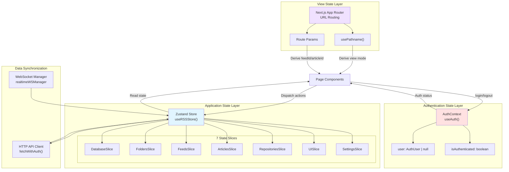
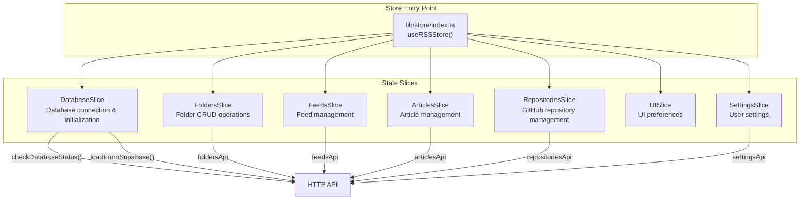
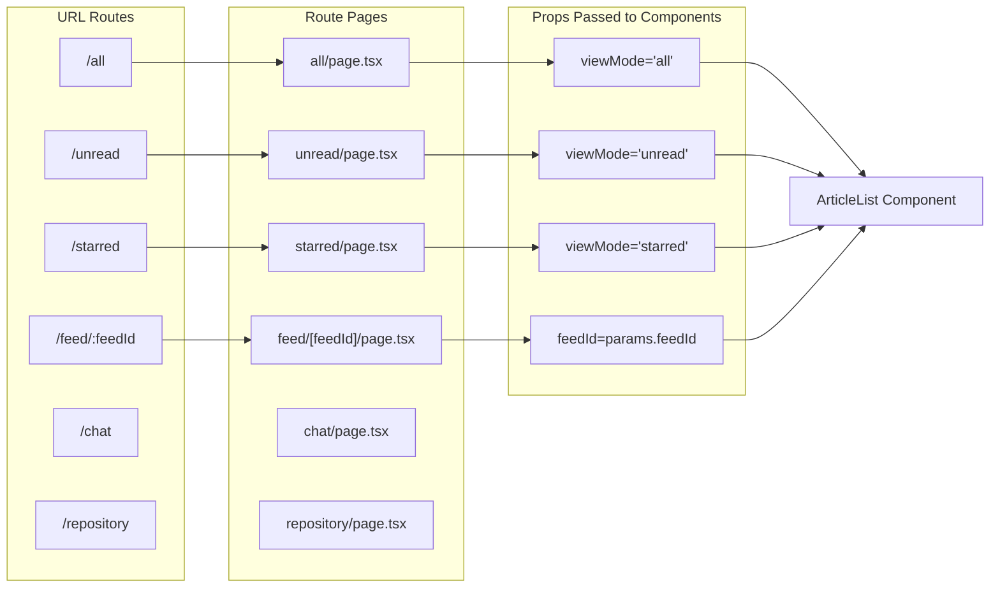
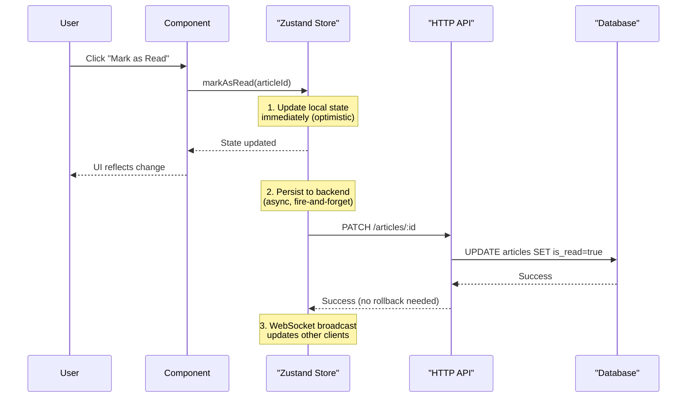
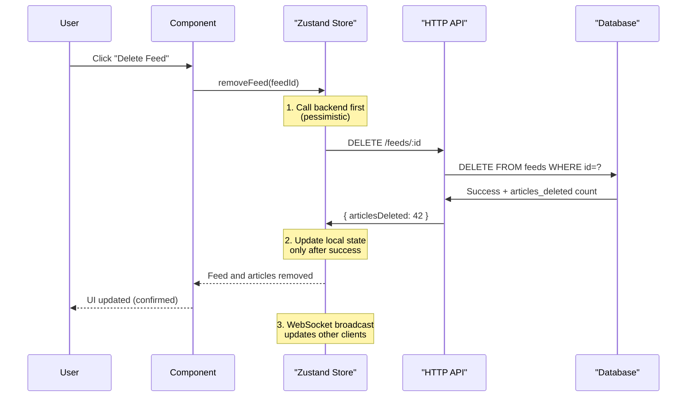
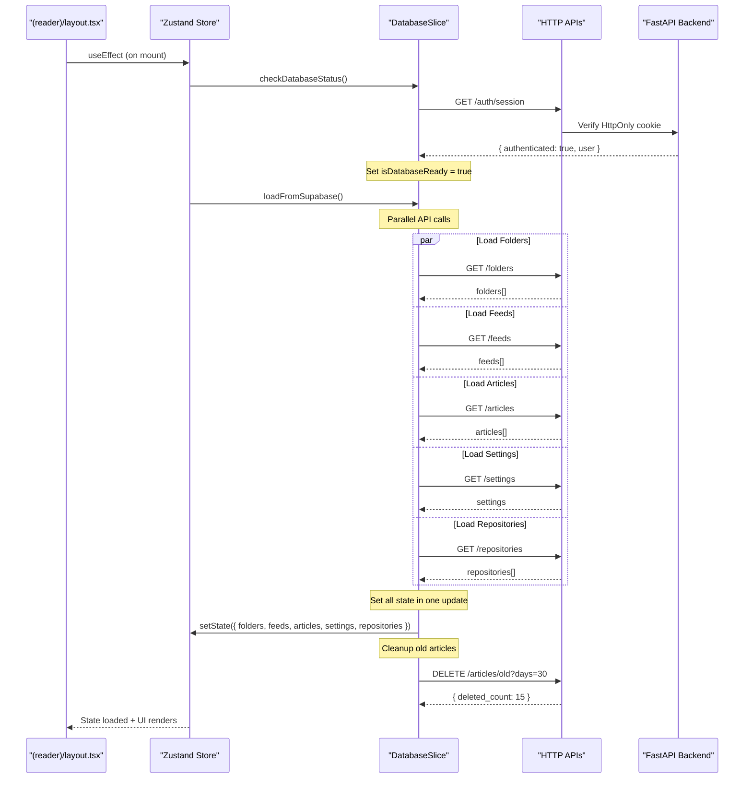
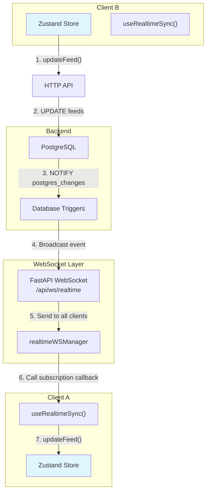
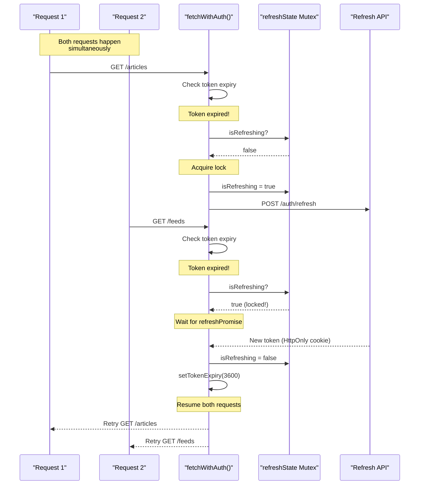
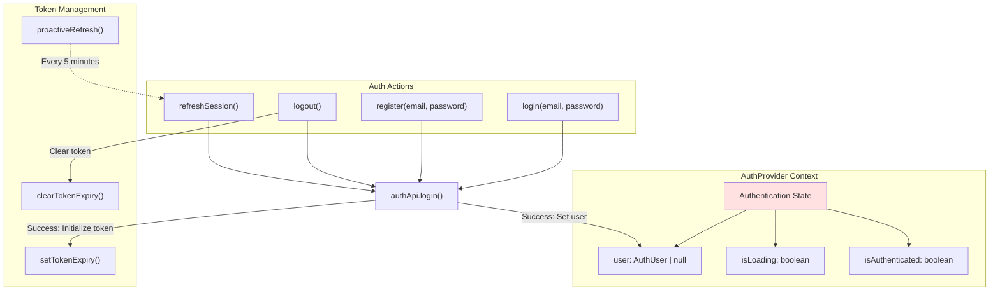

# State Management

<details>
<summary>Relevant source files</summary>

The following files were used as context for generating this wiki page:

- [frontend/CLAUDE.md](frontend/CLAUDE.md)
- [frontend/app/(reader)/settings/storage/page.tsx](frontend/app/(reader)/settings/storage/page.tsx)
- [frontend/components/edit-feed-form.tsx](frontend/components/edit-feed-form.tsx)
- [frontend/components/sidebar/collapsed-view.tsx](frontend/components/sidebar/collapsed-view.tsx)
- [frontend/components/sidebar/expanded-view.tsx](frontend/components/sidebar/expanded-view.tsx)
- [frontend/components/sidebar/index.tsx](frontend/components/sidebar/index.tsx)
- [frontend/hooks/use-realtime-sync.ts](frontend/hooks/use-realtime-sync.ts)
- [frontend/lib/api-validation.ts](frontend/lib/api-validation.ts)
- [frontend/lib/api/api-configs.ts](frontend/lib/api/api-configs.ts)
- [frontend/lib/api/articles.ts](frontend/lib/api/articles.ts)
- [frontend/lib/api/feeds.ts](frontend/lib/api/feeds.ts)
- [frontend/lib/api/fetch-client.ts](frontend/lib/api/fetch-client.ts)
- [frontend/lib/api/folders.ts](frontend/lib/api/folders.ts)
- [frontend/lib/api/github.ts](frontend/lib/api/github.ts)
- [frontend/lib/api/settings.ts](frontend/lib/api/settings.ts)
- [frontend/lib/context/auth-context.tsx](frontend/lib/context/auth-context.tsx)
- [frontend/lib/store/database.slice.ts](frontend/lib/store/database.slice.ts)

</details>


## Purpose and Scope

This document describes the frontend state management architecture in SaveHub, which uses Zustand for application state, Next.js App Router for view state, and a dual-channel synchronization strategy combining HTTP APIs and WebSocket for data consistency. The architecture follows a modular slice-based pattern with seven domain-specific state slices.

For authentication token management and refresh mechanisms, see [Authentication & Security](#3.1). For WebSocket real-time synchronization architecture, see [Real-time Synchronization](#3.2). For HTTP API client implementation details, see [API Client Layer](#4.5).

---

## Architecture Overview

SaveHub's state management architecture follows a clean separation of concerns with three distinct state management layers:

### State Management Layers



**Sources:** [frontend/lib/store/database.slice.ts:1-119](), [frontend/lib/context/auth-context.tsx:1-142](), [frontend/lib/api/fetch-client.ts:1-239](), [frontend/hooks/use-realtime-sync.ts:1-125]()

---

## The Seven State Slices

SaveHub's Zustand store is divided into seven modular slices, each responsible for a specific domain. This modular architecture enables better code organization, type safety, and independent slice evolution.

### Slice Architecture Diagram



**Sources:** [frontend/lib/store/database.slice.ts:1-119](), [frontend/CLAUDE.md:126-135]()

### 1. DatabaseSlice

The **DatabaseSlice** manages database connection state and orchestrates initial data loading.

| Property | Type | Purpose |
|----------|------|---------|
| `isDatabaseReady` | `boolean` | Connection status flag |
| `checkDatabaseStatus()` | `async function` | Validates authentication via backend session endpoint |
| `loadFromSupabase()` | `async function` | Loads all data in parallel from HTTP APIs |
| `syncToSupabase()` | `async function` | No-op (kept for backward compatibility) |

**Key Responsibilities:**
- Check user authentication status via `authApi.getSession()`
- Parallel data loading: folders, feeds, articles, settings, repositories
- Automatic old article cleanup based on retention settings
- Set initial loading state

**Sources:** [frontend/lib/store/database.slice.ts:21-119]()

### 2. FoldersSlice

The **FoldersSlice** manages folder state and CRUD operations.

| Action | HTTP Endpoint | Pattern |
|--------|--------------|---------|
| `addFolder()` | `POST /api/backend/folders` | Optimistic update |
| `renameFolder()` | `PUT /api/backend/folders/:id` | Optimistic update |
| `removeFolder()` | `DELETE /api/backend/folders/:id` | Pessimistic update |
| `reorderFolders()` | Batch `PUT` calls | Optimistic update |

**Sources:** [frontend/lib/api/folders.ts:1-149]()

### 3. FeedsSlice

The **FeedsSlice** manages RSS feed subscriptions.

| Action | HTTP Endpoint | Pattern |
|--------|--------------|---------|
| `addFeed()` | `POST /api/backend/feeds` | Optimistic update |
| `updateFeed()` | `PUT /api/backend/feeds/:id` | Optimistic update |
| `removeFeed()` | `DELETE /api/backend/feeds/:id` | Pessimistic update |
| `moveFeed()` | `PUT /api/backend/feeds/:id` | Optimistic update |
| `getUnreadCount()` | Computed | From articles array |

**Duplicate Detection:** Feed creation throws `"duplicate"` error if URL already exists (HTTP 409 status).

**Sources:** [frontend/lib/api/feeds.ts:1-203](), [frontend/components/edit-feed-form.tsx:68-149]()

### 4. ArticlesSlice

The **ArticlesSlice** manages article state and read/starred status.

| Action | HTTP Endpoint | Pattern |
|--------|--------------|---------|
| `addArticles()` | `POST /api/backend/articles` | Optimistic deduplication |
| `updateArticle()` | `PATCH /api/backend/articles/:id` | Optimistic update |
| `markAsRead()` | `PATCH /api/backend/articles/:id` | Optimistic update |
| `toggleStar()` | `PATCH /api/backend/articles/:id` | Optimistic update |
| `getFilteredArticles()` | Computed | From articles array |

**Deduplication:** Articles are deduplicated by `id` before insertion into the store.

**Sources:** [frontend/lib/api/articles.ts:1-280]()

### 5. RepositoriesSlice

The **RepositoriesSlice** manages GitHub starred repositories.

| Action | HTTP Endpoint | Pattern |
|--------|--------------|---------|
| `loadRepositories()` | `GET /api/backend/repositories` | HTTP fetch |
| `syncRepositories()` | `POST /api/backend/repositories/sync` | SSE streaming |
| `updateRepository()` | `PUT /api/backend/repositories/:id` | Optimistic update |

**Sync Progress:** Repository sync uses Server-Sent Events (SSE) for real-time progress updates during the GitHub sync operation.

**Sources:** [frontend/CLAUDE.md:126-135]()

### 6. UISlice

The **UISlice** manages ephemeral UI state not persisted to the database.

| Property | Type | Purpose |
|----------|------|---------|
| `isSidebarCollapsed` | `boolean` | Sidebar expansion state |
| `toggleSidebar()` | `function` | Toggle sidebar visibility |

**Note:** View state (viewMode, selectedFeedId) is **not** stored in UISlice. These are derived from URL routing (see URL-as-Source-of-Truth section below).

**Sources:** [frontend/components/sidebar/index.tsx:14-128]()

### 7. SettingsSlice

The **SettingsSlice** manages user preferences persisted to the database.

| Setting | Type | Default | Purpose |
|---------|------|---------|---------|
| `theme` | `"light" \| "dark" \| "system"` | `"system"` | Color theme |
| `fontSize` | `number` | `16` | Article content font size |
| `autoRefresh` | `boolean` | `true` | Auto-refresh feeds |
| `refreshInterval` | `number` | `30` | Feed refresh interval (minutes) |
| `articlesRetentionDays` | `number` | `30` | Article retention period |
| `markAsReadOnScroll` | `boolean` | `false` | Auto-mark as read |
| `showThumbnails` | `boolean` | `true` | Display article thumbnails |
| `sidebarPinned` | `boolean` | `false` | Sidebar pin state |
| `githubToken` | `string \| undefined` | `undefined` | GitHub Personal Access Token |

**Update Pattern:** `updateSettings()` performs optimistic updates followed by `PUT /api/backend/settings` for persistence.

**Sources:** [frontend/lib/api/settings.ts:1-119](), [frontend/app/(reader)/settings/storage/page.tsx:1-75]()

---

## URL-as-Source-of-Truth Pattern

SaveHub uses Next.js App Router URLs as the **single source of truth** for view state. View state includes current view mode (all/unread/starred) and selected feed/article IDs. This pattern eliminates the need to synchronize view state between URL and Zustand store.

### View State Derivation



**Sources:** [frontend/CLAUDE.md:96-125]()

### Benefits of URL-Driven State

| Benefit | Description |
|---------|-------------|
| **Browser Integration** | Back/forward buttons work natively |
| **Shareable URLs** | Users can bookmark and share specific views |
| **No Sync Complexity** | No need to synchronize URL ↔ Store |
| **Server Rendering Ready** | Routes can be server-rendered in the future |
| **Type Safety** | Route parameters are type-checked by Next.js |

### Navigation Pattern

Components use `<Link>` and `useRouter()` for navigation, **never** direct store mutations:

```typescript
// ✅ CORRECT: URL-based navigation
import { useRouter } from "next/navigation"
import Link from "next/link"

// In components
<Link href="/all">All Articles</Link>
<Link href={`/feed/${feedId}`}>View Feed</Link>

// In handlers
const router = useRouter()
router.push("/unread")
```

```typescript
// ❌ WRONG: Store-based navigation (don't do this)
setViewMode("all")  // This doesn't exist in the store!
```

**Sources:** [frontend/CLAUDE.md:96-125](), [frontend/components/sidebar/expanded-view.tsx:195-199]()

---

## State Update Patterns

SaveHub employs two distinct update patterns depending on the criticality and reversibility of the operation.

### Optimistic Update Pattern

Optimistic updates immediately modify local state, then persist to the backend asynchronously. This provides instant UI feedback.



**Used For:**
- Article read/starred status
- Feed title/description updates
- Folder renames
- Settings changes

**Rollback Behavior:** Most optimistic operations do not implement rollback on failure. This is a known technical debt item (see [frontend/CLAUDE.md:419-447]()).

**Sources:** [frontend/lib/api/articles.ts:184-207](), [frontend/components/edit-feed-form.tsx:117-121]()

### Pessimistic Update Pattern

Pessimistic updates persist to the backend first, then update local state only on success. This ensures data consistency for critical operations.



**Used For:**
- Feed deletion
- Folder deletion
- Account deletion
- Any operation that cannot be easily rolled back

**Error Handling:** Pessimistic operations return errors to the caller, allowing UI to display error messages without corrupting local state.

**Sources:** [frontend/lib/api/feeds.ts:177-191](), [frontend/lib/api/api-configs.ts:184-193]()

---

## State Synchronization Strategies

SaveHub maintains state consistency across multiple clients through a dual-channel synchronization strategy: HTTP for initial load and mutations, WebSocket for real-time updates.

### Initial Data Load Sequence



**Sources:** [frontend/lib/store/database.slice.ts:66-118]()

### Real-Time Synchronization via WebSocket

The `useRealtimeSync()` hook subscribes to database changes and updates the store when other clients make modifications.



**Subscription Callbacks:**

| Table | Insert Callback | Update Callback | Delete Callback |
|-------|----------------|-----------------|-----------------|
| `feeds` | `addFeed()` | `updateFeed()` | `removeFeed()` |
| `articles` | `addArticles()` | `addArticles()` | Remove from state |
| `folders` | `addFolder()` | `renameFolder()` | `removeFolder()` |

**Conflict Resolution:** Last-write-wins. No optimistic concurrency control (OCC) or version checking is implemented.

**Sources:** [frontend/hooks/use-realtime-sync.ts:1-125]()

### Token Refresh Strategy

The `fetchWithAuth()` client automatically refreshes expired JWT tokens using a mutex-locked refresh mechanism.



**Key Features:**
- **Mutex Protection:** Only one refresh happens at a time, even with concurrent requests
- **Request Retry:** Failed requests automatically retry after successful refresh
- **Proactive Refresh:** Token refreshes 5 minutes before expiry (configurable buffer)
- **Auth Failure Callback:** Redirects to `/login` on refresh failure

**Sources:** [frontend/lib/api/fetch-client.ts:1-239](), [frontend/lib/context/auth-context.tsx:72-86]()

---

## Authentication State Management

Authentication state is managed separately from the Zustand store via React Context to avoid coupling authentication with application state.

### AuthContext Architecture



**Separation Rationale:**
- Authentication is cross-cutting and affects all API calls
- Auth state changes trigger redirects (side effects), not just state updates
- Token refresh needs global coordination across all HTTP requests
- Auth errors require special handling (logout + redirect)

**Sources:** [frontend/lib/context/auth-context.tsx:1-142]()

---

## Implementation Examples

### Example 1: Adding a Feed

```typescript
// Component dispatches action
const { addFeed } = useRSSStore()

const result = await addFeed({
  title: "Example Blog",
  url: "https://example.com/feed.xml",
  folderId: selectedFolderId,
})

if (!result.success) {
  toast({ title: "Error", description: result.message })
}
```

**Behind the Scenes:**
1. `addFeed()` calls `feedsApi.saveFeeds()` → `POST /api/backend/feeds`
2. Backend validates URL and checks for duplicates
3. Backend saves to database (returns HTTP 409 if duplicate)
4. On success, feed is added to store
5. WebSocket broadcasts INSERT event to all connected clients
6. Other clients' `useRealtimeSync()` hook calls `addFeed()` to update their stores

**Sources:** [frontend/components/sidebar/expanded-view.tsx:1-349]()

### Example 2: Marking Article as Read

```typescript
// Component dispatches action
const { markAsRead } = useRSSStore()

// Optimistic update - UI updates immediately
markAsRead(articleId)

// Behind the scenes:
// 1. Store updates article.isRead = true immediately
// 2. API call fires asynchronously: PATCH /articles/:id
// 3. No rollback if API fails (technical debt)
```

**Sources:** [frontend/lib/api/articles.ts:184-207]()

### Example 3: Real-Time Sync Hook

```typescript
// In (reader)/layout.tsx
import { useRealtimeSync } from "@/hooks/use-realtime-sync"

export default function ReaderLayout({ children }) {
  useRealtimeSync() // Automatically syncs state
  
  return <>{children}</>
}
```

**Subscriptions Registered:**
- `subscribeToFeeds()` - INSERT/UPDATE/DELETE on feeds table
- `subscribeToArticles()` - INSERT/UPDATE/DELETE on articles table
- `subscribeToFolders()` - INSERT/UPDATE/DELETE on folders table

**Sources:** [frontend/hooks/use-realtime-sync.ts:8-124]()

---

## State Update Flow Comparison

| Aspect | Optimistic Pattern | Pessimistic Pattern |
|--------|-------------------|---------------------|
| **UI Update** | Immediate | After backend confirmation |
| **User Feedback** | Instant (< 10ms) | Delayed (~100-500ms) |
| **Error Handling** | No rollback (technical debt) | Error shown, state unchanged |
| **Use Cases** | Read status, titles, settings | Deletes, critical operations |
| **Network Failure** | State diverges from DB | User sees error, no divergence |
| **Code Location** | Most slices | FeedsSlice.removeFeed(), ApiConfigsSlice |

**Sources:** [frontend/CLAUDE.md:419-447](), [frontend/lib/api/api-configs.ts:184-193]()

---

## Type Definitions

All state types are defined in `frontend/lib/types.ts` using Zod schemas for runtime validation:

```typescript
// Core types
export type Feed = z.infer<typeof FeedSchema>
export type Article = z.infer<typeof ArticleSchema>
export type Folder = z.infer<typeof FolderSchema>
export type Repository = z.infer<typeof RepositorySchema>

// Complete store state interface
export interface RSSReaderState {
  // Data state
  folders: Folder[]
  feeds: Feed[]
  articles: Article[]
  repositories: Repository[]
  settings: Settings
  
  // UI state
  isSidebarCollapsed: boolean
  isLoading: boolean
  error: string | null
  
  // Actions from 7 slices
  // ... (slice methods)
}
```

**Case Convention:** Frontend uses `camelCase`, backend uses `snake_case`. API clients handle transformation between conventions.

**Sources:** [frontend/CLAUDE.md:204-231]()