# RSS Reader Interface

<details>
<summary>Relevant source files</summary>

The following files were used as context for generating this wiki page:

- [backend/app/api/routers/articles.py](backend/app/api/routers/articles.py)
- [backend/app/api/routers/folders.py](backend/app/api/routers/folders.py)
- [backend/app/api/routers/proxy.py](backend/app/api/routers/proxy.py)
- [backend/app/schemas/articles.py](backend/app/schemas/articles.py)
- [backend/app/services/db/articles.py](backend/app/services/db/articles.py)
- [frontend/CLAUDE.md](frontend/CLAUDE.md)
- [frontend/app/(reader)/settings/storage/page.tsx](frontend/app/(reader)/settings/storage/page.tsx)
- [frontend/components/article-content.tsx](frontend/components/article-content.tsx)
- [frontend/components/article-list.tsx](frontend/components/article-list.tsx)
- [frontend/components/article-repositories.tsx](frontend/components/article-repositories.tsx)
- [frontend/components/edit-feed-form.tsx](frontend/components/edit-feed-form.tsx)
- [frontend/components/sidebar/collapsed-view.tsx](frontend/components/sidebar/collapsed-view.tsx)
- [frontend/components/sidebar/expanded-view.tsx](frontend/components/sidebar/expanded-view.tsx)
- [frontend/components/sidebar/index.tsx](frontend/components/sidebar/index.tsx)
- [frontend/lib/store/database.slice.ts](frontend/lib/store/database.slice.ts)
- [frontend/lib/utils.ts](frontend/lib/utils.ts)
- [image/5.png](image/5.png)

</details>


This page documents the frontend RSS reader interface components, including the sidebar navigation, article list, article content viewer, and user interaction patterns. This interface provides the primary reading experience for users browsing their RSS feeds.

For backend article management and API endpoints, see [Articles Management](#5.1). For state management patterns, see [State Management](#4.1). For WebSocket-based real-time synchronization, see [Real-time Synchronization](#3.2).

---

## Component Architecture

The RSS reader interface consists of three primary visual components arranged in a fixed layout:

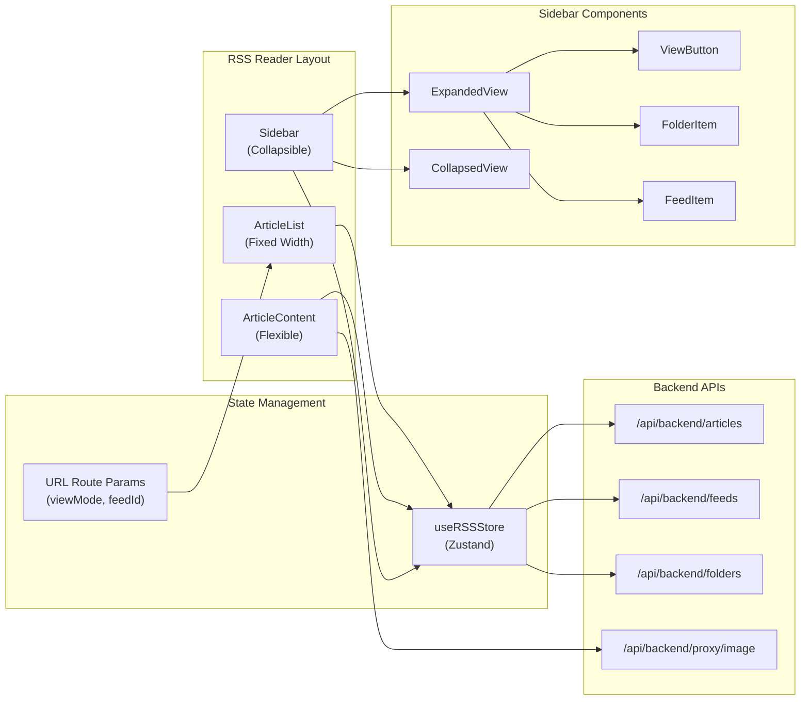

**Sources:** [frontend/components/sidebar/index.tsx:1-128](), [frontend/components/article-list.tsx:1-342](), [frontend/components/article-content.tsx:1-275]()

---

## Sidebar Navigation

The sidebar provides the primary navigation interface, supporting both expanded and collapsed states. The sidebar state is controlled via `isSidebarCollapsed` in Zustand store and can be toggled by the user or automatically collapsed when clicking content areas (unless pinned).

### Expanded View

The expanded sidebar displays:

| Section | Components | Purpose |
|---------|-----------|---------|
| **Header** | Logo, pin button, collapse button, help dialog, refresh button | App branding and global controls |
| **Search** | Text input with debouncing | Filter feeds and folders by name |
| **View Filters** | All, Unread, Starred, Chat, Repository | Navigate to different article views |
| **Quick Actions** | Add Feed, Add Folder buttons | Create new feeds and folders |
| **Feeds Tree** | Folders with nested feeds, ungrouped feeds | Hierarchical organization |
| **Footer** | Settings link, Logout button | Account management |

```mermaid
graph TB
    ExpandedView["ExpandedView Component"]
    
    subgraph "Header Section"
        Title["SaveHub Title"]
        PinButton["Pin/Unpin Button<br/>(toggles sidebarPinned)"]
        CollapseButton["Collapse Button<br/>(calls onCollapse)"]
        HelpDialog["HelpDialog"]
        FeedRefresh["FeedRefresh<br/>(listenToGlobalEvent)"]
    end
    
    subgraph "Search Section"
        SearchInput["Search Input<br/>(filters feeds/folders)"]
    end
    
    subgraph "View Filters"
        AllButton["ViewButton href='/all'"]
        UnreadButton["ViewButton href='/unread'"]
        StarredButton["ViewButton href='/starred'"]
        ChatButton["ViewButton href='/chat'"]
        RepoButton["ViewButton href='/repository'"]
    end
    
    subgraph "Actions"
        AddFeedBtn["Add Feed Button"]
        AddFolderBtn["Add Folder Button"]
    end
    
    subgraph "Feeds Tree"
        FolderItems["FolderItem[]<br/>(with drag-drop)"]
        FeedItems["FeedItem[]<br/>(root-level feeds)"]
    end
    
    subgraph "Footer"
        SettingsLink["Link to /settings"]
        LogoutButton["Logout Button"]
    end
    
    ExpandedView --> Title
    ExpandedView --> PinButton
    ExpandedView --> CollapseButton
    ExpandedView --> HelpDialog
    ExpandedView --> FeedRefresh
    ExpandedView --> SearchInput
    ExpandedView --> AllButton
    ExpandedView --> UnreadButton
    ExpandedView --> StarredButton
    ExpandedView --> ChatButton
    ExpandedView --> RepoButton
    ExpandedView --> AddFeedBtn
    ExpandedView --> AddFolderBtn
    ExpandedView --> FolderItems
    ExpandedView --> FeedItems
    ExpandedView --> SettingsLink
    ExpandedView --> LogoutButton
```

**Key Implementation Details:**

- **Pinning:** When `sidebarPinned` is true, the sidebar remains expanded even when clicking article content. The pin state is persisted in settings via `updateSettings({ sidebarPinned })` [frontend/components/sidebar/index.tsx:52-54]()
- **Search Filtering:** Filters both folders and feeds by name/description, case-insensitive [frontend/components/sidebar/expanded-view.tsx:70-76]()
- **Drag-and-Drop:** Feeds can be reordered within folders or moved to different folders via native HTML drag events [frontend/components/sidebar/expanded-view.tsx:88-143]()
- **Unread Counts:** Each feed displays an unread badge computed by `getUnreadCount(feedId)` [frontend/components/sidebar/expanded-view.tsx:268]()

**Sources:** [frontend/components/sidebar/expanded-view.tsx:1-349](), [frontend/components/sidebar/index.tsx:14-128]()

### Collapsed View

The collapsed sidebar displays icon-only buttons for quick navigation:

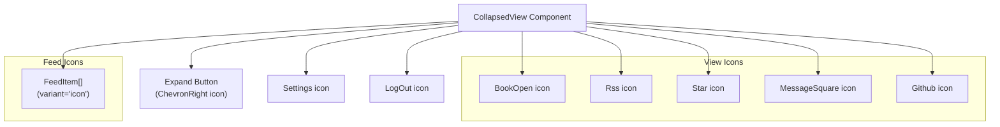

The collapsed view is optimized for space efficiency, showing only essential navigation icons. Each feed displays its favicon or first letter as an icon. Clicking anywhere in the collapsed sidebar expands it [frontend/components/sidebar/collapsed-view.tsx:32]().

**Sources:** [frontend/components/sidebar/collapsed-view.tsx:1-83]()

---

## Article List Component

The `ArticleList` component displays a filterable, sortable list of articles. It receives `viewMode` and `feedId` props from the route parameters and renders articles accordingly.

### Component Interface

```typescript
interface ArticleListProps {
  viewMode?: "all" | "unread" | "starred"
  feedId?: string | null
}
```

### Layout Structure

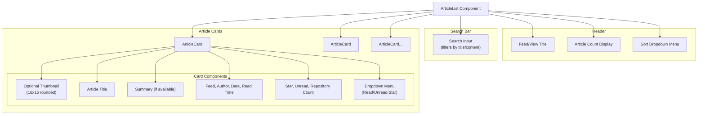

**Sources:** [frontend/components/article-list.tsx:116-339]()

### Sorting and Filtering

The article list supports four sort modes with bidirectional ordering:

| Sort Mode | Sort Logic | Default Direction |
|-----------|-----------|-------------------|
| **Date** | `publishedAt` timestamp | Descending (newest first) |
| **Title** | Alphabetical by `title` | Ascending |
| **Feed** | Alphabetical by feed title | Ascending |
| **Read Time** | Estimated reading time (words/200) | Ascending |

Sorting is implemented using `useMemo` for performance [frontend/components/article-list.tsx:61-95](). The sort state is local to the component and resets when navigating to different views.

**Filtering Logic:**

1. **View Mode Filter:** Applied via `getFilteredArticles({ viewMode, feedId })` from Zustand store
2. **Search Filter:** Client-side filtering by title, content, and summary (case-insensitive)
3. **Feed Filter:** When `feedId` is provided, only shows articles from that feed

**Sources:** [frontend/components/article-list.tsx:28-95]()

### Article Card Interactions

Each article card in the list supports multiple interactions:

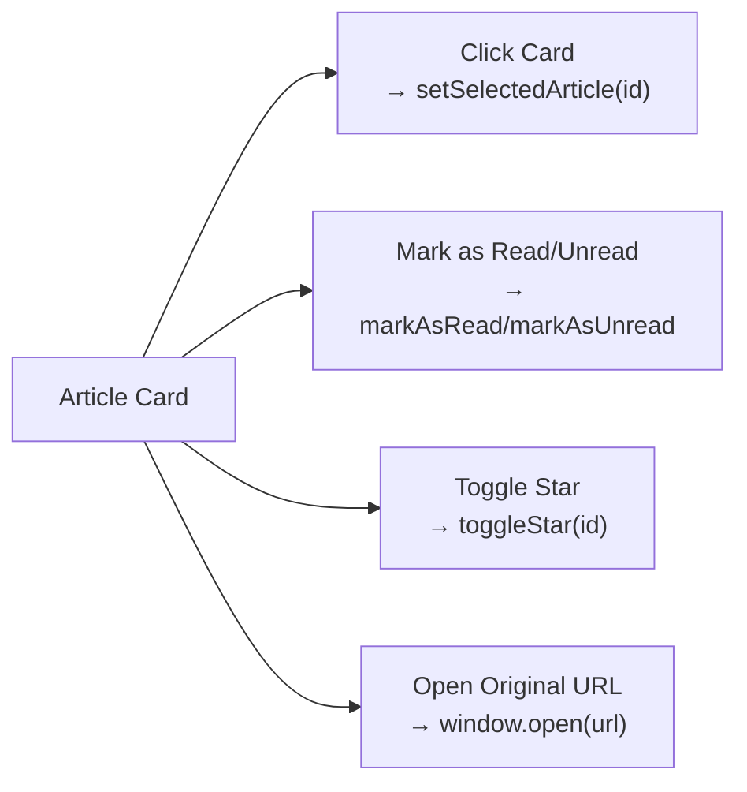

**Visual Indicators:**

- **Unread Dot:** Blue dot displayed when `!article.isRead` [frontend/components/article-list.tsx:317]()
- **Star Icon:** Yellow filled star when `article.isStarred` [frontend/components/article-list.tsx:316]()
- **Repository Count:** GitHub icon with count when `article.repositoryCount > 0` [frontend/components/article-list.tsx:310-315]()
- **Read State:** Title text color changes to muted when `article.isRead` [frontend/components/article-list.tsx:222]()

**Sources:** [frontend/components/article-list.tsx:188-324]()

---

## Article Content Viewer

The `ArticleContent` component displays the full article content in a reading-optimized layout. It automatically marks articles as read when opened (if enabled in settings).

### Content Layout

```mermaid
graph TB
    ArticleContent["ArticleContent Component"]
    
    subgraph "Header Section"
        ArticleTitle["Article Title<br/>(text-2xl, font-bold)"]
        FeedBadge["Feed Badge"]
        Author["Author Name"]
        PublishedDate["Published Date<br/>(relative + tooltip)"]
        ReadTime["Estimated Read Time"]
        
        subgraph "Action Toolbar"
            FontDecrease["Zoom Out Button<br/>(adjustFontSize(-2))"]
            FontIncrease["Zoom In Button<br/>(adjustFontSize(+2))"]
            StarButton["Star/Unstar Button"]
            OpenOriginal["Open Original Link"]
            MoreMenu["More Menu<br/>(Read/Unread, Share, Copy)"]
        end
    end
    
    subgraph "Content Section"
        Thumbnail["Optional Hero Image"]
        HTMLContent["Sanitized HTML Content<br/>(prose styling)"]
        RelatedRepos["ArticleRepositories<br/>(if any)"]
    end
    
    subgraph "Footer Section"
        PublishedInfo["Full Publication Date"]
        FeedInfo["Source Feed Name"]
        ReadOriginalBtn["Read Original Button"]
    end
    
    ArticleContent --> ArticleTitle
    ArticleContent --> FeedBadge
    ArticleContent --> Author
    ArticleContent --> PublishedDate
    ArticleContent --> ReadTime
    ArticleContent --> FontDecrease
    ArticleContent --> FontIncrease
    ArticleContent --> StarButton
    ArticleContent --> OpenOriginal
    ArticleContent --> MoreMenu
    ArticleContent --> Thumbnail
    ArticleContent --> HTMLContent
    ArticleContent --> RelatedRepos
    ArticleContent --> PublishedInfo
    ArticleContent --> FeedInfo
    ArticleContent --> ReadOriginalBtn
```

**Sources:** [frontend/components/article-content.tsx:19-275]()

### HTML Sanitization and Image Proxying

Article content undergoes sanitization and image proxying to ensure security and bypass CORS restrictions:

**Sanitization Process (Client-Side):**
1. Remove all `<script>` tags [frontend/lib/utils.ts:79]()
2. Remove event handler attributes (e.g., `onclick`) [frontend/lib/utils.ts:80]()
3. Remove `javascript:` URLs [frontend/lib/utils.ts:81]()
4. Proxy all `` tags through backend proxy [frontend/lib/utils.ts:83-89]()

**Image Proxying Architecture:**

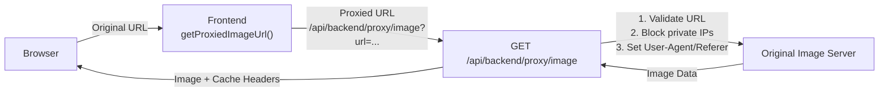

**Image Proxy Implementation (Backend):**

The proxy endpoint [backend/app/api/routers/proxy.py:45-147]() provides:

| Security Feature | Implementation |
|------------------|----------------|
| **SSRF Protection** | Blocks private/loopback IP addresses [backend/app/api/routers/proxy.py:35-42]() |
| **URL Validation** | Only allows HTTP(S) schemes [backend/app/api/routers/proxy.py:67-68]() |
| **Content-Type Check** | Validates image MIME types [backend/app/api/routers/proxy.py:105-115]() |
| **Size Limit** | Enforces 10MB maximum [backend/app/api/routers/proxy.py:20,118-125]() |
| **Hotlink Bypass** | Sets User-Agent and Referer headers [backend/app/api/routers/proxy.py:87-92]() |

**Sources:** [frontend/lib/utils.ts:61-90](), [backend/app/api/routers/proxy.py:1-148]()

### Font Size Control

Users can adjust reading font size using zoom controls in the header:

- **Decrease:** Zoom Out button calls `adjustFontSize(-2)` [frontend/components/article-content.tsx:128]()
- **Increase:** Zoom In button calls `adjustFontSize(2)` [frontend/components/article-content.tsx:138]()
- **Range:** 12px - 24px [frontend/components/article-content.tsx:68]()
- **Persistence:** Saved to settings via `updateSettings({ fontSize })` [frontend/components/article-content.tsx:69]()

The font size is applied inline to the prose content container [frontend/components/article-content.tsx:239]().

**Sources:** [frontend/components/article-content.tsx:67-70,128-143]()

### Related Repositories Section

If the article has related GitHub repositories (extracted during background processing), they are displayed at the bottom via the `ArticleRepositories` component:

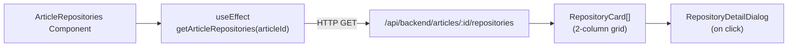

The section is hidden when no repositories are found [frontend/components/article-repositories.tsx:55-57](). For details on repository extraction, see [Repository Extraction Pipeline](#6.5).

**Sources:** [frontend/components/article-repositories.tsx:1-92](), [frontend/components/article-content.tsx:244]()

---

## User Interactions

### Reading Articles

When a user clicks an article card, the interaction flow is:

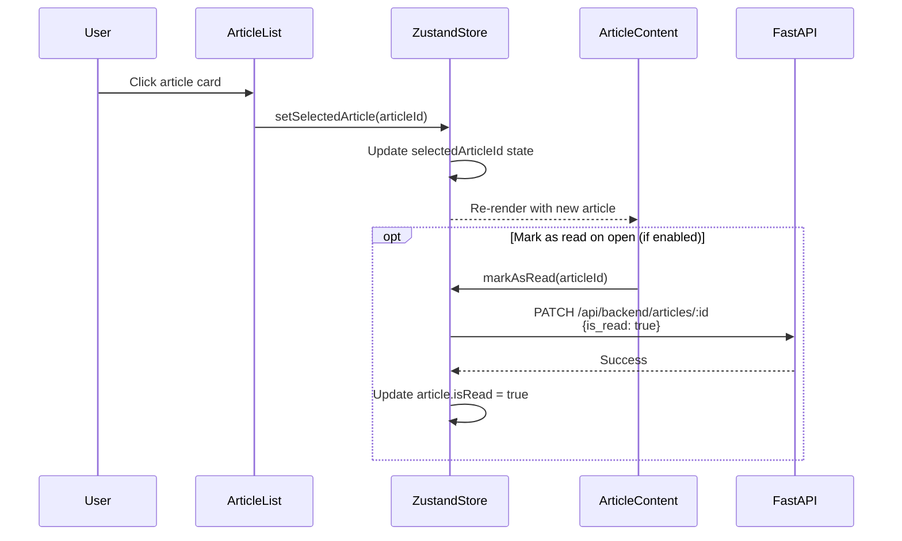

**Sources:** [frontend/components/article-list.tsx:199](), [frontend/components/article-content.tsx:19-24]()

### Marking Articles Read/Unread

Users can manually control read status from both the article list and content viewer:

**From Article List Dropdown:**
```typescript
// Toggle read status
article.isRead ? markAsUnread(article.id) : markAsRead(article.id)
```
[frontend/components/article-list.tsx:242-246]()

**From Article Content More Menu:**
```typescript
// Toggle read status  
selectedArticle.isRead ? markAsUnread(selectedArticle.id) : markAsRead(selectedArticle.id)
```
[frontend/components/article-content.tsx:173-187]()

**Backend Implementation:**

The Zustand store actions call the Articles API:

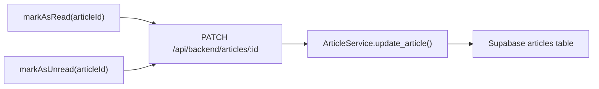

The API endpoint [backend/app/api/routers/articles.py:157-196]() validates the article exists and belongs to the user before updating.

**Sources:** [frontend/components/article-list.tsx:242-258](), [frontend/components/article-content.tsx:173-187](), [backend/app/api/routers/articles.py:157-196]()

### Starring Articles

Starred articles are preserved regardless of retention settings and can be accessed via the Starred view:

```typescript
// Toggle star status (works from both list and content viewer)
toggleStar(article.id)
```

**Visual Indicators:**
- List view: Yellow filled star icon [frontend/components/article-list.tsx:266,316]()
- Content header: Yellow filled star button [frontend/components/article-content.tsx:149,152]()
- Content status: Yellow star with "Starred" label [frontend/components/article-content.tsx:211-216]()

**Sources:** [frontend/components/article-list.tsx:259-268](), [frontend/components/article-content.tsx:145-153]()

### Sharing and Copying

The article content viewer provides share and copy functionality:

**Share Article:**
- Uses native Web Share API if available
- Falls back to copying URL to clipboard
- Displays toast notification on success [frontend/components/article-content.tsx:27-46]()

**Copy Link:**
- Copies article URL to clipboard
- Shows "Link copied" toast [frontend/components/article-content.tsx:48-65]()

**Sources:** [frontend/components/article-content.tsx:27-65,190-197]()

---

## Feed and Folder Management

### Adding Feeds

Users can add feeds via the "Add Feed" button in the sidebar or within a folder. The process involves:

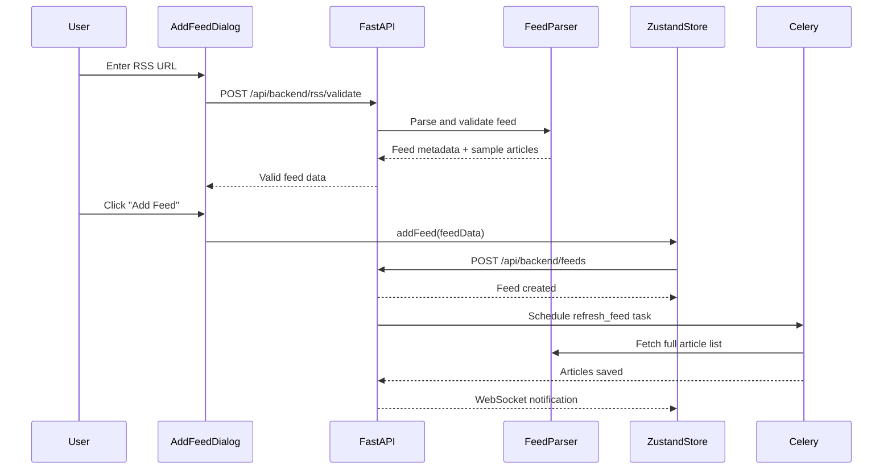

For complete feed parsing and refresh details, see [RSS Feed Processing](#6.1).

**Sources:** [frontend/components/sidebar/expanded-view.tsx:201-208]()

### Editing Feed Properties

Users can edit feed properties by navigating to `/feed/:feedId/properties`:

**Editable Fields:**

| Field | Type | Validation |
|-------|------|-----------|
| `title` | string | Required |
| `url` | string | Required, validated if changed |
| `description` | string | Optional |
| `category` | string | Optional |
| `folderId` | string | Optional (folder selection) |
| `refreshInterval` | number | 1-10080 minutes |
| `enableDeduplication` | boolean | Default false |

**URL Change Validation:**

If the URL is modified, the form validates it against the RSS parser before saving:

```typescript
if (formData.url !== feed.url) {
  const isValid = await validateRSSUrl(formData.url)
  if (!isValid) {
    // Show error toast
    return
  }
}
```
[frontend/components/edit-feed-form.tsx:93-104]()

**Duplicate Detection:**

The backend checks for duplicate URLs across the user's feeds and returns an error if found [frontend/components/edit-feed-form.tsx:133-138]().

**Sources:** [frontend/components/edit-feed-form.tsx:1-321](), [frontend/CLAUDE.md:299-310]()

### Folder Organization

Feeds can be organized into folders for better management:

**Folder Operations:**

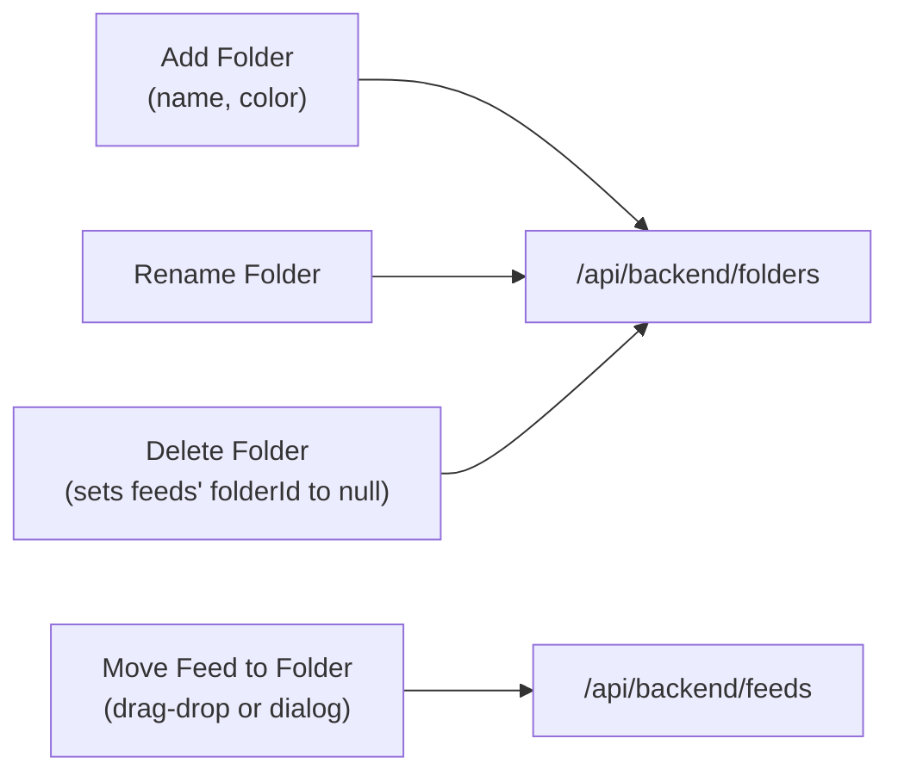

**Drag-and-Drop Reordering:**

The expanded sidebar supports drag-and-drop for feed organization:

1. **Drag Feed:** `onDragStart` sets `draggedFeedId` [frontend/components/sidebar/expanded-view.tsx:88-90]()
2. **Drop on Feed:** Reorders feeds within same folder [frontend/components/sidebar/expanded-view.tsx:96-113]()
3. **Drop on Folder:** Moves feed to target folder [frontend/components/sidebar/expanded-view.tsx:115-124]()
4. **Drop on Root:** Moves feed out of folder [frontend/components/sidebar/expanded-view.tsx:130-143]()

The `moveFeed(feedId, targetFolderId, targetIndex)` action updates both local state and database via API.

**Sources:** [frontend/components/sidebar/expanded-view.tsx:88-147]()

---

## Data Loading and Initialization

The RSS reader interface initializes data through the database slice:

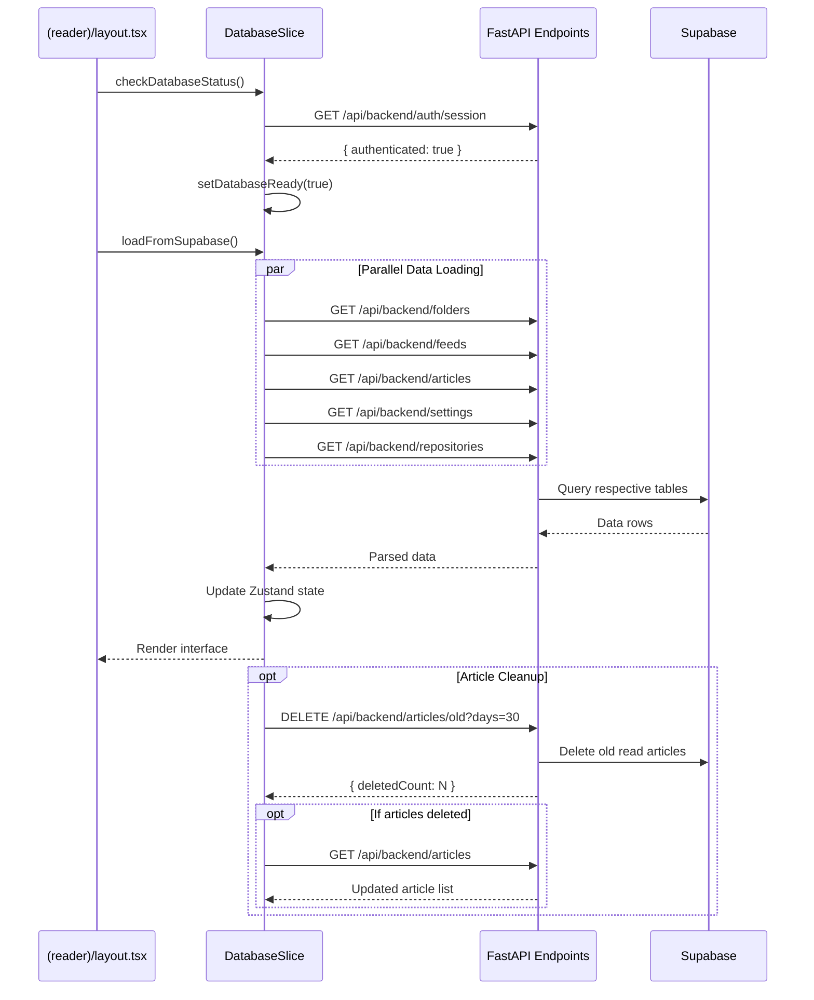

**Key Features:**

- **Parallel Loading:** All data endpoints are called concurrently using `Promise.all()` [frontend/lib/store/database.slice.ts:81-87]()
- **Graceful Degradation:** Settings and repositories loading failures are caught and use defaults [frontend/lib/store/database.slice.ts:85-86]()
- **Automatic Cleanup:** Old read articles are deleted based on `articlesRetentionDays` setting [frontend/lib/store/database.slice.ts:102-109]()

**Sources:** [frontend/lib/store/database.slice.ts:66-117]()

---

## Summary

The RSS Reader Interface provides a three-panel layout (sidebar, article list, content viewer) optimized for reading and managing RSS feeds. Key architectural decisions include:

- **URL-based routing** for view state persistence and shareability
- **Zustand store** for client-side state management with HTTP API synchronization
- **Image proxy** for CORS bypass and security
- **Drag-and-drop** for intuitive feed organization
- **Parallel data loading** for fast initialization
- **Real-time updates** via WebSocket for multi-client synchronization

The interface balances performance (virtualized scrolling, memoized filtering) with usability (keyboard shortcuts, responsive layout, accessibility) to provide a modern RSS reading experience.