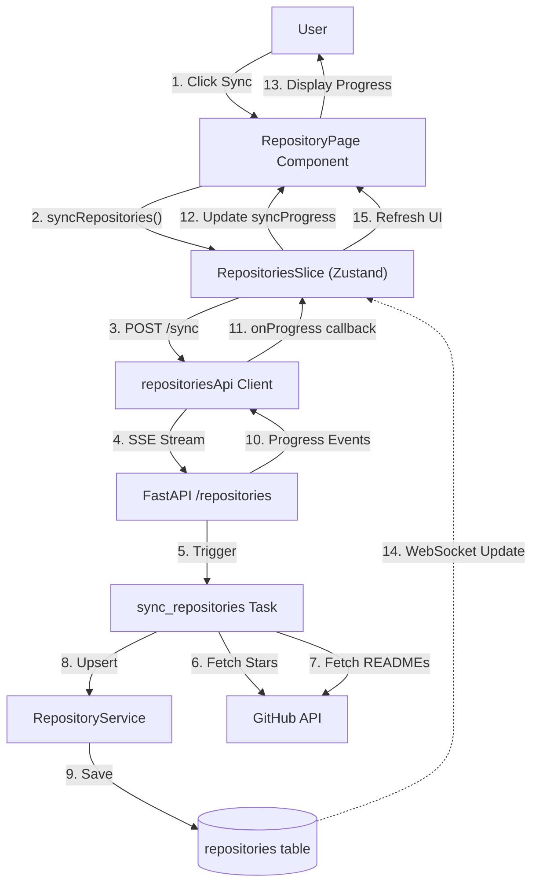
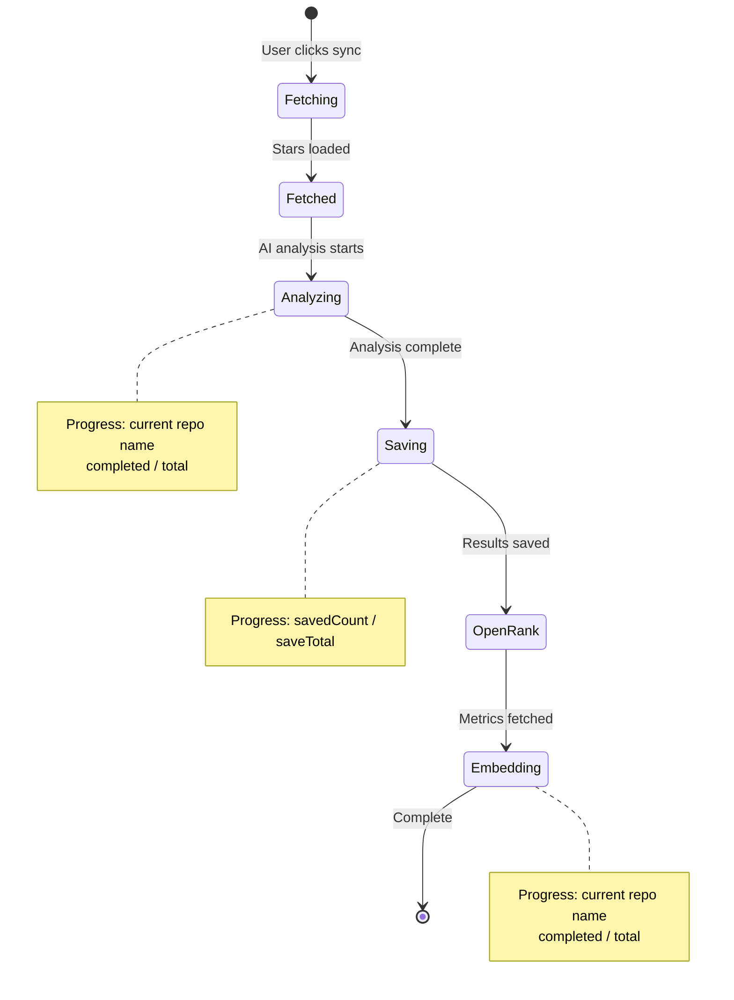
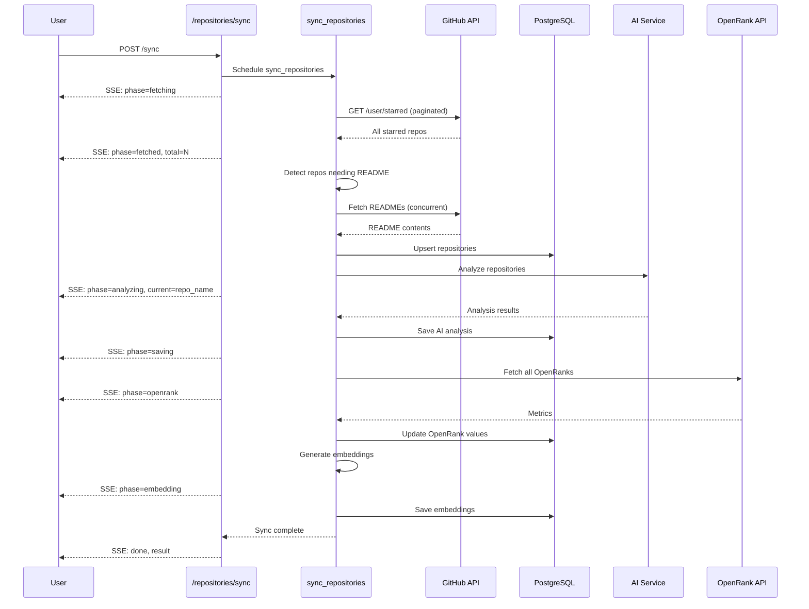
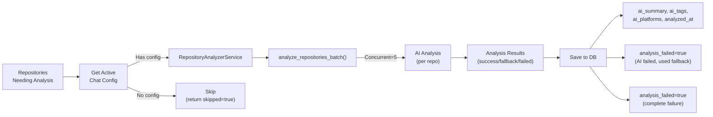
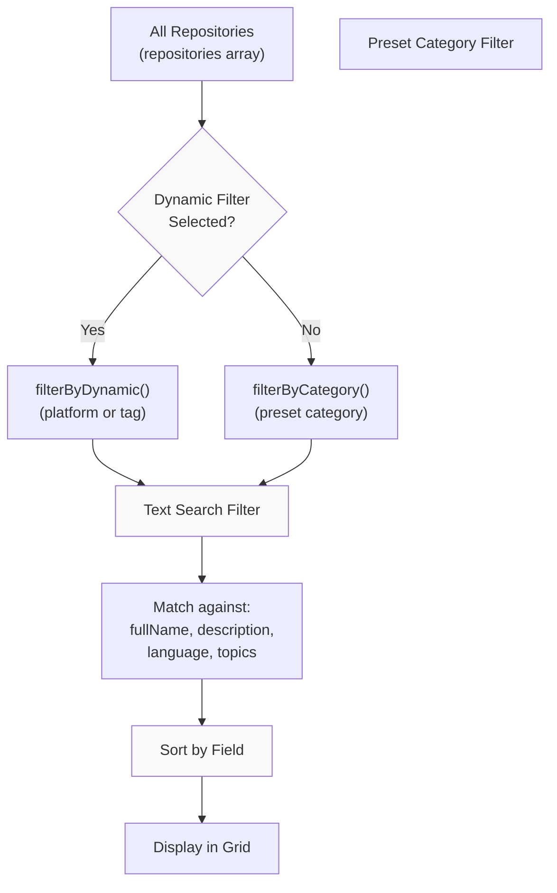
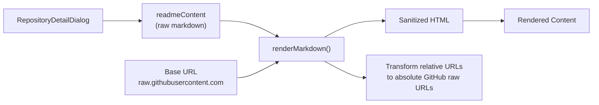

# Repository Browser

<details>
<summary>Relevant source files</summary>

The following files were used as context for generating this wiki page:

- [backend/app/api/routers/repositories.py](backend/app/api/routers/repositories.py)
- [backend/app/celery_app/repository_tasks.py](backend/app/celery_app/repository_tasks.py)
- [backend/app/schemas/repositories.py](backend/app/schemas/repositories.py)
- [backend/app/services/db/repositories.py](backend/app/services/db/repositories.py)
- [backend/app/services/openrank_service.py](backend/app/services/openrank_service.py)
- [backend/app/services/repository_analyzer.py](backend/app/services/repository_analyzer.py)
- [backend/scripts/023_add_readme_content.sql](backend/scripts/023_add_readme_content.sql)
- [backend/scripts/030_add_repository_openrank.sql](backend/scripts/030_add_repository_openrank.sql)
- [frontend/components/repository/repository-card.tsx](frontend/components/repository/repository-card.tsx)
- [frontend/components/repository/repository-detail-dialog.tsx](frontend/components/repository/repository-detail-dialog.tsx)
- [frontend/components/repository/repository-page.tsx](frontend/components/repository/repository-page.tsx)
- [frontend/lib/api/repositories.ts](frontend/lib/api/repositories.ts)
- [frontend/lib/markdown-renderer.ts](frontend/lib/markdown-renderer.ts)
- [frontend/lib/store/repositories.slice.ts](frontend/lib/store/repositories.slice.ts)
- [frontend/lib/types.ts](frontend/lib/types.ts)
- [frontend/package.json](frontend/package.json)
- [frontend/pnpm-lock.yaml](frontend/pnpm-lock.yaml)

</details>


The Repository Browser provides a UI for exploring, categorizing, and managing GitHub starred repositories. It syncs repositories from GitHub, performs AI analysis to extract summaries and tags, fetches OpenRank metrics, and generates embeddings for semantic search. This system bridges the user's GitHub stars with SaveHub's knowledge management capabilities.

For backend repository synchronization tasks, see [Repository Synchronization](#6.2). For AI analysis of README content, see [Repository Analysis](#8.3). For embedding generation, see [Vector Embeddings](#7.2).

---

## Overview

The Repository Browser consists of three main layers:

1. **Frontend UI** - Grid-based card layout with filtering, sorting, and detail views
2. **Backend API** - RESTful endpoints with SSE for sync progress
3. **Background Processing** - Celery tasks for GitHub sync, AI analysis, and embeddings

The system maintains two sources of repositories:
- **Starred repositories** (`is_starred=true`) - synced from GitHub
- **Extracted repositories** (`is_extracted=true`) - found in article content

Sources: [frontend/components/repository/repository-page.tsx:1-432](), [backend/app/api/routers/repositories.py:1-486]()

---

## Data Flow Architecture



**Data Flow: GitHub Sync with Progress Tracking**

The sync operation uses Server-Sent Events (SSE) to stream progress updates to the frontend. Each phase (`fetching`, `fetched`, `analyzing`, `saving`, `openrank`, `embedding`) emits progress events.

Sources: [backend/app/api/routers/repositories.py:48-301](), [frontend/lib/api/repositories.ts:38-98](), [frontend/lib/store/repositories.slice.ts:52-72]()

---

## User Interface Components

### RepositoryPage Component

The main page component manages three areas:

| Area | Description | Key Features |
|------|-------------|--------------|
| **CategorySidebar** | Left sidebar with filters | Preset categories, platform filters, tag filters, counts |
| **Header Bar** | Top toolbar | Search input, sync button, repository count |
| **Repository Grid** | Main content area | Card grid (1-3 columns), sort controls, sync progress bar |

The component maintains local state for:
- `selectedCategory` - preset category filter
- `selectedDynamicFilter` - platform or tag filter
- `searchQuery` - text search
- `sortField` and `sortDirection` - persisted to localStorage

```typescript
// Sort state with localStorage persistence
const [sortField, setSortField] = useState<SortField>(() => {
  if (typeof window === "undefined") return "stars"
  try {
    const saved = localStorage.getItem("savehub-repo-sort")
    if (saved) return JSON.parse(saved).field || "stars"
  } catch {}
  return "stars"
})
```

Sources: [frontend/components/repository/repository-page.tsx:19-432]()

### RepositoryCard Component

Each repository is displayed in a card with:

```mermaid
graph TB
    Card["RepositoryCard"]
    Header["Header Section"]
    Actions["Action Buttons"]
    Content["Content Section"]
    Stats["Stats Section"]
    
    Card --> Header
    Card --> Actions
    Card --> Content
    Card --> Stats
    
    Header --> Avatar["Owner Avatar"]
    Header --> RepoName["Repository Name"]
    Header --> Owner["Owner Login"]
    
    Actions --> AIBtn["AI Analyze Button<br/>(color: failed/analyzed/pending)"]
    Actions --> EditBtn["Edit Button"]
    Actions --> ZreadBtn["Zread Link"]
    Actions --> GitHubBtn["GitHub Link"]
    
    Content --> Desc["Description<br/>(custom > AI > original)"]
    Content --> Category["Custom Category Badge"]
    Content --> Tags["Merged Tags<br/>(custom + AI + topics)"]
    Content --> Platforms["Platform Icons"]
    
    Stats --> Lang["Language Badge"]
    Stats --> Stars["Star Count"]
    Stats --> OpenRank["OpenRank Score"]
    Stats --> Updated["Updated Time"]
```



**Display Priority for Content**

The card resolves display content using a priority system:
1. `customDescription` - if user edited
2. `aiSummary` - if AI analyzed
3. `description` - GitHub description
4. `analysisFailed` - shows failed state

Tags are merged from three sources with deduplication: `customTags` > `aiTags` > `topics`.

Sources: [frontend/components/repository/repository-card.tsx:27-376]()

### Sync Progress Visualization



Progress phases are tracked in `SyncProgress` interface:

| Phase | Data | Progress Bar |
|-------|------|--------------|
| `fetching` | None | Indeterminate |
| `fetched` | `total`, `needsReadme` | None |
| `analyzing` | `current`, `completed`, `total` | 0-95% |
| `saving` | `savedCount`, `saveTotal` | 95-100% |
| `openrank` | None | Indeterminate |
| `embedding` | `current`, `completed`, `total` | 0-100% (green bar) |

Sources: [frontend/components/repository/repository-page.tsx:317-385](), [frontend/lib/store/repositories.slice.ts:9-17]()

---

## Repository Data Model

### Database Schema

The `repositories` table stores both starred and extracted repositories:

```sql
CREATE TABLE repositories (
  id UUID PRIMARY KEY,
  user_id UUID NOT NULL,
  github_id INTEGER NOT NULL,
  
  -- GitHub metadata
  name TEXT NOT NULL,
  full_name TEXT NOT NULL,
  description TEXT,
  html_url TEXT NOT NULL,
  stargazers_count INTEGER DEFAULT 0,
  language TEXT,
  topics TEXT[],
  
  -- Owner info
  owner_login TEXT NOT NULL,
  owner_avatar_url TEXT,
  
  -- Timestamps
  starred_at TIMESTAMP,
  github_created_at TIMESTAMP,
  github_updated_at TIMESTAMP,
  github_pushed_at TIMESTAMP,
  
  -- Content
  readme_content TEXT,
  
  -- AI analysis
  ai_summary TEXT,
  ai_tags TEXT[],
  ai_platforms TEXT[],
  analyzed_at TIMESTAMP,
  analysis_failed BOOLEAN DEFAULT false,
  
  -- Embeddings
  embedding_processed BOOLEAN,
  
  -- Metrics
  openrank FLOAT,
  
  -- Custom edits
  custom_description TEXT,
  custom_tags TEXT[],
  custom_category TEXT,
  last_edited TIMESTAMP,
  
  -- Source tracking
  is_starred BOOLEAN DEFAULT false,
  is_extracted BOOLEAN DEFAULT false,
  
  UNIQUE(user_id, github_id)
);
```

Sources: [backend/scripts/023_add_readme_content.sql:1-7](), [backend/scripts/030_add_repository_openrank.sql:1-4]()

### Repository Type Definition

```typescript
interface Repository {
  // Core identity
  id: string
  githubId: number
  name: string
  fullName: string
  
  // GitHub metadata
  description: string | null
  htmlUrl: string
  stargazersCount: number
  language: string | null
  topics: string[]
  
  // Owner
  ownerLogin: string
  ownerAvatarUrl: string | null
  
  // Timestamps
  starredAt: string | null
  githubUpdatedAt: string | null
  githubPushedAt: string | null
  
  // Content
  readmeContent: string | null
  
  // AI analysis
  aiSummary: string | null
  aiTags: string[]
  aiPlatforms: string[]
  analyzedAt: string | null
  analysisFailed: boolean
  
  // Metrics
  openrank: number | null
  
  // Custom edits
  customDescription: string | null
  customTags: string[]
  customCategory: string | null
  lastEdited: string | null
}
```

Sources: [frontend/lib/types.ts:104-133](), [backend/app/schemas/repositories.py:9-61]()

---

## Synchronization Pipeline

### Sync Workflow



### RepositoryService Upsert Logic

The `upsert_repositories` method implements smart update detection:

1. **Fetch existing state**: Load `github_id`, `github_pushed_at`, `readme_content`
2. **Detect changes**: Compare `pushed_at` to identify code updates
3. **Skip unchanged**: If README unchanged, skip upsert (optimization)
4. **Clear AI fields**: If `pushed_at` changed, reset AI analysis
5. **Upsert**: Save to database with conflict resolution

```python
# Skip if no new readme fetched (None means not fetched)
if new_readme is None:
    skipped_count += 1
    continue

# Skip if readme_content unchanged
if new_readme == old_readme:
    skipped_count += 1
    continue

# Detect pushed_at change (code update) for AI analysis reset
old_pushed_at = existing.get("github_pushed_at")
if old_pushed_at is not None and old_pushed_at != new_pushed_at:
    changed_github_ids.append(github_id)
```

When `pushed_at` changes, AI fields are cleared:
- `ai_summary = null`
- `ai_tags = null`
- `ai_platforms = null`
- `analyzed_at = null`
- `analysis_failed = null`

Sources: [backend/app/services/db/repositories.py:72-200]()

### Sync Task Implementation

The `sync_repositories` Celery task ([backend/app/celery_app/repository_tasks.py:496-637]()):

1. **Acquire task lock** - prevent duplicate execution
2. **Fetch GitHub token** - from settings table
3. **Execute core sync** - `do_sync_repositories()`
4. **Run AI analysis** - `do_ai_analysis()`
5. **Fetch OpenRank** - `do_openrank_update()`
6. **Generate embeddings** - `do_repository_embedding()`
7. **Schedule next sync** - `schedule_next_repo_sync()` (1 hour)

The sync operates in phases:

| Function | Purpose | Concurrency |
|----------|---------|-------------|
| `_fetch_all_starred_repos()` | Paginate GitHub stars | Sequential pages |
| `_fetch_all_readmes()` | Fetch README content | 10 concurrent |
| `analyze_repositories_needing_analysis()` | AI analysis | 5 concurrent |
| `fetch_all_openranks()` | OpenRank metrics | 5 concurrent |
| `do_repository_embedding()` | Generate embeddings | Sequential |

Sources: [backend/app/celery_app/repository_tasks.py:35-136](), [backend/app/celery_app/repository_tasks.py:496-637]()

---

## AI Analysis System

### Analysis Trigger Points

AI analysis runs in three scenarios:

1. **During sync** - `analyze_repositories_needing_analysis()` called automatically
2. **Manual trigger** - User clicks AI button on card
3. **Retry failed** - `analysis_failed=true` repos are retried

Selection criteria for analysis:
```sql
WHERE user_id = ?
  AND (
    ai_summary IS NULL
    OR ai_tags IS NULL
    OR ai_tags = '{}'
    OR analysis_failed = true
  )
```

Sources: [backend/app/services/db/repositories.py:380-398]()

### Analysis Workflow



### Fallback Strategy

The AI analyzer implements graceful degradation:

```python
# 1. Try AI analysis
try:
    analysis = await ai_service.analyze_repository(readme_content, repo_name, description)
    return {"success": True, "data": analysis, "fallback": False}
except Exception as e:
    logger.warning(f"AI analysis failed for {repo_name}: {e}")
    
    # 2. Use fallback extraction
    if use_fallback:
        fallback = extract_fallback_analysis(readme_content, repo_name, description, language)
        return {"success": True, "data": fallback, "fallback": True}
    
    # 3. Mark as failed
    return {"success": False, "error": str(e)}
```

Fallback extraction uses:
- Repository name as summary
- Topics as tags (if available)
- Language inference for platforms

Sources: [backend/app/services/repository_analyzer.py:19-103]()

---

## Filtering and Categorization

### Filter Architecture



### Preset Categories

Categories are defined with keyword matching:

| Category ID | Keywords | Description |
|------------|----------|-------------|
| `ai-ml` | ai, machine learning, deep learning, neural network | AI/ML projects |
| `web` | web, frontend, backend, fullstack | Web development |
| `mobile` | mobile, ios, android, react-native | Mobile apps |
| `devops` | devops, docker, kubernetes, ci/cd | DevOps tools |
| `cli` | cli, terminal, command-line | CLI utilities |
| `data` | data, database, analytics, visualization | Data tools |
| `security` | security, encryption, authentication | Security |
| `game` | game, gaming, unity, unreal | Game dev |

Matching logic:
```typescript
function matchesCategory(repo: Repository, category: RepositoryCategory): boolean {
  const searchText = [
    repo.description,
    repo.aiSummary,
    ...repo.topics,
    ...repo.aiTags,
    repo.language
  ].filter(Boolean).join(' ').toLowerCase()
  
  return category.keywords.some(keyword => searchText.includes(keyword))
}
```

Sources: [frontend/lib/repository-categories.ts:1-200]() (implied from card usage)

### Dynamic Filters

Platform and tag filters are computed dynamically:

```typescript
// Platform counts
const platforms = useMemo(() => getPlatformCounts(repositories), [repositories])
// Result: Map<string, number> { "macos": 5, "web": 12, ... }

// Tag counts (merged from all sources)
const tags = useMemo(() => getTagCounts(repositories), [repositories])
// Result: Map<string, number> { "javascript": 15, "framework": 8, ... }
```

When selected, dynamic filters take precedence over preset categories:
```typescript
const handleSelectDynamicFilter = (type: "platform" | "tag", value: string) => {
  setSelectedDynamicFilter({ type, value })
  setSelectedCategory("all") // Reset preset
}
```

Sources: [frontend/components/repository/repository-page.tsx:159-193]()

### Sort Options

| Field | Description | Null Handling |
|-------|-------------|---------------|
| `stars` | Stargazers count | N/A (always has value) |
| `starredAt` | When user starred | Nulls to end |
| `updatedAt` | `github_updated_at` | Nulls to end |
| `pushedAt` | `github_pushed_at` | Nulls to end |
| `name` | Repository name | Alphabetical |
| `openrank` | OpenRank score | Nulls always last |

OpenRank sorting has special handling:
```typescript
case "openrank":
  // null values always go to the end, regardless of sort direction
  if (a.openrank === null && b.openrank === null) return 0
  if (a.openrank === null) return 1
  if (b.openrank === null) return -1
  cmp = a.openrank - b.openrank
  break
```

Sort preference is persisted to `localStorage` as:
```json
{
  "field": "stars",
  "direction": "desc"
}
```

Sources: [frontend/components/repository/repository-page.tsx:117-156]()

---

## README Rendering

### RepositoryDetailDialog

The detail dialog displays repository README with markdown rendering:



### Markdown Rendering Pipeline

The `renderMarkdown()` function ([frontend/lib/markdown-renderer.ts:32-81]()):

1. **Configure marked**: Enable GFM, breaks, disable pedantic
2. **Custom renderers**:
   - `image()`: Transform URLs, add responsive classes
   - `code()`: Syntax highlighting classes, overflow handling
   - `codespan()`: Inline code styling
3. **Parse markdown**: Convert to HTML
4. **Sanitize**: DOMPurify XSS protection
5. **Return**: `{html: string, error?: string}`

Image URL transformation:
```typescript
function transformImageUrl(src: string, baseUrl?: string): string {
  if (!src || !baseUrl) return src
  
  // Already absolute URL
  if (src.startsWith('http://') || src.startsWith('https://')) {
    return src
  }
  
  // Relative URL - convert to absolute
  const cleanSrc = src.startsWith('/') ? src : `/${src}`
  return `${baseUrl}${cleanSrc}`
}
```

For repository `owner/repo`, base URL is:
```
https://raw.githubusercontent.com/owner/repo/main
```

This allows relative images like `./images/logo.png` to resolve correctly.

Sources: [frontend/lib/markdown-renderer.ts:32-163](), [frontend/components/repository/repository-detail-dialog.tsx:28-33]()

### Security Considerations

DOMPurify sanitization rules:
- **Allowed tags**: Headings, text, lists, links, images, code, tables, task lists
- **Allowed attributes**: `href`, `src`, `alt`, `title`, `class`, table attributes
- **Forbidden tags**: `<script>`, `<style>`, `<iframe>`, `<object>`, `<embed>`
- **Forbidden attributes**: `onerror`, `onload`, `onclick`, `onmouseover`

Server-side rendering: DOMPurify is skipped on server (requires DOM APIs), actual sanitization occurs during client hydration.

Sources: [frontend/lib/markdown-renderer.ts:111-149]()

---

## API Endpoints

### GET /api/repositories

Fetch all repositories for authenticated user.

**Response Schema**: `RepositoryResponse[]`

```typescript
{
  id: string
  github_id: number
  full_name: string
  // ... (see Repository type)
}
```

**Service Method**: `RepositoryService.load_repositories()`

```python
response = supabase.table("repositories") \
    .select("*") \
    .eq("user_id", user_id) \
    .order("starred_at", desc=True) \
    .execute()
```

Sources: [backend/app/api/routers/repositories.py:39-45](), [backend/app/services/db/repositories.py:52-70]()

### POST /api/repositories/sync

Sync starred repositories from GitHub with SSE progress updates.

**Request**: Empty body  
**Response**: Server-Sent Events stream

**Event Types**:

| Event | Data Schema | Description |
|-------|-------------|-------------|
| `progress` | `{phase, total?, current?, completed?, savedCount?, saveTotal?}` | Progress update |
| `done` | `{total, new_count, updated_count}` | Sync complete |
| `error` | `{message}` | Sync failed |

**Implementation Details**:

1. Validate GitHub token from settings
2. Create async progress queue
3. Launch `sync_task()` in background
4. Stream progress events to client
5. Execute phases: fetch → analyze → openrank → embedding

SSE event format:
```
event: progress
data: {"phase": "analyzing", "current": "owner/repo", "completed": 5, "total": 10}

event: done
data: {"total": 50, "new_count": 10, "updated_count": 40}
```

Sources: [backend/app/api/routers/repositories.py:48-301]()

### PATCH /api/repositories/{repo_id}

Update repository custom fields.

**Request Body**: `RepositoryUpdateRequest`
```json
{
  "custom_description": "string | null",
  "custom_tags": ["string"],
  "custom_category": "string | null"
}
```

**Response**: Updated `RepositoryResponse`

**Updates**:
- Sets `last_edited` to current timestamp
- Only updates provided fields (partial update)

Sources: [backend/app/api/routers/repositories.py:409-422](), [backend/app/services/db/repositories.py:266-293]()

### POST /api/repositories/{repo_id}/analyze

Manually trigger AI analysis for a repository.

**Validation**:
- Repository must exist and belong to user
- `readme_content` must not be null
- Active chat API config must exist

**Process**:
1. Fetch repository and validate
2. Get active chat API config
3. Create `RepositoryAnalyzerService`
4. Analyze README content
5. Save analysis or mark failed

**Response**: Updated `RepositoryResponse` with analysis results

Sources: [backend/app/api/routers/repositories.py:425-486]()

---

## State Management

### RepositoriesSlice (Zustand)

The repositories Zustand slice provides:

```typescript
interface RepositoriesSlice {
  // State
  repositories: Repository[]
  isSyncing: boolean
  isAnalyzing: boolean
  syncProgress: SyncProgress | null
  lastSyncedAt: string | null
  
  // Actions
  loadRepositories: () => Promise<void>
  syncRepositories: () => Promise<SyncResult>
  setSyncProgress: (progress: SyncProgress | null) => void
  setRepositories: (repos: Repository[]) => void
  updateRepository: (id, data) => Promise<Repository>
  analyzeRepository: (id: string) => Promise<Repository>
}
```

**Sync Flow**:
```typescript
syncRepositories: async () => {
  set({ isSyncing: true, syncProgress: null })
  try {
    const result = await repositoriesApi.syncWithProgress((progress) => {
      set({ syncProgress: progress }) // Update UI in real-time
    })
    const repos = await repositoriesApi.getAll() // Reload after sync
    set({ repositories: repos, lastSyncedAt: new Date().toISOString() })
    return result
  } finally {
    set({ isSyncing: false, syncProgress: null })
  }
}
```

**Real-time Updates**:

WebSocket updates from database triggers automatically refresh the repositories list when other clients make changes.

Sources: [frontend/lib/store/repositories.slice.ts:19-106]()

---

## Integration Points

### GitHub API Integration

The sync system interacts with GitHub API v3:

**Endpoints Used**:
- `GET /user/starred` - Fetch starred repositories (paginated)
- `GET /repos/{owner}/{repo}/readme` - Fetch README content

**Headers**:
```python
{
    "Authorization": f"Bearer {token}",
    "Accept": "application/vnd.github.star+json",  # For starred_at field
    "X-GitHub-Api-Version": "2022-11-28"
}
```

**Rate Limiting**:
- 0.1s delay between pagination requests
- 0.05s delay between concurrent README fetches
- Semaphore-controlled concurrency (10 concurrent)

Sources: [backend/app/celery_app/repository_tasks.py:397-489]()

### OpenRank Integration

OpenRank metrics are fetched from open-digger API:

**API Endpoint**: `https://oss.open-digger.cn/github/{owner}/{repo}/openrank.json`

**Response Format**:
```json
{
  "2024Q1": 1.23,
  "2024Q2": 1.45,
  "2024Q3": 1.67
}
```

**Logic**:
1. Sort quarters chronologically
2. Extract latest quarter value
3. Store as `openrank` float
4. Display in repository cards

Sources: [backend/app/services/openrank_service.py:19-95]()

### Cross-Feature Integration

The Repository Browser integrates with other SaveHub features:

| Feature | Integration Point | Purpose |
|---------|------------------|---------|
| **Article System** | `article_repositories` table | Link articles to mentioned repos |
| **Vector Search** | `all_embeddings` table | Semantic search across repos |
| **AI Chat** | Repository embeddings | Include repos in chat context |
| **Settings** | `github_token` in settings | Authentication for sync |

Repository extraction from articles:
- Explicit: Parse `github.com/{owner}/{repo}` URLs
- Implicit: AI extraction from article content
- Creates `is_extracted=true` repositories

Sources: [backend/app/celery_app/repository_tasks.py:94-127]() (extracted repos README fetching)