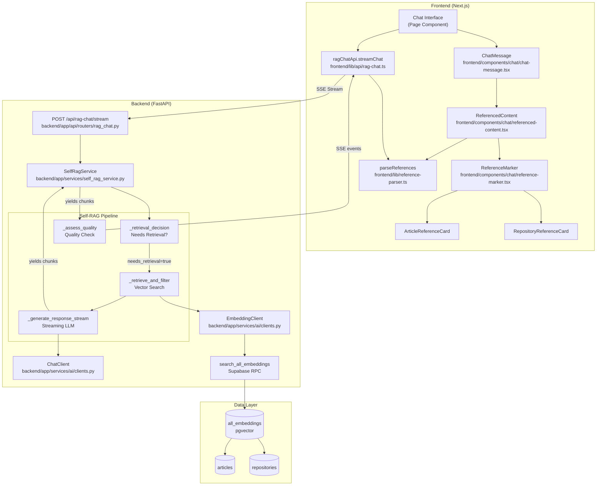
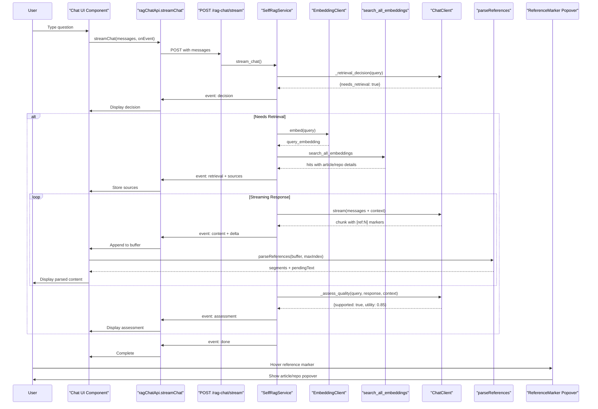
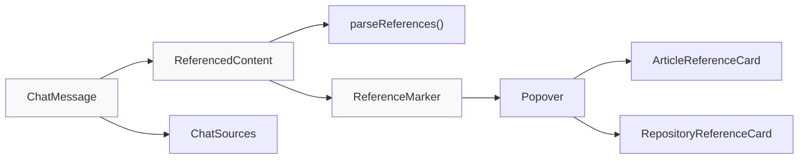
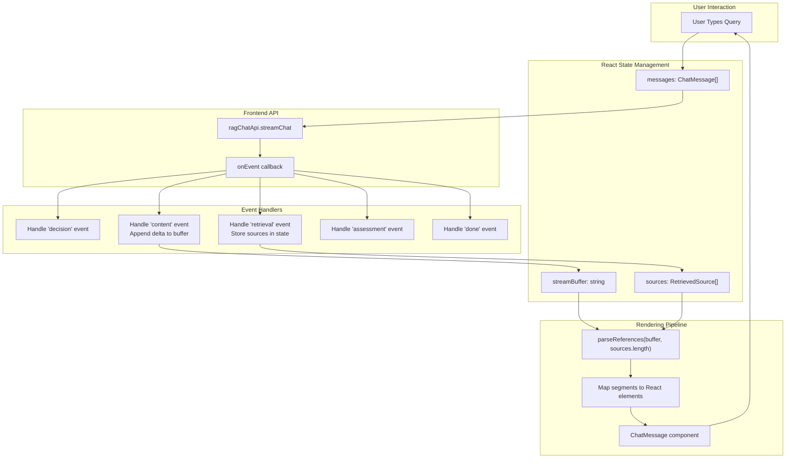

# AI Chat Interface

<details>
<summary>Relevant source files</summary>

The following files were used as context for generating this wiki page:

- [backend/app/api/routers/rag.py](backend/app/api/routers/rag.py)
- [backend/app/celery_app/rag_processor.py](backend/app/celery_app/rag_processor.py)
- [backend/app/schemas/rag_chat.py](backend/app/schemas/rag_chat.py)
- [backend/app/services/ai/CLAUDE.md](backend/app/services/ai/CLAUDE.md)
- [backend/app/services/ai/__init__.py](backend/app/services/ai/__init__.py)
- [backend/app/services/ai/clients.py](backend/app/services/ai/clients.py)
- [backend/app/services/ai/config.py](backend/app/services/ai/config.py)
- [backend/app/services/ai/repository_service.py](backend/app/services/ai/repository_service.py)
- [backend/app/services/rag/CLAUDE.md](backend/app/services/rag/CLAUDE.md)
- [backend/app/services/rag/__init__.py](backend/app/services/rag/__init__.py)
- [backend/app/services/rag/chunker.py](backend/app/services/rag/chunker.py)
- [backend/app/services/self_rag_service.py](backend/app/services/self_rag_service.py)
- [backend/scripts/034_update_search_embeddings_for_references.sql](backend/scripts/034_update_search_embeddings_for_references.sql)
- [frontend/components/chat/article-reference-card.tsx](frontend/components/chat/article-reference-card.tsx)
- [frontend/components/chat/chat-message.tsx](frontend/components/chat/chat-message.tsx)
- [frontend/components/chat/reference-marker.tsx](frontend/components/chat/reference-marker.tsx)
- [frontend/components/chat/referenced-content.tsx](frontend/components/chat/referenced-content.tsx)
- [frontend/components/chat/repository-reference-card.tsx](frontend/components/chat/repository-reference-card.tsx)
- [frontend/lib/api/rag-chat.ts](frontend/lib/api/rag-chat.ts)
- [frontend/lib/reference-parser.ts](frontend/lib/reference-parser.ts)

</details>


## Purpose and Scope

The AI Chat Interface provides an interactive question-answering experience powered by Self-RAG (Self-Reflective Retrieval-Augmented Generation). Users can ask natural language questions about their saved content (articles and repositories), and the system retrieves relevant context from the vector database, generates streaming responses with inline citations, and displays interactive reference cards on hover.

This page covers the frontend chat UI components, the backend Self-RAG service implementation, SSE streaming protocol, and the reference parsing system. For the underlying RAG indexing pipeline, see [RAG Processing Pipeline](#6.4). For the embedding storage and vector search infrastructure, see [Vector Embeddings](#7.2). For the base RAG query API (non-streaming), see [RAG & Search Services](#5.4).

---

## Architecture Overview

The chat interface follows a client-server streaming architecture where the frontend sends messages and processes Server-Sent Events (SSE), while the backend implements a five-step Self-RAG pipeline: retrieval decision → document retrieval → relevance filtering → response generation → quality assessment.



**Sources**: [frontend/components/chat/chat-message.tsx:1-51](), [frontend/lib/api/rag-chat.ts:1-110](), [backend/app/services/self_rag_service.py:1-291](), [backend/app/services/ai/clients.py:1-385]()

---

## Chat Message Flow

The following sequence illustrates the complete lifecycle of a user query, from input to displayed response with interactive references.



**Sources**: [frontend/lib/api/rag-chat.ts:55-109](), [backend/app/services/self_rag_service.py:56-111](), [frontend/lib/reference-parser.ts:33-94]()

---

## Frontend Chat Components

### Component Hierarchy

The chat interface is composed of nested components with clear separation of concerns:

| Component | File | Responsibility |
|-----------|------|----------------|
| `ChatMessage` | `frontend/components/chat/chat-message.tsx` | Renders user/assistant message with role icon |
| `ReferencedContent` | `frontend/components/chat/referenced-content.tsx` | Parses and renders content with reference markers |
| `ReferenceMarker` | `frontend/components/chat/reference-marker.tsx` | Interactive clickable reference badge with popover |
| `ArticleReferenceCard` | `frontend/components/chat/article-reference-card.tsx` | Article details in popover (title, content preview, link) |
| `RepositoryReferenceCard` | `frontend/components/chat/repository-reference-card.tsx` | Repository details in popover (avatar, stats, language) |
| `ChatSources` | `frontend/components/chat/chat-sources.tsx` | Source list display at bottom of message |



**Sources**: [frontend/components/chat/chat-message.tsx:1-51](), [frontend/components/chat/referenced-content.tsx:1-57]()

### ChatMessage Component

The `ChatMessage` component [frontend/components/chat/chat-message.tsx:15-50]() is the top-level message renderer. It determines whether to render plain text (user messages) or parsed content with references (assistant messages).

**Key logic**:
- Line 16: Determines if message is from user (`role === "user"`)
- Lines 34-45: Conditionally renders based on presence of sources
  - User messages: Plain `whitespace-pre-wrap` text
  - Assistant with sources: Uses `ReferencedContent` component
  - Assistant without sources: Uses `renderMarkdown` for basic markdown

**Props interface**:
```typescript
interface ChatMessageProps {
  message: Message  // {role: "user" | "assistant", content: string}
  sources?: RetrievedSource[]
}
```

**Sources**: [frontend/components/chat/chat-message.tsx:10-50]()

### Reference Parsing System

The reference parsing system handles the `[ref:N]` markers embedded in AI responses. The parser must handle streaming scenarios where markers may be incomplete (e.g., `[ref:` at buffer end).

#### parseReferences Function

Located at [frontend/lib/reference-parser.ts:33-94](), this function uses regex to extract reference markers and split content into segments:

**Algorithm**:
1. Regex pattern `/\[ref:(\d+)\]/g` matches complete markers
2. For each match, creates a `reference` segment with validated index
3. Invalid indices (out of bounds) are treated as plain text
4. Lines 72-86: Handles incomplete markers at end of string using pattern `/\[ref:?\d*$/`
5. Returns `{segments, pendingText}` where `pendingText` contains incomplete marker

**Example parsing**:
```
Input: "React 18 features[ref:1] and hooks[ref:"
Output: {
  segments: [
    {type: "text", content: "React 18 features"},
    {type: "reference", content: "①", refIndex: 1},
    {type: "text", content: " and hooks"}
  ],
  pendingText: "[ref:"
}
```

**Circled number mapping** [frontend/lib/reference-parser.ts:8-24]():
- Indices 1-10 map to Unicode circled numbers ①-⑩
- Indices >10 use bracket notation `[N]`

**Sources**: [frontend/lib/reference-parser.ts:1-94]()

#### ReferencedContent Component

The `ReferencedContent` component [frontend/components/chat/referenced-content.tsx:1-57]() bridges parsing output to rendered UI:

**Implementation details**:
- Line 15-19: Builds `Map<number, RetrievedSource>` for O(1) source lookup
- Line 22-24: Memoized parsing with `parseReferences(content, sources.length)`
- Lines 28-48: Renders segments as React elements
  - Reference segments become `ReferenceMarker` components
  - Text segments use `whitespace-pre-wrap` to preserve formatting

**Sources**: [frontend/components/chat/referenced-content.tsx:1-57]()

### Interactive Reference Cards

Reference markers are clickable badges that trigger popover cards showing detailed source information. The system distinguishes between article and repository sources, rendering different card layouts.

#### ReferenceMarker Component

The `ReferenceMarker` [frontend/components/chat/reference-marker.tsx:1-50]() manages popover state and conditionally renders card type:

**Key features**:
- Lines 23-34: Shadcn `Popover` component with controlled `open` state
- Lines 25-32: Styled button with circled number, positioned as `align-super`
- Lines 35-47: Conditional card rendering based on `source.source_type`

**Styling**: Small circular badge (5x5) with primary color background, super-aligned to text baseline for inline display.

**Sources**: [frontend/components/chat/reference-marker.tsx:1-50]()

#### ArticleReferenceCard

Displays article metadata in compact card format [frontend/components/chat/article-reference-card.tsx:1-46]():

**Layout structure**:
1. Header: File icon + title + relevance score (lines 14-24)
2. Content preview: First 3 lines of chunk content (lines 27-29)
3. Footer: "查看原文" link with external icon (lines 32-42)

**Relevance score**: Displays `score * 100` as percentage at line 21.

**Sources**: [frontend/components/chat/article-reference-card.tsx:1-46]()

#### RepositoryReferenceCard

Displays rich repository metadata [frontend/components/chat/repository-reference-card.tsx:1-80]():

**Data fields used**:
- `owner_avatar_url`: 8x8 rounded avatar (line 24-29)
- `owner_login`: Owner username (line 34)
- `description`: Clamped to 2 lines (line 40-44)
- `language`: With colored dot indicator (line 48-56)
- `stargazers_count`: Star count with formatting (line 57-62)

**Number formatting** [frontend/components/chat/repository-reference-card.tsx:15-18]():
- Values ≥1000 show as "K" notation (e.g., "1.5K")
- Language color from `getLanguageColor()` utility

**Sources**: [frontend/components/chat/repository-reference-card.tsx:1-80]()

---

## Backend Self-RAG Service

The `SelfRagService` class [backend/app/services/self_rag_service.py:20-291]() implements the Self-RAG pattern with five distinct phases, each yielding SSE events to the frontend.

### Service Initialization

The service requires both chat and embedding configurations plus Supabase access [backend/app/services/self_rag_service.py:23-54]():

```python
class SelfRagService:
    def __init__(
        self,
        chat_config: Dict[str, str],      # {api_key, api_base, model}
        embedding_config: Dict[str, str],  # {api_key, api_base, model}
        supabase: Client,
        user_id: str,
    )
```

**Initialization creates**:
- `ChatClient` instance for LLM operations (lines 45-49)
- `EmbeddingClient` instance for query embedding (lines 50-54)

**Sources**: [backend/app/services/self_rag_service.py:20-54]()

### Phase 1: Retrieval Decision

The `_retrieval_decision` method [backend/app/services/self_rag_service.py:113-150]() uses the LLM to determine if knowledge base retrieval is necessary.

**Decision logic**:
- Greetings, small talk, general knowledge → No retrieval
- Specific technical questions about saved content → Retrieval needed

**Implementation**:
1. Lines 119-129: Structured prompt with decision rules
2. Line 132-136: LLM call with `temperature=0` for deterministic results
3. Lines 138-144: Cleans markdown code blocks from response
4. Line 146: Parses JSON `{needs_retrieval: bool, reason: string}`
5. Line 149: Fallback to `True` if parsing fails

**Sources**: [backend/app/services/self_rag_service.py:113-150]()

### Phase 2-3: Retrieval and Filtering

The `_retrieve_and_filter` method [backend/app/services/self_rag_service.py:152-216]() combines embedding generation and vector search.

**Workflow**:
1. Line 157: Generate query embedding via `embedding_client.embed(query)`
2. Lines 159-166: Call `search_embeddings` with user scoping and thresholds
3. Lines 172-207: Build `RetrievedSource` objects with type-specific fields
   - Lines 174-187: Article sources (simpler schema)
   - Lines 189-206: Repository sources (includes avatar, stars, language)
4. Lines 209-213: Construct context string with source numbering

**Context format** [backend/app/services/self_rag_service.py:209-213]():
```
[来源 1] (article, 相关度: 0.85)
标题: Article Title
内容: Content preview...
---
[来源 2] (repository, 相关度: 0.82)
标题: Repository Name
内容: README excerpt...
```

**Sources**: [backend/app/services/self_rag_service.py:152-216](), [backend/app/services/rag/retriever.py]() (called via `search_embeddings`)

### Phase 4: Response Generation

The `_generate_response_stream` method [backend/app/services/self_rag_service.py:218-257]() yields LLM response chunks with inline reference markers.

**System prompt construction** [backend/app/services/self_rag_service.py:225-244]():
- Lines 226-244: When retrieval occurred, includes detailed citation instructions
- Citation rules:
  - Use `[ref:N]` format immediately after referenced statements
  - Support multiple references: `[ref:1][ref:2]`
  - Only cite actually used sources
  - No citations for general knowledge

**Streaming** [backend/app/services/self_rag_service.py:253-257]():
- Line 253: Calls `chat_client.stream(messages, max_tokens=2048)`
- Yields raw chunks as they arrive from LLM

**Sources**: [backend/app/services/self_rag_service.py:218-257]()

### Phase 5: Quality Assessment

The `_assess_quality` method [backend/app/services/self_rag_service.py:259-290]() evaluates response quality after generation completes.

**Evaluation metrics**:
1. `supported` (bool): Is the answer supported by retrieved context?
2. `utility` (float 0-1): How useful is the answer to the user?

**Implementation**:
- Lines 263-273: Constructs evaluation prompt with question/context/answer
- Lines 276-286: LLM call returns JSON `{supported: bool, utility: float}`
- Lines 287-290: Fallback to `(True, 0.7)` if evaluation fails

**Sources**: [backend/app/services/self_rag_service.py:259-290]()

### Main Stream Chat Method

The `stream_chat` method [backend/app/services/self_rag_service.py:56-111]() orchestrates all phases and yields SSE events:

**Event sequence**:
```python
yield {"event": "decision", "data": {...}}      # Phase 1
yield {"event": "retrieval", "data": {...}}     # Phase 2-3
yield {"event": "content", "data": {"delta": chunk}}  # Phase 4 (multiple)
yield {"event": "assessment", "data": {...}}    # Phase 5
yield {"event": "done", "data": {...}}          # Completion
```

**Key logic**:
- Lines 71-75: Decision phase with event emission
- Lines 77-88: Conditional retrieval if needed
- Lines 91-96: Content streaming loop accumulating `full_response`
- Lines 99-109: Quality assessment and final events

**Sources**: [backend/app/services/self_rag_service.py:56-111]()

---

## API Integration Layer

### SSE Streaming Protocol

The chat API uses Server-Sent Events for real-time streaming communication. The protocol specification is defined by event types in [frontend/lib/api/rag-chat.ts:32-43]().

#### Event Types

| Event | Timing | Data Schema | Purpose |
|-------|--------|-------------|---------|
| `decision` | Once at start | `{needs_retrieval: bool, reason: string}` | Inform user if search is happening |
| `retrieval` | Once if needed | `{total: int, sources: RetrievedSource[]}` | Provide retrieved sources |
| `content` | Multiple | `{delta: string}` | Stream response chunks |
| `assessment` | Once at end | `{supported: bool, utility: float}` | Quality metrics |
| `done` | Once at end | `{message: "completed"}` | Signal stream completion |
| `error` | On failure | `{message: string}` | Error information |

**Sources**: [frontend/lib/api/rag-chat.ts:32-43](), [backend/app/schemas/rag_chat.py:1-48]()

### Frontend API Client

The `ragChatApi.streamChat` function [frontend/lib/api/rag-chat.ts:55-109]() handles SSE connection, parsing, and event dispatch.

#### Implementation Details

**Proactive token refresh** [frontend/lib/api/rag-chat.ts:61-66]():
- Checks if token expires soon before long-running SSE connection
- Calls `proactiveRefresh()` to obtain fresh tokens
- Prevents mid-stream authentication failures

**SSE parsing loop** [frontend/lib/api/rag-chat.ts:80-107]():
1. Lines 80-93: Read stream chunks and decode to text
2. Lines 92-93: Split on newlines, keeping incomplete line in `buffer`
3. Lines 95-106: Process lines:
   - `event: <type>` → Store current event type
   - `data: <json>` → Parse JSON and dispatch to `onEvent` callback

**Error handling**:
- Lines 75-78: Parse error response JSON if fetch fails
- Line 103: Catch and log JSON parse errors without breaking stream

**Sources**: [frontend/lib/api/rag-chat.ts:55-109]()

### Backend Router Endpoint

The chat router is not shown in the provided files, but based on the architecture, it would be located at `backend/app/api/routers/rag_chat.py` and implement:

```python
@router.post("/stream")
async def stream_chat(request: RagChatRequest, ...):
    # Initialize SelfRagService with user configs
    # Call service.stream_chat() 
    # Yield SSE events in format: "event: <type>\ndata: <json>\n\n"
```

The endpoint creates a `SelfRagService` instance, calls `stream_chat`, and formats the yielded dictionaries as SSE protocol strings.

---

## Vector Search Integration

The chat interface queries the `search_all_embeddings` Postgres function to retrieve relevant content. This function was updated in [backend/scripts/034_update_search_embeddings_for_references.sql:1-74]() to include repository detail fields needed for reference cards.

### Function Signature

```sql
search_all_embeddings(
    query_embedding vector(1536),
    match_user_id uuid,
    match_count int DEFAULT 10,
    match_feed_id uuid DEFAULT NULL,
    min_similarity float DEFAULT 0.0
)
```

### Returned Fields

The function returns a comprehensive result set with fields for both articles and repositories:

**Article fields** (lines 24-26):
- `article_title`, `article_url`

**Repository fields** (lines 27-34):
- `repository_name`, `repository_url`
- `repository_owner_login`, `repository_owner_avatar_url`
- `repository_stargazers_count`, `repository_language`, `repository_description`

**Common fields** (lines 17-23):
- `id`, `article_id`, `repository_id`, `chunk_index`, `content`, `score`

**Query logic** [backend/scripts/034_update_search_embeddings_for_references.sql:42-69]():
- Joins `all_embeddings` with `articles` and `repositories` tables (lines 60-62)
- Filters by user ID and optional feed ID (lines 63-64)
- Computes cosine similarity score using `<=>` operator (line 48)
- Orders by similarity and limits results (lines 66-67)

**Sources**: [backend/scripts/034_update_search_embeddings_for_references.sql:1-74]()

---

## Streaming Reference Handling

A critical challenge in streaming chat is handling incomplete reference markers at chunk boundaries. The system implements buffer management to ensure references are parsed correctly.

### Problem Scenario

When the LLM generates a response, reference markers may be split across chunks:

```
Chunk 1: "React 18 introduces [ref"
Chunk 2: ":1] and hooks improve"
```

If parsed naively, `[ref` would be treated as plain text instead of waiting for the complete marker.

### Solution: Pending Text Buffer

The `parseReferences` function [frontend/lib/reference-parser.ts:72-86]() detects incomplete markers:

**Detection pattern**: `/\[ref:?\d*$/` matches:
- `[ref:1` (incomplete)
- `[ref:` (incomplete)
- `[ref` (incomplete)
- `[` (not detected - too ambiguous)

**Return value**:
- `segments`: Parsed complete content
- `pendingText`: Incomplete marker to prepend to next chunk

### Frontend Buffer Management

The chat UI component should implement accumulation logic (not shown in provided files):

```typescript
let buffer = ""
onEvent({ event: "content", data: { delta } }) => {
  // Prepend pending text from last parse
  buffer += delta
  
  const { segments, pendingText } = parseReferences(buffer, sources.length)
  
  // Render complete segments
  renderSegments(segments)
  
  // Store pending text for next iteration
  buffer = pendingText
}
```

This ensures reference markers are never broken across render boundaries.

**Sources**: [frontend/lib/reference-parser.ts:72-94]()

---

## Configuration Dependencies

The chat interface requires user-configured AI providers to function. Configuration is managed through the `api_configs` table with encryption.

### Required Configurations

| Config Type | Usage | Required Fields |
|-------------|-------|-----------------|
| `chat` | LLM completions, vision captions | `api_key`, `api_base`, `model` |
| `embedding` | Query embedding generation | `api_key`, `api_base`, `model` |

### Configuration Retrieval

The `get_user_ai_configs` function [backend/app/services/ai/config.py:111-152]() fetches and decrypts both configurations:

**Process**:
1. Query `api_configs` table for active configs by type (lines 132-140)
2. Decrypt `api_key` and `api_base` fields (via `get_decrypted_config`)
3. Normalize `api_base` URL to `/v1` format (via `normalize_base_url`)
4. Return dictionary keyed by config type

**Error handling**: Returns empty dict if configs missing; router should check and return HTTP 400.

**Sources**: [backend/app/services/ai/config.py:111-152](), [backend/app/services/ai/clients.py:1-385]()

---

## Component Communication Flow



**Sources**: [frontend/lib/api/rag-chat.ts:55-109](), [frontend/components/chat/chat-message.tsx:1-51](), [frontend/lib/reference-parser.ts:33-94]()

---

## Data Models

### Frontend TypeScript Interfaces

**ChatMessage** [frontend/lib/api/rag-chat.ts:11-14]():
```typescript
interface ChatMessage {
  role: "user" | "assistant"
  content: string
}
```

**RetrievedSource** [frontend/lib/api/rag-chat.ts:16-30]():
```typescript
interface RetrievedSource {
  id: string
  index: number  // 1-based for [ref:N] markers
  content: string
  score: number
  source_type: "article" | "repository"
  title: string
  url?: string
  // Repository-specific fields for card display
  owner_login?: string
  owner_avatar_url?: string
  stargazers_count?: number
  language?: string
  description?: string
}
```

**ParsedSegment** [frontend/lib/reference-parser.ts:10-14]():
```typescript
interface ParsedSegment {
  type: "text" | "reference"
  content: string
  refIndex?: number  // Only for reference type
}
```

**Sources**: [frontend/lib/api/rag-chat.ts:11-30](), [frontend/lib/reference-parser.ts:10-14]()

### Backend Pydantic Models

**RagChatRequest** [backend/app/schemas/rag_chat.py:17-22]():
```python
class RagChatRequest(BaseModel):
    messages: List[ChatMessage]
    top_k: int = Field(default=10, ge=1, le=30)
    min_score: float = Field(default=0.3, ge=0.0, le=1.0)
```

**RetrievedSource** [backend/app/schemas/rag_chat.py:24-38]():
```python
class RetrievedSource(BaseModel):
    id: str
    index: int  # 1-based
    content: str
    score: float
    source_type: Literal["article", "repository"]
    title: str
    url: Optional[str]
    # Repository fields
    owner_login: Optional[str]
    owner_avatar_url: Optional[str]
    stargazers_count: Optional[int]
    language: Optional[str]
    description: Optional[str]
```

**Sources**: [backend/app/schemas/rag_chat.py:1-48]()

---

## Key Design Decisions

### 1. Self-RAG Pattern

The system implements Self-RAG (Self-Reflective Retrieval-Augmented Generation) rather than always retrieving context. This reduces latency and API costs for simple queries that don't need knowledge base access.

**Trade-offs**:
- ✅ Faster responses for greetings and general questions
- ✅ Lower embedding API costs
- ❌ Extra LLM call for decision (but quick with `temperature=0`)
- ❌ Potential for incorrect decisions (mitigated by fallback to retrieval)

### 2. Inline References vs. Footnotes

References use inline `[ref:N]` markers rather than footnote-style citations at the end. This provides immediate context about which sources support each claim.

**Implementation advantages**:
- Clear attribution within sentence flow
- Interactive popovers on hover show full source details
- Circled numbers (①②③) are visually distinct from text

### 3. Streaming with Reference Parsing

The system parses references incrementally during streaming rather than waiting for complete response. This provides progressive rendering but requires buffer management for incomplete markers.

**Handling strategy**:
- Detect incomplete markers with regex `/\[ref:?\d*$/`
- Store incomplete markers in `pendingText`
- Prepend to next chunk before parsing

### 4. Unified Search Across Content Types

The `search_all_embeddings` function queries both articles and repositories in a single operation, returning a unified result set with type discrimination via `source_type` field.

**Schema design**:
- Nullable `article_id` and `repository_id` columns indicate source type
- Type-specific fields (e.g., `repository_owner_avatar_url`) are null for non-matching types
- Frontend components conditionally render based on `source_type`

**Sources**: [backend/scripts/034_update_search_embeddings_for_references.sql:1-74](), [frontend/components/chat/reference-marker.tsx:36-47]()