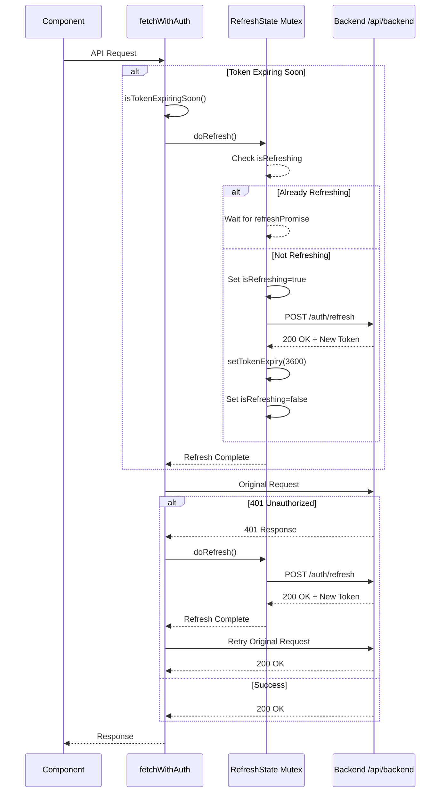
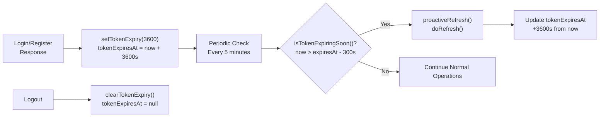
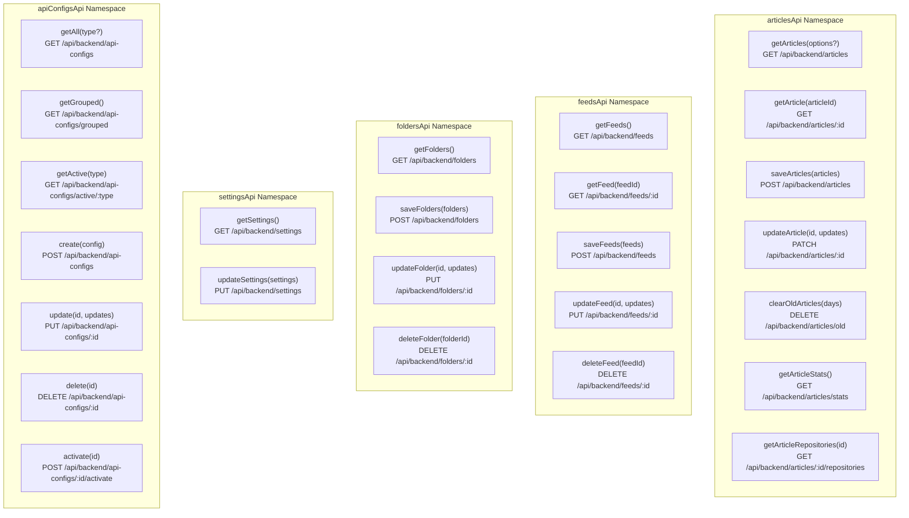
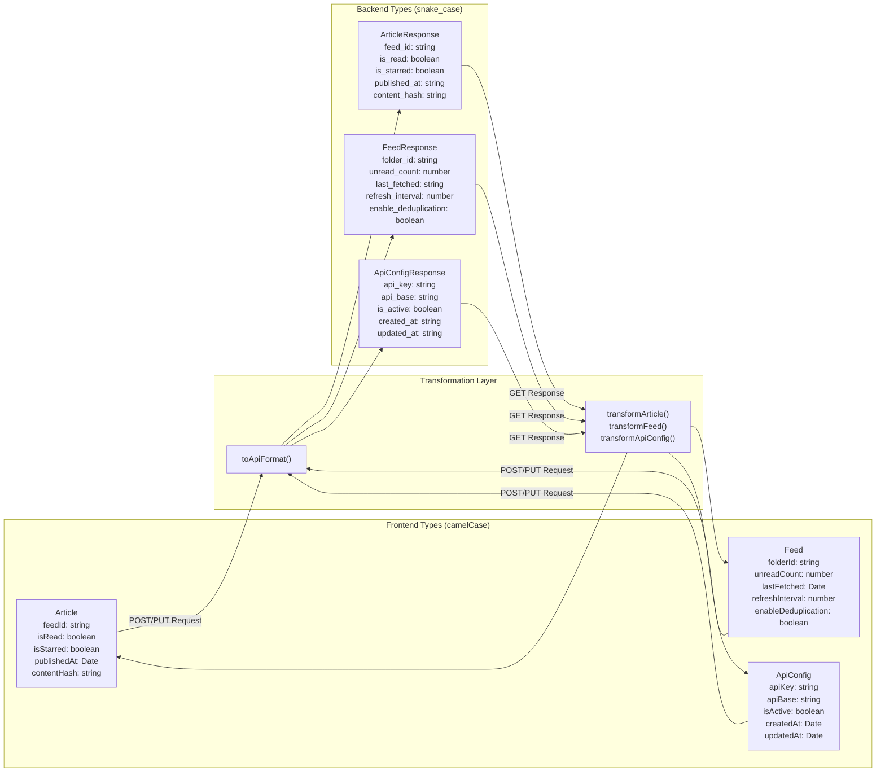
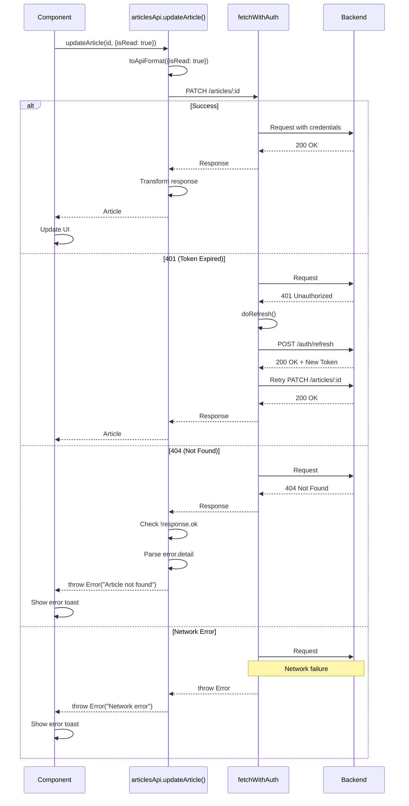
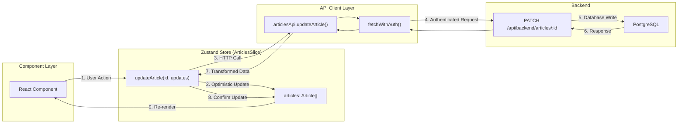
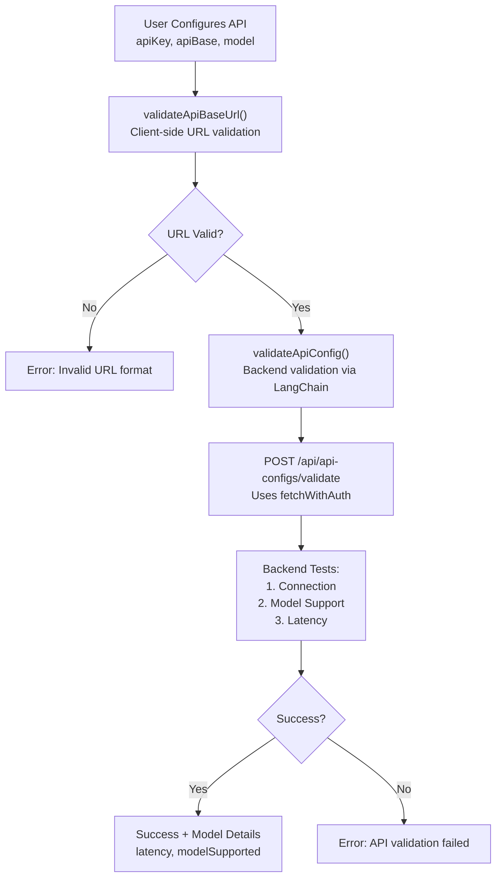

# API Client Layer

<details>
<summary>Relevant source files</summary>

The following files were used as context for generating this wiki page:

- [frontend/CLAUDE.md](frontend/CLAUDE.md)
- [frontend/app/(reader)/settings/storage/page.tsx](frontend/app/(reader)/settings/storage/page.tsx)
- [frontend/components/edit-feed-form.tsx](frontend/components/edit-feed-form.tsx)
- [frontend/hooks/use-realtime-sync.ts](frontend/hooks/use-realtime-sync.ts)
- [frontend/lib/api-validation.ts](frontend/lib/api-validation.ts)
- [frontend/lib/api/api-configs.ts](frontend/lib/api/api-configs.ts)
- [frontend/lib/api/articles.ts](frontend/lib/api/articles.ts)
- [frontend/lib/api/feeds.ts](frontend/lib/api/feeds.ts)
- [frontend/lib/api/fetch-client.ts](frontend/lib/api/fetch-client.ts)
- [frontend/lib/api/folders.ts](frontend/lib/api/folders.ts)
- [frontend/lib/api/github.ts](frontend/lib/api/github.ts)
- [frontend/lib/api/settings.ts](frontend/lib/api/settings.ts)
- [frontend/lib/context/auth-context.tsx](frontend/lib/context/auth-context.tsx)

</details>


## Purpose and Scope

The API Client Layer provides a unified HTTP communication interface between the frontend Next.js application and the backend FastAPI services. This layer handles authentication, automatic token refresh, data transformation between camelCase (frontend) and snake_case (backend), and standardized error handling.

For authentication flows and security mechanisms, see [Authentication & Security](#3.1). For state management that consumes these API clients, see [State Management](#4.1). For backend service implementations, see [Backend Services](#5).

---

## Architecture Overview

The API Client Layer consists of three primary components:

1. **Core Fetch Client** (`fetchWithAuth`) - Handles authentication, token refresh, and request retry
2. **Domain-specific API Clients** - Type-safe wrappers for backend endpoints (articles, feeds, folders, repositories, settings, api-configs)
3. **Data Transformation Layer** - Converts between frontend camelCase and backend snake_case conventions

```mermaid
graph TB
    subgraph "Frontend Components & Stores"
        Store["Zustand Store<br/>(7 Slices)"]
        Components["React Components"]
    end
    
    subgraph "API Client Layer"
        subgraph "Domain API Clients"
            ArticlesAPI["articlesApi<br/>articles.ts"]
            FeedsAPI["feedsApi<br/>feeds.ts"]
            FoldersAPI["foldersApi<br/>folders.ts"]
            SettingsAPI["settingsApi<br/>settings.ts"]
            ApiConfigsAPI["apiConfigsApi<br/>api-configs.ts"]
            GitHubAPI["githubApi<br/>github.ts"]
        end
        
        FetchClient["fetchWithAuth<br/>fetch-client.ts"]
        
        subgraph "Transformation Functions"
            Transform["transformArticle()<br/>transformFeed()<br/>toApiFormat()"]
        end
    end
    
    subgraph "Backend FastAPI"
        Backend["/api/backend/*<br/>HTTP Endpoints"]
    end
    
    Store --> ArticlesAPI
    Store --> FeedsAPI
    Store --> FoldersAPI
    Store --> SettingsAPI
    Store --> ApiConfigsAPI
    Components --> ArticlesAPI
    Components --> GitHubAPI
    
    ArticlesAPI --> Transform
    FeedsAPI --> Transform
    FoldersAPI --> Transform
    
    Transform --> FetchClient
    ArticlesAPI --> FetchClient
    FeedsAPI --> FetchClient
    FoldersAPI --> FetchClient
    SettingsAPI --> FetchClient
    ApiConfigsAPI --> FetchClient
    GitHubAPI --> FetchClient
    
    FetchClient --> Backend
    
    style "API Client Layer" fill:#f5f5f5
```

**Sources:** [frontend/lib/api/fetch-client.ts:1-239](), [frontend/lib/api/articles.ts:1-280](), [frontend/lib/api/feeds.ts:1-203]()

---

## Core Fetch Client (fetchWithAuth)

The `fetchWithAuth` function is the foundation of all HTTP communication. It wraps the native `fetch` API with authentication and token refresh capabilities.

### Key Features

| Feature | Description | Implementation |
|---------|-------------|----------------|
| **Cookie-based Auth** | Uses HttpOnly cookies (`sb_access_token`) for security | [fetch-client.ts:202]() |
| **Automatic 401 Handling** | Detects expired tokens and refreshes automatically | [fetch-client.ts:221-235]() |
| **Proactive Refresh** | Refreshes tokens before expiry (5-minute buffer) | [fetch-client.ts:151-156]() |
| **Mutex-protected Refresh** | Prevents concurrent refresh race conditions | [fetch-client.ts:115-144]() |
| **Single Retry** | Retries failed request once after refresh | [fetch-client.ts:224-229]() |

### Token Refresh Flow



**Sources:** [frontend/lib/api/fetch-client.ts:115-144](), [frontend/lib/api/fetch-client.ts:185-238]()

### Token Expiry Management

The fetch client tracks token expiry to enable proactive refresh:



**Implementation Details:**
- **Default Token Validity:** 3600 seconds (1 hour, Supabase default)
- **Expiry Buffer:** 300 seconds (5 minutes) before actual expiry
- **Proactive Refresh Interval:** Every 5 minutes (from AuthProvider)

**Sources:** [frontend/lib/api/fetch-client.ts:49-86](), [frontend/lib/context/auth-context.tsx:72-86]()

### Skip Auth URLs

Certain endpoints bypass auth handling to prevent infinite refresh loops:

```typescript
const SKIP_AUTH_URLS = [
  "/api/backend/auth/login",
  "/api/backend/auth/register",
  "/api/backend/auth/refresh",
  "/api/backend/auth/logout",
  "/api/backend/auth/session",
]
```

These URLs always use `credentials: "include"` but never trigger token refresh.

**Sources:** [frontend/lib/api/fetch-client.ts:28-34]()

---

## Domain-Specific API Clients

Each domain has a dedicated API client module that provides type-safe functions for backend operations.

### API Client Structure



**Sources:** [frontend/lib/api/articles.ts:269-279](), [frontend/lib/api/feeds.ts:195-202](), [frontend/lib/api/folders.ts:143-148](), [frontend/lib/api/settings.ts:115-118](), [frontend/lib/api/api-configs.ts:212-221]()

### Common API Client Patterns

All API clients follow these consistent patterns:

**1. Namespace Export**
```typescript
export const articlesApi = {
  getArticles,
  saveArticles,
  getArticle,
  updateArticle,
  // ...
}
```

**2. Base URL Constant**
```typescript
const API_BASE = "/api/backend/articles"
```

**3. Type-safe Request/Response**
```typescript
export async function getArticles(options?: {
  feedId?: string
  limit?: number
}): Promise<Article[]> {
  // Implementation
}
```

**4. Error Handling**
```typescript
if (!response.ok) {
  const error: ApiError = await response.json()
  throw new Error(error.detail || "Failed to get articles")
}
```

**Sources:** [frontend/lib/api/articles.ts:269-279](), [frontend/lib/api/feeds.ts:9](), [frontend/lib/api/articles.ts:120-141]()

---

## Data Transformation Layer

The frontend uses camelCase conventions while the backend uses snake_case. Each API client implements bidirectional transformation functions.

### Frontend ↔ Backend Type Mapping



**Sources:** [frontend/lib/api/articles.ts:39-55](), [frontend/lib/api/feeds.ts:33-48](), [frontend/lib/api/api-configs.ts:45-56]()

### Transformation Function Examples

**Articles: Backend → Frontend**
```typescript
function transformArticle(raw: Record<string, unknown>): Article {
  return {
    id: raw.id as string,
    feedId: raw.feed_id as string,  // snake_case → camelCase
    title: raw.title as string,
    content: raw.content as string,
    publishedAt: new Date(raw.published_at as string),  // ISO string → Date
    isRead: (raw.is_read as boolean) ?? false,
    isStarred: (raw.is_starred as boolean) ?? false,
    thumbnail: raw.thumbnail as string | undefined,
    contentHash: raw.content_hash as string | undefined,
    repositoryCount: (raw.repository_count as number) ?? 0,
  }
}
```

**Feeds: Frontend → Backend**
```typescript
function toApiFormat(feed: Partial<Feed>): Record<string, unknown> {
  const result: Record<string, unknown> = {}
  
  // Type guards prevent circular reference errors
  const isString = (val: unknown): val is string => typeof val === "string"
  const isNumber = (val: unknown): val is number => typeof val === "number"
  const isBoolean = (val: unknown): val is boolean => typeof val === "boolean"
  
  if (isString(feed.title)) result.title = feed.title
  if (isString(feed.url)) result.url = feed.url
  if (isString(feed.folderId)) result.folder_id = feed.folderId  // camelCase → snake_case
  if (isNumber(feed.unreadCount)) result.unread_count = feed.unreadCount
  if (feed.lastFetched instanceof Date) {
    result.last_fetched = feed.lastFetched.toISOString()  // Date → ISO string
  }
  
  return result
}
```

**Sources:** [frontend/lib/api/articles.ts:39-55](), [frontend/lib/api/feeds.ts:55-88]()

### Type Safety in Transformation

The `toApiFormat` functions use strict type guards to prevent errors from invalid data:

| Type Guard | Purpose |
|------------|---------|
| `isString(val)` | Ensures string fields aren't objects or arrays |
| `isNumber(val)` | Validates numbers aren't NaN or Infinity |
| `isBoolean(val)` | Confirms boolean type |
| `isDate(val)` | Checks Date instance and valid timestamp |
| `isValidStatus(val)` | Validates enum values |

This prevents circular reference errors when serializing DOM elements or complex objects.

**Sources:** [frontend/lib/api/feeds.ts:59-65]()

---

## Error Handling Patterns

### Standard Error Response

All API clients handle errors consistently:

```typescript
export interface ApiError {
  detail: string
}

// In each API function:
if (!response.ok) {
  const error: ApiError = await response.json()
  throw new Error(error.detail || "Failed to perform operation")
}
```

### Special Error Cases

**Duplicate Detection (409 Conflict)**
```typescript
// Feeds and Folders API
if (response.status === 409) {
  throw new Error("duplicate")
}
```

**Session Expiration (401 Unauthorized)**
```typescript
// Handled automatically by fetchWithAuth
// Component receives: throw new Error("Session expired")
```

**Sources:** [frontend/lib/api/articles.ts:134-137](), [frontend/lib/api/feeds.ts:121-125](), [frontend/lib/api/fetch-client.ts:232-234]()

### Error Flow in Components



**Sources:** [frontend/lib/api/articles.ts:185-207](), [frontend/components/edit-feed-form.tsx:130-148]()

---

## Integration with State Management

API clients are called from Zustand store actions and React components.

### Store Integration Pattern



**Example: Update Article**

```typescript
// In components/article-list.tsx (simplified)
const { updateArticle } = useRSSStore()

const handleMarkRead = async (articleId: string) => {
  await updateArticle(articleId, { isRead: true })
  // Optimistic update already applied by store action
}
```

**Sources:** [frontend/lib/store/articles.slice.ts]() (referenced but not in provided files), [frontend/components/edit-feed-form.tsx:118-121]()

### Direct Component Usage

Some components call API clients directly without going through store:

```typescript
// In components/edit-feed-form.tsx
import { feedsApi } from "@/lib/api/feeds"

const handleSubmit = async () => {
  try {
    // Direct API call
    await feedsApi.updateFeed(feedId, updates)
    
    toast({ title: "Success", description: "Feed updated" })
    router.push(`/feed/${feedId}`)
  } catch (error) {
    if (error.message === "duplicate") {
      toast({ title: "Error", description: "Duplicate URL", variant: "destructive" })
    }
  }
}
```

**Sources:** [frontend/components/edit-feed-form.tsx:118-148]()

---

## API Validation Utilities

The `api-validation.ts` module provides client-side validation for API configurations.

### Validation Flow



**Validation Rules:**
- **URL Format:** Must be valid HTTP/HTTPS or special value "dashscope" for DashScope SDK
- **API Connection:** Backend attempts real API call to `/models` endpoint
- **Model Support:** Verifies specified model is available
- **Latency Check:** Measures response time for performance insight

**Sources:** [frontend/lib/api-validation.ts:26-99](), [frontend/lib/api-validation.ts:105-126]()

---

## API Client Summary Table

| API Client | File | Endpoints | Key Operations |
|------------|------|-----------|----------------|
| **articlesApi** | articles.ts | 7 endpoints | Get, Create (bulk), Update status, Clear old, Stats, Linked repos |
| **feedsApi** | feeds.ts | 5 endpoints | CRUD feeds, Handles duplicates |
| **foldersApi** | folders.ts | 4 endpoints | CRUD folders, Cascading updates |
| **settingsApi** | settings.ts | 2 endpoints | Get/Update user settings, GitHub token management |
| **apiConfigsApi** | api-configs.ts | 7 endpoints | Manage AI API configs, Grouped retrieval, Activation |
| **githubApi** | github.ts | 1 endpoint | Validate GitHub PAT tokens |
| **authApi** | auth.ts | 5 endpoints | Login, Register, Logout, Session, Refresh (not shown in files) |

**Sources:** [frontend/lib/api/articles.ts:269-279](), [frontend/lib/api/feeds.ts:195-202](), [frontend/lib/api/folders.ts:143-148](), [frontend/lib/api/settings.ts:115-118](), [frontend/lib/api/api-configs.ts:212-221](), [frontend/lib/api/github.ts:43-46]()

---

## Key Design Decisions

### 1. Cookie-based Authentication
Uses HttpOnly cookies (`sb_access_token`) instead of localStorage to prevent XSS attacks. Cookies are automatically included with `credentials: "include"`.

### 2. Proactive Token Refresh
Refreshes tokens 5 minutes before expiry to prevent user-visible auth failures during active sessions.

### 3. Mutex-protected Refresh
A single mutex prevents concurrent refresh attempts when multiple requests fail simultaneously.

### 4. Single Retry Policy
Failed requests are retried exactly once after successful token refresh. No exponential backoff to keep UI responsive.

### 5. Strict Type Guards
Transformation functions use type guards to prevent serialization errors from DOM elements or complex objects.

### 6. Namespace Exports
Each API module exports a namespace object for convenient importing:
```typescript
import { articlesApi } from "@/lib/api/articles"
articlesApi.getArticles()
```

**Sources:** [frontend/lib/api/fetch-client.ts:1-10](), [frontend/lib/api/fetch-client.ts:52-54](), [frontend/lib/api/fetch-client.ts:115-144](), [frontend/lib/api/feeds.ts:55-88](), [frontend/lib/api/articles.ts:269-279]()