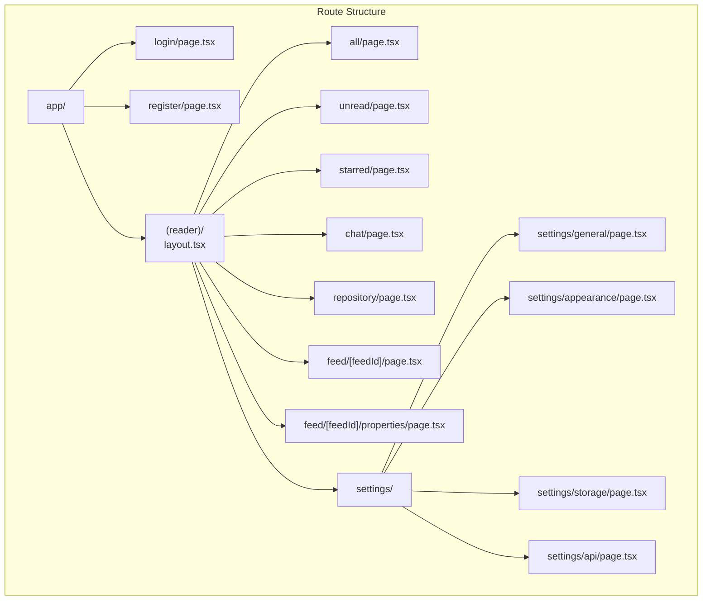
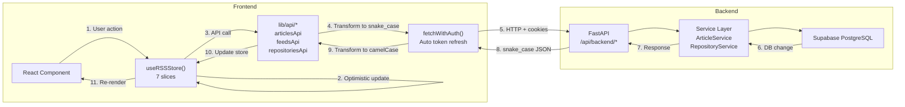
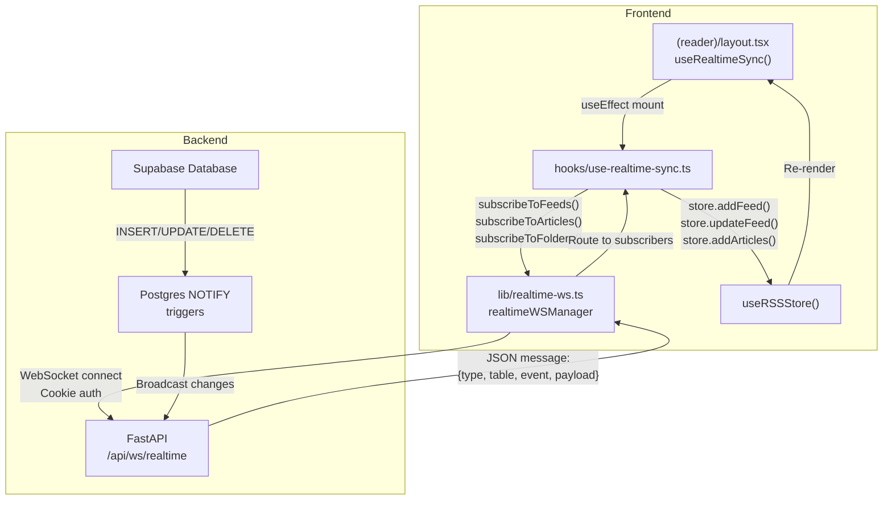
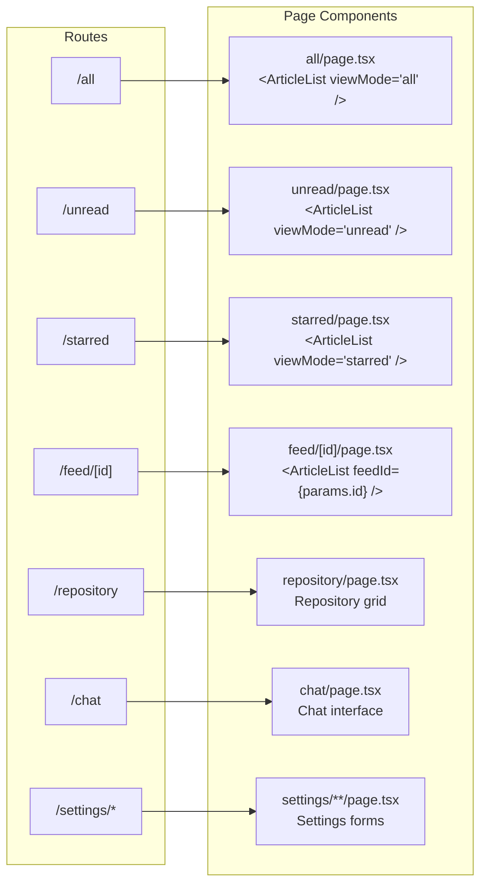

# Frontend Application

<details>
<summary>Relevant source files</summary>

The following files were used as context for generating this wiki page:

- [frontend/CLAUDE.md](frontend/CLAUDE.md)
- [frontend/app/(reader)/settings/storage/page.tsx](frontend/app/(reader)/settings/storage/page.tsx)
- [frontend/components/edit-feed-form.tsx](frontend/components/edit-feed-form.tsx)
- [frontend/components/sidebar/collapsed-view.tsx](frontend/components/sidebar/collapsed-view.tsx)
- [frontend/components/sidebar/expanded-view.tsx](frontend/components/sidebar/expanded-view.tsx)
- [frontend/components/sidebar/index.tsx](frontend/components/sidebar/index.tsx)
- [frontend/hooks/use-realtime-sync.ts](frontend/hooks/use-realtime-sync.ts)
- [frontend/lib/api-validation.ts](frontend/lib/api-validation.ts)
- [frontend/lib/api/api-configs.ts](frontend/lib/api/api-configs.ts)
- [frontend/lib/api/articles.ts](frontend/lib/api/articles.ts)
- [frontend/lib/api/feeds.ts](frontend/lib/api/feeds.ts)
- [frontend/lib/api/fetch-client.ts](frontend/lib/api/fetch-client.ts)
- [frontend/lib/api/folders.ts](frontend/lib/api/folders.ts)
- [frontend/lib/api/github.ts](frontend/lib/api/github.ts)
- [frontend/lib/api/settings.ts](frontend/lib/api/settings.ts)
- [frontend/lib/context/auth-context.tsx](frontend/lib/context/auth-context.tsx)
- [frontend/lib/store/database.slice.ts](frontend/lib/store/database.slice.ts)

</details>


The Frontend Application is a Next.js 14 single-page application that provides the user interface for SaveHub. It implements three primary interfaces: an RSS reader for managing article feeds, a repository browser for GitHub starred repositories, and an AI-powered chat interface for semantic search across both content types. The frontend communicates exclusively with the FastAPI backend via HTTP API calls and maintains real-time synchronization through WebSocket connections.

For details on state management architecture, see [State Management](#4.1). For UI component implementations, see [RSS Reader Interface](#4.2), [Repository Browser](#4.3), and [AI Chat Interface](#4.4). For HTTP communication patterns, see [API Client Layer](#4.5).

---

## Architecture Overview

### Next.js App Router Structure

The frontend uses Next.js 14 App Router with a route-based architecture where **URL serves as the single source of truth** for view state. All routes except authentication pages are nested under the `(reader)` route group, which provides a shared layout with sidebar navigation and database initialization logic.



**Sources:** [frontend/CLAUDE.md:96-111](), [frontend/app/(reader)/layout.tsx]()

### Core Directories

| Directory | Purpose |
|-----------|---------|
| `app/` | Next.js App Router pages and layouts |
| `components/` | React components (UI primitives, business components) |
| `lib/` | Core libraries (store, API clients, utilities) |
| `lib/api/` | HTTP API client modules |
| `lib/store/` | Zustand state management slices |
| `hooks/` | Custom React hooks |

**Sources:** [frontend/CLAUDE.md:39-56]()

---

## Component Hierarchy

### Shared Layout Architecture

The application uses a hierarchical layout structure where the `(reader)/layout.tsx` provides database initialization, authentication enforcement, and sidebar navigation for all content pages.

```mermaid
graph TB
    RootLayout["app/layout.tsx<br/>HTML shell + AuthProvider"]
    ReaderLayout["app/(reader)/layout.tsx<br/>Database init + Sidebar + WebSocket"]
    
    subgraph "Article Views"
        AllPage["all/page.tsx"]
        UnreadPage["unread/page.tsx"]
        StarredPage["starred/page.tsx"]
        FeedPage["feed/[feedId]/page.tsx"]
        
        ArticlePageLayout["ArticlePageLayout<br/>w-96 + flex-1 layout"]
        ArticleList["ArticleList<br/>viewMode or feedId props"]
        ArticleContent["ArticleContent<br/>read/star actions"]
    end
    
    subgraph "Repository View"
        RepoPage["repository/page.tsx"]
        RepoGrid["Repository cards grid"]
        RepoDetail["RepositoryDetailDialog"]
    end
    
    subgraph "Chat View"
        ChatPage["chat/page.tsx"]
        ChatMessages["Message list"]
        ChatInput["Chat input + streaming"]
        RefCards["Article/Repo reference cards"]
    end
    
    subgraph "Settings Views"
        SettingsPages["settings/**/page.tsx"]
        SettingsForms["Various settings forms"]
    end
    
    subgraph "Sidebar Component"
        SidebarIndex["sidebar/index.tsx<br/>State orchestration"]
        ExpandedView["sidebar/expanded-view.tsx"]
        CollapsedView["sidebar/collapsed-view.tsx"]
        FeedItem["sidebar/feed-item.tsx"]
        FolderItem["sidebar/folder-item.tsx"]
        Dialogs["Add/Edit/Delete dialogs"]
    end
    
    RootLayout --> ReaderLayout
    
    ReaderLayout --> SidebarIndex
    ReaderLayout --> AllPage
    ReaderLayout --> UnreadPage
    ReaderLayout --> StarredPage
    ReaderLayout --> FeedPage
    ReaderLayout --> RepoPage
    ReaderLayout --> ChatPage
    ReaderLayout --> SettingsPages
    
    SidebarIndex --> ExpandedView
    SidebarIndex --> CollapsedView
    SidebarIndex --> Dialogs
    
    ExpandedView --> FeedItem
    ExpandedView --> FolderItem
    CollapsedView --> FeedItem
    
    AllPage --> ArticlePageLayout
    UnreadPage --> ArticlePageLayout
    StarredPage --> ArticlePageLayout
    FeedPage --> ArticlePageLayout
    
    ArticlePageLayout --> ArticleList
    ArticlePageLayout --> ArticleContent
    
    RepoPage --> RepoGrid
    RepoGrid --> RepoDetail
    
    ChatPage --> ChatMessages
    ChatPage --> ChatInput
    ChatMessages --> RefCards
```



**Sources:** [frontend/CLAUDE.md:236-260](), [frontend/components/sidebar/index.tsx:1-128](), [frontend/components/sidebar/expanded-view.tsx:1-349]()

### Key Component Responsibilities

**Layout Components:**
- `app/layout.tsx` - Root HTML shell, `AuthProvider` context
- `app/(reader)/layout.tsx` - Database readiness check, data loading, sidebar rendering, WebSocket initialization
- `ArticlePageLayout` - Shared layout for all article list views (fixed-width list + flexible content)

**Sidebar Components:**
- `sidebar/index.tsx` - State management orchestration, dialog coordination
- `sidebar/expanded-view.tsx` - Full sidebar with search, folders, feeds, navigation
- `sidebar/collapsed-view.tsx` - Icon-only sidebar with badges
- `sidebar/feed-item.tsx` - Individual feed with unread badge, drag-drop support
- `sidebar/folder-item.tsx` - Collapsible folder with nested feeds

**Content Components:**
- `article-list.tsx` - Article list with `viewMode` or `feedId` filtering
- `article-content.tsx` - Article reader with read/star actions
- `repository-detail-dialog.tsx` - Full repository details with README
- `chat-interface.tsx` - Chat UI with streaming responses and references

**Sources:** [frontend/CLAUDE.md:236-260](), [frontend/components/sidebar/expanded-view.tsx:42-149]()

---

## Authentication and Security

### Authentication Flow

Authentication uses HttpOnly cookies managed by the FastAPI backend. The frontend never directly handles JWT tokens, preventing XSS attacks.

```mermaid
sequenceDiagram
    participant User
    participant LoginPage["login/page.tsx"]
    participant AuthContext["lib/context/auth-context.tsx<br/>useAuth hook"]
    participant AuthAPI["lib/api/auth.ts<br/>authApi"]
    participant FetchClient["lib/api/fetch-client.ts<br/>fetchWithAuth"]
    participant Backend["FastAPI /api/backend/auth/*"]
    
    User->>LoginPage: Enter credentials
    LoginPage->>AuthContext: login(email, password)
    AuthContext->>AuthAPI: authApi.login()
    AuthAPI->>Backend: POST /api/backend/auth/login
    Note over Backend: Sets HttpOnly cookies:<br/>sb_access_token<br/>sb_refresh_token
    Backend-->>AuthAPI: { user, authenticated: true }
    AuthAPI-->>AuthContext: AuthUser object
    AuthContext->>AuthContext: setUser(authUser)
    AuthContext->>FetchClient: setTokenExpiry(3600)
    AuthContext->>LoginPage: Success
    LoginPage->>User: Navigate to /all
    
    Note over User,Backend: Subsequent API calls
    User->>FetchClient: fetchWithAuth(url)
    FetchClient->>FetchClient: Check isTokenExpiringSoon()
    alt Token expiring soon
        FetchClient->>Backend: POST /api/backend/auth/refresh
        Backend-->>FetchClient: Refresh cookies
        FetchClient->>FetchClient: setTokenExpiry(3600)
    end
    FetchClient->>Backend: Request with cookies
    Backend-->>FetchClient: Response
    FetchClient-->>User: Data
```

**Sources:** [frontend/lib/context/auth-context.tsx:1-142](), [frontend/lib/api/fetch-client.ts:1-239]()

### Automatic Token Refresh

The `fetchWithAuth` client implements automatic token refresh with mutex-based concurrency control:

1. **Proactive Refresh**: Checks `isTokenExpiringSoon()` before each request (5-minute buffer)
2. **Reactive Refresh**: On 401 response, triggers refresh and retries request once
3. **Mutex Lock**: `refreshState` prevents concurrent refresh attempts
4. **Periodic Check**: `AuthProvider` runs proactive refresh every 5 minutes

**Sources:** [frontend/lib/api/fetch-client.ts:145-165](), [frontend/lib/context/auth-context.tsx:72-86]()

---

## Data Flow Patterns

### HTTP API Communication

All data mutations and queries flow through the API client layer, which transforms between frontend camelCase and backend snake_case conventions.



**Sources:** [frontend/CLAUDE.md:126-148](), [frontend/lib/api/articles.ts:36-81](), [frontend/lib/api/feeds.ts:33-88]()

### Example: Article Status Update

When a user marks an article as read:

1. **Component** calls `updateArticleStatus(articleId, { isRead: true })`
2. **ArticlesSlice** optimistically updates local state
3. **ArticlesSlice** calls `articlesApi.updateArticle(articleId, { isRead: true })`
4. **API Client** transforms to `{ is_read: true }` and calls `fetchWithAuth`
5. **Backend** updates database and returns success
6. **WebSocket** broadcasts change to other clients
7. **Store** receives confirmation (already optimistic, no update needed)

**Sources:** [frontend/lib/api/articles.ts:180-207](), [frontend/CLAUDE.md:146]()

---

## Real-time Synchronization

### WebSocket Architecture

The frontend maintains a persistent WebSocket connection to the FastAPI backend for real-time database change notifications.



**Sources:** [frontend/hooks/use-realtime-sync.ts:1-125](), [frontend/CLAUDE.md:148-170]()

### WebSocket Message Format

Messages from the server follow a standardized format:

```typescript
{
  "type": "postgres_changes",
  "table": "feeds" | "articles" | "folders",
  "event": "INSERT" | "UPDATE" | "DELETE",
  "payload": {
    "new": { ...record },  // Present for INSERT/UPDATE
    "old": { ...record }   // Present for UPDATE/DELETE
  }
}
```

The `use-realtime-sync` hook transforms snake_case database rows into camelCase frontend types and routes them to appropriate store actions.

**Sources:** [frontend/hooks/use-realtime-sync.ts:14-114](), [frontend/CLAUDE.md:161-170]()

### Connection Management

The `realtimeWSManager` implements robust connection handling:

- **Auto-reconnect**: Exponential backoff (1s → 2s → 4s → 8s → 16s → 30s max)
- **Heartbeat**: Ping/pong every 30 seconds to detect stale connections
- **Cookie Authentication**: Uses `sb_access_token` HttpOnly cookie
- **Subscription Cleanup**: Unsubscribes on component unmount

**Sources:** [frontend/CLAUDE.md:150-170]()

---

## Routing and Navigation

### URL-as-Source-of-Truth Pattern

Unlike traditional SPAs that store view state in memory, SaveHub derives all view state from URL routes. This enables:

- Shareable/bookmarkable URLs
- Native browser back/forward support
- Proper server-side rendering readiness
- No view state persistence issues

**Navigation Implementation:**

| Pattern | Example | Implementation |
|---------|---------|----------------|
| Declarative Links | Sidebar navigation | `<Link href="/all">All Articles</Link>` |
| Programmatic Navigation | Keyboard shortcuts | `router.push('/starred')` |
| Feed Selection | Click feed in sidebar | `<Link href={`/feed/${feed.id}`}>` |
| Settings Access | Keyboard `,` key | `router.push('/settings')` |

**Sources:** [frontend/CLAUDE.md:96-125](), [frontend/components/sidebar/expanded-view.tsx:195-199]()

### Route-to-Component Mapping



**Sources:** [frontend/CLAUDE.md:96-111](), [frontend/CLAUDE.md:236-248]()

---

## Subsystem Details

The Frontend Application is organized into several specialized subsystems, each documented in detail on separate pages:

### State Management ([#4.1](#4.1))
The Zustand-based state architecture with 7 modular slices: DatabaseSlice, FoldersSlice, FeedsSlice, ArticlesSlice, RepositoriesSlice, UISlice, SettingsSlice. Covers store initialization, optimistic updates, and state synchronization patterns.

### RSS Reader Interface ([#4.2](#4.2))
Article list views, article content viewer, sidebar navigation, feed/folder management dialogs, keyboard shortcuts, and mark-as-read behaviors.

### Repository Browser ([#4.3](#4.3))
Repository cards, grid layout, repository detail dialogs, README markdown rendering, GitHub sync progress UI, and repository filtering.

### AI Chat Interface ([#4.4](#4.4))
Chat message rendering, streaming response handling, article and repository reference cards, reference markers, and chat history management.

### API Client Layer ([#4.5](#4.5))
HTTP client architecture, `fetchWithAuth` wrapper, API client modules (articles, feeds, folders, repositories, settings, API configs), snake_case ↔ camelCase transformation, and error handling patterns.

**Sources:** [frontend/CLAUDE.md:1-480]()

---

## Development Patterns

### Adding a New Page

1. Create route file in `app/(reader)/your-route/page.tsx`
2. Use `ArticlePageLayout` wrapper if displaying articles
3. Import necessary store slices via `useRSSStore()`
4. Ensure proper `"use client"` directive if using hooks
5. Update sidebar navigation in `expanded-view.tsx` and `collapsed-view.tsx`

**Sources:** [frontend/CLAUDE.md:370-390]()

### Component Creation Guidelines

- Use shadcn/ui primitives from `@/components/ui/`
- Import store actions via `useRSSStore()` destructuring
- Use `fetchWithAuth` for API calls (automatic token refresh)
- Implement optimistic updates for better UX
- Handle loading and error states explicitly
- Use `react-hook-form` + Zod for form validation

**Sources:** [frontend/CLAUDE.md:349-369]()

### Logging Best Practices

```typescript
import { logger } from "@/lib/logger"

// Info logging with context
logger.info({ userId, feedId, articleCount }, 'Feed refreshed successfully')

// Error logging
logger.error({ error, feedId }, 'Feed refresh failed')

// Automatic redaction of sensitive fields
logger.info({ apiKey: 'secret' }, 'Config saved') // apiKey auto-redacted
```

Sensitive fields (`apiKey`, `password`, `token`) are automatically redacted. No pino-pretty transport to avoid Next.js hot reload conflicts.

**Sources:** [frontend/CLAUDE.md:390-415]()