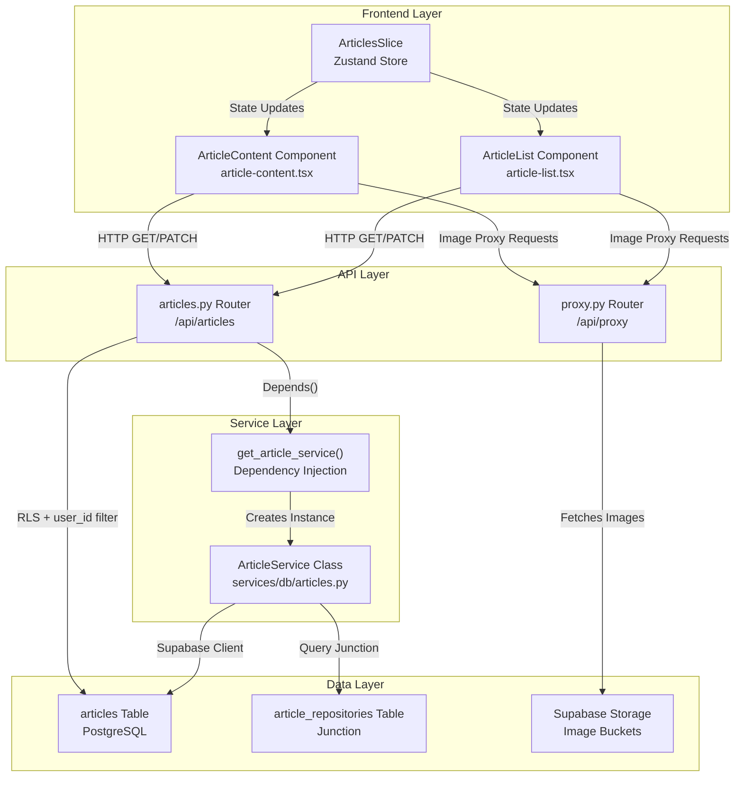
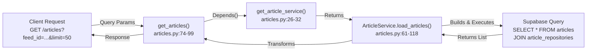
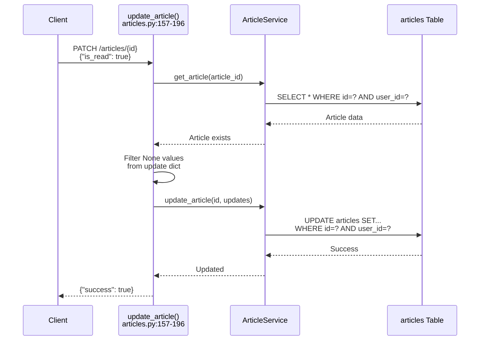
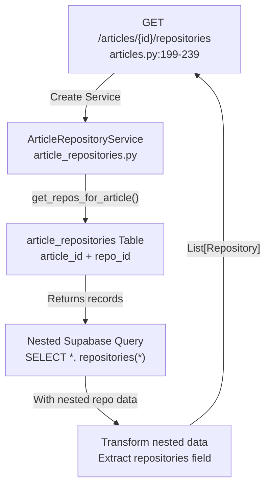
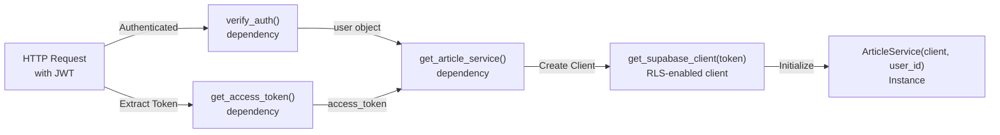
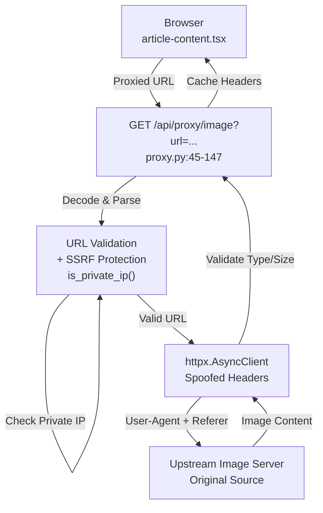
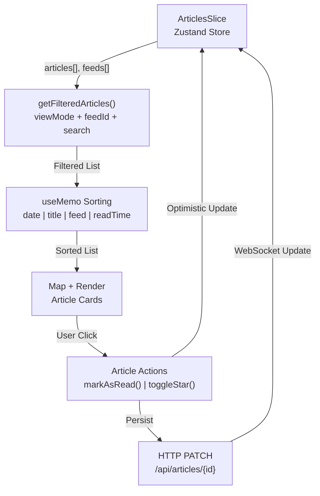
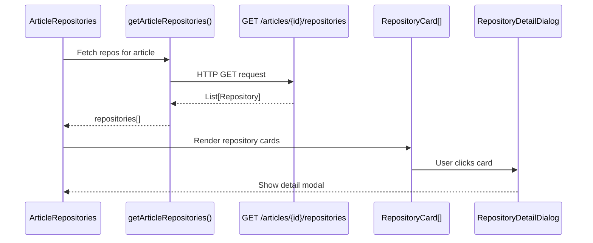

# Articles Management

<details>
<summary>Relevant source files</summary>

The following files were used as context for generating this wiki page:

- [CLAUDE.md](CLAUDE.md)
- [backend/app/api/routers/articles.py](backend/app/api/routers/articles.py)
- [backend/app/api/routers/folders.py](backend/app/api/routers/folders.py)
- [backend/app/api/routers/proxy.py](backend/app/api/routers/proxy.py)
- [backend/app/api/routers/websocket.py](backend/app/api/routers/websocket.py)
- [backend/app/main.py](backend/app/main.py)
- [backend/app/schemas/articles.py](backend/app/schemas/articles.py)
- [backend/app/services/db/articles.py](backend/app/services/db/articles.py)
- [frontend/components/article-content.tsx](frontend/components/article-content.tsx)
- [frontend/components/article-list.tsx](frontend/components/article-list.tsx)
- [frontend/components/article-repositories.tsx](frontend/components/article-repositories.tsx)
- [frontend/lib/utils.ts](frontend/lib/utils.ts)
- [image/5.png](image/5.png)

</details>


## Purpose and Scope

This document describes the articles management subsystem in the backend, covering HTTP API endpoints, database operations, and supporting services. Article management handles CRUD operations for RSS feed articles, tracking read/starred status, calculating statistics, and managing old article cleanup. The image proxy service, which enables displaying article thumbnails and embedded images by bypassing CORS restrictions, is also documented here.

For feed subscription and RSS parsing, see [Feeds Management](#5.2). For article content enrichment (RAG processing, image captions, repository extraction), see [Background Processing](#6) and its subsections. For real-time article synchronization across clients, see [Real-time Synchronization](#3.2).

---

## System Architecture Overview

The articles management system follows a three-layer architecture:



**Sources:** [backend/app/api/routers/articles.py:1-240](), [backend/app/services/db/articles.py:1-312](), [frontend/components/article-list.tsx:1-342](), [frontend/components/article-content.tsx:1-275]()

---

## API Endpoints

The articles router exposes seven endpoints under the `/api/articles` prefix. All endpoints require authentication via JWT token (cookie or Authorization header) and enforce user-scoped access via RLS (Row Level Security).

### Endpoint Summary

| Method | Path | Purpose | Request | Response |
|--------|------|---------|---------|----------|
| GET | `/articles` | List articles with filtering | `feed_id?`, `limit?` | `List[ArticleResponse]` |
| GET | `/articles/{article_id}` | Get single article | UUID path param | `ArticleResponse` |
| GET | `/articles/stats` | Get article statistics | None | `ArticleStatsResponse` |
| GET | `/articles/{article_id}/repositories` | Get linked repositories | UUID path param | `List[RepositoryResponse]` |
| POST | `/articles` | Bulk create/upsert articles | `List[ArticleCreate]` | `{"success": bool, "count": int}` |
| PATCH | `/articles/{article_id}` | Update article fields | `ArticleUpdate` | `{"success": bool}` |
| DELETE | `/articles/old` | Delete old read articles | `days?` query param | `ClearOldArticlesResponse` |

**Sources:** [backend/app/api/routers/articles.py:23-240]()

---

### GET /articles - List Articles



**Query Parameters:**
- `feed_id` (optional): Filter articles by specific feed UUID
- `limit` (optional): Max articles to return (range: 1-1000)

**Behavior:**
- Always filters by authenticated user's `user_id` (RLS enforcement)
- Joins with `article_repositories` table to include repository count
- Orders by `published_at` descending (newest first)
- Returns repository count in `repository_count` field for each article

**Implementation Details:**

The service method [articles.py:61-118]() constructs a Supabase query with:
1. Base selection: `SELECT *, article_repositories(count)`
2. User filter: `.eq("user_id", self.user_id)`
3. Optional feed filter: `.eq("feed_id", feed_id)`
4. Ordering: `.order("published_at", desc=True)`
5. Optional limit: `.limit(limit)`

The response transformation [articles.py:92-115]() extracts the repository count from the nested `article_repositories` aggregation and flattens it into the article dict.

**Sources:** [backend/app/api/routers/articles.py:74-99](), [backend/app/services/db/articles.py:61-118]()

---

### PATCH /articles/{article_id} - Update Article

The primary use case for article updates is toggling read/starred status. The endpoint supports partial updates via the `ArticleUpdate` schema.



**Supported Update Fields:**
- `is_read` (bool): Mark article as read/unread
- `is_starred` (bool): Star/unstar article
- `title`, `content`, `summary`, `author`, `url`, `thumbnail`: Content updates (rarely used)
- `published_at` (datetime): Publication date

**Implementation Notes:**

The update logic [articles.py:179-196]() follows this pattern:
1. Verify article exists and belongs to user (404 if not found)
2. Filter out `None` values from `ArticleUpdate` model
3. Return early if no fields to update
4. Call `service.update_article()` with filtered dict
5. Service enforces user_id filter: `.eq("user_id", self.user_id)` [articles.py:181-185]()

**Sources:** [backend/app/api/routers/articles.py:157-196](), [backend/app/services/db/articles.py:149-188]()

---

### GET /articles/stats - Article Statistics

Returns aggregated statistics for the authenticated user's articles.

**Response Schema:**
```json
{
  "total": 1523,
  "unread": 342,
  "starred": 89,
  "by_feed": {
    "feed-uuid-1": {"total": 450, "unread": 23},
    "feed-uuid-2": {"total": 380, "unread": 15}
  }
}
```

**Implementation:**

The statistics calculation [articles.py:226-263]() performs a single query fetching all article IDs with their `feed_id`, `is_read`, and `is_starred` flags. Statistics are computed in-memory:

1. Query: `SELECT id, feed_id, is_read, is_starred WHERE user_id=?`
2. Iterate through results once
3. Increment counters:
   - `total` for each article
   - `unread` when `is_read == false`
   - `starred` when `is_starred == true`
   - Per-feed totals and unread counts

This approach is efficient because it avoids multiple database round-trips and leverages RLS for security.

**Sources:** [backend/app/api/routers/articles.py:35-48](), [backend/app/services/db/articles.py:226-263]()

---

### GET /articles/{article_id}/repositories - Linked Repositories

Returns GitHub repositories extracted from article content. This endpoint queries the junction table `article_repositories` with nested repository data.



**Response Processing:**

The endpoint [articles.py:220-236]() performs these transformations:
1. Query junction table with nested select: `repositories(*)`
2. Extract `repositories` field from each junction record
3. Convert `None` to empty list for array fields: `topics`, `ai_tags`, `ai_platforms`, `custom_tags`
4. Return flattened list of repository objects

**List Field Normalization:**

The normalization loop [articles.py:226-233]() ensures that repository list fields never contain `null`:
```python
list_fields = ['topics', 'ai_tags', 'ai_platforms', 'custom_tags']
for field in list_fields:
    if repo_data.get(field) is None:
        repo_data[field] = []
```

This prevents frontend errors when iterating over these fields.

**Sources:** [backend/app/api/routers/articles.py:199-239]()

---

### DELETE /articles/old - Clear Old Articles

Bulk deletes old read articles that are not starred, helping users manage storage and keep their article list focused.

**Query Parameters:**
- `days` (optional): Days to keep articles (default: 30, range: 1-365)

**Deletion Criteria:**
1. `user_id` matches authenticated user
2. `published_at` older than cutoff date
3. `is_read == true`
4. `is_starred == false`

**Implementation:**

The deletion logic [articles.py:199-224]() uses a single DELETE query with multiple conditions:

```python
cutoff_date = datetime.utcnow() - timedelta(days=days_to_keep)

response = supabase.table("articles") \
    .delete() \
    .eq("user_id", self.user_id) \
    .lt("published_at", cutoff_date.isoformat()) \
    .eq("is_read", True) \
    .eq("is_starred", False) \
    .execute()

deleted_count = len(response.data or [])
```

The `.lt()` (less than) filter compares `published_at` against the cutoff timestamp. Supabase RLS ensures users can only delete their own articles.

**Sources:** [backend/app/api/routers/articles.py:51-71](), [backend/app/services/db/articles.py:199-224]()

---

## ArticleService Database Operations

The `ArticleService` class encapsulates all article database operations with user-scoped queries.

### Service Initialization



The dependency injection pattern [articles.py:26-32]() ensures every service instance:
1. Has an authenticated Supabase client with the user's JWT
2. Knows the authenticated user's ID
3. Can only access that user's data (via RLS)

**Sources:** [backend/app/api/routers/articles.py:26-32]()

---

### save_articles() - Bulk Upsert

Saves multiple articles to the database with conflict resolution.

**Signature:** `save_articles(articles: List[dict]) -> None`

**Upsert Logic:**

The method [articles.py:22-59]() uses Supabase's upsert with a composite conflict key:

```python
response = self.supabase.table("articles").upsert(
    db_rows,
    on_conflict="feed_id,content_hash"
).execute()
```

**Conflict Resolution:**
- If an article with the same `(feed_id, content_hash)` exists, it's updated
- Otherwise, a new article is inserted
- This prevents duplicate articles while allowing content updates

**Data Transformation:**

The method transforms input articles [articles.py:30-50]() by:
1. Converting `datetime` objects to ISO strings for `published_at`
2. Setting default values: `is_read=False`, `is_starred=False`
3. Ensuring `user_id` is set to current user
4. Handling optional fields: `summary`, `author`, `thumbnail`, `content_hash`

**Sources:** [backend/app/services/db/articles.py:22-59]()

---

### get_article() - Single Article Retrieval

Fetches a single article by ID with user-scoped filtering.

**Signature:** `get_article(article_id: str) -> Optional[dict]`

**Query Pattern:**

The implementation [articles.py:120-147]() follows this pattern:
```python
response = self.supabase.table("articles") \
    .select("*") \
    .eq("id", article_id) \
    .eq("user_id", self.user_id) \
    .limit(1) \
    .execute()
```

**Security:** The `.eq("user_id", self.user_id)` filter ensures users can only access their own articles, even if they somehow obtain another user's article ID.

**Return Value:**
- Returns article dict if found
- Returns `None` if not found or belongs to different user

**Sources:** [backend/app/services/db/articles.py:120-147]()

---

### Repository Extraction Status Management

The service provides methods to track GitHub repository extraction status for articles.

**Status Fields:**
- `repos_extracted` (boolean or NULL): Extraction status
  - `NULL`: Not yet attempted
  - `true`: Successfully extracted
  - `false`: Extraction failed
- `repos_extracted_at` (timestamp): When extraction completed

#### get_articles_needing_repo_extraction()

Returns articles ready for repository extraction.

**Signature:** `get_articles_needing_repo_extraction(limit: int = 50) -> List[dict]`

**Selection Criteria [articles.py:265-288]():**
1. `images_processed == true` (content is finalized)
2. `repos_extracted IS NULL` (not yet attempted)
3. Ordered by `created_at` descending
4. Limited to specified count

This ensures only articles with complete content are processed, and avoids retrying failed extractions.

#### mark_repos_extracted()

Updates extraction status after processing.

**Signature:** `mark_repos_extracted(article_id: str, success: bool) -> None`

**Update Logic [articles.py:290-311]():**
```python
update_data = {
    "repos_extracted": success,
    "repos_extracted_at": datetime.now(timezone.utc).isoformat(),
}

self.supabase.table("articles") \
    .update(update_data) \
    .eq("id", article_id) \
    .eq("user_id", self.user_id) \
    .execute()
```

This tracks both success/failure and timestamp, enabling retry logic and debugging.

**Sources:** [backend/app/services/db/articles.py:265-311]()

---

## Image Proxy Service

The image proxy router bypasses CORS and hotlink protection restrictions that prevent direct loading of article images in the frontend.

### Architecture



**Sources:** [backend/app/api/routers/proxy.py:1-148]()

---

### SSRF Protection

The proxy implements Server-Side Request Forgery (SSRF) protection to prevent abuse.

**Protection Mechanism [proxy.py:35-43]():**

```python
def is_private_ip(hostname: str) -> bool:
    """Check if hostname resolves to private IP (SSRF protection)."""
    try:
        ip = socket.gethostbyname(hostname)
        ip_obj = ipaddress.ip_address(ip)
        return ip_obj.is_private or ip_obj.is_loopback or ip_obj.is_reserved
    except socket.gaierror:
        return False
```

**Blocked Targets:**
- Private IPs: `10.0.0.0/8`, `172.16.0.0/12`, `192.168.0.0/16`
- Loopback: `127.0.0.0/8`, `::1`
- Reserved ranges
- Link-local addresses

If SSRF is detected, the endpoint returns 403 Forbidden and logs the attempt [proxy.py:74-76]().

**Sources:** [backend/app/api/routers/proxy.py:35-76]()

---

### Hotlink Protection Bypass

Many image hosting services block requests without proper Referer/User-Agent headers. The proxy spoofs these headers.

**Header Spoofing [proxy.py:79-93]():**

```python
response = await client.get(
    decoded_url,
    headers={
        "User-Agent": "Mozilla/5.0 (Windows NT 10.0; Win64; x64) ...",
        "Referer": f"{parsed.scheme}://{parsed.netloc}/",
        "Accept": "image/avif,image/webp,image/apng,image/*,*/*;q=0.8",
        "Accept-Language": "en-US,en;q=0.9",
    },
)
```

**Key Headers:**
- **User-Agent**: Appears as Chrome browser to bypass bot detection
- **Referer**: Set to origin domain to pass hotlink protection
- **Accept**: Declares support for modern image formats

**Sources:** [backend/app/api/routers/proxy.py:79-93]()

---

### Content Validation

The proxy validates both content type and size to ensure only legitimate images are proxied.

**Allowed Content Types [proxy.py:22-32]():**
- `image/jpeg`, `image/png`, `image/gif`, `image/webp`
- `image/svg+xml`, `image/x-icon`, `image/bmp`, `image/tiff`, `image/avif`

**Size Limits:**
- Max image size: 10MB [proxy.py:20]()
- Enforced via Content-Length header check
- Also validates actual response body size (for chunked encoding)

**Validation Logic [proxy.py:104-125]():**

1. Check HTTP status code (must be 200)
2. Parse Content-Type header
3. Verify against allowed types
4. Check Content-Length if present
5. Measure actual content size
6. Reject if either exceeds 10MB

**Sources:** [backend/app/api/routers/proxy.py:20-125]()

---

### Caching Strategy

The proxy sets cache headers to reduce repeated requests to upstream servers.

**Response Headers [proxy.py:128-135]():**
```python
return Response(
    content=content,
    media_type=content_type,
    headers={
        "Cache-Control": "public, max-age=86400",  # 24h browser cache
        "X-Proxy-Source": parsed.netloc,
    },
)
```

**Cache Behavior:**
- `public`: Browser and CDN can cache
- `max-age=86400`: 24-hour cache lifetime
- `X-Proxy-Source`: Custom header showing origin domain

This reduces load on both the proxy server and upstream image hosts.

**Sources:** [backend/app/api/routers/proxy.py:128-135]()

---

### Frontend Integration

The frontend utility `getProxiedImageUrl()` [utils.ts:61-74]() transforms image URLs:

**Transformation Logic:**
1. Skip already proxied URLs (start with `/api/backend/proxy/image`)
2. Skip data URIs (`data:`)
3. Skip local paths (start with `/` but not `//`)
4. URL-encode original URL
5. Return: `/api/backend/proxy/image?url={encoded_url}`

**HTML Content Processing:**

The `sanitizeHTML()` function [utils.ts:76-90]() rewrites all `` tags in article content to use proxied URLs:

```typescript
.replace(
  /]*?)src=["']([^"']+)["']([^>]*)>/gi,
  (_match, before, src, after) => {
    const proxiedSrc = getProxiedImageUrl(src)
    return ``
  }
)
```

This ensures all article images load through the proxy, regardless of hotlink protection.

**Sources:** [frontend/lib/utils.ts:61-90](), [frontend/components/article-content.tsx:237-241]()

---

## Request/Response Schemas

All API endpoints use Pydantic models for request/response validation.

### ArticleBase

Base model with common fields shared by creation and response.

```python
class ArticleBase(BaseModel):
    feed_id: UUID
    title: str
    content: str
    summary: Optional[str] = None
    url: str
    author: Optional[str] = None
    published_at: datetime
    is_read: bool = False
    is_starred: bool = False
    thumbnail: Optional[str] = None
    content_hash: Optional[str] = None
```

**Field Notes:**
- `content_hash`: MD5 hash used for deduplication
- `thumbnail`: Original image URL (proxied by frontend)
- `summary`: Optional excerpt or description

**Sources:** [backend/app/schemas/articles.py:9-22]()

---

### ArticleCreate

Request model for bulk article creation/upsert.

```python
class ArticleCreate(ArticleBase):
    id: UUID  # Client-generated UUID for upsert support
```

**Design Rationale:**

Including client-generated UUIDs enables:
1. **Idempotent upserts**: Client can retry requests without creating duplicates
2. **Optimistic updates**: Frontend can display articles before server response
3. **Conflict resolution**: Combined with `content_hash` for deduplication

**Sources:** [backend/app/schemas/articles.py:24-27]()

---

### ArticleUpdate

Request model for partial updates (all fields optional).

```python
class ArticleUpdate(BaseModel):
    title: Optional[str] = None
    content: Optional[str] = None
    summary: Optional[str] = None
    url: Optional[str] = None
    author: Optional[str] = None
    published_at: Optional[datetime] = None
    is_read: Optional[bool] = None
    is_starred: Optional[bool] = None
    thumbnail: Optional[str] = None
```

**Usage Pattern:**

Only non-`None` fields are included in the database update:
```python
update_data = {k: v for k, v in article_update.model_dump().items() if v is not None}
```

This allows updating a single field (e.g., `is_read`) without affecting others.

**Sources:** [backend/app/schemas/articles.py:34-45]()

---

### ArticleResponse

Response model including computed fields.

```python
class ArticleResponse(ArticleBase):
    id: UUID
    user_id: UUID
    created_at: Optional[datetime] = None
    repository_count: int = 0  # Linked repository count
```

**Computed Fields:**
- `repository_count`: Populated from `article_repositories` join query
- `created_at`: Auto-generated by database

**Sources:** [backend/app/schemas/articles.py:47-56]()

---

### Statistics Schemas

**ArticleStatsResponse:**
```python
class ArticleStatsResponse(BaseModel):
    total: int
    unread: int
    starred: int
    by_feed: dict  # Record<feed_id, { total: int, unread: int }>
```

**ClearOldArticlesResponse:**
```python
class ClearOldArticlesResponse(BaseModel):
    deleted_count: int
```

**Sources:** [backend/app/schemas/articles.py:58-69]()

---

## Frontend Integration

The frontend interacts with articles management through the Zustand articles slice and React components.

### Article List Component

The `ArticleList` component displays articles with filtering, sorting, and actions.



**Key Features [article-list.tsx:28-341]():**

1. **Filtering**: By view mode (all/unread/starred), feed, and search query
2. **Sorting**: By date, title, feed name, or reading time
3. **Status Indicators**: Unread dot, star icon, repository count badge
4. **Thumbnail Display**: Proxied images with error handling
5. **Context Actions**: Mark read/unread, toggle star, open original

**Sources:** [frontend/components/article-list.tsx:1-342]()

---

### Article Content Component

The `ArticleContent` component renders full article details with interactive controls.

**Layout Structure:**
1. **Header**: Title, metadata, action buttons (star, share, font size)
2. **Content Area**: Sanitized HTML with proxied images
3. **Related Repositories**: `ArticleRepositories` component showing linked repos
4. **Footer**: Publication date, source feed, "Read Original" button

**Content Processing [article-content.tsx:89-241]():**

```typescript
const sanitizedContent = sanitizeHTML(selectedArticle.content)

<div
  className="prose prose-gray dark:prose-invert max-w-none..."
  style={{ fontSize: `${settings.fontSize}px`, lineHeight: 1.6 }}
  dangerouslySetInnerHTML={{ __html: sanitizedContent }}
/>
```

**Security:** The `sanitizeHTML()` function removes script tags and dangerous attributes while proxying all image URLs.

**Sources:** [frontend/components/article-content.tsx:1-275]()

---

### ArticleRepositories Component

Displays GitHub repositories extracted from article content.



**Behavior [article-repositories.tsx:14-91]():**
1. Fetches repositories on mount via `useEffect`
2. Hides entirely if loading or no repositories (not visible in UI)
3. Displays grid of repository cards (2 columns on desktop)
4. Opens detail dialog on card click
5. Shows section title with count badge

**Sources:** [frontend/components/article-repositories.tsx:1-92]()

---

## Error Handling

### API Error Responses

All endpoints return consistent error responses:

| Status Code | Condition | Example |
|-------------|-----------|---------|
| 400 | Invalid request data | Invalid UUID format |
| 401 | Authentication failed | Missing/expired JWT |
| 403 | Authorization denied | SSRF protection triggered |
| 404 | Resource not found | Article ID doesn't exist |
| 413 | Payload too large | Image exceeds 10MB |
| 500 | Internal server error | Database connection failure |
| 502 | Upstream error | Image server unreachable |
| 504 | Timeout | Image fetch timeout (15s) |

### Service Layer Error Handling

Service methods use try-except blocks with logging:

```python
try:
    articles = service.load_articles(feed_id=str(feed_id), limit=limit)
    logger.debug(f"Retrieved {len(articles)} articles")
    return articles
except Exception as e:
    logger.error(f"Failed to get articles: {e}")
    raise HTTPException(status_code=500, detail="Failed to retrieve articles")
```

This pattern:
1. Logs errors with context
2. Converts exceptions to HTTP exceptions
3. Hides internal details from clients

**Sources:** [backend/app/api/routers/articles.py:90-99]()

---

## Integration Points

### Real-time Synchronization

Article updates trigger WebSocket events to connected clients:

1. **Update Flow**: PATCH request → Database update → Postgres trigger → WebSocket broadcast
2. **Event Type**: `postgres_changes` with `table: "articles"`, `event: "UPDATE"`
3. **Client Handling**: Zustand store updates local state from WebSocket message

For details on the WebSocket architecture, see [Real-time Synchronization](#3.2).

**Sources:** [backend/app/api/routers/websocket.py:64-122]()

---

### Background Processing Integration

Articles trigger asynchronous enrichment tasks:

1. **Image Processing**: After article creation → `schedule_image_processing` task
2. **RAG Processing**: After images complete → `process_article_rag` task
3. **Repository Extraction**: After RAG complete → `extract_article_repos` task

The `repos_extracted` status field enables selective queueing via `get_articles_needing_repo_extraction()`.

For background task details, see [Background Processing](#6).

**Sources:** [backend/app/services/db/articles.py:265-311]()

---

## Performance Considerations

### Query Optimization

1. **Indexed Fields**: The database has indexes on `user_id`, `feed_id`, `published_at`, `is_read`, `is_starred`
2. **Selective Fields**: List endpoints only fetch necessary fields
3. **Pagination**: `limit` parameter prevents unbounded result sets
4. **Single Query Stats**: `get_article_stats()` uses one query with in-memory aggregation

### Caching Strategy

1. **Browser Cache**: Proxied images cached for 24 hours
2. **Optimistic Updates**: Frontend updates state immediately, syncs via WebSocket
3. **RLS Performance**: User-scoped queries use indexed `user_id` column

### Connection Management

The `ArticleService` uses the authenticated user's Supabase client, which maintains connection pooling and handles retries automatically.

**Sources:** [backend/app/services/db/articles.py:18-20](), [backend/app/api/routers/proxy.py:128-135]()