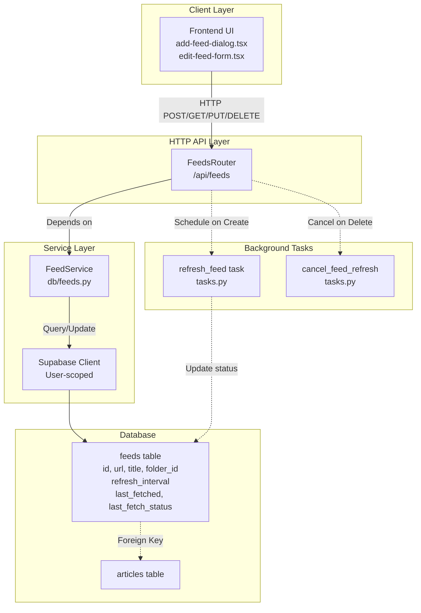
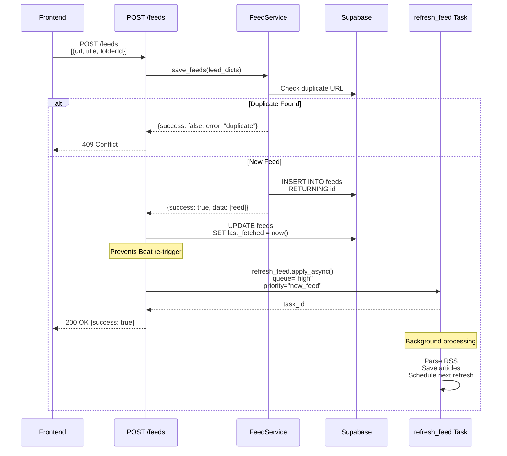
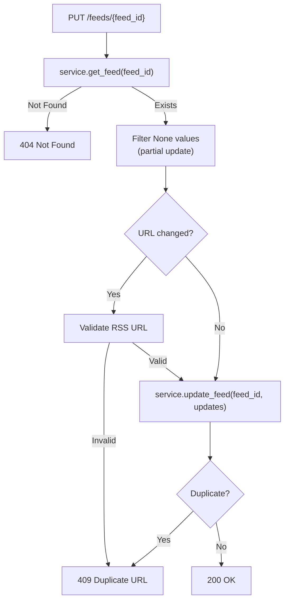
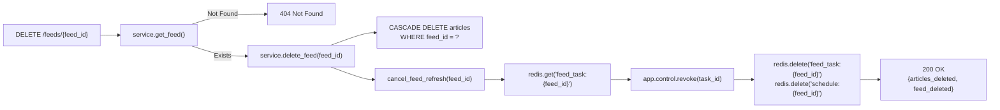
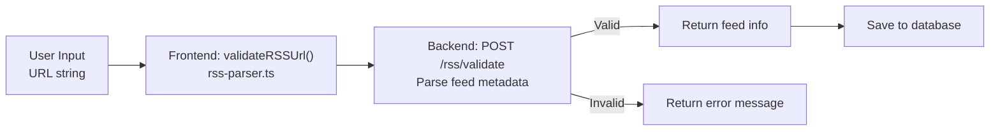
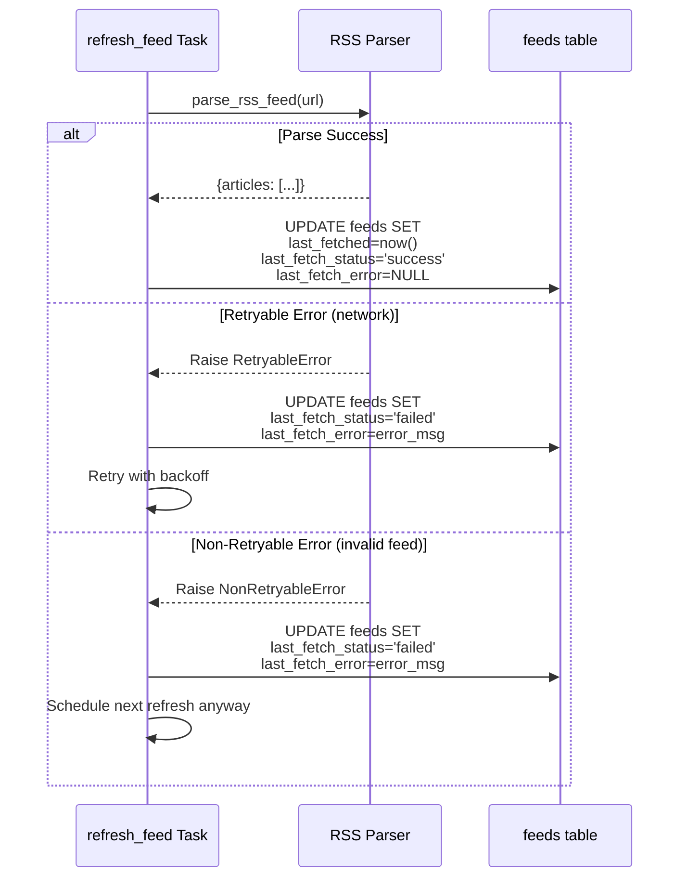
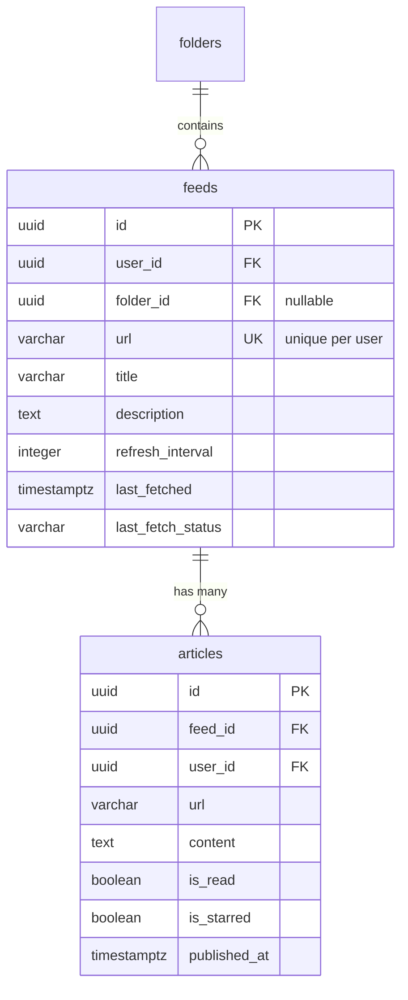
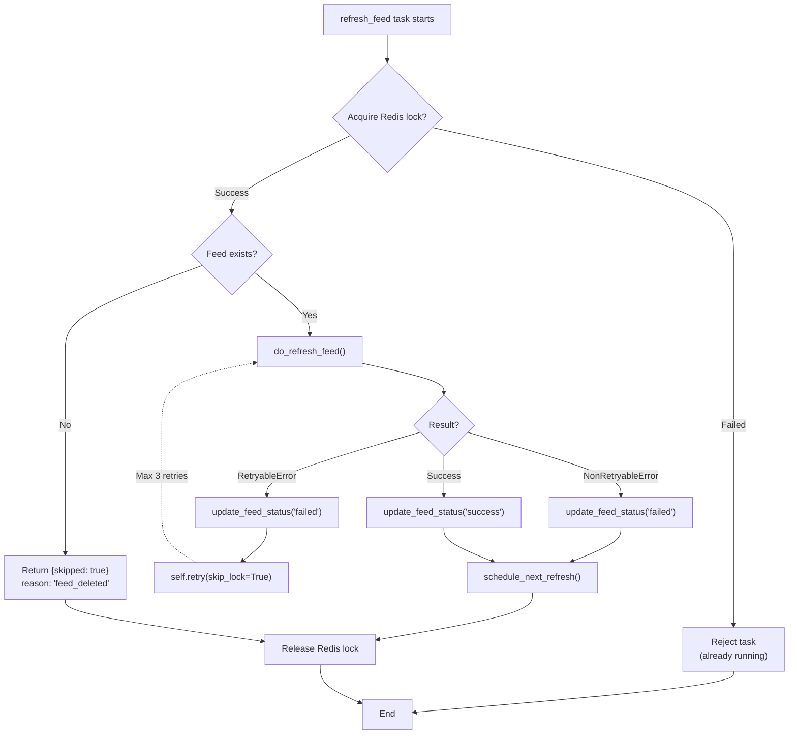

# Feeds Management

<details>
<summary>Relevant source files</summary>

The following files were used as context for generating this wiki page:

- [backend/app/api/routers/articles.py](backend/app/api/routers/articles.py)
- [backend/app/api/routers/feeds.py](backend/app/api/routers/feeds.py)
- [backend/app/api/routers/folders.py](backend/app/api/routers/folders.py)
- [backend/app/api/routers/proxy.py](backend/app/api/routers/proxy.py)
- [backend/app/celery_app/CLAUDE.md](backend/app/celery_app/CLAUDE.md)
- [backend/app/celery_app/celery.py](backend/app/celery_app/celery.py)
- [backend/app/celery_app/image_processor.py](backend/app/celery_app/image_processor.py)
- [backend/app/celery_app/tasks.py](backend/app/celery_app/tasks.py)
- [backend/app/schemas/articles.py](backend/app/schemas/articles.py)
- [backend/app/services/db/articles.py](backend/app/services/db/articles.py)
- [frontend/CLAUDE.md](frontend/CLAUDE.md)
- [frontend/app/(reader)/settings/storage/page.tsx](frontend/app/(reader)/settings/storage/page.tsx)
- [frontend/components/add-feed-dialog.tsx](frontend/components/add-feed-dialog.tsx)
- [frontend/components/article-content.tsx](frontend/components/article-content.tsx)
- [frontend/components/article-list.tsx](frontend/components/article-list.tsx)
- [frontend/components/article-repositories.tsx](frontend/components/article-repositories.tsx)
- [frontend/components/edit-feed-form.tsx](frontend/components/edit-feed-form.tsx)
- [frontend/lib/utils.ts](frontend/lib/utils.ts)
- [image/5.png](image/5.png)

</details>


## Purpose and Scope

This document describes the backend API and service layer for RSS feed management in SaveHub. It covers:

- **Feed CRUD operations** via HTTP API endpoints
- **FeedService** database operations and validation logic
- **Feed refresh scheduling** and integration with Celery background tasks
- **Feed deletion** and cleanup mechanisms

For information about the actual RSS feed parsing and article extraction, see [RSS Feed Processing](#6.1). For the frontend feed management UI, see [RSS Reader Interface](#4.2).

---

## System Architecture Overview

The feed management system consists of three layers: HTTP API, database service, and background task scheduling.



**Sources:** [backend/app/api/routers/feeds.py:1-228](), [backend/app/celery_app/tasks.py:1-919]()

---

## API Endpoints

The feeds router exposes five RESTful endpoints for feed management. All endpoints require authentication via cookie-based JWT.

### Endpoint Summary

| Method | Path | Purpose | Auto-triggers |
|--------|------|---------|---------------|
| `GET` | `/feeds` | List all feeds for user | None |
| `POST` | `/feeds` | Create/upsert feeds | Schedules `refresh_feed` (high priority) |
| `GET` | `/feeds/{feed_id}` | Get single feed | None |
| `PUT` | `/feeds/{feed_id}` | Update feed properties | None |
| `DELETE` | `/feeds/{feed_id}` | Delete feed + articles | Calls `cancel_feed_refresh()` |

**Sources:** [backend/app/api/routers/feeds.py:30-228]()

---

## Feed Creation Flow

When a user adds a new feed, the system performs validation, database insertion, and automatic refresh scheduling.



**Key Implementation Details:**

1. **Duplicate Detection**: [backend/app/api/routers/feeds.py:67-72]() - Returns `409 Conflict` if URL already exists
2. **Timestamp Setting**: [backend/app/api/routers/feeds.py:84-91]() - Sets `last_fetched = now` to prevent Celery Beat from immediately re-scheduling
3. **High Priority Queue**: [backend/app/api/routers/feeds.py:93-107]() - New feeds use `queue="high"` for immediate processing

**Sources:** [backend/app/api/routers/feeds.py:47-116](), [backend/app/celery_app/tasks.py:256-446]()

---

## Feed Update Operations

Feed properties can be updated via `PUT /feeds/{feed_id}`. The system supports partial updates (only provided fields are modified).

### Updateable Fields

| Field | Type | Validation | Notes |
|-------|------|------------|-------|
| `title` | string | Non-empty | Display name |
| `url` | string (URL) | RSS validation | Duplicate check performed |
| `description` | string | Optional | Feed description |
| `category` | string | Optional | User-defined category |
| `folderId` | UUID | Foreign key | Can be null |
| `refreshInterval` | integer | 1-10080 minutes | Auto-refresh period |
| `enableDeduplication` | boolean | - | Article deduplication toggle |

### Update Flow



**Critical Logic:**
- **No automatic refresh trigger**: Updates do not re-schedule the `refresh_feed` task. The existing schedule continues unchanged.
- **URL change validation**: [frontend/components/edit-feed-form.tsx:92-104]() shows client-side validation before API call
- **Partial updates**: [backend/app/api/routers/feeds.py:175-178]() filters out `None` values to enable partial updates

**Sources:** [backend/app/api/routers/feeds.py:147-194](), [frontend/components/edit-feed-form.tsx:68-149]()

---

## Feed Deletion and Cleanup

Deleting a feed triggers cascade deletion of articles and cancellation of pending refresh tasks.



**Deletion Statistics:**

The API returns a count of deleted entities:

```json
{
  "articles_deleted": 42,
  "feed_deleted": true
}
```

**Task Cancellation Logic:**

[backend/app/celery_app/tasks.py:508-542]() implements cleanup:

1. Retrieve stored task ID from Redis key `feed_task:{feed_id}`
2. Revoke the Celery task using `app.control.revoke(task_id, terminate=False)` (note: `terminate=False` means don't kill running tasks)
3. Delete Redis keys: `feed_task:{feed_id}` and `tasklock:schedule:{feed_id}`

**Sources:** [backend/app/api/routers/feeds.py:197-228](), [backend/app/celery_app/tasks.py:508-542]()

---

## Feed Validation

Feed URLs are validated before creation/update to ensure they are valid RSS/Atom feeds.

### Validation Process



**Validation Steps:**

1. **Client-side validation** (optional): [frontend/lib/rss-parser.ts:60-80]() - Basic URL format check
2. **Server-side parsing**: Backend attempts to parse the RSS feed using `parse_rss_feed()` from [backend/app/services/rss_parser.py]()
3. **Duplicate check**: [backend/app/api/routers/feeds.py:67-72]() queries database for existing feed with same URL

**Error Handling:**

| Error Type | HTTP Status | Frontend Behavior |
|------------|-------------|-------------------|
| Duplicate URL | `409 Conflict` | Show "Feed already exists" toast |
| Invalid RSS | `400 Bad Request` | Show "Invalid RSS feed" toast |
| Network error | `500 Internal Server Error` | Show generic error toast |

**Sources:** [backend/app/api/routers/feeds.py:67-72](), [frontend/lib/rss-parser.ts:60-80](), [frontend/components/add-feed-dialog.tsx:50-132]()

---

## Feed Refresh Scheduling

The system uses two scheduling mechanisms for feed refreshes:

1. **User-initiated** (manual): High-priority queue, immediate execution
2. **Automatic** (scheduled): Normal priority queue, Beat-controlled timing

### Scheduling Architecture

```mermaid
graph TB
    subgraph "Triggers"
        ManualTrigger["POST /feeds<br/>(new feed)"]
        BeatTrigger["Celery Beat<br/>scan_due_feeds<br/>(every 1 min)"]
    end
    
    subgraph "Redis Task Queue"
        HighQueue["high priority queue"]
        DefaultQueue["default queue"]
    end
    
    subgraph "Celery Workers"
        Worker1["Worker 1<br/>concurrency=5"]
        Worker2["Worker 2<br/>concurrency=5"]
    end
    
    subgraph "Task Execution"
        RefreshTask["refresh_feed(feed_id, url, user_id)<br/>tasks.py:256-446"]
    end
    
    subgraph "Next Refresh"
        ScheduleNext["schedule_next_refresh()<br/>tasks.py:448-506"]
        StoreTaskID["redis.setex('feed_task:{feed_id}', task_id)"]
    end
    
    ManualTrigger -->|priority="new_feed"| HighQueue
    BeatTrigger -->|priority="normal"| DefaultQueue
    
    HighQueue --> Worker1
    DefaultQueue --> Worker2
    
    Worker1 --> RefreshTask
    Worker2 --> RefreshTask
    
    RefreshTask --> ScheduleNext
    ScheduleNext --> StoreTaskID
    StoreTaskID -.countdown=refresh_interval.-> DefaultQueue
```

**Key Redis Keys:**

| Key Pattern | Purpose | TTL |
|-------------|---------|-----|
| `feed_task:{feed_id}` | Stores scheduled task ID for cancellation | `refresh_interval + 300s` |
| `tasklock:feed:{feed_id}` | Lock to prevent duplicate execution | 180s (hard timeout) |
| `tasklock:schedule:{feed_id}` | Lock to prevent duplicate scheduling | `min(refresh_interval, 3600s)` |

**Scheduling Logic:**

[backend/app/celery_app/tasks.py:448-506]() implements self-rescheduling:

```python
def schedule_next_refresh(feed_id: str, user_id: str, refresh_interval: int):
    delay_seconds = refresh_interval * 60
    
    # Use countdown instead of ETA (survives worker restart)
    task = refresh_feed.apply_async(
        kwargs={
            "feed_id": feed_id,
            "feed_url": feed["url"],
            "feed_title": feed["title"],
            "user_id": user_id,
            "refresh_interval": feed["refresh_interval"],
            "priority": "normal"
        },
        countdown=delay_seconds,  # Not ETA
        queue="default"
    )
    
    # Store task ID for cancellation
    redis.setex(f"feed_task:{feed_id}", delay_seconds + 300, task.id)
```

**Why `countdown` instead of `eta`?**  
Using `countdown` (relative delay) instead of `eta` (absolute timestamp) ensures tasks survive Celery worker restarts. With `eta`, tasks scheduled for future execution are lost if the worker crashes.

**Sources:** [backend/app/celery_app/tasks.py:256-506](), [backend/app/celery_app/celery.py:99-116](), [backend/app/celery_app/CLAUDE.md:1-150]()

---

## Feed Status Tracking

Each feed maintains status fields that track refresh health and last fetch time.

### Status Fields

| Field | Type | Purpose | Updated By |
|-------|------|---------|------------|
| `last_fetched` | TIMESTAMPTZ | Last successful/failed refresh | `refresh_feed` task |
| `last_fetch_status` | VARCHAR | "success" or "failed" | `refresh_feed` task |
| `last_fetch_error` | TEXT | Error message (if failed) | `refresh_feed` task |
| `refresh_interval` | INTEGER | Minutes between refreshes | User editable |

### Status Update Flow



**Status Update Implementation:**

[backend/app/celery_app/tasks.py:219-236]() defines the status updater:

```python
def update_feed_status(
    feed_id: str,
    user_id: str,
    status: str,  # "success" or "failed"
    error: Optional[str] = None
):
    supabase = get_supabase_service()
    
    update_data = {
        "last_fetched": datetime.now(timezone.utc).isoformat(),
        "last_fetch_status": status,
        "last_fetch_error": error[:500] if error else None  # Truncate long errors
    }
    
    supabase.table("feeds").update(update_data).eq(
        "id", feed_id
    ).eq("user_id", user_id).execute()
```

**Error Classification:**

[backend/app/celery_app/tasks.py:46-54]() implements error classification:

- **Retryable**: Network timeouts, DNS failures, 502/503/504 HTTP errors
- **Non-retryable**: Invalid feed format, parse errors, 404 errors

**Sources:** [backend/app/celery_app/tasks.py:219-236](), [backend/app/celery_app/tasks.py:46-54](), [backend/app/celery_app/tasks.py:368-420]()

---

## Feed Service Layer

While the `FeedService` class implementation is not in the provided files, we can infer its interface from the API router usage.

### Inferred FeedService Interface

```python
class FeedService:
    def __init__(self, supabase: Client, user_id: str):
        """Initialize with user-scoped Supabase client."""
        pass
    
    def load_feeds(self) -> List[dict]:
        """
        Load all feeds for user.
        Returns: List of feed dicts with all fields.
        """
        pass
    
    def get_feed(self, feed_id: str) -> Optional[dict]:
        """
        Get single feed by ID.
        Returns: Feed dict or None if not found.
        """
        pass
    
    def save_feeds(self, feeds: List[dict]) -> dict:
        """
        Create/upsert multiple feeds.
        Returns: {"success": bool, "error": str, "data": [feed_dicts]}
        Possible errors: "duplicate" if URL exists.
        """
        pass
    
    def update_feed(self, feed_id: str, updates: dict) -> dict:
        """
        Partial update of feed fields.
        Returns: {"success": bool, "error": str}
        Possible errors: "duplicate" if URL change conflicts.
        """
        pass
    
    def delete_feed(self, feed_id: str) -> dict:
        """
        Delete feed and cascade to articles.
        Returns: {"articles_deleted": int, "feed_deleted": bool}
        """
        pass
```

**User Scoping:**

All database queries include `.eq("user_id", self.user_id)` to enforce row-level security at the application layer. This ensures users can only access their own feeds.

**Duplicate Detection:**

The service checks for duplicate URLs by querying:

```sql
SELECT id FROM feeds 
WHERE user_id = ? AND url = ?
LIMIT 1
```

If a match exists, it returns `{"success": false, "error": "duplicate"}`.

**Sources:** [backend/app/api/routers/feeds.py:23-27](), [backend/app/services/db/articles.py:15-21]() (similar pattern)

---

## Integration with Article Management

Feeds and articles have a parent-child relationship with cascade delete behavior.

### Database Relationship



**Cascade Behavior:**

When a feed is deleted:
1. PostgreSQL foreign key constraint triggers `ON DELETE CASCADE`
2. All articles with `feed_id = ?` are automatically deleted
3. The service layer counts deleted articles and returns statistics

**Article Creation on Feed Refresh:**

[backend/app/celery_app/tasks.py:104-216]() shows article insertion logic:

1. Parse RSS feed → extract articles
2. Query existing articles by URL (to reuse IDs and avoid FK violations)
3. Skip articles with `images_processed = true` (protect replaced content)
4. Upsert articles with conflict resolution on `id` field

**Critical ID Reuse Logic:**

```python
# Reuse existing ID if article exists, otherwise generate new one
# This prevents FK violations when all_embeddings references the old ID
article_id = existing["id"] if existing else (article.get("id") or str(uuid4()))
```

This ensures that re-fetching an article doesn't break foreign key relationships with the `all_embeddings` table.

**Sources:** [backend/app/celery_app/tasks.py:104-216](), [backend/app/api/routers/feeds.py:197-227]()

---

## Error Handling and Recovery

The system implements multiple layers of error handling and recovery mechanisms.

### Feed Refresh Error Handling



**Retry Configuration:**

[backend/app/celery_app/tasks.py:243-255]() defines retry settings:

```python
@app.task(
    bind=True,
    name="refresh_feed",
    max_retries=3,
    default_retry_delay=2,       # Start with 2s
    retry_backoff=True,           # Exponential backoff
    retry_backoff_max=60,         # Cap at 60s
    retry_jitter=True,            # Add randomness
    time_limit=120,               # Hard timeout 2 min
    soft_time_limit=90,           # Soft timeout 1.5 min
)
```

**Lock Bypass on Retry:**

When retrying, the task passes `skip_lock=True` to avoid deadlock:

```python
# Retry with skip_lock=True since we already hold the lock
raise self.retry(
    exc=e,
    kwargs={**self.request.kwargs, "skip_lock": True}
)
```

**Deleted Feed Handling:**

[backend/app/celery_app/tasks.py:312-334]() checks feed existence before processing:

```python
# Check if feed still exists (may have been deleted while task was queued)
feed_check = supabase.table("feeds").select("id").eq(
    "id", feed_id
).eq("user_id", user_id).execute()

if not feed_check.data:
    # Feed no longer exists, skip and terminate task chain
    return {
        "success": True,
        "feed_id": feed_id,
        "skipped": True,
        "reason": "feed_deleted"
    }
```

**Sources:** [backend/app/celery_app/tasks.py:243-446](), [backend/app/celery_app/tasks.py:31-54]()

---

## Performance Considerations

### Rate Limiting

The system implements domain-based rate limiting to avoid overwhelming RSS feed servers.

[backend/app/celery_app/tasks.py:84-90]() applies rate limiting:

```python
# Domain rate limiting (1 req/sec per domain)
rate_limiter = get_rate_limiter()
waited = rate_limiter.wait_for_domain(feed_url, max_wait_seconds=30)
if waited > 0:
    logger.debug(f"Rate limited, waited {waited:.2f}s for {feed_url}")
```

**Rate Limiter Behavior:**
- Limit: 1 request per second per domain
- Max wait: 30 seconds before timing out
- Uses Redis for distributed rate limiting across workers

### Task Deduplication

Multiple mechanisms prevent duplicate task execution:

1. **Redis Task Lock**: [backend/app/celery_app/tasks.py:296-309]() - 180-second TTL prevents parallel execution
2. **Schedule Lock**: [backend/app/celery_app/tasks.py:458-462]() - Prevents duplicate scheduling
3. **Task ID Storage**: [backend/app/celery_app/tasks.py:496-498]() - Enables task cancellation

### Batch Operations

[backend/app/celery_app/CLAUDE.md:39-71]() documents batch refresh with global ordering:

```
Celery Beat (every minute)
    |
    v
scan_due_feeds
    | filter: last_fetched + refresh_interval < now
    | group by user_id
    v
schedule_user_batch_refresh (per user)
    |
    v
Chord 1: [refresh_feed_batch x N feeds] (parallel)
    | uses batch_mode=True (no image scheduling)
    v
on_user_feeds_complete
    | collects all article_ids
    v
Chord 2: schedule_batch_image_processing (all articles)
```

This batching approach ensures all feeds refresh before any image processing begins, providing better global ordering.

**Sources:** [backend/app/celery_app/tasks.py:84-90](), [backend/app/celery_app/tasks.py:296-309](), [backend/app/celery_app/CLAUDE.md:39-71]()