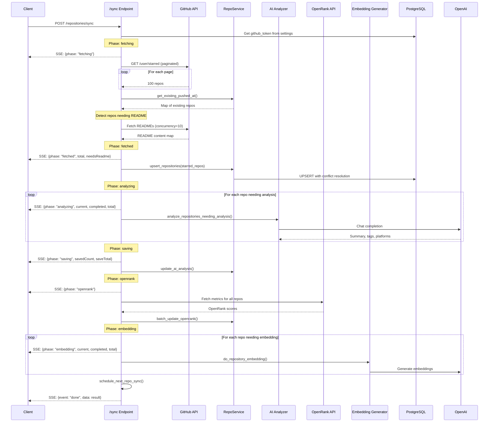
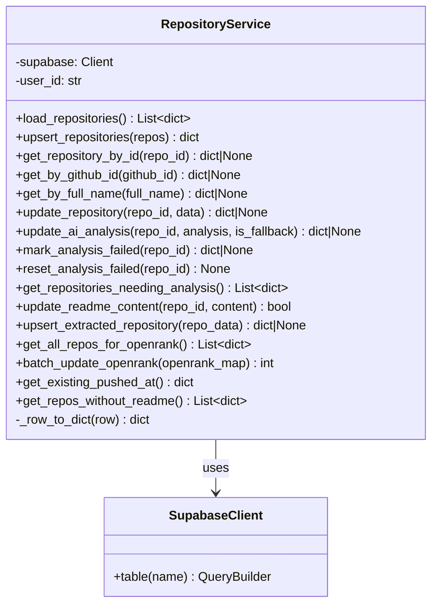
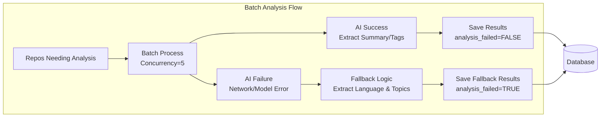
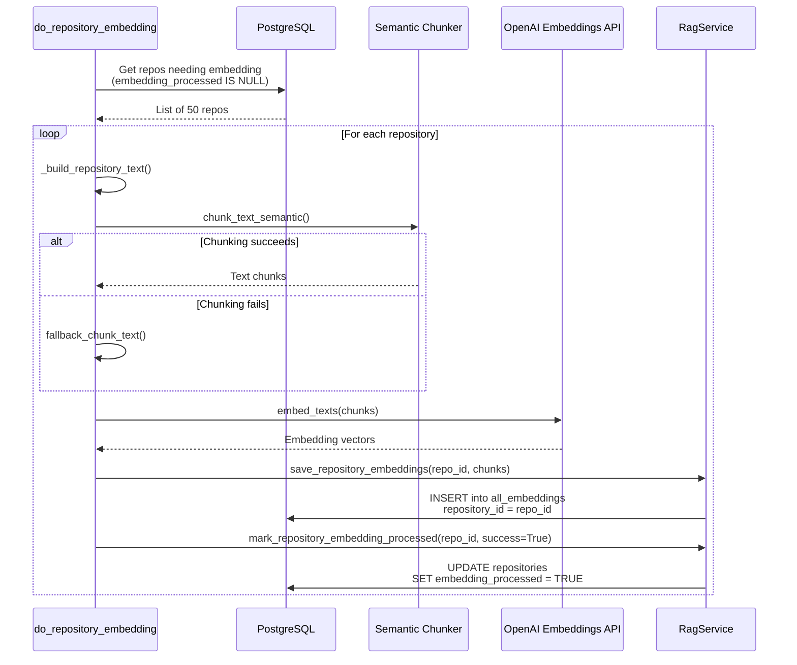
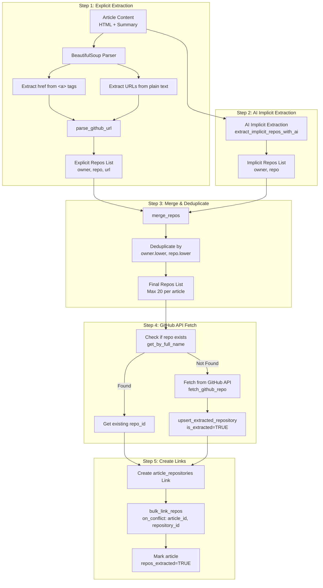

# Repository Management

<details>
<summary>Relevant source files</summary>

The following files were used as context for generating this wiki page:

- [backend/app/api/routers/repositories.py](backend/app/api/routers/repositories.py)
- [backend/app/celery_app/repo_extractor.py](backend/app/celery_app/repo_extractor.py)
- [backend/app/celery_app/repository_tasks.py](backend/app/celery_app/repository_tasks.py)
- [backend/app/schemas/repositories.py](backend/app/schemas/repositories.py)
- [backend/app/services/db/article_repositories.py](backend/app/services/db/article_repositories.py)
- [backend/app/services/db/repositories.py](backend/app/services/db/repositories.py)
- [backend/app/services/github_extractor.py](backend/app/services/github_extractor.py)
- [backend/app/services/openrank_service.py](backend/app/services/openrank_service.py)
- [backend/app/services/repository_analyzer.py](backend/app/services/repository_analyzer.py)
- [backend/scripts/026_create_article_repositories.sql](backend/scripts/026_create_article_repositories.sql)
- [backend/scripts/027_add_repository_source_flags.sql](backend/scripts/027_add_repository_source_flags.sql)
- [backend/scripts/028_add_repos_extracted_status.sql](backend/scripts/028_add_repos_extracted_status.sql)
- [backend/scripts/030_add_repository_openrank.sql](backend/scripts/030_add_repository_openrank.sql)
- [frontend/components/repository/repository-card.tsx](frontend/components/repository/repository-card.tsx)
- [frontend/components/repository/repository-page.tsx](frontend/components/repository/repository-page.tsx)
- [frontend/lib/api/repositories.ts](frontend/lib/api/repositories.ts)
- [frontend/lib/store/repositories.slice.ts](frontend/lib/store/repositories.slice.ts)
- [frontend/lib/types.ts](frontend/lib/types.ts)

</details>


This document describes the **Repository Management** subsystem of SaveHub's backend services. This system handles GitHub repository operations including: fetching user's starred repositories, storing repository metadata in the database, AI-powered analysis of README content, OpenRank metrics integration, and semantic search embeddings generation.

For information about repository display and UI components, see [Repository Browser](#4.3). For background task orchestration details, see [Repository Synchronization](#6.2). For article-repository extraction, see [Repository Extraction Pipeline](#6.5).

---

## Overview

The Repository Management system provides three primary functions:

1. **GitHub Starred Sync**: Fetch and synchronize user's starred repositories from GitHub API with README content
2. **AI Analysis**: Extract structured metadata (summary, tags, platforms) from README files using LLM
3. **Semantic Search**: Generate embeddings for repository content to enable vector similarity search

The system follows a multi-phase processing pipeline where each phase can be independently retried on failure. Status tracking flags (`analysis_failed`, `embedding_processed`) enable selective reprocessing.

**Sources:** [backend/app/api/routers/repositories.py:1-486](), [backend/app/services/db/repositories.py:1-565]()

---

## Repository Data Model

Repositories are stored in the `repositories` table with the following key fields:

| Field Category | Fields | Description |
|---------------|--------|-------------|
| **Identity** | `id`, `github_id`, `user_id`, `full_name` | Primary key, GitHub numeric ID, owner UUID, owner/repo |
| **Metadata** | `name`, `description`, `html_url`, `stargazers_count`, `language`, `topics` | Basic GitHub metadata |
| **Owner Info** | `owner_login`, `owner_avatar_url` | Repository owner details |
| **Timestamps** | `starred_at`, `github_created_at`, `github_updated_at`, `github_pushed_at` | Activity timestamps |
| **Content** | `readme_content` | Raw markdown README text |
| **AI Analysis** | `ai_summary`, `ai_tags`, `ai_platforms`, `analyzed_at`, `analysis_failed` | AI-extracted metadata |
| **Custom Fields** | `custom_description`, `custom_tags`, `custom_category`, `last_edited` | User overrides |
| **Metrics** | `openrank` | OpenRank influence score |
| **Source Tracking** | `is_starred`, `is_extracted` | Origin: starred sync vs article extraction |
| **Processing Status** | `embedding_processed` | Vector embedding generation status |

**Sources:** [backend/app/services/db/repositories.py:485-519](), [backend/scripts/027_add_repository_source_flags.sql:1-30](), [backend/scripts/030_add_repository_openrank.sql:1-4]()

---

## API Endpoints Architecture

```mermaid
graph TB
    Client[Frontend Client]
    
    subgraph "API Router: /api/repositories"
        GetAll[GET /<br/>Get All Repositories]
        Sync[POST /sync<br/>Sync from GitHub]
        Update[PATCH /{repo_id}<br/>Update Custom Fields]
        Analyze[POST /{repo_id}/analyze<br/>AI Analyze Single]
    end
    
    subgraph "Dependencies"
        VerifyAuth[verify_auth<br/>JWT Validation]
        GetService[get_repository_service<br/>Create RepositoryService]
    end
    
    subgraph "Service Layer"
        RepoService[RepositoryService<br/>Database Operations]
        SettingsService[SettingsService<br/>Get GitHub Token]
        ApiConfigService[ApiConfigService<br/>Get AI Config]
    end
    
    subgraph "External Services"
        GitHub[GitHub API<br/>Starred Repos & README]
        OpenRank[OpenRank API<br/>Influence Metrics]
        OpenAI[OpenAI API<br/>AI Analysis]
    end
    
    subgraph "Database"
        RepoTable[(repositories table)]
        SettingsTable[(settings table)]
        ConfigTable[(api_configs table)]
    end
    
    Client -->|HTTP Request| GetAll
    Client -->|HTTP Request| Sync
    Client -->|HTTP Request| Update
    Client -->|HTTP Request| Analyze
    
    GetAll --> VerifyAuth
    Sync --> VerifyAuth
    Update --> VerifyAuth
    Analyze --> VerifyAuth
    
    VerifyAuth --> GetService
    GetService --> RepoService
    
    GetAll --> RepoService
    Update --> RepoService
    
    Sync --> SettingsService
    Sync --> GitHub
    Sync --> RepoService
    Sync --> OpenRank
    Sync --> OpenAI
    
    Analyze --> ApiConfigService
    Analyze --> RepoService
    Analyze --> OpenAI
    
    RepoService --> RepoTable
    SettingsService --> SettingsTable
    ApiConfigService --> ConfigTable
```

**Diagram: Repository Management API Architecture**

The router uses FastAPI dependency injection for authentication (`verify_auth`) and service instantiation (`get_repository_service`). The sync endpoint is unique in returning Server-Sent Events (SSE) for real-time progress updates.

**Sources:** [backend/app/api/routers/repositories.py:29-46](), [backend/app/api/routers/repositories.py:48-301]()

---

## Core API Endpoints

### GET /repositories

Returns all repositories for the authenticated user, ordered by `starred_at` descending.

```python
# Implementation
@router.get("", response_model=List[RepositoryResponse])
async def get_repositories(service: RepositoryService = Depends(get_repository_service)):
    repos = service.load_repositories()
    return repos
```

**Response Schema:**
- Returns `RepositoryResponse` objects with all fields including AI analysis results
- Empty array if user has no repositories

**Sources:** [backend/app/api/routers/repositories.py:39-45](), [backend/app/services/db/repositories.py:52-70]()

---

### POST /repositories/sync

Synchronizes starred repositories from GitHub with SSE progress streaming. This is the most complex endpoint, orchestrating multiple processing phases.

**Sync Phases:**



**Diagram: Repository Sync Flow with SSE Progress**

**Key Implementation Details:**

1. **GitHub Token Validation**: Validates token exists before starting SSE stream [backend/app/api/routers/repositories.py:66-75]()

2. **Progress Queue**: Uses `asyncio.Queue` for thread-safe SSE event generation [backend/app/api/routers/repositories.py:78-79]()

3. **Concurrent Sync Task**: Runs sync logic in separate async task [backend/app/api/routers/repositories.py:80-278]()

4. **Selective README Fetching**: Only fetches README for:
   - New repositories (not in database)
   - Repositories with changed `pushed_at` timestamp (code update)
   - Existing repositories without README content
   
   [backend/app/api/routers/repositories.py:93-128]()

5. **Concurrency Control**: Uses semaphore for parallel README fetching (max 10 concurrent) [backend/app/api/routers/repositories.py:149](), [backend/app/api/routers/repositories.py:389]()

6. **Error Handling**: Each phase wrapped in try-except to continue on partial failure [backend/app/api/routers/repositories.py:195-214]()

7. **Auto-Scheduling**: Schedules next sync in 1 hour after completion [backend/app/api/routers/repositories.py:254-258]()

**SSE Event Types:**

| Event | Data Fields | Description |
|-------|-------------|-------------|
| `progress` | `phase`, `total`, `current`, `completed` | Phase update with optional progress |
| `done` | `total`, `new_count`, `updated_count` | Sync completed successfully |
| `error` | `message` | Sync failed with error |

**Sources:** [backend/app/api/routers/repositories.py:48-301](), [backend/app/api/routers/repositories.py:304-406]()

---

### PATCH /repositories/{repo_id}

Updates user-editable custom fields on a repository.

**Allowed Fields:**
- `custom_description` (string | null): User-written description override
- `custom_tags` (string[]): Custom tags for organization
- `custom_category` (string | null): User-assigned category

**Behavior:**
- Updates `last_edited` timestamp automatically
- Does not affect AI-generated fields
- Returns updated repository object

**Sources:** [backend/app/api/routers/repositories.py:409-422](), [backend/app/services/db/repositories.py:266-293]()

---

### POST /repositories/{repo_id}/analyze

Triggers AI analysis for a single repository. Used when:
- Analysis previously failed and user retries
- User wants to re-analyze after README updates
- Manual trigger from UI

**Prerequisites:**
- Repository must have `readme_content` (non-empty)
- User must have active chat API config

**Process:**
1. Fetch repository by ID
2. Validate README exists
3. Get user's active chat API config
4. Call `RepositoryAnalyzerService.analyze_repository()`
5. Save results via `update_ai_analysis()`
6. Mark as failed if exception occurs

**Sources:** [backend/app/api/routers/repositories.py:425-485](), [backend/app/services/repository_analyzer.py:1-104]()

---

## RepositoryService Database Operations

The `RepositoryService` class encapsulates all database operations for repositories, following the service pattern used throughout SaveHub's backend.



**Diagram: RepositoryService Class Structure**

### Key Methods

#### upsert_repositories()

Smart upsert logic that:
1. **Skips Unchanged Repos**: Only upserts if `readme_content` changed [backend/app/services/db/repositories.py:113-129]()
2. **Detects Code Updates**: Clears AI fields when `pushed_at` timestamp changes [backend/app/services/db/repositories.py:131-163]()
3. **Returns Change Summary**: Provides counts for new, updated, skipped repositories [backend/app/services/db/repositories.py:194-200]()

**Conflict Resolution:**
- Uses `on_conflict="user_id,github_id"` for upsert
- Preserves custom fields (`custom_description`, `custom_tags`, etc.)
- Resets AI analysis when code changes detected

**Sources:** [backend/app/services/db/repositories.py:72-200]()

#### get_repositories_needing_analysis()

Retrieves repositories for AI analysis using OR conditions:
- `ai_summary IS NULL`
- `ai_tags IS NULL OR ai_tags = ''`
- `analysis_failed = TRUE` (retry failed analyses)

This enables incremental analysis and automatic retry of failures.

**Sources:** [backend/app/services/db/repositories.py:380-398]()

#### update_ai_analysis()

Saves AI analysis results with:
- `ai_summary`: Generated summary text
- `ai_tags`: Extracted tags array
- `ai_platforms`: Detected platform tags (e.g., "Windows", "Linux", "Web")
- `analyzed_at`: Timestamp of analysis
- `analysis_failed`: Boolean flag (true if fallback logic used)

The `is_fallback` parameter marks when AI failed and fallback extraction was used (e.g., extracting language and topics as tags).

**Sources:** [backend/app/services/db/repositories.py:295-331]()

#### batch_update_openrank()

Updates OpenRank scores for multiple repositories:
- Accepts `{github_id: openrank_value}` mapping
- Updates each repo individually (Supabase limitation)
- Logs warning on individual failures
- Returns count of successful updates

**Sources:** [backend/app/services/db/repositories.py:535-563]()

---

## GitHub Starred Sync Pipeline

The repository sync pipeline consists of multiple coordinated phases, each handling a specific aspect of repository processing.

```mermaid
graph TB
    subgraph "Phase 1: GitHub Data Fetching"
        Start[Sync Triggered] --> ValidateToken[Validate GitHub Token]
        ValidateToken --> FetchStarred[Fetch All Starred Repos<br/>GitHub API Pagination]
        FetchStarred --> GetExisting[Get Existing Repo Info<br/>get_existing_pushed_at]
        GetExisting --> DetectChanges[Detect Repos Needing README<br/>New or pushed_at Changed]
    end
    
    subgraph "Phase 2: README Fetching"
        DetectChanges --> FetchREADME[Concurrent README Fetch<br/>_fetch_all_readmes concurrency=10]
        FetchREADME --> FetchExtracted[Fetch README for Extracted Repos<br/>Non-starred repos without README]
    end
    
    subgraph "Phase 3: Database Upsert"
        FetchExtracted --> Upsert[upsert_repositories<br/>Conflict Resolution & AI Reset]
        Upsert --> UpdateExtracted[Update README for Extracted Repos<br/>update_readme_content]
    end
    
    subgraph "Phase 4: AI Analysis"
        UpdateExtracted --> GetAnalysisCandidates[Get Repos Needing Analysis<br/>Empty or Failed]
        GetAnalysisCandidates --> ResetFailed[Reset analysis_failed Flags]
        ResetFailed --> BatchAnalyze[Batch AI Analysis<br/>analyze_repositories_batch<br/>concurrency=5]
        BatchAnalyze --> SaveAnalysis[Save Analysis Results<br/>update_ai_analysis]
    end
    
    subgraph "Phase 5: OpenRank Fetching"
        SaveAnalysis --> GetAllRepos[Get All Repos for OpenRank<br/>get_all_repos_for_openrank]
        GetAllRepos --> FetchOpenRank[Fetch OpenRank Metrics<br/>fetch_all_openranks<br/>concurrency=5]
        FetchOpenRank --> UpdateOpenRank[Batch Update OpenRank<br/>batch_update_openrank]
    end
    
    subgraph "Phase 6: Embedding Generation"
        UpdateOpenRank --> GetEmbedCandidates[Get Repos Needing Embedding<br/>embedding_processed IS NULL]
        GetEmbedCandidates --> GenerateEmbeds[Generate Embeddings<br/>do_repository_embedding]
        GenerateEmbeds --> SaveEmbeds[Save to all_embeddings Table]
    end
    
    subgraph "Scheduling"
        SaveEmbeds --> ScheduleNext[Schedule Next Sync<br/>1 Hour Later]
        ScheduleNext --> Done[Sync Complete]
    end
```



**Diagram: Complete Repository Sync Pipeline Flow**

### Phase Details

**Phase 1-2: GitHub Data Fetching**

Fetches repositories using pagination (100 per page) with rate limiting:
- Headers: `Accept: application/vnd.github.star+json` to get `starred_at` timestamp
- Sorting: `sort=updated` for chronological order
- Delay: 100ms between pages for rate limit protection

[backend/app/api/routers/repositories.py:304-350]()

**Phase 3: Smart Upsert Logic**

Optimization to reduce database writes:
1. Compare `readme_content` between fetched and existing repos
2. Skip repos where README unchanged (no database write)
3. Detect `pushed_at` changes and clear AI fields (forces re-analysis)
4. Track skipped count for metrics

This is critical for performance when syncing large starred lists (1000+ repos).

[backend/app/services/db/repositories.py:86-135]()

**Phase 4: AI Analysis Orchestration**

Calls `analyze_repositories_needing_analysis()` which:
1. Retrieves repos with missing/failed analysis
2. Resets `analysis_failed` flags before retry
3. Performs batch analysis with concurrency control
4. Applies fallback logic on individual failures
5. Reports detailed progress via callbacks

[backend/app/services/repository_analyzer.py:19-103]()

**Phase 5: OpenRank Integration**

Fetches influence metrics from `https://oss.open-digger.cn`:
- Retrieves quarterly OpenRank scores
- Uses latest quarter's value
- Updates in batch with error tolerance
- Silent failure (non-blocking)

[backend/app/services/openrank_service.py:1-96]()

**Phase 6: Embedding Generation**

Generates vector embeddings for semantic search:
1. Builds text from README + metadata
2. Chunks text using semantic chunking
3. Generates embeddings via OpenAI API
4. Saves to `all_embeddings` table with `repository_id`
5. Marks `embedding_processed = TRUE`

[backend/app/celery_app/repository_tasks.py:205-395]()

**Sources:** [backend/app/api/routers/repositories.py:80-278](), [backend/app/celery_app/repository_tasks.py:35-136]()

---

## AI Repository Analysis

AI analysis extracts structured metadata from README content using LLM inference.

### Analysis Prompt and Extraction

The `RepositoryAnalyzerService` uses a structured prompt to extract:
- **Summary**: 50-200 character concise description
- **Tags**: 3-10 relevant tags for categorization
- **Platforms**: Supported platforms (Windows, macOS, Linux, iOS, Android, Web, CLI, Docker)

**Prompt Strategy:**
- Provides README content, repo name, and original description
- Requests JSON output with specific fields
- Uses temperature=0.3 for consistency
- Enforces character limits in prompt

[backend/app/services/ai/repository_service.py]() (referenced but not in provided files)

### Batch Processing with Fallback



**Diagram: AI Analysis with Fallback Logic**

**Fallback Strategy:**
When AI fails (rate limit, timeout, model error):
1. Extract `language` as first tag
2. Use GitHub `topics` as additional tags
3. Generate basic summary from description
4. Mark `analysis_failed = TRUE`
5. Allow retry on next sync

This ensures graceful degradation without blocking the pipeline.

**Sources:** [backend/app/services/repository_analyzer.py:19-103]()

---

## OpenRank Integration

OpenRank provides developer influence metrics for GitHub repositories. SaveHub integrates this for repository ranking and discovery.

### OpenRank Fetching Logic

```python
# Fetch OpenRank for single repository
async def fetch_openrank(client: httpx.AsyncClient, full_name: str) -> float | None:
    url = f"https://oss.open-digger.cn/github/{full_name}/openrank.json"
    response = await client.get(url, timeout=10.0)
    data = response.json()  # {"2024Q1": 1.23, "2024Q2": 1.45, ...}
    
    # Get latest quarter
    sorted_quarters = sorted(data.keys())
    latest_quarter = sorted_quarters[-1]
    return float(data[latest_quarter])
```

**Characteristics:**
- **Async Concurrent**: Fetches multiple repos in parallel (concurrency=5)
- **Latest Quarter**: Uses most recent quarterly score
- **Silent Failure**: Returns `None` on error, doesn't block sync
- **Rate Limiting**: 50ms delay between requests

### Batch Update Process

After fetching all OpenRank values:
1. Build `{github_id: openrank_value}` mapping
2. Update each repo individually via Supabase
3. Log warnings for individual failures
4. Return count of successful updates

**Database Schema:**
- Column: `repositories.openrank` (FLOAT, nullable)
- Index: None (not frequently queried alone)
- Default: NULL

**Sources:** [backend/app/services/openrank_service.py:1-96](), [backend/scripts/030_add_repository_openrank.sql:1-4]()

---

## Repository Embeddings

Repository embeddings enable semantic search across repositories using vector similarity. This is part of SaveHub's unified RAG system where articles and repositories share the `all_embeddings` table.

### Text Composition Strategy

The system builds composite text for embedding generation:

```python
def _build_repository_text(repo: dict) -> str:
    """Combine repository metadata into searchable text."""
    parts = [
        f"仓库名称: {repo['full_name']}",
        f"描述: {repo['description']}",
        f"链接: {repo['html_url']}",
        f"所有者: {repo['owner_login']}",
        f"标签: {', '.join(repo['topics'])}",
        f"AI标签: {', '.join(repo['ai_tags'])}",
        f"主要语言: {repo['language']}",
        f"\nREADME内容:\n{repo['readme_content']}",
        f"\nAI摘要:\n{repo['ai_summary']}",
    ]
    return "\n".join(parts)
```

This aggregates:
- Repository identity (name, owner, URL)
- GitHub metadata (description, language, topics)
- AI-extracted metadata (tags, summary)
- Full README content (markdown)

[backend/app/celery_app/repository_tasks.py:294-323]()

### Embedding Generation Pipeline



**Diagram: Repository Embedding Generation Flow**

### Processing Status Tracking

The `embedding_processed` field uses tri-state logic:
- `NULL`: Not yet processed
- `TRUE`: Successfully processed
- `FALSE`: Processing failed

This enables:
- Selective processing (only NULL values)
- Retry mechanism (reset to NULL)
- Skip optimization (avoid reprocessing)

**Query for Pending Repos:**
```sql
SELECT * FROM repositories
WHERE user_id = $1
  AND embedding_processed IS NULL
  AND readme_content IS NOT NULL
LIMIT 50
```

[backend/app/celery_app/repository_tasks.py:281-291]()

### Integration with RAG System

Repository embeddings are stored in `all_embeddings` table:
- `repository_id`: UUID reference to repositories table
- `article_id`: NULL (distinguishes from article embeddings)
- `chunk_index`: Sequential chunk number
- `content`: Original text chunk
- `embedding`: Vector (1536 dimensions for text-embedding-3-small)

This unified storage enables cross-content semantic search where users can search across both articles and repositories simultaneously.

**Sources:** [backend/app/celery_app/repository_tasks.py:205-395](), See [Vector Embeddings](#7.2) for table schema

---

## Article-Repository Linking

SaveHub automatically extracts GitHub repository links from article content, creating bidirectional references between articles and repositories.

### Extraction Pipeline



**Diagram: Article-Repository Extraction and Linking Pipeline**

### Explicit Extraction (BeautifulSoup)

Parses HTML to find GitHub URLs in two locations:
1. **href attributes**: `<a href="https://github.com/owner/repo">`
2. **Plain text**: Raw URLs in text content

**URL Validation:**
- Must match `github.com` domain
- Must follow `/{owner}/{repo}` pattern
- Excludes non-repo paths (explore, trending, settings, etc.)
- Validates owner/repo format with regex

[backend/app/services/github_extractor.py:82-143]()

### AI Implicit Extraction

Uses LLM to find implicitly mentioned repositories (e.g., "uses React" → facebook/react):

**Prompt Strategy:**
- Emphasizes only clear project mentions
- Requires verification of owner/repo accuracy
- Excludes repos already linked in content
- Returns JSON array: `[{"owner": "...", "repo": "..."}]`
- Maximum 10 results to prevent noise

**Error Handling:**
- Silent fallback on any error (timeout, API failure)
- Returns empty list, continues with explicit repos only
- Does not block article processing

[backend/app/services/github_extractor.py:146-296]()

### Deduplication and Merging

The `merge_repos()` function:
1. Adds explicit repos first (preserves original URLs)
2. Adds implicit repos not already in set
3. Uses case-insensitive comparison: `(owner.lower(), repo.lower())`
4. Limits to 20 repos per article (prevents spam)

[backend/app/services/github_extractor.py:298-333]()

### Repository Upsert with Source Tracking

Extracted repositories are marked with `is_extracted=TRUE` flag:
- Distinguishes from starred repos (`is_starred=TRUE`)
- Enables filtering in UI (show only starred vs show all)
- Repos can have both flags (starred AND extracted)

**Conflict Resolution:**
- Uses `on_conflict="user_id,github_id"` for upsert
- Updates `is_extracted=TRUE` on existing repos
- Does not override starred repo data

[backend/app/services/db/repositories.py:434-483]()

### Article-Repository Junction Table

The `article_repositories` table creates many-to-many relationship:

| Column | Type | Description |
|--------|------|-------------|
| `id` | UUID | Primary key |
| `article_id` | UUID | Foreign key to articles |
| `repository_id` | UUID | Foreign key to repositories |
| `user_id` | UUID | Owner (RLS isolation) |
| `extracted_url` | TEXT | Original URL found in article |
| `created_at` | TIMESTAMPTZ | Link creation time |

**Unique Constraint:** `(article_id, repository_id)` prevents duplicate links

**Indexes:**
- `article_id`: For fetching repos for an article
- `repository_id`: For fetching articles mentioning a repo
- `user_id`: For RLS filtering

[backend/scripts/026_create_article_repositories.sql:1-54]()

### Triggering Repository Sync

After extracting repos from articles, the system may trigger `sync_repositories` to fetch README content for extracted repos:

**Trigger Logic:**
- Uses Redis lock with 60-second TTL
- Prevents duplicate scheduling within cooldown
- Delays execution by 30 seconds to batch multiple articles
- Only schedules if new repos were extracted

This ensures extracted repos eventually get README content and AI analysis, making them fully searchable.

[backend/app/celery_app/repo_extractor.py:270-293]()

**Sources:** [backend/app/celery_app/repo_extractor.py:1-402](), [backend/app/services/github_extractor.py:1-334](), [backend/app/services/db/article_repositories.py:1-148]()

---

## Celery Background Tasks

Repository operations are coordinated by Celery tasks for async execution. See [Repository Synchronization](#6.2) for detailed task orchestration.

### sync_repositories Task

Main task for syncing starred repos with comprehensive error handling:

**Features:**
- **Task Lock**: Prevents concurrent sync for same user (660s TTL)
- **Retry Logic**: 2 retries with exponential backoff (30s base, 300s max)
- **Time Limits**: Hard timeout 10 minutes, soft timeout 9 minutes
- **Auto-Scheduling**: Schedules next sync in 1 hour on completion

**Task Signature:**
```python
@app.task(
    bind=True,
    name="sync_repositories",
    max_retries=2,
    default_retry_delay=30,
    retry_backoff=True,
    time_limit=600,
    soft_time_limit=540,
)
def sync_repositories(self, user_id: str, trigger: str = "auto"):
    ...
```

The `trigger` parameter distinguishes manual (user-initiated) vs auto (scheduled) syncs for logging.

[backend/app/celery_app/repository_tasks.py:496-637]()

### schedule_next_repo_sync Function

Implements auto-sync scheduling with smart cancellation:

1. Cancels any existing scheduled sync (resets timer)
2. Schedules new sync with 1-hour countdown
3. Stores task ID in Redis for cancellation
4. Sets Redis TTL to interval + 5 min buffer

This ensures manual syncs reset the auto-sync timer, preventing redundant syncs.

[backend/app/celery_app/repository_tasks.py:643-675]()

### extract_article_repos Task

Extracts GitHub repos from article content (triggered after RAG processing):

**Task Configuration:**
- Max 2 retries with 120s delay
- 5 minute timeout
- Schedules `sync_repositories` if new repos found

**Error Handling:**
- Rate limit errors return `{"retry": True}` for backoff
- Other errors mark `repos_extracted=FALSE`
- Silent fallback on AI extraction failure

[backend/app/celery_app/repo_extractor.py:298-329]()

**Sources:** [backend/app/celery_app/repository_tasks.py:496-703](), [backend/app/celery_app/repo_extractor.py:298-402]()

---

## Frontend Integration

### Repository State Management

The `RepositoriesSlice` in Zustand manages client-side repository state:

**State Properties:**
```typescript
interface RepositoriesSlice {
  repositories: Repository[]          // All user repos
  isSyncing: boolean                  // Sync in progress
  isAnalyzing: boolean               // AI analysis in progress
  syncProgress: SyncProgress | null   // SSE progress data
  lastSyncedAt: string | null        // Last successful sync
  
  loadRepositories: () => Promise<void>
  syncRepositories: () => Promise<SyncResult>
  updateRepository: (id, data) => Promise<Repository>
  analyzeRepository: (id) => Promise<Repository>
}
```

**SSE Progress Tracking:**
The `syncRepositories()` function consumes SSE events and updates `syncProgress`:
```typescript
const result = await repositoriesApi.syncWithProgress((progress) => {
  set({ syncProgress: progress })
})
```

[frontend/lib/store/repositories.slice.ts:1-106]()

### API Client Implementation

The `repositoriesApi` provides type-safe API methods:

**SSE Streaming Implementation:**
```typescript
async syncWithProgress(onProgress: (progress: SyncProgressEvent) => void): Promise<SyncResult> {
  // Proactive token refresh for long-running SSE
  if (isTokenExpiringSoon()) {
    await proactiveRefresh()
  }
  
  const response = await fetchWithAuth(`${API_BASE}/api/repositories/sync`, {
    method: "POST",
  })
  
  const reader = response.body?.getReader()
  const decoder = new TextDecoder()
  let buffer = ""
  
  while (true) {
    const { done, value } = await reader.read()
    if (done) break
    
    buffer += decoder.decode(value, { stream: true })
    const lines = buffer.split("\n")
    buffer = lines.pop() || ""
    
    for (const line of lines) {
      if (line.startsWith("event: ")) {
        currentEvent = line.slice(7).trim()
      } else if (line.startsWith("data: ")) {
        const data = JSON.parse(line.slice(6))
        if (currentEvent === "progress") {
          onProgress(data)
        }
      }
    }
  }
}
```

This implements SSE parsing with proper buffer handling for incomplete messages.

[frontend/lib/api/repositories.ts:1-181]()

### Repository Page Component

The `RepositoryPage` component orchestrates repository display:

**Key Features:**
1. **Category Filtering**: Dynamic categories based on AI tags and platforms
2. **Search**: Client-side filtering by name, description, language, topics
3. **Sorting**: 6 sort fields (stars, dates, name, OpenRank) with localStorage persistence
4. **Sync Progress UI**: Real-time progress bar with phase-specific messages
5. **Empty States**: GitHub token missing, no repos, no results

**Sync Progress Rendering:**
```tsx
{isSyncing && syncProgress && (
  <div className="px-6 py-3 border-b bg-muted/30">
    <span className="text-muted-foreground">
      {syncProgress.phase === "analyzing" && (
        <>正在分析: <span className="font-medium">{syncProgress.current}</span></>
      )}
      {syncProgress.phase === "embedding" && (
        <>正在生成向量: <span className="font-medium">{syncProgress.current}</span></>
      )}
    </span>
    {syncProgress.completed !== undefined && (
      <span>{syncProgress.completed} / {syncProgress.total}</span>
    )}
  </div>
)}
```

[frontend/components/repository/repository-page.tsx:1-432]()

**Sources:** [frontend/lib/store/repositories.slice.ts:1-106](), [frontend/lib/api/repositories.ts:1-181](), [frontend/components/repository/repository-page.tsx:1-432]()

---

## Summary of Key Flows

### Manual Sync Flow
1. User clicks "Sync" button in UI
2. Frontend calls `POST /api/repositories/sync`
3. Backend validates GitHub token
4. Backend streams SSE progress events
5. Phases execute: fetch → upsert → analyze → openrank → embed
6. Frontend updates progress bar in real-time
7. Backend schedules next auto-sync in 1 hour
8. Frontend reloads repositories on completion

### Auto-Sync Flow
1. Celery Beat or previous sync schedules `sync_repositories` task
2. Task acquires Redis lock
3. Same processing phases as manual sync
4. Schedules next auto-sync in 1 hour
5. WebSocket notifies frontend of changes

### Article Extraction Flow
1. Article RAG processing completes
2. Triggers `extract_article_repos` task
3. Explicit extraction (BeautifulSoup) + AI implicit extraction
4. Merges and deduplicates repos
5. Fetches repo data from GitHub API for new repos
6. Creates `article_repositories` junction records
7. May trigger `sync_repositories` for README fetching

### AI Analysis Flow
1. Sync or manual trigger identifies repos needing analysis
2. Batch processes repos with concurrency=5
3. Sends README + metadata to LLM
4. Parses JSON response for summary/tags/platforms
5. Fallback to basic extraction on failure
6. Saves results with `analysis_failed` flag
7. Enables retry on next sync

**Sources:** [backend/app/api/routers/repositories.py:48-301](), [backend/app/celery_app/repository_tasks.py:496-637](), [backend/app/celery_app/repo_extractor.py:134-264](), [backend/app/services/repository_analyzer.py:19-103]()