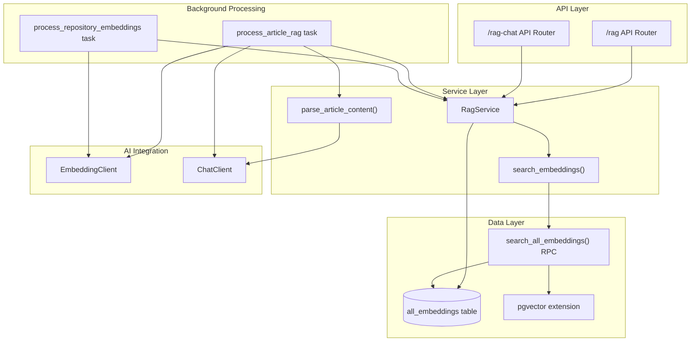
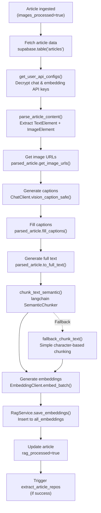
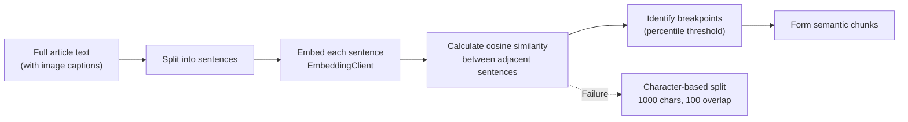
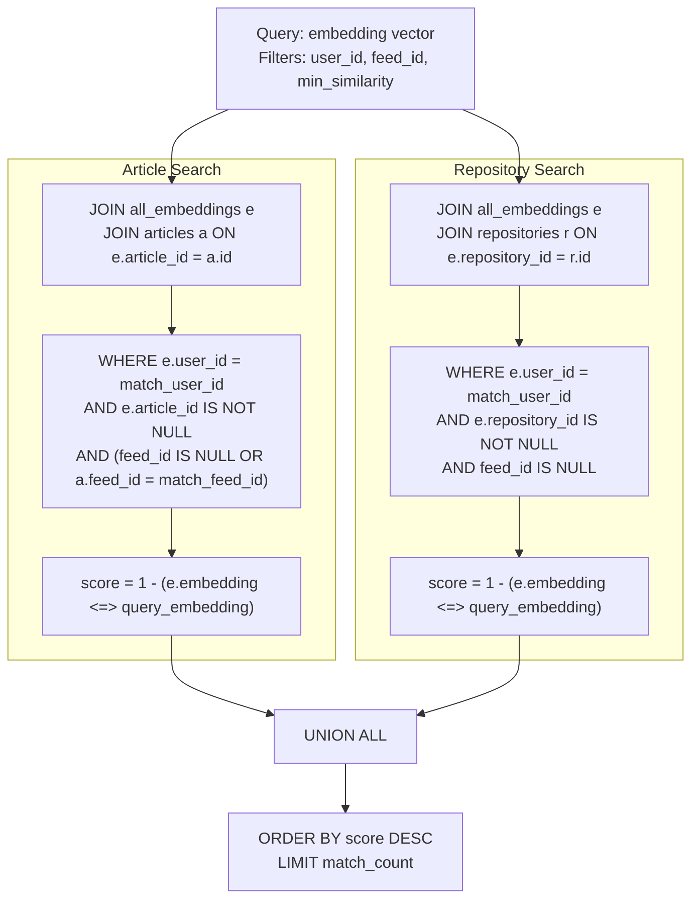
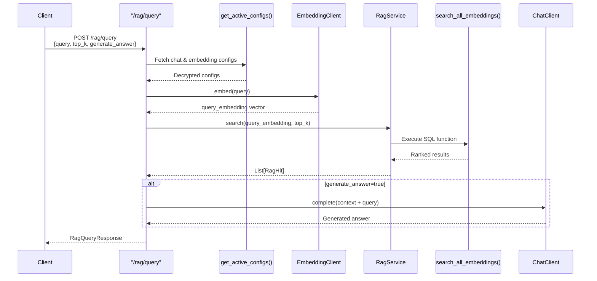
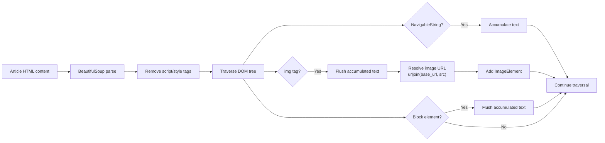
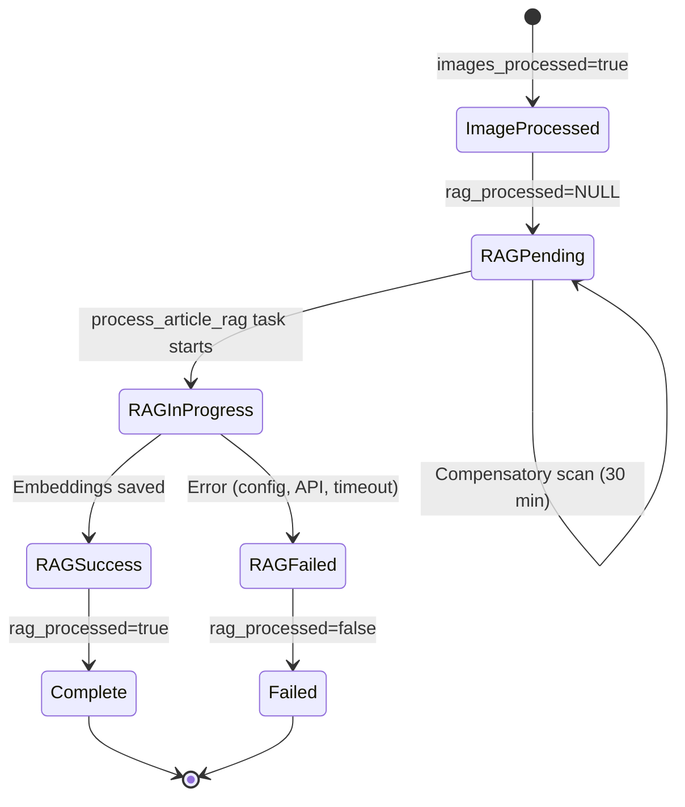

# RAG & Search Services

<details>
<summary>Relevant source files</summary>

The following files were used as context for generating this wiki page:

- [backend/app/api/routers/rag.py](backend/app/api/routers/rag.py)
- [backend/app/celery_app/rag_processor.py](backend/app/celery_app/rag_processor.py)
- [backend/app/services/ai/CLAUDE.md](backend/app/services/ai/CLAUDE.md)
- [backend/app/services/ai/__init__.py](backend/app/services/ai/__init__.py)
- [backend/app/services/ai/clients.py](backend/app/services/ai/clients.py)
- [backend/app/services/ai/config.py](backend/app/services/ai/config.py)
- [backend/app/services/ai/repository_service.py](backend/app/services/ai/repository_service.py)
- [backend/app/services/db/rag.py](backend/app/services/db/rag.py)
- [backend/app/services/rag/CLAUDE.md](backend/app/services/rag/CLAUDE.md)
- [backend/app/services/rag/__init__.py](backend/app/services/rag/__init__.py)
- [backend/app/services/rag/chunker.py](backend/app/services/rag/chunker.py)
- [backend/app/services/rag/retriever.py](backend/app/services/rag/retriever.py)
- [backend/scripts/029_rename_article_embeddings_to_all_embeddings.sql](backend/scripts/029_rename_article_embeddings_to_all_embeddings.sql)
- [backend/scripts/031_add_repository_embeddings.sql](backend/scripts/031_add_repository_embeddings.sql)
- [backend/scripts/032_fix_all_embeddings_article_id_nullable.sql](backend/scripts/032_fix_all_embeddings_article_id_nullable.sql)
- [docs/RSS_subscribe/RSS_FLOW_COMPLETE.md](docs/RSS_subscribe/RSS_FLOW_COMPLETE.md)

</details>


The RAG & Search Services subsystem provides semantic search capabilities over articles and repositories through vector embeddings and pgvector-based similarity search. This system handles the complete RAG (Retrieval-Augmented Generation) pipeline from content ingestion to query-time retrieval, enabling AI-powered chat and semantic search features.

For AI chat functionality built on top of RAG retrieval, see [5.5](#5.5). For the background processing that generates embeddings, see [6.4](#6.4). For repository-specific processing, see [5.3](#5.3).

---

## System Architecture

The RAG services layer sits between the HTTP API layer and the database, coordinating embedding generation, storage, and retrieval operations.



**Key Components:**
- **RagRouter**: HTTP endpoints for RAG queries and status ([/rag/query](), [/rag/status]())
- **RagService**: Database operations on `all_embeddings` table
- **search_embeddings()**: Vector similarity search wrapper
- **search_all_embeddings()**: PostgreSQL RPC function performing cosine similarity
- **process_article_rag**: Celery task for article embedding generation
- **all_embeddings table**: Unified storage for article and repository embeddings

Sources: [backend/app/api/routers/rag.py](), [backend/app/services/db/rag.py](), [backend/app/services/rag/retriever.py](), [backend/app/celery_app/rag_processor.py]()

---

## Unified Embedding Storage

The `all_embeddings` table stores vector embeddings for both articles and repositories with a mutually exclusive design.

### Table Schema

| Column | Type | Description |
|--------|------|-------------|
| `id` | UUID | Primary key |
| `user_id` | UUID | User isolation (indexed) |
| `article_id` | UUID | Article reference (nullable, indexed) |
| `repository_id` | UUID | Repository reference (nullable, indexed) |
| `chunk_index` | INT | Chunk order within source (0-based) |
| `content` | TEXT | Text content of chunk |
| `embedding` | vector(1536) | OpenAI-compatible embedding vector |
| `metadata` | JSONB | Optional metadata |
| `created_at` | TIMESTAMPTZ | Creation timestamp |

**Constraints:**
- `CHECK (article_id IS NOT NULL AND repository_id IS NULL) OR (article_id IS NULL AND repository_id IS NOT NULL)`
- Foreign keys: `article_id → articles(id)`, `repository_id → repositories(id)` with `ON DELETE CASCADE`

**Indexes:**
- `idx_all_embeddings_source`: `(article_id)`
- `idx_all_embeddings_repository`: `(repository_id)`
- `idx_all_embeddings_user`: `(user_id)`
- `idx_all_embeddings_user_source`: `(user_id, article_id)`
- `idx_all_embeddings_user_repository`: `(user_id, repository_id)`
- `idx_all_embeddings_vector`: HNSW index on `embedding` for fast similarity search

Sources: [backend/scripts/031_add_repository_embeddings.sql](), [backend/scripts/032_fix_all_embeddings_article_id_nullable.sql](), [backend/scripts/029_rename_article_embeddings_to_all_embeddings.sql]()

---

## Article RAG Processing Pipeline



**Processing Steps:**

1. **Configuration Retrieval** ([rag_processor.py:61-84]()):
   - Fetch user's active chat and embedding API configs
   - Decrypt API keys using `decrypt()` function
   - Raise `ConfigError` if configs missing

2. **Content Parsing** ([rag_processor.py:152-163]()):
   - `parse_article_content(title, author, html_content, article_url)` extracts structure
   - Returns `ParsedArticle` with ordered `TextElement` and `ImageElement` list
   - Preserves original order of text and images in document

3. **Image Captioning** ([rag_processor.py:164-182]()):
   - Limited to `MAX_IMAGES_PER_ARTICLE = 10` images per article
   - `ChatClient.vision_caption_safe(url)` generates descriptions
   - Captions stored in `{url: caption}` mapping
   - Failed caption generation returns `None` (non-blocking)

4. **Caption Integration** ([rag_processor.py:184-195]()):
   - `parsed_article.fill_captions(captions)` updates `ImageElement` objects
   - `to_full_text()` replaces images with `[图片描述: caption]` markers
   - Final text has captions inline at original image positions

5. **Semantic Chunking** ([rag_processor.py:198-211]()):
   - Primary: `chunk_text_semantic()` using langchain `SemanticChunker`
   - Calculates sentence-level embedding similarity
   - Breaks at low-similarity boundaries (percentile threshold)
   - Fallback: `fallback_chunk_text()` with 1000-char chunks, 100-char overlap

6. **Embedding Generation** ([rag_processor.py:227-237]()):
   - `EmbeddingClient.embed_batch(texts)` processes all chunks
   - Batch size configurable (default 100 per API call)
   - Returns vectors aligned with input order

7. **Database Storage** ([rag_processor.py:239-242]()):
   - `RagService.save_embeddings(article_id, chunks)` performs upsert
   - Deletes existing embeddings first (idempotent)
   - Batch insert with `chunk_index` sequencing

8. **Status Update** ([rag_processor.py:242]()):
   - `mark_article_rag_processed(article_id, success=True)`
   - Sets `articles.rag_processed = true`
   - Records `rag_processed_at` timestamp

Sources: [backend/app/celery_app/rag_processor.py:87-267](), [backend/app/services/rag/chunker.py](), [backend/app/services/db/rag.py:27-87]()

---

## Semantic Chunking Implementation

The system uses langchain's `SemanticChunker` for intelligent text segmentation based on meaning rather than fixed boundaries.

### Chunking Strategy



**Primary Method** ([chunker.py:268-330]()):
```python
def chunk_text_semantic(text, api_key, api_base, model):
    embeddings = OpenAIEmbeddings(api_key, base_url, model)
    chunker = SemanticChunker(
        embeddings,
        breakpoint_threshold_type="percentile"
    )
    docs = chunker.create_documents([text])
    return [doc.page_content for doc in docs]
```

**Fallback Method** ([chunker.py:332-378]()):
```python
def fallback_chunk_text(text, max_chars=1000, overlap=100):
    # Sliding window with sentence-aware breaks
    # Tries to break at sentence boundaries (。！？.!?)
    # Maintains overlap between chunks
```

**Why Semantic Chunking?**
- Preserves topical coherence within chunks
- Better retrieval accuracy (related content stays together)
- More meaningful embeddings per chunk
- Adapts to content structure automatically

Sources: [backend/app/services/rag/chunker.py:268-378]()

---

## Repository Embedding Processing

Repositories follow a similar but streamlined embedding pipeline focused on README content.

**Processing Flow:**

1. **Trigger Condition** ([repositories table schema]()):
   - `readme_content IS NOT NULL`
   - `embedding_processed IS NULL`
   - Scheduled by `scan_pending_repository_embeddings` task

2. **Content Preparation**:
   - No image processing (READMEs are markdown text)
   - Semantic chunking of README content directly
   - Repository metadata (name, description) not included in embeddings

3. **Storage** ([rag.py:269-327]()):
   - `RagService.save_repository_embeddings(repository_id, embeddings)`
   - Checks for existing embeddings (skip if present)
   - Sets `repository_id` field in `all_embeddings` table
   - Updates `repositories.embedding_processed = true`

4. **Skip Conditions**:
   - `readme_content` is empty or null
   - `repository_id` already has embeddings in `all_embeddings`
   - AI analysis failed and no fallback content available

Sources: [backend/app/services/db/rag.py:269-357](), [backend/scripts/031_add_repository_embeddings.sql]()

---

## Vector Search Implementation

### search_all_embeddings RPC Function

PostgreSQL stored procedure performing unified vector search across articles and repositories.

**Function Signature:**
```sql
CREATE FUNCTION search_all_embeddings(
    query_embedding vector(1536),
    match_user_id uuid,
    match_count int DEFAULT 10,
    match_feed_id uuid DEFAULT NULL,
    min_similarity float DEFAULT 0.0
)
RETURNS TABLE (
    id uuid,
    article_id uuid,
    repository_id uuid,
    chunk_index int,
    content text,
    score float,
    source_type text,
    source_title text,
    source_url text
)
```

**Query Logic** ([031_add_repository_embeddings.sql:78-144]()):



**Key Operations:**
- **Cosine Distance Operator**: `<=>` from pgvector extension
- **Similarity Calculation**: `score = 1 - (embedding <=> query_embedding)` converts distance to similarity
- **HNSW Index**: Accelerates `<=>` operator on `idx_all_embeddings_vector`
- **User Isolation**: All queries filtered by `user_id`
- **Feed Filtering**: Optional `feed_id` filter (articles only)
- **Union Strategy**: `UNION ALL` combines article and repository results, then sorts by score

Sources: [backend/scripts/031_add_repository_embeddings.sql:78-147](), [backend/app/services/rag/retriever.py:15-78]()

---

## RAG Query API

### POST /rag/query

Performs semantic search with optional answer generation.

**Request Schema:**
```python
class RagQueryRequest(BaseModel):
    query: str
    top_k: int = 10
    feed_id: Optional[UUID] = None
    min_score: float = 0.0
    generate_answer: bool = False
```

**Response Schema:**
```python
class RagQueryResponse(BaseModel):
    query: str
    hits: List[RagHit]
    answer: Optional[str]
    total_hits: int

class RagHit(BaseModel):
    id: UUID
    article_id: Optional[UUID]
    repository_id: Optional[UUID]
    chunk_index: int
    content: str
    score: float
    source_type: str  # "article" or "repository"
    source_title: str
    source_url: str
```

**Processing Flow** ([rag.py:83-150]()):



**Implementation Details:**

1. **Configuration Retrieval** ([rag.py:48-77]()):
   - `get_active_configs()` dependency fetches user's API configs
   - Validates both chat and embedding configs exist
   - Raises `HTTPException(400)` if missing

2. **Query Embedding** ([rag.py:104-105]()):
   - `EmbeddingClient.embed(query_request.query)` generates vector
   - Uses user's configured embedding model
   - Async operation with retry logic

3. **Vector Search** ([rag.py:108-113]()):
   - `RagService.search()` delegates to `search_embeddings()`
   - Calls `search_all_embeddings()` RPC function
   - Returns unified article + repository results

4. **Answer Generation** ([rag.py:131-136]()):
   - Optional: only if `generate_answer=true` and hits found
   - `generate_answer()` helper function constructs context
   - Uses `ChatClient.complete()` with system prompt
   - Context format: `[来源 N] (相关度: score)\n文章: title\n内容: content`

Sources: [backend/app/api/routers/rag.py:83-150](), [backend/app/services/rag/retriever.py:139-180]()

---

## Additional API Endpoints

### GET /rag/status

Returns RAG processing statistics for the authenticated user.

**Response Schema:**
```python
class RagStatusResponse(BaseModel):
    total_articles: int
    rag_processed: int
    rag_pending: int
    total_embeddings: int
```

**Implementation** ([rag.py:152-163]()):
- `RagService.get_rag_stats()` queries database
- Counts articles by processing status
- Counts total embeddings in `all_embeddings`

### POST /rag/reindex/{article_id}

Manually triggers re-processing of article embeddings.

**Request Schema:**
```python
class RagReindexRequest(BaseModel):
    force: bool = False
```

**Behavior** ([rag.py:165-207]()):
- If `force=True`: Deletes existing embeddings and resets `rag_processed` status
- Creates `process_article_rag` Celery task
- Returns task ID for progress tracking

### GET /rag/embeddings/{article_id}

Retrieves all embedding chunks for an article (without vector data).

**Response Schema:**
```python
class ArticleEmbeddingsResponse(BaseModel):
    article_id: UUID
    embeddings: List[EmbeddingItem]
    count: int

class EmbeddingItem(BaseModel):
    id: UUID
    chunk_index: int
    content: str
    created_at: datetime
```

**Use Case**: Debugging, manual review of chunking quality

Sources: [backend/app/api/routers/rag.py:152-237](), [backend/app/services/db/rag.py:179-230]()

---

## RagService Database Operations

The `RagService` class encapsulates all database interactions for RAG functionality.

### Core Methods

| Method | Purpose | Returns |
|--------|---------|---------|
| `save_embeddings(article_id, embeddings)` | Upsert article embeddings (delete-then-insert) | `int` (count saved) |
| `save_repository_embeddings(repository_id, embeddings)` | Save repository embeddings (skip if exists) | `int` (count saved) |
| `delete_all_embeddings(article_id)` | Remove all article embeddings | `None` |
| `delete_repository_embeddings(repository_id)` | Remove all repository embeddings | `None` |
| `get_all_embeddings(article_id)` | Fetch embeddings without vectors | `List[Dict]` |
| `mark_article_rag_processed(article_id, success)` | Update processing status | `None` |
| `mark_repository_embedding_processed(repository_id, success)` | Update repo status | `None` |
| `reset_article_rag_status(article_id)` | Clear status for reprocessing | `None` |
| `get_rag_stats()` | Aggregate statistics | `Dict[str, int]` |
| `search(query_embedding, top_k, feed_id, min_score)` | Vector similarity search | `List[Dict]` |

**Idempotency Design:**

The `save_embeddings()` method ensures idempotent operations:

```python
# backend/app/services/db/rag.py:27-87
def save_embeddings(self, article_id, embeddings):
    # 1. Delete existing (ensures clean slate)
    supabase.table("all_embeddings") \
        .delete() \
        .eq("article_id", article_id) \
        .eq("user_id", self.user_id) \
        .execute()
    
    # 2. Insert new embeddings
    rows = [{"article_id": article_id, ...} for emb in embeddings]
    supabase.table("all_embeddings").insert(rows).execute()
```

This delete-then-insert pattern prevents duplicate embeddings if the task retries.

Sources: [backend/app/services/db/rag.py:16-357]()

---

## HTML Parsing and URL Resolution

The `parse_article_content()` function handles complex HTML structures while preserving content order.

### Parsing Strategy



**URL Resolution Logic** ([chunker.py:114-151]()):

```python
def _resolve_url(src, base_url):
    # Absolute URL → return as-is
    if _is_absolute_url(src):
        return src
    
    # Protocol-relative URL (//cdn.example.com/img.png)
    if src.startswith("//"):
        return f"https:{src}"
    
    # Relative path → resolve against base_url
    if base_url:
        return urljoin(base_url, src)
    
    # Cannot resolve without base_url
    logger.warning(f"Cannot resolve relative URL: {src}")
    return src
```

**Why URL Resolution Matters:**
- RSS feeds often use relative image paths
- Vision API requires absolute, publicly accessible URLs
- Without resolution, caption generation fails silently

**Element Ordering Preservation:**

The parser maintains a single ordered list of `ContentElement` objects:

```python
ParsedArticle(
    title="Article Title",
    author="Author Name",
    elements=[
        TextElement("First paragraph..."),
        ImageElement(url="https://example.com/img1.png", caption=""),
        TextElement("Second paragraph..."),
        TextElement("Third paragraph..."),
        ImageElement(url="https://example.com/img2.png", caption=""),
    ]
)
```

After caption generation, `to_full_text()` merges everything:

```
标题：Article Title
作者：Author Name

First paragraph...

[图片描述: A screenshot showing code editor with Python syntax highlighting]

Second paragraph...

Third paragraph...

[图片描述: Diagram showing system architecture with three layers]
```

This merged text then undergoes semantic chunking, ensuring captions are embedded alongside their contextual text.

Sources: [backend/app/services/rag/chunker.py:99-262]()

---

## Error Handling and Resilience

### Configuration Errors

**Scenario**: User hasn't configured AI API keys

```python
# rag_processor.py:142-147
try:
    configs = get_user_api_configs(user_id)
except ConfigError as e:
    logger.warning(f"Config error for user {user_id}: {e}")
    rag_service.mark_article_rag_processed(article_id, success=False)
    return {"success": False, "error": str(e)}
```

Result: Article marked `rag_processed=false`, won't retry automatically

### Chunking Failures

**Scenario**: Semantic chunking fails (API error, network issue)

```python
# rag_processor.py:198-207
try:
    text_chunks = chunk_text_semantic(full_text, ...)
except Exception as e:
    logger.warning(f"Semantic chunking failed, using fallback: {e}")
    text_chunks = fallback_chunk_text(full_text)
```

Result: Falls back to simple character-based chunking, processing continues

### Vision Caption Failures

**Scenario**: Image URL inaccessible or Vision API error

```python
# rag_processor.py:177-180
caption = asyncio.run(chat_client.vision_caption_safe(url))
if caption:
    captions[url] = caption
    image_count += 1
```

Result: Missing captions are skipped (non-blocking), article processes without them

### Celery Task Retries

**Configuration** ([rag_processor.py:295-307]()):
```python
@app.task(
    bind=True,
    name="process_article_rag",
    max_retries=2,
    default_retry_delay=60,
    retry_backoff=True,
    retry_backoff_max=300,
    time_limit=300,       # 5 minutes hard limit
    soft_time_limit=270,  # 4.5 minutes soft limit
)
```

**Retry Strategy:**
- Max 2 retries (3 total attempts)
- Exponential backoff: 60s, 120s, 300s
- Only retries on transient failures (network, timeout)
- Permanent failures (ConfigError) not retried

### Compensatory Scanning

**Task**: `scan_pending_rag_articles` ([rag_processor.py:382-417]()):
- Runs every 30 minutes via Celery Beat
- Queries: `images_processed=true AND rag_processed IS NULL`
- Reschedules up to 50 articles per run
- Staggered execution: 5-second intervals between tasks

This ensures eventual consistency even if initial processing fails or gets lost.

Sources: [backend/app/celery_app/rag_processor.py:142-417]()

---

## Integration Points

### Upstream Dependencies

| Service | Purpose | Trigger |
|---------|---------|---------|
| Image Processor ([6.3](#6.3)) | Ensures images downloaded to Storage | `images_processed=true` prerequisite |
| AI Config Management ([8.1](#8.1)) | Provides API credentials | `get_user_ai_configs()` call |
| ChatClient ([8.2](#8.2)) | Vision caption generation | `vision_caption_safe()` per image |
| EmbeddingClient ([8.2](#8.2)) | Vector generation | `embed_batch()` for all chunks |

### Downstream Consumers

| Consumer | Purpose | Data Flow |
|----------|---------|-----------|
| AI Chat Service ([5.5](#5.5)) | Context retrieval for chat | Queries `search_all_embeddings()` |
| Repository Extraction ([6.5](#6.5)) | Triggered after RAG completes | `extract_article_repos.apply_async()` |
| Frontend Search UI | Direct semantic search | HTTP API `/rag/query` endpoint |

### State Transitions



**Status Field Values:**
- `rag_processed=NULL`: Not yet attempted
- `rag_processed=true`: Successfully generated embeddings
- `rag_processed=false`: Attempted but failed (won't auto-retry)

Sources: [backend/app/celery_app/rag_processor.py:346-354](), [backend/app/services/db/rag.py:132-174]()

---

## Performance Characteristics

### Embedding Generation

**Timing (per article):**
- HTML parsing: ~50-200ms
- Image captioning: ~2-5s per image (sequential)
- Semantic chunking: ~1-3s (depends on API latency)
- Embedding generation: ~500ms-2s per batch (100 texts)
- Database insertion: ~100-500ms

**Total**: 10-60 seconds per article (varies with image count and content length)

### Vector Search

**Query Performance:**
- Embedding query text: ~200-500ms
- pgvector search (HNSW index): ~10-50ms for top_k=10
- RPC function overhead: ~5-10ms
- Total roundtrip: ~300-600ms

**Index Characteristics:**
- HNSW (Hierarchical Navigable Small World) index on `embedding` column
- Approximate nearest neighbor (ANN) search
- Trade-off: 95%+ recall with ~10x speedup over exact search
- Index size: ~4KB per embedding (1536 floats * 4 bytes * overhead)

### Scalability Considerations

**Bottlenecks:**
1. **Vision API rate limits**: Sequential image processing (10 images = 20-50s)
2. **Embedding API batch size**: Limited to 100 texts per batch
3. **Database write latency**: Batch inserts can be large (>100 rows)
4. **Celery concurrency**: Default 5 workers, CPU-bound during chunking

**Mitigation Strategies:**
- Staggered task execution (5s intervals) reduces API burst load
- Compensatory scans ensure eventual processing
- Idempotent operations allow safe retries
- HNSW index maintains sub-linear search time as corpus grows

Sources: [backend/app/celery_app/rag_processor.py](), [backend/scripts/031_add_repository_embeddings.sql]()