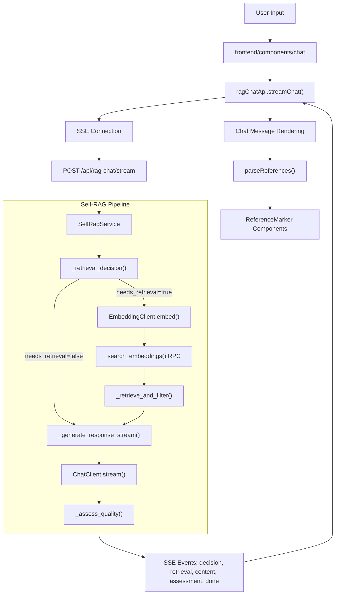
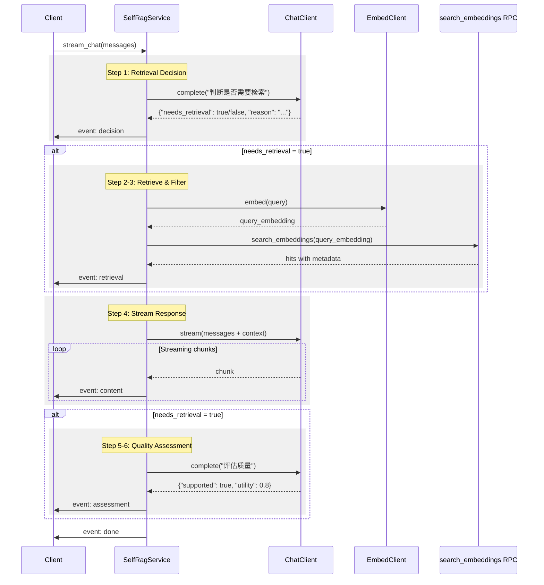
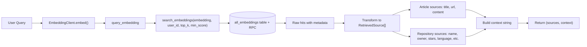
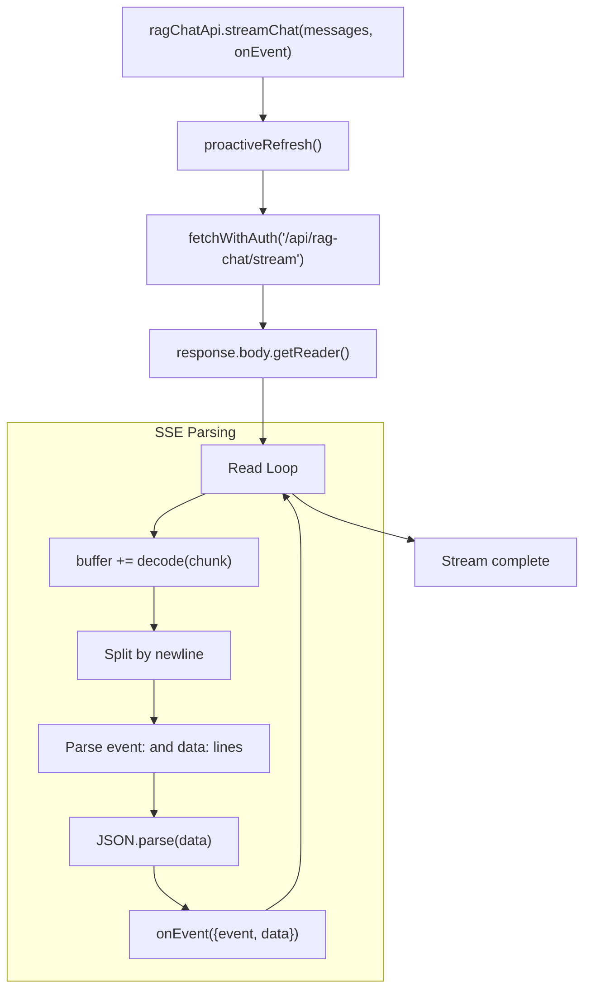
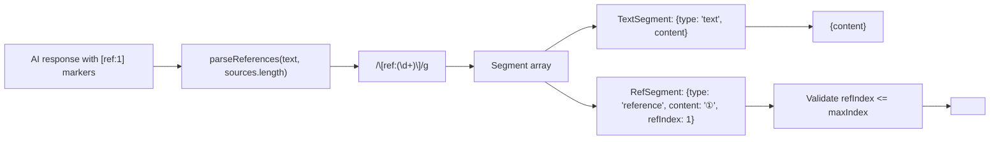
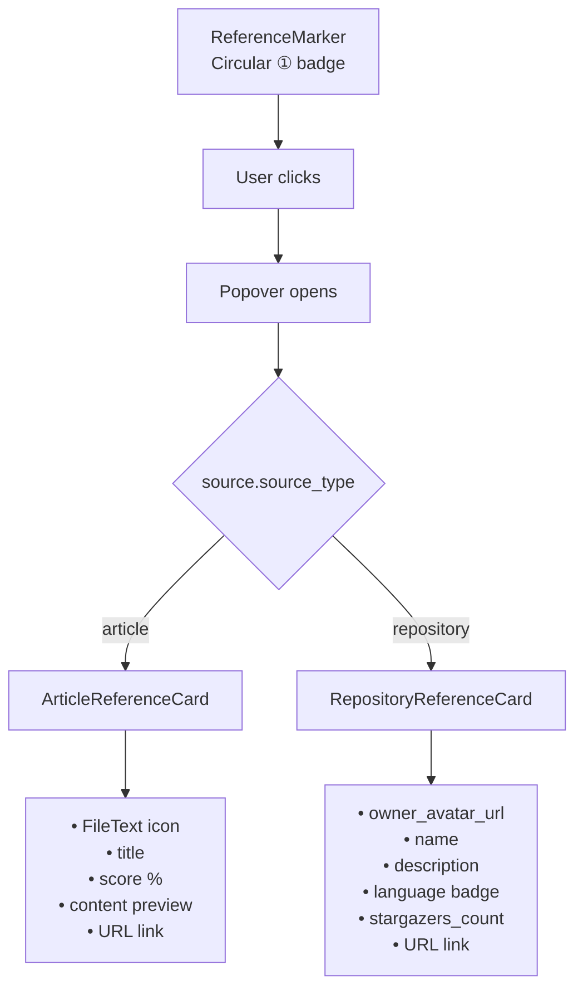
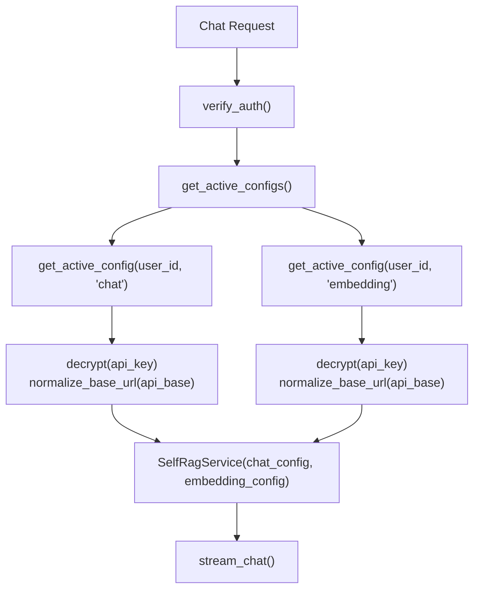

# AI Chat Service

<details>
<summary>Relevant source files</summary>

The following files were used as context for generating this wiki page:

- [backend/app/api/routers/rag.py](backend/app/api/routers/rag.py)
- [backend/app/celery_app/rag_processor.py](backend/app/celery_app/rag_processor.py)
- [backend/app/schemas/rag_chat.py](backend/app/schemas/rag_chat.py)
- [backend/app/services/ai/CLAUDE.md](backend/app/services/ai/CLAUDE.md)
- [backend/app/services/ai/__init__.py](backend/app/services/ai/__init__.py)
- [backend/app/services/ai/clients.py](backend/app/services/ai/clients.py)
- [backend/app/services/ai/config.py](backend/app/services/ai/config.py)
- [backend/app/services/ai/repository_service.py](backend/app/services/ai/repository_service.py)
- [backend/app/services/rag/CLAUDE.md](backend/app/services/rag/CLAUDE.md)
- [backend/app/services/rag/__init__.py](backend/app/services/rag/__init__.py)
- [backend/app/services/rag/chunker.py](backend/app/services/rag/chunker.py)
- [backend/app/services/self_rag_service.py](backend/app/services/self_rag_service.py)
- [backend/scripts/034_update_search_embeddings_for_references.sql](backend/scripts/034_update_search_embeddings_for_references.sql)
- [frontend/components/chat/article-reference-card.tsx](frontend/components/chat/article-reference-card.tsx)
- [frontend/components/chat/chat-message.tsx](frontend/components/chat/chat-message.tsx)
- [frontend/components/chat/reference-marker.tsx](frontend/components/chat/reference-marker.tsx)
- [frontend/components/chat/referenced-content.tsx](frontend/components/chat/referenced-content.tsx)
- [frontend/components/chat/repository-reference-card.tsx](frontend/components/chat/repository-reference-card.tsx)
- [frontend/lib/api/rag-chat.ts](frontend/lib/api/rag-chat.ts)
- [frontend/lib/reference-parser.ts](frontend/lib/reference-parser.ts)

</details>


## Purpose and Scope

The AI Chat Service implements a Self-RAG (Self-Reflective Retrieval Augmented Generation) conversational interface that allows users to query their knowledge base through natural language. The service intelligently decides when to retrieve context from stored articles and repositories, generates streaming responses with inline citations, and assesses response quality.

This page covers the chat service implementation, including the Self-RAG logic, streaming API, and reference system. For the underlying vector search mechanism, see [RAG & Search Services](#5.4). For embedding generation and storage, see [Vector Embeddings](#7.2). For AI client configuration, see [Chat & Embedding Clients](#8.2).

---

## System Architecture

The AI Chat Service follows a streaming architecture with server-sent events (SSE) for real-time response delivery and employs a Self-RAG approach to determine retrieval necessity.

### Overall Chat Flow



**Sources**: [backend/app/services/self_rag_service.py:1-291](), [frontend/lib/api/rag-chat.ts:1-110](), [frontend/components/chat/chat-message.tsx:1-51]()

---

## Self-RAG Service

The `SelfRagService` class implements the core Self-RAG logic, which adds retrieval decision-making and quality assessment layers around standard RAG.

### Service Initialization

The service requires both chat and embedding configurations to operate:

| Parameter | Type | Purpose |
|-----------|------|---------|
| `chat_config` | `Dict[str, str]` | API configuration for ChatClient (api_key, api_base, model) |
| `embedding_config` | `Dict[str, str]` | API configuration for EmbeddingClient |
| `supabase` | `Client` | Supabase client for database access |
| `user_id` | `str` | User ID for scoping vector search |

The service initializes both `ChatClient` and `EmbeddingClient` instances during construction [backend/app/services/self_rag_service.py:44-54]().

**Sources**: [backend/app/services/self_rag_service.py:20-54]()

### Self-RAG Workflow

The `stream_chat()` method orchestrates the complete Self-RAG pipeline, yielding SSE events at each stage:



**Sources**: [backend/app/services/self_rag_service.py:56-111]()

### Retrieval Decision Logic

The `_retrieval_decision()` method uses the language model itself to determine if retrieval is necessary. This prevents unnecessary vector searches for simple greetings or general knowledge questions:

**Decision Rules** [backend/app/services/self_rag_service.py:119-150]():
- **No Retrieval**: Greetings (你好, 谢谢), casual chat, general knowledge questions
- **Needs Retrieval**: Questions about specific articles, repositories, or technical details

The prompt instructs the model to return JSON: `{"needs_retrieval": true/false, "reason": "简短原因"}`. If parsing fails, the system defaults to `needs_retrieval=true` for safety.

**Sources**: [backend/app/services/self_rag_service.py:113-151]()

### Document Retrieval and Filtering

The `_retrieve_and_filter()` method performs the actual knowledge base search:



The method transforms database hits into `RetrievedSource` objects with different fields based on source type:

| Field | Article | Repository | Purpose |
|-------|---------|------------|---------|
| `id` | ✓ | ✓ | Embedding ID |
| `index` | ✓ | ✓ | Reference index (1-based) |
| `content` | ✓ | ✓ | Text snippet (500 chars) |
| `score` | ✓ | ✓ | Similarity score |
| `source_type` | "article" | "repository" | Determines card rendering |
| `title` | article.title | repo.name | Display name |
| `url` | article.url | repo.html_url | External link |
| `owner_login` | - | ✓ | Repository owner username |
| `owner_avatar_url` | - | ✓ | Owner avatar for cards |
| `stargazers_count` | - | ✓ | Star count |
| `language` | - | ✓ | Programming language |
| `description` | - | ✓ | Repository description |

The extended repository fields support rich reference card display in the frontend [backend/app/services/self_rag_service.py:177-207]().

**Sources**: [backend/app/services/self_rag_service.py:152-216](), [backend/app/schemas/rag_chat.py:24-38]()

### Response Generation with Context

The `_generate_response_stream()` method generates the actual response using streaming chat completion:

**System Prompt Construction** [backend/app/services/self_rag_service.py:225-244]():
- When `needs_retrieval=true` and context exists: Uses detailed RAG prompt with reference formatting rules
- Otherwise: Uses simple friendly assistant prompt

**Reference Formatting Rules**:
1. Insert `[ref:N]` markers after statements that use source information
2. Multiple sources can be cited together: `[ref:1][ref:2]`
3. Only cite sources actually used in the response
4. Place markers immediately after relevant statements

The method yields chunks asynchronously from `ChatClient.stream()` [backend/app/services/self_rag_service.py:253-257]().

**Sources**: [backend/app/services/self_rag_service.py:218-258]()

### Quality Assessment

The `_assess_quality()` method evaluates the generated response on two dimensions:

| Metric | Type | Range | Meaning |
|--------|------|-------|---------|
| `supported` | boolean | true/false | Response is grounded in provided context |
| `utility` | float | 0.0-1.0 | Response usefulness/relevance to query |

The assessment uses a structured prompt asking the model to return JSON: `{"supported": true, "utility": 0.8}`. If assessment fails, defaults to `(true, 0.7)` [backend/app/services/self_rag_service.py:259-290]().

**Sources**: [backend/app/services/self_rag_service.py:259-290]()

---

## API Layer

The chat API exposes the Self-RAG service through a streaming HTTP endpoint.

### Stream Chat Endpoint

**Route**: `POST /api/rag-chat/stream`

The endpoint is not shown in the provided files, but based on the architecture and frontend client, it would be structured similarly to the RAG query endpoint pattern shown in [backend/app/api/routers/rag.py:1-296]().

### Request/Response Models

**Request Schema** [backend/app/schemas/rag_chat.py:17-21]():
```python
class RagChatRequest(BaseModel):
    messages: List[ChatMessage]  # Conversation history
    top_k: int = 10              # Number of documents to retrieve
    min_score: float = 0.3       # Minimum similarity threshold
```

**SSE Event Types** [frontend/lib/api/rag-chat.ts:32-38]():

| Event | Data Structure | When Emitted |
|-------|----------------|--------------|
| `decision` | `{needs_retrieval: bool, reason: string}` | After retrieval decision |
| `retrieval` | `{total: int, sources: RetrievedSource[]}` | After vector search (if needed) |
| `content` | `{delta: string}` | During streaming (multiple events) |
| `assessment` | `{supported: bool, utility: float}` | After response completion |
| `done` | `{message: "completed"}` | End of stream |
| `error` | `{error: string}` | On error |

**Sources**: [backend/app/schemas/rag_chat.py:1-48](), [frontend/lib/api/rag-chat.ts:32-43]()

---

## Frontend Integration

The frontend implements a complete chat UI with SSE streaming and reference rendering.

### API Client

The `ragChatApi` client handles SSE connection and event parsing:

**Key Implementation Details** [frontend/lib/api/rag-chat.ts:55-108]():
- Performs proactive token refresh before long-running SSE request
- Uses `ReadableStream` API to process SSE chunks
- Buffers incomplete lines across chunks
- Parses `event:` and `data:` lines according to SSE protocol
- Invokes callback for each parsed event



**Sources**: [frontend/lib/api/rag-chat.ts:55-108]()

### Chat Message Component

The `ChatMessage` component renders messages with conditional reference handling:

**Rendering Logic** [frontend/components/chat/chat-message.tsx:15-50]():
1. **User messages**: Plain text with pre-wrap whitespace handling
2. **Assistant messages with sources**: Uses `ReferencedContent` component for reference parsing
3. **Assistant messages without sources**: Renders markdown without references

The component displays a `ChatSources` section below assistant messages that list all retrieved sources [frontend/components/chat/chat-message.tsx:46]().

**Sources**: [frontend/components/chat/chat-message.tsx:1-51]()

---

## Reference System

The reference system enables inline citations in chat responses through `[ref:N]` markers that expand into interactive cards.

### Reference Parsing

The `parseReferences()` function extracts and validates reference markers from text:

**Parsing Algorithm** [frontend/lib/reference-parser.ts:33-94]():
1. Uses regex `/\[ref:(\d+)\]/g` to find complete markers
2. Validates reference indices against `maxIndex` (sources.length)
3. Returns segments array with alternating text and reference segments
4. Handles incomplete markers at text end for streaming (e.g., `[ref:` without closing)

**Circled Number Display** [frontend/lib/reference-parser.ts:8-24]():
- Indices 1-10: Rendered as Unicode circled numbers ①-⑩
- Indices >10: Rendered as `[N]` format



**Sources**: [frontend/lib/reference-parser.ts:1-94]()

### Referenced Content Rendering

The `ReferencedContent` component orchestrates reference marker rendering:

**Component Structure** [frontend/components/chat/referenced-content.tsx:13-56]():
1. Builds `sourceMap` from sources array (index → source)
2. Parses references using `parseReferences()`
3. Maps segments to React elements:
   - Text segments → `<span>` with whitespace preservation
   - Reference segments → `<ReferenceMarker>` component

**Sources**: [frontend/components/chat/referenced-content.tsx:1-56]()

### Reference Markers and Cards

The `ReferenceMarker` component renders interactive citation bubbles:

**Interaction Pattern** [frontend/components/chat/reference-marker.tsx:19-49]():
- Displays as circular badge with circled number
- Opens `Popover` on click/hover
- Popover contains either `ArticleReferenceCard` or `RepositoryReferenceCard` based on `source.source_type`

**Article Reference Card** [frontend/components/chat/article-reference-card.tsx:10-45]():
- File icon and title
- Similarity score percentage
- Content preview (3 lines)
- External link to article URL

**Repository Reference Card** [frontend/components/chat/repository-reference-card.tsx:11-79]():
- Owner avatar and repository name
- Repository description
- Language badge with color
- Star count with formatting (e.g., "12.3K")
- External link to GitHub



**Sources**: [frontend/components/chat/reference-marker.tsx:1-49](), [frontend/components/chat/article-reference-card.tsx:1-45](), [frontend/components/chat/repository-reference-card.tsx:1-79]()

---

## Vector Search Integration

The chat service depends on the enhanced `search_all_embeddings` RPC for retrieving sources with complete metadata.

### Extended RPC Function

The function was updated to return repository detail fields needed for reference cards:

**Migration**: [backend/scripts/034_update_search_embeddings_for_references.sql:1-74]()

**Return Columns**:

| Column | Type | Source Table | Purpose |
|--------|------|--------------|---------|
| `id` | uuid | all_embeddings | Embedding ID |
| `article_id` | uuid | all_embeddings | Article reference (NULL for repos) |
| `repository_id` | uuid | all_embeddings | Repository reference (NULL for articles) |
| `chunk_index` | int | all_embeddings | Chunk position |
| `content` | text | all_embeddings | Text content |
| `score` | float | calculated | Cosine similarity (1 - distance) |
| `article_title` | text | articles | Article title |
| `article_url` | text | articles | Article URL |
| `repository_name` | text | repositories | Repository name |
| `repository_url` | text | repositories | Repository HTML URL |
| `repository_owner_login` | text | repositories | Owner username |
| `repository_owner_avatar_url` | text | repositories | Owner avatar |
| `repository_stargazers_count` | int | repositories | Star count |
| `repository_language` | text | repositories | Primary language |
| `repository_description` | text | repositories | Description |

The function performs a LEFT JOIN on both `articles` and `repositories` tables, ensuring all metadata is available in a single query [backend/scripts/034_update_search_embeddings_for_references.sql:40-68]().

**Sources**: [backend/scripts/034_update_search_embeddings_for_references.sql:1-74]()

---

## Integration with Other Services

The AI Chat Service integrates with multiple backend services:

### Dependencies

| Service | Usage | Reference |
|---------|-------|-----------|
| **ChatClient** | Response generation, retrieval decision, quality assessment | [Chat & Embedding Clients](#8.2) |
| **EmbeddingClient** | Query vectorization | [Chat & Embedding Clients](#8.2) |
| **RagService** | Vector search via `search_embeddings()` | [RAG & Search Services](#5.4) |
| **api_configs table** | User AI configuration retrieval | [AI Configuration Management](#8.1) |
| **all_embeddings table** | Vector storage and search | [Vector Embeddings](#7.2) |

### Configuration Flow

The service requires both chat and embedding configurations to be active:



If either configuration is missing, the endpoint returns HTTP 400 with error message [backend/app/api/routers/rag.py:68-74]().

**Sources**: [backend/app/api/routers/rag.py:48-76](), [backend/app/services/ai/config.py:155-190]()

---

## Error Handling and Edge Cases

### Streaming Error Recovery

The SSE parser handles incomplete data gracefully:
- Buffers partial lines across multiple chunks [frontend/lib/api/rag-chat.ts:84-93]()
- Catches JSON parse errors without breaking the stream [frontend/lib/api/rag-chat.ts:100-104]()

### Reference Marker Edge Cases

The parsing system handles:
- **Invalid indices**: References with indices outside `[1, sources.length]` are rendered as plain text [frontend/lib/reference-parser.ts:52-67]()
- **Incomplete markers**: Streaming responses may end mid-marker (e.g., `[ref:`), which is detected and separated as `pendingText` [frontend/lib/reference-parser.ts:73-86]()
- **Missing sources**: If a reference index has no corresponding source in the map, it's rendered as text [frontend/components/chat/referenced-content.tsx:29-40]()

### AI Client Failures

- **Decision parsing failure**: Defaults to `needs_retrieval=true` [backend/app/services/self_rag_service.py:148-150]()
- **Quality assessment failure**: Defaults to `(supported=true, utility=0.7)` [backend/app/services/self_rag_service.py:287-290]()
- **Vision caption failure**: Returns `None` from safe wrapper [backend/app/services/ai/clients.py:204-228]()

**Sources**: [frontend/lib/api/rag-chat.ts:84-104](), [frontend/lib/reference-parser.ts:73-86](), [backend/app/services/self_rag_service.py:148-150](), [backend/app/services/self_rag_service.py:287-290]()