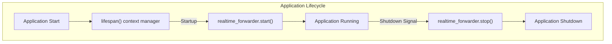
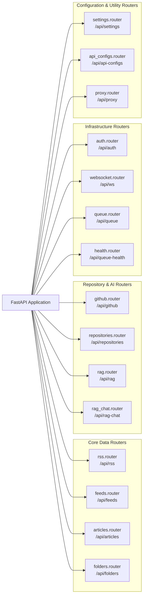
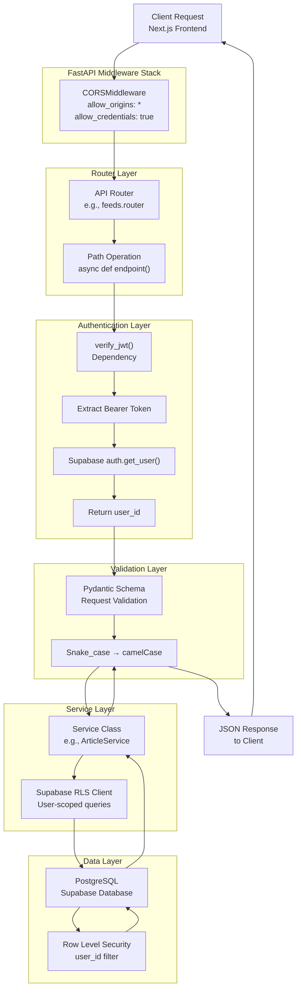
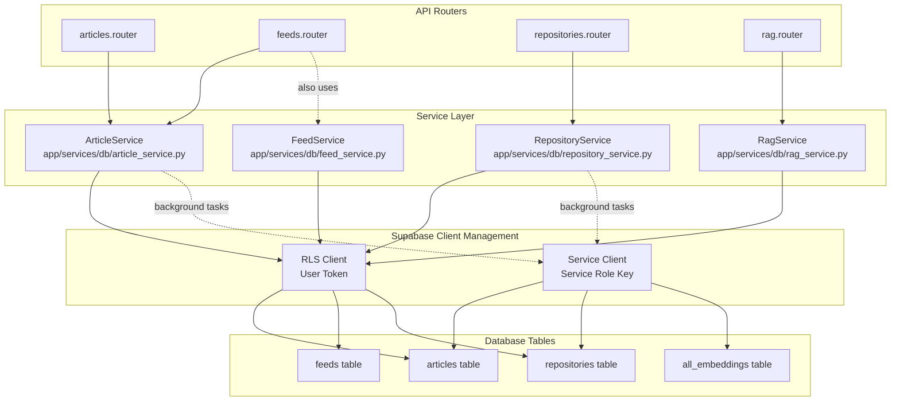
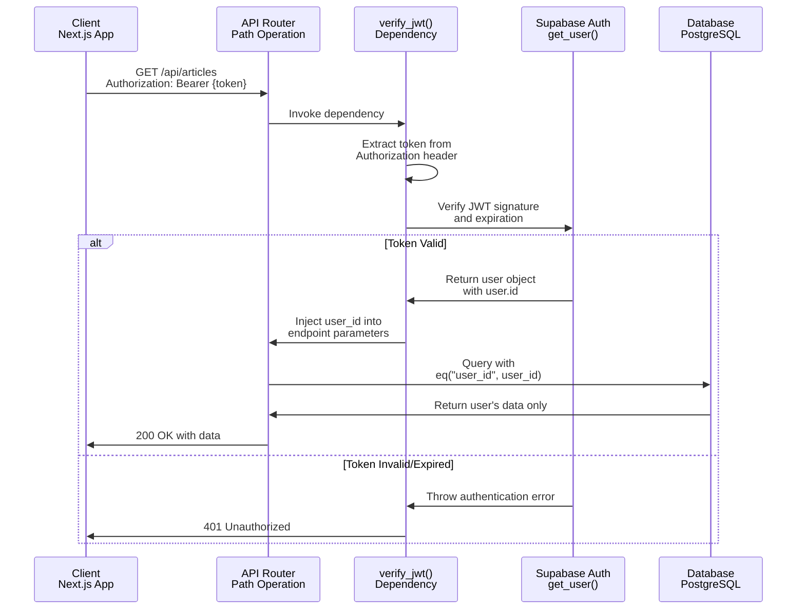
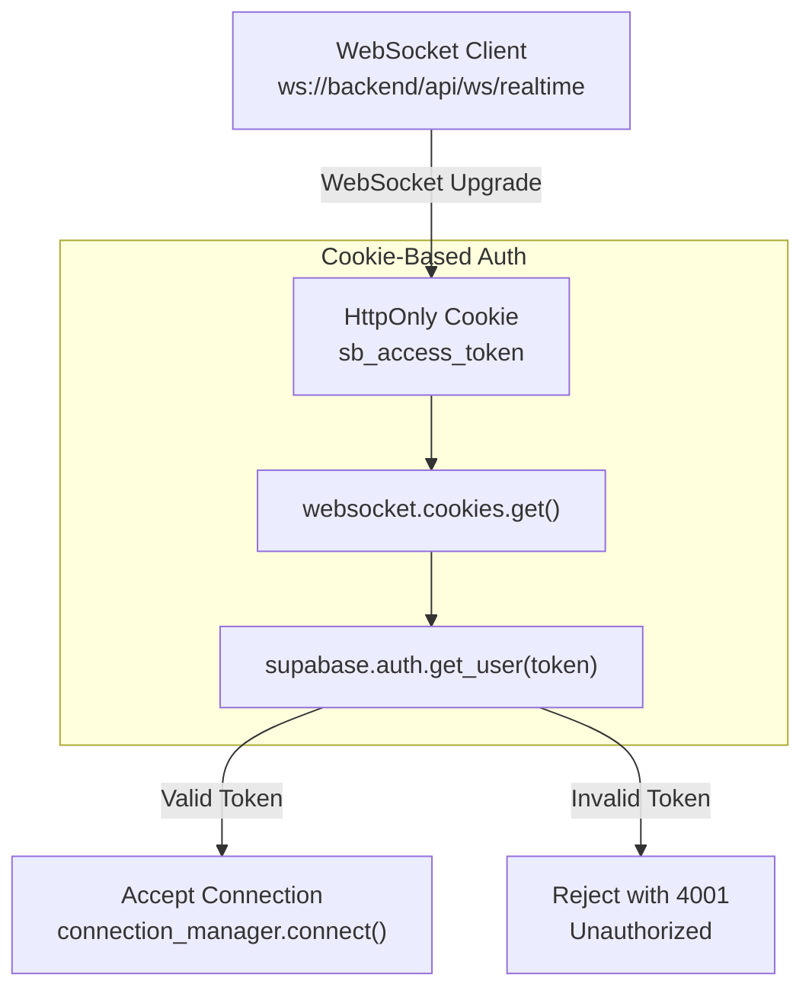

# Backend Services

<details>
<summary>Relevant source files</summary>

The following files were used as context for generating this wiki page:

- [CLAUDE.md](CLAUDE.md)
- [backend/app/api/routers/websocket.py](backend/app/api/routers/websocket.py)
- [backend/app/main.py](backend/app/main.py)
- [frontend/CLAUDE.md](frontend/CLAUDE.md)
- [frontend/app/(reader)/settings/storage/page.tsx](frontend/app/(reader)/settings/storage/page.tsx)
- [frontend/components/edit-feed-form.tsx](frontend/components/edit-feed-form.tsx)

</details>


## Purpose and Scope

This page provides an overview of the FastAPI backend architecture, including application initialization, routing structure, middleware stack, and service layer patterns. The backend serves as the HTTP API layer between the Next.js frontend and Supabase database, handling authentication, data validation, and business logic.

For detailed information about specific backend services:
- Article and feed operations: see [Articles Management](#5.1) and [Feeds Management](#5.2)
- Repository synchronization: see [Repository Management](#5.3)
- Vector search and embeddings: see [RAG & Search Services](#5.4)
- AI chat functionality: see [AI Chat Service](#5.5)
- Background task processing: see [Background Processing](#6)
- Real-time synchronization: see [Real-time Synchronization](#3.2)

---

## Application Initialization

The FastAPI application is initialized in [backend/app/main.py:43-48]() with a lifespan context manager that handles startup and shutdown events. The application uses the Supabase Python SDK for database operations and implements automatic real-time change forwarding.

### Lifespan Management



**Sources:** [backend/app/main.py:29-41]()

The `lifespan` function manages the lifecycle of the `realtime_forwarder` service, which subscribes to Supabase Realtime events and forwards them to connected WebSocket clients. This ensures that database changes are propagated to the frontend in real-time.

### Environment Configuration

The backend requires careful initialization order to handle SSL timeout issues in slow network environments:

| Configuration Step | Purpose | Location |
|-------------------|---------|----------|
| Load `.env` file | Load environment variables before imports | [backend/app/main.py:5]() |
| Patch HTTPX timeout | Fix SSL handshake timeout in Supabase SDK | [backend/app/main.py:10-12]() |
| Setup logging | Configure structured logging with rotation | [backend/app/main.py:20-21]() |
| Import modules | Safe to import after configuration | [backend/app/main.py:26+]() |

**Critical:** The HTTPX timeout patch at [backend/app/main.py:10-12]() must execute before importing any Supabase modules. This uses the `HTTPX_TIMEOUT` environment variable (default: 45 seconds) to prevent SSL handshake failures.

**Sources:** [backend/app/main.py:1-23]()

---

## Router Organization

The backend exposes 16 API routers, all mounted under the `/api` prefix. Each router handles a specific domain of functionality.

### Router Registration Map



**Sources:** [backend/app/main.py:59-76]()

### Router Responsibility Matrix

| Router Module | Prefix | Primary Responsibility | Key Endpoints |
|--------------|--------|------------------------|---------------|
| `rss.router` | `/api/rss` | RSS feed parsing and validation | `POST /validate`, `POST /parse` |
| `feeds.router` | `/api/feeds` | Feed CRUD operations | `GET /`, `POST /`, `PATCH /:id`, `DELETE /:id` |
| `articles.router` | `/api/articles` | Article CRUD and filtering | `GET /`, `PATCH /:id`, `DELETE /old` |
| `folders.router` | `/api/folders` | Folder management | `GET /`, `POST /`, `PATCH /:id`, `DELETE /:id` |
| `repositories.router` | `/api/repositories` | Repository sync and management | `POST /sync`, `GET /`, `DELETE /:id` |
| `rag.router` | `/api/rag` | Vector search queries | `POST /query` |
| `rag_chat.router` | `/api/rag-chat` | AI chat with streaming | `POST /stream` |
| `github.router` | `/api/github` | GitHub API integration | Token validation, metadata fetch |
| `auth.router` | `/api/auth` | Cookie-based authentication | `POST /login`, `POST /refresh` |
| `websocket.router` | `/api/ws` | Real-time WebSocket connection | `WS /realtime` |
| `queue.router` | `/api/queue` | Celery task scheduling | `POST /schedule-feed`, `GET /task/:id` |
| `health.router` | `/api/queue-health` | Queue health monitoring | `GET /` |
| `settings.router` | `/api/settings` | User settings management | `GET /`, `PATCH /` |
| `api_configs.router` | `/api/api-configs` | AI provider configuration | `GET /`, `POST /`, `DELETE /:id` |
| `proxy.router` | `/api/proxy` | Image proxy with SSRF protection | `GET /image` |

**Sources:** [backend/app/main.py:59-76](), [CLAUDE.md:58-62]()

---

## Request Processing Pipeline

All HTTP requests flow through a standardized pipeline that handles CORS, authentication, validation, business logic, and database operations.

### Request Flow Architecture



**Sources:** [backend/app/main.py:50-56](), [CLAUDE.md:103-106]()

### Middleware Configuration

The application uses CORS middleware configured to allow all origins during development:

```python
app.add_middleware(
    CORSMiddleware,
    allow_origins=["*"],  # Should be restricted in production
    allow_credentials=True,
    allow_methods=["*"],
    allow_headers=["*"],
)
```

**Note:** The wildcard CORS configuration at [backend/app/main.py:50-56]() should be restricted to specific origins in production deployments.

**Sources:** [backend/app/main.py:50-56]()

---

## Service Layer Architecture

The backend implements a service layer pattern that abstracts database operations and business logic from API routes. Services are organized by domain and handle both user-scoped (RLS) and system-level (Service Role) operations.

### Service Class Organization



**Sources:** [CLAUDE.md:103-106](), [CLAUDE.md:119-120]()

### Two-Client Pattern

The backend uses two types of Supabase clients depending on the operation context:

| Client Type | Key Used | RLS Applied | Use Case | Example |
|------------|----------|-------------|----------|---------|
| **RLS Client** | Anon Key + User JWT | ✅ Yes | User-facing API requests | `ArticleService.get_articles(user_id)` |
| **Service Client** | Service Role Key | ❌ Bypassed | Background tasks, admin operations | Celery task writing embeddings |

**Critical Pattern:** All user-facing API operations must use the RLS client with `eq("user_id", user_id)` filters to prevent unauthorized data access. Background tasks use the Service client to bypass RLS when performing system-level operations.

**Sources:** [CLAUDE.md:103-106]()

### Service Method Patterns

Services implement standard CRUD patterns with user-scoping:

```
# User-scoped read (RLS Client)
get_articles(user_id: str, filters: dict) -> List[Article]
  ↓
  supabase.from_("articles")
    .select("*")
    .eq("user_id", user_id)
    .apply_filters(filters)

# User-scoped write (RLS Client)
update_article(user_id: str, article_id: str, updates: dict) -> Article
  ↓
  supabase.from_("articles")
    .update(updates)
    .eq("id", article_id)
    .eq("user_id", user_id)  # Security critical

# System-level write (Service Client)
save_embeddings(embeddings: List[dict]) -> None
  ↓
  service_client.from_("all_embeddings")
    .upsert(embeddings)  # No user_id filter needed
```

**Sources:** [CLAUDE.md:103-106]()

---

## Authentication and Authorization

The backend implements JWT-based authentication using Supabase Auth. User authentication is validated on every protected endpoint through the `verify_jwt` dependency.

### Authentication Flow



**Sources:** [CLAUDE.md:80-84]()

### WebSocket Authentication

WebSocket connections use a different authentication mechanism based on HttpOnly cookies rather than Bearer tokens:



**Sources:** [backend/app/api/routers/websocket.py:30-61](), [backend/app/api/routers/websocket.py:89-96]()

The WebSocket endpoint at [backend/app/api/routers/websocket.py:64-121]() authenticates connections using the `sb_access_token` HttpOnly cookie set by the auth router. This prevents XSS attacks while maintaining stateful WebSocket connections.

**Cookie Name Constant:** `COOKIE_NAME_ACCESS = "sb_access_token"` at [backend/app/api/routers/websocket.py:22]()

**Sources:** [backend/app/api/routers/websocket.py:1-121]()

---

## Real-time Event Forwarding

The backend includes a real-time synchronization service that subscribes to Supabase Realtime events and forwards them to connected WebSocket clients.

### Realtime Architecture

```mermaid
graph LR
    subgraph "Database Layer"
        PG["PostgreSQL<br/>Supabase Database"]
        Trigger["Database Trigger<br/>NOTIFY events"]
    end
    
    subgraph "Backend Service"
        Forwarder["realtime_forwarder<br/>supabase_realtime.py"]
        Subscription["Supabase Realtime<br/>Channel Subscription"]
        Manager["connection_manager<br/>realtime.py"]
    end
    
    subgraph "Connected Clients"
        WS1["WebSocket Client 1<br/>User A"]
        WS2["WebSocket Client 2<br/>User A"]
        WS3["WebSocket Client 3<br/>User B"]
    end
    
    PG --> Trigger
    Trigger -->|postgres_changes| Subscription
    Subscription --> Forwarder
    Forwarder -->|Filter by user_id| Manager
    
    Manager -->|Broadcast| WS1
    Manager -->|Broadcast| WS2
    Manager -.X.-|No access| WS3
```

**Sources:** [backend/app/main.py:26](), [backend/app/main.py:33-40]()

### Lifecycle Integration

The `realtime_forwarder` service is started during application startup and stopped during shutdown through the lifespan context manager:

```python
@asynccontextmanager
async def lifespan(app: FastAPI):
    # Startup: Start Supabase Realtime subscription
    logger.info("Starting Supabase Realtime forwarder...")
    await realtime_forwarder.start()
    
    yield
    
    # Shutdown: Stop Supabase Realtime subscription
    logger.info("Stopping Supabase Realtime forwarder...")
    await realtime_forwarder.stop()
```

**Sources:** [backend/app/main.py:29-40]()

For detailed implementation of the real-time forwarding mechanism, see [Real-time Synchronization](#3.2).

---

## Health Check Endpoints

The application provides two health check endpoints for monitoring:

| Endpoint | Purpose | Response Format |
|----------|---------|-----------------|
| `GET /health` | Root health check | `{"status": "healthy"}` |
| `GET /api/health` | API-specific health check | `{"status": "healthy", "service": "rss-api"}` |

**Sources:** [backend/app/main.py:79-88]()

These endpoints can be used for:
- Load balancer health checks
- Container orchestration probes (Kubernetes liveness/readiness)
- Monitoring system integration
- Smoke testing after deployments

---

## Configuration Management

### Environment Variables

The backend requires the following environment variables:

| Variable | Purpose | Required | Default |
|----------|---------|----------|---------|
| `SUPABASE_URL` | Supabase project URL | ✅ Yes | - |
| `SUPABASE_ANON_KEY` | Supabase anonymous key (for RLS client) | ✅ Yes | - |
| `SUPABASE_SERVICE_ROLE_KEY` | Service role key (bypasses RLS) | ✅ Yes | - |
| `HTTPX_TIMEOUT` | HTTPX request timeout in seconds | ❌ No | `45` |
| `REDIS_URL` | Redis connection for Celery | ✅ Yes* | - |
| `CELERY_BROKER_URL` | Celery broker URL | ✅ Yes* | - |

*Required when using background task processing features.

**Sources:** [CLAUDE.md:93-98](), [backend/app/main.py:10-12]()

### HTTPX Timeout Patch

The backend applies a critical monkey-patch to HTTPX's default timeout before importing Supabase modules:

```python
import httpx
_HTTPX_TIMEOUT = float(os.environ.get("HTTPX_TIMEOUT", "45"))
httpx._config.DEFAULT_TIMEOUT_CONFIG = httpx.Timeout(_HTTPX_TIMEOUT)
```

**Rationale:** This fixes SSL handshake timeouts in slow network environments (e.g., China mainland) by increasing the default 5-second timeout. The patch must execute before any Supabase imports, as documented in [backend/app/main.py:7-12]().

**Sources:** [backend/app/main.py:7-12]()

---

## Logging Configuration

The backend uses structured logging with daily rotation configured through `setup_logging()`:

```python
from app.core.logging_config import setup_logging
setup_logging()
```

All modules should use the standard logging interface:

```python
import logging
logger = logging.getLogger(__name__)

logger.info("Operation completed", extra={"user_id": user_id, "duration_ms": 150})
logger.error("Operation failed", exc_info=True, extra={"user_id": user_id})
```

**Sources:** [backend/app/main.py:19-23]()

---

## API Documentation

FastAPI automatically generates interactive API documentation:

| URL | Documentation Type | Description |
|-----|-------------------|-------------|
| `/docs` | Swagger UI | Interactive API explorer with request/response examples |
| `/redoc` | ReDoc | Alternative documentation with better readability |
| `/openapi.json` | OpenAPI Schema | Machine-readable API specification |

These endpoints are automatically available in development and can be enabled/disabled in production through FastAPI configuration.

**Sources:** [CLAUDE.md:38]()

---

## Summary

The FastAPI backend serves as the HTTP API layer with the following key characteristics:

1. **Modular Router Organization:** 16 domain-specific routers handle different aspects of functionality
2. **Service Layer Pattern:** Database operations abstracted into service classes with clear separation between user-scoped (RLS) and system-level (Service) operations
3. **JWT Authentication:** All protected endpoints validate Supabase JWT tokens through dependency injection
4. **Real-time Synchronization:** Built-in WebSocket server forwards database changes to connected clients
5. **Structured Configuration:** Environment-based configuration with critical HTTPX timeout patch for network reliability
6. **Lifecycle Management:** Proper startup/shutdown handling for long-lived services like real-time forwarder

The backend bridges the Next.js frontend with Supabase database while maintaining security through Row Level Security, providing real-time updates through WebSocket connections, and coordinating background processing through Celery task queues.

**Sources:** [backend/app/main.py:1-88](), [CLAUDE.md:14-65](), [CLAUDE.md:103-121]()