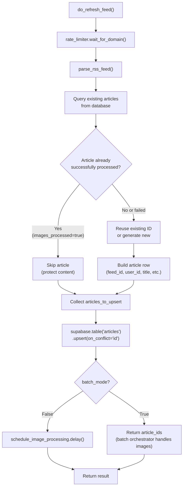
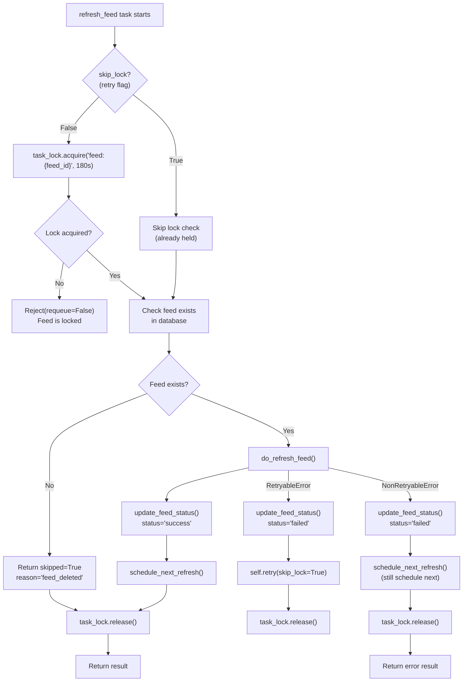
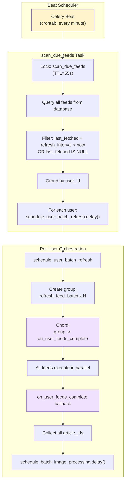
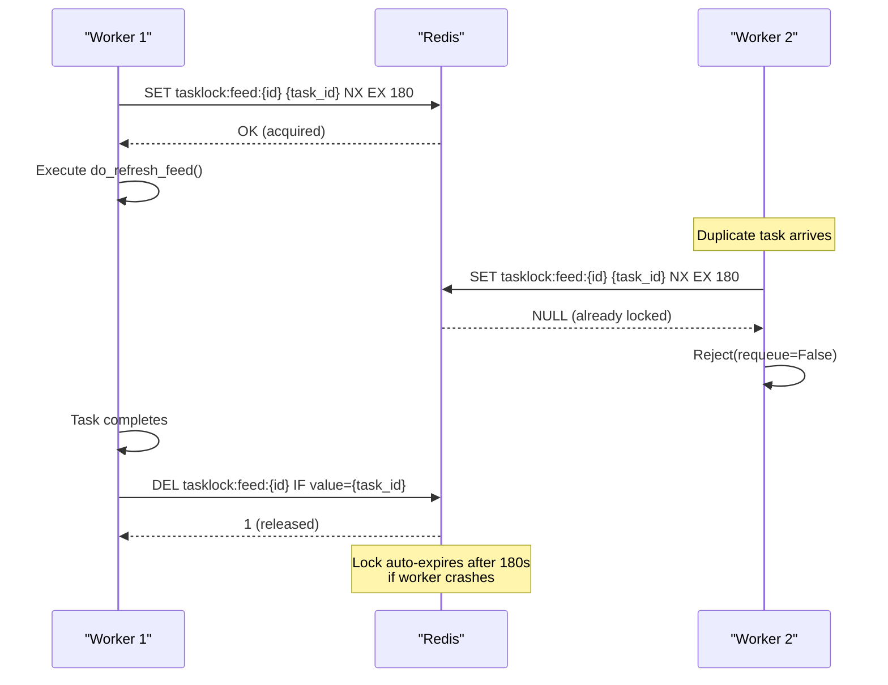
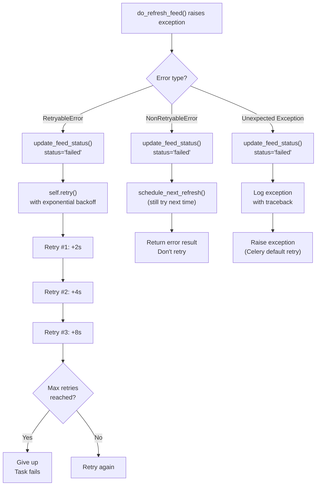
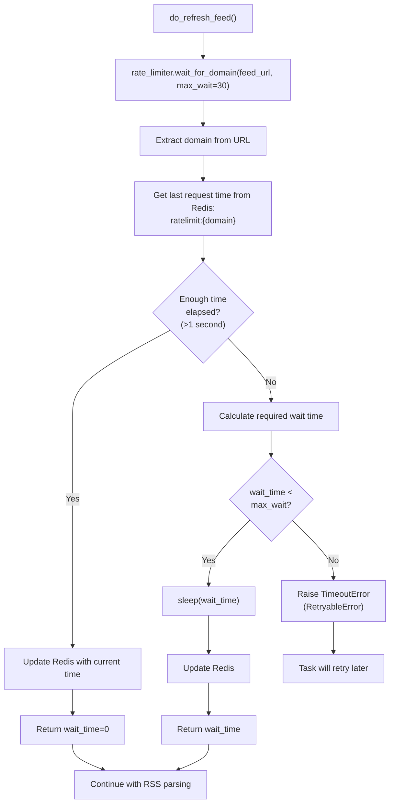
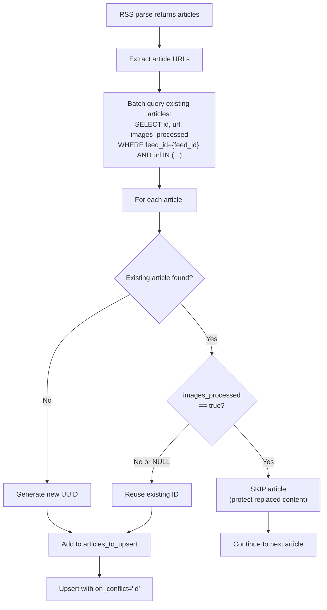

# RSS Feed Processing

<details>
<summary>Relevant source files</summary>

The following files were used as context for generating this wiki page:

- [backend/app/api/routers/feeds.py](backend/app/api/routers/feeds.py)
- [backend/app/celery_app/CLAUDE.md](backend/app/celery_app/CLAUDE.md)
- [backend/app/celery_app/celery.py](backend/app/celery_app/celery.py)
- [backend/app/celery_app/image_processor.py](backend/app/celery_app/image_processor.py)
- [backend/app/celery_app/tasks.py](backend/app/celery_app/tasks.py)
- [backend/app/services/db/rag.py](backend/app/services/db/rag.py)
- [backend/app/services/rag/retriever.py](backend/app/services/rag/retriever.py)
- [backend/scripts/029_rename_article_embeddings_to_all_embeddings.sql](backend/scripts/029_rename_article_embeddings_to_all_embeddings.sql)
- [backend/scripts/031_add_repository_embeddings.sql](backend/scripts/031_add_repository_embeddings.sql)
- [backend/scripts/032_fix_all_embeddings_article_id_nullable.sql](backend/scripts/032_fix_all_embeddings_article_id_nullable.sql)
- [docs/RSS_subscribe/RSS_FLOW_COMPLETE.md](docs/RSS_subscribe/RSS_FLOW_COMPLETE.md)
- [frontend/components/add-feed-dialog.tsx](frontend/components/add-feed-dialog.tsx)

</details>


## Purpose and Scope

This page documents the complete RSS feed refresh pipeline in SaveHub's Celery-based background processing system. It covers the core logic for fetching RSS feeds, parsing articles, saving them to the database, and coordinating with downstream processing tasks.

**Scope includes:**
- The `do_refresh_feed()` core business logic
- The `refresh_feed` task for single feed refresh with self-scheduling
- The `refresh_feed_batch` task for scheduled batch refresh
- The `scan_due_feeds` Beat task for automatic feed discovery
- Feed locking mechanisms using Redis
- Error handling and retry strategies

**Related pages:**
- For the FastAPI endpoint that triggers feed refresh, see [Feeds Management](#5.2)
- For image processing triggered after feed refresh, see [Image Processing Pipeline](#6.3)
- For RAG/embedding processing, see [RAG Processing Pipeline](#6.4)
- For Celery architecture overview, see [Background Processing](#6)

---

## Two Refresh Modes

SaveHub supports two distinct modes of feed refresh that share core logic but differ in orchestration:

| Aspect | Single Feed Mode | Batch Mode |
|--------|------------------|------------|
| **Entry Task** | `refresh_feed` | `refresh_feed_batch` |
| **Trigger** | User adds feed via `POST /feeds` | Celery Beat scans every minute |
| **Parameter** | `batch_mode=False` | `batch_mode=True` |
| **Image Processing** | Scheduled immediately after feed | Deferred until all feeds complete |
| **Next Refresh** | Self-scheduled by task | Beat-controlled, no self-scheduling |
| **Queue** | `high` priority | `default` priority |
| **Callback** | `on_images_complete` | `on_user_feeds_complete` → `on_batch_images_complete` |

**Diagram: Two Refresh Mode Flows**

```mermaid
graph TB
    subgraph "Mode 1: Single Feed (User-Initiated)"
        A1["POST /feeds"] --> A2["refresh_feed<br/>(batch_mode=False)"]
        A2 --> A3["do_refresh_feed()"]
        A3 --> A4["Save articles"]
        A4 --> A5["schedule_image_processing"]
        A5 --> A6["Chord: process_article_images x N"]
        A6 --> A7["on_images_complete"]
        A7 --> A8["schedule_rag_for_articles"]
        A2 --> A9["schedule_next_refresh<br/>(self-scheduling)"]
    end
    
    subgraph "Mode 2: Batch (Beat-Scheduled)"
        B1["Celery Beat<br/>(every minute)"] --> B2["scan_due_feeds"]
        B2 --> B3["Group by user_id"]
        B3 --> B4["schedule_user_batch_refresh"]
        B4 --> B5["Chord: refresh_feed_batch x N<br/>(batch_mode=True)"]
        B5 --> B6["All feeds call do_refresh_feed()"]
        B6 --> B7["on_user_feeds_complete"]
        B7 --> B8["schedule_batch_image_processing"]
        B8 --> B9["Chord: process_article_images x M"]
        B9 --> B10["on_batch_images_complete"]
        B10 --> B11["schedule_rag_for_articles"]
    end
    
    style A2 fill:#e1f5ff
    style B5 fill:#e1f5ff
    style A3 fill:#fff4e1
    style B6 fill:#fff4e1
```



**Sources:** [backend/app/celery_app/tasks.py:243-309](), [backend/app/celery_app/tasks.py:645-756](), [backend/app/celery_app/CLAUDE.md:6-74]()

---

## Core Refresh Logic: do_refresh_feed()

The `do_refresh_feed()` function contains the decoupled business logic for refreshing a single feed, designed for testability and reuse across both refresh modes.

**Function Signature:**
```python
def do_refresh_feed(
    feed_id: str,
    feed_url: str,
    user_id: str,
    batch_mode: bool = False,
) -> Dict[str, Any]
```

**Diagram: Core Refresh Logic Flow**



**Key Implementation Details:**

1. **Domain Rate Limiting:** Prevents API abuse by limiting requests to 1/second per domain
2. **Article Deduplication:** Queries existing articles by URL; if `images_processed=true`, skips to protect already-replaced content
3. **ID Reuse:** Critical for foreign key integrity with `all_embeddings` table - reuses existing article ID if found
4. **Upsert Conflict Resolution:** Uses `on_conflict="id"` to prevent FK violations; falls back to URL lookup if unique constraint fails
5. **Conditional Image Scheduling:** Only schedules if `batch_mode=False`; batch mode defers to orchestrator

**Sources:** [backend/app/celery_app/tasks.py:57-216](), [docs/RSS_subscribe/RSS_FLOW_COMPLETE.md:330-367]()

---

## Single Feed Refresh: refresh_feed Task

The `refresh_feed` Celery task handles individual feed refresh with automatic next-refresh scheduling. This is the primary mode used when users manually add feeds via the API.

**Task Configuration:**

```python
@app.task(
    bind=True,
    name="refresh_feed",
    max_retries=3,
    default_retry_delay=2,
    retry_backoff=True,
    retry_backoff_max=60,
    retry_jitter=True,
    acks_late=True,
    reject_on_worker_lost=True,
    time_limit=120,      # Hard timeout 2 minutes
    soft_time_limit=90,  # Soft timeout 1.5 minutes
)
```

**Diagram: refresh_feed Task Flow**



**Critical Features:**

| Feature | Implementation | Purpose |
|---------|---------------|---------|
| **Task Lock** | Redis lock `feed:{feed_id}`, TTL=180s | Prevent duplicate execution |
| **Skip Lock on Retry** | `skip_lock=True` passed to retry | Avoid deadlock (already hold lock) |
| **Feed Existence Check** | Query database before processing | Handle deleted feeds gracefully |
| **Self-Scheduling** | `schedule_next_refresh()` at end | Perpetual refresh cycle |
| **Error Classification** | `RetryableError` vs `NonRetryableError` | Smart retry decisions |

**Self-Scheduling Mechanism:**

After successful refresh, the task schedules its own next execution:

```python
def schedule_next_refresh(feed_id: str, user_id: str, refresh_interval: int):
    delay_seconds = refresh_interval * 60
    
    task = refresh_feed.apply_async(
        kwargs={...},
        countdown=delay_seconds,  # Delayed execution
        queue="default"
    )
    
    # Store task ID for cancellation if feed deleted
    task_lock.redis.setex(f"feed_task:{feed_id}", delay_seconds + 300, task.id)
```

**Feed Deletion Handling:**

When a feed is deleted via `DELETE /feeds/{feed_id}`, the API calls `cancel_feed_refresh()` to revoke the scheduled task:

```python
def cancel_feed_refresh(feed_id: str) -> bool:
    task_id = redis.get(f"feed_task:{feed_id}")
    if task_id:
        app.control.revoke(task_id, terminate=False)
        redis.delete(f"feed_task:{feed_id}")
        redis.delete(f"tasklock:schedule:{feed_id}")
    return True
```

**Sources:** [backend/app/celery_app/tasks.py:243-446](), [backend/app/celery_app/tasks.py:448-506](), [backend/app/celery_app/tasks.py:508-542]()

---

## Batch Refresh Orchestration

Batch refresh is coordinated by Celery Beat and uses Chord patterns for parallel execution with ordered callback stages.

**Diagram: Batch Refresh Orchestration**



**scan_due_feeds Implementation:**

This Beat task runs every minute to find feeds that need refresh:

```python
@app.task(name="scan_due_feeds")
def scan_due_feeds():
    # Acquire lock to prevent overlapping execution
    if not task_lock.acquire("scan_due_feeds", ttl_seconds=55):
        return {"skipped": True}
    
    try:
        # Query all feeds
        result = supabase.table("feeds").select(
            "id, url, title, user_id, refresh_interval, last_fetched"
        ).execute()
        
        # Filter due feeds in code (Supabase doesn't support complex time calc)
        due_feeds = []
        now = datetime.now(timezone.utc)
        for feed in result.data:
            if feed.get("last_fetched"):
                next_refresh = last_fetched + timedelta(minutes=feed["refresh_interval"])
                if next_refresh <= now:
                    due_feeds.append(feed)
            else:
                due_feeds.append(feed)  # Never fetched
        
        # Group by user_id
        user_feeds = {}
        for feed in due_feeds:
            user_feeds.setdefault(feed["user_id"], []).append(feed)
        
        # Schedule batch refresh per user
        for user_id, feeds in user_feeds.items():
            schedule_user_batch_refresh.delay(user_id, feeds)
            
    finally:
        task_lock.release("scan_due_feeds")
```

**schedule_user_batch_refresh Implementation:**

Creates a Chord where all feeds for a user refresh in parallel, then a callback collects results:

```python
@app.task(name="schedule_user_batch_refresh")
def schedule_user_batch_refresh(user_id: str, feeds: list):
    from celery import chord, group
    
    # Build parallel task group
    refresh_tasks = group(
        refresh_feed_batch.s(
            feed_id=feed["id"],
            feed_url=feed["url"],
            feed_title=feed["title"],
            user_id=user_id,
            refresh_interval=feed["refresh_interval"],
        )
        for feed in feeds
    )
    
    # Chord: all feeds -> callback
    workflow = chord(refresh_tasks)(
        on_user_feeds_complete.s(user_id=user_id)
    )
    
    return {"scheduled": len(feeds), "chord_id": workflow.id}
```

**on_user_feeds_complete Callback:**

Collects article IDs from all feed refresh results and triggers batch image processing:

```python
@app.task(name="on_user_feeds_complete", bind=True)
def on_user_feeds_complete(self, refresh_results: list, user_id: str):
    # Count results
    success_count = sum(1 for r in refresh_results if r and r.get("success"))
    
    # Collect all article IDs
    all_article_ids = []
    for r in refresh_results:
        if r and r.get("success") and not r.get("skipped"):
            all_article_ids.extend(r.get("article_ids", []))
    
    # Trigger batch image processing (see section 6.3)
    from .image_processor import schedule_batch_image_processing
    schedule_batch_image_processing.delay(all_article_ids, user_id)
    
    return {
        "user_id": user_id,
        "feeds_success": success_count,
        "articles": len(all_article_ids),
    }
```

**Conflict Prevention Between Modes:**

When users add a new feed via `POST /feeds`, the API sets `last_fetched = now` **before** scheduling `refresh_feed`. This prevents Beat from re-triggering the same feed:

```python
# backend/app/api/routers/feeds.py:86-91
supabase_service.table("feeds").update({
    "last_fetched": datetime.now(timezone.utc).isoformat()
}).eq("id", feed_data["id"]).execute()

refresh_feed.apply_async(kwargs={...}, queue="high")
```

**Sources:** [backend/app/celery_app/tasks.py:759-825](), [backend/app/celery_app/tasks.py:828-867](), [backend/app/celery_app/tasks.py:870-918](), [backend/app/api/routers/feeds.py:74-107]()

---

## Feed Locking Mechanisms

Redis-based distributed locks prevent duplicate feed refresh execution across multiple workers.

**Diagram: Task Lock Lifecycle**



**TaskLock Implementation:**

The `TaskLock` class provides distributed locking with automatic expiration:

| Method | Purpose | Key Parameters |
|--------|---------|----------------|
| `acquire(key, ttl, task_id)` | Acquire lock | `NX` (only if not exists), `EX ttl` (expiration) |
| `release(key, task_id)` | Release lock | Only if holder matches task_id |
| `get_ttl(key)` | Check remaining time | Returns seconds until expiration |

**Lock Key Patterns:**

| Lock Type | Key Pattern | TTL | Purpose |
|-----------|-------------|-----|---------|
| Feed Lock | `tasklock:feed:{feed_id}` | 180s | Prevent duplicate feed refresh |
| Schedule Lock | `tasklock:schedule:{feed_id}` | `min(delay_seconds, 3600)` | Prevent duplicate scheduling |
| Scan Lock | `tasklock:scan_due_feeds` | 55s | Prevent overlapping Beat scans |

**Lock Acquisition Flow:**

```python
# backend/app/celery_app/tasks.py:296-309
lock_key = f"feed:{feed_id}"
lock_ttl = 180  # 3 minutes (longer than task timeout)

if not task_lock.acquire(lock_key, lock_ttl, task_id):
    remaining = task_lock.get_ttl(lock_key)
    logger.info(f"Feed {feed_id} already being processed, lock expires in {remaining}s")
    raise Reject(f"Feed {feed_id} is locked", requeue=False)

try:
    # Execute refresh
    result = do_refresh_feed(feed_id, feed_url, user_id)
finally:
    # Always release lock (even on exception)
    if not skip_lock:
        task_lock.release(lock_key, task_id)
```

**Skip Lock on Retry:**

When a task retries due to `RetryableError`, it passes `skip_lock=True` to avoid re-acquiring the lock it already holds:

```python
# backend/app/celery_app/tasks.py:387-391
raise self.retry(
    exc=e,
    kwargs={**self.request.kwargs, "skip_lock": True}
)
```

**Sources:** [backend/app/celery_app/tasks.py:296-309](), [backend/app/celery_app/tasks.py:442-445](), [backend/app/celery_app/task_lock.py]()

---

## Error Handling and Retry Logic

SaveHub classifies feed refresh errors into retryable and non-retryable categories to optimize retry behavior.

**Error Classification:**

```python
class RetryableError(FeedRefreshError):
    """Network issues, rate limits, temporary failures"""
    pass

class NonRetryableError(FeedRefreshError):
    """Invalid feed, parse errors, permanent failures"""
    pass
```

**Retryable Error Patterns:**

```python
def is_retryable_error(error_msg: str) -> bool:
    retryable_patterns = [
        "ENOTFOUND", "ETIMEDOUT", "ECONNREFUSED", "ECONNRESET",
        "socket hang up", "timeout", "temporarily unavailable",
        "503", "502", "429", "ConnectionError", "TimeoutError"
    ]
    return any(p.lower() in error_msg.lower() for p in retryable_patterns)
```

**Diagram: Error Handling Decision Tree**



**Retry Configuration:**

```python
@app.task(
    max_retries=3,
    default_retry_delay=2,      # Initial delay: 2 seconds
    retry_backoff=True,          # Exponential backoff: 2s, 4s, 8s, 16s, ...
    retry_backoff_max=60,        # Max backoff: 60 seconds
    retry_jitter=True,           # Add randomization to prevent thundering herd
)
```

**Feed Status Tracking:**

After each attempt, the feed status is updated:

```python
def update_feed_status(feed_id: str, user_id: str, status: str, error: Optional[str] = None):
    update_data = {
        "last_fetched": datetime.now(timezone.utc).isoformat(),
        "last_fetch_status": status,  # "success" or "failed"
        "last_fetch_error": error[:500] if error else None,
    }
    supabase.table("feeds").update(update_data).eq("id", feed_id).execute()
```

**Database Fields:**

| Field | Type | Purpose |
|-------|------|---------|
| `last_fetched` | TIMESTAMPTZ | When last refresh attempted |
| `last_fetch_status` | TEXT | "success" or "failed" |
| `last_fetch_error` | TEXT | Error message (max 500 chars) |
| `refresh_interval` | INTEGER | Refresh frequency in minutes |

**Sources:** [backend/app/celery_app/tasks.py:31-55](), [backend/app/celery_app/tasks.py:219-236](), [backend/app/celery_app/tasks.py:368-420]()

---

## Rate Limiting and Domain Protection

The `RateLimiter` class implements per-domain rate limiting to prevent API abuse and comply with RSS feed provider policies.

**Rate Limiting Strategy:**

- **Policy:** Maximum 1 request per second per domain
- **Implementation:** Redis-based timestamp tracking
- **Blocking:** Tasks wait until rate limit window passes
- **Timeout:** Max wait of 30 seconds (raises `RetryableError` if exceeded)

**Diagram: Rate Limiter Flow**



**Redis Key Pattern:**

```
ratelimit:{domain} → timestamp (float)
TTL: 60 seconds (auto-expire)
```

**Usage in do_refresh_feed():**

```python
# backend/app/celery_app/tasks.py:84-90
rate_limiter = get_rate_limiter()

try:
    waited = rate_limiter.wait_for_domain(feed_url, max_wait_seconds=30)
    if waited > 0:
        logger.debug(f"Rate limited, waited {waited:.2f}s for {feed_url}")
except TimeoutError as e:
    raise RetryableError(str(e))
```

**Sources:** [backend/app/celery_app/tasks.py:84-90](), [backend/app/celery_app/rate_limiter.py]()

---

## Article Deduplication and ID Management

SaveHub implements sophisticated article deduplication to prevent re-processing and protect user-modified content.

**Deduplication Strategy:**



**Critical ID Reuse Logic:**

```python
# backend/app/celery_app/tasks.py:108-139
existing_articles = {}  # url -> {"id": ..., "images_processed": ...}

# Query existing articles
existing_result = supabase.table("articles").select(
    "id, url, images_processed"
).eq("feed_id", feed_id).in_("url", article_urls).execute()

for a in existing_result.data:
    existing_articles[a["url"]] = {
        "id": a["id"],
        "images_processed": a.get("images_processed", False)
    }

# Build upsert list
for article in articles:
    url = article.get("url")
    existing = existing_articles.get(url)
    
    if existing and existing["images_processed"]:
        # Successfully processed article: skip to protect replaced content
        logger.debug(f"Skipping successfully processed article: {url[:80]}")
        continue
    
    # Reuse existing ID if found, otherwise generate new one
    article_id = existing["id"] if existing else (article.get("id") or str(uuid4()))
    
    articles_to_upsert.append({
        "id": article_id,
        "feed_id": feed_id,
        # ... other fields
    })
```

**Why ID Reuse Matters:**

1. **Foreign Key Integrity:** The `all_embeddings` table has a foreign key to `articles.id` without ON UPDATE CASCADE
2. **Embedding Preservation:** Changing an article's ID would orphan its embeddings
3. **Content Protection:** Once `images_processed=true`, the article has been image-processed and possibly edited; we don't want to overwrite it

**Upsert Conflict Handling:**

```python
# backend/app/celery_app/tasks.py:164-186
try:
    upsert_result = supabase.table("articles").upsert(
        articles_to_upsert,
        on_conflict="id"  # CRITICAL: use ID, not (feed_id,url)
    ).execute()
except APIError as e:
    if "23505" in str(e):  # Unique constraint violation
        logger.warning("Unique constraint violation, retrying with URL lookup")
        # Re-query to get correct IDs
        for article in articles_to_upsert:
            existing = supabase.table("articles").select("id").eq(
                "feed_id", feed_id
            ).eq("url", article["url"]).maybeSingle().execute()
            if existing.data:
                article["id"] = existing.data["id"]
        # Retry upsert
        supabase.table("articles").upsert(
            articles_to_upsert,
            on_conflict="id"
        ).execute()
```

**Sources:** [backend/app/celery_app/tasks.py:106-195](), [docs/RSS_subscribe/RSS_FLOW_COMPLETE.md:326-367]()

---

## Integration with Processing Pipeline

After successful feed refresh, the system triggers a cascade of downstream processing tasks.

**Diagram: Complete Processing Chain**

```mermaid
graph LR
    A["refresh_feed or<br/>refresh_feed_batch"] --> B["do_refresh_feed()"]
    B --> C["Articles saved<br/>to database"]
    
    C --> D{"batch_mode?"}
    
    D -->|"False<br/>(single feed)"| E["schedule_image_processing<br/>(feed_id)"]
    E --> F["Chord: process_article_images x N"]
    F --> G["on_images_complete"]
    
    D -->|"True<br/>(batch)"| H["on_user_feeds_complete"]
    H --> I["schedule_batch_image_processing<br/>(user_id)"]
    I --> J["Chord: process_article_images x M"]
    J --> K["on_batch_images_complete"]
    
    G --> L["schedule_rag_for_articles"]
    K --> L
    
    L --> M["process_article_rag x N<br/>(staggered)"]
    M --> N["extract_article_repos"]
    
    style E fill:#e1f5ff
    style I fill:#e1f5ff
    style L fill:#fff4e1
    style M fill:#f0e1ff
    style N fill:#ffe1e1
```



**Task Chaining Summary:**

| Stage | Task Name | Input | Output | Next Stage |
|-------|-----------|-------|--------|------------|
| 1. Feed Refresh | `refresh_feed` or `refresh_feed_batch` | feed_id, feed_url | article_ids | Image Processing |
| 2. Image Processing | `schedule_image_processing` or `schedule_batch_image_processing` | article_ids | processed count | RAG Processing |
| 3. RAG Processing | `process_article_rag` | article_id | embeddings saved | Repo Extraction |
| 4. Repo Extraction | `extract_article_repos` | article_id | repo links created | Complete |

**Conditional Scheduling Logic:**

```python
# backend/app/celery_app/tasks.py:196-214
if not batch_mode:
    try:
        from .image_processor import schedule_image_processing
        result = schedule_image_processing.delay(article_ids, feed_id)
        logger.info(f"Scheduled image->RAG chain, task_id={result.id}")
    except Exception as e:
        logger.error(f"Failed to schedule image processing: {e}")
        # Don't fail the entire refresh_feed task
else:
    logger.info(f"Skipping image scheduling for {len(article_ids)} articles (batch orchestrator handles it)")
```

**Related Pages:**

- For detailed image processing, see [Image Processing Pipeline](#6.3)
- For RAG/embedding generation, see [RAG Processing Pipeline](#6.4)
- For repository extraction, see [Repository Extraction Pipeline](#6.5)

**Sources:** [backend/app/celery_app/tasks.py:196-214](), [backend/app/celery_app/image_processor.py:436-482](), [backend/app/celery_app/rag_processor.py](), [docs/RSS_subscribe/RSS_FLOW_COMPLETE.md:98-109]()

---

## Celery Beat Configuration

Celery Beat provides the scheduled task execution that powers automatic feed refresh.

**Beat Schedule Definition:**

```python
# backend/app/celery_app/celery.py:98-116
beat_schedule={
    # Scan feeds due for refresh every minute
    "scan-due-feeds-every-minute": {
        "task": "scan_due_feeds",
        "schedule": crontab(minute="*"),
    },
    # Fallback: scan for pending RAG articles every 30 minutes
    "scan-rag-every-30-minutes": {
        "task": "scan_pending_rag_articles",
        "schedule": crontab(minute="*/30"),
    },
    # Fallback: scan for pending repo extraction every 30 minutes
    "scan-repo-extraction-every-30-minutes": {
        "task": "scan_pending_repo_extraction",
        "schedule": crontab(minute="*/30"),
    },
}
```

**Running Beat:**

```bash
# Development
celery -A app.celery_app beat --loglevel=info

# Production (with separate process)
celery -A app.celery_app beat --pidfile=/var/run/celery/beat.pid --logfile=/var/log/celery/beat.log
```

**Beat Schedule Summary:**

| Task | Cron Expression | Frequency | Purpose |
|------|----------------|-----------|---------|
| `scan_due_feeds` | `* * * * *` | Every minute | Find feeds needing refresh based on `last_fetched + refresh_interval` |
| `scan_pending_rag_articles` | `*/30 * * * *` | Every 30 minutes | Compensatory scan for articles that missed RAG processing |
| `scan_pending_repo_extraction` | `*/30 * * * *` | Every 30 minutes | Compensatory scan for articles that missed repo extraction |

**Sources:** [backend/app/celery_app/celery.py:98-116](), [docs/RSS_subscribe/RSS_FLOW_COMPLETE.md:565-583]()

---

## Database Schema for Feeds

**feeds Table:**

| Column | Type | Constraints | Purpose |
|--------|------|------------|---------|
| `id` | UUID | PRIMARY KEY | Unique feed identifier |
| `user_id` | UUID | NOT NULL, FK → users | User ownership |
| `title` | TEXT | NOT NULL | Display name |
| `url` | TEXT | NOT NULL, UNIQUE per user | RSS feed URL |
| `folder_id` | UUID | FK → folders | Organization |
| `refresh_interval` | INTEGER | DEFAULT 60 | Refresh frequency (minutes) |
| `last_fetched` | TIMESTAMPTZ | | Last refresh attempt |
| `last_fetch_status` | TEXT | | "success" or "failed" |
| `last_fetch_error` | TEXT | | Error message (max 500 chars) |
| `enable_deduplication` | BOOLEAN | DEFAULT false | Article dedup flag |
| `created_at` | TIMESTAMPTZ | DEFAULT now() | Creation time |
| `updated_at` | TIMESTAMPTZ | DEFAULT now() | Last update time |

**articles Table (relevant fields):**

| Column | Type | Purpose |
|--------|------|---------|
| `id` | UUID | PRIMARY KEY (must be stable for FK integrity) |
| `feed_id` | UUID | FK → feeds, ON DELETE CASCADE |
| `user_id` | UUID | FK → users |
| `title` | TEXT | Article title |
| `url` | TEXT | Article URL (unique per feed) |
| `content` | TEXT | HTML content (with replaced image URLs) |
| `published_at` | TIMESTAMPTZ | Original publication date |
| `images_processed` | BOOLEAN | NULL=pending, true=success, false=failed |
| `images_processed_at` | TIMESTAMPTZ | Processing timestamp |
| `rag_processed` | BOOLEAN | NULL=pending, true=success, false=failed |
| `rag_processed_at` | TIMESTAMPTZ | Processing timestamp |
| `repos_extracted` | BOOLEAN | NULL=pending, true=success, false=failed |
| `repos_extracted_at` | TIMESTAMPTZ | Processing timestamp |

**Indexes:**

```sql
CREATE INDEX idx_feeds_user_id ON feeds(user_id);
CREATE INDEX idx_feeds_last_fetched ON feeds(last_fetched);
CREATE INDEX idx_articles_feed_id ON articles(feed_id);
CREATE INDEX idx_articles_images_pending ON articles(user_id, images_processed) WHERE images_processed IS NULL;
CREATE INDEX idx_articles_rag_pending ON articles(user_id, rag_processed) WHERE images_processed = true AND rag_processed IS NULL;
```

**Sources:** [backend/scripts](), [docs/RSS_subscribe/RSS_FLOW_COMPLETE.md:736-796]()