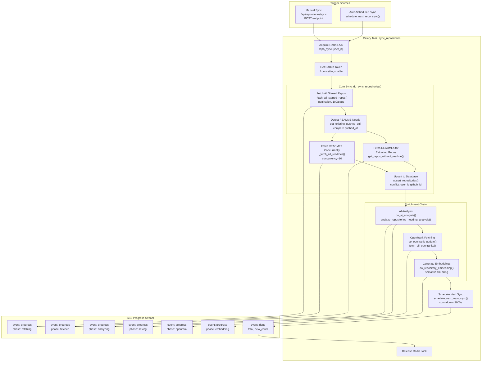
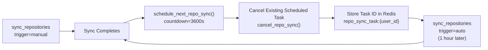
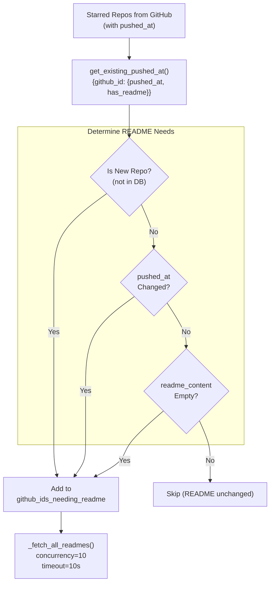
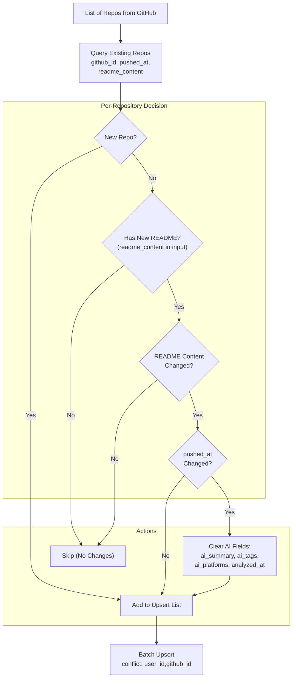
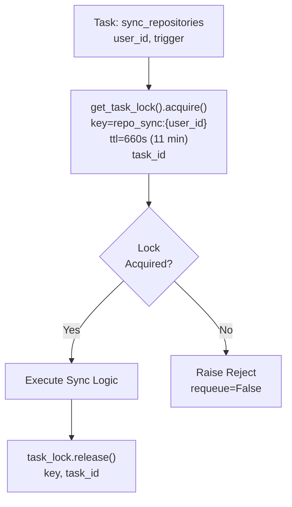
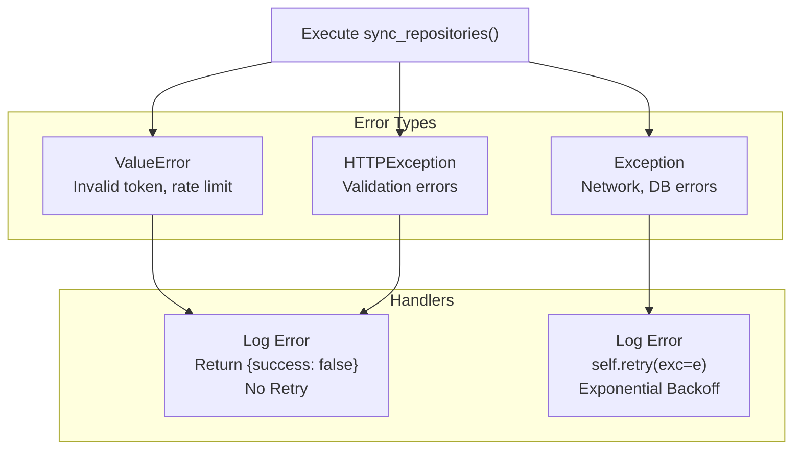
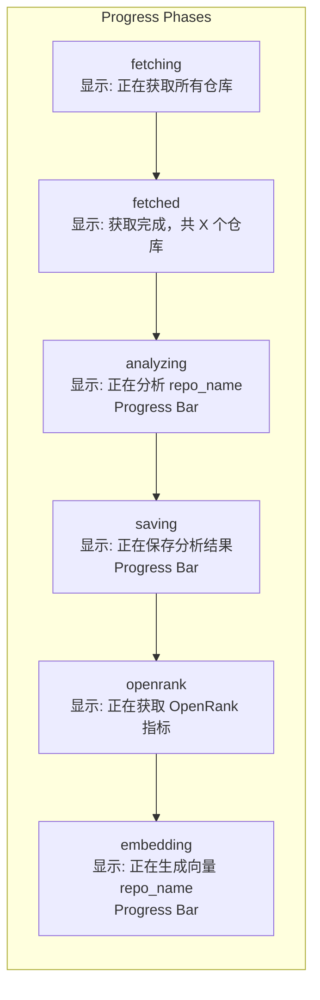

# Repository Synchronization

<details>
<summary>Relevant source files</summary>

The following files were used as context for generating this wiki page:

- [backend/app/api/routers/repositories.py](backend/app/api/routers/repositories.py)
- [backend/app/celery_app/repo_extractor.py](backend/app/celery_app/repo_extractor.py)
- [backend/app/celery_app/repository_tasks.py](backend/app/celery_app/repository_tasks.py)
- [backend/app/schemas/repositories.py](backend/app/schemas/repositories.py)
- [backend/app/services/db/article_repositories.py](backend/app/services/db/article_repositories.py)
- [backend/app/services/db/repositories.py](backend/app/services/db/repositories.py)
- [backend/app/services/github_extractor.py](backend/app/services/github_extractor.py)
- [backend/app/services/openrank_service.py](backend/app/services/openrank_service.py)
- [backend/app/services/repository_analyzer.py](backend/app/services/repository_analyzer.py)
- [backend/scripts/026_create_article_repositories.sql](backend/scripts/026_create_article_repositories.sql)
- [backend/scripts/027_add_repository_source_flags.sql](backend/scripts/027_add_repository_source_flags.sql)
- [backend/scripts/028_add_repos_extracted_status.sql](backend/scripts/028_add_repos_extracted_status.sql)
- [backend/scripts/030_add_repository_openrank.sql](backend/scripts/030_add_repository_openrank.sql)
- [frontend/components/repository/repository-card.tsx](frontend/components/repository/repository-card.tsx)
- [frontend/components/repository/repository-page.tsx](frontend/components/repository/repository-page.tsx)
- [frontend/lib/api/repositories.ts](frontend/lib/api/repositories.ts)
- [frontend/lib/store/repositories.slice.ts](frontend/lib/store/repositories.slice.ts)
- [frontend/lib/types.ts](frontend/lib/types.ts)

</details>


## Purpose and Scope

This document describes the GitHub repository synchronization system that fetches, analyzes, and maintains a user's starred repositories. The sync process runs as a background Celery task and includes README fetching, AI-powered analysis, OpenRank metrics, and embedding generation. This page covers the complete workflow from triggering a sync to the final enriched repository data.

For API endpoint implementation details, see [Repository Management](#5.3). For the separate process of extracting repositories from article content, see [Repository Extraction Pipeline](#6.5). For AI analysis service implementation, see [Repository Analysis](#8.3).

---

## Sync Workflow Overview

Repository synchronization follows a multi-stage pipeline that fetches repositories from GitHub, enriches them with metadata, and stores them in the database. The workflow consists of:

1. **Trigger**: Manual sync via API or auto-scheduled task
2. **Fetch Phase**: Retrieve starred repositories from GitHub API with pagination
3. **README Phase**: Fetch README content for new or updated repositories
4. **Upsert Phase**: Save or update repositories in database with change detection
5. **Enrichment Chain**: Sequential AI analysis → OpenRank fetching → Embedding generation
6. **Scheduling**: Schedule next auto-sync in 1 hour



**Sources:** [backend/app/celery_app/repository_tasks.py:496-637](), [backend/app/api/routers/repositories.py:48-301]()

---

## Trigger Mechanisms

### Manual Sync via API

Users trigger manual syncs through the `/api/repositories/sync` endpoint which immediately spawns the Celery task and returns an SSE stream for progress updates.

**Endpoint:** `POST /api/repositories/sync`

**Flow:**
1. Validate GitHub token exists in settings
2. Create async queue for progress updates
3. Spawn `sync_task()` coroutine
4. Return `StreamingResponse` with SSE events
5. Task publishes progress to queue, API streams to client

**Sources:** [backend/app/api/routers/repositories.py:48-301]()

### Auto-Scheduled Sync

After each sync completes (manual or auto), the system schedules the next sync to run in 1 hour. This creates a continuous sync loop that keeps repositories up-to-date.

**Scheduling Function:** `schedule_next_repo_sync(user_id)`



**Key Logic:**
- Before scheduling new sync, cancel any existing scheduled task via `app.control.revoke()`
- Store new task ID in Redis with key `repo_sync_task:{user_id}`
- TTL = 3900s (1 hour + 5 min buffer)
- Manual sync resets the timer, preventing duplicate syncs

**Sources:** [backend/app/celery_app/repository_tasks.py:643-703]()

---

## Core Sync Process

### Fetching Starred Repositories

The `_fetch_all_starred_repos()` function retrieves all starred repositories using GitHub's paginated API.

**API Details:**
- Endpoint: `https://api.github.com/user/starred`
- Pagination: 100 repos per page
- Sort: `updated` (most recently updated first)
- Accept header: `application/vnd.github.star+json` (includes `starred_at` timestamp)

**Rate Limiting:**
- 0.1s delay between pages
- Respects GitHub rate limits (401/403 errors)
- Timeout: 30s per request

**Sources:** [backend/app/celery_app/repository_tasks.py:397-440]()

### Change Detection and README Fetching

To minimize GitHub API calls and processing overhead, the system intelligently detects which repositories need README re-fetching:



**README Fetch Logic:**

1. **New Repositories:** Always fetch README
2. **Code Updates:** Fetch if `pushed_at` changed (indicates new commits)
3. **Missing Content:** Fetch if `readme_content` is empty (previous fetch may have failed)
4. **Unchanged:** Skip to save API calls

**Concurrency Control:**
- Semaphore limits concurrent requests to 10
- 50ms delay between requests to avoid rate limiting
- Individual failures don't block entire batch

**Sources:** [backend/app/celery_app/repository_tasks.py:35-136](), [backend/app/celery_app/repository_tasks.py:466-490]()

### Extracted Repository README Fetching

In addition to starred repositories, the sync also fetches READMEs for repositories that were extracted from article content but don't yet have README data.

**Logic:**
1. Get all repositories with empty `readme_content`
2. Exclude repositories that are in the current starred set (to avoid duplicates)
3. Fetch READMEs for remaining extracted repos
4. Update only the `readme_content` field via `update_readme_content()`

**Sources:** [backend/app/celery_app/repository_tasks.py:94-127]()

---

## Database Upsert Logic

The `upsert_repositories()` method implements intelligent merge logic that minimizes database writes and preserves AI analysis data.

### Upsert Strategy



**Key Behaviors:**

1. **New Repositories:** Always inserted with `is_starred=TRUE`
2. **README-Only Changes:** Update if new README differs from existing
3. **Code Updates (pushed_at change):** Clear AI analysis fields to trigger re-analysis
4. **No Changes:** Skip upsert to reduce database writes
5. **Conflict Resolution:** `on_conflict="user_id,github_id"` ensures uniqueness per user

**AI Field Clearing:**

When `pushed_at` changes (code update), these fields are reset to NULL:
- `ai_summary`
- `ai_tags`
- `ai_platforms`
- `analyzed_at`
- `analysis_failed`

This ensures the AI re-analyzes the repository with updated code context.

**Sources:** [backend/app/services/db/repositories.py:72-200]()

---

## Post-Sync Enrichment Pipeline

After syncing and upserting repositories, the system runs three sequential enrichment phases:

### 1. AI Analysis Phase

Analyzes repositories needing AI-generated summaries, tags, and platform detection.

**Process:**
1. Query repositories with `ai_summary IS NULL OR ai_tags IS NULL OR analysis_failed=TRUE`
2. Get user's active chat API config
3. Batch analyze with concurrency=5 via `RepositoryAnalyzerService`
4. Save results with `update_ai_analysis()` or `mark_analysis_failed()`

**Progress Events:**
- `phase: "analyzing"` with current repo name and completion count
- `phase: "saving"` with saved count

**Sources:** [backend/app/celery_app/repository_tasks.py:138-164](), [backend/app/services/repository_analyzer.py:19-104](), [backend/app/api/routers/repositories.py:166-197]()

### 2. OpenRank Fetching Phase

Fetches OpenRank influence metrics for all user repositories.

**API:** `https://oss.open-digger.cn/github/{owner}/{repo}/openrank.json`

**Process:**
1. Get all repositories via `get_all_repos_for_openrank()`
2. Fetch OpenRank values with concurrency=5
3. Extract latest quarter's value from response JSON
4. Batch update via `batch_update_openrank()`

**Progress Event:** `phase: "openrank"`

**Error Handling:** Silently continues on failure (metrics are non-critical)

**Sources:** [backend/app/celery_app/repository_tasks.py:167-203](), [backend/app/services/openrank_service.py:1-96](), [backend/app/api/routers/repositories.py:198-214]()

### 3. Embedding Generation Phase

Generates vector embeddings for semantic search across repository content.

**Process:**
1. Query repositories with `embedding_processed IS NULL AND readme_content IS NOT NULL`
2. Get user's embedding API config
3. For each repository:
   - Build full text from name, description, tags, README, AI summary
   - Semantic chunking with fallback to character-based
   - Generate embeddings via `embed_texts()`
   - Save to `all_embeddings` table with `repository_id`
4. Mark `embedding_processed=TRUE`

**Progress Event:** `phase: "embedding"` with current repo name and completion count

**Text Construction:**

The `_build_repository_text()` function combines multiple fields:
```
仓库名称: {full_name}
描述: {description}
链接: {html_url}
所有者: {owner_login}
标签: {topics}
AI标签: {ai_tags}
主要语言: {language}

README内容:
{readme_content}

AI摘要:
{ai_summary}
```

**Sources:** [backend/app/celery_app/repository_tasks.py:205-395](), [backend/app/api/routers/repositories.py:216-251]()

---

## SSE Progress Streaming

The manual sync API uses Server-Sent Events (SSE) to stream real-time progress updates to the frontend.

### SSE Event Format

```mermaid
graph LR
    subgraph "Backend: sync_task()"
        Task["Async Sync Task"]
        Queue["asyncio.Queue<br/>progress_queue"]
    end
    
    subgraph "Backend: generate_events()"
        Generator["SSE Generator"]
        Format["Format Events:<br/>event: {type}<br/>data: {json}"]
    end
    
    subgraph "Frontend: syncWithProgress()"
        ReadStream["response.body.getReader()"]
        Parse["Parse SSE Lines"]
        Callback["onProgress(data)"]
    end
    
    Task -->|put()| Queue
    Queue -->|get()| Generator
    Generator --> Format
    Format --> ReadStream
    ReadStream --> Parse
    Parse --> Callback
```

**Event Types:**

| Event | Phase | Data Fields |
|-------|-------|-------------|
| `progress` | `fetching` | None (initial fetch started) |
| `progress` | `fetched` | `total`, `needsReadme` |
| `progress` | `analyzing` | `current`, `completed`, `total` |
| `progress` | `saving` | `savedCount`, `saveTotal` |
| `progress` | `openrank` | None (OpenRank fetch started) |
| `progress` | `embedding` | `current`, `completed`, `total` |
| `done` | - | `total`, `new_count`, `updated_count` |
| `error` | - | `message` |

**Stream Lifecycle:**

1. **Start:** Create `asyncio.Queue` for progress communication
2. **Spawn:** Launch `sync_task()` as async task
3. **Stream:** `generate_events()` yields SSE-formatted strings
4. **Progress:** Task pushes updates via `await progress_queue.put()`
5. **End:** Task pushes `None` as sentinel, generator breaks
6. **Headers:** `Cache-Control: no-cache`, `Connection: keep-alive`, `X-Accel-Buffering: no`

**Sources:** [backend/app/api/routers/repositories.py:48-301](), [frontend/lib/api/repositories.ts:36-98]()

### Frontend SSE Handling

The `syncWithProgress()` client function consumes the SSE stream:

```typescript
const response = await fetchWithAuth(`${API_BASE}/api/repositories/sync`, {
  method: "POST",
})

const reader = response.body?.getReader()
const decoder = new TextDecoder()
let buffer = ""
let currentEvent = ""

while (true) {
  const { done, value } = await reader.read()
  if (done) break
  
  buffer += decoder.decode(value, { stream: true })
  const lines = buffer.split("\n")
  buffer = lines.pop() || ""
  
  for (const line of lines) {
    if (line.startsWith("event: ")) {
      currentEvent = line.slice(7).trim()
    } else if (line.startsWith("data: ")) {
      const data = JSON.parse(line.slice(6))
      
      if (currentEvent === "progress") {
        onProgress(data as SyncProgressEvent)
      } else if (currentEvent === "done") {
        result = { total: data.total, newCount: data.new_count, ... }
      } else if (currentEvent === "error") {
        throw new Error(data.message)
      }
    }
  }
}
```

**Sources:** [frontend/lib/api/repositories.ts:39-98]()

---

## Locking and Idempotency

Repository sync uses Redis-based distributed locking to prevent concurrent execution for the same user.

### Lock Acquisition



**Lock Parameters:**

- **Key:** `repo_sync:{user_id}` (per-user locking)
- **TTL:** 660 seconds (11 minutes) - exceeds task timeout of 10 minutes
- **Value:** Celery task ID (for verification on release)
- **Behavior:** If lock exists, reject task without retry

**Purpose:**
- Prevent duplicate syncs when user clicks "Sync" rapidly
- Prevent auto-sync from running while manual sync is in progress
- Ensure only one sync per user at a time

**Sources:** [backend/app/celery_app/repository_tasks.py:519-536]()

### Task ID Storage for Cancellation

Scheduled auto-sync tasks store their Celery task IDs in Redis for later cancellation:

**Key:** `repo_sync_task:{user_id}`
**Value:** Celery task ID
**TTL:** 3900s (1 hour + 5 min buffer)

When `schedule_next_repo_sync()` is called:
1. Cancel existing scheduled task via `cancel_repo_sync()`
2. Revoke task using `app.control.revoke(task_id)`
3. Delete Redis key
4. Schedule new task
5. Store new task ID

**Sources:** [backend/app/celery_app/repository_tasks.py:643-703]()

---

## Error Handling and Retry Logic

The `sync_repositories` Celery task implements comprehensive error handling with selective retry behavior.

### Task Configuration

```python
@app.task(
    bind=True,
    name="sync_repositories",
    max_retries=2,
    default_retry_delay=30,
    retry_backoff=True,
    retry_backoff_max=300,
    acks_late=True,
    time_limit=600,      # Hard timeout 10 minutes
    soft_time_limit=540,  # Soft timeout 9 minutes
)
```

**Timeouts:**
- **Soft:** 540s (9 minutes) - allows graceful cleanup
- **Hard:** 600s (10 minutes) - kills task if still running
- **Reason:** README fetching can be slow for many repos

**Sources:** [backend/app/celery_app/repository_tasks.py:496-506]()

### Error Categories



**Non-Retryable Errors:**

1. **Invalid GitHub Token:** `ValueError("Invalid GitHub token")`
   - User must fix token in settings
   - Retry would fail again

2. **Rate Limit Exceeded:** `ValueError("GitHub API rate limit exceeded")`
   - User must wait for rate limit reset
   - Retry within task would still hit limit

3. **Missing Configuration:** No GitHub token in settings
   - Returns `{success: false, error: "GitHub token not configured"}`

**Retryable Errors:**

1. **Network Errors:** httpx connection failures
2. **Database Errors:** Temporary Supabase issues
3. **Unexpected Exceptions:** Unknown errors

**Retry Behavior:**
- Max retries: 2
- Initial delay: 30s
- Backoff: True (exponential: 30s, 60s)
- Max delay: 300s (5 minutes)

**Sources:** [backend/app/celery_app/repository_tasks.py:612-634]()

---

## Frontend Integration

### Repository Store Slice

The Zustand store manages repository state and sync operations:

```typescript
export interface RepositoriesSlice {
  repositories: Repository[]
  isSyncing: boolean
  isAnalyzing: boolean
  syncProgress: SyncProgress | null
  lastSyncedAt: string | null
  
  loadRepositories: () => Promise<void>
  syncRepositories: () => Promise<SyncResult>
  setSyncProgress: (progress: SyncProgress | null) => void
}
```

**Sync Flow:**
1. Set `isSyncing=true`, `syncProgress=null`
2. Call `repositoriesApi.syncWithProgress()` with progress callback
3. Update `syncProgress` state as events arrive
4. On completion, reload repositories and set `lastSyncedAt`
5. Reset `isSyncing=false`, `syncProgress=null`

**Sources:** [frontend/lib/store/repositories.slice.ts:1-107]()

### Progress UI Display

The `RepositoryPage` component renders a progress bar during sync:



**Progress Bar Calculation:**

For `analyzing` phase:
```typescript
width = (completed / total) * 95%  // Reserve 5% for saving
```

For `saving` phase:
```typescript
width = 95% + (savedCount / saveTotal) * 5%
```

For `embedding` phase:
```typescript
width = (completed / total) * 100%
```

**Sources:** [frontend/components/repository/repository-page.tsx:317-384]()

---

## Database Schema

### repositories Table

The `repositories` table stores synced and extracted repository data:

| Column | Type | Purpose |
|--------|------|---------|
| `id` | UUID | Primary key |
| `user_id` | UUID | Foreign key to auth.users |
| `github_id` | INTEGER | GitHub's numeric repo ID |
| `full_name` | TEXT | "owner/repo" format |
| `name` | TEXT | Repository name |
| `description` | TEXT | Original GitHub description |
| `html_url` | TEXT | GitHub repository URL |
| `stargazers_count` | INTEGER | Star count |
| `language` | TEXT | Primary language |
| `topics` | TEXT[] | GitHub topics array |
| `owner_login` | TEXT | Owner username |
| `owner_avatar_url` | TEXT | Owner avatar URL |
| `starred_at` | TIMESTAMPTZ | When user starred (if starred) |
| `github_created_at` | TIMESTAMPTZ | Repo creation date |
| `github_updated_at` | TIMESTAMPTZ | Last update on GitHub |
| `github_pushed_at` | TIMESTAMPTZ | Last push to default branch |
| `readme_content` | TEXT | Raw README markdown |
| `ai_summary` | TEXT | AI-generated summary |
| `ai_tags` | TEXT[] | AI-extracted tags |
| `ai_platforms` | TEXT[] | Detected platforms |
| `analyzed_at` | TIMESTAMPTZ | Last AI analysis time |
| `analysis_failed` | BOOLEAN | TRUE if analysis failed |
| `embedding_processed` | BOOLEAN | TRUE if embeddings generated |
| `openrank` | FLOAT | OpenRank influence score |
| `is_starred` | BOOLEAN | TRUE if from starred sync |
| `is_extracted` | BOOLEAN | TRUE if from article extraction |
| `custom_description` | TEXT | User-edited description |
| `custom_tags` | TEXT[] | User-added tags |
| `custom_category` | TEXT | User-assigned category |
| `last_edited` | TIMESTAMPTZ | Last user edit time |

**Unique Constraint:** `(user_id, github_id)` - one repo per user per GitHub ID

**Sources:** [backend/services/db/repositories.py:485-520]()

---

## Performance Considerations

### Concurrency Limits

The sync process uses controlled concurrency to balance speed and API rate limits:

| Operation | Concurrency | Delay | Reasoning |
|-----------|-------------|-------|-----------|
| Starred fetch | Serial | 0.1s between pages | GitHub rate limit |
| README fetch | 10 concurrent | 50ms between | Avoid overwhelming GitHub |
| AI analysis | 5 concurrent | None | API cost control |
| OpenRank fetch | 5 concurrent | 50ms between | API stability |
| Embedding generation | Serial | None | Memory management |

**Sources:** [backend/app/celery_app/repository_tasks.py:90-92](), [backend/app/api/routers/repositories.py:149]()

### Change Detection Optimization

The system minimizes work by detecting actual changes:

**README Fetch Optimization:**
- Only fetches README for new repos or code updates (`pushed_at` change)
- Saves ~80% of README API calls for typical syncs
- Fetches separately for extracted repos to avoid duplicates

**Database Write Optimization:**
- Skips upsert if README content unchanged
- Typical sync: 100 starred repos → only 2-3 database writes
- Reduces database load and contention

**AI Analysis Optimization:**
- Only analyzes repos with missing or failed analysis
- Clears AI fields only when code changes (`pushed_at`)
- Preserves existing analysis for unchanged repos

**Sources:** [backend/app/celery_app/repository_tasks.py:59-82](), [backend/app/services/db/repositories.py:108-135]()

---

## Summary

The repository synchronization system provides a robust, scalable solution for keeping user repositories up-to-date with intelligent optimizations:

1. **Smart Change Detection:** Only fetches READMEs and re-analyzes when needed
2. **Multi-Stage Enrichment:** Sequential AI analysis, OpenRank, and embeddings
3. **Real-Time Feedback:** SSE progress streaming for user visibility
4. **Auto-Scheduling:** 1-hour sync interval with manual override
5. **Distributed Locking:** Prevents duplicate syncs across workers
6. **Error Resilience:** Selective retry with appropriate backoff
7. **Concurrency Control:** Balanced throughput without overwhelming APIs

**Key Code Entities:**
- Task: `sync_repositories` ([backend/app/celery_app/repository_tasks.py:496-637]())
- Core Logic: `do_sync_repositories()` ([backend/app/celery_app/repository_tasks.py:35-136]())
- API Endpoint: `POST /api/repositories/sync` ([backend/app/api/routers/repositories.py:48-301]())
- Database Service: `RepositoryService` ([backend/app/services/db/repositories.py:14-564]())
- Scheduling: `schedule_next_repo_sync()` ([backend/app/celery_app/repository_tasks.py:643-675]())