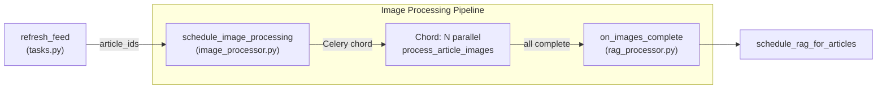
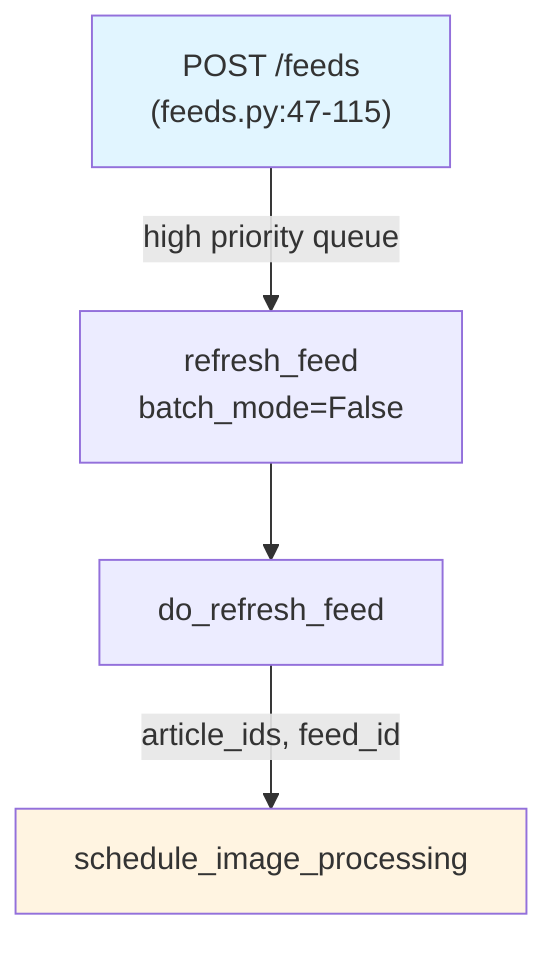
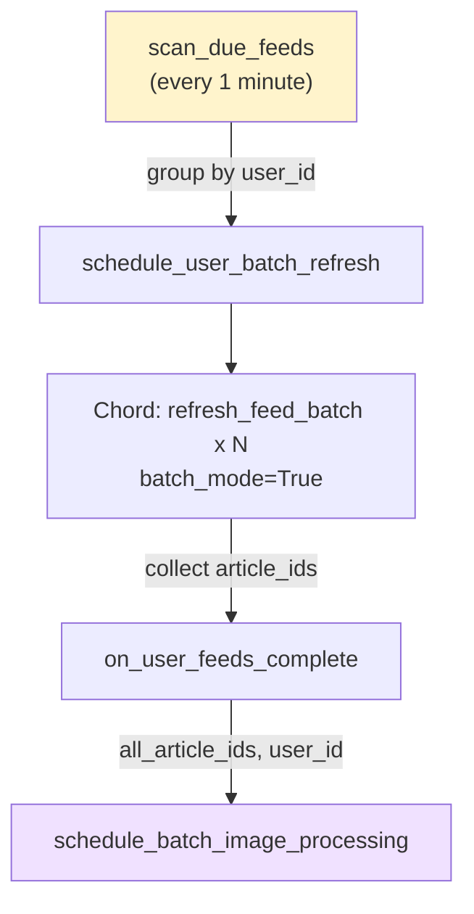
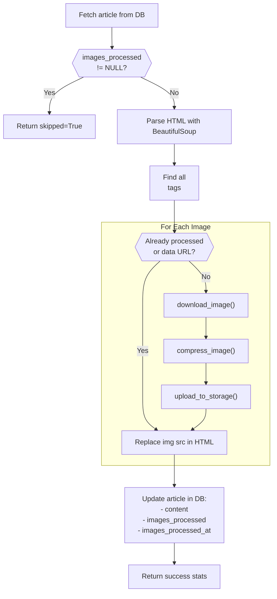
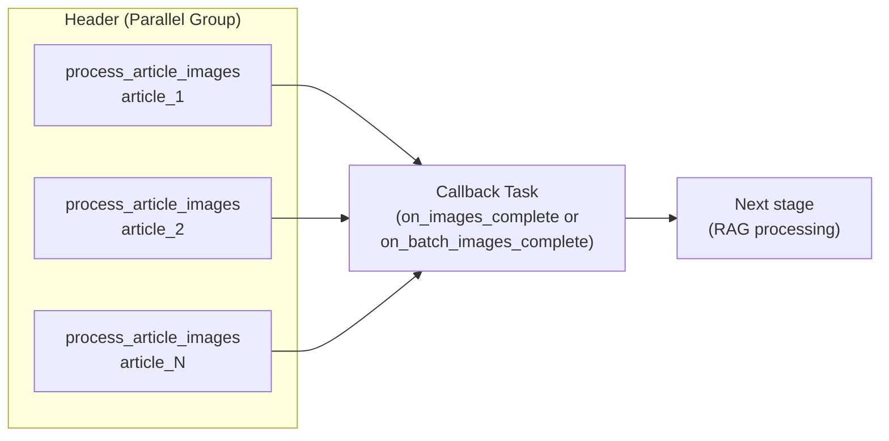

# Image Processing Pipeline

<details>
<summary>Relevant source files</summary>

The following files were used as context for generating this wiki page:

- [backend/app/api/routers/feeds.py](backend/app/api/routers/feeds.py)
- [backend/app/celery_app/CLAUDE.md](backend/app/celery_app/CLAUDE.md)
- [backend/app/celery_app/celery.py](backend/app/celery_app/celery.py)
- [backend/app/celery_app/image_processor.py](backend/app/celery_app/image_processor.py)
- [backend/app/celery_app/tasks.py](backend/app/celery_app/tasks.py)
- [backend/app/services/db/rag.py](backend/app/services/db/rag.py)
- [backend/app/services/rag/retriever.py](backend/app/services/rag/retriever.py)
- [backend/scripts/029_rename_article_embeddings_to_all_embeddings.sql](backend/scripts/029_rename_article_embeddings_to_all_embeddings.sql)
- [backend/scripts/031_add_repository_embeddings.sql](backend/scripts/031_add_repository_embeddings.sql)
- [backend/scripts/032_fix_all_embeddings_article_id_nullable.sql](backend/scripts/032_fix_all_embeddings_article_id_nullable.sql)
- [docs/RSS_subscribe/RSS_FLOW_COMPLETE.md](docs/RSS_subscribe/RSS_FLOW_COMPLETE.md)
- [frontend/components/add-feed-dialog.tsx](frontend/components/add-feed-dialog.tsx)

</details>


## Purpose and Scope

This document covers the image processing subsystem within SaveHub's background task infrastructure. Image processing occurs after RSS articles are saved to the database but before RAG/embedding generation. The pipeline downloads external images from article HTML content, compresses them to WebP format, uploads them to Supabase Storage, and updates article content with new URLs.

For the overall RSS feed refresh workflow that triggers image processing, see [RSS Feed Processing](#6.1). For the RAG processing that occurs after image processing completes, see [RAG Processing Pipeline](#6.4).

**Sources:** [backend/app/celery_app/image_processor.py:1-10](), [backend/app/celery_app/CLAUDE.md:1-150]()

---

## System Architecture Overview

### Image Processing Position in Task Chain



Image processing sits between article ingestion and semantic indexing. It ensures all external images are downloaded, optimized, and stored locally before generating embeddings, which may include image captions from Vision AI.

**Sources:** [backend/app/celery_app/tasks.py:196-216](), [backend/app/celery_app/image_processor.py:436-483]()

---

## Execution Modes

### Mode 1: Single Feed Chain (User-Initiated)

When a user manually adds a feed via `POST /feeds`, image processing is scheduled immediately after the feed refresh completes:



| Characteristic | Value |
|----------------|-------|
| Trigger | `POST /feeds` endpoint |
| Queue Priority | `high` |
| Scheduling Function | `schedule_image_processing.delay(article_ids, feed_id)` |
| Callback Includes | `feed_id` for traceability |

**Sources:** [backend/app/celery_app/tasks.py:196-216](), [backend/app/api/routers/feeds.py:74-107]()

### Mode 2: Batch Processing (Scheduled)

Celery Beat scans for due feeds every minute. Multiple feeds are refreshed in parallel, then **all** image processing happens together:



| Characteristic | Value |
|----------------|-------|
| Trigger | `scan_due_feeds` Beat task |
| Queue Priority | `default` |
| Scheduling Function | `schedule_batch_image_processing.delay(all_article_ids, user_id)` |
| Callback Includes | `user_id` instead of `feed_id` |

The key difference: Mode 2 waits for **all feeds** to complete before starting **any** image processing, enabling global resource management.

**Sources:** [backend/app/celery_app/tasks.py:828-918](), [backend/app/celery_app/image_processor.py:489-579](), [backend/app/celery_app/CLAUDE.md:36-74]()

---

## File Organization

### Core Files

| File | Responsibility | Key Exports |
|------|---------------|-------------|
| `image_processor.py` | Main task implementation | `process_article_images`, `schedule_image_processing`, `schedule_batch_image_processing` |
| `tasks.py` | Feed refresh orchestration | Triggers image scheduling after `do_refresh_feed` |
| `supabase_client.py` | Supabase service role client | `get_supabase_service()` for storage access |
| `image_compressor.py` | Image optimization logic | `compress_image()`, `get_image_extension()` |

**Sources:** [backend/app/celery_app/image_processor.py:1-24](), [backend/app/celery_app/tasks.py:1-24]()

### Task Routing Configuration

[backend/app/celery_app/celery.py:74-96]() configures task routing:

```python
task_routes={
    "process_article_images": {"queue": "default"},
    "schedule_image_processing": {"queue": "default"},
    "schedule_batch_image_processing": {"queue": "default"},
    "on_batch_images_complete": {"queue": "default"},
}
```

All image tasks use the `default` queue with concurrency controlled by worker configuration.

**Sources:** [backend/app/celery_app/celery.py:74-96]()

---

## Core Processing Workflow

### Single Article Processing: `do_process_article_images`



**Sources:** [backend/app/celery_app/image_processor.py:258-324]()

### Image Download with SSRF Protection

[backend/app/celery_app/image_processor.py:71-140]() implements `download_image()`:

```python
def download_image(url: str) -> Tuple[bytes, str]:
    """Download with SSRF protection."""
    # 1. Validate URL scheme (http/https only)
    # 2. Check if hostname resolves to private IP
    # 3. Download with timeout and size limits
    # 4. Validate content type
```

| Protection Mechanism | Implementation |
|---------------------|----------------|
| Private IP blocking | `is_private_ip()` checks if hostname resolves to private/loopback/reserved IPs |
| Scheme validation | Only `http` and `https` allowed |
| Size limit | 10MB maximum (`MAX_IMAGE_SIZE`) |
| Timeout | 15 seconds (`DOWNLOAD_TIMEOUT`) |
| Content type validation | Must be in `ALLOWED_CONTENT_TYPES` set |

**Sources:** [backend/app/celery_app/image_processor.py:61-140](), [backend/app/celery_app/image_processor.py:29-35]()

### Image Compression

Compression logic delegates to `app.services.image_compressor`:

```python
compressed, ext = compress_image(image_bytes)
# Returns: (compressed_bytes, extension)
# - Converts to WebP format
# - Resizes to max 1080px
# - Quality setting: 70
```

If compression fails, the original image is used with its original extension.

**Sources:** [backend/app/celery_app/image_processor.py:231-238]()

### Upload to Supabase Storage

[backend/app/celery_app/image_processor.py:142-192]() implements `upload_to_storage()`:

**Storage Path Pattern:**
```
article-images/{user_id}/{article_id}/{hash}.webp
```

| Component | Description |
|-----------|-------------|
| Bucket | `article-images` (constant `BUCKET_NAME`) |
| `user_id` | User UUID for isolation |
| `article_id` | Article UUID for grouping |
| `hash` | First 12 characters of MD5 hash (deduplication) |
| Extension | `.webp` or original format if compression failed |

The upload uses `upsert=true` to handle re-processing scenarios.

**Sources:** [backend/app/celery_app/image_processor.py:142-192]()

---

## Celery Chord Parallel Execution

### Chord Pattern Overview

Both execution modes use Celery's **chord** primitive for parallel execution with a callback:



A **chord** waits for all header tasks to complete before executing the callback, even if some header tasks fail.

**Sources:** [backend/app/celery_app/image_processor.py:436-483]()

### Single Feed Chord: `schedule_image_processing`

[backend/app/celery_app/image_processor.py:436-483]():

```python
@app.task(name="schedule_image_processing")
def schedule_image_processing(article_ids: List[str], feed_id: str = None):
    from celery import chord, group
    from .rag_processor import on_images_complete
    
    image_tasks = group(
        process_article_images.s(article_id=aid)
        for aid in article_ids
    )
    
    callback = on_images_complete.s(article_ids=article_ids, feed_id=feed_id)
    workflow = chord(image_tasks)(callback)
    
    return {"scheduled": len(article_ids), "chord_id": workflow.id}
```

| Parameter | Purpose |
|-----------|---------|
| `article_ids` | List of article UUIDs to process |
| `feed_id` | Feed UUID for logging/traceability |
| Returns | Dict with `scheduled` count and `chord_id` |

**Sources:** [backend/app/celery_app/image_processor.py:436-483]()

### Batch Mode Chord: `schedule_batch_image_processing`

[backend/app/celery_app/image_processor.py:489-539]():

```python
@app.task(name="schedule_batch_image_processing")
def schedule_batch_image_processing(article_ids: List[str], user_id: str):
    from celery import chord, group
    
    image_tasks = group(
        process_article_images.s(article_id=aid)
        for aid in article_ids
    )
    
    callback = on_batch_images_complete.s(article_ids=article_ids, user_id=user_id)
    workflow = chord(image_tasks)(callback)
    
    return {"scheduled": len(article_ids), "chord_id": workflow.id, "user_id": user_id}
```

Differences from single feed mode:
- Callback is `on_batch_images_complete` instead of `on_images_complete`
- Passes `user_id` instead of `feed_id`
- Aggregates articles across multiple feeds

**Sources:** [backend/app/celery_app/image_processor.py:489-539]()

---

## Task Definition: `process_article_images`

### Task Configuration

[backend/app/celery_app/image_processor.py:330-342]():

```python
@app.task(
    bind=True,
    name="process_article_images",
    max_retries=2,
    default_retry_delay=30,
    retry_backoff=True,
    retry_backoff_max=120,
    time_limit=180,       # Hard timeout 3 minutes
    soft_time_limit=150,  # Soft timeout 2.5 minutes
)
def process_article_images(self, article_id: str):
    """Process images in a single article."""
```

| Setting | Value | Purpose |
|---------|-------|---------|
| `max_retries` | 2 | Maximum retry attempts on failure |
| `default_retry_delay` | 30s | Initial delay between retries |
| `retry_backoff` | True | Exponential backoff enabled |
| `retry_backoff_max` | 120s | Maximum backoff delay |
| `time_limit` | 180s | Hard kill after 3 minutes |
| `soft_time_limit` | 150s | Soft warning at 2.5 minutes |

**Sources:** [backend/app/celery_app/image_processor.py:330-342]()

### Return Value Contract

The task **always returns a dict**, never raises exceptions to the chord coordinator:

```python
# Success case
{
    "success": True,
    "article_id": "...",
    "processed": 3,
    "total": 5,
    "duration_ms": 1234
}

# Failure case
{
    "success": False,
    "article_id": "...",
    "error": "Connection error: ...",
    "duration_ms": 456
}
```

This ensures the chord callback always executes, even if individual tasks fail.

**Sources:** [backend/app/celery_app/image_processor.py:387-429]()

---

## Callback Chain to RAG Processing

### Single Feed Callback: `on_images_complete`

Defined in [backend/app/celery_app/rag_processor.py]() (imported by image_processor.py):

```python
@app.task(name="on_images_complete")
def on_images_complete(results, article_ids: List[str], feed_id: str):
    """Callback after all image processing completes."""
    # Count successes/failures
    success_count = sum(1 for r in results if r and r.get("success"))
    
    # Trigger RAG processing
    schedule_rag_for_articles(article_ids)
```

The callback receives:
- `results`: List of return values from all `process_article_images` tasks
- `article_ids`: Original list of article UUIDs
- `feed_id`: Feed identifier for logging

**Sources:** [backend/app/celery_app/image_processor.py:464-467](), [backend/app/celery_app/CLAUDE.md:29-33]()

### Batch Mode Callback: `on_batch_images_complete`

[backend/app/celery_app/image_processor.py:541-579]():

```python
@app.task(name="on_batch_images_complete", bind=True)
def on_batch_images_complete(self, image_results: List[dict], article_ids: List[str], user_id: str):
    """Callback after batch image processing completes."""
    success_count = sum(1 for r in image_results if r and r.get("success"))
    failed_count = len(image_results) - success_count
    
    # Reuse existing RAG scheduling task
    from .rag_processor import schedule_rag_for_articles
    rag_result = schedule_rag_for_articles(article_ids)
    
    return {
        "user_id": user_id,
        "image_success": success_count,
        "image_failed": failed_count,
        "rag_scheduled": rag_result.get("scheduled", 0)
    }
```

Key insight: Both modes converge on the same `schedule_rag_for_articles` function, maintaining consistency in downstream processing.

**Sources:** [backend/app/celery_app/image_processor.py:541-579]()

---

## Article Status Tracking

### Database Status Fields

Image processing updates three fields in the `articles` table:

| Field | Type | Values | Description |
|-------|------|--------|-------------|
| `images_processed` | BOOLEAN | `NULL`, `true`, `false` | Processing status |
| `images_processed_at` | TIMESTAMPTZ | - | Completion timestamp |
| `content` | TEXT | - | Updated HTML with new image URLs |

**Status Semantics:**

| Value | Meaning |
|-------|---------|
| `NULL` | Not yet processed |
| `true` | At least one image succeeded, or no images present |
| `false` | All images failed (total > 0, success == 0) |

**Sources:** [backend/app/celery_app/image_processor.py:304-318](), [docs/RSS_subscribe/RSS_FLOW_COMPLETE.md:736-748]()

### Status Update Logic

[backend/app/celery_app/image_processor.py:304-318]():

```python
# Determine status
if total_count == 0:
    images_processed = True  # No images to process
else:
    images_processed = success_count > 0  # At least one success

# Update article
supabase.table("articles").update({
    "content": new_content,
    "images_processed": images_processed,
    "images_processed_at": datetime.now(timezone.utc).isoformat(),
}).eq("id", article_id).execute()
```

This ensures articles with partial failures still proceed to RAG processing, as long as at least one image succeeded.

**Sources:** [backend/app/celery_app/image_processor.py:304-318]()

---

## Error Handling and Retry Logic

### Error Classification

[backend/app/celery_app/image_processor.py:42-54]():

```python
class RetryableImageError(ImageProcessingError):
    """Network issues, rate limits"""

class NonRetryableImageError(ImageProcessingError):
    """Invalid image, SSRF blocked, parse errors"""
```

| Error Type | Example Scenarios | Action |
|------------|-------------------|--------|
| `RetryableImageError` | HTTP 502/503/504, timeout, connection errors | Retry with exponential backoff |
| `NonRetryableImageError` | Private IP, invalid content type, image too large | Skip image, keep original URL |

**Sources:** [backend/app/celery_app/image_processor.py:42-54]()

### Per-Image Error Handling

[backend/app/celery_app/image_processor.py:248-254]():

```python
try:
    image_bytes, content_type = download_image(original_url)
    compressed, ext = compress_image(image_bytes)
    new_url = upload_to_storage(compressed, user_id, article_id, ext)
    img["src"] = new_url
    success += 1
except NonRetryableImageError as e:
    logger.warning(f"Skipping image: {e}")
    # Keep original URL in HTML
except RetryableImageError as e:
    logger.warning(f"Retryable error: {e}")
    # Keep original URL, don't propagate error
```

Individual image failures do **not** fail the entire task. The task processes as many images as possible.

**Sources:** [backend/app/celery_app/image_processor.py:226-254]()

### Task-Level Error Handling

[backend/app/celery_app/image_processor.py:393-429]():

```python
try:
    result = do_process_article_images(article_id)
    return {"success": True, **result}
    
except NonRetryableImageError as e:
    # Don't retry, return failure result
    return {"success": False, "error": str(e)}
    
except Exception as e:
    # Unexpected error: return failure, don't raise
    # This allows chord callback to execute
    return {"success": False, "error": str(e)}
```

The task **never raises exceptions** to ensure the chord callback always executes. This is critical for maintaining the processing chain.

**Sources:** [backend/app/celery_app/image_processor.py:393-429]()

---

## Skip Logic for Already-Processed Articles

### Protection Against Re-Processing

[backend/app/celery_app/image_processor.py:283-287]():

```python
# Skip if already processed
if article.get("images_processed") is not None:
    logger.info(f"Article {article_id} already processed, skipping")
    return {"success": True, "processed": 0, "total": 0, "skipped": True}
```

This prevents re-downloading and re-uploading images if:
1. The article was previously processed successfully (`images_processed=true`)
2. The article previously failed processing (`images_processed=false`)

**Rationale:** Preserves user-replaced content and storage resources.

**Sources:** [backend/app/celery_app/image_processor.py:283-287]()

### Integration with Feed Refresh

[backend/app/celery_app/tasks.py:126-159]() in `do_refresh_feed`:

```python
# Query existing articles to get their processing status
existing_articles = {}  # url -> {"id": ..., "images_processed": ...}

for article in existing_result.data:
    existing_articles[a["url"]] = {
        "id": a["id"],
        "images_processed": a.get("images_processed", False)
    }

# Skip successfully processed articles
for article in articles:
    existing = existing_articles.get(url)
    if existing and existing["images_processed"]:
        logger.debug(f"Skipping successfully processed article")
        continue
```

Successfully processed articles are excluded from the `articles_to_upsert` list, so they never enter the image processing pipeline again.

**Sources:** [backend/app/celery_app/tasks.py:110-159]()

---

## Integration with Supabase Storage

### Storage Bucket Configuration

The `article-images` bucket must be created via [backend/scripts/018_create_article_images_storage.sql]():

```sql
-- Create bucket for article images
INSERT INTO storage.buckets (id, name, public)
VALUES ('article-images', 'article-images', true)
ON CONFLICT (id) DO NOTHING;

-- Public access policy
CREATE POLICY "Public read access"
  ON storage.objects FOR SELECT
  USING (bucket_id = 'article-images');

-- Service role full access
CREATE POLICY "Service role full access"
  ON storage.objects FOR ALL
  USING (auth.role() = 'service_role');
```

| Setting | Value | Purpose |
|---------|-------|---------|
| Bucket ID | `article-images` | Matches `BUCKET_NAME` constant |
| Public | `true` | Allows direct image access via CDN URLs |
| RLS Policies | Public read, service role write | Secure upload, public access |

**Sources:** [backend/scripts/018_create_article_images_storage.sql](), [backend/app/celery_app/image_processor.py:35]()

### Public URL Generation

[backend/app/celery_app/image_processor.py:188-191]():

```python
# Get public URL
base_url = supabase.storage.from_(BUCKET_NAME).get_public_url(path)
return base_url
```

The returned URL format:
```
https://{project_ref}.supabase.co/storage/v1/object/public/article-images/{user_id}/{article_id}/{hash}.webp
```

These URLs are directly embedded in article HTML, served via Supabase's CDN.

**Sources:** [backend/app/celery_app/image_processor.py:188-191]()

---

## Constants and Configuration

### Key Constants

[backend/app/celery_app/image_processor.py:29-35]():

| Constant | Value | Purpose |
|----------|-------|---------|
| `MAX_IMAGE_SIZE` | 10 MB | Maximum allowed image file size |
| `DOWNLOAD_TIMEOUT` | 15 seconds | Network request timeout |
| `ALLOWED_CONTENT_TYPES` | Set of 7 types | Whitelist of acceptable image formats |
| `BUCKET_NAME` | `"article-images"` | Supabase Storage bucket identifier |

**Allowed Content Types:**
- `image/jpeg`
- `image/png`
- `image/gif`
- `image/webp`
- `image/svg+xml`
- `image/avif`
- `image/bmp`

**Sources:** [backend/app/celery_app/image_processor.py:29-35]()

---

## Testing and Observability

### Logging Statements

Key log points in [backend/app/celery_app/image_processor.py]():

| Line Range | Event | Log Level |
|------------|-------|-----------|
| 360-366 | Task start | INFO |
| 375-385 | Task completion | INFO |
| 454-477 | Chord creation | INFO |
| 246 | Individual image success | DEBUG |
| 249-253 | Image processing errors | WARNING |
| 395-429 | Task errors | ERROR/EXCEPTION |

**Debug Mode:** Look for `[CHORD_DEBUG]` and `[BATCH_IMAGE]` prefixes in logs to trace chord execution.

**Sources:** [backend/app/celery_app/image_processor.py:360-385](), [backend/app/celery_app/image_processor.py:454-477]()

### Monitoring Metrics

Key metrics to monitor:

| Metric | Source | Interpretation |
|--------|--------|----------------|
| `processed`/`total` ratio | Task return value | Image success rate per article |
| `success_count` in callbacks | Chord callback logs | Overall success rate for batch |
| `duration_ms` | Task return value | Processing time per article |
| `chord_id` | Chord creation logs | Track parallel execution groups |

**Sources:** [backend/app/celery_app/image_processor.py:387-392](), [backend/app/celery_app/image_processor.py:561-578]()