# RAG Processing Pipeline

<details>
<summary>Relevant source files</summary>

The following files were used as context for generating this wiki page:

- [backend/app/api/routers/rag.py](backend/app/api/routers/rag.py)
- [backend/app/celery_app/rag_processor.py](backend/app/celery_app/rag_processor.py)
- [backend/app/services/ai/CLAUDE.md](backend/app/services/ai/CLAUDE.md)
- [backend/app/services/ai/__init__.py](backend/app/services/ai/__init__.py)
- [backend/app/services/ai/clients.py](backend/app/services/ai/clients.py)
- [backend/app/services/ai/config.py](backend/app/services/ai/config.py)
- [backend/app/services/ai/repository_service.py](backend/app/services/ai/repository_service.py)
- [backend/app/services/db/rag.py](backend/app/services/db/rag.py)
- [backend/app/services/rag/CLAUDE.md](backend/app/services/rag/CLAUDE.md)
- [backend/app/services/rag/__init__.py](backend/app/services/rag/__init__.py)
- [backend/app/services/rag/chunker.py](backend/app/services/rag/chunker.py)
- [backend/app/services/rag/retriever.py](backend/app/services/rag/retriever.py)
- [backend/scripts/029_rename_article_embeddings_to_all_embeddings.sql](backend/scripts/029_rename_article_embeddings_to_all_embeddings.sql)
- [backend/scripts/031_add_repository_embeddings.sql](backend/scripts/031_add_repository_embeddings.sql)
- [backend/scripts/032_fix_all_embeddings_article_id_nullable.sql](backend/scripts/032_fix_all_embeddings_article_id_nullable.sql)
- [docs/RSS_subscribe/RSS_FLOW_COMPLETE.md](docs/RSS_subscribe/RSS_FLOW_COMPLETE.md)

</details>


**Purpose**: This document describes the RAG (Retrieval-Augmented Generation) processing pipeline that transforms article content into searchable vector embeddings. The pipeline parses HTML content, generates image captions using Vision AI, performs semantic chunking, and stores embeddings in the `all_embeddings` table for vector similarity search.

**Scope**: Covers the complete RAG processing workflow from trigger mechanisms through embedding storage. For vector search functionality, see [RAG & Search Services](#5.4). For AI configuration management, see [AI Configuration Management](#8.1). For the image processing that precedes RAG, see [Image Processing Pipeline](#6.3).

---

## Overview and Trigger Mechanism

The RAG processing pipeline is automatically triggered after image processing completes successfully. It transforms article content into vector embeddings that enable semantic search across the user's article collection.

### Trigger Flow Diagram

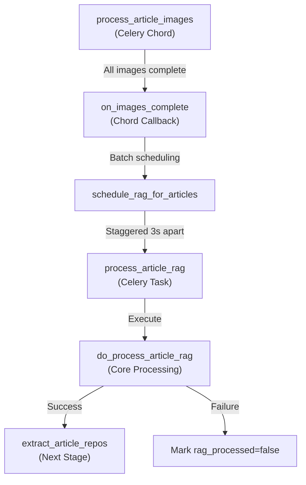

**Sources**: [backend/app/celery_app/rag_processor.py:423-474](), [backend/app/celery_app/rag_processor.py:476-519]()

### Task Configuration

| Parameter | Value | Purpose |
|-----------|-------|---------|
| Task Name | `process_article_rag` | Celery task identifier |
| Max Retries | 2 | Automatic retry attempts |
| Initial Retry Delay | 60s | Delay before first retry |
| Backoff Strategy | Exponential | Increases delay up to 300s max |
| Time Limit (hard) | 300s (5 min) | Hard timeout enforced by Celery |
| Time Limit (soft) | 270s (4.5 min) | Soft timeout for graceful shutdown |
| Queue | `default` | Priority queue assignment |

**Sources**: [backend/app/celery_app/rag_processor.py:295-307]()

---

## Core Processing Flow

The `do_process_article_rag` function implements the complete RAG processing logic, decoupled from Celery for testability.

### Processing Pipeline Diagram

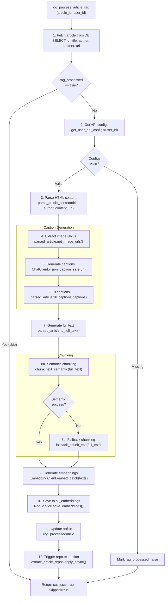

**Sources**: [backend/app/celery_app/rag_processor.py:87-267]()

### Return Value Structure

```python
{
    "success": bool,           # Overall success status
    "chunks": int,             # Number of chunks created
    "images_captioned": int,   # Number of images with captions
    "skipped": bool,           # (Optional) Already processed
    "error": str               # (Optional) Error message if failed
}
```

**Sources**: [backend/app/celery_app/rag_processor.py:249-266]()

---

## HTML Parsing and Content Extraction

The `parse_article_content` function transforms raw HTML into a structured representation that preserves the original order of text and image elements.

### Content Element Data Model

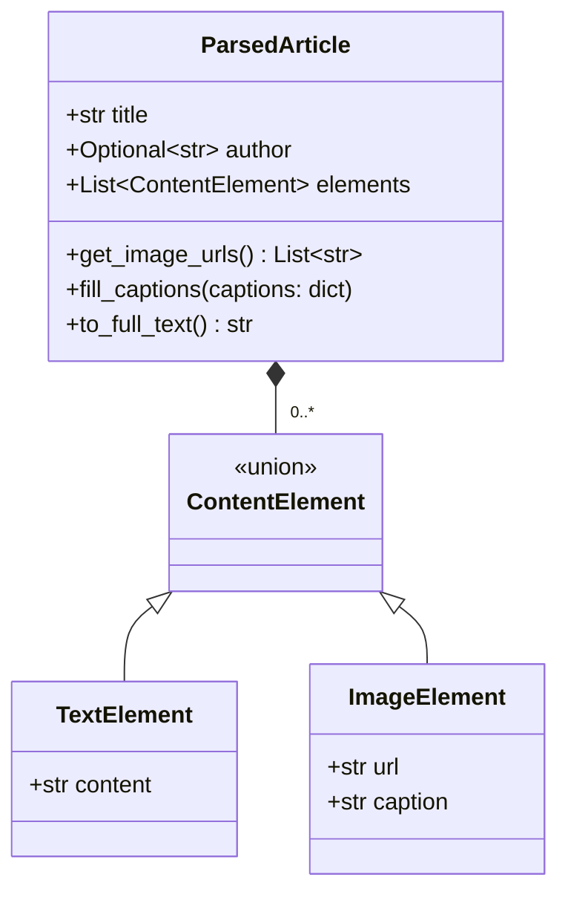

**Sources**: [backend/app/services/rag/chunker.py:23-93]()

### HTML Parsing Process

The parser walks the HTML DOM tree, extracting text and images while maintaining their relative positions:

| Element Type | Extraction Rule |
|--------------|-----------------|
| Text nodes | Accumulated until a block-level element or image is encountered |
| `` tags | Creates `ImageElement` with resolved URL (relative→absolute) |
| Block elements | Triggers flush of accumulated text, creates `TextElement` |
| Script/Style | Removed completely before processing |
| Data URIs | Skipped (not suitable for external API calls) |

### URL Resolution Logic

Image URLs may be relative paths in RSS feeds. The resolver handles multiple formats:

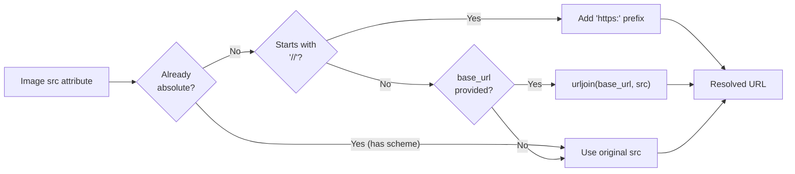

**Sources**: [backend/app/services/rag/chunker.py:114-151](), [backend/app/services/rag/chunker.py:153-225]()

**Example**: 
- Input: `../images/photo.jpg` with `base_url="https://example.com/blog/post"`
- Output: `https://example.com/blog/images/photo.jpg`

---

## Image Caption Generation

The pipeline uses Vision API to generate descriptive captions for images, which are then embedded into the text at their original positions.

### Vision API Configuration

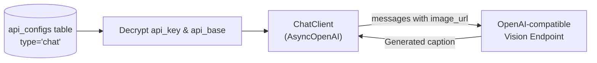

**Sources**: [backend/app/celery_app/rag_processor.py:169-182](), [backend/app/services/ai/clients.py:156-203]()

### Caption Generation Parameters

| Parameter | Value | Purpose |
|-----------|-------|---------|
| Prompt | `CAPTION_PROMPT` | System prompt defining caption requirements |
| Max Tokens | 4096 | Maximum length of generated caption |
| Max Images | 10 per article | Limit to prevent excessive API calls |
| Timeout | 30s per image | Individual image timeout |
| Failure Handling | Continue | Single failure doesn't block other images |

**Prompt Requirements**:
1. Describe main elements, scene, and layout
2. Extract text if present in image
3. Describe chart/data visualization types
4. Identify code language and function if screenshot
5. Keep description under 200 characters in Chinese

**Sources**: [backend/app/services/ai/clients.py:26-35](), [backend/app/celery_app/rag_processor.py:29-30]()

### Caption Integration Flow

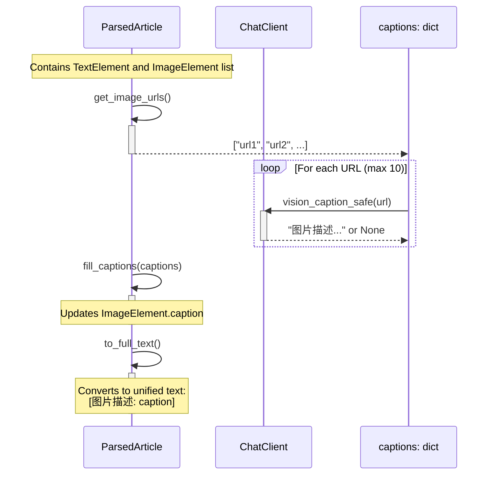

**Sources**: [backend/app/celery_app/rag_processor.py:164-196](), [backend/app/services/rag/chunker.py:53-92]()

### Generated Text Format

The `to_full_text()` method merges all content into a single string:

```
标题：Article Title
作者：Author Name

First paragraph text...

[图片描述: A diagram showing system architecture with three layers...]

Second paragraph text...

[图片描述: Screenshot of code implementation in Python...]

Concluding text...
```

**Sources**: [backend/app/services/rag/chunker.py:68-92]()

---

## Semantic Chunking

After caption integration, the unified text is split into semantically coherent chunks using sentence similarity analysis.

### Chunking Strategy Comparison

| Strategy | Implementation | Pros | Cons | When Used |
|----------|----------------|------|------|-----------|
| **Semantic** | `langchain.SemanticChunker` | Respects semantic boundaries | Requires embedding API | Primary strategy |
| **Fallback** | Character-based with sentence detection | Fast, no API needed | May split mid-sentence | When semantic fails |

### Semantic Chunking Algorithm

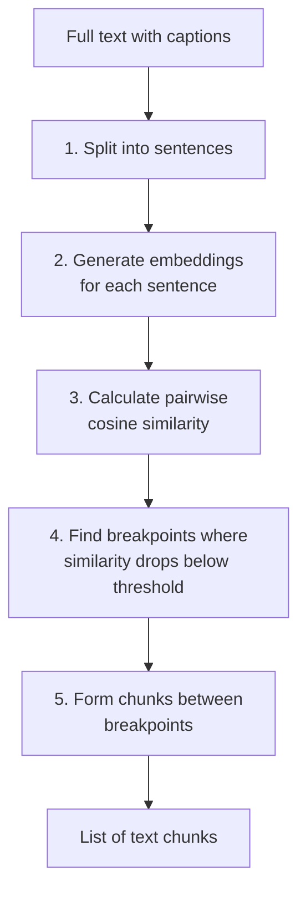

**Implementation Details**:
- Uses `langchain_experimental.text_splitter.SemanticChunker`
- Requires `langchain-experimental` and `langchain-openai` packages
- Breakpoint threshold type: `"percentile"` (dynamic threshold based on distribution)
- Embedding model: User's configured embedding model

**Sources**: [backend/app/services/rag/chunker.py:268-330]()

### Fallback Chunking Strategy

When semantic chunking fails (missing dependencies, API error, etc.), the system falls back to a simpler strategy:

```python
# Parameters
MAX_CHARS = 1000      # Maximum characters per chunk
OVERLAP = 100         # Character overlap between chunks
```

**Sentence Boundary Detection**:
```python
separators = ["。", "！", "？", ".", "!", "?"]
# Finds last separator in chunk (must be past midpoint)
```

**Sources**: [backend/app/services/rag/chunker.py:332-378]()

---

## Embedding Generation

After chunking, each text chunk is converted into a high-dimensional vector using the user's configured embedding model.

### Embedding Pipeline Diagram

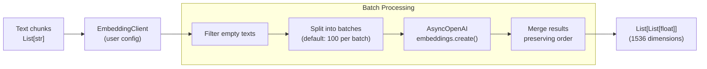

**Sources**: [backend/app/celery_app/rag_processor.py:227-237](), [backend/app/services/ai/clients.py:290-364]()

### Batch Processing Strategy

The `embed_batch` method handles large text lists efficiently:

1. **Filter Empty Texts**: Records indices of valid (non-empty) texts
2. **Batching**: Splits valid texts into batches of 100
3. **API Calls**: Sequential batch processing with retry logic
4. **Result Mapping**: Places embeddings back to original indices
5. **Empty Filling**: Assigns empty list `[]` to skipped texts

**Configuration**:
```python
DEFAULT_BATCH_SIZE = 100      # Max texts per API call
DEFAULT_TIMEOUT = 90.0        # Total timeout
DEFAULT_MAX_RETRIES = 3       # Automatic retries
DIMENSIONS = 1536             # Vector dimensions (OpenAI standard)
```

**Sources**: [backend/app/services/ai/clients.py:19-23](), [backend/app/services/ai/clients.py:290-364]()

### Embedding Client Initialization

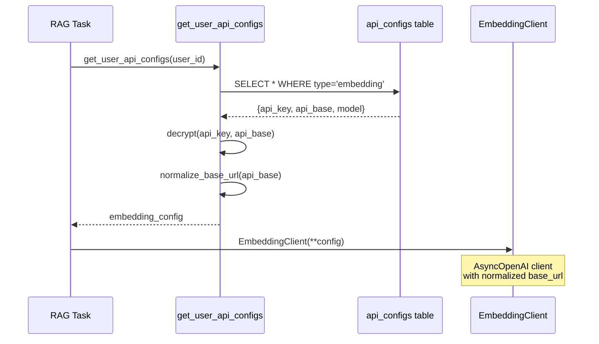

**Sources**: [backend/app/celery_app/rag_processor.py:142-150](), [backend/app/services/ai/clients.py:245-260]()

---

## Database Storage

The generated embeddings are stored in the `all_embeddings` table, which uses PostgreSQL's `pgvector` extension for efficient similarity search.

### Database Schema

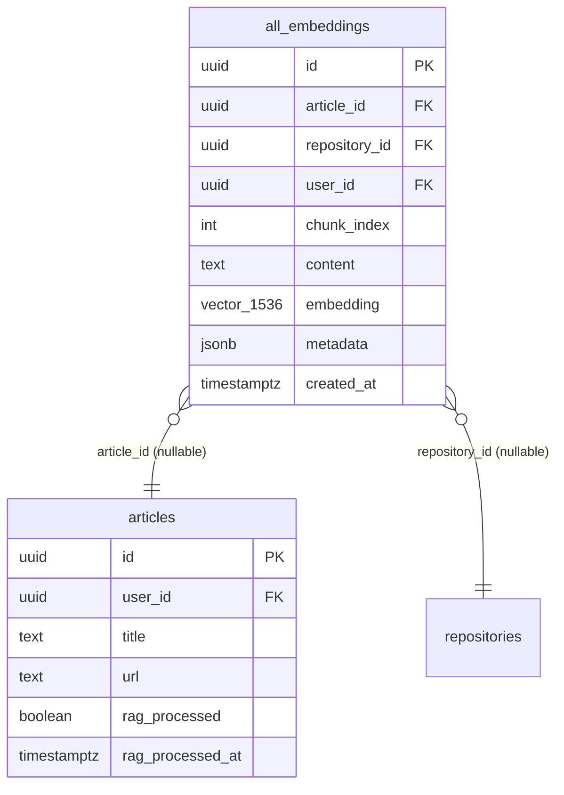

**Constraints**:
- `article_id` and `repository_id` are mutually exclusive (one must be NULL)
- `user_id` ensures data isolation between users
- Unique constraint: None (allows re-processing)

**Sources**: [backend/scripts/029_rename_article_embeddings_to_all_embeddings.sql:13-14](), [backend/scripts/031_add_repository_embeddings.sql:55-70](), [backend/scripts/032_fix_all_embeddings_article_id_nullable.sql:10-12]()

### Storage Process

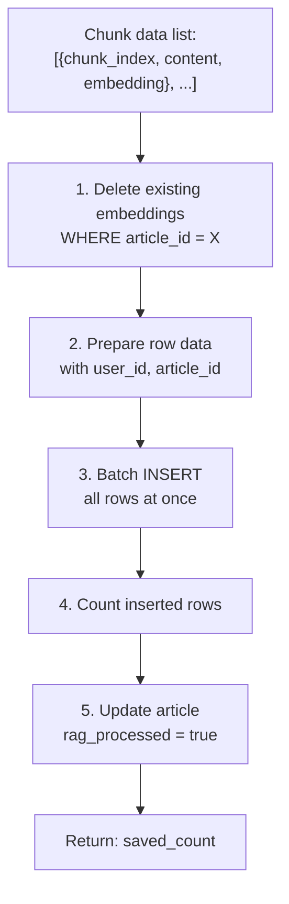

**Implementation**: The `RagService.save_embeddings` method:
1. Deletes existing embeddings (ensures idempotent re-processing)
2. Constructs row data with proper field mapping
3. Batch inserts all embeddings in single transaction
4. Returns count of successfully saved records

**Sources**: [backend/app/services/db/rag.py:27-88](), [backend/app/celery_app/rag_processor.py:239-242]()

### Row Structure Example

```python
{
    "article_id": "123e4567-e89b-12d3-a456-426614174000",
    "user_id": "987fcdeb-51a2-43f7-8c9d-0123456789ab",
    "chunk_index": 0,
    "content": "标题：Understanding RAG\n\nRAG combines retrieval...",
    "embedding": [0.123, -0.456, 0.789, ...],  # 1536 floats
    "metadata": None
}
```

**Sources**: [backend/app/services/db/rag.py:61-71]()

---

## Article Status Tracking

The pipeline uses tri-state boolean fields to track processing stages, enabling selective reprocessing and failure recovery.

### Status Fields

| Field | Type | Meaning |
|-------|------|---------|
| `images_processed` | BOOLEAN | NULL=pending, true=success, false=failed |
| `rag_processed` | BOOLEAN | NULL=pending, true=success, false=failed |
| `repos_extracted` | BOOLEAN | NULL=pending, true=success, false=failed |

### Status Transition Diagram

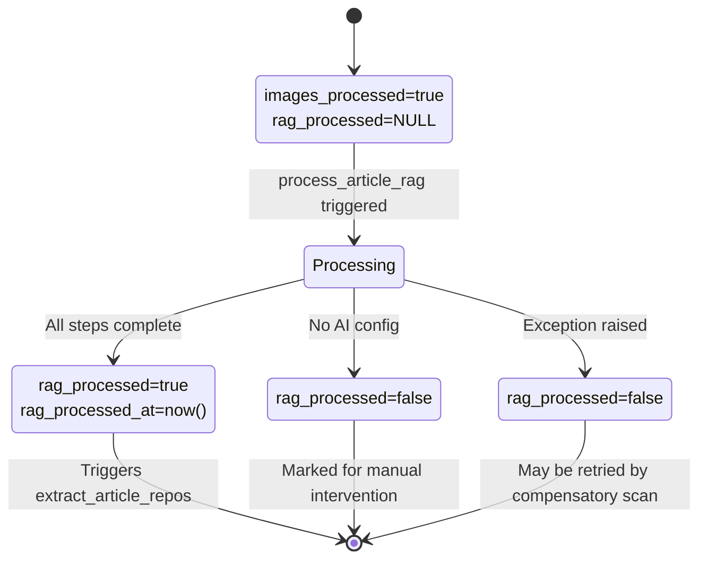

**Sources**: [backend/app/celery_app/rag_processor.py:137-147](), [backend/app/services/db/rag.py:132-156]()

### Status Update Methods

**Success**:
```python
RagService.mark_article_rag_processed(article_id, success=True)
# Sets: rag_processed=true, rag_processed_at=now()
```

**Failure**:
```python
RagService.mark_article_rag_processed(article_id, success=False)
# Sets: rag_processed=false, rag_processed_at=now()
```

**Reset** (for manual reindexing):
```python
RagService.reset_article_rag_status(article_id)
# Sets: rag_processed=NULL, rag_processed_at=NULL
```

**Sources**: [backend/app/services/db/rag.py:132-173]()

---

## Compensatory Scanning

A periodic Celery Beat task scans for articles that should have been processed but were missed, ensuring eventual consistency.

### Scan Query Logic

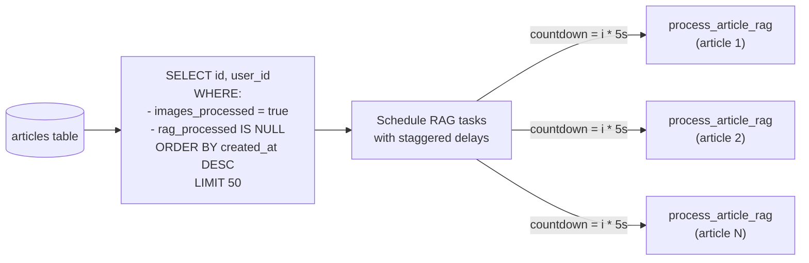

**Sources**: [backend/app/celery_app/rag_processor.py:269-289](), [backend/app/celery_app/rag_processor.py:382-416]()

### Scan Configuration

```python
# Task name for Celery Beat registration
TASK_NAME = "scan_pending_rag_articles"

# Scan interval (defined in celery.py beat_schedule)
SCHEDULE = crontab(minute="*/30")  # Every 30 minutes

# Batch processing limit
BATCH_SIZE = 50

# Staggered execution delay
DELAY_BETWEEN_ARTICLES = 5  # seconds
```

**Rationale**: 
- 30-minute interval balances responsiveness with system load
- 5-second stagger prevents API rate limit violations
- 50-article limit prevents queue flooding

**Sources**: [backend/app/celery_app/rag_processor.py:28](), [backend/app/celery_app/rag_processor.py:400-409]()

### Scan Task Implementation

```python
@app.task(name="scan_pending_rag_articles")
def scan_pending_rag_articles():
    """
    Periodic scan for unprocessed articles.
    
    Selection criteria:
    - images_processed = true  (prerequisite completed)
    - rag_processed IS NULL    (not yet attempted)
    
    Returns:
        {"scheduled": int, "error": str}
    """
```

**Sources**: [backend/app/celery_app/rag_processor.py:382-416]()

---

## Manual Reindexing

The system provides an API endpoint for users to manually trigger reindexing of specific articles, useful for fixing failures or updating with new AI configurations.

### Reindex Flow

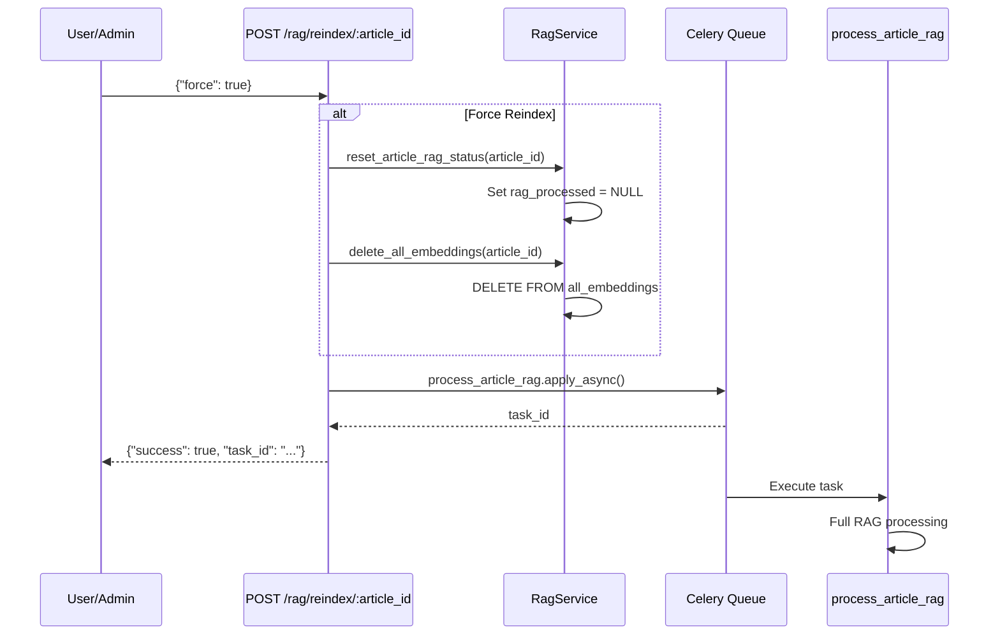

**Sources**: [backend/app/api/routers/rag.py:165-207]()

### Endpoint Specification

**Route**: `POST /rag/reindex/{article_id}`

**Request Body**:
```python
class RagReindexRequest(BaseModel):
    force: bool = False  # If true, deletes existing embeddings
```

**Response**:
```python
class RagReindexResponse(BaseModel):
    success: bool
    article_id: UUID
    message: str
    task_id: str  # Celery task ID for tracking
```

**Sources**: [backend/app/api/routers/rag.py:165-207]()

### Force vs. Non-Force Behavior

| Parameter | Behavior | Use Case |
|-----------|----------|----------|
| `force=false` | Skips if `rag_processed=true` | Retry failed articles only |
| `force=true` | Resets status and deletes embeddings | Update with new AI config or fix corrupted data |

**Sources**: [backend/app/api/routers/rag.py:183-186]()

---

## Error Handling

The pipeline implements multi-layer error handling to maximize success rate while preventing cascade failures.

### Error Categories

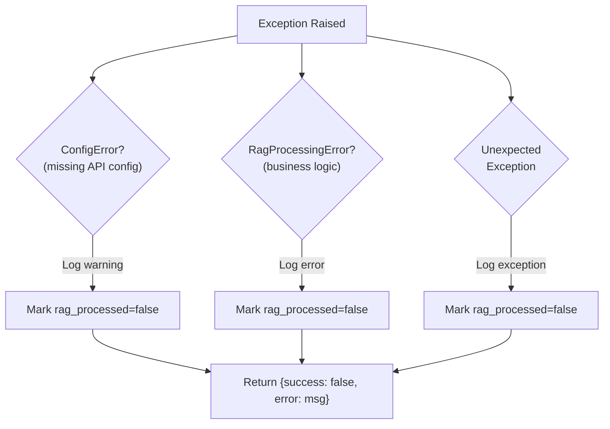

**Sources**: [backend/app/celery_app/rag_processor.py:37-54](), [backend/app/celery_app/rag_processor.py:255-266]()

### Error Types

| Error Class | Cause | Recovery Strategy |
|-------------|-------|-------------------|
| `ConfigError` | User hasn't configured AI API | Mark failed, requires user action |
| `ChunkingError` | Semantic chunking failed | Automatic fallback to character-based chunking |
| `EmbeddingError` | Embedding API failed | Marked failed, retried by compensatory scan |
| `Exception` | Unexpected errors | Logged, marked failed, may be retried |

**Sources**: [backend/app/celery_app/rag_processor.py:37-54]()

### Retry Configuration

Celery task retry settings:
```python
max_retries=2
default_retry_delay=60  # Initial delay: 1 minute
retry_backoff=True      # Exponential increase
retry_backoff_max=300   # Max delay: 5 minutes
retry_jitter=True       # Add randomness to prevent thundering herd
```

**Retry Decision Logic**:
- `ConfigError`: No retry (user needs to configure API)
- Network/API errors: Auto retry with backoff
- Unexpected exceptions: Logged but not retried (to prevent infinite loops)

**Sources**: [backend/app/celery_app/rag_processor.py:295-307](), [backend/app/celery_app/rag_processor.py:362-379]()

---

## Performance Characteristics

### Processing Time Breakdown

| Stage | Typical Duration | Factors |
|-------|------------------|---------|
| HTML Parsing | <1s | Article length, complexity |
| Caption Generation | 3-15s per image | Image complexity, API latency |
| Semantic Chunking | 2-5s | Text length, embedding API |
| Embedding Generation | 1-3s per 100 chunks | Batch size, API latency |
| Database Storage | <1s | Number of embeddings |
| **Total** | **10-60s** | Depends on article size and image count |

### Resource Limits

```python
MAX_IMAGES_PER_ARTICLE = 10          # Prevent excessive Vision API calls
IMAGE_CAPTION_TIMEOUT = 30           # Per-image timeout (seconds)
TASK_TIME_LIMIT = 300                # Hard timeout for entire task
BATCH_SIZE = 50                      # Max articles per compensatory scan
EMBEDDING_BATCH_SIZE = 100           # Texts per embedding API call
```

**Sources**: [backend/app/celery_app/rag_processor.py:28-30](), [backend/app/services/ai/clients.py:23]()

---

## Key Files Reference

### Primary Files

| File | Primary Components | Purpose |
|------|-------------------|---------|
| [backend/app/celery_app/rag_processor.py]() | `process_article_rag`, `do_process_article_rag`, `scan_pending_rag_articles` | Celery tasks and core logic |
| [backend/app/services/rag/chunker.py]() | `parse_article_content`, `chunk_text_semantic`, `fallback_chunk_text` | HTML parsing and text chunking |
| [backend/app/services/ai/clients.py]() | `ChatClient`, `EmbeddingClient` | AI API client abstractions |
| [backend/app/services/db/rag.py]() | `RagService` | Database operations for embeddings |

### Related Files

| File | Relevance |
|------|-----------|
| [backend/app/api/routers/rag.py]() | Manual reindexing endpoint |
| [backend/app/services/ai/config.py]() | API configuration management |
| [backend/scripts/029_rename_article_embeddings_to_all_embeddings.sql]() | Table schema migration |
| [backend/scripts/031_add_repository_embeddings.sql]() | Repository embedding support |
| [backend/scripts/032_fix_all_embeddings_article_id_nullable.sql]() | Constraint fix for mutual exclusion |

**Sources**: Multiple files cited above