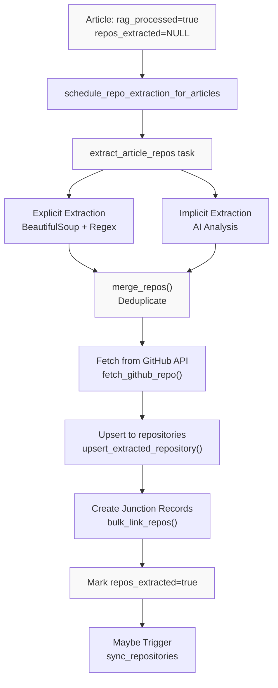
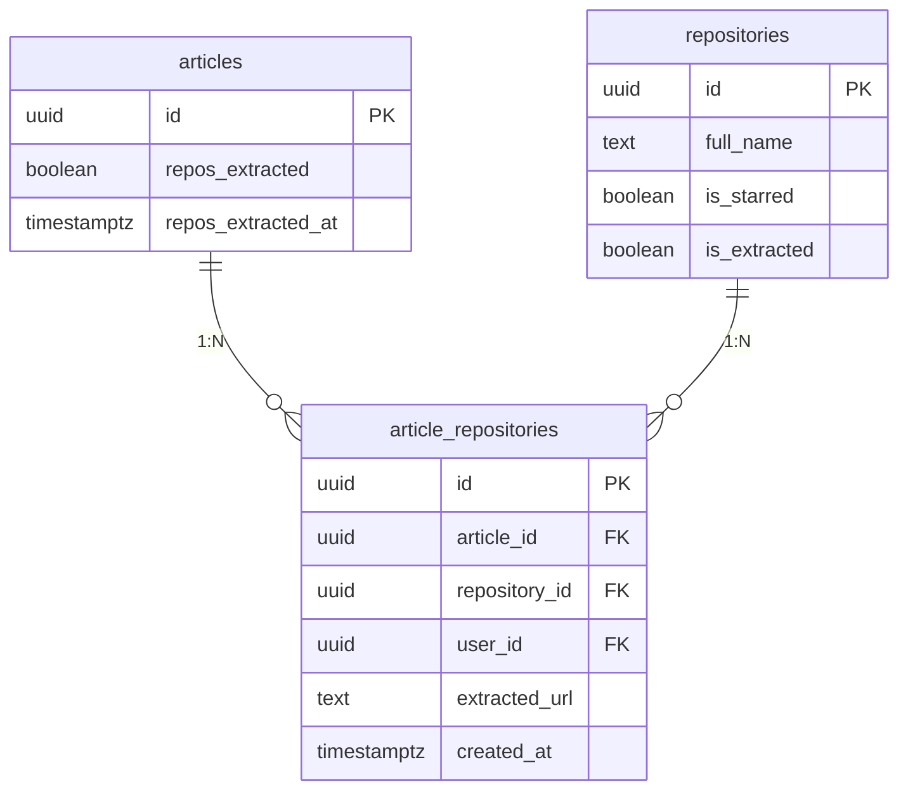
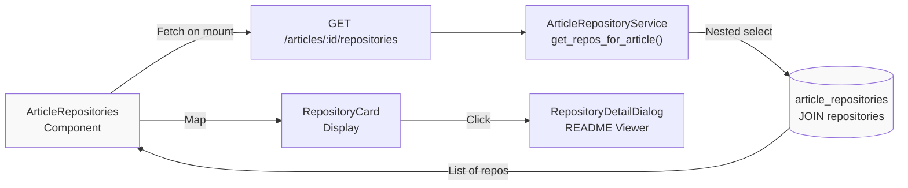

# Repository Extraction Pipeline

<details>
<summary>Relevant source files</summary>

The following files were used as context for generating this wiki page:

- [backend/app/api/routers/articles.py](backend/app/api/routers/articles.py)
- [backend/app/api/routers/folders.py](backend/app/api/routers/folders.py)
- [backend/app/api/routers/proxy.py](backend/app/api/routers/proxy.py)
- [backend/app/celery_app/repo_extractor.py](backend/app/celery_app/repo_extractor.py)
- [backend/app/schemas/articles.py](backend/app/schemas/articles.py)
- [backend/app/services/db/article_repositories.py](backend/app/services/db/article_repositories.py)
- [backend/app/services/db/articles.py](backend/app/services/db/articles.py)
- [backend/app/services/github_extractor.py](backend/app/services/github_extractor.py)
- [backend/scripts/026_create_article_repositories.sql](backend/scripts/026_create_article_repositories.sql)
- [backend/scripts/027_add_repository_source_flags.sql](backend/scripts/027_add_repository_source_flags.sql)
- [backend/scripts/028_add_repos_extracted_status.sql](backend/scripts/028_add_repos_extracted_status.sql)
- [frontend/components/article-content.tsx](frontend/components/article-content.tsx)
- [frontend/components/article-list.tsx](frontend/components/article-list.tsx)
- [frontend/components/article-repositories.tsx](frontend/components/article-repositories.tsx)
- [frontend/lib/utils.ts](frontend/lib/utils.ts)
- [image/5.png](image/5.png)

</details>


## Purpose and Scope

The Repository Extraction Pipeline is responsible for identifying and linking GitHub repositories mentioned in article content. This pipeline runs as the final stage of article enrichment, after image processing and RAG processing have completed. It extracts repository references using both explicit URL parsing and AI-powered implicit detection, then creates structured links between articles and repositories.

For information about repository synchronization from GitHub starred repos, see [Repository Synchronization](#6.2). For the RAG processing that precedes this pipeline, see [RAG Processing Pipeline](#6.4).

## Overview

The extraction pipeline analyzes article content to discover GitHub repositories through two complementary methods:

1. **Explicit Extraction**: Parses HTML content to find GitHub URLs in links and plain text using BeautifulSoup and regex
2. **Implicit Extraction**: Uses AI to identify repositories mentioned by name without direct links (e.g., "we use React for the frontend")

Extracted repositories are fetched from the GitHub API, stored in the `repositories` table, and linked to articles via the `article_repositories` junction table. The pipeline is triggered automatically after RAG processing completes, with compensatory scans running every 30 minutes to catch any missed articles.

**Key Processing Flow:**



Sources: [backend/app/celery_app/repo_extractor.py:134-264]()

## Database Schema

The pipeline interacts with three primary tables to track extraction status and create article-repository relationships:

### Articles Table Status Fields

| Field | Type | Description |
|-------|------|-------------|
| `repos_extracted` | `BOOLEAN` | NULL=not yet extracted, true=success, false=failed |
| `repos_extracted_at` | `TIMESTAMPTZ` | Timestamp of last extraction attempt |

The extraction only runs when `images_processed=true` and `repos_extracted IS NULL`, ensuring content is finalized before analysis.

### Repositories Table Source Flags

| Field | Type | Description |
|-------|------|-------------|
| `is_starred` | `BOOLEAN` | True if from GitHub starred sync |
| `is_extracted` | `BOOLEAN` | True if extracted from article content |

A repository can have both flags set if it appears in both starred repos and article content.

### Article-Repositories Junction Table



The `article_repositories` table has a unique constraint on `(article_id, repository_id)` to prevent duplicate links. The `extracted_url` field preserves the original URL found in the article (which may differ from the canonical GitHub URL due to URL parameters, anchors, or alternate formats).

Sources: [backend/scripts/026_create_article_repositories.sql:1-54](), [backend/scripts/027_add_repository_source_flags.sql:1-30](), [backend/scripts/028_add_repos_extracted_status.sql:1-22]()

## Extraction Methods

### Explicit Extraction (BeautifulSoup + Regex)

The `extract_github_repos()` function parses HTML content to find GitHub URLs using two strategies:

**Strategy 1: Link Href Attributes**
```python
soup = BeautifulSoup(content, 'html.parser')
for link in soup.find_all('a', href=True):
    href = link['href']
    if 'github.com' in href.lower():
        urls_to_check.add(href)
```

**Strategy 2: Plain Text URLs**
```python
url_pattern = r'https?://(?:www\.)?github\.com/[^\s<>"\')\]\},]+'
for match in re.finditer(url_pattern, text_content, re.IGNORECASE):
    urls_to_check.add(match.group())
```

Each URL is then parsed by `parse_github_url()` which:
- Validates GitHub domain (`github.com` or `www.github.com`)
- Extracts owner and repo name from path (`/owner/repo/...`)
- Filters out non-repository paths (e.g., `/settings`, `/explore`, `/pricing`)
- Validates owner and repo name formats against GitHub naming rules
- Removes `.git` suffixes

**Excluded Paths**: The extractor explicitly filters out these GitHub paths that are not repositories:
```python
EXCLUDED_PATHS = {
    'about', 'pricing', 'features', 'enterprise', 'sponsors',
    'marketplace', 'explore', 'topics', 'trending', 'collections',
    'events', 'security', 'settings', 'notifications', 'login',
    'join', 'organizations', 'orgs', 'users', 'apps', 'search',
    'pulls', 'issues', 'gist', 'gists', 'stars', 'watching',
    'followers', 'following', 'achievements', 'codespaces',
    'copilot', 'readme', 'new', 'account', 'customer-stories',
}
```

Sources: [backend/app/services/github_extractor.py:82-143](), [backend/app/services/github_extractor.py:27-79]()

### Implicit Extraction (AI-Powered)

The `extract_implicit_repos_with_ai()` function uses the chat API to identify repositories mentioned by name without direct links:

**Prompt Strategy**:
```python
IMPLICIT_REPO_PROMPT = """你是一个 GitHub 仓库识别专家。分析文章内容，识别其中隐式提及的软件项目/库/工具。

重要规则：
1. 只识别明确提到名称的项目
2. 不要包含文章中已有链接的仓库
3. 如果不确定 owner/repo，跳过
4. 联网搜索以确保 owner/repo 准确
5. 只输出文章主要描述的仓库, 忽略非重点提到的仓库

返回 JSON 数组，格式：[{"owner": "facebook", "repo": "react"}]
如果没有找到，返回：[]
只返回有效 JSON，不要其他文字。"""
```

The system constructs a prompt with the article's text content (first 6000 characters) and optional summary, then makes an async HTTP request to the OpenAI-compatible API:

**Request Parameters**:
- `temperature: 0.3` - Lower temperature for more deterministic extraction
- `max_tokens: 2048` - Sufficient for JSON response
- Timeout: 60 seconds

The response is parsed by `_parse_ai_response()` which handles markdown code blocks and validates each extracted repository against the same rules as explicit extraction.

**Silent Fallback**: If AI extraction fails for any reason (timeout, API error, invalid response), the pipeline continues with only explicit results. This ensures article processing is never blocked by AI availability.

Sources: [backend/app/services/github_extractor.py:146-217](), [backend/app/services/github_extractor.py:219-296]()

### Merging and Deduplication

The `merge_repos()` function combines results from both extraction methods:

1. **Explicit repos added first**: Preserves original URLs found in content
2. **Implicit repos added second**: Constructs canonical GitHub URLs
3. **Case-insensitive deduplication**: Uses `(owner.lower(), repo.lower())` as key
4. **Limit enforcement**: Maximum 20 repositories per article (`MAX_REPOS_PER_ARTICLE`)

Sources: [backend/app/services/github_extractor.py:298-333](), [backend/app/celery_app/repo_extractor.py:25]()

## Task Orchestration

### Main Extraction Task

The `extract_article_repos` Celery task orchestrates the entire extraction workflow:

```mermaid
graph TB
    subgraph "extract_article_repos Task"
        Start["Task Invoked<br/>article_id, user_id"]
        GetArticle["Fetch Article Content<br/>articles.select(content, summary)"]
        CheckExists{"Article<br/>Exists?"}
        Explicit["Explicit Extraction<br/>extract_github_repos()"]
        GetConfig["Get User Chat Config<br/>get_user_chat_config()"]
        HasConfig{"Chat Config<br/>Available?"}
        AIExtract["AI Extraction<br/>extract_implicit_repos_with_ai()"]
        Merge["Merge & Deduplicate<br/>merge_repos()"]
        Empty{"Repos<br/>Found?"}
        MarkEmpty["Mark repos_extracted=true<br/>No repos found"]
        
        subgraph "For Each Repository"
            CheckExisting["Check if exists<br/>get_by_full_name()"]
            Exists{"Already<br/>Exists?"}
            FetchAPI["Fetch from GitHub API<br/>fetch_github_repo()"]
            Upsert["Upsert Repository<br/>upsert_extracted_repository()"]
            AddLink["Add to repo_links[]"]
        end
        
        BulkLink["Bulk Create Links<br/>bulk_link_repos()"]
        MarkSuccess["Mark repos_extracted=true"]
        TriggerSync["Maybe Trigger<br/>sync_repositories"]
        
        Start --> GetArticle
        GetArticle --> CheckExists
        CheckExists -->|No| ReturnError["Return error"]
        CheckExists -->|Yes| Explicit
        Explicit --> GetConfig
        GetConfig --> HasConfig
        HasConfig -->|No| Merge
        HasConfig -->|Yes| AIExtract
        AIExtract --> Merge
        Merge --> Empty
        Empty -->|No| MarkEmpty
        Empty -->|Yes| CheckExisting
        CheckExisting --> Exists
        Exists -->|Yes| AddLink
        Exists -->|No| FetchAPI
        FetchAPI --> Upsert
        Upsert --> AddLink
        AddLink --> BulkLink
        BulkLink --> MarkSuccess
        MarkSuccess --> TriggerSync
    end
    
    style Start fill:#f9f9f9
    style Merge fill:#f9f9f9
    style MarkSuccess fill:#f9f9f9
```



**Task Configuration**:
- Max retries: 2
- Retry backoff: exponential (120s base delay)
- Time limit: 300s (hard), 270s (soft)
- Queue: `default`

Sources: [backend/app/celery_app/repo_extractor.py:299-329](), [backend/app/celery_app/repo_extractor.py:134-264]()

### GitHub API Integration

The `fetch_github_repo()` function retrieves repository metadata from GitHub's REST API:

**Request Details**:
- Endpoint: `https://api.github.com/repos/{owner}/{repo}`
- Timeout: 30 seconds
- Optional authentication via user's GitHub token (higher rate limits)
- User-Agent: `SaveHub-RSS-Reader`

**Error Handling**:
```python
if response.status_code == 404:
    return None  # Repo not found
    
if response.status_code == 403:
    remaining = response.headers.get("X-RateLimit-Remaining", "0")
    if remaining == "0":
        raise RateLimitError("GitHub API rate limit exceeded")
```

Rate limit errors are raised to trigger Celery retry logic, while 404 errors are silently skipped (repository may have been deleted or made private).

Sources: [backend/app/celery_app/repo_extractor.py:51-102]()

### Scheduling and Compensatory Scans

**Automatic Scheduling**: The `schedule_repo_extraction_for_articles()` task schedules extraction for a batch of articles with 2-second delays between each:

```python
for i, article in enumerate(result.data):
    extract_article_repos.apply_async(
        kwargs={
            "article_id": article["id"],
            "user_id": article["user_id"],
        },
        countdown=i * 2,  # 2 second delay between each
        queue="default",
    )
```

**Compensatory Scan**: The `scan_pending_repo_extraction()` beat task runs every 30 minutes to catch articles that missed automatic scheduling:

```sql
SELECT id, user_id FROM articles
WHERE images_processed = true
  AND repos_extracted IS NULL
ORDER BY created_at DESC
LIMIT 50
```

This scan schedules extraction for up to 50 articles per run with 3-second delays.

Sources: [backend/app/celery_app/repo_extractor.py:331-363](), [backend/app/celery_app/repo_extractor.py:365-402]()

## Database Operations

### Repository Upsert Logic

The `RepositoryService.upsert_extracted_repository()` method creates or updates repository records:

**Data Transformation**:
```python
{
    "full_name": repo_data["full_name"],
    "owner": repo_data["owner"]["login"],
    "name": repo_data["name"],
    "description": repo_data.get("description"),
    "url": repo_data["html_url"],
    "stars": repo_data["stargazers_count"],
    "language": repo_data.get("language"),
    "topics": repo_data.get("topics", []),
    "is_extracted": True,  # Mark as extracted
    "user_id": self.user_id,
}
```

Upsert is performed on conflict with `full_name`, ensuring duplicate repositories are merged.

Sources: [backend/app/services/db/repositories.py]() (referenced but not in provided files)

### Junction Table Bulk Operations

The `ArticleRepositoryService.bulk_link_repos()` method efficiently creates multiple article-repository links in a single database operation:

```python
records = [
    {
        "article_id": article_id,
        "repository_id": link["repository_id"],
        "user_id": self.user_id,
        "extracted_url": link["extracted_url"],
    }
    for link in repo_links
]

response = self.supabase.table("article_repositories").upsert(
    records,
    on_conflict="article_id,repository_id"
).execute()
```

The unique constraint on `(article_id, repository_id)` ensures idempotency - re-running extraction on the same article won't create duplicate links.

Sources: [backend/app/services/db/article_repositories.py:60-100]()

### Status Tracking

The `ArticleService.mark_repos_extracted()` method updates extraction status:

```python
update_data = {
    "repos_extracted": success,  # true or false
    "repos_extracted_at": datetime.now(timezone.utc).isoformat(),
}

self.supabase.table("articles") \
    .update(update_data) \
    .eq("id", article_id) \
    .eq("user_id", self.user_id) \
    .execute()
```

This tri-state flag system (NULL/true/false) enables:
- **NULL**: Not yet attempted - eligible for extraction
- **true**: Successfully extracted - skip in future scans
- **false**: Failed extraction - skip to avoid repeated failures

Sources: [backend/app/services/db/articles.py:290-311]()

## Error Handling and Retry Logic

### Task-Level Error Handling

The `do_extract_article_repos()` function implements comprehensive error handling:

**Rate Limit Errors**:
```python
except RateLimitError as e:
    logger.warning(f"Rate limit hit for article {article_id}: {e}")
    return {"success": False, "error": "rate_limit", "retry": True}
```

Celery will retry the task with exponential backoff up to 2 times.

**General Errors**:
```python
except Exception as e:
    logger.exception(f"Error extracting repos from {article_id}: {e}")
    article_service.mark_repos_extracted(article_id, success=False)
    return {"success": False, "error": str(e)}
```

Failed articles are marked with `repos_extracted=false` to prevent infinite retries.

Sources: [backend/app/celery_app/repo_extractor.py:256-263]()

### AI Extraction Fallback

AI extraction failures are handled silently to prevent blocking the pipeline:

```python
try:
    implicit_repos = asyncio.run(
        extract_implicit_repos_with_ai(...)
    )
except Exception as e:
    logger.warning(f"AI extraction failed for {article_id}: {e}")
    # Silent fallback - continue with explicit repos only
```

This ensures article processing completes even when AI services are unavailable.

Sources: [backend/app/celery_app/repo_extractor.py:180-195]()

## Integration Points

### Trigger from RAG Processing

The RAG processing pipeline (`process_article_rag` task) automatically schedules repository extraction after successfully processing an article:

```python
# In process_article_rag callback
schedule_repo_extraction_for_articles.apply_async(
    kwargs={"article_ids": [article_id]},
    countdown=5,
    queue="default",
)
```

Sources: Referenced in [backend/app/celery_app/rag_processor.py]() (not in provided files, but implied by pipeline design)

### Automatic Repository Sync Trigger

When new repositories are extracted from articles, the pipeline may trigger a `sync_repositories` task to fetch full metadata:

```python
def _maybe_trigger_sync(user_id: str):
    """
    Trigger sync_repositories after repo extraction.
    Uses Redis lock to prevent duplicate scheduling within 60 seconds.
    """
    from .task_lock import get_task_lock
    from .repository_tasks import sync_repositories
    
    task_lock = get_task_lock()
    schedule_key = f"trigger_sync_after_extract:{user_id}"
    
    # Only schedule once within 60 seconds
    if not task_lock.acquire(schedule_key, ttl_seconds=60):
        return
    
    # Delay 30 seconds to batch multiple article triggers
    sync_repositories.apply_async(
        kwargs={"user_id": user_id, "trigger": "auto"},
        countdown=30,
        queue="default",
    )
```

This integration ensures extracted repositories are enriched with AI analysis, OpenRank metrics, and embeddings through the repository sync pipeline.

Sources: [backend/app/celery_app/repo_extractor.py:270-293]()

### Frontend Display

The frontend displays linked repositories in the article content viewer via the `ArticleRepositories` component:



The API endpoint returns full repository objects nested within junction records:

```python
response = self.supabase.table("article_repositories") \
    .select("*, repositories(*)") \
    .eq("article_id", article_id) \
    .eq("user_id", self.user_id) \
    .execute()
```

Sources: [frontend/components/article-repositories.tsx:14-91](), [backend/app/api/routers/articles.py:199-240](), [backend/app/services/db/article_repositories.py:102-118]()

## Performance Considerations

### Batch Processing

The pipeline processes articles in batches to avoid overwhelming the GitHub API:

- **Automatic scheduling**: 2-second delays between articles
- **Compensatory scans**: 3-second delays, 50 articles per run
- **Rate limit handling**: Exponential backoff on GitHub API errors

### Redis Locking

Task locks prevent duplicate processing:

```python
task_lock = get_task_lock()
schedule_key = f"trigger_sync_after_extract:{user_id}"
if not task_lock.acquire(schedule_key, ttl_seconds=60):
    return  # Already scheduled
```

Sources: [backend/app/celery_app/repo_extractor.py:278-284]()

### GitHub API Rate Limits

The pipeline supports optional GitHub token authentication to increase rate limits:

- **Unauthenticated**: 60 requests/hour per IP
- **Authenticated**: 5,000 requests/hour per token

User GitHub tokens are retrieved from settings and passed to `fetch_github_repo()` when available.

Sources: [backend/app/celery_app/repo_extractor.py:207-210](), [backend/app/celery_app/repo_extractor.py:70-71]()