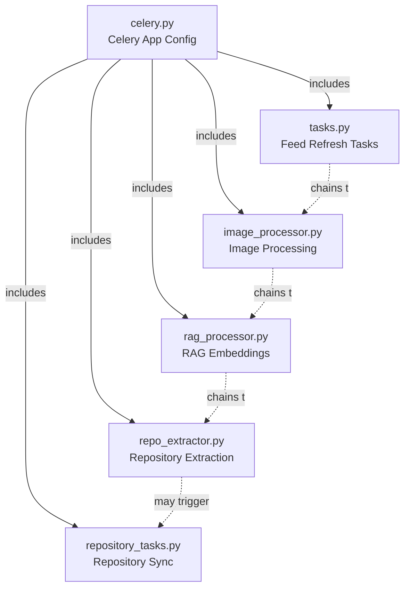
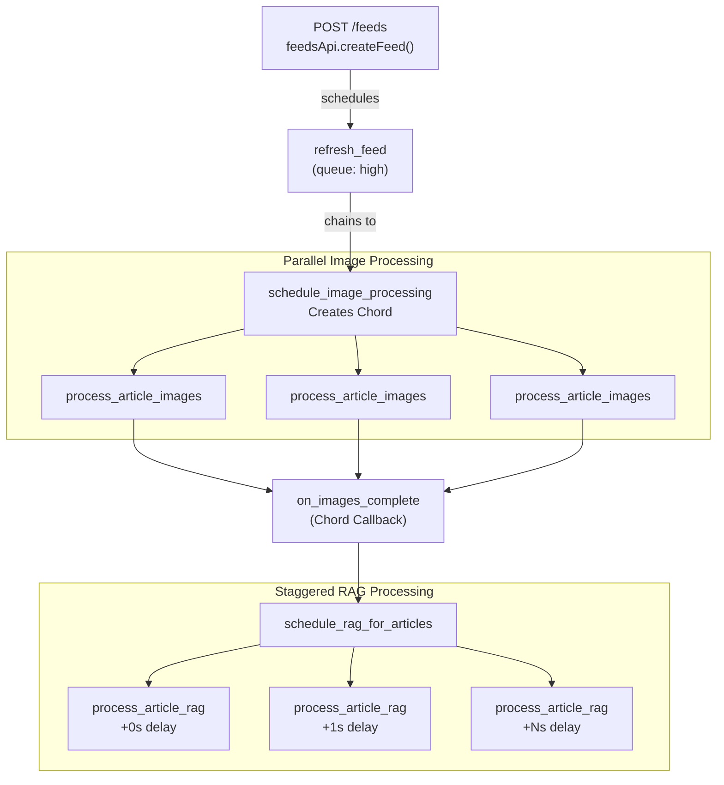
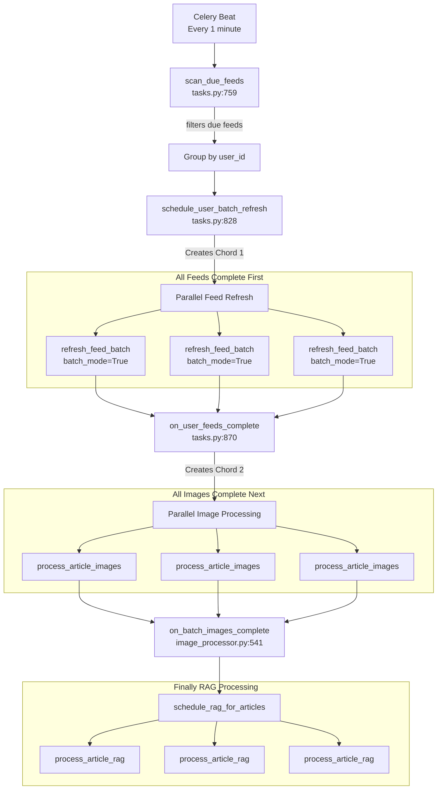
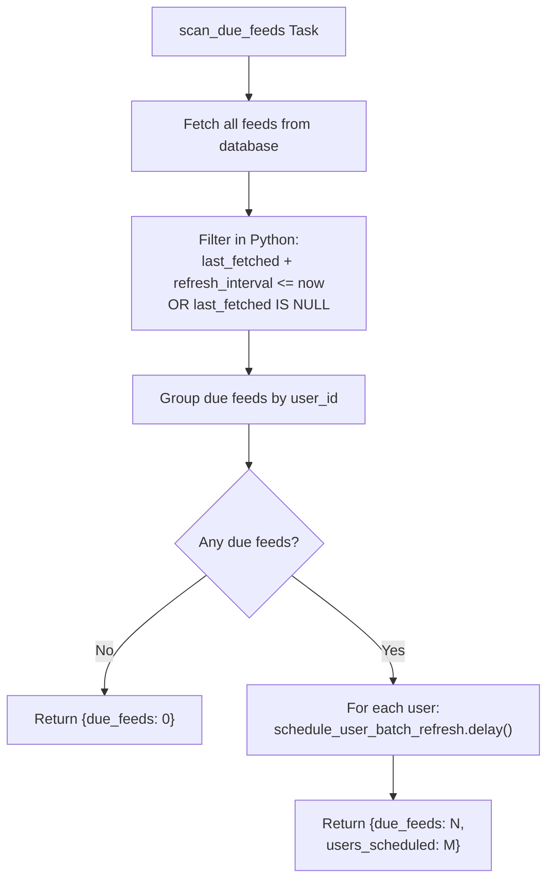
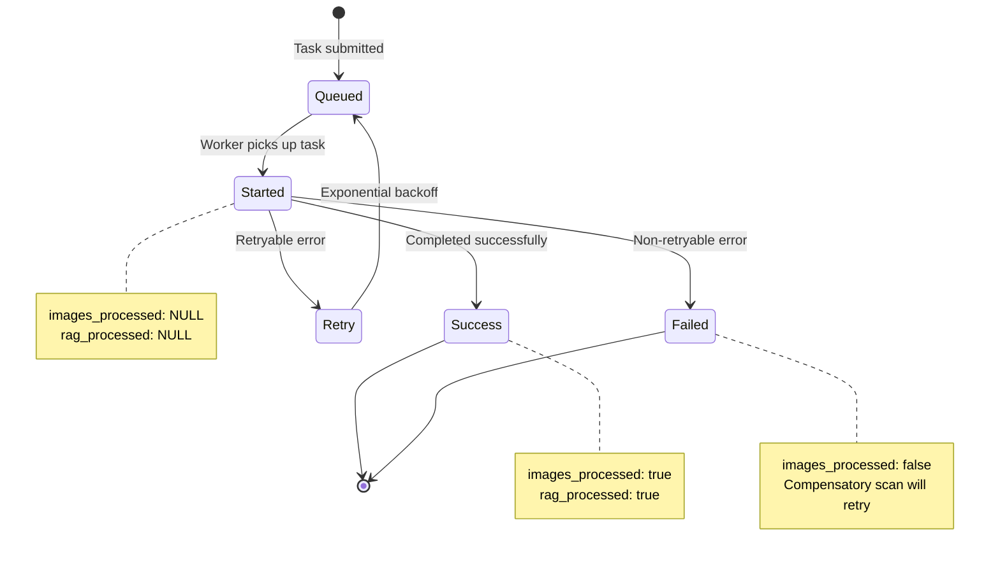

# Background Processing

<details>
<summary>Relevant source files</summary>

The following files were used as context for generating this wiki page:

- [backend/app/api/routers/feeds.py](backend/app/api/routers/feeds.py)
- [backend/app/celery_app/CLAUDE.md](backend/app/celery_app/CLAUDE.md)
- [backend/app/celery_app/celery.py](backend/app/celery_app/celery.py)
- [backend/app/celery_app/image_processor.py](backend/app/celery_app/image_processor.py)
- [backend/app/celery_app/tasks.py](backend/app/celery_app/tasks.py)
- [frontend/CLAUDE.md](frontend/CLAUDE.md)
- [frontend/app/(reader)/settings/storage/page.tsx](frontend/app/(reader)/settings/storage/page.tsx)
- [frontend/components/add-feed-dialog.tsx](frontend/components/add-feed-dialog.tsx)
- [frontend/components/edit-feed-form.tsx](frontend/components/edit-feed-form.tsx)

</details>


## Purpose and Scope

This document provides an overview of the Celery-based background processing architecture in SaveHub. It covers the Celery application configuration, task organization, execution modes, coordination mechanisms, and scheduling strategies that enable asynchronous processing of RSS feeds, images, embeddings, and repository data.

For detailed information about specific processing pipelines, see:
- RSS feed refresh workflow: [RSS Feed Processing](#6.1)
- GitHub repository synchronization: [Repository Synchronization](#6.2)
- Image download and compression: [Image Processing Pipeline](#6.3)
- Article embedding generation: [RAG Processing Pipeline](#6.4)
- GitHub repository extraction: [Repository Extraction Pipeline](#6.5)

---

## Celery Application Configuration

SaveHub uses Celery with Redis as both the message broker and result backend. The application is configured for asynchronous task processing with support for task chaining, parallel execution (chord pattern), and scheduled periodic tasks.

### Core Configuration

The Celery app is initialized in [backend/app/celery_app/celery.py:26-36]() with the following modules:

| Module | Purpose |
|--------|---------|
| `tasks.py` | RSS feed refresh tasks and batch scheduling |
| `image_processor.py` | Image processing tasks (download, compress, upload) |
| `rag_processor.py` | RAG embedding generation tasks |
| `repository_tasks.py` | GitHub repository sync and analysis |
| `repo_extractor.py` | Extract GitHub repositories from article content |

### Worker Configuration

Workers are configured with the following settings in [backend/app/celery_app/celery.py:39-66]():

```python
worker_prefetch_multiplier=1  # Fair scheduling
worker_concurrency=5           # 5 concurrent tasks per worker
task_acks_late=True            # Acknowledge only after completion
task_reject_on_worker_lost=True  # Reject tasks if worker crashes
result_expires=86400           # Results expire after 24 hours
```

### Queue Architecture

The system uses two priority queues to handle different types of work:

| Queue | Priority | Use Case | Example Tasks |
|-------|----------|----------|---------------|
| `high` | High | User-initiated actions | New feed refresh, manual sync |
| `default` | Normal | Scheduled/automated tasks | Beat scans, retry tasks |

Task routing is defined in [backend/app/celery_app/celery.py:74-96]() with explicit queue assignments for each task type.

**Sources:** [backend/app/celery_app/celery.py:1-117]()

---

## Task Organization and Modules

### Task Module Structure



### Core Task Functions

Each module contains both Celery tasks (decorated with `@app.task`) and core business logic functions (without decorators for testability):

| Pattern | Example | File |
|---------|---------|------|
| Core logic | `do_refresh_feed()` | [tasks.py:57-216]() |
| Celery task | `refresh_feed()` | [tasks.py:243-446]() |
| Core logic | `do_process_article_images()` | [image_processor.py:258-323]() |
| Celery task | `process_article_images()` | [image_processor.py:330-429]() |

This separation allows unit testing of business logic without Celery infrastructure.

**Sources:** [backend/app/celery_app/celery.py:30-36](), [backend/app/celery_app/CLAUDE.md:75-86]()

---

## Execution Modes

SaveHub implements two distinct execution patterns for feed refresh and content processing:

### Mode 1: Single Feed Chain

Triggered when a user manually adds a feed via `POST /feeds`. Each feed is processed independently with automatic chaining to dependent tasks.



**Key characteristics:**
- Immediate execution (high priority queue)
- Per-feed processing with automatic task chaining
- Image processing uses Chord pattern (parallel execution → callback)
- RAG processing uses staggered delays to avoid API rate limits
- Task initiates next refresh via `schedule_next_refresh()` at [tasks.py:448-506]()

### Mode 2: Batch Processing

Triggered by Celery Beat every minute via `scan_due_feeds`. Groups all due feeds by user and processes them with global ordering.



**Key characteristics:**
- Scheduled execution (default priority queue)
- Global ordering: ALL feeds → ALL images → ALL RAG
- Two Chord callbacks coordinate batch transitions
- `refresh_feed_batch` uses `batch_mode=True` to skip individual image scheduling at [tasks.py:715]()
- No automatic rescheduling (Beat handles timing)

**Sources:** [backend/app/celery_app/CLAUDE.md:1-74](), [backend/app/celery_app/tasks.py:759-919](), [backend/app/celery_app/image_processor.py:489-578]()

---

## Task Coordination Mechanisms

### Redis Task Locks

Task locks prevent duplicate execution of the same task using Redis-based distributed locks. Implementation at [backend/app/celery_app/task_lock.py]().

**Lock pattern:**
```python
lock_key = f"feed:{feed_id}"
lock_ttl = 180  # 3 minutes (longer than task timeout)
if not task_lock.acquire(lock_key, lock_ttl, task_id):
    raise Reject("Feed is locked", requeue=False)
```

**Common lock keys:**

| Lock Key Pattern | Purpose | TTL | File Reference |
|-----------------|---------|-----|----------------|
| `feed:{feed_id}` | Feed refresh deduplication | 180s | [tasks.py:296-309]() |
| `schedule:{feed_id}` | Schedule deduplication | Variable | [tasks.py:458-466]() |
| `scan_due_feeds` | Beat scan overlap prevention | 55s | [tasks.py:772]() |

Locks are released in `finally` blocks to ensure cleanup even on errors at [tasks.py:443-445]().

### Domain Rate Limiting

The `DomainRateLimiter` at [backend/app/celery_app/rate_limiter.py]() enforces a maximum request rate of 1 request per second per domain to prevent overwhelming RSS feed servers.

**Usage pattern:**
```python
rate_limiter = get_rate_limiter()
waited = rate_limiter.wait_for_domain(feed_url, max_wait_seconds=30)
```

If the domain has been accessed within the last second, the task sleeps until the rate limit window expires. If waiting exceeds `max_wait_seconds`, a `TimeoutError` is raised and treated as a retryable error at [tasks.py:85-90]().

### Retry Logic

Tasks implement exponential backoff retry with jitter for transient failures:

```python
max_retries=3
default_retry_delay=2
retry_backoff=True           # Exponential: 2s, 4s, 8s
retry_backoff_max=60         # Cap at 60 seconds
retry_jitter=True            # Add randomness to prevent thundering herd
```

Error classification determines retry behavior:

| Error Type | Base Class | Retry? | Examples |
|------------|-----------|--------|----------|
| Retryable | `RetryableError` | Yes | Network timeout, 502/503 errors, rate limits |
| Non-retryable | `NonRetryableError` | No | Invalid URL, parse errors, SSRF blocked |

Implementation at [tasks.py:31-54](), [image_processor.py:42-54]().

**Sources:** [backend/app/celery_app/task_lock.py](), [backend/app/celery_app/rate_limiter.py](), [backend/app/celery_app/tasks.py:243-254](), [backend/app/celery_app/tasks.py:31-90]()

---

## Celery Beat Scheduling

### Beat Configuration

Celery Beat runs periodic tasks on fixed schedules defined in [backend/app/celery_app/celery.py:98-116]():

| Task | Schedule | Purpose | Lock Key | Handler |
|------|----------|---------|----------|---------|
| `scan_due_feeds` | Every 1 minute | Scan feeds due for refresh | `scan_due_feeds` | [tasks.py:759-825]() |
| `scan_pending_rag_articles` | Every 30 minutes | Fallback for missed RAG processing | `scan_pending_rag` | [rag_processor.py]() |
| `scan_pending_repo_extraction` | Every 30 minutes | Fallback for missed repo extraction | `scan_pending_extraction` | [repo_extractor.py]() |

### Feed Due Detection Logic



**Refresh criteria** at [tasks.py:789-800]():
- Feed has never been fetched (`last_fetched IS NULL`)
- OR current time >= `last_fetched + refresh_interval`

**Conflict prevention:**
- Beat uses 55-second lock to prevent overlapping scans at [tasks.py:772]()
- New feeds set `last_fetched = now` in `POST /feeds` to prevent duplicate triggering at [backend/app/api/routers/feeds.py:84-91]()

### Compensatory Scans

The two 30-minute scan tasks act as fallback mechanisms to catch processing failures:

1. **`scan_pending_rag_articles`**: Finds articles where `images_processed=true` but `rag_processed IS NULL`, indicating the RAG task never ran
2. **`scan_pending_repo_extraction`**: Finds articles where `rag_processed=true` but `repos_extracted IS NULL`, indicating repository extraction failed

These scans provide eventual consistency guarantees even if task chains break due to worker crashes or errors.

**Sources:** [backend/app/celery_app/celery.py:98-116](), [backend/app/celery_app/tasks.py:759-825](), [backend/app/api/routers/feeds.py:73-108]()

---

## Error Handling and Result Patterns

### Task Result Format

All tasks return a consistent result dictionary instead of raising exceptions (except for retry logic):

```python
# Success
{"success": True, "article_count": 10, "duration_ms": 1234}

# Failure (non-retryable)
{"success": False, "error": "Parse error", "duration_ms": 567}

# Skipped
{"success": True, "skipped": True, "reason": "feed_deleted"}
```

This pattern ensures chord callbacks always execute even if individual tasks fail, preventing chain breakage.

### Error Classification

The `is_retryable_error()` function at [tasks.py:46-54]() classifies errors based on message content:

**Retryable patterns:**
- Network errors: `ENOTFOUND`, `ETIMEDOUT`, `ECONNREFUSED`, `ECONNRESET`
- Transient failures: `503`, `502`, `429` (rate limited), `TimeoutError`

**Non-retryable patterns:**
- Invalid feed format
- SSRF protection triggered at [image_processor.py:97-98]()
- Permanent HTTP errors (404, 403)

### Status Field Patterns

Database tables use tri-state status fields to track processing stages:

| Field Value | Meaning | Action |
|-------------|---------|--------|
| `NULL` | Not processed yet | Schedule task |
| `true` | Successfully processed | Skip |
| `false` | Processing failed | Skip (handled by compensatory scans) |

Examples:
- `articles.images_processed`: NULL → task scheduled, true → skip, false → failed
- `articles.rag_processed`: NULL → task scheduled, true → skip, false → failed
- `repositories.embedding_processed`: NULL → task scheduled, true → skip, false → failed

Implementation at [tasks.py:131-135](), [image_processor.py:284-286]().

**Sources:** [backend/app/celery_app/tasks.py:31-54](), [backend/app/celery_app/tasks.py:361-420](), [backend/app/celery_app/image_processor.py:387-429]()

---

## Task Dependencies and Chains

### Automatic Task Chaining

Tasks trigger dependent tasks automatically using Celery's chain and chord primitives:

```mermaid
graph LR
    A["refresh_feed"] -->|"schedule_image_processing.delay()"| B["Chord: Images"]
    B -->|"on_images_complete callback"| C["schedule_rag_for_articles"]
    C -->|"Staggered delays"| D["process_article_rag tasks"]
    D -->|"extract_article_repos.delay()"| E["Repository Extraction"]
    E -->|"May trigger"| F["sync_repositories"]
```



### Chord Pattern for Parallel Execution

The system uses Celery's chord pattern for parallel processing with coordination:

```python
from celery import chord, group

# Build parallel task group
tasks = group(process_article_images.s(aid) for aid in article_ids)

# Execute all tasks, then run callback
workflow = chord(tasks)(callback_task.s())
```

**Chord usage examples:**

1. **Single feed image processing** at [image_processor.py:458-471]():
   - Header: Parallel `process_article_images` tasks
   - Callback: `on_images_complete` → schedules RAG

2. **Batch image processing** at [image_processor.py:514-523]():
   - Header: Parallel `process_article_images` tasks
   - Callback: `on_batch_images_complete` → schedules RAG

3. **User feed batch refresh** at [tasks.py:847-861]():
   - Header: Parallel `refresh_feed_batch` tasks
   - Callback: `on_user_feeds_complete` → schedules batch images

The chord callback receives a list of results from all header tasks, allowing aggregation and conditional chaining.

**Sources:** [backend/app/celery_app/tasks.py:828-918](), [backend/app/celery_app/image_processor.py:436-578](), [backend/app/celery_app/CLAUDE.md:1-143]()

---

## Task Lifecycle and State Tracking

### Task State Progression



### Monitoring and Observability

The system provides structured logging with contextual information for all task executions:

**Task start log** at [tasks.py:282-292]():
```python
logger.info(
    f"Processing: attempt={attempt}/{max_attempts}, priority={priority}",
    extra={
        'task_id': task_id,
        'feed_id': feed_id,
        'user_id': user_id,
        'feed_url': feed_url,
    }
)
```

**Task completion log** at [tasks.py:343-356]():
```python
logger.info(
    "Completed successfully",
    extra={
        'success': 'true',
        'duration_ms': duration_ms,
        'articles_count': result['article_count'],
    }
)
```

**Monitoring endpoints** (via FastAPI backend):
- `/api/backend/queue-health`: Queue status and worker health
- `/api/backend/queue/task/{task_id}`: Individual task status

**Optional Flower dashboard:**
- Real-time task monitoring at `http://localhost:5555`
- Task history and statistics
- Worker pool management

**Sources:** [backend/app/celery_app/tasks.py:282-356](), [frontend/CLAUDE.md:58-76]()

---

## Summary

SaveHub's background processing architecture provides:

1. **Dual execution modes**: Single feed chains for immediate user actions, batch processing for scheduled work
2. **Task coordination**: Redis locks prevent duplicates, domain rate limiting protects external services
3. **Fault tolerance**: Exponential backoff retry, compensatory scans ensure eventual consistency
4. **Scalability**: Horizontal worker scaling, priority queues for workload management
5. **Observability**: Structured logging, task state tracking, monitoring endpoints

The architecture balances immediate responsiveness for user actions with efficient batch processing for scheduled work, while maintaining data consistency through careful task chaining and error recovery mechanisms.