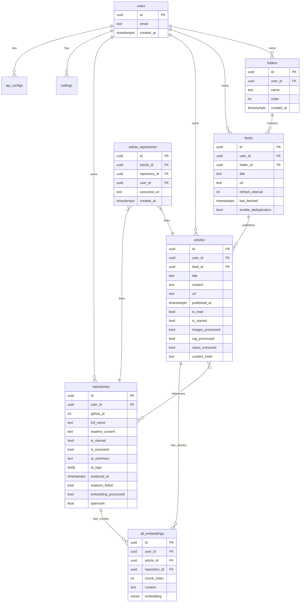
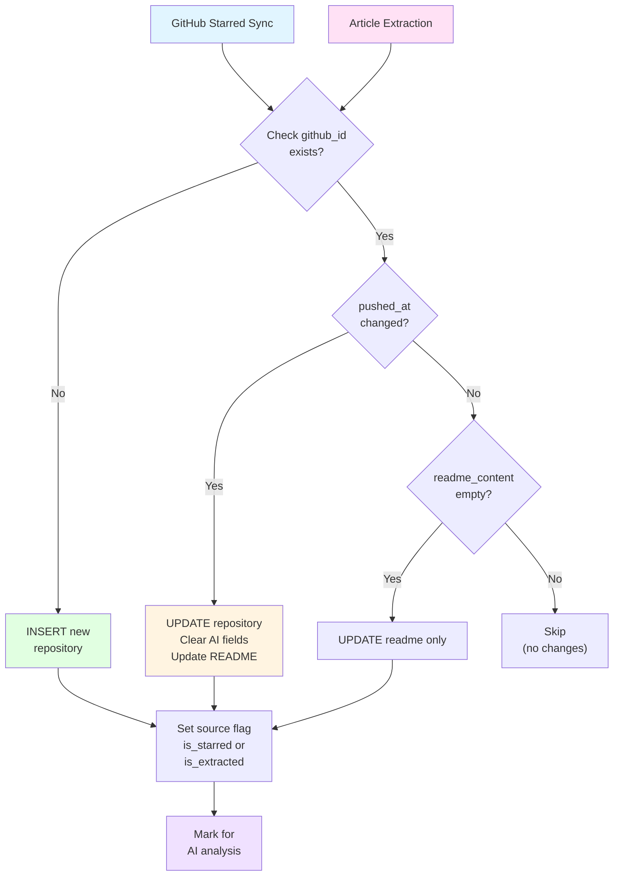
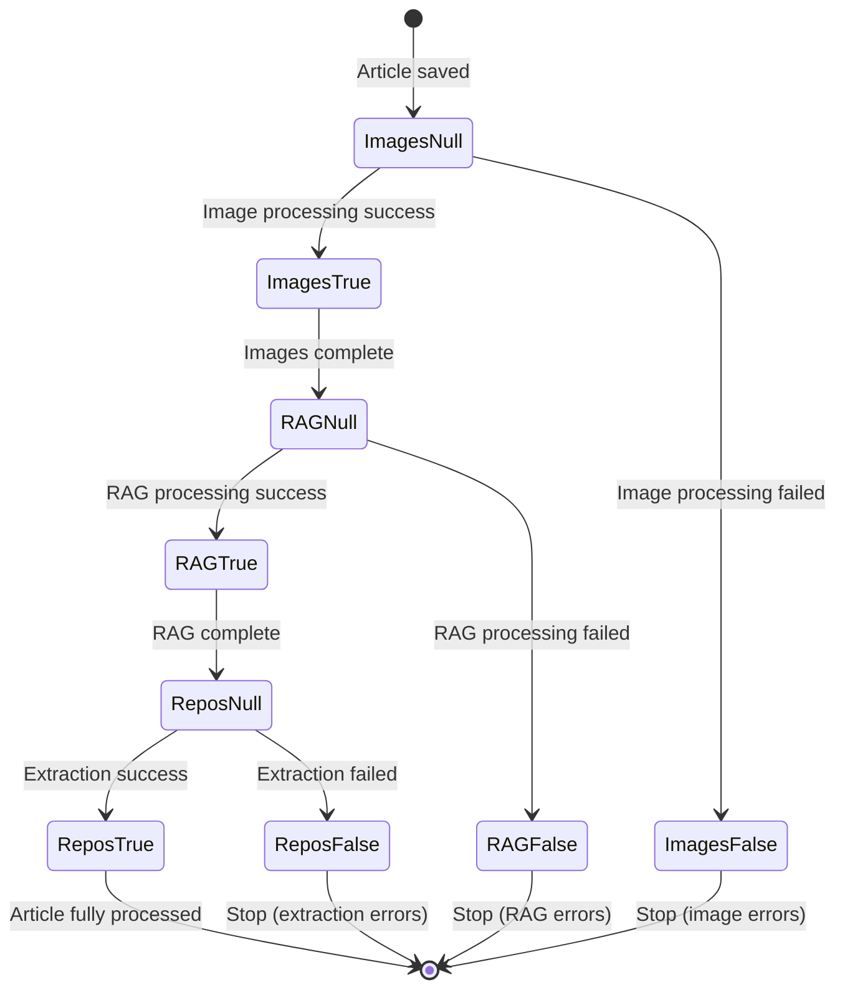
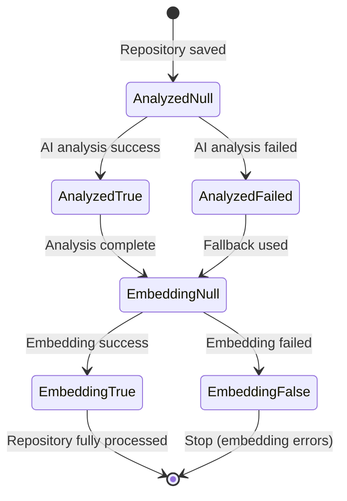

# Database Schema

<details>
<summary>Relevant source files</summary>

The following files were used as context for generating this wiki page:

- [backend/app/api/routers/articles.py](backend/app/api/routers/articles.py)
- [backend/app/api/routers/folders.py](backend/app/api/routers/folders.py)
- [backend/app/api/routers/proxy.py](backend/app/api/routers/proxy.py)
- [backend/app/api/routers/repositories.py](backend/app/api/routers/repositories.py)
- [backend/app/celery_app/repo_extractor.py](backend/app/celery_app/repo_extractor.py)
- [backend/app/celery_app/repository_tasks.py](backend/app/celery_app/repository_tasks.py)
- [backend/app/schemas/articles.py](backend/app/schemas/articles.py)
- [backend/app/schemas/repositories.py](backend/app/schemas/repositories.py)
- [backend/app/services/db/article_repositories.py](backend/app/services/db/article_repositories.py)
- [backend/app/services/db/articles.py](backend/app/services/db/articles.py)
- [backend/app/services/db/repositories.py](backend/app/services/db/repositories.py)
- [backend/app/services/github_extractor.py](backend/app/services/github_extractor.py)
- [backend/app/services/openrank_service.py](backend/app/services/openrank_service.py)
- [backend/app/services/repository_analyzer.py](backend/app/services/repository_analyzer.py)
- [backend/scripts/026_create_article_repositories.sql](backend/scripts/026_create_article_repositories.sql)
- [backend/scripts/027_add_repository_source_flags.sql](backend/scripts/027_add_repository_source_flags.sql)
- [backend/scripts/028_add_repos_extracted_status.sql](backend/scripts/028_add_repos_extracted_status.sql)
- [backend/scripts/030_add_repository_openrank.sql](backend/scripts/030_add_repository_openrank.sql)
- [frontend/components/article-content.tsx](frontend/components/article-content.tsx)
- [frontend/components/article-list.tsx](frontend/components/article-list.tsx)
- [frontend/components/article-repositories.tsx](frontend/components/article-repositories.tsx)
- [frontend/components/repository/repository-card.tsx](frontend/components/repository/repository-card.tsx)
- [frontend/components/repository/repository-page.tsx](frontend/components/repository/repository-page.tsx)
- [frontend/lib/api/repositories.ts](frontend/lib/api/repositories.ts)
- [frontend/lib/store/repositories.slice.ts](frontend/lib/store/repositories.slice.ts)
- [frontend/lib/types.ts](frontend/lib/types.ts)
- [frontend/lib/utils.ts](frontend/lib/utils.ts)
- [image/5.png](image/5.png)

</details>


This page documents the core PostgreSQL database schema used by SaveHub, including the main tables for articles, feeds, folders, and repositories, their relationships, status tracking fields, and migration strategy. The database is hosted on Supabase and uses Row Level Security (RLS) for multi-tenant isolation.

For vector embeddings storage and search functionality, see [Vector Embeddings](#7.2). For the service layer that performs CRUD operations on these tables, see [Database Service Layer](#7.3).

---

## Core Tables Overview

SaveHub's database schema centers around four main content types: RSS feeds, articles, GitHub repositories, and their interconnections. The schema uses UUID primary keys throughout and enforces user isolation via RLS policies.

**Entity Relationship Diagram**



**Sources:** [backend/scripts/026_create_article_repositories.sql](), [backend/app/services/db/articles.py:1-312](), [backend/app/services/db/repositories.py:1-565](), [frontend/lib/types.ts:1-147]()

---

## Articles Table

The `articles` table stores RSS feed article content with processing status flags that track the article through the background processing pipeline.

### Schema Structure

| Column | Type | Nullable | Description |
|--------|------|----------|-------------|
| `id` | UUID | NOT NULL | Primary key, client-generated for upsert support |
| `user_id` | UUID | NOT NULL | Foreign key to `auth.users` |
| `feed_id` | UUID | NOT NULL | Foreign key to `feeds` table |
| `title` | TEXT | NOT NULL | Article title |
| `content` | TEXT | NOT NULL | Full HTML content |
| `summary` | TEXT | NULL | Optional article summary/excerpt |
| `url` | TEXT | NOT NULL | Original article URL |
| `author` | TEXT | NULL | Article author name |
| `published_at` | TIMESTAMPTZ | NOT NULL | Original publication date |
| `is_read` | BOOLEAN | DEFAULT FALSE | User read status |
| `is_starred` | BOOLEAN | DEFAULT FALSE | User starred/favorite status |
| `thumbnail` | TEXT | NULL | Article thumbnail image URL |
| `content_hash` | TEXT | NULL | SHA-256 hash for deduplication |
| `created_at` | TIMESTAMPTZ | DEFAULT NOW() | Record creation timestamp |

### Processing Status Fields

These tri-state boolean fields (`NULL`/`TRUE`/`FALSE`) track the article's progress through the async processing pipeline:

| Column | Type | Meaning | Set By |
|--------|------|---------|--------|
| `images_processed` | BOOLEAN | NULL=not started, TRUE=success, FALSE=failed | Image processing tasks [backend/app/celery_app/image_processor.py]() |
| `rag_processed` | BOOLEAN | NULL=not started, TRUE=success, FALSE=failed | RAG processing tasks [backend/app/celery_app/rag_processor.py]() |
| `repos_extracted` | BOOLEAN | NULL=not started, TRUE=success, FALSE=failed | Repository extraction tasks [backend/app/celery_app/repo_extractor.py]() |
| `repos_extracted_at` | TIMESTAMPTZ | Last extraction attempt timestamp | Repository extractor |

### Indexes

```sql
-- Deduplication constraint (unique per feed+content_hash)
UNIQUE INDEX articles_feed_id_content_hash_key ON articles(feed_id, content_hash)

-- Performance indexes
INDEX idx_articles_user_id ON articles(user_id)
INDEX idx_articles_feed_id ON articles(feed_id)
INDEX idx_articles_published_at ON articles(published_at DESC)

-- Pipeline status indexes
INDEX idx_articles_rag_unprocessed ON articles(created_at DESC) 
  WHERE images_processed = TRUE AND rag_processed IS NULL

INDEX idx_articles_repos_unextracted ON articles(created_at DESC) 
  WHERE repos_extracted IS NULL
```

**Sources:** [backend/app/services/db/articles.py:1-312](), [backend/app/schemas/articles.py:1-69](), [backend/scripts/028_add_repos_extracted_status.sql]()

---

## Feeds and Folders Tables

### Feeds Table

The `feeds` table stores RSS feed subscriptions with refresh scheduling and deduplication settings.

| Column | Type | Default | Description |
|--------|------|---------|-------------|
| `id` | UUID | gen_random_uuid() | Primary key |
| `user_id` | UUID | NOT NULL | Foreign key to `auth.users` |
| `folder_id` | UUID | NULL | Foreign key to `folders` (optional) |
| `title` | TEXT | NOT NULL | Feed display name |
| `url` | TEXT | NOT NULL | RSS feed URL |
| `description` | TEXT | NULL | Feed description |
| `category` | TEXT | NULL | User-defined category |
| `order` | INT | 0 | Display order within folder |
| `refresh_interval` | INT | 60 | Minutes between refreshes (1-10080) |
| `last_fetched` | TIMESTAMPTZ | NULL | Last successful fetch timestamp |
| `last_fetch_status` | TEXT | NULL | 'success' or 'failed' |
| `last_fetch_error` | TEXT | NULL | Error message if failed |
| `enable_deduplication` | BOOLEAN | FALSE | Enable content hash deduplication |
| `created_at` | TIMESTAMPTZ | NOW() | Record creation timestamp |

### Folders Table

The `folders` table provides hierarchical organization for feeds.

| Column | Type | Default | Description |
|--------|------|---------|-------------|
| `id` | UUID | gen_random_uuid() | Primary key |
| `user_id` | UUID | NOT NULL | Foreign key to `auth.users` |
| `name` | TEXT | NOT NULL | Folder display name |
| `order` | INT | 0 | Display order in sidebar |
| `created_at` | TIMESTAMPTZ | NOW() | Record creation timestamp |

### Constraints

```sql
-- Feeds table
FOREIGN KEY (user_id) REFERENCES auth.users(id) ON DELETE CASCADE
FOREIGN KEY (folder_id) REFERENCES folders(id) ON DELETE SET NULL

-- Folders table
FOREIGN KEY (user_id) REFERENCES auth.users(id) ON DELETE CASCADE
UNIQUE (user_id, name)  -- Folder names must be unique per user
```

**Sources:** [frontend/lib/types.ts:3-31](), [backend/app/api/routers/folders.py:1-160](), [backend/app/api/routers/feeds.py]()

---

## Repositories Table

The `repositories` table stores GitHub repository metadata with dual-source tracking (starred repos vs. extracted from articles) and AI analysis results.

### Core Fields

| Column | Type | Nullable | Description |
|--------|------|----------|-------------|
| `id` | UUID | NOT NULL | Primary key |
| `user_id` | UUID | NOT NULL | Foreign key to `auth.users` |
| `github_id` | INT | NOT NULL | GitHub's numeric repository ID |
| `name` | TEXT | NOT NULL | Repository name (without owner) |
| `full_name` | TEXT | NOT NULL | Full name (owner/repo) |
| `description` | TEXT | NULL | GitHub repository description |
| `html_url` | TEXT | NOT NULL | GitHub repository URL |
| `stargazers_count` | INT | DEFAULT 0 | Star count from GitHub |
| `language` | TEXT | NULL | Primary programming language |
| `topics` | TEXT[] | DEFAULT '{}' | GitHub topics array |
| `owner_login` | TEXT | NOT NULL | Repository owner username |
| `owner_avatar_url` | TEXT | NULL | Owner's avatar URL |
| `readme_content` | TEXT | NULL | Raw README markdown content |

### Timestamps

| Column | Type | Description |
|--------|------|-------------|
| `starred_at` | TIMESTAMPTZ | When user starred (from GitHub API) |
| `github_created_at` | TIMESTAMPTZ | Repository creation date (from GitHub) |
| `github_updated_at` | TIMESTAMPTZ | Last updated timestamp (from GitHub) |
| `github_pushed_at` | TIMESTAMPTZ | Last code push timestamp (from GitHub) |
| `created_at` | TIMESTAMPTZ | Record creation in SaveHub |

### Source Tracking Flags

These boolean flags track where the repository came from, enabling different display and filtering logic:

| Column | Type | Default | Description |
|--------|------|---------|-------------|
| `is_starred` | BOOLEAN | FALSE | Repository from GitHub starred sync |
| `is_extracted` | BOOLEAN | FALSE | Repository extracted from article content |

A repository can have both flags set to `TRUE` if it was first extracted from an article, then later the user starred it on GitHub.

### AI Analysis Fields

| Column | Type | Nullable | Description |
|--------|------|----------|-------------|
| `ai_summary` | TEXT | NULL | AI-generated repository summary |
| `ai_tags` | TEXT[] | NULL | AI-extracted tags/keywords |
| `ai_platforms` | TEXT[] | NULL | AI-detected supported platforms |
| `analyzed_at` | TIMESTAMPTZ | NULL | AI analysis completion timestamp |
| `analysis_failed` | BOOLEAN | DEFAULT FALSE | TRUE if AI analysis failed (enables retry) |

### Processing Status

| Column | Type | Default | Description |
|--------|------|---------|-------------|
| `embedding_processed` | BOOLEAN | NULL | NULL=not started, TRUE=success, FALSE=failed |
| `openrank` | FLOAT | NULL | OpenRank influence score from open-digger |

### Custom Fields (User Editable)

| Column | Type | Description |
|--------|------|-------------|
| `custom_description` | TEXT | User's custom description (overrides AI/GitHub) |
| `custom_tags` | TEXT[] | User-defined tags |
| `custom_category` | TEXT | User-defined category |
| `last_edited` | TIMESTAMPTZ | Last user edit timestamp |

### Unique Constraint

```sql
UNIQUE INDEX repositories_user_id_github_id_key 
  ON repositories(user_id, github_id)
```

This ensures each GitHub repository appears at most once per user, regardless of source (starred vs. extracted).

**Repository Upsert Flow Diagram**



**Sources:** [backend/app/services/db/repositories.py:1-565](), [backend/scripts/027_add_repository_source_flags.sql](), [backend/scripts/030_add_repository_openrank.sql](), [backend/app/schemas/repositories.py:1-61]()

---

## Article-Repository Junction Table

The `article_repositories` table implements the many-to-many relationship between articles and repositories, tracking which GitHub repos are mentioned in which articles.

### Schema Structure

| Column | Type | Nullable | Description |
|--------|------|----------|-------------|
| `id` | UUID | NOT NULL | Primary key |
| `article_id` | UUID | NOT NULL | Foreign key to `articles` |
| `repository_id` | UUID | NOT NULL | Foreign key to `repositories` |
| `user_id` | UUID | NOT NULL | Foreign key to `auth.users` (denormalized) |
| `extracted_url` | TEXT | NOT NULL | Original GitHub URL found in article |
| `created_at` | TIMESTAMPTZ | DEFAULT NOW() | Link creation timestamp |

### Constraints and Indexes

```sql
-- Prevent duplicate links
UNIQUE CONSTRAINT article_repositories_unique 
  ON (article_id, repository_id)

-- Foreign keys with cascading deletes
FOREIGN KEY (article_id) REFERENCES articles(id) ON DELETE CASCADE
FOREIGN KEY (repository_id) REFERENCES repositories(id) ON DELETE CASCADE
FOREIGN KEY (user_id) REFERENCES auth.users(id) ON DELETE CASCADE

-- Performance indexes
INDEX idx_article_repos_article_id ON article_repositories(article_id)
INDEX idx_article_repos_repository_id ON article_repositories(repository_id)
INDEX idx_article_repos_user_id ON article_repositories(user_id)
```

### Usage Pattern

The junction table is populated by the repository extraction pipeline [backend/app/celery_app/repo_extractor.py]():

1. **Explicit extraction**: BeautifulSoup parses HTML for GitHub URLs
2. **Implicit extraction**: AI identifies mentioned repositories without links
3. **Deduplication**: (owner, repo) tuples are normalized to lowercase
4. **Repository fetching**: GitHub API fetches metadata for unknown repos
5. **Junction creation**: Links are bulk-inserted with `extracted_url` preserved

The frontend displays linked repositories in the article viewer [frontend/components/article-repositories.tsx]() and shows repository counts in article lists [frontend/lib/types.ts:46]().

**Sources:** [backend/scripts/026_create_article_repositories.sql](), [backend/app/services/db/article_repositories.py:1-148](), [backend/app/celery_app/repo_extractor.py:134-264]()

---

## Processing Status Field Pattern

SaveHub uses a tri-state boolean pattern (`NULL`/`TRUE`/`FALSE`) to track async processing stages, enabling precise pipeline control and error recovery.

### Status Semantics

| Value | Meaning | Action |
|-------|---------|--------|
| `NULL` | Not yet processed | Schedule processing task |
| `TRUE` | Processing succeeded | Skip (already complete) |
| `FALSE` | Processing failed | Skip permanently (unless manual retry) |

### Articles Pipeline States



### Repositories Pipeline States



### Compensatory Scan Tasks

Celery Beat runs periodic scans to catch articles/repositories that slipped through the pipeline due to worker crashes or network issues:

| Task | Schedule | Query Condition | Purpose |
|------|----------|-----------------|---------|
| `scan_pending_rag_articles` | Every 30 min | `images_processed = TRUE AND rag_processed IS NULL` | Retry RAG processing |
| `scan_pending_repo_extraction` | Every 30 min | `images_processed = TRUE AND repos_extracted IS NULL` | Retry repo extraction |
| `scan_due_feeds` | Every 1 min | `last_fetched + refresh_interval < NOW()` | Trigger feed refresh |

**Sources:** [backend/app/celery_app/rag_processor.py](), [backend/app/celery_app/repo_extractor.py:365-401](), [backend/scripts/028_add_repos_extracted_status.sql]()

---

## Settings and Configuration Tables

### Settings Table

The `settings` table stores user preferences and integrations as JSONB:

| Column | Type | Description |
|--------|------|-------------|
| `id` | UUID | Primary key |
| `user_id` | UUID | Foreign key to `auth.users` (UNIQUE) |
| `github_token` | TEXT | Encrypted GitHub Personal Access Token |
| `articles_retention_days` | INT | Days to keep old articles (default 30) |
| `theme` | TEXT | UI theme preference |
| `font_size` | INT | Article reader font size |
| `created_at` | TIMESTAMPTZ | Record creation timestamp |
| `updated_at` | TIMESTAMPTZ | Last update timestamp |

The `github_token` is used to sync starred repositories [backend/app/celery_app/repository_tasks.py:539-555]() and fetch README content with higher rate limits.

### API Configs Table

The `api_configs` table stores encrypted AI provider credentials:

| Column | Type | Description |
|--------|------|-------------|
| `id` | UUID | Primary key |
| `user_id` | UUID | Foreign key to `auth.users` |
| `type` | TEXT | 'chat', 'embedding', or 'rerank' |
| `name` | TEXT | User-defined config name |
| `api_key` | TEXT | Encrypted API key |
| `api_base` | TEXT | Encrypted API base URL |
| `model` | TEXT | Model name (plaintext) |
| `is_active` | BOOLEAN | Active config for this type |
| `created_at` | TIMESTAMPTZ | Record creation timestamp |

Only one config per type can be active at a time. The encryption/decryption is handled by [backend/app/api/routers/api_configs.py]() using Fernet symmetric encryption.

**Sources:** [backend/app/services/db/settings.py](), [backend/app/api/routers/api_configs.py](), [frontend/lib/types.ts:49-75]()

---

## Row Level Security (RLS) Policies

All user-owned tables enforce Row Level Security to ensure multi-tenant data isolation. Each table has three standard policies:

### Standard RLS Policy Pattern

```sql
-- SELECT policy
CREATE POLICY "Users can view own records"
  ON table_name FOR SELECT
  USING (auth.uid() = user_id);

-- INSERT policy
CREATE POLICY "Users can insert own records"
  ON table_name FOR INSERT
  WITH CHECK (auth.uid() = user_id);

-- DELETE policy
CREATE POLICY "Users can delete own records"
  ON table_name FOR DELETE
  USING (auth.uid() = user_id);
```

### Tables with RLS Enabled

- `folders`
- `feeds`
- `articles`
- `repositories`
- `article_repositories`
- `all_embeddings`
- `settings`
- `api_configs`

The `auth.uid()` function returns the authenticated user's UUID from Supabase JWT. Backend Celery tasks bypass RLS by using the service role key [backend/app/celery_app/supabase_client.py]().

**Sources:** [backend/scripts/026_create_article_repositories.sql:34-47]()

---

## Migration Strategy

SaveHub uses numbered SQL migration scripts (`NNN_description.sql`) that are applied sequentially. Migrations are tracked manually and applied via Supabase SQL Editor or CLI.

### Migration Script Naming Convention

```
backend/scripts/
  001_initial_schema.sql
  026_create_article_repositories.sql
  027_add_repository_source_flags.sql
  028_add_repos_extracted_status.sql
  030_add_repository_openrank.sql
```

### Safe Migration Patterns

1. **Add columns with defaults**: New columns are `NULL` or have safe defaults
2. **Backfill existing data**: UPDATE statements set sensible values for existing rows
3. **Create indexes concurrently**: Avoid table locks on large tables
4. **Use IF NOT EXISTS**: Migrations are idempotent and can be re-run

### Example: Adding Processing Status Field

```sql
-- Add new status column (tri-state boolean)
ALTER TABLE articles
  ADD COLUMN IF NOT EXISTS repos_extracted BOOLEAN;

-- Add timestamp for tracking
ALTER TABLE articles
  ADD COLUMN IF NOT EXISTS repos_extracted_at TIMESTAMPTZ;

-- Create index for pipeline queries
CREATE INDEX IF NOT EXISTS idx_articles_repos_unextracted
  ON articles(created_at DESC)
  WHERE repos_extracted IS NULL;

-- Add comments for documentation
COMMENT ON COLUMN articles.repos_extracted IS
  'NULL=not yet extracted, TRUE=extraction succeeded, FALSE=extraction failed';
```

This pattern is used consistently across [backend/scripts/028_add_repos_extracted_status.sql](), [backend/scripts/027_add_repository_source_flags.sql](), and [backend/scripts/030_add_repository_openrank.sql]().

**Sources:** [backend/scripts/026_create_article_repositories.sql](), [backend/scripts/027_add_repository_source_flags.sql](), [backend/scripts/028_add_repos_extracted_status.sql](), [backend/scripts/030_add_repository_openrank.sql]()