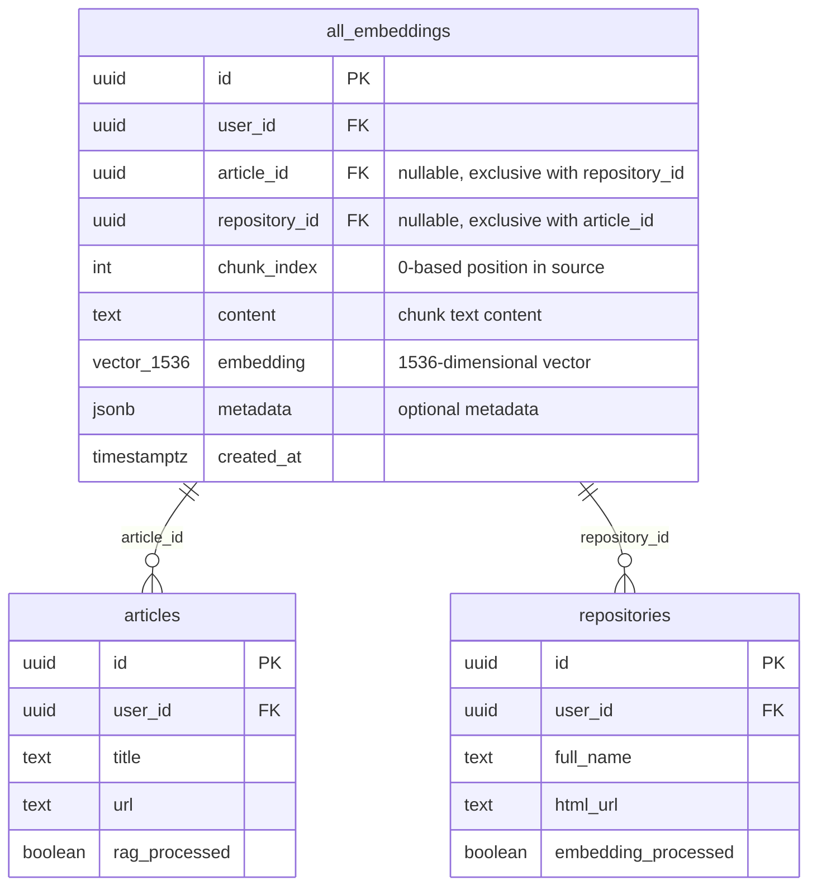
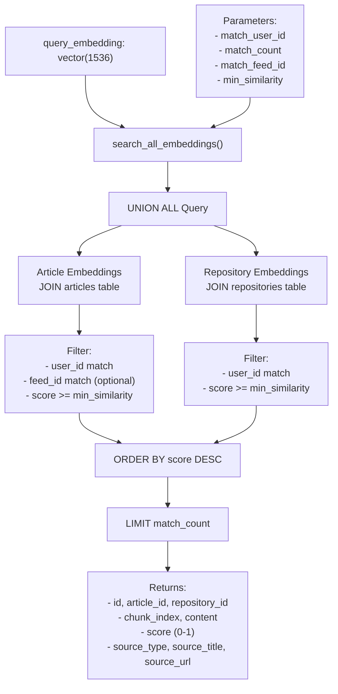
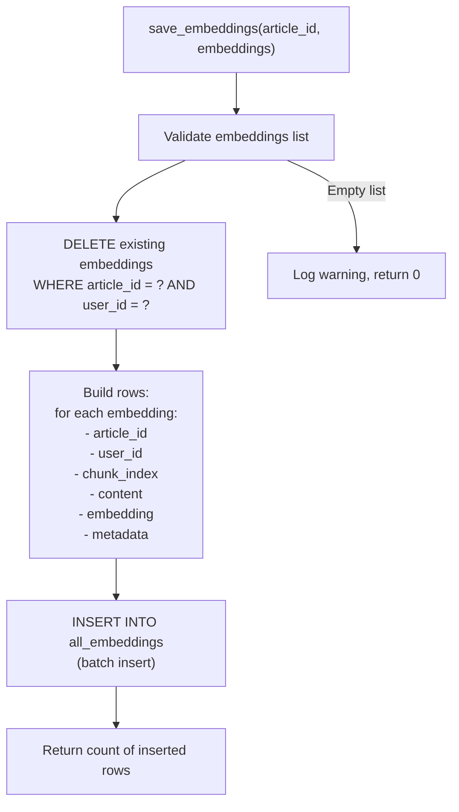
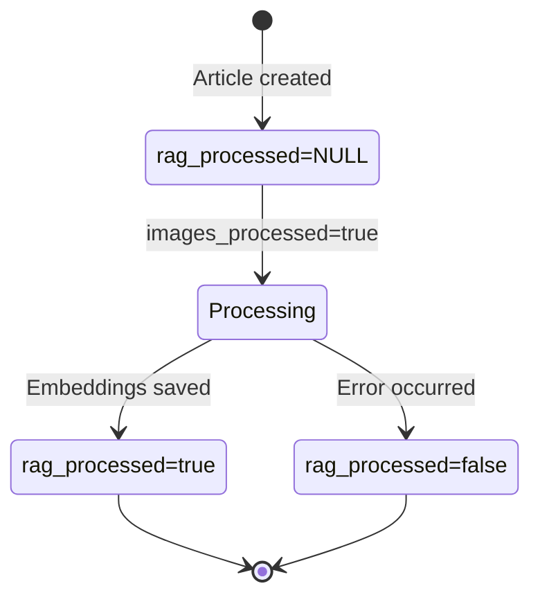

# Vector Embeddings

<details>
<summary>Relevant source files</summary>

The following files were used as context for generating this wiki page:

- [backend/app/api/routers/rag.py](backend/app/api/routers/rag.py)
- [backend/app/celery_app/rag_processor.py](backend/app/celery_app/rag_processor.py)
- [backend/app/services/ai/CLAUDE.md](backend/app/services/ai/CLAUDE.md)
- [backend/app/services/ai/__init__.py](backend/app/services/ai/__init__.py)
- [backend/app/services/ai/clients.py](backend/app/services/ai/clients.py)
- [backend/app/services/ai/config.py](backend/app/services/ai/config.py)
- [backend/app/services/ai/repository_service.py](backend/app/services/ai/repository_service.py)
- [backend/app/services/db/rag.py](backend/app/services/db/rag.py)
- [backend/app/services/rag/CLAUDE.md](backend/app/services/rag/CLAUDE.md)
- [backend/app/services/rag/__init__.py](backend/app/services/rag/__init__.py)
- [backend/app/services/rag/chunker.py](backend/app/services/rag/chunker.py)
- [backend/app/services/rag/retriever.py](backend/app/services/rag/retriever.py)
- [backend/scripts/029_rename_article_embeddings_to_all_embeddings.sql](backend/scripts/029_rename_article_embeddings_to_all_embeddings.sql)
- [backend/scripts/031_add_repository_embeddings.sql](backend/scripts/031_add_repository_embeddings.sql)
- [backend/scripts/032_fix_all_embeddings_article_id_nullable.sql](backend/scripts/032_fix_all_embeddings_article_id_nullable.sql)
- [docs/RSS_subscribe/RSS_FLOW_COMPLETE.md](docs/RSS_subscribe/RSS_FLOW_COMPLETE.md)

</details>


## Purpose and Scope

This document describes the vector embedding storage architecture that powers SaveHub's semantic search capabilities. Vector embeddings are high-dimensional numerical representations of text content that enable similarity-based retrieval across both articles and repositories.

**Scope covered:**
- The `all_embeddings` table schema and design
- pgvector integration for cosine similarity search
- Article vs repository embedding storage patterns
- The `search_all_embeddings` RPC function
- Indexing strategies for performance

**Related pages:**
- For embedding generation from article content, see [RAG Processing Pipeline](#6.4)
- For repository embedding generation, see [Repository Synchronization](#6.2)
- For semantic search implementation, see [RAG & Search Services](#5.4)
- For embedding client configuration, see [Chat & Embedding Clients](#8.2)

---

## Table Architecture

### Core Schema

The `all_embeddings` table stores vector embeddings for both articles and repositories in a unified structure. This design enables cross-content semantic search while maintaining data isolation per user.



**Sources:** [backend/scripts/029_rename_article_embeddings_to_all_embeddings.sql:1-104](), [backend/scripts/031_add_repository_embeddings.sql:1-155](), [backend/scripts/032_fix_all_embeddings_article_id_nullable.sql:1-19]()

### Field Definitions

| Field | Type | Nullable | Description |
|-------|------|----------|-------------|
| `id` | UUID | No | Primary key |
| `user_id` | UUID | No | User isolation (foreign key to auth.users) |
| `article_id` | UUID | Yes | Source article (mutually exclusive with `repository_id`) |
| `repository_id` | UUID | Yes | Source repository (mutually exclusive with `article_id`) |
| `chunk_index` | INTEGER | No | Sequential position of chunk in source content (0-based) |
| `content` | TEXT | No | The actual text content of this chunk |
| `embedding` | vector(1536) | No | 1536-dimensional vector generated by embedding model |
| `metadata` | JSONB | Yes | Optional extensible metadata |
| `created_at` | TIMESTAMPTZ | No | Creation timestamp |

**Sources:** [backend/scripts/029_rename_article_embeddings_to_all_embeddings.sql:99-103](), [backend/scripts/031_add_repository_embeddings.sql:152-154]()

### Mutual Exclusivity Constraint

A critical design constraint ensures each embedding belongs to exactly one source type:

```sql
ALTER TABLE all_embeddings
ADD CONSTRAINT chk_source_exclusive
CHECK (
    (article_id IS NOT NULL AND repository_id IS NULL) OR
    (article_id IS NULL AND repository_id IS NOT NULL)
);
```

This constraint enforces that:
- An embedding row must have either `article_id` OR `repository_id` set
- Both cannot be NULL
- Both cannot be set simultaneously

**Sources:** [backend/scripts/031_add_repository_embeddings.sql:56-70]()

---

## pgvector Integration

### Vector Type and Operators

SaveHub uses PostgreSQL's pgvector extension to store and query high-dimensional vectors. The embedding field uses the `vector(1536)` type, matching OpenAI's `text-embedding-3-small` model output.

**Distance operator:** The cosine distance operator `<=>` is used for similarity calculations:

```sql
-- Cosine distance (0 = identical, 2 = opposite)
embedding <=> query_embedding

-- Cosine similarity (0-1 scale, higher = more similar)
1 - (embedding <=> query_embedding) AS score
```

### Why 1536 Dimensions?

The dimension count (1536) is determined by the embedding model configured by users. OpenAI's `text-embedding-3-small` model outputs 1536-dimensional vectors by default, providing a good balance between:
- Semantic representation quality
- Storage efficiency
- Query performance

**Sources:** [backend/scripts/029_rename_article_embeddings_to_all_embeddings.sql:102](), [backend/app/services/rag/retriever.py:183-232]()

---

## Source Type Handling

### Article Embeddings

Article embeddings are generated after image processing completes. The content includes:
- Article title and author metadata
- Main text content with semantic chunking
- Image captions inserted at original positions (formatted as `[图片描述: caption]`)

**Storage pattern:**
```python
{
    "article_id": "uuid-string",
    "repository_id": None,
    "chunk_index": 0,
    "content": "标题：Article Title\n\n[图片描述: A chart showing...]\n\nMain content...",
    "embedding": [0.123, -0.456, ...],  # 1536 floats
}
```

**Sources:** [backend/app/services/db/rag.py:27-87](), [backend/app/celery_app/rag_processor.py:214-242]()

### Repository Embeddings

Repository embeddings are generated from README content after AI analysis completes. The content is semantically chunked without image caption integration.

**Storage pattern:**
```python
{
    "article_id": None,
    "repository_id": "uuid-string",
    "chunk_index": 0,
    "content": "# Repository Name\n\nDescription and usage...",
    "embedding": [0.789, -0.234, ...],  # 1536 floats
}
```

**Skipping conditions:** Repository embeddings are skipped when:
1. `readme_content` is empty or NULL
2. Embeddings already exist for the repository (idempotent)

**Sources:** [backend/app/services/db/rag.py:269-327](), [backend/scripts/031_add_repository_embeddings.sql:32-38]()

---

## Vector Search Function

### search_all_embeddings RPC

The `search_all_embeddings` PostgreSQL function performs unified semantic search across both articles and repositories using vector similarity.



**Sources:** [backend/scripts/031_add_repository_embeddings.sql:75-146]()

### Function Signature

```sql
CREATE OR REPLACE FUNCTION search_all_embeddings(
    query_embedding vector(1536),
    match_user_id uuid,
    match_count int DEFAULT 10,
    match_feed_id uuid DEFAULT NULL,
    min_similarity float DEFAULT 0.0
)
RETURNS TABLE (
    id uuid,
    article_id uuid,
    repository_id uuid,
    chunk_index int,
    content text,
    score float,
    source_type text,
    source_title text,
    source_url text
)
```

### Return Fields

| Field | Type | Description |
|-------|------|-------------|
| `id` | UUID | Embedding record ID |
| `article_id` | UUID | Source article ID (NULL for repositories) |
| `repository_id` | UUID | Source repository ID (NULL for articles) |
| `chunk_index` | INTEGER | Position of chunk in source |
| `content` | TEXT | Chunk text content |
| `score` | FLOAT | Cosine similarity score (0-1, higher = more similar) |
| `source_type` | TEXT | `'article'` or `'repository'` |
| `source_title` | TEXT | Article title or repository full name |
| `source_url` | TEXT | Article URL or repository HTML URL |

**Sources:** [backend/scripts/031_add_repository_embeddings.sql:85-95]()

### Query Logic

The RPC function executes a `UNION ALL` query to search both source types:

**Article branch:**
```sql
SELECT
    e.id,
    e.article_id,
    NULL::uuid AS repository_id,
    e.chunk_index,
    e.content,
    1 - (e.embedding <=> query_embedding) AS score,
    'article'::text AS source_type,
    a.title AS source_title,
    a.url AS source_url
FROM all_embeddings e
JOIN articles a ON e.article_id = a.id
WHERE e.user_id = match_user_id
  AND e.article_id IS NOT NULL
  AND (match_feed_id IS NULL OR a.feed_id = match_feed_id)
  AND 1 - (e.embedding <=> query_embedding) >= min_similarity
```

**Repository branch:**
```sql
SELECT
    e.id,
    NULL::uuid AS article_id,
    e.repository_id,
    e.chunk_index,
    e.content,
    1 - (e.embedding <=> query_embedding) AS score,
    'repository'::text AS source_type,
    r.full_name AS source_title,
    r.html_url AS source_url
FROM all_embeddings e
JOIN repositories r ON e.repository_id = r.id
WHERE e.user_id = match_user_id
  AND e.repository_id IS NOT NULL
  AND match_feed_id IS NULL
  AND 1 - (e.embedding <=> query_embedding) >= min_similarity
```

**Note:** The `match_feed_id` parameter only applies to article embeddings. Repository embeddings ignore this filter since repositories are not associated with feeds.

**Sources:** [backend/scripts/031_add_repository_embeddings.sql:100-142]()

---

## Indexing Strategies

### Vector Index

pgvector supports two index types for approximate nearest neighbor (ANN) search:

**IVFFLAT Index:**
```sql
CREATE INDEX idx_all_embeddings_vector 
ON all_embeddings 
USING ivfflat (embedding vector_cosine_ops)
WITH (lists = 100);
```

**HNSW Index (recommended for better recall):**
```sql
CREATE INDEX idx_all_embeddings_vector 
ON all_embeddings 
USING hnsw (embedding vector_cosine_ops)
WITH (m = 16, ef_construction = 64);
```

The vector index dramatically improves search performance for large embedding sets by enabling approximate nearest neighbor search instead of exhaustive comparison.

**Sources:** [backend/scripts/029_rename_article_embeddings_to_all_embeddings.sql:22]()

### User Isolation Indexes

```sql
-- Query by user
CREATE INDEX IF NOT EXISTS idx_all_embeddings_user
  ON all_embeddings(user_id);

-- Query by user + article (for article-specific operations)
CREATE INDEX IF NOT EXISTS idx_all_embeddings_user_source
  ON all_embeddings(user_id, article_id);

-- Query by user + repository
CREATE INDEX IF NOT EXISTS idx_all_embeddings_user_repository
  ON all_embeddings(user_id, repository_id);
```

These indexes support:
- User-scoped embedding queries (enforcing data isolation)
- Deletion of all embeddings for a specific article/repository
- Checking existence of embeddings before regeneration

**Sources:** [backend/scripts/029_rename_article_embeddings_to_all_embeddings.sql:19-21](), [backend/scripts/031_add_repository_embeddings.sql:45-50]()

### Source-Specific Indexes

```sql
-- Query by article
CREATE INDEX IF NOT EXISTS idx_all_embeddings_source
  ON all_embeddings(article_id);

-- Query by repository
CREATE INDEX IF NOT EXISTS idx_all_embeddings_repository
  ON all_embeddings(repository_id);
```

**Sources:** [backend/scripts/029_rename_article_embeddings_to_all_embeddings.sql:19](), [backend/scripts/031_add_repository_embeddings.sql:45-46]()

### Partial Index for Pending Processing

```sql
CREATE INDEX IF NOT EXISTS idx_repositories_embedding_unprocessed
  ON repositories (created_at DESC)
  WHERE embedding_processed IS NULL AND readme_content IS NOT NULL;
```

This partial index optimizes the query for finding repositories that need embedding generation, used by compensatory scans.

**Sources:** [backend/scripts/031_add_repository_embeddings.sql:36-38]()

---

## CRUD Operations via RagService

### Save Article Embeddings

The `RagService.save_embeddings()` method handles article embedding persistence with idempotent behavior:



**Implementation:**

```python
def save_embeddings(self, article_id: str, embeddings: List[Dict]) -> int:
    # 1. Delete existing (idempotent)
    self.supabase.table("all_embeddings") \
        .delete() \
        .eq("article_id", article_id) \
        .eq("user_id", self.user_id) \
        .execute()

    # 2. Build rows
    rows = [{
        "article_id": article_id,
        "user_id": self.user_id,
        "chunk_index": emb["chunk_index"],
        "content": emb["content"],
        "embedding": emb["embedding"],
        "metadata": emb.get("metadata"),
    } for emb in embeddings]

    # 3. Batch insert
    result = self.supabase.table("all_embeddings").insert(rows).execute()
    return len(result.data)
```

**Sources:** [backend/app/services/db/rag.py:27-87]()

### Save Repository Embeddings

The `RagService.save_repository_embeddings()` method includes additional validation:

```python
def save_repository_embeddings(self, repository_id: str, embeddings: List[Dict]) -> int:
    # 1. Check readme_content exists
    repo = self.supabase.table("repositories") \
        .select("readme_content") \
        .eq("id", repository_id) \
        .single().execute()
    
    if not repo.data or not repo.data.get("readme_content"):
        return 0  # Skip

    # 2. Check if embeddings already exist
    existing = self.supabase.table("all_embeddings") \
        .select("id") \
        .eq("repository_id", repository_id) \
        .limit(1).execute()
    
    if existing.data:
        return 0  # Skip (idempotent)

    # 3. Insert (no deletion needed since we checked for existence)
    rows = [{
        "repository_id": repository_id,
        "user_id": self.user_id,
        "chunk_index": emb["chunk_index"],
        "content": emb["content"],
        "embedding": emb["embedding"],
        "metadata": emb.get("metadata"),
    } for emb in embeddings]

    result = self.supabase.table("all_embeddings").insert(rows).execute()
    return len(result.data)
```

**Sources:** [backend/app/services/db/rag.py:269-327]()

### Delete Embeddings

```python
# Delete article embeddings
def delete_all_embeddings(self, article_id: str) -> None:
    self.supabase.table("all_embeddings") \
        .delete() \
        .eq("article_id", article_id) \
        .eq("user_id", self.user_id) \
        .execute()

# Delete repository embeddings
def delete_repository_embeddings(self, repository_id: str) -> None:
    self.supabase.table("all_embeddings") \
        .delete() \
        .eq("repository_id", repository_id) \
        .eq("user_id", self.user_id) \
        .execute()
```

**Cascade behavior:** Foreign key constraints ensure embeddings are automatically deleted when the source article or repository is deleted:

```sql
ALTER TABLE all_embeddings
ADD CONSTRAINT fk_article
FOREIGN KEY (article_id) REFERENCES articles(id) ON DELETE CASCADE;

ALTER TABLE all_embeddings
ADD CONSTRAINT fk_repository
FOREIGN KEY (repository_id) REFERENCES repositories(id) ON DELETE CASCADE;
```

**Sources:** [backend/app/services/db/rag.py:89-108](), [backend/app/services/db/rag.py:328-339](), [backend/scripts/031_add_repository_embeddings.sql:14-26]()

---

## Integration with Search Services

### Python Client Usage

The `RagService.search()` method wraps the `search_all_embeddings` RPC:

```python
def search(
    self,
    query_embedding: List[float],
    top_k: int = 10,
    feed_id: Optional[str] = None,
    min_score: float = 0.0,
) -> List[Dict[str, Any]]:
    from app.services.rag.retriever import search_embeddings
    
    return search_embeddings(
        supabase=self.supabase,
        query_embedding=query_embedding,
        user_id=self.user_id,
        top_k=top_k,
        feed_id=feed_id,
        min_score=min_score,
    )
```

**Sources:** [backend/app/services/db/rag.py:235-263]()

### RAG Query API Flow


**Sources:** [backend/app/api/routers/rag.py:83-149](), [backend/app/services/rag/retriever.py:15-77]()

### Retriever Context Building

The `get_context_for_answer()` function formats search results for LLM prompts:

```python
def get_context_for_answer(hits: List[Dict], max_length: int = 6000) -> str:
    context_parts = []
    for i, hit in enumerate(hits, 1):
        article_title = hit.get("article_title") or hit.get("source_title", "未知来源")
        content = hit.get("content", "")
        score = hit.get("score", 0)
        
        snippet = (
            f"[来源 {i}] (相关度: {score:.2f})\n"
            f"来源: {article_title}\n"
            f"内容: {content[:500]}...\n"
        )
        
        if len("\n---\n".join(context_parts + [snippet])) > max_length:
            break
        context_parts.append(snippet)
    
    return "\n---\n".join(context_parts)
```

**Sources:** [backend/app/services/rag/retriever.py:139-179]()

---

## Status Tracking

### Article RAG Status

Status tracking for article embedding processing:

| Field | Type | Values | Description |
|-------|------|--------|-------------|
| `rag_processed` | BOOLEAN | NULL / true / false | NULL = pending, true = success, false = failed |
| `rag_processed_at` | TIMESTAMPTZ | - | Processing timestamp |

**Status transitions:**



**Sources:** [backend/app/services/db/rag.py:132-156]()

### Repository Embedding Status

Status tracking for repository embedding processing:

| Field | Type | Values | Description |
|-------|------|--------|-------------|
| `embedding_processed` | BOOLEAN | NULL / true / false | NULL = pending, true = success, false = failed |
| `embedding_processed_at` | TIMESTAMPTZ | - | Processing timestamp |

**Update method:**

```python
def mark_repository_embedding_processed(self, repository_id: str, success: bool = True) -> None:
    update_data = {
        "embedding_processed": success,
        "embedding_processed_at": datetime.now(timezone.utc).isoformat(),
    }
    self.supabase.table("repositories") \
        .update(update_data) \
        .eq("id", repository_id) \
        .eq("user_id", self.user_id) \
        .execute()
```

**Sources:** [backend/app/services/db/rag.py:341-356](), [backend/scripts/031_add_repository_embeddings.sql:32-34]()

---

## Performance Considerations

### Vector Index Trade-offs

| Index Type | Build Time | Query Speed | Recall | Memory |
|------------|------------|-------------|--------|--------|
| **No Index** | - | Slow (full scan) | 100% | Low |
| **IVFFLAT** | Fast | Fast | ~90-95% | Medium |
| **HNSW** | Slow | Very Fast | ~95-99% | High |

**Recommendation:** Use HNSW for production workloads with >10K embeddings.

### Batch Insert Performance

Both `save_embeddings()` and `save_repository_embeddings()` use batch inserts for efficiency:

```python
# Single INSERT with multiple rows
rows = [{"article_id": ..., "embedding": ...} for emb in embeddings]
result = self.supabase.table("all_embeddings").insert(rows).execute()
```

**Performance:** Batch inserts reduce round-trips from O(n) to O(1), critical when processing articles with 10-50 chunks.

**Sources:** [backend/app/services/db/rag.py:74-76](), [backend/app/services/db/rag.py:320]()

### User Data Isolation

All queries enforce user isolation via the `user_id` filter:

```python
.eq("user_id", self.user_id)
```

This ensures:
- Users cannot access other users' embeddings
- Row-Level Security (RLS) provides additional protection
- Indexes on `(user_id, article_id)` optimize these queries

**Sources:** [backend/app/services/db/rag.py:57](), [backend/scripts/029_rename_article_embeddings_to_all_embeddings.sql:28-32]()

---

## Statistics and Monitoring

### RAG Statistics

The `get_rag_stats()` method provides overview metrics:

```python
def get_rag_stats(self) -> Dict[str, Any]:
    # Article counts
    articles_result = self.supabase.table("articles") \
        .select("id, rag_processed, images_processed", count="exact") \
        .eq("user_id", self.user_id) \
        .execute()

    total_articles = articles_result.count or 0
    rag_processed = sum(1 for a in articles_result.data if a.get("rag_processed") is True)
    rag_pending = sum(1 for a in articles_result.data 
                      if a.get("images_processed") is True and a.get("rag_processed") is None)

    # Embedding counts
    embeddings_result = self.supabase.table("all_embeddings") \
        .select("id", count="exact") \
        .eq("user_id", self.user_id) \
        .execute()

    return {
        "total_articles": total_articles,
        "rag_processed": rag_processed,
        "rag_pending": rag_pending,
        "total_embeddings": embeddings_result.count or 0,
    }
```

**Returns:**
- `total_articles`: All articles for user
- `rag_processed`: Articles with embeddings successfully generated
- `rag_pending`: Articles ready for embedding (images processed, embeddings pending)
- `total_embeddings`: Total embedding chunks stored

**Sources:** [backend/app/services/db/rag.py:179-229](), [backend/app/api/routers/rag.py:152-162]()