# Database Service Layer

<details>
<summary>Relevant source files</summary>

The following files were used as context for generating this wiki page:

- [backend/app/api/routers/articles.py](backend/app/api/routers/articles.py)
- [backend/app/api/routers/folders.py](backend/app/api/routers/folders.py)
- [backend/app/api/routers/proxy.py](backend/app/api/routers/proxy.py)
- [backend/app/api/routers/rag.py](backend/app/api/routers/rag.py)
- [backend/app/api/routers/repositories.py](backend/app/api/routers/repositories.py)
- [backend/app/celery_app/rag_processor.py](backend/app/celery_app/rag_processor.py)
- [backend/app/celery_app/repository_tasks.py](backend/app/celery_app/repository_tasks.py)
- [backend/app/schemas/articles.py](backend/app/schemas/articles.py)
- [backend/app/schemas/repositories.py](backend/app/schemas/repositories.py)
- [backend/app/services/ai/CLAUDE.md](backend/app/services/ai/CLAUDE.md)
- [backend/app/services/ai/__init__.py](backend/app/services/ai/__init__.py)
- [backend/app/services/ai/clients.py](backend/app/services/ai/clients.py)
- [backend/app/services/ai/config.py](backend/app/services/ai/config.py)
- [backend/app/services/ai/repository_service.py](backend/app/services/ai/repository_service.py)
- [backend/app/services/db/articles.py](backend/app/services/db/articles.py)
- [backend/app/services/db/repositories.py](backend/app/services/db/repositories.py)
- [backend/app/services/openrank_service.py](backend/app/services/openrank_service.py)
- [backend/app/services/rag/CLAUDE.md](backend/app/services/rag/CLAUDE.md)
- [backend/app/services/rag/__init__.py](backend/app/services/rag/__init__.py)
- [backend/app/services/rag/chunker.py](backend/app/services/rag/chunker.py)
- [backend/app/services/repository_analyzer.py](backend/app/services/repository_analyzer.py)
- [backend/scripts/030_add_repository_openrank.sql](backend/scripts/030_add_repository_openrank.sql)
- [frontend/components/article-content.tsx](frontend/components/article-content.tsx)
- [frontend/components/article-list.tsx](frontend/components/article-list.tsx)
- [frontend/components/article-repositories.tsx](frontend/components/article-repositories.tsx)
- [frontend/components/repository/repository-card.tsx](frontend/components/repository/repository-card.tsx)
- [frontend/components/repository/repository-page.tsx](frontend/components/repository/repository-page.tsx)
- [frontend/lib/api/repositories.ts](frontend/lib/api/repositories.ts)
- [frontend/lib/store/repositories.slice.ts](frontend/lib/store/repositories.slice.ts)
- [frontend/lib/types.ts](frontend/lib/types.ts)
- [frontend/lib/utils.ts](frontend/lib/utils.ts)
- [image/5.png](image/5.png)

</details>


## Purpose and Scope

The Database Service Layer provides a structured abstraction over Supabase database operations, encapsulating all data access logic for different domain entities. Each service class handles CRUD operations, complex queries, and data transformations for a specific business entity while enforcing user data isolation and security.

This page covers the service classes in [backend/app/services/db/]() that interact with the PostgreSQL database through the Supabase Python SDK. For information about the database schema and tables, see [7.1 Database Schema](#7.1). For vector embedding storage and retrieval, see [7.2 Vector Embeddings](#7.2).

---

## Service Layer Architecture

The service layer follows a Repository Pattern where each service class encapsulates all database operations for a single domain entity. Services are instantiated per-request with user context and provide a clean API for business logic.

### Architectural Pattern

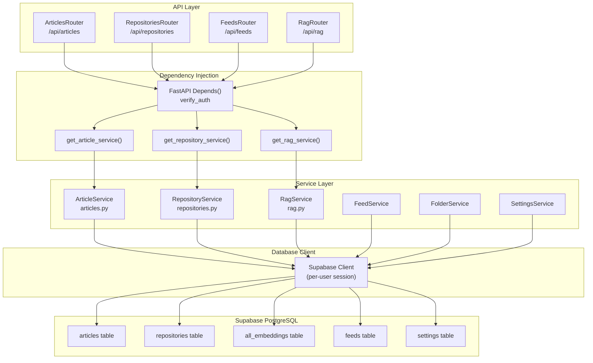

**Sources:** [backend/app/api/routers/articles.py:26-32](), [backend/app/api/routers/repositories.py:32-36](), [backend/app/api/routers/rag.py:38-45]()

### Service Instantiation Pattern

All services follow a consistent instantiation pattern using FastAPI dependency injection:

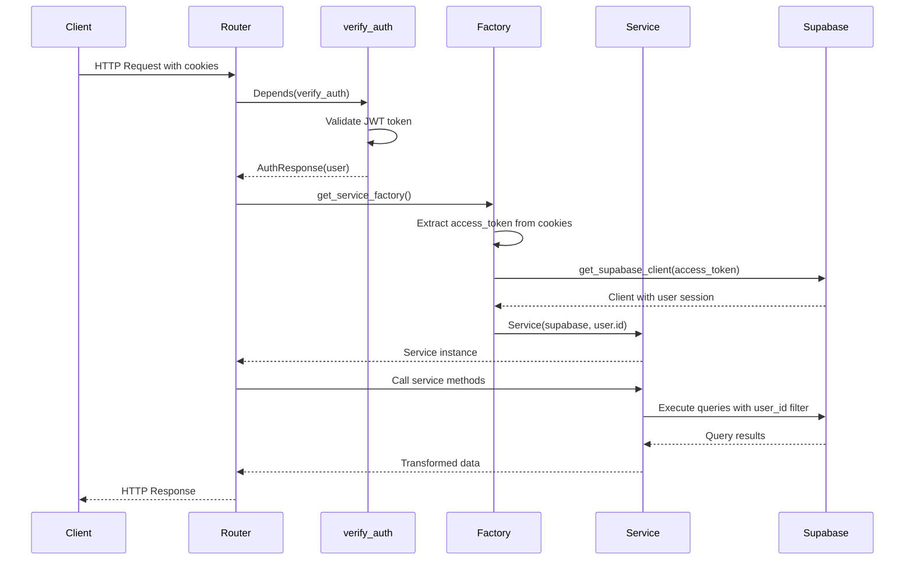

**Sources:** [backend/app/api/routers/articles.py:26-32](), [backend/app/api/routers/repositories.py:32-36]()

---

## Core Service Classes

### ArticleService

`ArticleService` manages all article-related database operations including CRUD, statistics, and repository extraction status tracking.

#### Key Methods

| Method | Purpose | Returns |
|--------|---------|---------|
| `save_articles(articles: List[dict])` | Upsert multiple articles with deduplication | None |
| `load_articles(feed_id, limit)` | Load articles with optional filtering | List[dict] |
| `get_article(article_id)` | Get single article by ID | dict \| None |
| `update_article(article_id, updates)` | Update article fields | None |
| `get_article_stats()` | Get total, unread, starred counts | dict |
| `clear_old_articles(days_to_keep)` | Delete old read articles | int |
| `get_articles_needing_repo_extraction(limit)` | Find articles pending repo extraction | List[dict] |
| `mark_repos_extracted(article_id, success)` | Update extraction status | None |

#### Data Flow Example

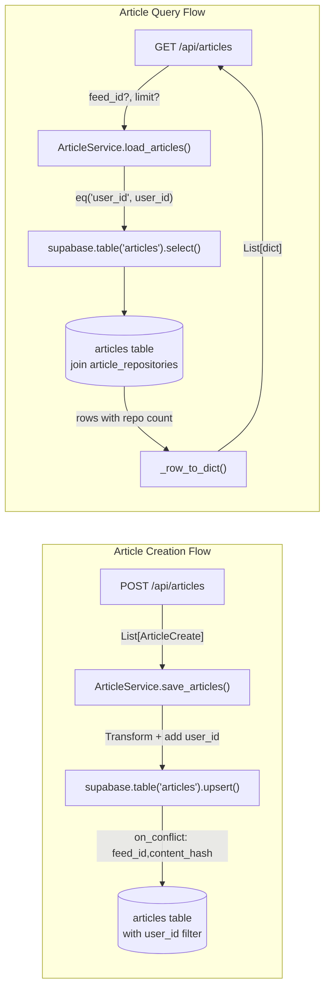

**Sources:** [backend/app/services/db/articles.py:15-312](), [backend/app/api/routers/articles.py:74-100]()

#### Article Statistics

The `get_article_stats()` method provides comprehensive statistics used by the frontend for displaying unread counts and feed summaries:

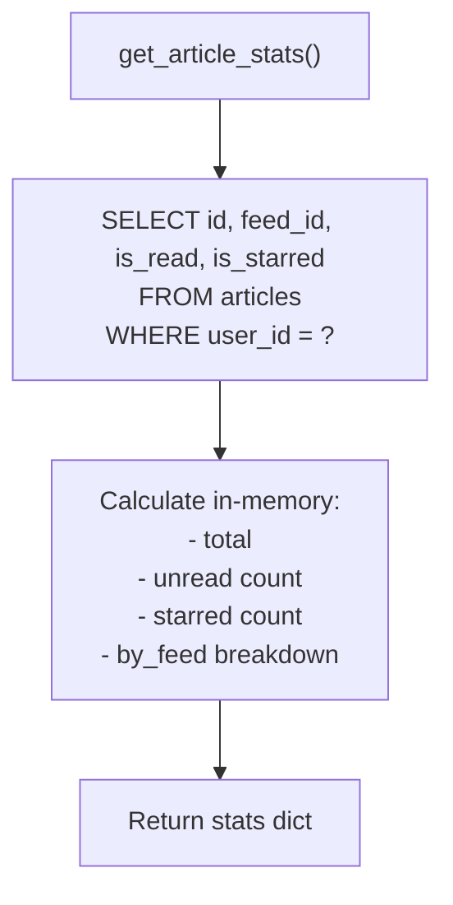

**Sources:** [backend/app/services/db/articles.py:226-263]()

---

### RepositoryService

`RepositoryService` handles GitHub repository data including starred repos, AI analysis results, and OpenRank metrics.

#### Key Methods

| Method | Purpose | Returns |
|--------|---------|---------|
| `load_repositories()` | Load all user repositories | List[dict] |
| `upsert_repositories(repos)` | Upsert repos with change detection | dict (stats) |
| `get_repository_by_id(repo_id)` | Get single repository | dict \| None |
| `get_by_github_id(github_id)` | Get repo by GitHub's numeric ID | dict \| None |
| `get_by_full_name(full_name)` | Get repo by owner/name | dict \| None |
| `update_ai_analysis(repo_id, analysis, is_fallback)` | Save AI analysis results | dict \| None |
| `mark_analysis_failed(repo_id)` | Mark analysis as failed | dict \| None |
| `get_repositories_needing_analysis()` | Find repos needing AI analysis | List[dict] |
| `get_repos_without_readme()` | Find repos missing README | List[dict] |
| `update_readme_content(repo_id, content)` | Update README only | bool |
| `upsert_extracted_repository(repo_data)` | Upsert repo from article extraction | dict \| None |
| `batch_update_openrank(openrank_map)` | Bulk update OpenRank values | int |

#### Repository Upsert Logic

The `upsert_repositories()` method implements sophisticated change detection to minimize unnecessary updates:

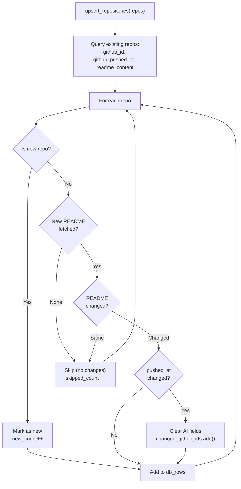

**Sources:** [backend/app/services/db/repositories.py:72-200]()

#### AI Analysis Tracking

Repository AI analysis is tracked through several fields and methods:

| Field | Type | Purpose |
|-------|------|---------|
| `ai_summary` | string | AI-generated description |
| `ai_tags` | string[] | Extracted technical tags |
| `ai_platforms` | string[] | Supported platforms |
| `analyzed_at` | timestamp | When analysis completed |
| `analysis_failed` | boolean | True if analysis failed |

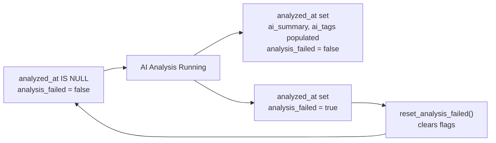

**Sources:** [backend/app/services/db/repositories.py:295-350](), [backend/app/services/db/repositories.py:360-398]()

---

### RagService

`RagService` (not fully shown in provided files but referenced extensively) manages vector embeddings storage and retrieval for semantic search. It interacts with the `all_embeddings` table using pgvector.

#### Inferred Methods

Based on usage patterns in the codebase:

| Method | Purpose | Usage |
|--------|---------|-------|
| `save_embeddings(article_id, chunks)` | Save article embeddings | [backend/app/celery_app/rag_processor.py:239]() |
| `save_repository_embeddings(repo_id, chunks)` | Save repository embeddings | [backend/app/celery_app/repository_tasks.py:383]() |
| `mark_article_rag_processed(article_id, success)` | Update RAG processing status | [backend/app/celery_app/rag_processor.py:146]() |
| `mark_repository_embedding_processed(repo_id, success)` | Update embedding status | [backend/app/celery_app/repository_tasks.py:269]() |
| `search(query_embedding, top_k, feed_id, min_score)` | Vector similarity search | [backend/app/api/routers/rag.py:108-113]() |
| `get_rag_stats()` | Get embedding statistics | [backend/app/api/routers/rag.py:158]() |
| `delete_all_embeddings(article_id)` | Delete embeddings for reindexing | [backend/app/api/routers/rag.py:186]() |
| `reset_article_rag_status(article_id)` | Reset processing flags | [backend/app/api/routers/rag.py:185]() |

#### Embedding Storage Pattern

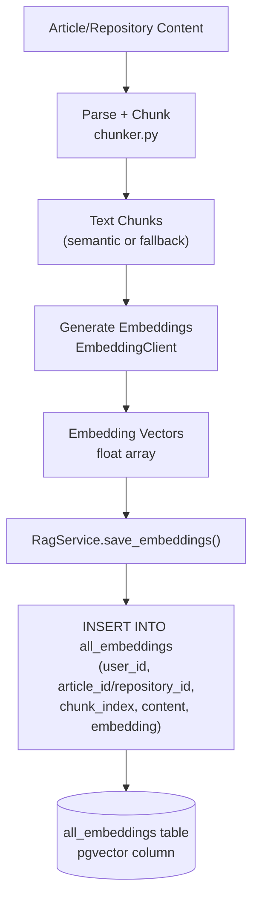

**Sources:** [backend/app/celery_app/rag_processor.py:87-266](), [backend/app/api/routers/rag.py:83-150]()

---

### Additional Service Classes

#### FeedService

Manages RSS feed subscriptions, refresh intervals, and last fetch status.

**Key Operations:**
- Load user feeds with folder relationships
- Create/update/delete feeds
- Update last_fetched timestamps
- Track fetch success/failure status

**Referenced in:** [backend/app/api/routers/repositories.py:67]()

#### FolderService

Manages folder hierarchy for organizing feeds.

**Key Operations:**
- CRUD operations for folders
- Validate folder name uniqueness
- Handle feed reassignment on folder deletion

**Sources:** [backend/app/api/routers/folders.py:23-159]()

#### SettingsService

Manages user settings including GitHub tokens and preferences.

**Key Operations:**
- Load user settings
- Update settings (encrypted for sensitive fields)
- Validate GitHub token presence

**Sources:** [backend/app/api/routers/repositories.py:67-75]()

#### ApiConfigService

Manages AI API configurations (chat, embedding, rerank).

**Key Operations:**
- Get active configuration by type
- Encrypt/decrypt API keys and base URLs
- Validate configuration completeness

**Referenced in:** [backend/app/api/routers/repositories.py:442]()

#### ArticleRepositoryService

Manages many-to-many relationships between articles and extracted repositories.

**Key Operations:**
- Link repositories to articles
- Query repositories for a given article
- Join with repository details

**Sources:** [backend/app/api/routers/articles.py:199-239]()

---

## Common Patterns and Conventions

### Pattern 1: User Data Isolation

All service methods automatically filter queries by `user_id` to enforce security boundaries:

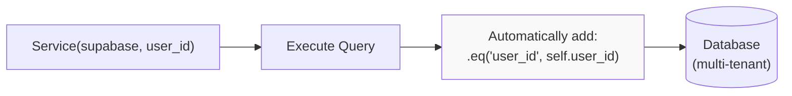

**Example from ArticleService:**
```python
# All queries automatically scoped to user
response = self.supabase.table("articles") \
    .select("*") \
    .eq("user_id", self.user_id) \
    .order("published_at", desc=True) \
    .execute()
```

**Sources:** [backend/app/services/db/articles.py:78-82](), [backend/app/services/db/repositories.py:59-62]()

### Pattern 2: Row-to-Dict Transformation

Services provide private `_row_to_dict()` methods to transform database rows into application-friendly dictionaries:

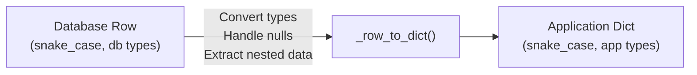

**Example from RepositoryService:**
- Extracts nested arrays (`topics`, `ai_tags`, `ai_platforms`)
- Converts null values to empty arrays
- Preserves timestamp strings
- Maps boolean flags

**Sources:** [backend/app/services/db/repositories.py:485-519]()

### Pattern 3: Status Field Tracking

Services use tri-state flags (NULL/true/false) to track processing stages:

| State | Meaning | Next Action |
|-------|---------|-------------|
| `NULL` | Not yet processed | Schedule processing |
| `true` | Processing succeeded | No action needed |
| `false` | Processing failed | Can retry or skip |

**Article Processing Flags:**
- `images_processed`: Image download/compression complete
- `rag_processed`: Embedding generation complete
- `repos_extracted`: Repository extraction complete

**Repository Processing Flags:**
- `analyzed_at`: AI analysis timestamp (NULL if not done)
- `analysis_failed`: True if AI analysis failed
- `embedding_processed`: README embedding generation status

**Sources:** [backend/app/services/db/articles.py:290-311](), [backend/app/services/db/repositories.py:333-358]()

### Pattern 4: Upsert with Conflict Resolution

Services use Supabase's `upsert()` with `on_conflict` to handle duplicates:

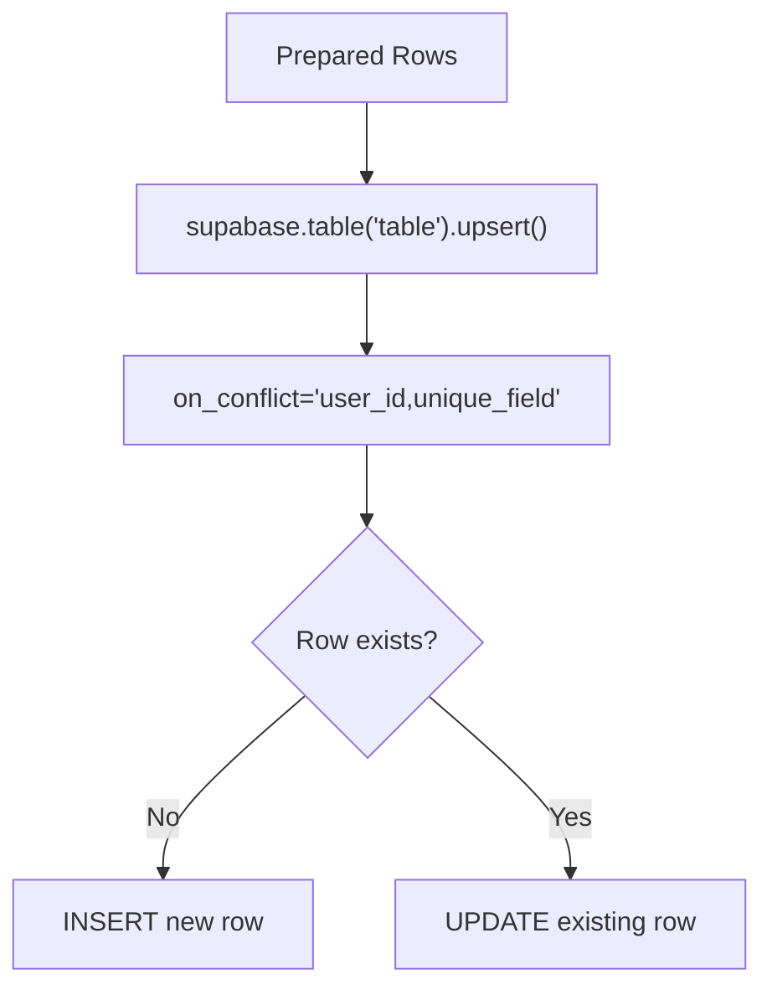

**Examples:**
- **Articles:** `on_conflict="feed_id,content_hash"` - prevents duplicate articles
- **Repositories:** `on_conflict="user_id,github_id"` - prevents duplicate repos per user
- **Folders:** Validates name uniqueness before upsert

**Sources:** [backend/app/services/db/articles.py:54-57](), [backend/app/services/db/repositories.py:182-184]()

### Pattern 5: Static Methods for Celery Tasks

Services provide static methods for use in Celery tasks where full service instantiation isn't needed:

```python
@classmethod
def upsert_repositories_static(
    cls, supabase: Client, user_id: str, repos: List[dict]
) -> dict:
    """Static method for upsert - used by Celery tasks."""
    service = cls(supabase, user_id)
    return service.upsert_repositories(repos)
```

This allows Celery tasks to use service_role client with elevated permissions while maintaining service logic encapsulation.

**Sources:** [backend/app/services/db/repositories.py:21-30]()

---

## Service Dependency Graph

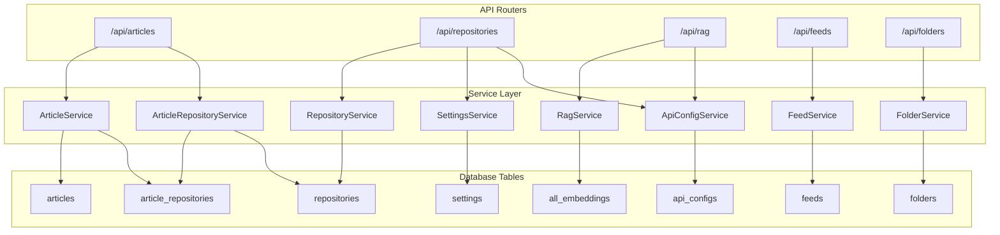

**Sources:** [backend/app/api/routers/articles.py:1-240](), [backend/app/api/routers/repositories.py:1-486](), [backend/app/api/routers/folders.py:1-160]()

---

## Usage in Background Tasks

Service classes are also used extensively in Celery background tasks. Background tasks use the `service_role` Supabase client which has elevated permissions:

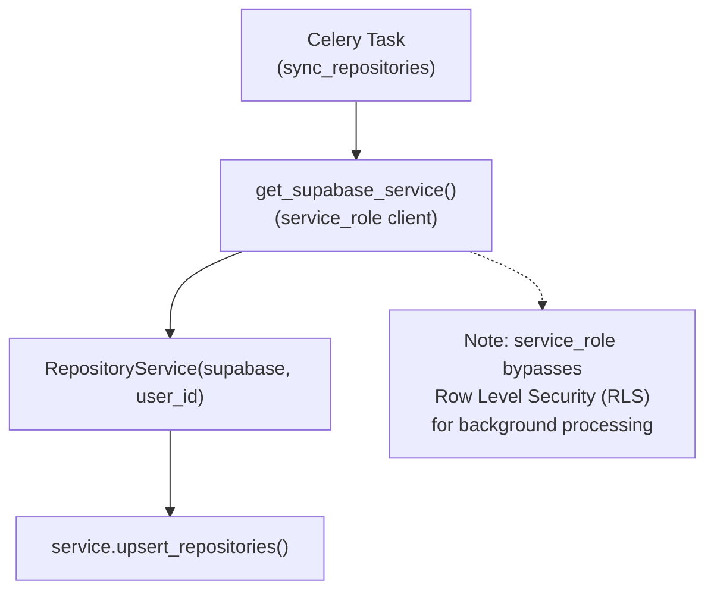

**Key Background Task Services:**
- `RepositoryService` - Used in [backend/app/celery_app/repository_tasks.py:51]()
- `RagService` - Used in [backend/app/celery_app/rag_processor.py:123]()
- `ArticleService` - Used in Celery feed refresh tasks

**Sources:** [backend/app/celery_app/repository_tasks.py:50-52](), [backend/app/celery_app/rag_processor.py:122-124]()

---

## Error Handling and Logging

Services follow consistent error handling patterns:

1. **Logging:** All services use Python's `logging` module with structured context
2. **Exceptions:** Let Supabase exceptions bubble up to FastAPI's exception handlers
3. **Validation:** Validate data before database operations
4. **Null Safety:** Handle optional fields and missing data gracefully

**Example logging pattern:**
```python
logger.info(
    f"Upserted {total} repositories",
    extra={'user_id': self.user_id}
)
```

**Sources:** [backend/app/services/db/repositories.py:189-192](), [backend/app/services/db/articles.py:59]()