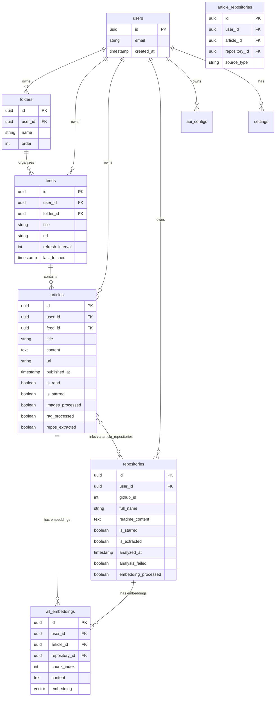
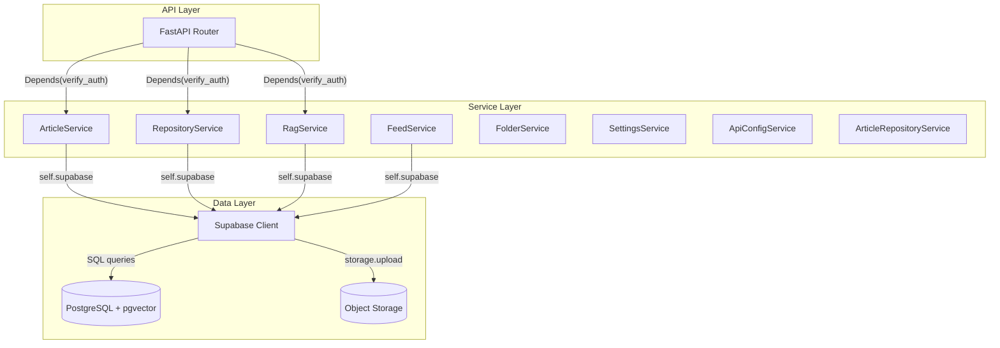
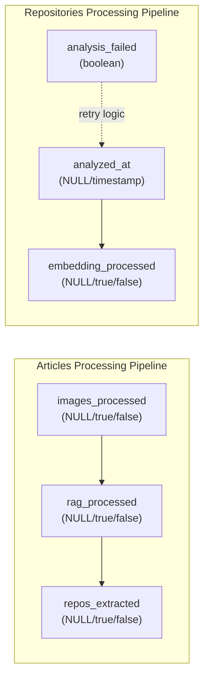
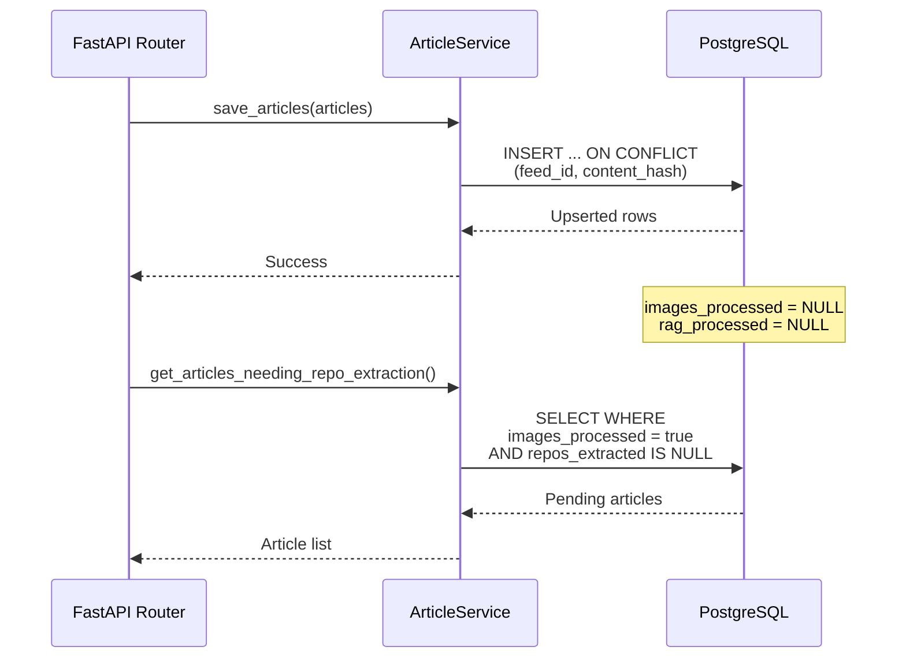
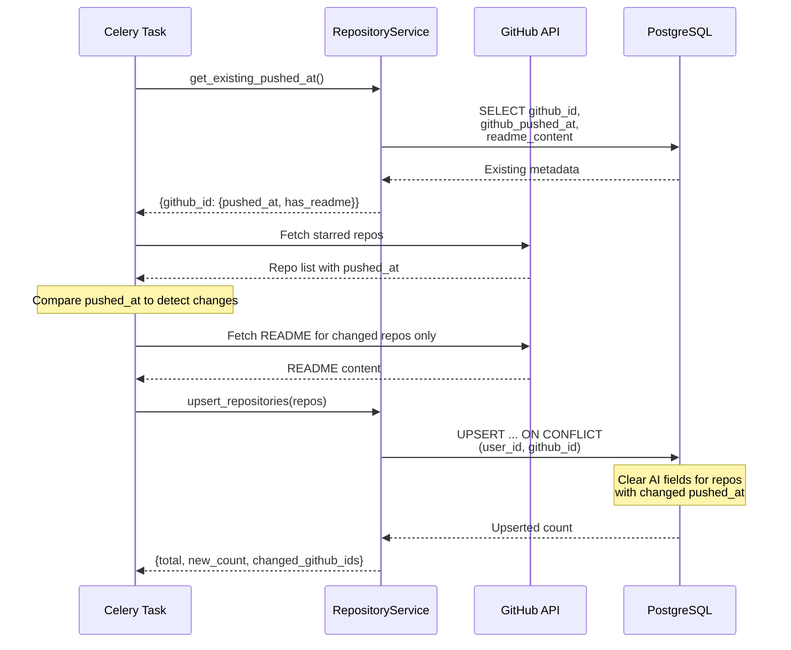
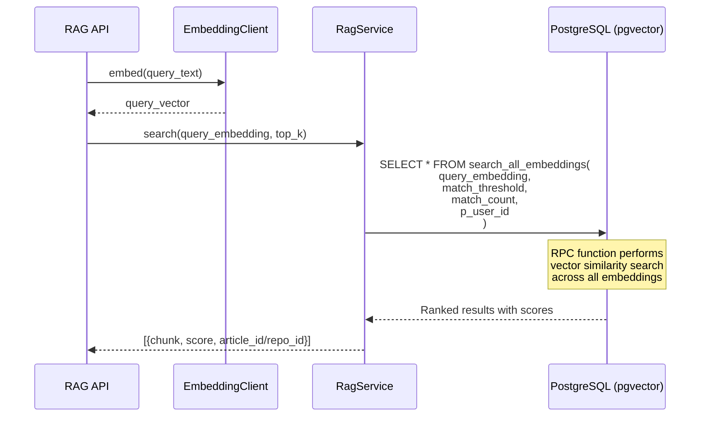
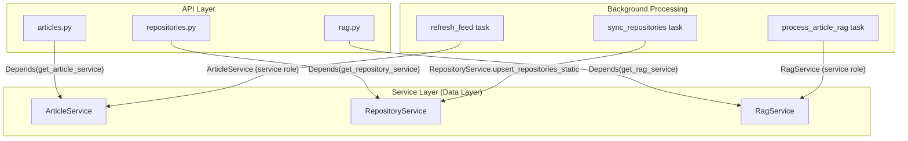
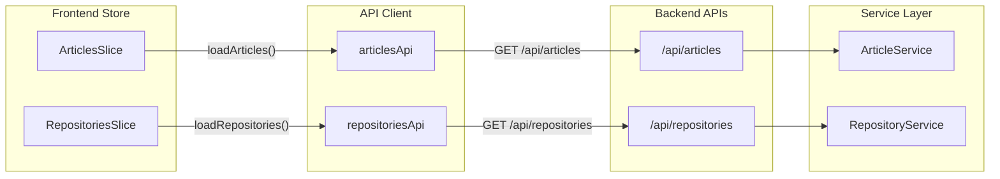

# Data Layer

<details>
<summary>Relevant source files</summary>

The following files were used as context for generating this wiki page:

- [backend/app/api/routers/articles.py](backend/app/api/routers/articles.py)
- [backend/app/api/routers/folders.py](backend/app/api/routers/folders.py)
- [backend/app/api/routers/proxy.py](backend/app/api/routers/proxy.py)
- [backend/app/api/routers/rag.py](backend/app/api/routers/rag.py)
- [backend/app/api/routers/repositories.py](backend/app/api/routers/repositories.py)
- [backend/app/celery_app/rag_processor.py](backend/app/celery_app/rag_processor.py)
- [backend/app/celery_app/repository_tasks.py](backend/app/celery_app/repository_tasks.py)
- [backend/app/schemas/articles.py](backend/app/schemas/articles.py)
- [backend/app/schemas/repositories.py](backend/app/schemas/repositories.py)
- [backend/app/services/ai/CLAUDE.md](backend/app/services/ai/CLAUDE.md)
- [backend/app/services/ai/__init__.py](backend/app/services/ai/__init__.py)
- [backend/app/services/ai/clients.py](backend/app/services/ai/clients.py)
- [backend/app/services/ai/config.py](backend/app/services/ai/config.py)
- [backend/app/services/ai/repository_service.py](backend/app/services/ai/repository_service.py)
- [backend/app/services/db/articles.py](backend/app/services/db/articles.py)
- [backend/app/services/db/repositories.py](backend/app/services/db/repositories.py)
- [backend/app/services/openrank_service.py](backend/app/services/openrank_service.py)
- [backend/app/services/rag/CLAUDE.md](backend/app/services/rag/CLAUDE.md)
- [backend/app/services/rag/__init__.py](backend/app/services/rag/__init__.py)
- [backend/app/services/rag/chunker.py](backend/app/services/rag/chunker.py)
- [backend/app/services/repository_analyzer.py](backend/app/services/repository_analyzer.py)
- [backend/scripts/030_add_repository_openrank.sql](backend/scripts/030_add_repository_openrank.sql)
- [frontend/components/article-content.tsx](frontend/components/article-content.tsx)
- [frontend/components/article-list.tsx](frontend/components/article-list.tsx)
- [frontend/components/article-repositories.tsx](frontend/components/article-repositories.tsx)
- [frontend/components/repository/repository-card.tsx](frontend/components/repository/repository-card.tsx)
- [frontend/components/repository/repository-page.tsx](frontend/components/repository/repository-page.tsx)
- [frontend/lib/api/repositories.ts](frontend/lib/api/repositories.ts)
- [frontend/lib/store/repositories.slice.ts](frontend/lib/store/repositories.slice.ts)
- [frontend/lib/types.ts](frontend/lib/types.ts)
- [frontend/lib/utils.ts](frontend/lib/utils.ts)
- [image/5.png](image/5.png)

</details>


## Purpose and Scope

The Data Layer provides the foundation for SaveHub's persistent storage, implementing a robust database architecture built on Supabase PostgreSQL with pgvector extensions. This document covers the overall database design, Supabase integration patterns, service layer abstractions, and data modeling principles used throughout the system.

For specific table schemas and relationships, see [Database Schema](#7.1). For vector embedding storage and retrieval, see [Vector Embeddings](#7.2). For detailed service class APIs, see [Database Service Layer](#7.3).

---

## Database Platform: Supabase

SaveHub uses **Supabase** as its database platform, which provides:

- **PostgreSQL Database**: Core relational data storage with ACID guarantees
- **pgvector Extension**: Vector similarity search for AI embeddings
- **Object Storage**: S3-compatible storage for processed article images
- **Realtime Subscriptions**: WebSocket-based change notifications via Postgres NOTIFY/LISTEN

All database operations use the Supabase Python SDK (`supabase-py`) for type-safe queries and automatic connection management.

**Client Initialization Pattern**:
```
Authentication → Access Token → Supabase Client → Service Instance
```

The system uses two types of Supabase clients:
- **User-scoped clients**: Use access token from cookies for user data isolation (APIs)
- **Service role client**: Uses service key with elevated privileges (background tasks)

Sources: [backend/app/api/routers/repositories.py:32-36](), [backend/app/services/db/repositories.py:14-19]()

---

## Core Data Model

### Entity Relationship Overview



Sources: [backend/app/services/db/articles.py:1-312](), [backend/app/services/db/repositories.py:1-565](), [backend/app/api/routers/rag.py:1-296]()

### Key Tables

| Table | Purpose | Key Fields |
|-------|---------|-----------|
| `folders` | Organize feeds into hierarchical structure | `user_id`, `name`, `order` |
| `feeds` | RSS feed sources with refresh configuration | `user_id`, `url`, `refresh_interval`, `last_fetched` |
| `articles` | Article content with processing status | `feed_id`, `content`, `images_processed`, `rag_processed`, `repos_extracted` |
| `repositories` | GitHub repositories (starred + extracted) | `github_id`, `full_name`, `is_starred`, `is_extracted`, `analyzed_at` |
| `all_embeddings` | Unified vector storage for semantic search | `article_id` OR `repository_id`, `embedding`, `chunk_index` |
| `article_repositories` | Junction table linking articles to repos | `article_id`, `repository_id`, `source_type` |
| `api_configs` | Encrypted AI API configurations | `type`, `api_key` (encrypted), `api_base` (encrypted), `is_active` |
| `settings` | User preferences and GitHub token | `user_id`, `github_token`, `articles_retention_days` |

Sources: [frontend/lib/types.ts:1-147](), [backend/app/schemas/repositories.py:1-61](), [backend/app/schemas/articles.py:1-69]()

---

## Service Layer Architecture

Database operations are abstracted through **Service Classes** that encapsulate business logic and provide type-safe interfaces. Each service is instantiated with a Supabase client and user ID for automatic data isolation.

### Service Class Hierarchy



### Service Instantiation Pattern

All service classes follow this pattern:

```python
class XxxService:
    def __init__(self, supabase: Client, user_id: str):
        self.supabase = supabase
        self.user_id = user_id
```

**Dependency Injection in APIs**:
```python
def get_article_service(
    access_token: str = Depends(get_access_token),
    user=Depends(verify_auth)
) -> ArticleService:
    client = get_supabase_client(access_token)
    return ArticleService(client, user.user.id)
```

This pattern ensures:
1. **Automatic user scoping**: All queries filter by `user_id`
2. **Session isolation**: Each request has its own client
3. **Type safety**: Service methods return typed models
4. **Testability**: Services can be instantiated with mock clients

Sources: [backend/app/services/db/articles.py:14-21](), [backend/app/services/db/repositories.py:14-19](), [backend/app/api/routers/articles.py:26-33]()

---

## Data Isolation and Security

### User-Scoped Data Model

Every data table includes a `user_id` foreign key, ensuring complete data isolation between users:

```sql
CREATE TABLE articles (
    id UUID PRIMARY KEY,
    user_id UUID NOT NULL REFERENCES auth.users(id),
    feed_id UUID NOT NULL,
    -- ... other fields
);

CREATE INDEX idx_articles_user_id ON articles(user_id);
```

**Service Layer Enforcement**:
All service methods automatically filter by `self.user_id`:

```python
# ArticleService.load_articles()
response = self.supabase.table("articles") \
    .select("*") \
    .eq("user_id", self.user_id) \
    .order("published_at", desc=True) \
    .execute()
```

### Row-Level Security (RLS)

While the service layer enforces user isolation, Supabase RLS policies provide defense-in-depth by restricting database-level access based on JWT claims.

Sources: [backend/app/services/db/articles.py:77-83](), [backend/app/services/db/repositories.py:52-70]()

---

## Async Processing Status Tracking

SaveHub uses a **tri-state status pattern** to track async processing stages: `NULL` (pending), `true` (success), `false` (failed).

### Status Fields Across Entities



### Status Field Semantics

| Field | Values | Meaning |
|-------|--------|---------|
| `images_processed` | `NULL` | Not yet attempted |
| | `true` | Images downloaded and optimized |
| | `false` | Image processing failed |
| `rag_processed` | `NULL` | Not yet attempted |
| | `true` | Embeddings generated and stored |
| | `false` | RAG processing failed |
| `repos_extracted` | `NULL` | Not yet attempted |
| | `true` | GitHub repos extracted and linked |
| | `false` | Repo extraction failed |
| `analyzed_at` | `NULL` | Not yet analyzed |
| | `timestamp` | AI analysis completed at this time |
| `analysis_failed` | `false` | Analysis succeeded or not attempted |
| | `true` | Analysis failed (eligible for retry) |

### Compensatory Scans

Celery Beat periodically scans for unprocessed items to handle missed or failed tasks:

```python
# Get articles needing RAG processing
result = supabase.table("articles") \
    .select("id, user_id") \
    .is_("rag_processed", "null") \
    .eq("images_processed", True) \
    .order("created_at", desc=True) \
    .limit(50) \
    .execute()
```

This pattern enables:
- **Selective processing**: Only process what's needed
- **Failure recovery**: Retry failed items
- **Idempotent operations**: Safe to re-run
- **Progress tracking**: Monitor completion status

Sources: [backend/app/celery_app/rag_processor.py:269-289](), [backend/app/services/db/repositories.py:360-378](), [backend/app/services/db/articles.py:265-289]()

---

## Key Design Patterns

### 1. Upsert Operations for Idempotency

**Conflict Resolution Strategy**:
```python
# Upsert articles with deduplication
self.supabase.table("articles").upsert(
    db_rows,
    on_conflict="feed_id,content_hash"  # Unique constraint
).execute()

# Upsert repositories by GitHub ID
self.supabase.table("repositories").upsert(
    rows,
    on_conflict="user_id,github_id"  # Composite key
).execute()
```

This pattern ensures:
- **Idempotent imports**: Safe to re-sync feeds/repos
- **Deduplication**: Prevents duplicate articles
- **Update tracking**: Changes trigger processing pipelines

Sources: [backend/app/services/db/articles.py:54-58](), [backend/app/services/db/repositories.py:182-184]()

### 2. Selective Update Detection

Before upserting repositories, the system checks what actually changed:

```python
# Get existing metadata
existing_repo_info = repo_service.get_existing_pushed_at()

# Detect changes
for repo in starred_repos:
    github_id = repo.get("id")
    new_pushed_at = repo.get("pushed_at")
    
    if github_id not in existing_repo_info:
        # New repo - needs full processing
        github_ids_needing_readme.add(github_id)
    else:
        info = existing_repo_info[github_id]
        if info["pushed_at"] != new_pushed_at:
            # Code updated - re-fetch README and reset AI analysis
            github_ids_needing_readme.add(github_id)
```

This minimizes unnecessary API calls and processing by only fetching README when:
- Repository is new
- Code was pushed (changed `pushed_at`)
- README is missing

Sources: [backend/app/celery_app/repository_tasks.py:59-82](), [backend/app/services/db/repositories.py:32-50]()

### 3. Unified Embedding Storage

The `all_embeddings` table stores vectors for both articles and repositories in a single table:

```sql
CREATE TABLE all_embeddings (
    id UUID PRIMARY KEY,
    user_id UUID NOT NULL,
    article_id UUID,           -- NULL if repository embedding
    repository_id UUID,        -- NULL if article embedding
    chunk_index INT NOT NULL,
    content TEXT NOT NULL,
    embedding VECTOR(1536),    -- pgvector type
    created_at TIMESTAMP,
    
    CONSTRAINT check_source CHECK (
        (article_id IS NOT NULL AND repository_id IS NULL) OR
        (article_id IS NULL AND repository_id IS NOT NULL)
    )
);
```

**Benefits**:
- **Unified search**: Single query retrieves both article and repo results
- **Consistent indexing**: Same vector index for all embeddings
- **Simplified RPC**: One `search_all_embeddings` function handles both types

**Type Discrimination**:
```python
# Determine embedding source
if hit.get("article_id"):
    source_type = "article"
    source_id = hit["article_id"]
elif hit.get("repository_id"):
    source_type = "repository"
    source_id = hit["repository_id"]
```

Sources: [backend/app/celery_app/rag_processor.py:236-239](), [backend/app/celery_app/repository_tasks.py:383-386]()

### 4. Static Service Methods for Celery

Celery tasks run in worker processes without HTTP request context. Service classes provide static methods for task usage:

```python
@classmethod
def upsert_repositories_static(
    cls, supabase: Client, user_id: str, repos: List[dict]
) -> dict:
    """
    Static method for upsert - used by Celery tasks.
    Allows Celery tasks to use service_role client.
    """
    service = cls(supabase, user_id)
    return service.upsert_repositories(repos)
```

This pattern allows:
- **Service role access**: Tasks use elevated privileges
- **Code reuse**: Same business logic for API and tasks
- **Type safety**: Maintains service abstractions

Sources: [backend/app/services/db/repositories.py:21-30]()

---

## Database Operation Examples

### Article Lifecycle



Sources: [backend/app/services/db/articles.py:22-60](), [backend/app/services/db/articles.py:265-289]()

### Repository Sync with Change Detection



Sources: [backend/app/celery_app/repository_tasks.py:35-136](), [backend/app/services/db/repositories.py:72-201]()

### Vector Search Execution



Sources: [backend/app/api/routers/rag.py:83-150]()

---

## Integration with Other Layers

### Backend Services → Data Layer



Sources: [backend/app/api/routers/articles.py:26-33](), [backend/app/api/routers/repositories.py:32-37](), [backend/app/api/routers/rag.py:38-46]()

### Frontend → Data Layer (via API)



Sources: [frontend/lib/store/repositories.slice.ts:1-107](), [frontend/lib/api/repositories.ts:1-181]()

---

## Summary

The Data Layer provides:

1. **Robust Storage**: PostgreSQL with pgvector for hybrid relational + vector data
2. **Clean Abstractions**: Service classes isolate business logic from SQL
3. **User Isolation**: Every table scoped by `user_id` with automatic filtering
4. **Async Processing**: Tri-state status tracking for pipeline coordination
5. **Unified Search**: Single `all_embeddings` table for cross-content semantic search
6. **Idempotent Operations**: Upsert patterns prevent duplicates and enable retries
7. **Change Detection**: Selective processing minimizes unnecessary work

For detailed information about specific components:
- **Table schemas and migrations**: See [Database Schema](#7.1)
- **Vector storage and search**: See [Vector Embeddings](#7.2)
- **Service class APIs**: See [Database Service Layer](#7.3)

Sources: [backend/app/services/db/articles.py:1-312](), [backend/app/services/db/repositories.py:1-565](), [backend/app/celery_app/rag_processor.py:1-532](), [backend/app/celery_app/repository_tasks.py:1-703]()