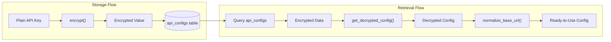
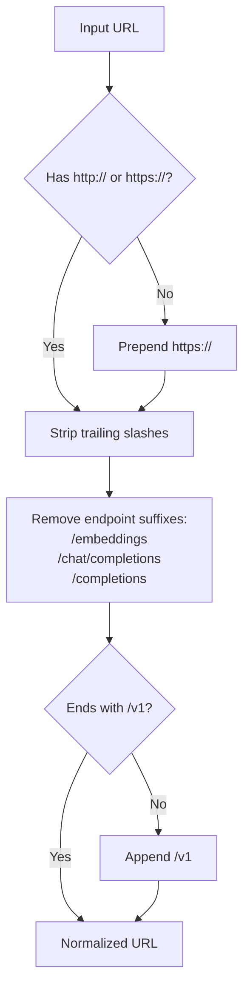
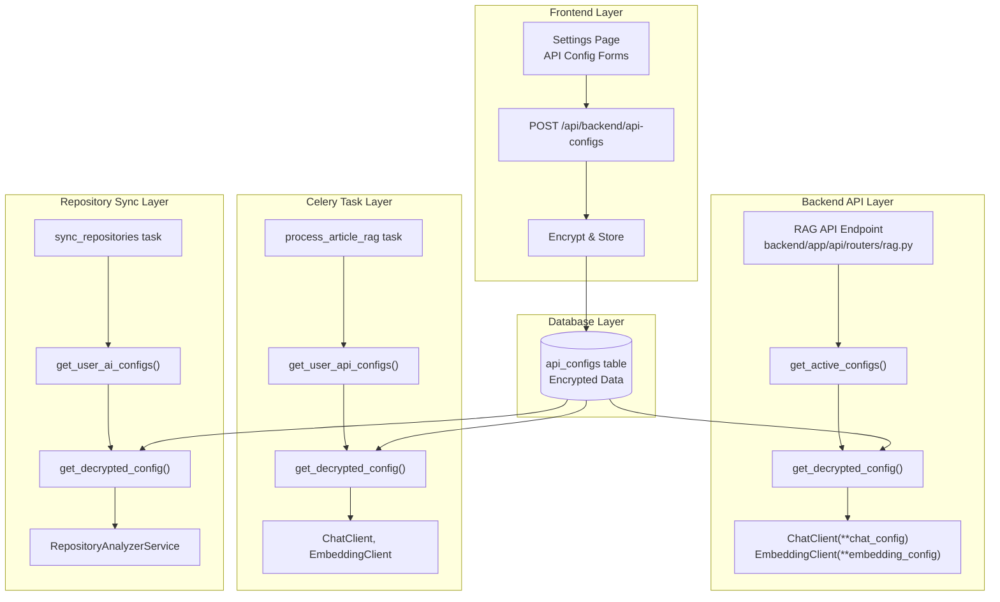
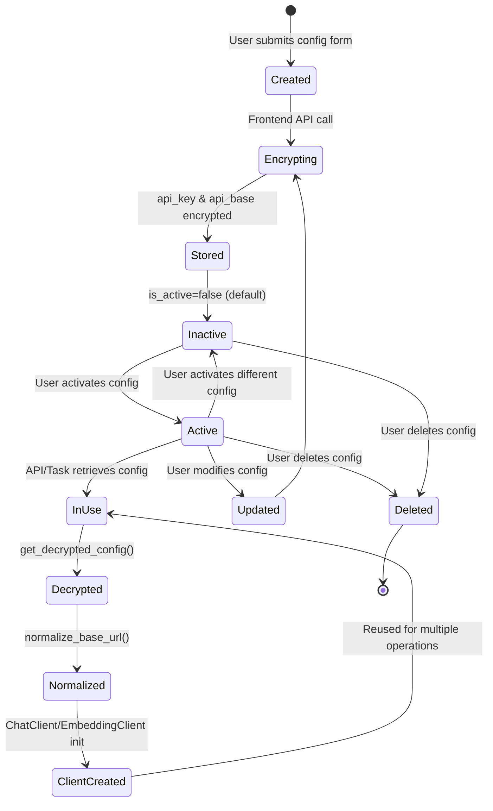
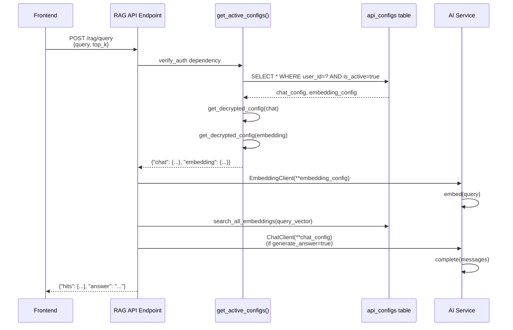
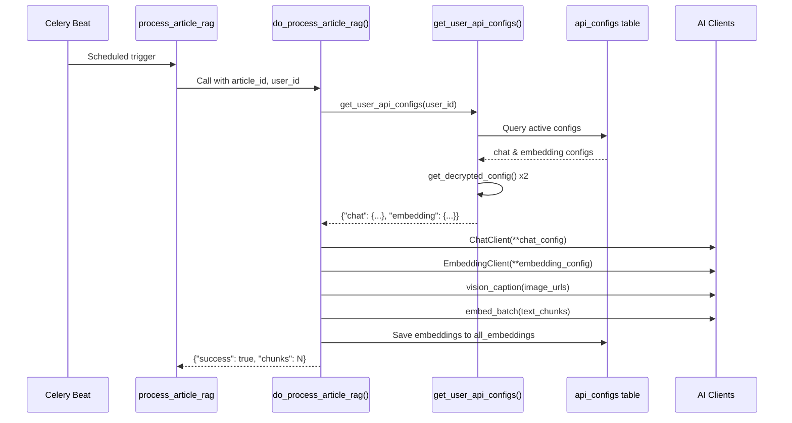

# AI Configuration Management

<details>
<summary>Relevant source files</summary>

The following files were used as context for generating this wiki page:

- [backend/app/api/routers/rag.py](backend/app/api/routers/rag.py)
- [backend/app/celery_app/rag_processor.py](backend/app/celery_app/rag_processor.py)
- [backend/app/services/ai/CLAUDE.md](backend/app/services/ai/CLAUDE.md)
- [backend/app/services/ai/__init__.py](backend/app/services/ai/__init__.py)
- [backend/app/services/ai/clients.py](backend/app/services/ai/clients.py)
- [backend/app/services/ai/config.py](backend/app/services/ai/config.py)
- [backend/app/services/ai/repository_service.py](backend/app/services/ai/repository_service.py)
- [backend/app/services/rag/CLAUDE.md](backend/app/services/rag/CLAUDE.md)
- [backend/app/services/rag/__init__.py](backend/app/services/rag/__init__.py)
- [backend/app/services/rag/chunker.py](backend/app/services/rag/chunker.py)
- [frontend/hooks/use-realtime-sync.ts](frontend/hooks/use-realtime-sync.ts)
- [frontend/lib/api-validation.ts](frontend/lib/api-validation.ts)
- [frontend/lib/api/api-configs.ts](frontend/lib/api/api-configs.ts)
- [frontend/lib/api/articles.ts](frontend/lib/api/articles.ts)
- [frontend/lib/api/feeds.ts](frontend/lib/api/feeds.ts)
- [frontend/lib/api/fetch-client.ts](frontend/lib/api/fetch-client.ts)
- [frontend/lib/api/folders.ts](frontend/lib/api/folders.ts)
- [frontend/lib/api/github.ts](frontend/lib/api/github.ts)
- [frontend/lib/api/settings.ts](frontend/lib/api/settings.ts)
- [frontend/lib/context/auth-context.tsx](frontend/lib/context/auth-context.tsx)

</details>


**Purpose**: This document describes SaveHub's flexible AI configuration system that enables users to connect multiple AI providers (OpenAI, DeepSeek, DashScope, etc.) for chat, embedding, and rerank operations. It covers the configuration storage model, encryption mechanisms, URL normalization, and how configurations are retrieved and used throughout the system.

For information about the actual AI client implementations (ChatClient, EmbeddingClient), see [Chat & Embedding Clients](#8.2). For repository analysis using these configurations, see [Repository Analysis](#8.3).

---

## System Overview

SaveHub supports three types of AI configurations, each stored independently and encrypted at rest:

| Config Type | Purpose | Primary Use Cases |
|------------|---------|------------------|
| `chat` | Language model completions | Repository analysis, RAG answers, image captioning (vision) |
| `embedding` | Text vectorization | Article/repository embeddings, query embedding for search |
| `rerank` | Document reranking | (Reserved for future use) |

Each user can have multiple configurations per type but only one active configuration per type at any given time. The active configuration is automatically used when AI operations are triggered.

**Sources**: [backend/app/services/ai/config.py:1-191](), [backend/app/services/ai/CLAUDE.md:1-93]()

---

## Configuration Data Model

### Database Schema

The `api_configs` table stores user AI configurations with the following structure:

| Column | Type | Description |
|--------|------|-------------|
| `id` | UUID | Primary key |
| `user_id` | UUID | Foreign key to auth.users |
| `name` | VARCHAR | User-friendly name (e.g., "OpenAI GPT-4") |
| `api_key` | TEXT | Encrypted API key |
| `api_base` | TEXT | Encrypted base URL |
| `model` | VARCHAR | Model identifier (e.g., "gpt-4o", "text-embedding-3-small") |
| `type` | ENUM | Configuration type: 'chat', 'embedding', or 'rerank' |
| `is_active` | BOOLEAN | Whether this config is currently active for its type |
| `created_at` | TIMESTAMP | Creation timestamp |
| `updated_at` | TIMESTAMP | Last update timestamp |

**Key Constraints**:
- Only one active configuration per user per type
- `api_key` and `api_base` are stored encrypted using AES-256-GCM
- RLS policies ensure users can only access their own configurations

**Sources**: [backend/app/services/ai/config.py:111-153](), [frontend/lib/types/index.ts]()

---

## Encryption and Security

### Encryption Implementation

Sensitive fields (`api_key` and `api_base`) are encrypted before storage and decrypted on retrieval using AES-256-GCM with a server-side secret key.



The `get_decrypted_config()` function handles decryption and normalization:

[backend/app/services/ai/config.py:78-108]()

This function:
1. Copies the configuration dictionary
2. Decrypts `api_key` using the `decrypt()` utility
3. Decrypts `api_base` 
4. Normalizes the `api_base` URL to OpenAI SDK format

**Error Handling**: If decryption fails (e.g., invalid format, wrong key), the function logs a warning but does not crash. This allows graceful degradation if encryption keys change.

**Sources**: [backend/app/services/ai/config.py:78-108](), [backend/app/services/encryption.py]()

---

## URL Normalization

### Why Normalization is Required

Different AI providers use different URL conventions, but the OpenAI Python SDK expects a specific format. The SDK automatically appends endpoint paths like `/embeddings` or `/chat/completions` to the base URL, so the base must end with `/v1`.

### Normalization Rules

The `normalize_base_url()` function applies these transformations:



**Transformation Examples**:

| Input | Output |
|-------|--------|
| `api.example.com` | `https://api.example.com/v1` |
| `https://api.example.com` | `https://api.example.com/v1` |
| `https://api.example.com/v1/chat/completions` | `https://api.example.com/v1` |
| `https://api.example.com/v1/embeddings` | `https://api.example.com/v1` |
| `http://localhost:8080/v1/` | `http://localhost:8080/v1` |

**Implementation**: [backend/app/services/ai/config.py:25-75]()

**Sources**: [backend/app/services/ai/config.py:25-75](), [backend/app/services/ai/CLAUDE.md:66-75]()

---

## Configuration Retrieval

### Single Type Retrieval

The `get_active_config()` function retrieves the active configuration for a specific type:

[backend/app/services/ai/config.py:155-191]()

**Usage Pattern**:
```python
from app.services.ai import get_active_config

# Get active embedding config
embedding_config = get_active_config(supabase, user_id, "embedding")
if embedding_config:
    # Returns: {"api_key": "...", "api_base": "...", "model": "..."}
    client = EmbeddingClient(**embedding_config)
```

### Multi-Type Retrieval

The `get_user_ai_configs()` function retrieves all active configurations at once:

[backend/app/services/ai/config.py:111-152]()

This is useful when an operation requires multiple AI capabilities (e.g., RAG processing needs both chat for vision and embedding for vectorization).

**Sources**: [backend/app/services/ai/config.py:111-191]()

---

## Configuration Flow Across System Layers



**Sources**: [backend/app/api/routers/rag.py:48-76](), [backend/app/celery_app/rag_processor.py:61-84]()

---

## Configuration Usage in API Endpoints

### RAG Query Endpoint Example

The RAG query endpoint demonstrates typical configuration usage:

[backend/app/api/routers/rag.py:48-76]()

**Flow**:
1. Dependency `get_active_configs()` retrieves both chat and embedding configs
2. If either config is missing, returns HTTP 400 with error message
3. Creates `EmbeddingClient` for query vectorization
4. Uses `ChatClient` for answer generation (if requested)

**Error Cases**:
- Missing configuration → HTTP 400: "请先配置 {type} 类型的 API"
- Decryption failure → Logged warning, API call may fail
- API call failure → Caught and logged, returns HTTP 500

**Sources**: [backend/app/api/routers/rag.py:48-149]()

---

## Configuration Usage in Background Tasks

### RAG Processing Task

Background tasks retrieve configurations without HTTP context:

[backend/app/celery_app/rag_processor.py:61-84]()

**Key Differences from API Usage**:
1. Uses service-level Supabase client (not user token)
2. Stores configuration errors as processing status (`rag_processed=false`)
3. Does not raise HTTP exceptions; returns result dictionary

**Retry Strategy**:
- If configuration is missing during task execution, task marks article as failed
- Periodic scan tasks (`scan_pending_rag_articles`) will skip articles with `rag_processed=false`
- User must configure API and manually reindex or wait for compensatory scan

**Sources**: [backend/app/celery_app/rag_processor.py:61-148]()

---

## Multi-Provider Support

SaveHub supports any OpenAI-compatible API endpoint. The following providers are explicitly tested:

### Supported Providers

| Provider | API Base URL Format | Notes |
|----------|-------------------|--------|
| **OpenAI** | `https://api.openai.com/v1` | Official OpenAI API |
| **DeepSeek** | `https://api.deepseek.com/v1` | Chinese LLM provider |
| **DashScope (Alibaba)** | `https://dashscope.aliyuncs.com/compatible-mode/v1` | Alibaba Cloud AI |
| **Azure OpenAI** | `https://{resource}.openai.azure.com/openai/deployments/{deployment}` | Requires custom model names |
| **Local (Ollama, LM Studio)** | `http://localhost:11434/v1` | Self-hosted models |

### Configuration Examples

**OpenAI**:
- API Key: `sk-...` (from OpenAI dashboard)
- API Base: `https://api.openai.com/v1`
- Chat Model: `gpt-4o`, `gpt-4o-mini`
- Embedding Model: `text-embedding-3-small`, `text-embedding-3-large`

**DeepSeek**:
- API Key: `sk-...` (from DeepSeek console)
- API Base: `https://api.deepseek.com/v1`
- Chat Model: `deepseek-chat`
- Embedding Model: Use OpenAI for embeddings (DeepSeek doesn't provide embedding API)

**DashScope**:
- API Key: From Alibaba Cloud console
- API Base: `https://dashscope.aliyuncs.com/compatible-mode/v1`
- Chat Model: `qwen-plus`, `qwen-turbo`
- Embedding Model: `text-embedding-v1`

**Special Case - DashScope Rerank**: The frontend validation accepts the literal string `"dashscope"` as a valid API base for rerank configurations, which the backend SDK handles specially:

[frontend/lib/api-validation.ts:105-126]()

**Sources**: [backend/app/services/ai/config.py:25-75](), [frontend/lib/api-validation.ts:105-126]()

---

## Frontend Configuration Management

### API Client Interface

The frontend provides a TypeScript client for configuration management:

[frontend/lib/api/api-configs.ts:1-220]()

**Key Functions**:

| Function | Purpose | HTTP Method |
|----------|---------|-------------|
| `getApiConfigs(type?)` | List all configs, optionally filtered by type | GET |
| `getApiConfigsGrouped()` | Get all configs grouped by type | GET |
| `getActiveConfig(type)` | Get active config for specific type | GET |
| `createApiConfig(config)` | Create new configuration | POST |
| `updateApiConfig(id, updates)` | Update configuration | PUT |
| `deleteApiConfig(id)` | Delete configuration | DELETE |
| `activateConfig(id)` | Set config as active (deactivates others) | POST |

### Data Transformation

The frontend uses camelCase while the backend uses snake_case. Transformation happens in:
- `transformApiConfig()` - Backend → Frontend [frontend/lib/api/api-configs.ts:45-56]()
- `toApiFormat()` - Frontend → Backend [frontend/lib/api/api-configs.ts:62-76]()

### Configuration Validation

Before saving configurations, the frontend can validate them against the actual API:

[frontend/lib/api-validation.ts:26-99]()

**Validation Flow**:
1. Frontend calls backend validation endpoint: `POST /api/api-configs/validate`
2. Backend uses LangChain to test the configuration
3. Returns success status, latency, and model support information
4. Frontend displays validation results to user

**Sources**: [frontend/lib/api/api-configs.ts:1-220](), [frontend/lib/api-validation.ts:1-127]()

---

## Configuration Lifecycle



**State Transitions**:
1. **Created**: User fills out configuration form in Settings UI
2. **Encrypting**: API client sends data to backend, which encrypts sensitive fields
3. **Stored**: Configuration saved to database with `is_active=false`
4. **Active**: User explicitly activates configuration, deactivating other configs of same type
5. **InUse**: Backend retrieves config for AI operation
6. **Decrypted**: Sensitive fields decrypted in-memory
7. **Normalized**: URL transformed to OpenAI SDK format
8. **ClientCreated**: AI client instantiated with configuration

**Auto-Deactivation**: When a config is activated, all other configs of the same type for that user are automatically set to `is_active=false`. This is enforced at the database level.

**Sources**: [backend/app/services/ai/config.py:111-191](), [frontend/lib/api/api-configs.ts:136-207]()

---

## Configuration Resolution in Different Contexts

### HTTP API Context



**Sources**: [backend/app/api/routers/rag.py:48-149]()

### Celery Task Context



**Key Differences**:
- Tasks use service-level Supabase client (no user JWT token)
- Configuration errors are stored as processing flags rather than returning HTTP errors
- Retries are handled by Celery, not HTTP-level retry logic

**Sources**: [backend/app/celery_app/rag_processor.py:61-267]()

---

## Error Handling Patterns

### Configuration Missing

**API Context**:
```python
# backend/app/api/routers/rag.py:68-74
if not config:
    raise HTTPException(
        status_code=400,
        detail=f"请先配置 {config_type} 类型的 API"
    )
```

**Task Context**:
```python
# backend/app/celery_app/rag_processor.py:142-147
try:
    configs = get_user_api_configs(user_id)
except ConfigError as e:
    logger.warning(f"Config error for user {user_id}: {e}")
    rag_service.mark_article_rag_processed(article_id, success=False)
    return {"success": False, "error": str(e)}
```

### Decryption Failure

Decryption failures are logged but do not crash the application:

[backend/app/services/ai/config.py:92-103]()

This allows the system to continue functioning even if encryption keys change or become invalid. The subsequent API call will fail, providing user-visible feedback.

### API Call Failure

When AI API calls fail (network error, invalid key, model not found):

1. **Immediate Effect**: Exception is caught and logged
2. **Status Update**: Processing status marked as failed (`rag_processed=false`)
3. **User Feedback**: Error message stored or returned to client
4. **Retry**: Celery may retry based on task configuration
5. **Manual Recovery**: User can reindex or wait for compensatory scan

**Sources**: [backend/app/services/ai/config.py:92-103](), [backend/app/celery_app/rag_processor.py:142-147]()

---

## Security Considerations

### Encryption Key Management

- Encryption key stored in environment variable `ENCRYPTION_KEY`
- Must be 32 bytes (256 bits) for AES-256-GCM
- Key rotation requires re-encryption of all existing configs
- No key escrow or recovery mechanism (lost key = lost configs)

### Access Control

1. **Row-Level Security**: Database RLS policies ensure users can only access their own configs
2. **API Endpoints**: All config endpoints require authentication via `verify_auth` dependency
3. **Encryption**: API keys never stored in plaintext
4. **Transmission**: HTTPS required for API calls in production
5. **Client-Side**: API keys never logged or exposed in frontend

### Attack Vectors and Mitigations

| Threat | Mitigation |
|--------|-----------|
| API key theft from database | AES-256-GCM encryption at rest |
| Man-in-the-middle | HTTPS/TLS for all connections |
| Unauthorized access | RLS policies + JWT authentication |
| Key leakage in logs | API keys never logged; sanitized error messages |
| SSRF via custom URL | URL validation, internal IP blocking (not implemented in config layer) |

**Sources**: [backend/app/services/ai/config.py:78-108](), [backend/app/services/encryption.py]()

---

## Configuration Performance

### Caching Strategy

Currently, configurations are **not cached**. Each API call or task execution queries the database:

**Implications**:
- Fresh configuration always used (good for changes)
- Database query overhead on every AI operation (small impact)
- No cache invalidation complexity

**Future Optimization**: Implement Redis-based caching with TTL of 5-10 minutes to reduce database load during heavy AI operations.

### Query Performance

Configuration queries are optimized via:
- Index on `(user_id, type, is_active)` for fast active config lookup
- Single-row queries (use `.single()` in Supabase)
- Minimal data fetched (only needed columns)

**Benchmark**: Configuration retrieval adds ~5-10ms to operation latency.

**Sources**: [backend/app/services/ai/config.py:111-191]()

---

## Configuration Best Practices

### For Developers

1. **Always use `get_active_config()` or `get_user_ai_configs()`**: Never query `api_configs` table directly
2. **Handle missing configs gracefully**: Check for `None` return values
3. **Use normalized URLs**: Always call `normalize_base_url()` on user input
4. **Test with multiple providers**: Don't assume OpenAI-specific behavior
5. **Log configuration context**: Include config type in error logs for debugging

### For Users

1. **Test configurations before saving**: Use the validation feature in Settings UI
2. **Use specific model names**: Generic names like "default" may not work across providers
3. **One active config per type**: Only one config per type (chat/embedding/rerank) is used at a time
4. **Separate API keys for isolation**: Use different keys for development and production
5. **Monitor rate limits**: Different providers have different rate limit policies

### For Administrators

1. **Secure the encryption key**: Store `ENCRYPTION_KEY` in secure secret management
2. **Rotate keys carefully**: Requires re-encryption of all configs (not automated)
3. **Monitor API costs**: Track usage per provider to avoid unexpected bills
4. **Set rate limits**: Implement application-level rate limiting for AI operations
5. **Audit configuration changes**: Log config CRUD operations for security compliance

**Sources**: [backend/app/services/ai/config.py:1-191](), [backend/app/services/ai/CLAUDE.md:1-93]()