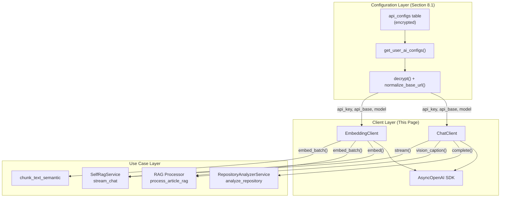
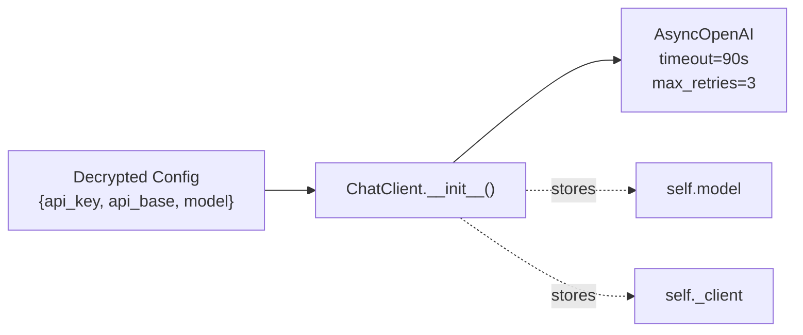
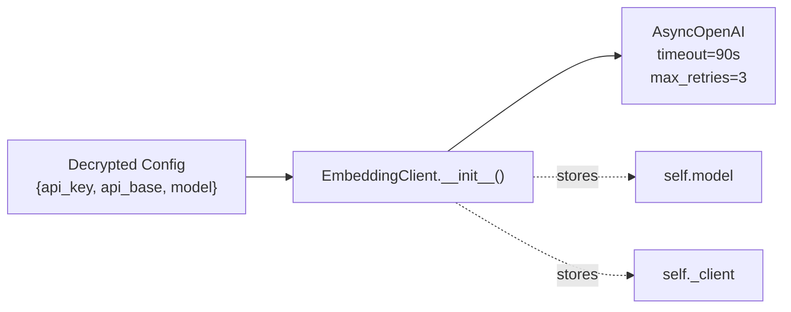
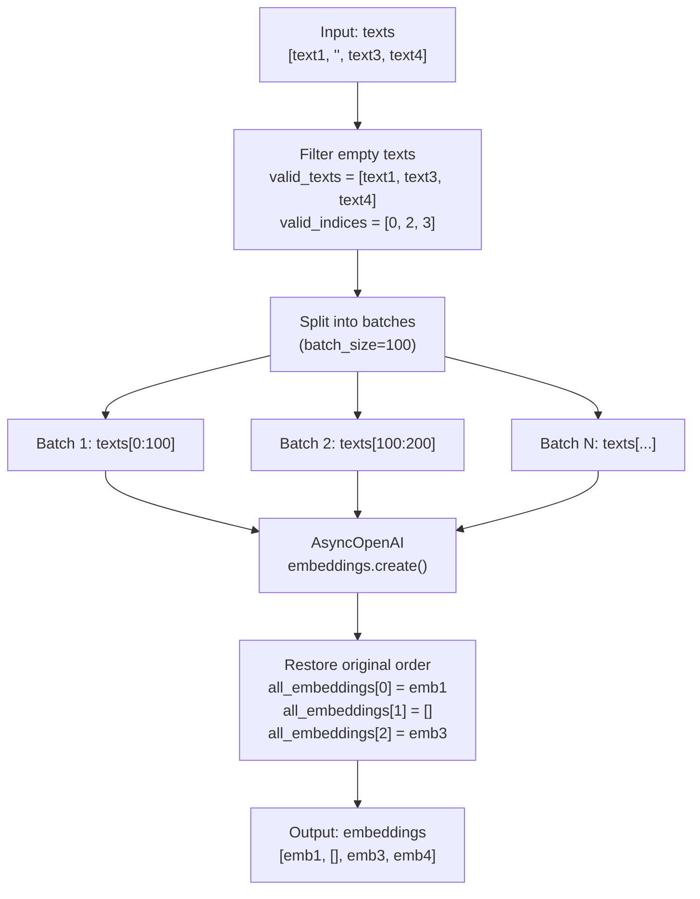
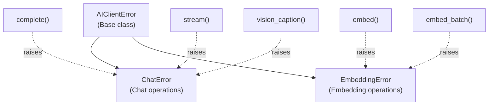
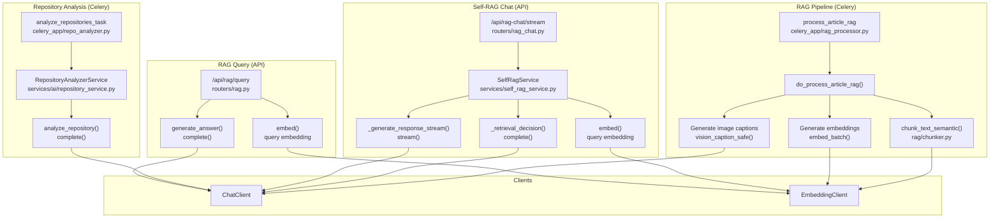
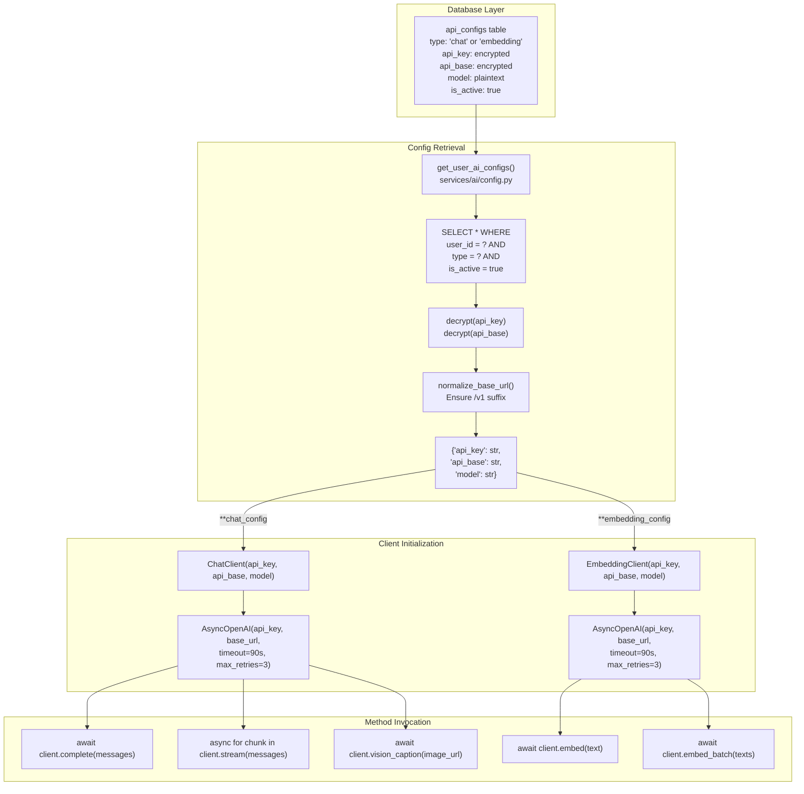

# Chat & Embedding Clients

<details>
<summary>Relevant source files</summary>

The following files were used as context for generating this wiki page:

- [backend/app/api/routers/rag.py](backend/app/api/routers/rag.py)
- [backend/app/celery_app/rag_processor.py](backend/app/celery_app/rag_processor.py)
- [backend/app/schemas/rag_chat.py](backend/app/schemas/rag_chat.py)
- [backend/app/services/ai/CLAUDE.md](backend/app/services/ai/CLAUDE.md)
- [backend/app/services/ai/__init__.py](backend/app/services/ai/__init__.py)
- [backend/app/services/ai/clients.py](backend/app/services/ai/clients.py)
- [backend/app/services/ai/config.py](backend/app/services/ai/config.py)
- [backend/app/services/ai/repository_service.py](backend/app/services/ai/repository_service.py)
- [backend/app/services/rag/CLAUDE.md](backend/app/services/rag/CLAUDE.md)
- [backend/app/services/rag/__init__.py](backend/app/services/rag/__init__.py)
- [backend/app/services/rag/chunker.py](backend/app/services/rag/chunker.py)
- [backend/app/services/self_rag_service.py](backend/app/services/self_rag_service.py)
- [backend/scripts/034_update_search_embeddings_for_references.sql](backend/scripts/034_update_search_embeddings_for_references.sql)
- [frontend/components/chat/article-reference-card.tsx](frontend/components/chat/article-reference-card.tsx)
- [frontend/components/chat/chat-message.tsx](frontend/components/chat/chat-message.tsx)
- [frontend/components/chat/reference-marker.tsx](frontend/components/chat/reference-marker.tsx)
- [frontend/components/chat/referenced-content.tsx](frontend/components/chat/referenced-content.tsx)
- [frontend/components/chat/repository-reference-card.tsx](frontend/components/chat/repository-reference-card.tsx)
- [frontend/lib/api/rag-chat.ts](frontend/lib/api/rag-chat.ts)
- [frontend/lib/reference-parser.ts](frontend/lib/reference-parser.ts)

</details>


## Purpose and Scope

This page documents the AI client abstraction layer that provides unified interfaces for interacting with OpenAI-compatible APIs. The `ChatClient` and `EmbeddingClient` classes wrap the AsyncOpenAI SDK and expose consistent, type-safe methods for chat completions, streaming responses, vision-based image captioning, and text vectorization.

**Related pages:**
- For AI configuration management, encryption, and URL normalization, see [AI Configuration Management](#8.1)
- For repository analysis using `ChatClient`, see [Repository Analysis](#8.3)
- For article content processing and image captioning, see [Content Processing](#8.4)
- For RAG chat implementation using both clients, see [AI Chat Service](#5.5)

The clients are provider-agnostic and support any OpenAI-compatible API endpoint (OpenAI, DeepSeek, DashScope, etc.) through normalized configuration.

**Sources:** [backend/app/services/ai/clients.py:1-365](), [backend/app/services/ai/__init__.py:1-63](), [backend/app/services/ai/CLAUDE.md:1-93]()

---

## Client Architecture

The AI services layer follows a three-tier design: configuration management, client abstraction, and use-case services. The clients sit in the middle layer, consuming decrypted and normalized configurations while providing high-level operations for upstream services.



**Key design principles:**
- **Decoupled from configuration:** Clients accept decrypted credentials, not raw database records
- **Provider-agnostic:** Support any OpenAI-compatible API through base URL normalization
- **Async-first:** All operations use async/await for non-blocking I/O
- **Type-safe:** Pydantic models and explicit exception types
- **Retry-aware:** Built-in retry logic with exponential backoff via AsyncOpenAI SDK

**Sources:** [backend/app/services/ai/clients.py:1-50](), [backend/app/services/ai/__init__.py:24-42](), [backend/app/services/ai/CLAUDE.md:27-63]()

---

## ChatClient

The `ChatClient` provides three core capabilities: non-streaming chat completions, streaming responses, and vision-based image analysis. It wraps AsyncOpenAI's chat completions API with consistent error handling and logging.

### Initialization



The constructor expects already-decrypted and normalized configuration. URL normalization ensures `api_base` ends with `/v1` for OpenAI SDK compatibility.

**Sources:** [backend/app/services/ai/clients.py:70-86]()

### Methods

#### complete() - Non-Streaming Chat

```python
async def complete(
    messages: List[Dict[str, Any]],
    temperature: float = 0.7,
    max_tokens: int = 2048,
) -> str
```

Generates a single response from the language model. Used for structured outputs like JSON analysis or one-shot queries.

**Usage example from RAG query:**
```python
# Generate answer from retrieved context
chat_client = ChatClient(**chat_config)
response = await chat_client.complete(
    messages=[
        {"role": "system", "content": system_prompt},
        {"role": "user", "content": user_prompt},
    ],
    max_tokens=4096,
)
```

**Error handling:** Raises `ChatError` on API failures, which wraps the underlying exception with context.

**Sources:** [backend/app/services/ai/clients.py:88-119](), [backend/app/api/routers/rag.py:282-289]()

---

#### stream() - Streaming Chat

```python
async def stream(
    messages: List[Dict[str, Any]],
    temperature: float = 0.7,
    max_tokens: int = 2048,
) -> AsyncGenerator[str, None]
```

Yields response chunks as they are generated, enabling real-time UI updates. Used by Self-RAG chat for progressive answer display.

**Usage example from Self-RAG:**
```python
async for chunk in self.chat_client.stream(
    messages=chat_messages,
    max_tokens=2048,
):
    full_response += chunk
    yield {"event": "content", "data": {"delta": chunk}}
```

**Frontend integration:** The frontend uses SSE (Server-Sent Events) to consume the stream, parsing `event:` and `data:` lines.

**Sources:** [backend/app/services/ai/clients.py:121-154](), [backend/app/services/self_rag_service.py:218-257]()

---

#### vision_caption() - Image Description

```python
async def vision_caption(
    image_url: str,
    prompt: str = CAPTION_PROMPT,
    max_tokens: int = 4096,
) -> str
```

Generates a detailed Chinese description of an image using vision-enabled models. The default prompt (`CAPTION_PROMPT`) instructs the model to extract text, describe layouts, identify charts/code, and keep descriptions under 200 characters.

**Vision prompt structure:**
```python
CAPTION_PROMPT = """你是一个专业的图片描述生成器。请仔细分析这张图片，用中文生成详细但简洁的描述。

要求：
1. 描述图片中的主要元素、场景和布局
2. 如果图片中有文字，请准确提取出来
3. 如果是图表或数据可视化，描述其类型和关键信息
4. 如果是代码截图，描述代码的语言和大致功能
5. 描述要信息完整但不超过200字

请直接输出描述内容，不要添加前缀或标签。"""
```

**Message format:** Uses OpenAI's vision API format with `type: "image_url"` content:
```python
messages=[{
    "role": "user",
    "content": [
        {"type": "text", "text": prompt},
        {"type": "image_url", "image_url": {"url": image_url}},
    ],
}]
```

**URL requirements:** The `image_url` must be publicly accessible or use Supabase Storage URLs with appropriate permissions.

**Sources:** [backend/app/services/ai/clients.py:26-35](), [backend/app/services/ai/clients.py:156-202]()

---

#### vision_caption_safe() - Fault-Tolerant Caption

```python
async def vision_caption_safe(
    image_url: str,
    prompt: str = CAPTION_PROMPT,
    max_tokens: int = 4096,
) -> Optional[str]
```

Wrapper around `vision_caption()` that returns `None` on failure instead of raising exceptions. Used in RAG processing where caption failures should not block article indexing.

**Usage in RAG pipeline:**
```python
for url in image_urls[:MAX_IMAGES_PER_ARTICLE]:
    caption = asyncio.run(chat_client.vision_caption_safe(url))
    if caption:
        captions[url] = caption
        image_count += 1
```

**Sources:** [backend/app/services/ai/clients.py:204-228](), [backend/app/celery_app/rag_processor.py:176-181]()

---

## EmbeddingClient

The `EmbeddingClient` converts text into dense vector representations for semantic search. It supports both single-text and batch operations with automatic empty text filtering and order preservation.

### Initialization



Identical initialization pattern to `ChatClient`. The same AsyncOpenAI client instance handles both chat and embedding endpoints.

**Sources:** [backend/app/services/ai/clients.py:244-260]()

---

### Methods

#### embed() - Single Text Embedding

```python
async def embed(
    text: str,
    dimensions: int = 1536
) -> List[float]
```

Generates a vector embedding for a single text string. Used for query embedding in semantic search.

**Usage in RAG query:**
```python
embedding_client = EmbeddingClient(**embedding_config)
query_embedding = await embedding_client.embed(query_request.query)

# Use for similarity search
hits = rag_service.search(
    query_embedding=query_embedding,
    top_k=query_request.top_k,
)
```

**Error handling:** Raises `EmbeddingError` if text is empty or API call fails.

**Sources:** [backend/app/services/ai/clients.py:262-288](), [backend/app/api/routers/rag.py:104-112]()

---

#### embed_batch() - Batch Embedding

```python
async def embed_batch(
    texts: List[str],
    dimensions: int = 1536,
    batch_size: int = DEFAULT_BATCH_SIZE,
) -> List[List[float]]
```

Generates embeddings for multiple texts in batches, with automatic filtering of empty strings and order preservation.

**Batch processing strategy:**



**Key features:**
- **Empty text handling:** Empty strings are filtered out before API calls and replaced with empty lists `[]` in output
- **Order preservation:** Results maintain the same index positions as input
- **Batch size:** Defaults to 100 texts per API call (configured in `DEFAULT_BATCH_SIZE`)
- **Sequential batching:** Batches are processed sequentially to avoid overwhelming the API

**Usage in RAG processing:**
```python
embedding_client = EmbeddingClient(**embedding_config)
texts = [chunk["content"] for chunk in final_chunks]
embeddings = asyncio.run(embedding_client.embed_batch(texts))

for i, chunk in enumerate(final_chunks):
    chunk["embedding"] = embeddings[i]
```

**Sources:** [backend/app/services/ai/clients.py:23-24](), [backend/app/services/ai/clients.py:290-364](), [backend/app/celery_app/rag_processor.py:226-236]()

---

## Error Handling

The client layer defines a three-level exception hierarchy for precise error categorization and handling strategies.

### Exception Hierarchy



**Exception types:**

| Exception | Raised By | Meaning |
|-----------|-----------|---------|
| `AIClientError` | Base class | Generic AI client error (rarely used directly) |
| `ChatError` | `complete()`, `stream()`, `vision_caption()` | Language model API call failed |
| `EmbeddingError` | `embed()`, `embed_batch()` | Embedding generation failed |

**Sources:** [backend/app/services/ai/clients.py:38-50]()

---

### Retry and Timeout Configuration

The AsyncOpenAI SDK provides built-in retry logic with exponential backoff. Clients configure these parameters at initialization:

```python
# Network configuration constants
DEFAULT_TIMEOUT = httpx.Timeout(90.0, connect=30.0)  # 90s total, 30s connect
DEFAULT_MAX_RETRIES = 3

# Applied in client initialization
self._client = AsyncOpenAI(
    api_key=api_key,
    base_url=api_base,
    timeout=DEFAULT_TIMEOUT,
    max_retries=DEFAULT_MAX_RETRIES,
)
```

**Timeout behavior:**
- **Connect timeout:** 30 seconds for establishing the TCP connection
- **Total timeout:** 90 seconds for the entire request/response cycle
- **Retry count:** Up to 3 retries with exponential backoff (1s, 2s, 4s)

**Rate limit handling:** The SDK automatically handles 429 (Too Many Requests) responses with backoff. For batch operations, additional staggered delays are applied at the task level (see [RAG Processing Pipeline](#6.4)).

**Sources:** [backend/app/services/ai/clients.py:18-21](), [backend/app/services/ai/clients.py:80-85]()

---

### Error Propagation Patterns

Different use cases handle client errors differently based on their fault tolerance requirements:

| Use Case | Strategy | Rationale |
|----------|----------|-----------|
| **RAG Query** | Fail-fast | User queries require immediate feedback |
| **Vision Caption** | Safe mode (`vision_caption_safe()`) | Individual image failures shouldn't block article indexing |
| **Repository Analysis** | Fallback to rule-based | Ensure repos are indexed even without AI |
| **Semantic Chunking** | Fallback to character splitting | Guarantee chunk generation for embeddings |

**Example: Safe mode in RAG processing**
```python
# Does not raise exceptions, returns None on failure
caption = await chat_client.vision_caption_safe(url)
if caption:
    captions[url] = caption
```

**Example: Fallback in semantic chunking**
```python
try:
    chunks = chunk_text_semantic(text, api_key, api_base, model)
except Exception as e:
    logger.warning(f"Semantic chunking failed, using fallback: {e}")
    chunks = fallback_chunk_text(text)  # Character-based splitting
```

**Sources:** [backend/app/services/ai/clients.py:204-228](), [backend/app/services/rag/chunker.py:294-329](), [backend/app/celery_app/rag_processor.py:198-207]()

---

## Integration Points

The clients are used across multiple subsystems for distinct AI capabilities. The following diagram maps code entities to their usage patterns:



**Key integration patterns:**

1. **RAG Processing Pipeline** ([section 6.4](#6.4)):
   - Vision captioning for images
   - Semantic chunking (uses embedding API internally)
   - Batch embedding generation for article chunks

2. **Self-RAG Chat** ([section 5.5](#5.5)):
   - Query embedding for semantic search
   - Retrieval decision using `complete()`
   - Streaming response generation

3. **Repository Analysis** ([section 8.3](#8.3)):
   - README content analysis using `complete()`
   - Structured extraction (summary, tags, platforms)

4. **RAG Query** ([section 5.4](#5.4)):
   - Query embedding for vector search
   - Optional answer generation from context

**Sources:** [backend/app/celery_app/rag_processor.py:169-179](), [backend/app/services/self_rag_service.py:44-54](), [backend/app/services/ai/repository_service.py:129-167](), [backend/app/api/routers/rag.py:98-112]()

---

## Client Lifecycle and Configuration Flow

This diagram traces the complete flow from database configuration to client method invocation, showing how configuration management (section 8.1) feeds into client initialization:



**Configuration lifecycle:**
1. User sets up API providers in Settings UI (frontend)
2. Credentials encrypted and stored in `api_configs` table
3. Backend retrieves active configs using `get_user_ai_configs()`
4. Decryption and URL normalization performed
5. Normalized configs passed to client constructors
6. Clients create AsyncOpenAI instances with retry/timeout settings
7. Methods invoked by use-case services

**Cache considerations:** Configurations are fetched per-request in HTTP handlers and per-task in Celery workers. No caching layer exists; decryption is performed on every retrieval. This ensures immediate config updates take effect.

**Sources:** [backend/app/services/ai/config.py:111-152](), [backend/app/services/ai/clients.py:70-86](), [backend/app/services/ai/clients.py:244-260](), [backend/app/api/routers/rag.py:48-76]()

---

## Usage Examples

### Example 1: RAG Article Processing

Complete workflow showing vision captioning, semantic chunking, and batch embedding:

```python
# From do_process_article_rag in celery_app/rag_processor.py

# 1. Get user AI configs
configs = get_user_api_configs(user_id)
chat_config = configs["chat"]
embedding_config = configs["embedding"]

# 2. Create ChatClient for vision
chat_client = ChatClient(
    api_key=chat_config["api_key"],
    api_base=chat_config["api_base"],
    model=chat_config["model"],
)

# 3. Generate image captions (safe mode)
for url in image_urls[:MAX_IMAGES_PER_ARTICLE]:
    caption = asyncio.run(chat_client.vision_caption_safe(url))
    if caption:
        captions[url] = caption

# 4. Semantic chunking (uses EmbeddingClient internally)
chunks = chunk_text_semantic(
    full_text,
    embedding_config["api_key"],
    embedding_config["api_base"],
    embedding_config["model"],
)

# 5. Batch generate embeddings
embedding_client = EmbeddingClient(
    api_key=embedding_config["api_key"],
    api_base=embedding_config["api_base"],
    model=embedding_config["model"],
)
texts = [c["content"] for c in final_chunks]
embeddings = asyncio.run(embedding_client.embed_batch(texts))

# 6. Save to database
for i, chunk in enumerate(final_chunks):
    chunk["embedding"] = embeddings[i]
rag_service.save_embeddings(article_id, final_chunks)
```

**Sources:** [backend/app/celery_app/rag_processor.py:141-239]()

---

### Example 2: Self-RAG Chat Stream

Streaming chat with query embedding and retrieval:

```python
# From SelfRagService in services/self_rag_service.py

# Initialize clients
self.chat_client = ChatClient(
    api_key=chat_config["api_key"],
    api_base=chat_config["api_base"],
    model=chat_config["model"],
)
self.embedding_client = EmbeddingClient(
    api_key=embedding_config["api_key"],
    api_base=embedding_config["api_base"],
    model=embedding_config["model"],
)

# Generate query embedding
query_embedding = await self.embedding_client.embed(user_query)

# Stream response
async for chunk in self.chat_client.stream(
    messages=chat_messages,
    max_tokens=2048,
):
    full_response += chunk
    yield {"event": "content", "data": {"delta": chunk}}
```

**Sources:** [backend/app/services/self_rag_service.py:44-54](), [backend/app/services/self_rag_service.py:156-163](), [backend/app/services/self_rag_service.py:252-257]()

---

### Example 3: Repository Analysis

Structured data extraction from README:

```python
# From RepositoryAnalyzerService in services/ai/repository_service.py

# Initialize analyzer with chat client
analyzer = RepositoryAnalyzerService(
    api_key=chat_config["api_key"],
    api_base=chat_config["api_base"],
    model=chat_config["model"],
)

# Analyze repository
result = await analyzer.analyze_repository(
    readme_content=repo["readme_content"],
    repo_name=repo["full_name"],
    description=repo.get("description"),
)

# Result contains:
# {
#     "ai_summary": "这是一个...",
#     "ai_tags": ["React", "TypeScript", "UI"],
#     "ai_platforms": ["Web", "macOS", "Windows"]
# }
```

**Sources:** [backend/app/services/ai/repository_service.py:129-174]()

---

## Provider Compatibility

The clients support any OpenAI-compatible API through URL normalization. The `normalize_base_url()` function (detailed in [section 8.1](#8.1)) handles various URL formats:

| Provider | Example Input | Normalized Output |
|----------|---------------|-------------------|
| OpenAI | `https://api.openai.com` | `https://api.openai.com/v1` |
| DeepSeek | `https://api.deepseek.com/v1/chat/completions` | `https://api.deepseek.com/v1` |
| DashScope | `https://dashscope.aliyuncs.com/compatible-mode/v1` | `https://dashscope.aliyuncs.com/compatible-mode/v1` |
| Custom | `api.example.com/embeddings` | `https://api.example.com/v1` |

**SDK behavior:** AsyncOpenAI automatically appends endpoint paths:
- Chat: `/chat/completions`
- Embedding: `/embeddings`
- Models: `/models`

The normalized base URL must end with `/v1` to avoid double-pathing (e.g., `/v1/v1/chat/completions`).

**Sources:** [backend/app/services/ai/config.py:25-75]()