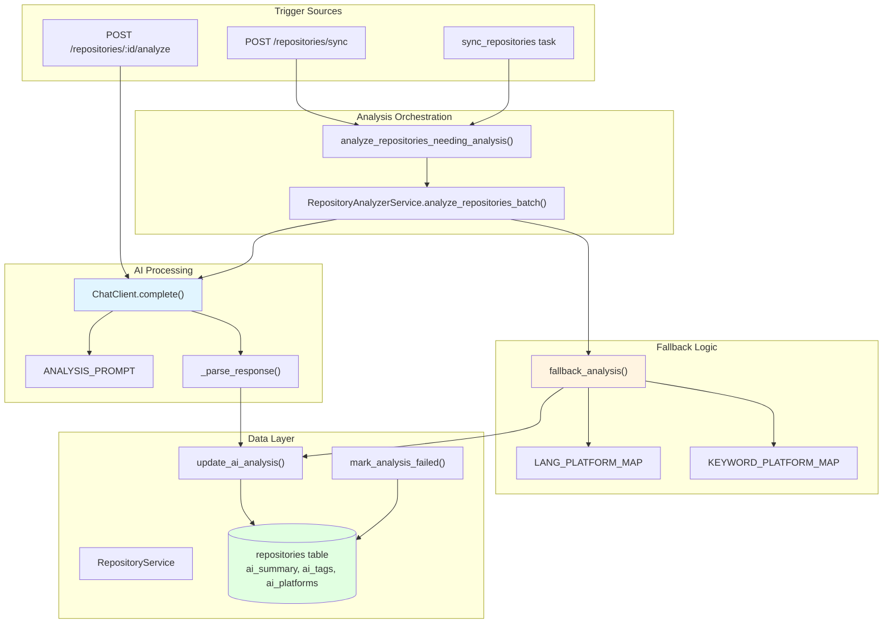
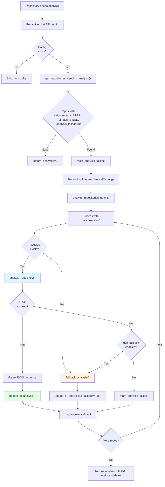
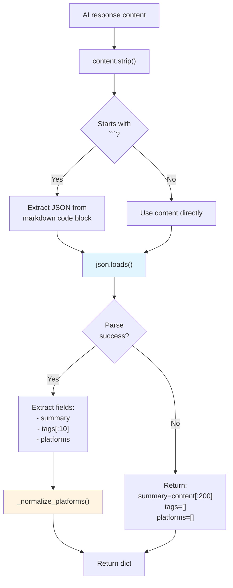
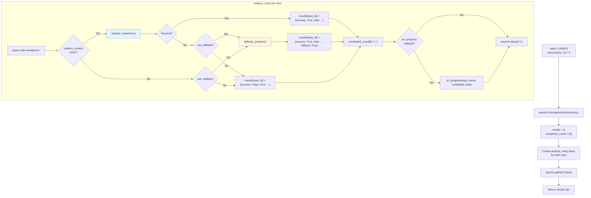
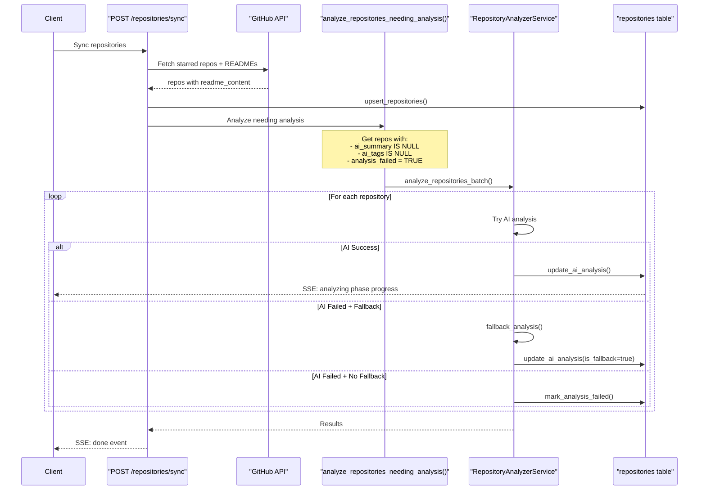

# Repository Analysis

<details>
<summary>Relevant source files</summary>

The following files were used as context for generating this wiki page:

- [backend/app/api/routers/rag.py](backend/app/api/routers/rag.py)
- [backend/app/api/routers/repositories.py](backend/app/api/routers/repositories.py)
- [backend/app/celery_app/rag_processor.py](backend/app/celery_app/rag_processor.py)
- [backend/app/celery_app/repository_tasks.py](backend/app/celery_app/repository_tasks.py)
- [backend/app/schemas/repositories.py](backend/app/schemas/repositories.py)
- [backend/app/services/ai/CLAUDE.md](backend/app/services/ai/CLAUDE.md)
- [backend/app/services/ai/__init__.py](backend/app/services/ai/__init__.py)
- [backend/app/services/ai/clients.py](backend/app/services/ai/clients.py)
- [backend/app/services/ai/config.py](backend/app/services/ai/config.py)
- [backend/app/services/ai/repository_service.py](backend/app/services/ai/repository_service.py)
- [backend/app/services/db/repositories.py](backend/app/services/db/repositories.py)
- [backend/app/services/openrank_service.py](backend/app/services/openrank_service.py)
- [backend/app/services/rag/CLAUDE.md](backend/app/services/rag/CLAUDE.md)
- [backend/app/services/rag/__init__.py](backend/app/services/rag/__init__.py)
- [backend/app/services/rag/chunker.py](backend/app/services/rag/chunker.py)
- [backend/app/services/repository_analyzer.py](backend/app/services/repository_analyzer.py)
- [backend/scripts/030_add_repository_openrank.sql](backend/scripts/030_add_repository_openrank.sql)
- [frontend/components/repository/repository-card.tsx](frontend/components/repository/repository-card.tsx)
- [frontend/components/repository/repository-page.tsx](frontend/components/repository/repository-page.tsx)
- [frontend/lib/api/repositories.ts](frontend/lib/api/repositories.ts)
- [frontend/lib/store/repositories.slice.ts](frontend/lib/store/repositories.slice.ts)
- [frontend/lib/types.ts](frontend/lib/types.ts)

</details>


This document explains the AI-powered repository analysis system that extracts structured metadata from GitHub repository README files. The analysis service uses Large Language Models to generate summaries, technical tags, and supported platform lists for repositories.

For information about repository synchronization and data fetching, see [Repository Management](#5.3). For AI configuration and client abstractions, see [Chat & Embedding Clients](#8.2).

## Purpose and Scope

The repository analysis system performs AI-driven content analysis on GitHub repositories to extract:

- **Summary**: A 50-100 character Chinese language description of the repository's purpose
- **Tags**: 3-5 technical keywords (e.g., "React", "TypeScript", "CLI")
- **Platforms**: Supported platforms (Windows, macOS, Linux, iOS, Android, Web, CLI, Docker)

Analysis is triggered automatically during repository sync and can be manually initiated via API. The system includes intelligent fallback logic that uses language and keyword heuristics when AI analysis fails.

## System Architecture



**Sources:** [backend/app/services/ai/repository_service.py:1-332](), [backend/app/services/repository_analyzer.py:1-104](), [backend/app/api/routers/repositories.py:189-194]()

## Analysis Workflow

The repository analysis follows a multi-stage pipeline that handles both successful AI analysis and failure scenarios:



**Sources:** [backend/app/services/repository_analyzer.py:19-104](), [backend/app/services/ai/repository_service.py:269-331]()

## RepositoryAnalyzerService

### Core Class Structure

The `RepositoryAnalyzerService` class in [backend/app/services/ai/repository_service.py:64-331]() provides the main AI analysis capabilities:

| Method | Purpose | Key Parameters |
|--------|---------|----------------|
| `analyze_repository()` | Analyze single repository README | `readme_content`, `repo_name`, `description` |
| `analyze_repositories_batch()` | Batch process with concurrency control | `repos`, `concurrency=5`, `use_fallback=True` |
| `fallback_analysis()` | Language/keyword-based fallback | `repo` dict with language, description, name |
| `_parse_response()` | Parse AI JSON response | `content` string from ChatClient |
| `_normalize_platforms()` | Standardize platform names | `platforms` list |

### AI Prompt Engineering

The analysis prompt is defined in [backend/app/services/ai/repository_service.py:47-61]():

```
ANALYSIS_PROMPT = """你是一个专业的GitHub仓库分析助手。请分析以下仓库的README内容，并提取关键信息。

请以JSON格式返回以下信息：
1. summary: 用中文简洁描述这个仓库的主要功能和用途（50-100字）
2. tags: 提取3-5个技术标签（如：React, TypeScript, CLI, API等）
3. platforms: 识别支持的平台（可选值：Windows, macOS, Linux, iOS, Android, Web, CLI, Docker）

只返回JSON，不要有其他内容。格式示例：
{
  "summary": "这是一个...",
  "tags": ["React", "TypeScript", "UI"],
  "platforms": ["Web", "macOS", "Windows"]
}
"""
```

The prompt is specifically designed to extract structured data in Chinese for better integration with the application's target audience.

**Sources:** [backend/app/services/ai/repository_service.py:46-61]()

### JSON Response Parsing

Response parsing handles multiple edge cases in [backend/app/services/ai/repository_service.py:176-211]():



**Sources:** [backend/app/services/ai/repository_service.py:176-211]()

## Fallback Analysis Logic

### Language-to-Platform Mapping

When AI analysis fails or no README exists, the system uses heuristic mappings defined in [backend/app/services/ai/repository_service.py:68-83]():

| Language | Inferred Platforms | Rationale |
|----------|-------------------|-----------|
| JavaScript, TypeScript | Web, CLI | Browser/Node.js runtimes |
| Python, Go, Rust | Linux, macOS, Windows, CLI | Cross-platform system languages |
| Swift | iOS, macOS | Apple ecosystem |
| Kotlin | Android | JVM mobile language |
| Dart | iOS, Android | Flutter framework |
| Shell | Linux, macOS, CLI | Unix scripting |
| PHP, Ruby | Web, Linux | Web server languages |

### Keyword-to-Platform Mapping

The system also analyzes repository description and name for platform keywords in [backend/app/services/ai/repository_service.py:86-112]():

| Keyword | Inferred Platforms | Examples |
|---------|-------------------|----------|
| "web", "frontend", "browser", "react", "vue", "angular" | Web | Frontend frameworks |
| "ios", "iphone", "ipad" | iOS | Apple mobile |
| "android", "mobile" | Android, iOS | Mobile development |
| "desktop", "electron", "tauri" | Windows, macOS, Linux | Desktop frameworks |
| "cli", "terminal", "command-line" | CLI | Command-line tools |
| "docker", "container", "kubernetes" | Docker | Containerization |

### Fallback Implementation

The fallback analysis in [backend/app/services/ai/repository_service.py:234-267]() combines both approaches:

```python
def fallback_analysis(self, repo: dict) -> dict:
    language = repo.get("language") or ""
    description = (repo.get("description") or "").lower()
    name = (repo.get("name") or "").lower()
    search_text = f"{description} {name}"
    
    platforms = []
    
    # Infer from programming language
    if language in self.LANG_PLATFORM_MAP:
        platforms.extend(self.LANG_PLATFORM_MAP[language])
    
    # Infer from keywords in description/name
    for keyword, plats in self.KEYWORD_PLATFORM_MAP.items():
        if keyword in search_text:
            platforms.extend(plats)
    
    # Deduplicate and return
    return {
        "ai_summary": "",
        "ai_tags": [],
        "ai_platforms": unique_platforms[:6],
    }
```

**Sources:** [backend/app/services/ai/repository_service.py:234-267]()

## Batch Processing

### Concurrency Control

The batch analyzer uses asyncio semaphores to limit concurrent AI API calls in [backend/app/services/ai/repository_service.py:269-331]():



This design ensures:
- Maximum of 5 concurrent API calls (configurable)
- Automatic fallback on AI failures
- Progress reporting for UI updates
- Rate limiting via 0.1s sleep between requests

**Sources:** [backend/app/services/ai/repository_service.py:269-331]()

## Database Schema

### Analysis Result Fields

The `repositories` table stores analysis results in [backend/app/services/db/repositories.py:503-508]():

| Field | Type | Purpose | Nullable |
|-------|------|---------|----------|
| `ai_summary` | TEXT | AI-generated Chinese description | Yes |
| `ai_tags` | TEXT[] | Technical keywords/tags | Yes |
| `ai_platforms` | TEXT[] | Supported platforms | Yes |
| `analyzed_at` | TIMESTAMPTZ | Timestamp of last analysis | Yes |
| `analysis_failed` | BOOLEAN | Indicates analysis failure | No (default: false) |

### Update Operations

The `RepositoryService` provides two methods for updating analysis results:

**Successful Analysis** in [backend/app/services/db/repositories.py:295-331]():

```python
def update_ai_analysis(self, repo_id: str, analysis: dict, is_fallback: bool = False):
    update_data = {
        "ai_summary": analysis.get("ai_summary"),
        "ai_tags": analysis.get("ai_tags", []),
        "ai_platforms": analysis.get("ai_platforms", []),
        "analyzed_at": datetime.now(timezone.utc).isoformat(),
        "analysis_failed": is_fallback,  # Mark fallback as "failed"
    }
```

**Failed Analysis** in [backend/app/services/db/repositories.py:333-350]():

```python
def mark_analysis_failed(self, repo_id: str):
    update_data = {
        "analyzed_at": datetime.now(timezone.utc).isoformat(),
        "analysis_failed": True,
    }
```

### Retry Logic

The system identifies repositories needing (re)analysis using [backend/app/services/db/repositories.py:380-398]():

```sql
SELECT * FROM repositories 
WHERE user_id = $1 
AND (
    ai_summary IS NULL 
    OR ai_tags IS NULL 
    OR ai_tags = '{}'
    OR analysis_failed = TRUE
)
```

This query ensures:
- New repositories without any analysis are included
- Repositories with incomplete analysis (missing summary or tags) are retried
- Previously failed analyses are retried automatically

**Sources:** [backend/app/services/db/repositories.py:295-398]()

## Integration Points

### Sync Workflow Integration

Repository analysis is automatically triggered during sync in [backend/app/api/routers/repositories.py:166-196]():



**Sources:** [backend/app/api/routers/repositories.py:166-196](), [backend/app/services/repository_analyzer.py:19-104]()

### Manual Analysis API

Individual repositories can be analyzed on-demand via [backend/app/api/routers/repositories.py:425-486]():

```
POST /api/repositories/{repo_id}/analyze

Response:
{
  "ai_summary": "这是一个用于构建现代Web应用的React框架",
  "ai_tags": ["React", "TypeScript", "Web"],
  "ai_platforms": ["Web"],
  "analyzed_at": "2024-01-15T10:30:00Z",
  "analysis_failed": false
}
```

This endpoint:
1. Verifies the repository has `readme_content`
2. Gets user's active chat API config
3. Calls `RepositoryAnalyzerService.analyze_repository()`
4. Updates database with results or marks as failed
5. Returns updated repository object

**Sources:** [backend/app/api/routers/repositories.py:425-486]()

### Background Task Integration

The Celery task `sync_repositories` in [backend/app/celery_app/repository_tasks.py:573-596]() calls analysis after fetching:

```python
# AI analyze repositories needing analysis (no condition check)
ai_result = {"ai_analyzed": 0, "ai_failed": 0, "ai_candidates": 0}
try:
    ai_analysis = do_ai_analysis(user_id)
    ai_result["ai_analyzed"] = ai_analysis["analyzed"]
    ai_result["ai_failed"] = ai_analysis["failed"]
    ai_result["ai_candidates"] = ai_analysis.get("total_candidates", 0)
except Exception as e:
    logger.warning(f"AI analysis during sync failed: {e}")
```

The `do_ai_analysis()` wrapper in [backend/app/celery_app/repository_tasks.py:138-164]() runs the async analysis function in a sync context:

```python
def do_ai_analysis(user_id: str) -> Dict[str, Any]:
    supabase = get_supabase_service()
    
    loop = asyncio.new_event_loop()
    asyncio.set_event_loop(loop)
    try:
        result = loop.run_until_complete(
            analyze_repositories_needing_analysis(
                supabase=supabase,
                user_id=user_id,
                on_progress=None,
            )
        )
    finally:
        loop.close()
    
    return result
```

**Sources:** [backend/app/celery_app/repository_tasks.py:138-164](), [backend/app/celery_app/repository_tasks.py:573-596]()

## Frontend Display

The analysis results are displayed in repository cards via [frontend/components/repository/repository-card.tsx:82-93]():

```typescript
const getDisplayContent = () => {
  if (repository.customDescription) {
    return { content: repository.customDescription, isCustom: true }
  }
  if (repository.analysisFailed) {
    return { content: repository.description || "暂无描述", isFailed: true }
  }
  if (repository.aiSummary) {
    return { content: repository.aiSummary, isAI: true }
  }
  return { content: repository.description || "暂无描述" }
}
```

Priority for display content:
1. **Custom description** (user-edited) - orange badge
2. **AI summary** (if analysis succeeded) - green badge with Bot icon
3. **GitHub description** (original) - no badge
4. **Fallback** (if analysis failed) - red indicator

The AI analysis status is visually indicated with colored action buttons in [frontend/components/repository/repository-card.tsx:179-192]():

```typescript
<button
  onClick={handleAIAnalyze}
  disabled={isAnalyzing}
  className={
    repository.analysisFailed
      ? "bg-destructive/10 text-destructive"      // Red: failed
      : repository.analyzedAt
      ? "bg-green-100 text-green-600"             // Green: analyzed
      : "bg-purple-100 text-purple-600"           // Purple: not analyzed
  }
>
  <Bot className="w-4 h-4" />
</button>
```

**Sources:** [frontend/components/repository/repository-card.tsx:82-93](), [frontend/components/repository/repository-card.tsx:179-192]()