# Content Processing

<details>
<summary>Relevant source files</summary>

The following files were used as context for generating this wiki page:

- [backend/app/api/routers/rag.py](backend/app/api/routers/rag.py)
- [backend/app/celery_app/rag_processor.py](backend/app/celery_app/rag_processor.py)
- [backend/app/services/ai/CLAUDE.md](backend/app/services/ai/CLAUDE.md)
- [backend/app/services/ai/__init__.py](backend/app/services/ai/__init__.py)
- [backend/app/services/ai/clients.py](backend/app/services/ai/clients.py)
- [backend/app/services/ai/config.py](backend/app/services/ai/config.py)
- [backend/app/services/ai/repository_service.py](backend/app/services/ai/repository_service.py)
- [backend/app/services/db/rag.py](backend/app/services/db/rag.py)
- [backend/app/services/rag/CLAUDE.md](backend/app/services/rag/CLAUDE.md)
- [backend/app/services/rag/__init__.py](backend/app/services/rag/__init__.py)
- [backend/app/services/rag/chunker.py](backend/app/services/rag/chunker.py)
- [backend/app/services/rag/retriever.py](backend/app/services/rag/retriever.py)
- [backend/scripts/029_rename_article_embeddings_to_all_embeddings.sql](backend/scripts/029_rename_article_embeddings_to_all_embeddings.sql)
- [backend/scripts/031_add_repository_embeddings.sql](backend/scripts/031_add_repository_embeddings.sql)
- [backend/scripts/032_fix_all_embeddings_article_id_nullable.sql](backend/scripts/032_fix_all_embeddings_article_id_nullable.sql)
- [docs/RSS_subscribe/RSS_FLOW_COMPLETE.md](docs/RSS_subscribe/RSS_FLOW_COMPLETE.md)

</details>


## Purpose and Scope

This document describes the content processing pipeline that transforms raw article HTML into searchable vector embeddings. The pipeline consists of HTML parsing, image caption generation, semantic text chunking, and vector embedding creation. This is a core component of SaveHub's RAG (Retrieval-Augmented Generation) capabilities.

**Related Pages:**
- For the Celery task orchestration that triggers this pipeline, see [RAG Processing Pipeline](#6.4)
- For the AI client abstractions used here, see [Chat & Embedding Clients](#8.2)
- For configuration management, see [AI Configuration Management](#8.1)
- For vector search operations, see [RAG & Search Services](#5.4)

---

## Processing Pipeline Overview

The content processing pipeline transforms article HTML through four sequential stages, ultimately producing vector embeddings stored in the `all_embeddings` table for semantic search.

### High-Level Flow

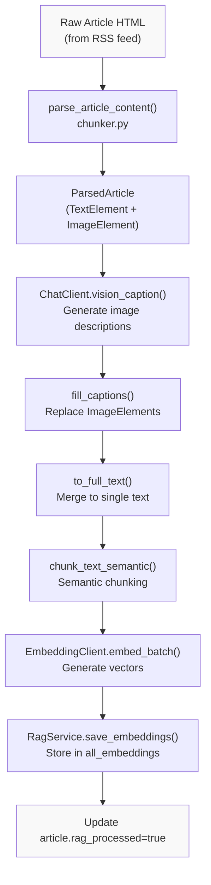

**Sources:** [backend/app/celery_app/rag_processor.py:87-266](), [backend/app/services/rag/chunker.py:1-378]()

### Entry Point: `do_process_article_rag`

The core processing logic is implemented in `do_process_article_rag()`, which orchestrates all stages:

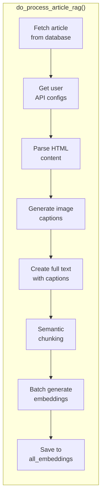

**Sources:** [backend/app/celery_app/rag_processor.py:87-266]()

---

## HTML Parsing and Element Extraction

### ParsedArticle Data Structure

The parser maintains the original order of text and images through a structured representation:

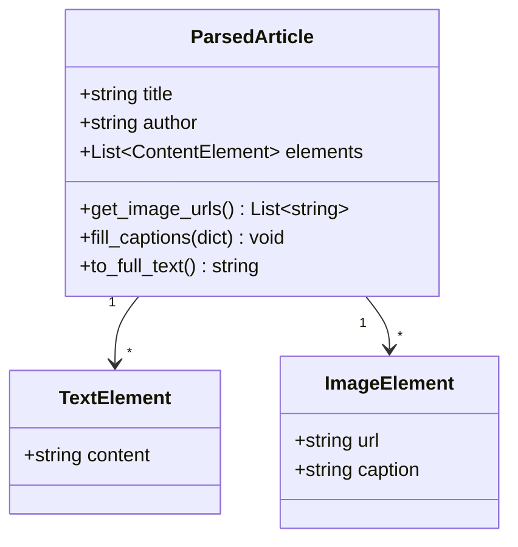

**Sources:** [backend/app/services/rag/chunker.py:23-93]()

### Parsing Process

The `parse_article_content()` function extracts structured content while preserving layout:

| Function | Responsibility | Output |
|----------|---------------|---------|
| `parse_article_content()` | Main entry point | `ParsedArticle` with ordered elements |
| `parse_html_to_elements()` | HTML traversal | List of `TextElement` and `ImageElement` |
| `_resolve_url()` | Convert relative to absolute URLs | Absolute image URLs |
| `clean_text()` | Normalize whitespace | Cleaned text content |

**Key Features:**
- **Order preservation**: Text and images maintain their relative positions from the original HTML
- **URL resolution**: Relative image URLs are converted to absolute using the article's base URL
- **Block-level awareness**: Paragraph, heading, and list elements create natural text boundaries

**Sources:** [backend/app/services/rag/chunker.py:99-262]()

### HTML Traversal Algorithm

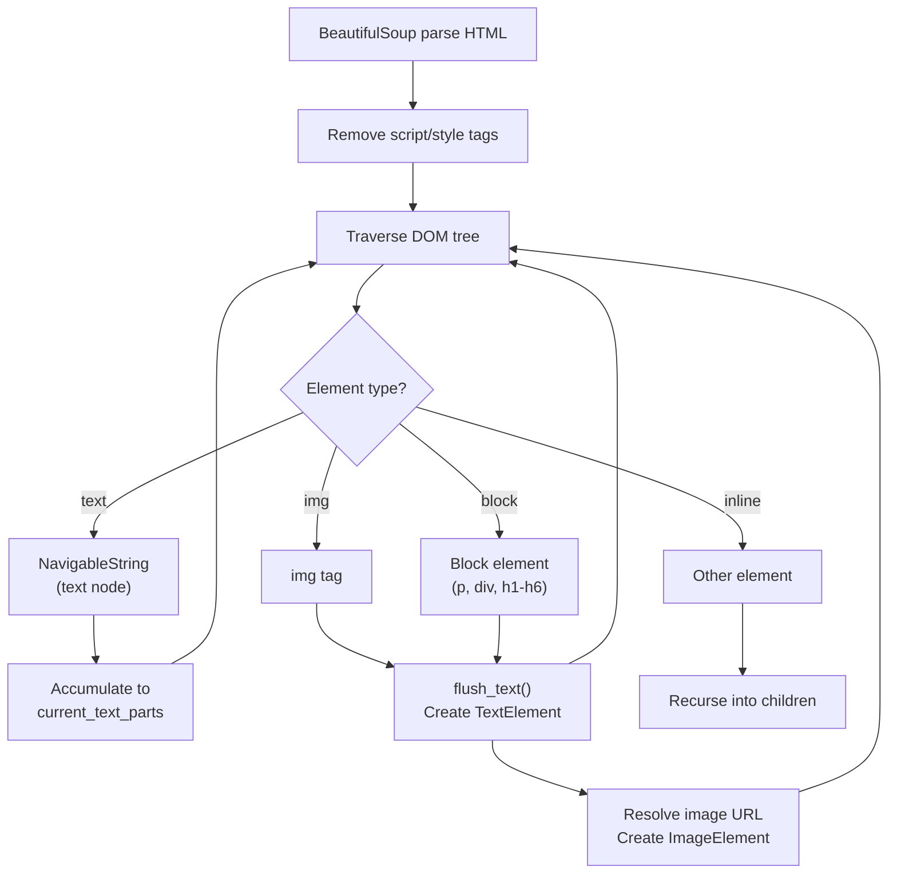

**Sources:** [backend/app/services/rag/chunker.py:153-224]()

### URL Resolution Logic

The `_resolve_url()` function handles various URL formats encountered in RSS feeds:

| Input Pattern | Example | Output |
|---------------|---------|--------|
| Absolute URL | `https://example.com/image.jpg` | `https://example.com/image.jpg` |
| Protocol-relative | `//example.com/image.jpg` | `https://example.com/image.jpg` |
| Root-relative | `/images/photo.jpg` | `https://example.com/images/photo.jpg` |
| Path-relative | `../images/photo.jpg` | `https://example.com/path/images/photo.jpg` |
| Data URI | `data:image/png;base64,...` | Skipped |

**Implementation:** Uses `urllib.parse.urljoin()` for RFC-compliant URL resolution with the article's original URL as the base.

**Sources:** [backend/app/services/rag/chunker.py:114-151]()

---

## Image Caption Generation

### Vision API Integration

Image captions are generated using the `ChatClient.vision_caption()` method, which sends images to a vision-capable language model:

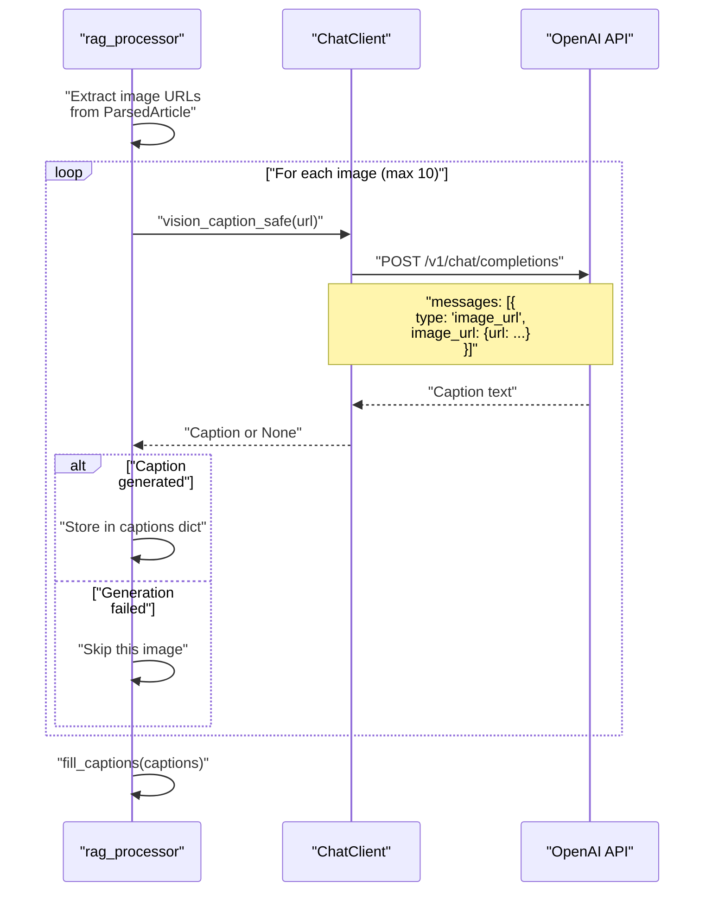

**Sources:** [backend/app/celery_app/rag_processor.py:164-181](), [backend/app/services/ai/clients.py:204-228]()

### Caption Generation Constants

| Constant | Value | Purpose |
|----------|-------|---------|
| `MAX_IMAGES_PER_ARTICLE` | 10 | Limit processing cost per article |
| `IMAGE_CAPTION_TIMEOUT` | 30 seconds | Timeout for single image caption |
| `CAPTION_PROMPT` | Vision prompt template | Instructs model on caption format |

**The Caption Prompt:**
The system uses a detailed prompt to ensure high-quality, informative captions:

```
你是一个专业的图片描述生成器。请仔细分析这张图片，用中文生成详细但简洁的描述。

要求：
1. 描述图片中的主要元素、场景和布局
2. 如果图片中有文字，请准确提取出来
3. 如果是图表或数据可视化，描述其类型和关键信息
4. 如果是代码截图，描述代码的语言和大致功能
5. 描述要信息完整但不超过200字

请直接输出描述内容，不要添加前缀或标签。
```

**Sources:** [backend/app/services/ai/clients.py:26-35](), [backend/app/celery_app/rag_processor.py:29-30]()

### Safe Caption Generation

The `vision_caption_safe()` method wraps `vision_caption()` with error handling:

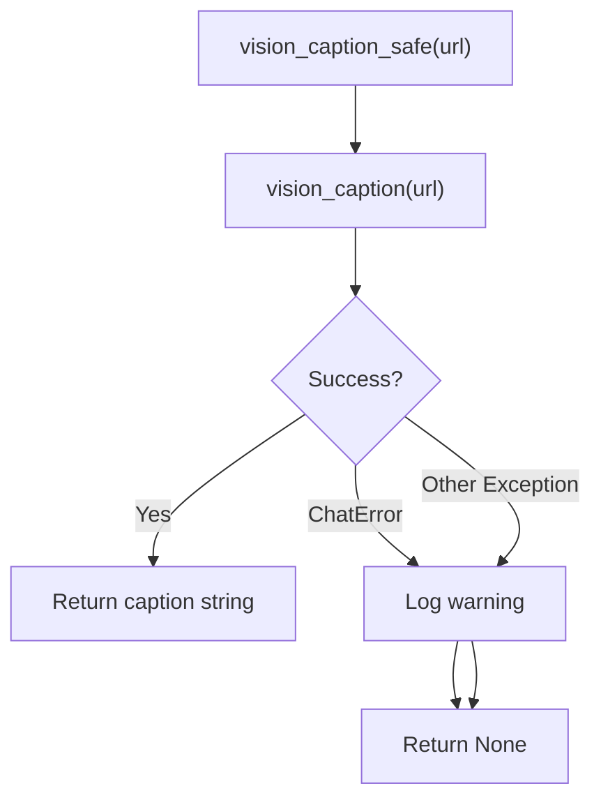

**Behavior:**
- Returns `None` on any error (API failures, invalid URLs, timeouts)
- Allows processing to continue even if some images fail
- Logs failures at WARNING level for debugging

**Sources:** [backend/app/services/ai/clients.py:204-228]()

---

## Content Merging and Full Text Construction

### Caption Integration Process

After caption generation, the `fill_captions()` method replaces `ImageElement` placeholders with their captions:

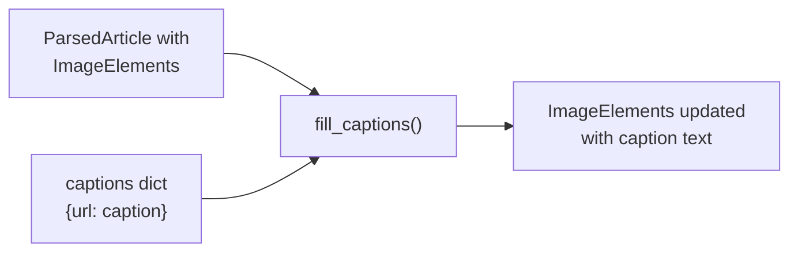

**Sources:** [backend/app/celery_app/rag_processor.py:184](), [backend/app/services/rag/chunker.py:57-66]()

### Full Text Generation

The `to_full_text()` method converts the structured `ParsedArticle` into a single text string suitable for chunking:

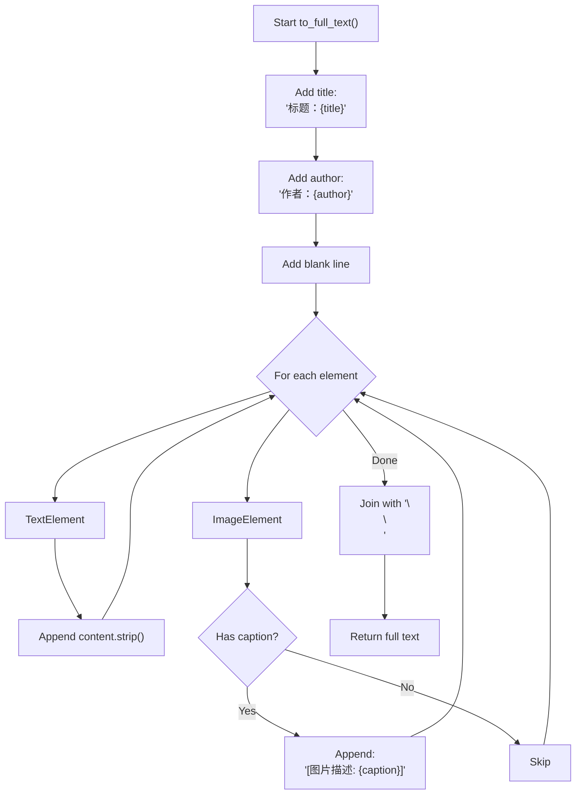

**Output Format Example:**
```
标题：深入理解 Python 异步编程
作者：张三

Python 的异步编程基于 asyncio 模块...

[图片描述: 一段 Python 代码截图，展示了 async/await 语法的使用示例]

异步函数使用 async def 定义...
```

**Sources:** [backend/app/services/rag/chunker.py:68-92]()

---

## Semantic Chunking

### Chunking Strategy Selection

The system attempts semantic chunking first, with a fallback to simple character-based chunking:

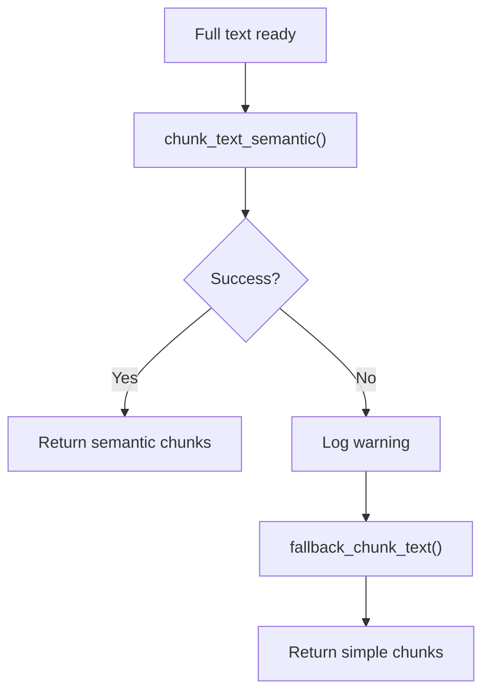

**Sources:** [backend/app/celery_app/rag_processor.py:198-207]()

### Semantic Chunking with LangChain

The `chunk_text_semantic()` function uses LangChain's `SemanticChunker` for intelligent text splitting:

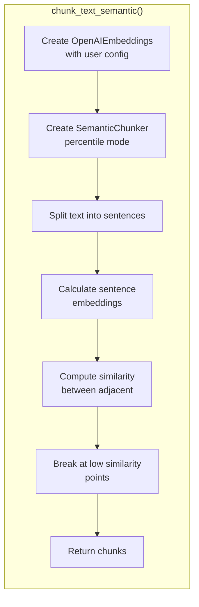

**Configuration:**
- **Breakpoint threshold type**: `percentile` (breaks at statistically significant similarity drops)
- **Embedding model**: User's configured embedding model
- **API base**: Normalized to OpenAI-compatible format

**Sources:** [backend/app/services/rag/chunker.py:268-330]()

### Fallback Chunking

When semantic chunking fails, the system uses `fallback_chunk_text()`:

| Parameter | Default | Description |
|-----------|---------|-------------|
| `max_chars` | 1000 | Maximum characters per chunk |
| `overlap` | 100 | Overlapping characters between chunks |

**Algorithm:**
1. If text length ≤ `max_chars`, return as single chunk
2. Split into `max_chars` sized chunks with `overlap`
3. Try to break at sentence boundaries (。！？.!?)
4. Ensure at least 50% of `max_chars` per chunk

**Sources:** [backend/app/services/rag/chunker.py:332-377]()

### Chunking Comparison

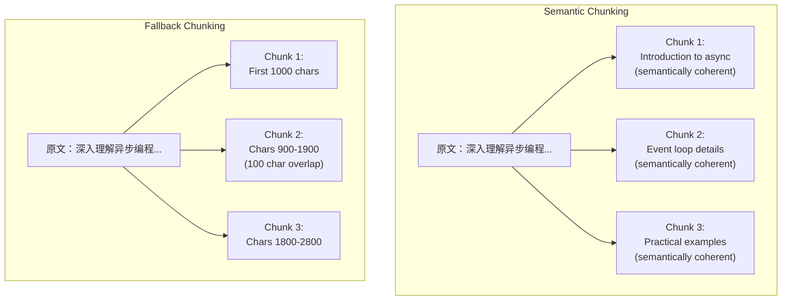

**Sources:** [backend/app/services/rag/chunker.py:268-377]()

---

## Embedding Generation

### Batch Embedding Process

The `EmbeddingClient.embed_batch()` method generates vectors for all chunks in a single batch:

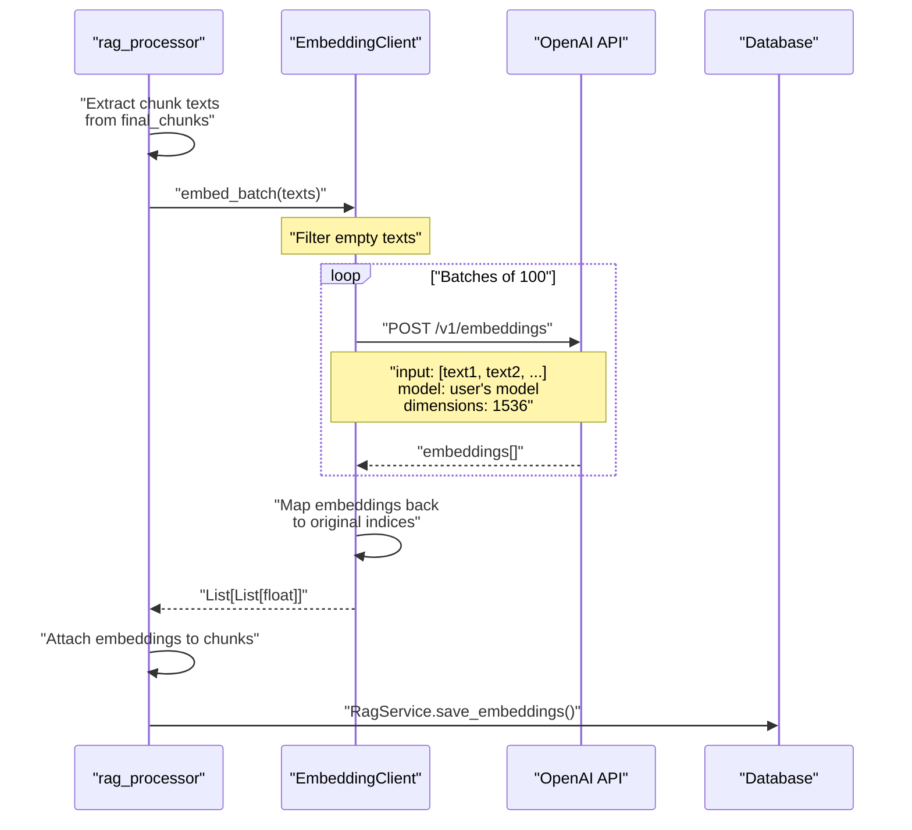

**Sources:** [backend/app/celery_app/rag_processor.py:227-236](), [backend/app/services/ai/clients.py:290-364]()

### Batch Processing Configuration

| Parameter | Default | Purpose |
|-----------|---------|---------|
| `batch_size` | 100 | Texts per API request |
| `dimensions` | 1536 | Vector dimensionality (OpenAI default) |
| `timeout` | 90 seconds | Per-request timeout |
| `max_retries` | 3 | Automatic retry count |

**Batching Strategy:**
- Processes texts in groups of 100 to optimize API usage
- Preserves original text order in output
- Handles empty texts gracefully (returns empty vector)
- Maps results back to correct indices even with gaps

**Sources:** [backend/app/services/ai/clients.py:23-24, 290-364]()

### Chunk Data Structure

Before database insertion, each chunk is enriched with its embedding:

```python
final_chunks = [{
    "chunk_index": 0,          # Position in original text
    "content": "chunk text",   # Text content
    "embedding": [0.123, ...]  # 1536-dimensional vector
}, ...]
```

**Sources:** [backend/app/celery_app/rag_processor.py:214-236]()

---

## Storage and Status Tracking

### Database Insertion

The `RagService.save_embeddings()` method performs atomic upsert:

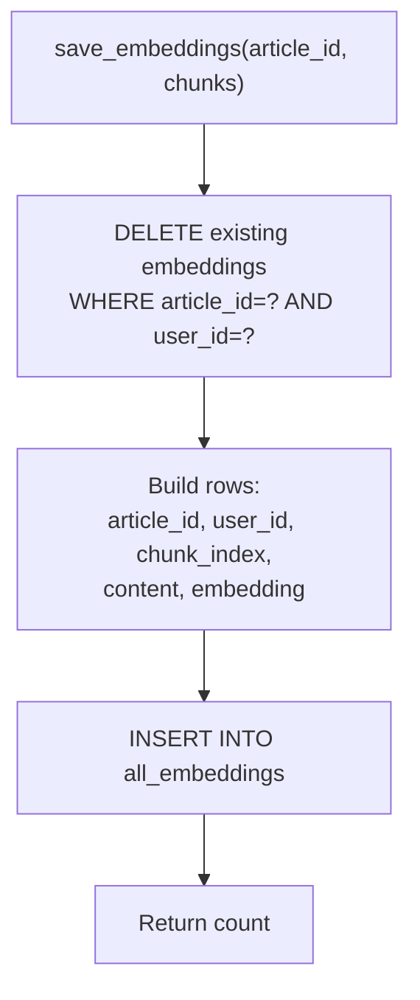

**Idempotency:**
- Deletes existing embeddings for the article before inserting new ones
- Ensures reprocessing doesn't create duplicates
- Atomic transaction guarantees consistency

**Sources:** [backend/app/services/db/rag.py:27-87]()

### all_embeddings Table Schema

| Column | Type | Description |
|--------|------|-------------|
| `id` | UUID | Primary key |
| `article_id` | UUID (nullable) | References `articles.id` |
| `repository_id` | UUID (nullable) | References `repositories.id` |
| `user_id` | UUID | User isolation |
| `chunk_index` | INTEGER | Order within source content |
| `content` | TEXT | Text content (with image captions) |
| `embedding` | vector(1536) | pgvector embedding |
| `metadata` | JSONB | Optional metadata |
| `created_at` | TIMESTAMPTZ | Creation timestamp |

**Constraints:**
- `article_id` XOR `repository_id` must be set (checked via constraint)
- Foreign keys cascade on delete
- RLS policies enforce user isolation

**Sources:** [backend/scripts/031_add_repository_embeddings.sql:1-155](), [backend/scripts/032_fix_all_embeddings_article_id_nullable.sql:1-19]()

### Article Status Update

After successful embedding generation, the article is marked as processed:


**Status Field Values:**

| `rag_processed` | Meaning | Next Action |
|----------------|---------|-------------|
| `NULL` | Not yet processed | Pending RAG task |
| `true` | Successfully processed | None (complete) |
| `false` | Processing failed | Retry or skip |

**Sources:** [backend/app/celery_app/rag_processor.py:242](), [backend/app/services/db/rag.py:132-156]()

---

## Error Handling and Recovery

### Error Classification

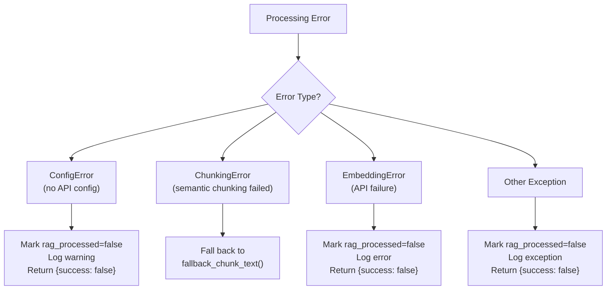

**Sources:** [backend/app/celery_app/rag_processor.py:255-266]()

### Compensatory Scanning

The `scan_pending_rag_articles` task runs every 30 minutes to catch missed articles:

```sql
SELECT id, user_id FROM articles
WHERE images_processed = true
  AND rag_processed IS NULL
ORDER BY created_at DESC
LIMIT 50
```

**Scheduling:**
- Each article gets a staggered 5-second delay to avoid API rate limits
- Processes up to 50 articles per scan
- Scheduled via Celery Beat

**Sources:** [backend/app/celery_app/rag_processor.py:382-416]()

### Retry Configuration

The `process_article_rag` Celery task has built-in retry logic:

| Parameter | Value | Purpose |
|-----------|-------|---------|
| `max_retries` | 2 | Maximum retry attempts |
| `default_retry_delay` | 60 seconds | Initial delay between retries |
| `retry_backoff` | True | Exponential backoff enabled |
| `retry_backoff_max` | 300 seconds | Maximum backoff delay |
| `time_limit` | 300 seconds | Hard timeout (5 minutes) |
| `soft_time_limit` | 270 seconds | Soft timeout (4.5 minutes) |

**Sources:** [backend/app/celery_app/rag_processor.py:295-307]()

---

## Performance Characteristics

### Processing Time Breakdown

Typical processing time for a 2000-word article with 5 images:

| Stage | Duration | Notes |
|-------|----------|-------|
| HTML parsing | ~50ms | BeautifulSoup processing |
| Image caption generation | ~15-30s | 5 images × 3-6s each |
| Full text construction | ~10ms | String concatenation |
| Semantic chunking | ~2-5s | Requires embedding API calls |
| Batch embedding generation | ~1-3s | Single API request for all chunks |
| Database insertion | ~100ms | PostgreSQL upsert |
| **Total** | **~20-40s** | Dominated by vision API calls |

**Optimization Notes:**
- Vision API calls are sequential with safe error handling
- Semantic chunking requires embeddings but caches results
- Batch embedding is more efficient than per-chunk requests

### Resource Limits

| Limit | Value | Rationale |
|-------|-------|-----------|
| Max images per article | 10 | Balance quality vs. cost |
| Max caption length | 200 chars | Sufficient detail without bloat |
| Chunk size (fallback) | 1000 chars | Fits typical embedding context |
| Chunk overlap | 100 chars | Maintains context at boundaries |
| Batch size | 100 texts | OpenAI API batch limit |

**Sources:** [backend/app/celery_app/rag_processor.py:28-30](), [backend/app/services/rag/chunker.py:332](), [backend/app/services/ai/clients.py:23]()

---

## Integration Points

### Called By

The content processing pipeline is triggered by:

1. **Feed Refresh** → Image Processing → `schedule_rag_for_articles()` → `process_article_rag`
2. **Manual Reindex** → API endpoint `/rag/reindex/{article_id}` → `process_article_rag`
3. **Compensatory Scan** → `scan_pending_rag_articles` → `process_article_rag`

**Sources:** [backend/app/celery_app/rag_processor.py:476-518](), [backend/app/api/routers/rag.py:165-206]()

### Downstream Consumers

Processed embeddings are consumed by:

1. **Vector Search** → `search_all_embeddings()` RPC function → Returns similar chunks
2. **RAG Query API** → `/rag/query` endpoint → Uses embeddings for semantic search
3. **AI Chat** → `/rag-chat/stream` endpoint → Retrieves context for answer generation

**Sources:** [backend/app/services/rag/retriever.py:15-78](), [backend/app/api/routers/rag.py:83-150]()

---

## Key Design Decisions

### Why Image Captions are Merged into Text

Instead of storing image captions as separate chunks, they are inserted into the text at their original positions:

**Rationale:**
- Preserves document structure and reading order
- Image context is adjacent to related text in vector space
- Simplifies retrieval (no need to coordinate text and image results)
- Natural language format: `[图片描述: ...]` is human-readable

**Trade-off:**
- Cannot separately filter image vs. text results
- Accepted because semantic search benefits from unified context

**Sources:** [backend/app/services/rag/chunker.py:68-92]()

### Why Semantic Chunking with Fallback

**Semantic Chunking Advantages:**
- Chunks respect semantic boundaries
- Better retrieval accuracy (related concepts stay together)
- Fewer cross-chunk context breaks

**Fallback Necessity:**
- Requires additional API calls (cost)
- May fail due to API issues
- Some content doesn't benefit from semantic splitting

**Strategy:** Try semantic first, fall back to character-based if unavailable.

**Sources:** [backend/app/services/rag/chunker.py:268-377]()

### Why Batch Embedding Generation

Generating embeddings in batches rather than individually:

**Benefits:**
- Fewer API requests (cost reduction)
- Lower latency (single round-trip for all chunks)
- Better rate limit utilization

**Implementation:**
- Groups up to 100 texts per request
- Preserves order via index mapping
- Handles empty texts gracefully

**Sources:** [backend/app/services/ai/clients.py:290-364]()