# AI Integration

<details>
<summary>Relevant source files</summary>

The following files were used as context for generating this wiki page:

- [backend/app/api/routers/rag.py](backend/app/api/routers/rag.py)
- [backend/app/api/routers/repositories.py](backend/app/api/routers/repositories.py)
- [backend/app/celery_app/rag_processor.py](backend/app/celery_app/rag_processor.py)
- [backend/app/celery_app/repository_tasks.py](backend/app/celery_app/repository_tasks.py)
- [backend/app/schemas/repositories.py](backend/app/schemas/repositories.py)
- [backend/app/services/ai/CLAUDE.md](backend/app/services/ai/CLAUDE.md)
- [backend/app/services/ai/__init__.py](backend/app/services/ai/__init__.py)
- [backend/app/services/ai/clients.py](backend/app/services/ai/clients.py)
- [backend/app/services/ai/config.py](backend/app/services/ai/config.py)
- [backend/app/services/ai/repository_service.py](backend/app/services/ai/repository_service.py)
- [backend/app/services/db/repositories.py](backend/app/services/db/repositories.py)
- [backend/app/services/openrank_service.py](backend/app/services/openrank_service.py)
- [backend/app/services/rag/CLAUDE.md](backend/app/services/rag/CLAUDE.md)
- [backend/app/services/rag/__init__.py](backend/app/services/rag/__init__.py)
- [backend/app/services/rag/chunker.py](backend/app/services/rag/chunker.py)
- [backend/app/services/repository_analyzer.py](backend/app/services/repository_analyzer.py)
- [backend/scripts/030_add_repository_openrank.sql](backend/scripts/030_add_repository_openrank.sql)
- [frontend/components/repository/repository-card.tsx](frontend/components/repository/repository-card.tsx)
- [frontend/components/repository/repository-page.tsx](frontend/components/repository/repository-page.tsx)
- [frontend/lib/api/repositories.ts](frontend/lib/api/repositories.ts)
- [frontend/lib/store/repositories.slice.ts](frontend/lib/store/repositories.slice.ts)
- [frontend/lib/types.ts](frontend/lib/types.ts)

</details>


## Overview

This document describes SaveHub's AI integration architecture, which provides flexible multi-provider AI capabilities for content enrichment, semantic search, and intelligent chat features. The system abstracts OpenAI-compatible APIs through a unified service layer, supporting providers like OpenAI, DeepSeek, DashScope, and others.

**Scope**: This page covers AI service configuration, client abstractions, and core AI-powered features. For RAG query endpoints, see [RAG & Search Services](#5.4). For AI chat streaming, see [AI Chat Service](#5.5). For repository synchronization that triggers AI analysis, see [Repository Synchronization](#6.2).

**Key Features**:
- User-configurable API providers with encrypted credential storage
- Unified client abstractions for chat completions, embeddings, and vision
- Repository README analysis for automatic metadata extraction
- Image caption generation for article content
- Semantic embeddings for unified cross-content search

---

## AI Configuration Management

SaveHub allows users to configure multiple AI API providers through the `api_configs` table. Each configuration is encrypted at rest and supports three distinct types: `chat`, `embedding`, and `rerank` (rerank currently reserved for future use).

### Configuration Schema

| Field | Type | Purpose |
|-------|------|---------|
| `id` | UUID | Primary key |
| `user_id` | UUID | Owner of configuration |
| `name` | String | User-friendly name |
| `type` | Enum | `chat`, `embedding`, or `rerank` |
| `api_key` | Text | Encrypted API key (AES-256-GCM) |
| `api_base` | Text | Encrypted base URL (AES-256-GCM) |
| `model` | String | Model identifier (e.g., `gpt-4o-mini`) |
| `is_active` | Boolean | Only one active config per type allowed |

**Encryption**: Both `api_key` and `api_base` are encrypted using AES-256-GCM before storage. The encryption key is managed via environment variable `ENCRYPTION_KEY`.

### URL Normalization

The system automatically normalizes API base URLs to ensure compatibility with the OpenAI SDK. The normalization logic handles various input formats:

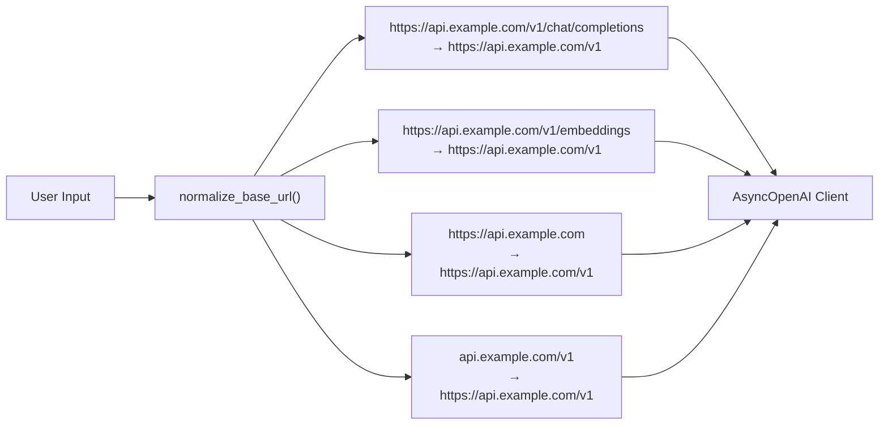

**Normalization Rules**:
1. Ensure `https://` prefix
2. Remove trailing slashes
3. Strip endpoint suffixes (`/embeddings`, `/chat/completions`, etc.)
4. Append `/v1` if not present

**Sources**: [backend/app/services/ai/config.py:25-75]()

### Configuration Retrieval Flow

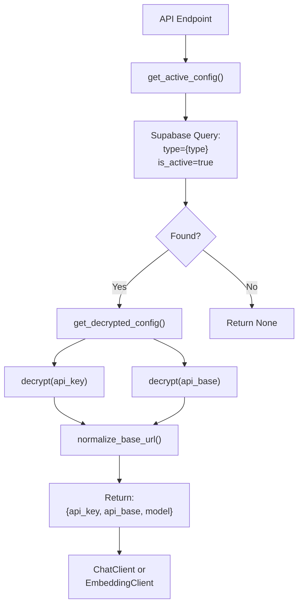

**Sources**: [backend/app/services/ai/config.py:78-108](), [backend/app/services/ai/config.py:155-190]()

---

## AI Service Clients

The system provides two primary client abstractions: `ChatClient` for language model operations and `EmbeddingClient` for vector generation. Both clients use the `AsyncOpenAI` SDK with unified error handling and retry logic.

### Client Architecture

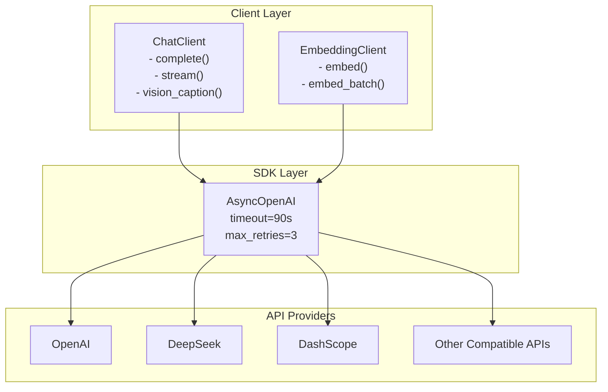

**Sources**: [backend/app/services/ai/clients.py:1-17]()

### ChatClient

The `ChatClient` provides three core methods for language model interactions:

| Method | Parameters | Returns | Use Case |
|--------|-----------|---------|----------|
| `complete()` | `messages`, `temperature`, `max_tokens` | `str` | Non-streaming chat completions |
| `stream()` | `messages`, `temperature`, `max_tokens` | `AsyncGenerator[str]` | Streaming chat responses |
| `vision_caption()` | `image_url`, `prompt`, `max_tokens` | `str` | Image description generation |

**Example Usage**:

```python
from app.services.ai import ChatClient

client = ChatClient(
    api_key="...",     # Already decrypted
    api_base="...",    # Already normalized
    model="gpt-4o-mini"
)

# Non-streaming completion
response = await client.complete(
    messages=[
        {"role": "system", "content": "You are a helpful assistant."},
        {"role": "user", "content": "Hello!"}
    ],
    temperature=0.7,
    max_tokens=2048
)

# Streaming completion
async for chunk in client.stream(messages):
    print(chunk, end="")

# Vision captioning
caption = await client.vision_caption("https://example.com/image.jpg")
```

**Vision Prompt**: The default image captioning prompt is defined in [backend/app/services/ai/clients.py:26-35]() and instructs the model to:
- Describe main elements, scene, and layout
- Extract text if present
- Identify chart types and key information
- Describe code screenshots with language and purpose
- Keep descriptions under 200 characters

**Error Handling**: All methods raise `ChatError` on failure, which includes detailed error chains for debugging.

**Sources**: [backend/app/services/ai/clients.py:53-228]()

### EmbeddingClient

The `EmbeddingClient` generates vector representations for semantic search:

| Method | Parameters | Returns | Purpose |
|--------|-----------|---------|---------|
| `embed()` | `text`, `dimensions` | `List[float]` | Single text embedding |
| `embed_batch()` | `texts`, `dimensions`, `batch_size` | `List[List[float]]` | Batch embedding generation |

**Batch Processing**: `embed_batch()` automatically handles:
- Filtering empty texts while preserving indices
- Splitting large batches into chunks (default 100 per batch)
- Maintaining input-output order correspondence
- Returning empty vectors for invalid texts

**Example Usage**:

```python
from app.services.ai import EmbeddingClient

client = EmbeddingClient(
    api_key="...",
    api_base="...",
    model="text-embedding-3-small"
)

# Single embedding
vector = await client.embed("Hello world", dimensions=1536)

# Batch embeddings
texts = ["Hello", "World", "", "Test"]
vectors = await client.embed_batch(texts, dimensions=1536, batch_size=100)
# Returns 4 vectors: valid embeddings for "Hello", "World", "Test"; empty [] for ""
```

**Sources**: [backend/app/services/ai/clients.py:231-358]()

---

## Repository Analysis

SaveHub uses AI to analyze GitHub repository README files and extract structured metadata: summary, technical tags, and supported platforms. This enables intelligent categorization and search across starred repositories.

### RepositoryAnalyzerService

The `RepositoryAnalyzerService` class orchestrates README analysis using chat completions with structured JSON output parsing.

**Core Methods**:

| Method | Parameters | Returns | Purpose |
|--------|-----------|---------|---------|
| `analyze_repository()` | `readme_content`, `repo_name`, `description` | `dict` | Single repository analysis |
| `analyze_repositories_batch()` | `repos`, `concurrency`, `use_fallback`, `on_progress` | `dict[repo_id, result]` | Batch analysis with progress tracking |
| `fallback_analysis()` | `repo` | `dict` | Rule-based fallback when AI unavailable |

### Analysis Prompt

The system uses a structured prompt to extract metadata in JSON format:

```
You are a professional GitHub repository analyzer. Analyze the following repository's 
README content and extract key information.

Return in JSON format:
1. summary: Brief description in Chinese (50-100 characters)
2. tags: 3-5 technical tags (e.g., React, TypeScript, CLI, API)
3. platforms: Supported platforms (Windows, macOS, Linux, iOS, Android, Web, CLI, Docker)

Only return JSON, no other content. Example:
{
  "summary": "This is a...",
  "tags": ["React", "TypeScript", "UI"],
  "platforms": ["Web", "macOS", "Windows"]
}

If uncertain, use empty arrays or empty strings.
```

**Sources**: [backend/app/services/ai/repository_service.py:46-61]()

### Analysis Workflow

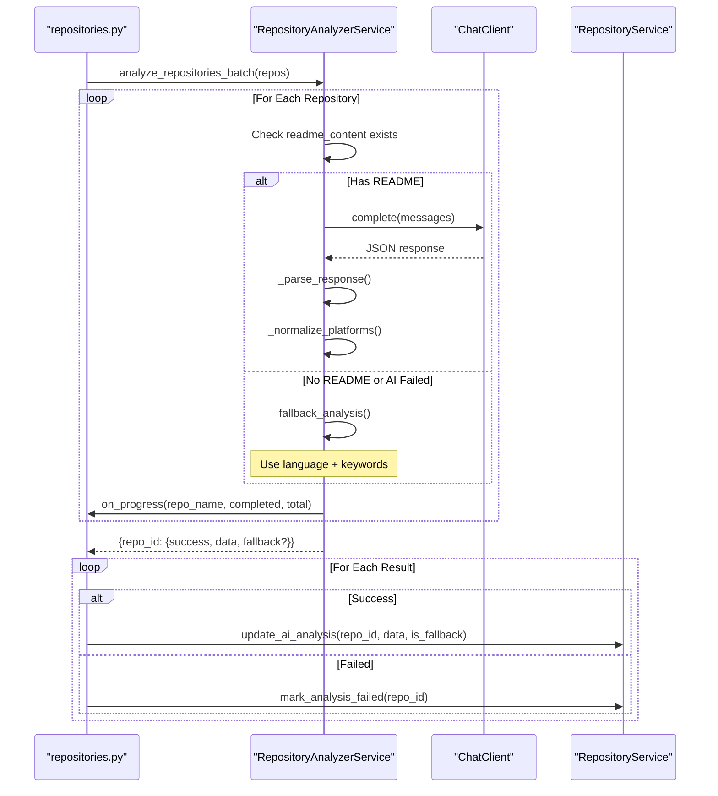

**Sources**: [backend/app/services/ai/repository_service.py:269-331](), [backend/app/services/repository_analyzer.py:19-103]()

### Fallback Analysis

When AI analysis fails or README is missing, the system uses rule-based inference:

**Language-to-Platform Mapping**:
- JavaScript/TypeScript → Web, CLI
- Python → Linux, macOS, Windows, CLI
- Swift → iOS, macOS
- Kotlin → Android
- Go/Rust → Linux, macOS, Windows, CLI

**Keyword-to-Platform Mapping**:
- "web", "react", "vue" → Web
- "electron", "tauri" → Windows, macOS, Linux
- "docker", "kubernetes" → Docker
- "cli", "terminal" → CLI
- "mobile" → iOS, Android

**Sources**: [backend/app/services/ai/repository_service.py:68-112](), [backend/app/services/ai/repository_service.py:234-267]()

### Integration with Repository Sync

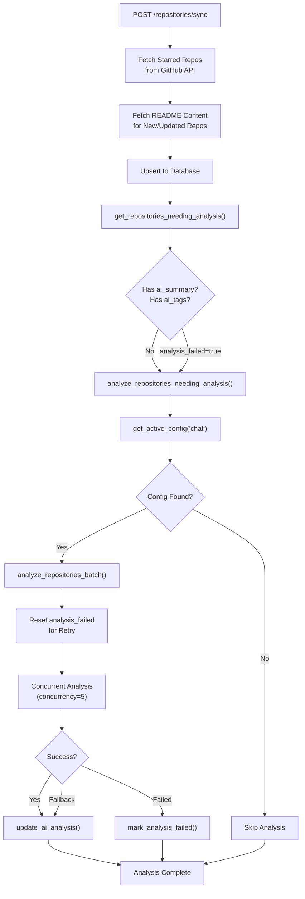

**Triggered By**:
- Manual sync via UI: [backend/app/api/routers/repositories.py:189-196]()
- Automatic Celery task: [backend/app/celery_app/repository_tasks.py:573-581]()

**Sources**: [backend/app/api/routers/repositories.py:166-196](), [backend/app/celery_app/repository_tasks.py:138-164]()

---

## Content Processing (RAG)

AI integration plays a critical role in the RAG (Retrieval-Augmented Generation) pipeline for article content. The system processes articles in stages: image caption generation, semantic chunking, and embedding generation.

### Article RAG Processing Pipeline

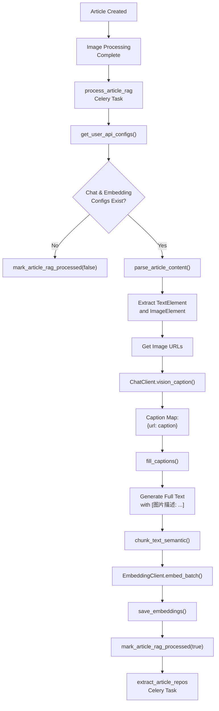

**Sources**: [backend/app/celery_app/rag_processor.py:87-267]()

### Image Caption Integration

The system preserves the original order of text and images during content parsing, then generates captions for images and inserts them inline:

**Parsing Flow**:

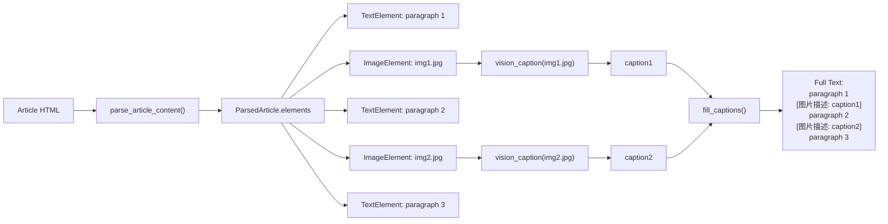

**Key Design**: Image captions are merged inline with text content **before** semantic chunking, rather than stored as separate chunks. This ensures contextual coherence during retrieval.

**Sources**: [backend/app/services/rag/chunker.py:227-261](), [backend/app/celery_app/rag_processor.py:164-194]()

### Semantic Chunking

The system uses langchain's `SemanticChunker` for intelligent text segmentation based on embedding similarity:

**Chunking Strategy**:

```python
from langchain_experimental.text_splitter import SemanticChunker
from langchain_openai import OpenAIEmbeddings

embeddings = OpenAIEmbeddings(
    api_key=api_key,
    base_url=normalized_base_url,
    model=model,
)

chunker = SemanticChunker(
    embeddings,
    breakpoint_threshold_type="percentile",  # Use percentile threshold
)

docs = chunker.create_documents([text])
chunks = [doc.page_content for doc in docs]
```

**Fallback**: If semantic chunking fails (missing dependencies, API errors), the system falls back to simple character-based chunking with sentence boundary detection.

**Sources**: [backend/app/services/rag/chunker.py:268-329](), [backend/app/services/rag/chunker.py:332-377]()

### Embedding Storage

After chunking, the system generates embeddings for all chunks in batch and stores them in the `all_embeddings` table with pgvector:

| Field | Type | Purpose |
|-------|------|---------|
| `article_id` | UUID | Links to articles table |
| `repository_id` | UUID | Links to repositories table (for repo embeddings) |
| `chunk_index` | Integer | Chunk sequence number |
| `content` | Text | Chunk text content |
| `embedding` | vector(1536) | pgvector embedding |

**Sources**: [backend/app/celery_app/rag_processor.py:227-242]()

---

## Repository Embedding Generation

Similar to article RAG processing, repositories also undergo embedding generation for their README content combined with metadata.

### Repository Embedding Pipeline

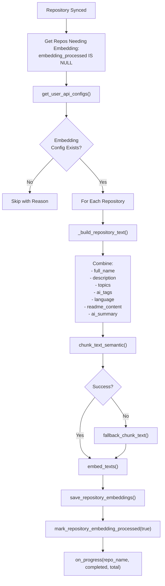

**Text Composition**: The system builds a structured text representation for each repository:

```
仓库名称: owner/repo
描述: [description if present]
链接: https://github.com/owner/repo
所有者: owner
标签: topic1, topic2, topic3
AI标签: ai_tag1, ai_tag2
主要语言: [language if present]

README内容:
[readme_content]

AI摘要:
[ai_summary if present]
```

**Sources**: [backend/app/celery_app/repository_tasks.py:205-278](), [backend/app/celery_app/repository_tasks.py:294-323]()

### Integration with Sync Workflow

Repository embedding generation is automatically triggered during repository sync:

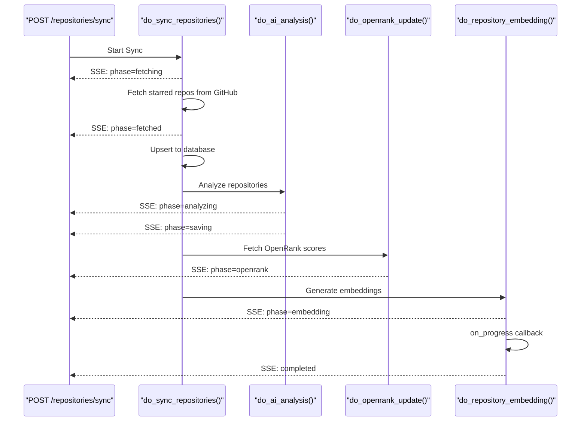

**SSE Progress Events**: The sync endpoint streams real-time progress to the frontend:

| Phase | Data | Description |
|-------|------|-------------|
| `fetching` | - | Fetching starred repos from GitHub |
| `fetched` | `total`, `needsReadme` | Fetch complete, README fetching needed |
| `analyzing` | `current`, `completed`, `total` | AI analysis in progress |
| `saving` | `savedCount`, `saveTotal` | Saving analysis results |
| `openrank` | - | Fetching OpenRank scores |
| `embedding` | `current`, `completed`, `total` | Generating embeddings |
| `done` | `total`, `newCount`, `updatedCount` | Sync complete |

**Sources**: [backend/app/api/routers/repositories.py:48-301](), [backend/app/celery_app/repository_tasks.py:216-278]()

---

## Configuration Error Handling

The system handles missing or invalid AI configurations gracefully throughout the processing pipeline:

**Configuration Errors**:

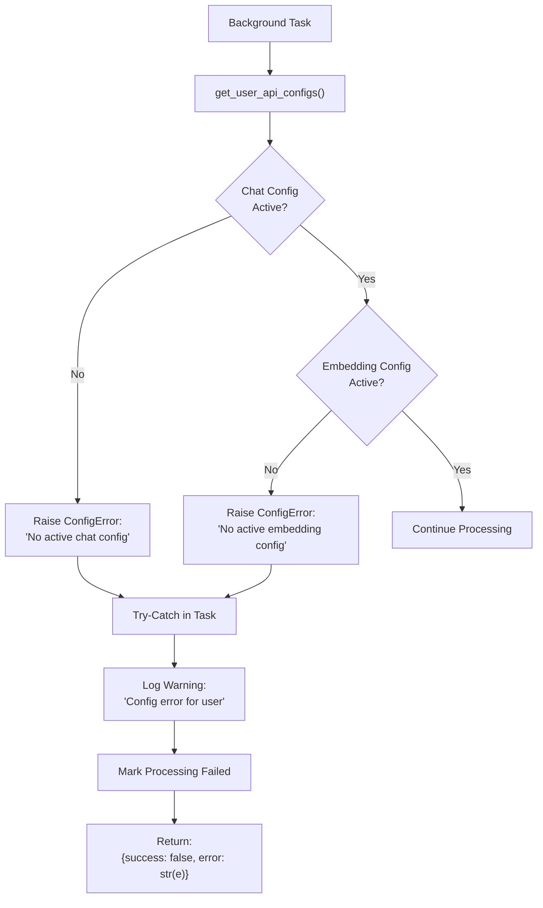

**Fallback Strategies**:

| Component | Missing Config Behavior |
|-----------|------------------------|
| Repository Analysis | Use `fallback_analysis()` based on language/keywords |
| Article RAG | Mark `rag_processed=false`, skip processing |
| Repository Embeddings | Skip with `{skipped: true, reason: "no_config"}` |

**Sources**: [backend/app/celery_app/rag_processor.py:61-84](), [backend/app/celery_app/repository_tasks.py:232-243]()

---

## Use Case Summary

### Core AI-Powered Features

| Feature | AI Client | Trigger | Output |
|---------|-----------|---------|--------|
| Repository Analysis | ChatClient | Manual sync or Celery task | `ai_summary`, `ai_tags`, `ai_platforms` |
| Image Captioning | ChatClient (vision) | Article RAG processing | Inline captions in full text |
| Article Embeddings | EmbeddingClient | After image processing | Chunks in `all_embeddings` table |
| Repository Embeddings | EmbeddingClient | After AI analysis | Chunks in `all_embeddings` table |
| RAG Query | EmbeddingClient | User search query | Query embedding for similarity search |
| Chat with References | ChatClient | User chat message | Streaming response with citations |

### Data Flow Through AI Services

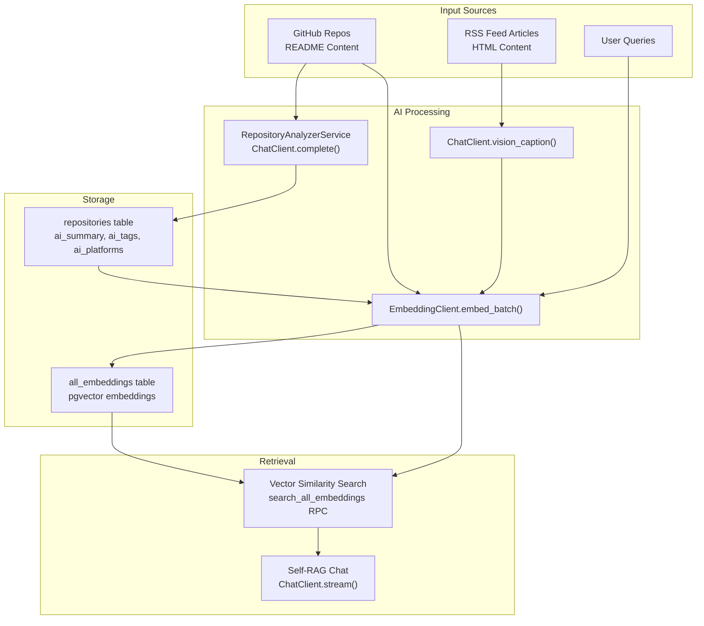

**Sources**: Multiple files across [backend/app/services/ai/](), [backend/app/celery_app/](), [backend/app/api/routers/]()