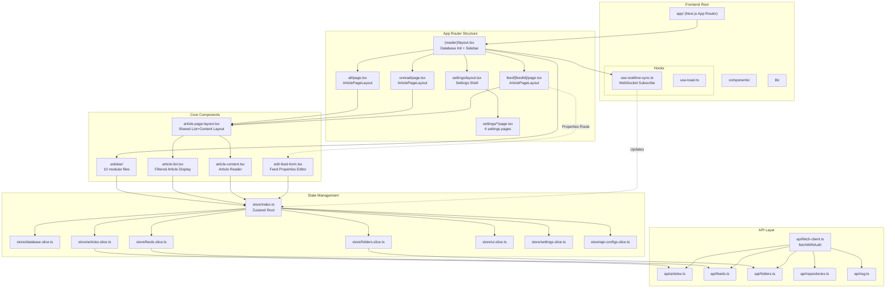
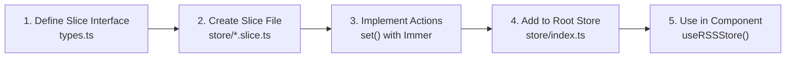
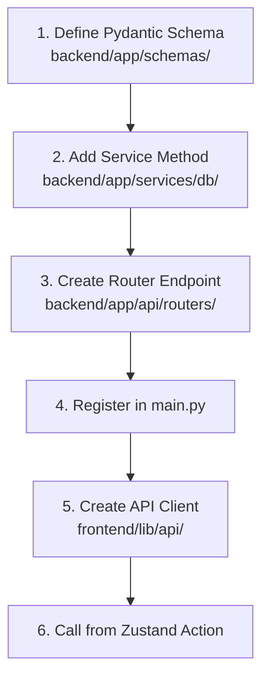
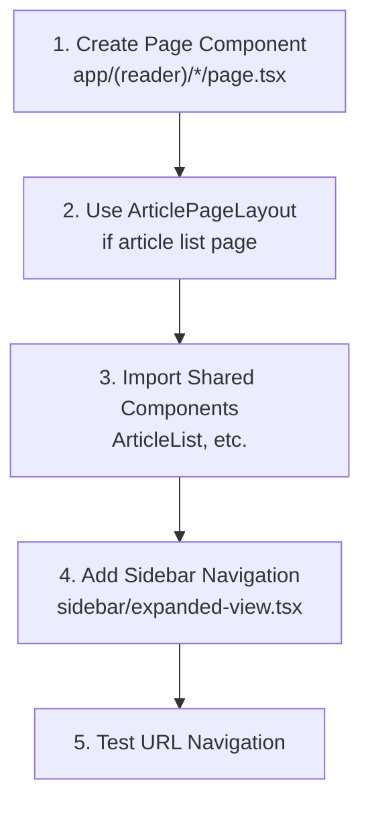
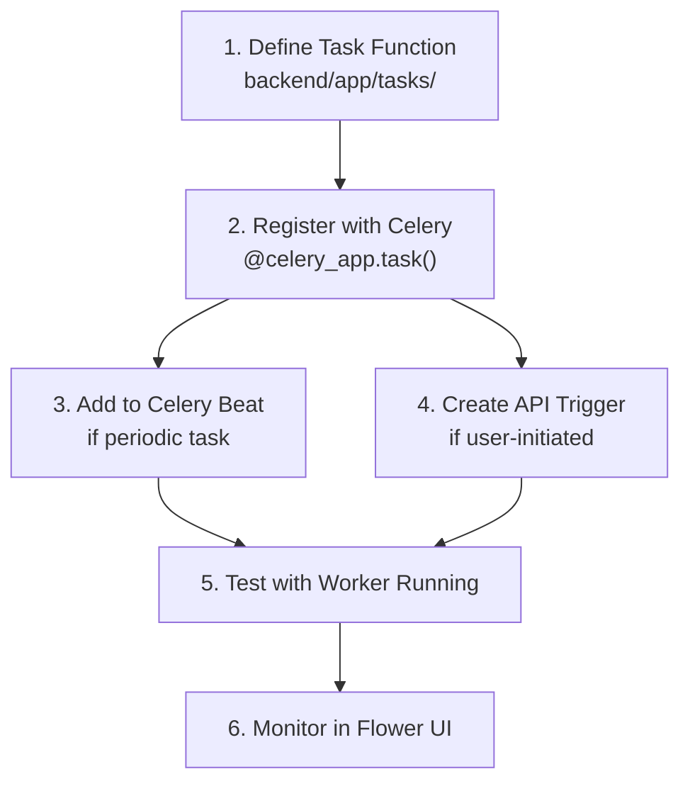

# Development Guide

<details>
<summary>Relevant source files</summary>

The following files were used as context for generating this wiki page:

- [CLAUDE.md](CLAUDE.md)
- [backend/app/api/routers/websocket.py](backend/app/api/routers/websocket.py)
- [backend/app/main.py](backend/app/main.py)
- [frontend/CLAUDE.md](frontend/CLAUDE.md)
- [frontend/app/(reader)/settings/storage/page.tsx](frontend/app/(reader)/settings/storage/page.tsx)
- [frontend/components/edit-feed-form.tsx](frontend/components/edit-feed-form.tsx)

</details>


This document provides practical guidance for developing features in the SaveHub codebase. It covers coding conventions, common development workflows, debugging techniques, and best practices for both frontend and backend development.

For deployment and production concerns, see [Deployment & Operations](#10). For detailed system architecture and design patterns, see [System Architecture](#3) and its subsections. For initial setup instructions, see [Getting Started](#2).

---

## Development Environment

### Prerequisites

**Frontend Requirements:**
- Node.js 18+ with pnpm package manager
- Next.js 14 with App Router
- Environment variables in `frontend/.env`

**Backend Requirements:**
- Python 3.10+
- Redis server (for Celery task queue)
- Environment variables in `backend/.env`

**Required Services:**
- Supabase project (PostgreSQL + pgvector + Storage)
- OpenAI-compatible API endpoint (optional, for AI features)

### Starting Development Servers

```bash
# Terminal 1: Frontend (Next.js)
cd frontend
pnpm dev  # localhost:3000

# Terminal 2: Backend (FastAPI)
cd backend
uvicorn app.main:app --reload  # localhost:8000

# Terminal 3: Celery Worker (Background Tasks)
cd backend
celery -A app.celery_app worker --loglevel=info --pool=solo  # Windows
celery -A app.celery_app worker --loglevel=info --concurrency=5  # Linux/Mac

# Terminal 4: Celery Beat (Scheduled Tasks)
cd backend
celery -A app.celery_app beat --loglevel=info

# Terminal 5 (Optional): Flower (Task Monitoring)
cd backend
celery -A app.celery_app flower --port=5555
```

**Sources:** [CLAUDE.md:22-43](), [frontend/CLAUDE.md:46-76]()

---

## Project Structure and Key Files

### Frontend Architecture Map



**Sources:** [frontend/CLAUDE.md:96-266](), [CLAUDE.md:49-64]()

### Backend Architecture Map

```mermaid
graph TB
    subgraph "Backend Entry Point"
        Main["app/main.py<br/>FastAPI app + CORS + Routers"]
        Lifespan["lifespan()<br/>Realtime Forwarder Start/Stop"]
    end
    
    subgraph "API Routers"
        AuthRouter["api/routers/auth.py"]
        FeedsRouter["api/routers/feeds.py"]
        ArticlesRouter["api/routers/articles.py"]
        FoldersRouter["api/routers/folders.py"]
        ReposRouter["api/routers/repositories.py"]
        RagRouter["api/routers/rag.py"]
        RagChatRouter["api/routers/rag_chat.py"]
        WSRouter["api/routers/websocket.py"]
        QueueRouter["api/routers/queue.py"]
        ProxyRouter["api/routers/proxy.py"]
    end
    
    subgraph "Service Layer"
        ArticleService["services/db/article_service.py<br/>ArticleService"]
        RepoService["services/db/repository_service.py<br/>RepositoryService"]
        RagService["services/db/rag_service.py<br/>RagService"]
        FeedService["services/db/feed_service.py<br/>FeedService"]
        AIService["services/ai/chat_client.py<br/>ChatClient"]
        EmbedService["services/ai/embedding_client.py<br/>EmbeddingClient"]
        RealtimeForwarder["services/supabase_realtime.py<br/>realtime_forwarder"]
        ConnectionManager["services/realtime.py<br/>connection_manager"]
    end
    
    subgraph "Background Tasks"
        CeleryApp["celery_app.py<br/>Celery Instance"]
        RefreshFeed["tasks/feed_tasks.py<br/>refresh_feed()"]
        ImageProc["tasks/image_tasks.py<br/>process_image_batch()"]
        RagProc["tasks/rag_tasks.py<br/>process_article_rag()"]
        RepoSync["tasks/repo_tasks.py<br/>sync_repositories()"]
    end
    
    subgraph "Dependencies"
        VerifyJWT["dependencies/verify_jwt()<br/>JWT Auth"]
        GetServiceClient["dependencies/get_service_client()<br/>Service Role Client"]
    end
    
    Main --> Lifespan
    Main --> AuthRouter
    Main --> FeedsRouter
    Main --> ArticlesRouter
    Main --> FoldersRouter
    Main --> ReposRouter
    Main --> RagRouter
    Main --> RagChatRouter
    Main --> WSRouter
    Main --> QueueRouter
    Main --> ProxyRouter
    
    Lifespan --> RealtimeForwarder
    
    FeedsRouter --> FeedService
    ArticlesRouter --> ArticleService
    ReposRouter --> RepoService
    RagRouter --> RagService
    RagChatRouter --> RagService
    RagChatRouter --> AIService
    WSRouter --> ConnectionManager
    QueueRouter -.Schedule.-> CeleryApp
    
    RealtimeForwarder -.Broadcasts.-> ConnectionManager
    
    CeleryApp --> RefreshFeed
    CeleryApp --> ImageProc
    CeleryApp --> RagProc
    CeleryApp --> RepoSync
    
    RefreshFeed -.Triggers.-> ImageProc
    ImageProc -.Triggers.-> RagProc
    RagProc --> AIService
    RagProc --> EmbedService
    RepoSync --> AIService
    RepoSync --> EmbedService
    
    FeedsRouter --> VerifyJWT
    ArticlesRouter --> VerifyJWT
    RefreshFeed --> GetServiceClient
    RepoSync --> GetServiceClient
```



**Sources:** [backend/app/main.py:1-88](), [CLAUDE.md:49-121]()

---

## Coding Conventions

### Frontend Patterns

#### 1. URL-Driven View State

**Rule:** View state (viewMode, feedId) lives in URL routes, not Zustand store.

```typescript
// ❌ WRONG: Don't store view state in Zustand
setViewMode("unread")

// ✅ CORRECT: Use Next.js router
router.push("/unread")
```

**Rationale:** Browser back/forward buttons work natively, URLs are shareable, no state persistence needed.

**Sources:** [frontend/CLAUDE.md:98-125]()

#### 2. Component Page Layout Pattern

**Rule:** All article list pages MUST use `ArticlePageLayout` wrapper.

```tsx
// app/(reader)/your-route/page.tsx
"use client"

import { ArticleList } from "@/components/article-list"
import { ArticlePageLayout } from "@/components/article-page-layout"

export default function YourPage() {
  return (
    <ArticlePageLayout>
      <ArticleList viewMode="all" />
    </ArticlePageLayout>
  )
}
```

**Rationale:** Prevents layout shift during sidebar animations, ensures consistent `w-96` article list width.

**Sources:** [frontend/CLAUDE.md:371-389]()

#### 3. Store Action Pattern

**Rule:** All data mutations go through Zustand actions → HTTP API → Backend.

```typescript
// In a component
const { updateFeed } = useRSSStore()

// Call store action
updateFeed(feedId, { title: "New Title" })
// → Calls feedsApi.updateFeed(feedId, updates)
// → Backend validates and persists
// → WebSocket broadcasts update to other clients
```

**Implementation Location:** [frontend/lib/store/feeds.slice.ts]()

**Sources:** [frontend/CLAUDE.md:127-146]()

#### 4. Type Safety with Zod Schemas

**Rule:** Define types with Zod schemas, infer TypeScript types.

```typescript
// lib/types.ts
export const FeedSchema = z.object({
  id: z.string(),
  title: z.string(),
  url: z.string(),
  // ... other fields
})

export type Feed = z.infer<typeof FeedSchema>
```

**Sources:** [frontend/CLAUDE.md:204-223]()

#### 5. Date Handling

**Rule:** App uses `Date` objects, backend transforms to/from ISO strings.

```typescript
// Frontend stores Date objects
const article = {
  publishedAt: new Date("2024-01-15T10:00:00Z"),
}

// Backend receives and stores ISO strings
// Transformation happens in API layer
```

**Sources:** [frontend/CLAUDE.md:275-280](), [CLAUDE.md:100-106]()

#### 6. Logging Pattern

**Rule:** Use structured logging with sensitive field redaction.

```typescript
import { logger } from "@/lib/logger"

// Info with context
logger.info({ userId, feedId, articleCount }, 'Feed refreshed successfully')

// Error with stack trace
logger.error({ error, userId, feedId }, 'Feed refresh failed')

// Debug (development only)
logger.debug({ queryParams }, 'Processing request')
```

**Auto-redacted fields:** `apiKey`, `password`, `token`, `secret`

**Sources:** [frontend/CLAUDE.md:391-416]()

### Backend Patterns

#### 1. User-Scoped Queries

**Rule:** Always include `.eq("user_id", userId)` for user data.

```python
# In service methods
def get_articles(self, user_id: str, limit: int = 50):
    response = (
        self.client.table("articles")
        .select("*")
        .eq("user_id", user_id)  # ← REQUIRED
        .order("published_at", desc=True)
        .limit(limit)
        .execute()
    )
```

**Rationale:** Security - prevents data leakage between users.

**Sources:** [CLAUDE.md:100-106]()

#### 2. Service vs RLS Client

**Rule:** Use RLS client for user requests, service client for background tasks.

| Context | Client Type | Use Case |
|---------|-------------|----------|
| API Routes | RLS Client | User-initiated actions, respects RLS |
| Celery Tasks | Service Client | Background processing, bypasses RLS |
| WebSocket | RLS Client | Real-time updates, user-scoped |

```python
# In API route
async def verify_jwt(authorization: str = Header(...)):
    # Returns RLS client scoped to user

# In Celery task
def get_service_client():
    # Returns service role client (bypasses RLS)
```

**Sources:** [CLAUDE.md:100-106]()

#### 3. Router Registration

**Rule:** Register all routers in `main.py` with consistent `/api` prefix.

```python
# backend/app/main.py
from app.api.routers import feeds, articles, repositories

app.include_router(feeds.router, prefix="/api")
app.include_router(articles.router, prefix="/api")
app.include_router(repositories.router, prefix="/api")
```

**Sources:** [backend/app/main.py:58-76]()

#### 4. Environment Variable Loading

**Rule:** Load `.env` BEFORE importing any modules.

```python
# main.py - FIRST LINES
from dotenv import load_dotenv, find_dotenv
_ = load_dotenv(find_dotenv())

# Then import other modules
import httpx
import logging
```

**Sources:** [backend/app/main.py:1-5]()

#### 5. HTTPX Timeout Patch

**Rule:** Monkey-patch `httpx` default timeout before Supabase imports.

```python
# main.py - BEFORE supabase imports
import httpx
_HTTPX_TIMEOUT = float(os.environ.get("HTTPX_TIMEOUT", "45"))
httpx._config.DEFAULT_TIMEOUT_CONFIG = httpx.Timeout(_HTTPX_TIMEOUT)
```

**Rationale:** Fixes SSL handshake timeouts in slow networks (e.g., China mainland).

**Sources:** [backend/app/main.py:7-12]()

---

## Common Development Workflows

### Workflow 1: Adding a New Zustand Slice



**Step-by-step:**

1. **Define interface** in `lib/types.ts`:
```typescript
export interface MyNewSlice {
  data: MyData[]
  fetchData: () => Promise<void>
  addData: (item: MyData) => void
}
```

2. **Create slice** in `lib/store/my-new.slice.ts`:
```typescript
export const createMyNewSlice: StateCreator<RSSReaderState, [], [], MyNewSlice> = (set, get) => ({
  data: [],
  
  fetchData: async () => {
    const response = await myApi.fetchData()
    set((state) => ({ data: response }))
  },
  
  addData: (item) => {
    set((state) => ({ data: [...state.data, item] }))
  },
})
```

3. **Add to root store** in `lib/store/index.ts`:
```typescript
import { createMyNewSlice } from './my-new.slice'

export const useRSSStore = create<RSSReaderState>()(
  devtools((...a) => ({
    ...createDatabaseSlice(...a),
    ...createFoldersSlice(...a),
    ...createMyNewSlice(...a),  // ← Add here
    // ...
  }))
)
```

**Sources:** [frontend/CLAUDE.md:349-356]()

### Workflow 2: Adding a New API Endpoint



**Example: Adding a "favorite feed" endpoint**

1. **Schema** (`backend/app/schemas/feeds.py`):
```python
class FeedFavoriteRequest(BaseModel):
    is_favorite: bool
```

2. **Service** (`backend/app/services/db/feed_service.py`):
```python
def update_favorite(self, user_id: str, feed_id: str, is_favorite: bool):
    response = (
        self.client.table("feeds")
        .update({"is_favorite": is_favorite})
        .eq("user_id", user_id)
        .eq("id", feed_id)
        .execute()
    )
    return response.data[0] if response.data else None
```

3. **Router** (`backend/app/api/routers/feeds.py`):
```python
@router.patch("/{feed_id}/favorite")
async def update_feed_favorite(
    feed_id: str,
    request: FeedFavoriteRequest,
    user_id: str = Depends(verify_jwt)
):
    service = FeedService(user_id)
    feed = service.update_favorite(user_id, feed_id, request.is_favorite)
    return feed
```

4. **Register** (`backend/app/main.py`):
```python
from app.api.routers import feeds
app.include_router(feeds.router, prefix="/api")
```

5. **Frontend API Client** (`frontend/lib/api/feeds.ts`):
```typescript
export const feedsApi = {
  updateFavorite: async (feedId: string, isFavorite: boolean) => {
    return fetchWithAuth(`/api/feeds/${feedId}/favorite`, {
      method: 'PATCH',
      body: JSON.stringify({ is_favorite: isFavorite }),
    })
  },
}
```

6. **Zustand Action** (`frontend/lib/store/feeds.slice.ts`):
```typescript
toggleFeedFavorite: async (feedId) => {
  const feed = get().feeds.find(f => f.id === feedId)
  if (!feed) return
  
  const isFavorite = !feed.isFavorite
  
  // Optimistic update
  set((state) => ({
    feeds: state.feeds.map(f =>
      f.id === feedId ? { ...f, isFavorite } : f
    )
  }))
  
  // Persist to backend
  await feedsApi.updateFavorite(feedId, isFavorite)
}
```

**Sources:** [CLAUDE.md:108-113]()

### Workflow 3: Adding a New Page Route



**Example: Adding a "/favorites" page**

1. **Create page** (`app/(reader)/favorites/page.tsx`):
```tsx
"use client"

import { ArticleList } from "@/components/article-list"
import { ArticlePageLayout } from "@/components/article-page-layout"

export default function FavoritesPage() {
  return (
    <ArticlePageLayout>
      <ArticleList viewMode="favorites" />
    </ArticlePageLayout>
  )
}
```

2. **Add to sidebar** (`components/sidebar/expanded-view.tsx`):
```tsx
<Link href="/favorites">
  <SidebarButton>
    <Star className="h-4 w-4" />
    Favorites
  </SidebarButton>
</Link>
```

3. **Update ArticleList** to handle `viewMode="favorites"`:
```tsx
// components/article-list.tsx
const filteredArticles = useMemo(() => {
  if (viewMode === "favorites") {
    return articles.filter(a => a.isFavorite)
  }
  // ... other viewModes
}, [viewMode, articles])
```

**Sources:** [frontend/CLAUDE.md:96-125](), [frontend/CLAUDE.md:235-242]()

### Workflow 4: Adding a Background Task



**Example: Adding a weekly cleanup task**

1. **Define task** (`backend/app/tasks/cleanup_tasks.py`):
```python
from app.celery_app import celery_app
from app.services.db.article_service import ArticleService
from app.dependencies import get_service_client

@celery_app.task(name="cleanup.weekly_cleanup")
def weekly_cleanup():
    """Delete articles older than retention period."""
    client = get_service_client()
    service = ArticleService(client)
    
    # Get all users (requires service client)
    users = client.table("profiles").select("id").execute()
    
    for user in users.data:
        deleted = service.cleanup_old_articles(user["id"], days=30)
        logger.info(f"Cleaned up {deleted} articles for user {user['id']}")
```

2. **Register with Beat** (`backend/app/celery_app.py`):
```python
celery_app.conf.beat_schedule = {
    "weekly-cleanup": {
        "task": "cleanup.weekly_cleanup",
        "schedule": crontab(day_of_week=1, hour=2, minute=0),  # Monday 2am
    },
}
```

3. **Test manually**:
```bash
# Start worker
celery -A app.celery_app worker --loglevel=info

# Trigger task manually
python -c "from app.tasks.cleanup_tasks import weekly_cleanup; weekly_cleanup.delay()"
```

**Sources:** For task patterns, see [Background Processing](#6) and subsections.

---

## Debugging Techniques

### Frontend Debugging

#### 1. Zustand DevTools

**Tool:** Redux DevTools browser extension

```typescript
// Store automatically configured with devtools
export const useRSSStore = create<RSSReaderState>()(
  devtools((...a) => ({
    ...createDatabaseSlice(...a),
    // ...
  }))
)
```

**Features:**
- View current store state
- Time-travel debugging (replay actions)
- Inspect action payloads
- Export/import state snapshots

**Sources:** [frontend/lib/store/index.ts]()

#### 2. WebSocket Connection Debugging

**Check connection status:**

```typescript
// In browser console
const ws = window.__DEBUG_WS__  // If you expose it globally

// Or add debug logging in use-realtime-sync.ts
console.log("WebSocket state:", {
  connected: wsRef.current?.readyState === WebSocket.OPEN,
  url: wsRef.current?.url,
})
```

**Common issues:**
- 4001 error = Authentication failed (check cookies)
- Connection drops = Check heartbeat ping/pong
- No updates = Check table subscriptions

**Sources:** [backend/app/api/routers/websocket.py:1-122]()

#### 3. API Call Debugging

**Use browser Network tab:**
- Filter by "Fetch/XHR"
- Check request headers (`Authorization: Bearer <token>`)
- Inspect response status codes
- Verify request/response payloads

**Add logging in API client:**

```typescript
// lib/api/fetch-client.ts
export async function fetchWithAuth(url: string, options: RequestInit = {}) {
  console.log("API Request:", { url, method: options.method })
  const response = await fetch(url, options)
  console.log("API Response:", { status: response.status, url })
  return response
}
```

**Sources:** [frontend/lib/api/fetch-client.ts]()

### Backend Debugging

#### 1. FastAPI Interactive Docs

**Access:** `http://localhost:8000/docs`

**Features:**
- Test endpoints with "Try it out"
- View request/response schemas
- See authentication requirements
- Execute API calls directly

**Sources:** [backend/app/main.py:43-48]()

#### 2. Celery Task Debugging

**View task status:**

```bash
# Flower monitoring UI
celery -A app.celery_app flower --port=5555
# Open: http://localhost:5555
```

**Debug task execution:**

```python
# In task definition
@celery_app.task(name="debug.test_task")
def test_task():
    import pdb; pdb.set_trace()  # Python debugger
    # Or use logging
    logger.info("Task started")
    # ... task logic
    logger.info("Task completed")
```

**Manual task trigger:**

```python
# In Python shell
from app.tasks.feed_tasks import refresh_feed
result = refresh_feed.delay(feed_id="abc123")
print(result.id)  # Task ID
```

**Sources:** [CLAUDE.md:40-43]()

#### 3. Database Query Debugging

**Enable SQL logging:**

```python
# In service method
import logging
logging.basicConfig()
logging.getLogger('sqlalchemy.engine').setLevel(logging.INFO)
```

**Check Supabase logs:**
- Go to Supabase Dashboard → Logs
- View real-time queries
- Check for RLS policy violations

**Sources:** [CLAUDE.md:100-106]()

### Common Issues Checklist

| Symptom | Likely Cause | Solution |
|---------|--------------|----------|
| WebSocket 4001 error | Authentication cookie missing | Check cookie in DevTools → Application → Cookies |
| API returns 401 | JWT expired | Check token refresh logic in `fetchWithAuth` |
| State not updating | Missing WebSocket subscription | Verify `useRealtimeSync` is called in layout |
| Task not executing | Celery worker not running | Start worker with `celery -A app.celery_app worker` |
| Task stuck | Redis lock not released | Check Redis keys: `redis-cli KEYS "celery-*"` |
| Slow API response | N+1 query problem | Check `.select()` columns, use joins |
| Layout shift | Missing `ArticlePageLayout` | Wrap ArticleList in `ArticlePageLayout` |
| Duplicate articles | Race condition | Add task lock in Celery task |

**Sources:** [frontend/CLAUDE.md:419-473]()

---

## Testing Strategies

### Frontend Testing Approach

**Current State:** Limited automated tests (focus on manual testing)

**Recommended Testing Strategy:**

1. **Component Testing** (Vitest + React Testing Library):
```typescript
// Example: ArticleList.test.tsx
import { render, screen } from '@testing-library/react'
import { ArticleList } from '@/components/article-list'

test('renders article list', () => {
  render(<ArticleList viewMode="all" />)
  expect(screen.getByText(/articles/i)).toBeInTheDocument()
})
```

2. **Store Testing** (Direct Zustand testing):
```typescript
// Example: feeds.slice.test.ts
import { useRSSStore } from '@/lib/store'

test('addFeed adds feed to store', () => {
  const { addFeed, feeds } = useRSSStore.getState()
  addFeed({ id: '1', title: 'Test Feed', url: 'https://example.com/feed' })
  expect(feeds).toHaveLength(1)
})
```

3. **Manual Testing Checklist:**

| Feature | Test Cases |
|---------|------------|
| Add Feed | Valid URL, Invalid URL, Duplicate URL |
| Mark Read | Single article, Bulk selection, Undo |
| WebSocket | Multi-tab sync, Auto-reconnect, Connection drop |
| Navigation | URL changes, Browser back, Keyboard shortcuts |
| Feed Edit | Update title, Change URL, Detect duplicates |

**Sources:** For UI patterns, see [Frontend Application](#4) subsections.

### Backend Testing Approach

**Current State:** Limited automated tests (focus on integration testing)

**Recommended Testing Strategy:**

1. **API Endpoint Testing** (pytest + TestClient):
```python
# tests/test_feeds_api.py
from fastapi.testclient import TestClient
from app.main import app

client = TestClient(app)

def test_create_feed():
    response = client.post("/api/feeds", json={
        "url": "https://example.com/feed.xml",
        "title": "Test Feed"
    })
    assert response.status_code == 200
    assert response.json()["title"] == "Test Feed"
```

2. **Service Layer Testing** (pytest + mocking):
```python
# tests/test_article_service.py
from app.services.db.article_service import ArticleService

def test_get_articles(mock_supabase):
    service = ArticleService(mock_supabase)
    articles = service.get_articles(user_id="test-user", limit=10)
    assert len(articles) <= 10
```

3. **Task Testing** (pytest + Celery test mode):
```python
# tests/test_feed_tasks.py
from app.tasks.feed_tasks import refresh_feed

def test_refresh_feed(celery_app, celery_worker):
    result = refresh_feed.delay(feed_id="test-feed")
    result.get(timeout=10)
    assert result.successful()
```

**Sources:** For service patterns, see [Backend Services](#5) subsections.

---

## Best Practices and Pitfalls

### Frontend Best Practices

#### ✅ DO: Use Optimistic Updates with Rollback

```typescript
// Good: Store previous state for rollback
toggleArticleRead: async (articleId) => {
  const article = get().articles.find(a => a.id === articleId)
  if (!article) return
  
  const previousState = { ...article }
  
  // Optimistic update
  set((state) => ({
    articles: state.articles.map(a =>
      a.id === articleId ? { ...a, isRead: !a.isRead } : a
    )
  }))
  
  try {
    await articlesApi.updateArticle(articleId, { isRead: !article.isRead })
  } catch (error) {
    // Rollback on error
    set((state) => ({
      articles: state.articles.map(a =>
        a.id === articleId ? previousState : a
      )
    }))
    throw error
  }
}
```

**Sources:** [frontend/CLAUDE.md:430-434]()

#### ❌ DON'T: Fire-and-Forget API Calls

```typescript
// Bad: No error handling
updateFeed(feedId, updates)  // What if this fails?

// Good: Handle errors
try {
  await updateFeed(feedId, updates)
  toast({ title: "Success" })
} catch (error) {
  toast({ title: "Error", description: error.message, variant: "destructive" })
}
```

**Sources:** [frontend/CLAUDE.md:467-472]()

#### ✅ DO: Type Store Mutations

```typescript
// Bad: Defeats TypeScript
set((state: any) => ({ feeds: newFeeds }))

// Good: Proper typing
set((state: RSSReaderState) => ({ feeds: newFeeds }))
```

**Sources:** [frontend/CLAUDE.md:456-461]()

### Backend Best Practices

#### ✅ DO: Use Task Locks to Prevent Duplicates

```python
from redis import Redis
from app.celery_app import celery_app

@celery_app.task(name="feeds.refresh_feed")
def refresh_feed(feed_id: str):
    redis = Redis.from_url(os.environ["REDIS_URL"])
    lock_key = f"lock:refresh_feed:{feed_id}"
    
    # Try to acquire lock (3 min TTL)
    if not redis.set(lock_key, "1", nx=True, ex=180):
        logger.info(f"Feed {feed_id} already being refreshed, skipping")
        return
    
    try:
        # Do work
        ...
    finally:
        redis.delete(lock_key)
```

**Sources:** For task patterns, see [RSS Feed Processing](#6.1).

#### ❌ DON'T: Forget User Scoping

```python
# Bad: Leaks data between users
def get_articles(self):
    return self.client.table("articles").select("*").execute()

# Good: User-scoped query
def get_articles(self, user_id: str):
    return (
        self.client.table("articles")
        .select("*")
        .eq("user_id", user_id)
        .execute()
    )
```

**Sources:** [CLAUDE.md:100-106]()

#### ✅ DO: Use Compensatory Scans

```python
# In celery_app.py beat schedule
celery_app.conf.beat_schedule = {
    "scan-pending-rag": {
        "task": "rag.scan_pending_rag_articles",
        "schedule": crontab(minute="*/30"),  # Every 30 minutes
    },
}
```

**Rationale:** Catches missed processing due to task failures or worker restarts.

**Sources:** See [Background Processing](#6) for task orchestration patterns.

### Security Considerations

| Area | Rule | Rationale |
|------|------|-----------|
| Authentication | Use `verify_jwt` dependency on all user routes | Validates JWT, extracts user_id |
| Database | Always include `.eq("user_id", userId)` | Prevents horizontal privilege escalation |
| Encryption | Encrypt API keys before storing | Protects sensitive credentials |
| SSRF Protection | Validate URLs before fetching | Prevents internal network access |
| Rate Limiting | Use domain rate limiter in tasks | Prevents API abuse |
| WebSocket Auth | Check cookie before `accept()` | Prevents unauthorized connections |

**Sources:** [System Architecture](#3) and [Authentication & Security](#3.1).

---

## Development Workflow Examples

### Example 1: Adding Feed Categories Feature

**Requirements:** Users can assign categories to feeds, filter by category in sidebar.

**Implementation Steps:**

1. **Database:** Already has `category` column in `feeds` table
2. **Backend:** No changes needed (category is already in schema)
3. **Frontend:** Add category filter to sidebar

```typescript
// components/sidebar/expanded-view.tsx
const categories = useMemo(() => {
  const cats = new Set<string>()
  feeds.forEach(f => { if (f.category) cats.add(f.category) })
  return Array.from(cats).sort()
}, [feeds])

// Render category list
{categories.map(category => (
  <Link key={category} href={`/category/${category}`}>
    <SidebarButton>
      <Tag className="h-4 w-4" />
      {category}
    </SidebarButton>
  </Link>
))}
```

4. **Add route:** Create `app/(reader)/category/[category]/page.tsx`
5. **Filter logic:** Update `ArticleList` to filter by feed category

**Time estimate:** 1-2 hours

**Sources:** [frontend/components/edit-feed-form.tsx:1-321]()

### Example 2: Adding Article Read Time Estimation

**Requirements:** Display estimated read time for each article.

**Implementation Steps:**

1. **Backend:** Add `estimated_read_time` to article schema (computed field)
2. **Service:** Calculate on article insertion

```python
# services/db/article_service.py
def calculate_read_time(content: str) -> int:
    """Calculate estimated read time in minutes."""
    words = len(content.split())
    return max(1, words // 200)  # 200 WPM average

def create_article(self, article_data: dict):
    article_data["estimated_read_time"] = calculate_read_time(
        article_data.get("content", "")
    )
    return self.client.table("articles").insert(article_data).execute()
```

3. **Frontend:** Display in ArticleList

```tsx
// components/article-list.tsx
<span className="text-xs text-muted-foreground">
  {article.estimatedReadTime} min read
</span>
```

**Time estimate:** 2-3 hours

**Sources:** For service patterns, see [Articles Management](#5.1).

---

This development guide provides the essential patterns and workflows for contributing to SaveHub. For specific subsystem details, refer to the linked wiki sections. For architectural decisions, see [System Architecture](#3). For deployment procedures, see [Deployment & Operations](#10).