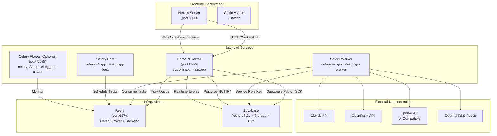
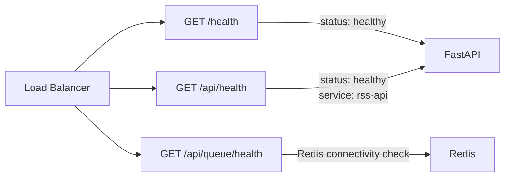
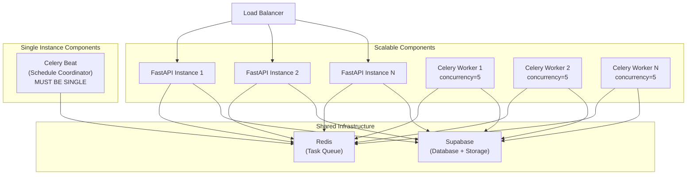
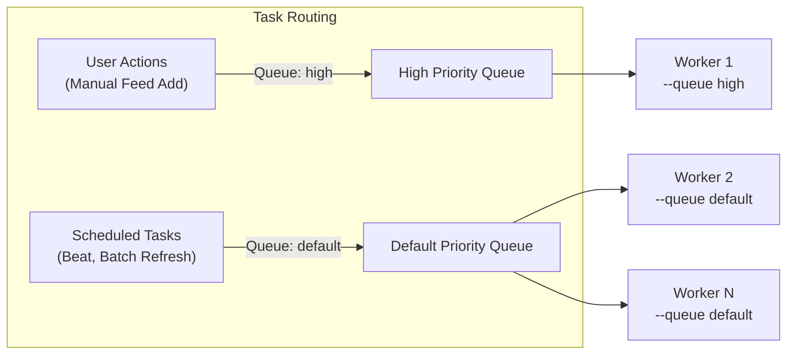
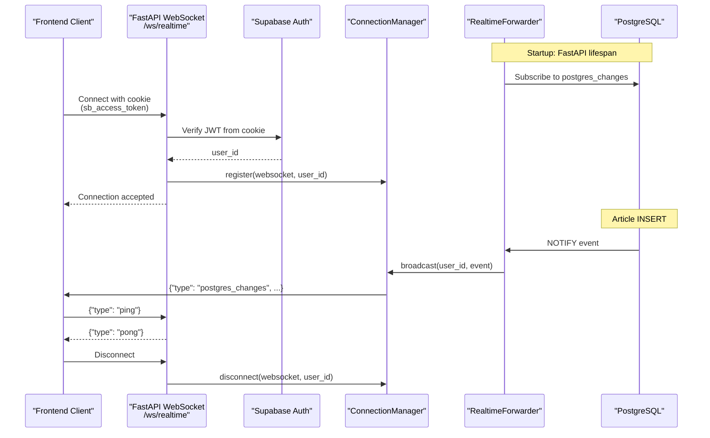
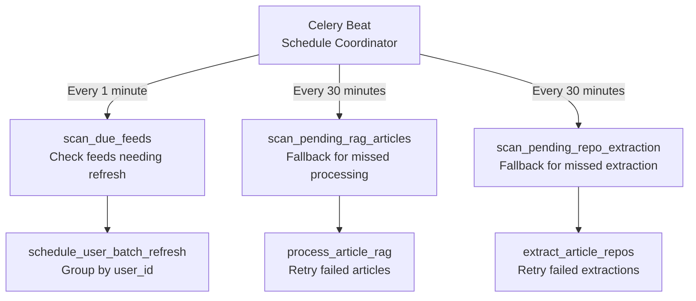

# Deployment & Operations

<details>
<summary>Relevant source files</summary>

The following files were used as context for generating this wiki page:

- [CLAUDE.md](CLAUDE.md)
- [backend/app/api/routers/feeds.py](backend/app/api/routers/feeds.py)
- [backend/app/api/routers/websocket.py](backend/app/api/routers/websocket.py)
- [backend/app/celery_app/CLAUDE.md](backend/app/celery_app/CLAUDE.md)
- [backend/app/celery_app/celery.py](backend/app/celery_app/celery.py)
- [backend/app/celery_app/image_processor.py](backend/app/celery_app/image_processor.py)
- [backend/app/celery_app/tasks.py](backend/app/celery_app/tasks.py)
- [backend/app/main.py](backend/app/main.py)
- [frontend/components/add-feed-dialog.tsx](frontend/components/add-feed-dialog.tsx)

</details>


This page provides comprehensive guidance for deploying and operating SaveHub in production environments, including environment configuration, service management, scaling strategies, monitoring approaches, and troubleshooting procedures. For development setup instructions, see [Getting Started](#2). For architecture overview, see [System Architecture](#3).

## Environment Configuration

SaveHub requires configuration through environment variables for both frontend and backend services. The system uses `.env` files loaded via `dotenv` for local development, with production deployments typically using platform-specific secret management.

### Frontend Environment Variables

| Variable | Required | Purpose |
|----------|----------|---------|
| `NEXT_PUBLIC_SUPABASE_URL` | Yes | Supabase project URL for client-side SDK |
| `NEXT_PUBLIC_SUPABASE_ANON_KEY` | Yes | Supabase anonymous key for RLS-protected operations |

**Sources:** [CLAUDE.md:87-91]()

### Backend Environment Variables

| Variable | Required | Default | Purpose |
|----------|----------|---------|---------|
| `SUPABASE_URL` | Yes | - | Supabase project URL for server operations |
| `SUPABASE_ANON_KEY` | Yes | - | Anon key for RLS-enforced user requests |
| `SUPABASE_SERVICE_ROLE_KEY` | Yes | - | Service role key for background tasks (bypasses RLS) |
| `REDIS_URL` | Yes | `redis://localhost:6379/0` | Redis connection for Celery broker/backend |
| `HTTPX_TIMEOUT` | No | `45` | HTTP client timeout in seconds (for slow networks) |

**Critical Security Note:** The `SUPABASE_SERVICE_ROLE_KEY` bypasses Row Level Security and must be protected. Only use in backend services, never expose to frontend or public APIs.

**Sources:** [CLAUDE.md:93-98](), [backend/app/main.py:1-13](), [backend/app/celery_app/celery.py:24]()

### Network Timeout Configuration

The backend applies a global `httpx` timeout patch before importing any Supabase modules to handle SSL handshake timeouts in restrictive network environments:

```
HTTPX_TIMEOUT = 45  # Default 45 seconds
```

This setting affects all Supabase SDK HTTP operations. Increase for networks with high latency or strict firewall rules.

**Sources:** [backend/app/main.py:7-12]()

## Deployment Architecture

### Service Component Overview



**Sources:** [backend/app/main.py:43-76](), [backend/app/celery_app/celery.py:26-37](), [CLAUDE.md:49-64]()

### Service Startup Order

1. **Redis** - Must start first (Celery broker/backend)
2. **Supabase** - External managed service (already running)
3. **FastAPI** - Can start independently
4. **Celery Beat** - Schedule coordinator (single instance)
5. **Celery Worker(s)** - Task executors (scalable)
6. **Next.js** - Frontend server
7. **Celery Flower** (Optional) - Monitoring UI

## Production Deployment Checklist

### Pre-Deployment Validation

| Step | Verification |
|------|-------------|
| Environment variables set | All required vars in deployment platform |
| Database migrations applied | Execute SQL scripts in `backend/scripts/` |
| Redis connectivity | Test `redis-cli ping` returns `PONG` |
| Supabase storage bucket | Verify `article-images` bucket exists with public access |
| API keys configured | Test OpenAI/alternative provider connectivity |

### Security Hardening

**CORS Configuration:**

Default configuration in [backend/app/main.py:50-56]() allows all origins (`allow_origins=["*"]`). For production, restrict to your frontend domain:

```python
app.add_middleware(
    CORSMiddleware,
    allow_origins=["https://yourdomain.com"],  # Production domain
    allow_credentials=True,
    allow_methods=["*"],
    allow_headers=["*"],
)
```

**Cookie Security:**

Ensure cookies use `Secure` flag in production (HTTPS only). Frontend uses `@supabase/ssr` which handles this automatically when `process.env.NODE_ENV === 'production'`.

**Sources:** [backend/app/main.py:50-56]()

### Logging Configuration

SaveHub uses a centralized logging system configured in `app.core.logging_config`. Both FastAPI and Celery workers use the same configuration:

**Features:**
- Daily rotating file logs
- Console output for development
- Structured JSON logging (optional)
- Automatic log rotation (7 days retention default)

**Sources:** [backend/app/main.py:19-21](), [backend/app/celery_app/celery.py:17-22]()

## Health Check Endpoints

### HTTP Health Checks



**Endpoint Details:**

| Endpoint | Purpose | Response |
|----------|---------|----------|
| `GET /health` | Root health check | `{"status": "healthy"}` |
| `GET /api/health` | API service health | `{"status": "healthy", "service": "rss-api"}` |
| `GET /api/queue/health` | Redis/Celery connectivity | Redis ping status |

**Sources:** [backend/app/main.py:79-88]()

### Celery Worker Health

Monitor worker status using Celery's inspection API:

```bash
# Check active workers
celery -A app.celery_app inspect active

# Check scheduled tasks
celery -A app.celery_app inspect scheduled

# Check worker stats
celery -A app.celery_app inspect stats
```

Use **Celery Flower** for web-based monitoring on port 5555.

**Sources:** [backend/app/celery_app/celery.py:26-37]()

## Scaling Strategies

### Horizontal Scaling Components



**Sources:** [backend/app/celery_app/celery.py:49-58]()

### Scaling Guidelines

| Component | Scaling Strategy | Considerations |
|-----------|-----------------|----------------|
| **FastAPI** | Horizontal (N instances) | Stateless; WebSocket connections are per-instance |
| **Celery Worker** | Horizontal (N instances) | Configure `worker_concurrency` per instance (default: 5) |
| **Celery Beat** | **Single instance only** | Multiple Beat instances will duplicate scheduled tasks |
| **Redis** | Vertical or Redis Cluster | Celery requires low-latency access to Redis |
| **Next.js** | Horizontal (N instances) | Standard Node.js app scaling |

**Worker Concurrency Tuning:**

Default configuration in [backend/app/celery_app/celery.py:49-52]():

```python
worker_concurrency=5,          # Tasks per worker process
worker_prefetch_multiplier=1,  # Fair task distribution
```

- **CPU-bound tasks**: Set `concurrency = CPU cores`
- **I/O-bound tasks** (RSS fetching, API calls): Set `concurrency = 2-4x CPU cores`
- Use `--pool=solo` on Windows (no prefork support)

**Sources:** [backend/app/celery_app/celery.py:49-58](), [CLAUDE.md:40-43]()

### Multi-Queue Priority Handling

SaveHub uses separate queues to prioritize user-initiated actions:



**Queue Configuration:**

Start dedicated high-priority workers:

```bash
# High priority worker (1 instance, handles user actions)
celery -A app.celery_app worker --queue high --concurrency=3

# Default queue workers (N instances, handles scheduled tasks)
celery -A app.celery_app worker --queue default --concurrency=5
```

**Sources:** [backend/app/celery_app/celery.py:68-96](), [backend/app/api/routers/feeds.py:92-103]()

## Real-time Synchronization Architecture

SaveHub uses a dual-channel architecture for state synchronization across multiple clients.

### WebSocket Lifecycle Management



**Implementation Files:**
- WebSocket endpoint: [backend/app/api/routers/websocket.py:64-122]()
- Connection manager: `app.services.realtime.connection_manager`
- Realtime forwarder: [backend/app/main.py:26-40]()

**Sources:** [backend/app/api/routers/websocket.py:30-122](), [backend/app/main.py:29-40]()

### Postgres Change Subscriptions

The `RealtimeForwarder` service subscribes to database changes during FastAPI startup and forwards them to authenticated WebSocket clients:

**Monitored Tables:**
- `feeds` (INSERT, UPDATE, DELETE)
- `articles` (INSERT, UPDATE, DELETE)  
- `folders` (INSERT, UPDATE, DELETE)

**Event Format:**
```json
{
  "type": "postgres_changes",
  "table": "articles",
  "event": "INSERT",
  "payload": {
    "new": { "id": "...", "title": "...", ... },
    "old": null
  }
}
```

**Sources:** [backend/app/api/routers/websocket.py:73-84]()

## Background Task Monitoring

### Celery Beat Schedule



**Critical Beat Configuration:**

The Beat schedule in [backend/app/celery_app/celery.py:98-116]() defines three periodic tasks:

| Task | Schedule | Purpose |
|------|----------|---------|
| `scan_due_feeds` | Every minute | Check `last_fetched + refresh_interval < now` |
| `scan_pending_rag_articles` | Every 30 minutes | Compensatory scan for `rag_processed IS NULL` |
| `scan_pending_repo_extraction` | Every 30 minutes | Compensatory scan for `repos_extracted IS NULL` |

**Sources:** [backend/app/celery_app/celery.py:98-116](), [backend/app/celery_app/CLAUDE.md:131-137]()

### Task Lock Coordination

To prevent duplicate task execution, SaveHub uses Redis-based locks:

**Lock Types:**

1. **Feed-level locks** - Prevent concurrent refresh of same feed
   - Key: `tasklock:feed:{feed_id}`
   - TTL: 180 seconds (task timeout + buffer)
   - Location: [backend/app/celery_app/tasks.py:296-309]()

2. **Schedule locks** - Prevent duplicate scheduling
   - Key: `tasklock:schedule:{feed_id}`
   - TTL: Matches refresh interval (max 1 hour)
   - Location: [backend/app/celery_app/tasks.py:458-465]()

3. **Beat overlap locks** - Prevent concurrent Beat execution
   - Key: `tasklock:scan_due_feeds`
   - TTL: 55 seconds (before next Beat trigger)
   - Location: [backend/app/celery_app/tasks.py:772]()

**Sources:** [backend/app/celery_app/tasks.py:296-309](), [backend/app/celery_app/tasks.py:772]()

## Common Issues and Troubleshooting

### Issue: Feeds Not Refreshing

**Symptoms:**
- `last_fetched` timestamp not updating
- No new articles appearing

**Diagnosis:**

1. **Check Celery Beat is running:**
   ```bash
   # Should show scan_due_feeds executing every minute
   celery -A app.celery_app inspect scheduled
   ```

2. **Check worker connectivity:**
   ```bash
   celery -A app.celery_app inspect active
   ```

3. **Check Redis locks:**
   ```bash
   redis-cli
   > KEYS tasklock:feed:*
   > TTL tasklock:feed:<feed_id>
   ```

4. **Check feed status:**
   Query `feeds` table for `last_fetch_status` and `last_fetch_error`.

**Common Causes:**

- **Multiple Beat instances running** - Beat must be singleton; duplicate instances create lock conflicts
- **Worker crashed while holding lock** - Locks auto-expire after TTL, wait 3 minutes or manually delete: `redis-cli DEL tasklock:feed:<feed_id>`
- **Feed deleted during processing** - Tasks check for feed existence at [backend/app/celery_app/tasks.py:312-334]()

**Sources:** [backend/app/celery_app/tasks.py:312-334](), [backend/app/celery_app/tasks.py:759-825](), [backend/app/celery_app/CLAUDE.md:145-149]()

### Issue: Image Processing Failures

**Symptoms:**
- Articles have `images_processed = false` or `NULL`
- Original external image URLs remain in content

**Diagnosis:**

1. **Check Supabase Storage bucket:**
   - Verify `article-images` bucket exists
   - Check bucket is set to public access

2. **Check image processing logs:**
   ```bash
   grep "process_article_images" celery.log
   ```

3. **Check storage upload permissions:**
   Service role key must have storage write permissions.

**Common Causes:**

- **SSRF Protection triggered** - Private IP addresses are blocked at [backend/app/celery_app/image_processor.py:61-68]()
- **Image too large** - Max 10MB limit at [image_processor.py:29]()
- **Invalid content type** - Only standard image types allowed at [image_processor.py:31-34]()
- **Network timeout** - Increase `DOWNLOAD_TIMEOUT` at [image_processor.py:30]()

**Fallback Strategy:**

The `scan_pending_rag_articles` Beat task at [backend/app/celery_app/celery.py:106-109]() runs every 30 minutes to retry articles with `images_processed IS NULL`.

**Sources:** [backend/app/celery_app/image_processor.py:29-34](), [backend/app/celery_app/image_processor.py:61-98](), [backend/app/celery_app/celery.py:106-109]()

### Issue: WebSocket Disconnections

**Symptoms:**
- Real-time updates not appearing
- Browser console shows WebSocket errors

**Diagnosis:**

1. **Check authentication:**
   WebSocket authenticates via `sb_access_token` cookie at [backend/app/api/routers/websocket.py:42]()

2. **Check connection manager:**
   ```python
   # In FastAPI logs, look for:
   "WebSocket client disconnected: user=<user_id>"
   ```

3. **Check Realtime Forwarder:**
   FastAPI startup should show:
   ```
   Starting Supabase Realtime forwarder...
   ```

**Common Causes:**

- **Cookie expired** - JWT tokens expire; frontend should refresh via `@supabase/ssr`
- **RealtimeForwarder not started** - Check FastAPI lifespan at [backend/app/main.py:29-40]()
- **Proxy timeout** - Configure load balancer WebSocket timeout ≥ 60 seconds
- **Multiple FastAPI instances** - Each maintains separate WebSocket connections; clients reconnect on instance failure

**Sources:** [backend/app/api/routers/websocket.py:30-62](), [backend/app/main.py:29-40]()

### Issue: Task Queue Buildup

**Symptoms:**
- Redis memory increasing
- Tasks waiting in queue for extended periods

**Diagnosis:**

1. **Check queue depth:**
   ```bash
   redis-cli LLEN default
   redis-cli LLEN high
   ```

2. **Check worker count:**
   ```bash
   celery -A app.celery_app inspect active_queues
   ```

3. **Check for stuck tasks:**
   ```bash
   celery -A app.celery_app inspect active
   ```

**Resolution:**

- **Scale workers horizontally** - Add more Celery worker instances
- **Increase concurrency** - Adjust `--concurrency` parameter
- **Purge stuck tasks** (destructive):
   ```bash
   celery -A app.celery_app purge
   ```
- **Revoke long-running tasks:**
   ```bash
   celery -A app.celery_app control revoke <task_id>
   ```

**Prevention:**

Configure task time limits at [backend/app/celery_app/tasks.py:253-254]():
- `time_limit=120` - Hard timeout (kills task)
- `soft_time_limit=90` - Soft timeout (raises exception)

**Sources:** [backend/app/celery_app/celery.py:49-58](), [backend/app/celery_app/tasks.py:253-254]()

## Monitoring Metrics

### Key Performance Indicators

| Metric | Collection Method | Alert Threshold |
|--------|------------------|-----------------|
| **FastAPI Response Time** | HTTP middleware timing | p95 > 1000ms |
| **Celery Task Success Rate** | Flower / Redis results | < 95% |
| **Redis Memory Usage** | Redis INFO command | > 80% max_memory |
| **WebSocket Connection Count** | ConnectionManager state | Track per instance |
| **Feed Refresh Lag** | `last_fetched` vs `refresh_interval` | > 2x interval |
| **Image Processing Rate** | `images_processed = true` count | Monitor trends |
| **RAG Processing Rate** | `rag_processed = true` count | Monitor trends |

### Log Aggregation Patterns

**Structured Logging Fields:**

All Celery tasks log with consistent extra fields:
```python
logger.info(
    "Processing article",
    extra={
        'task_id': task_id,
        'article_id': article_id,
        'user_id': user_id,
        'success': 'true',
        'duration_ms': duration_ms,
    }
)
```

Use these fields for log aggregation in ELK, Splunk, CloudWatch, etc.

**Sources:** [backend/app/celery_app/tasks.py:282-292](), [backend/app/celery_app/image_processor.py:360-385]()

## Backup and Recovery

### Database Backup

Supabase provides automatic PostgreSQL backups. For self-hosted deployments:

1. **Schema backup:**
   ```bash
   pg_dump -h <host> -U <user> --schema-only <database> > schema.sql
   ```

2. **Data backup:**
   ```bash
   pg_dump -h <host> -U <user> --data-only <database> > data.sql
   ```

**Critical Tables for Backup:**
- `feeds` - Feed subscriptions
- `articles` - Article content and metadata
- `folders` - Folder structure
- `all_embeddings` - Vector embeddings (large, consider separate backup schedule)
- `api_configs` - Encrypted AI provider configs
- `settings` - User settings

### Storage Backup

Backup the `article-images` Supabase Storage bucket:

1. **List all files:**
   ```javascript
   const { data } = await supabase.storage.from('article-images').list()
   ```

2. **Download files:**
   Use Supabase Storage API or `rclone` for bulk transfers.

### Redis State Recovery

Redis contains ephemeral task queue state (does not need backup). On Redis failure:

1. **Start fresh Redis instance**
2. **Restart Celery workers** - Will reconnect automatically
3. **Restart Celery Beat** - Will resume scheduling from database state

The `scan_due_feeds` task at [backend/app/celery_app/tasks.py:759]() will automatically reschedule any feeds due for refresh.

**Sources:** [backend/app/celery_app/tasks.py:759-825]()

## Performance Optimization

### Database Query Optimization

1. **Ensure indexes exist** on frequently queried columns:
   - `articles.user_id`
   - `articles.feed_id`
   - `articles.is_read`
   - `articles.published_at`
   - `feeds.user_id`
   - `all_embeddings.user_id`

2. **Use connection pooling** - Supabase SDK handles this automatically

3. **Batch operations** - Use `upsert()` for bulk inserts at [backend/app/celery_app/tasks.py:167-186]()

### Celery Task Optimization

1. **Use Chord for parallel processing** - Image processing and repository sync use Chord pattern for parallelization at [backend/app/celery_app/image_processor.py:436-482]()

2. **Implement rate limiting** - Domain-based rate limiting prevents API abuse at [backend/app/celery_app/tasks.py:83-90]()

3. **Task result expiration** - Results expire after 24h at [backend/app/celery_app/celery.py:61]()

**Sources:** [backend/app/celery_app/tasks.py:83-90](), [backend/app/celery_app/tasks.py:167-186](), [backend/app/celery_app/image_processor.py:436-482](), [backend/app/celery_app/celery.py:60-66]()

### WebSocket Scaling

For high WebSocket connection counts:

1. **Enable sticky sessions** on load balancer - Each client must maintain connection to same FastAPI instance
2. **Use Redis pub/sub** for cross-instance messaging (not currently implemented)
3. **Monitor connection count per instance** - Tune worker processes accordingly

## Security Considerations

### Service Role Key Protection

The `SUPABASE_SERVICE_ROLE_KEY` bypasses all Row Level Security policies. Protect it:

- **Never log service role key**
- **Use environment variables, not config files**
- **Rotate periodically** via Supabase dashboard
- **Restrict to backend services only** - Never expose to frontend

Used in: [backend/app/celery_app/supabase_client.py]() for background tasks.

**Sources:** [CLAUDE.md:97]()

### API Rate Limiting

Implement rate limiting for public endpoints:

- Use FastAPI middleware (e.g., `slowapi`)
- Configure Nginx/CloudFlare rate limits
- Monitor for abuse in access logs

### SSRF Protection

Image processing includes SSRF protection at [backend/app/celery_app/image_processor.py:61-98]():

- Blocks private IP ranges
- Blocks loopback addresses
- Validates URL schemes (HTTP/HTTPS only)

**Sources:** [backend/app/celery_app/image_processor.py:61-98]()