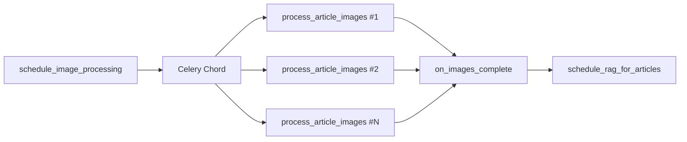
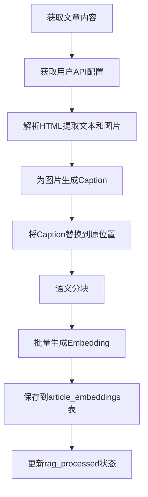
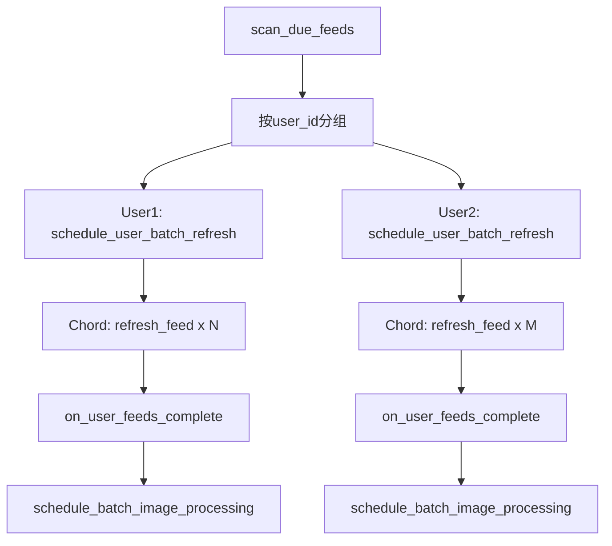
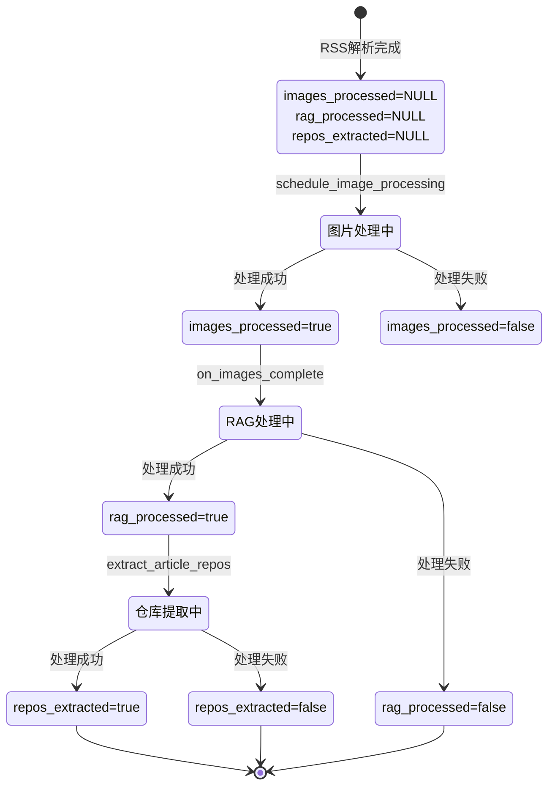
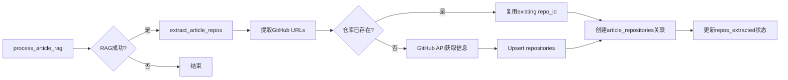

# SaveHub RSS订阅与刷新完整流程文档

> 本文档面向新开发者，详细介绍SaveHub中RSS订阅和刷新的完整处理流程。

## 目录

- [第一部分：系统概述](#第一部分系统概述)
- [第二部分：新订阅RSS Feed流程](#第二部分新订阅rss-feed流程)
- [第三部分：Celery定时刷新流程](#第三部分celery定时刷新流程)
- [第四部分：数据库状态转移](#第四部分数据库状态转移)
- [第五部分：关键文件索引](#第五部分关键文件索引)
- [第六部分：错误处理机制](#第六部分错误处理机制)
- [第七部分：GitHub仓库提取](#第七部分github仓库提取)

---

## 第一部分：系统概述

### 1.1 系统架构

SaveHub采用**前后端分离 + 异步任务队列**的架构：

```
┌─────────────────┐     ┌─────────────────┐     ┌─────────────────┐
│    Frontend     │────▶│     Backend     │────▶│  Celery Worker  │
│   (Next.js)     │     │    (FastAPI)    │     │  (异步任务)      │
└─────────────────┘     └─────────────────┘     └─────────────────┘
        │                       │                       │
        └───────────────────────┴───────────────────────┘
                                │
                    ┌───────────┴───────────┐
                    │      Supabase         │
                    │  (PostgreSQL + Storage)│
                    └───────────────────────┘
```

### 1.2 技术栈

| 层级 | 技术 | 用途 |
|------|------|------|
| **前端** | Next.js 14 + React 18 | 用户界面 |
| **状态管理** | Zustand | 前端状态管理（7个slice） |
| **后端** | FastAPI | REST API服务 |
| **任务队列** | Celery + Redis | 异步任务处理 |
| **数据库** | Supabase (PostgreSQL) | 数据存储 |
| **对象存储** | Supabase Storage | 图片存储 |
| **向量数据库** | pgvector | Embedding存储 |

### 1.3 整体流程概览

```mermaid
flowchart TB
    subgraph Frontend["前端 (Next.js)"]
        A[用户点击订阅] --> B[AddFeedDialog]
        B --> C[parseRSSFeed API]
        C --> D[addFeed Zustand]
        D --> E[addArticles Zustand]
    end

    subgraph Backend["后端 (FastAPI)"]
        F[POST /api/feeds] --> G[FeedService.save_feeds]
        G --> H[调度 refresh_feed]
    end

    subgraph Celery["Celery Worker"]
        I[refresh_feed] --> J[do_refresh_feed]
        J --> K[保存文章到DB]
        K --> L[schedule_image_processing]

        subgraph ImageProcessing["图片处理 Chord"]
            L --> M[process_article_images x N]
            M --> N[下载/压缩/上传Storage]
            N --> O[更新 images_processed]
        end

        O --> P[on_images_complete]

        subgraph RAGProcessing["RAG处理"]
            P --> Q[schedule_rag_for_articles]
            Q --> R[process_article_rag]
            R --> S[生成Caption]
            S --> T[语义分块]
            T --> U[生成Embedding]
            U --> V[保存到 article_embeddings]
        end

        subgraph RepoExtraction["GitHub仓库提取"]
            V --> W[extract_article_repos]
            W --> X[提取GitHub链接]
            X --> Y[调用GitHub API]
            Y --> Z[保存到repositories]
            Z --> AA[创建article_repositories关联]
        end
    end

    E --> F
    H --> I
```



### 1.4 数据流向

1. **用户操作** → 前端UI组件
2. **前端状态** → Zustand store → HTTP API调用
3. **后端API** → FastAPI路由 → Pydantic验证 → Supabase SDK
4. **异步任务** → Celery任务 → Redis队列 → Worker执行
5. **数据存储** → PostgreSQL (文章) + Storage (图片) + pgvector (Embedding)

---

## 第二部分：新订阅RSS Feed流程

### 2.1 前端UI入口

#### 2.1.1 订阅对话框组件

**文件位置**: `frontend/components/add-feed-dialog.tsx`

用户通过Sidebar中的"Add Feed"按钮打开订阅对话框：

```typescript
// frontend/components/sidebar/index.tsx (第74-77行)
onShowAddFeed={(folderId) => {
  setAddFeedFolderId(folderId)
  setShowAddFeed(true)
}}
```

#### 2.1.2 两种订阅方式

| 方式 | 说明 | 适用场景 |
|------|------|---------|
| **Direct URL** | 直接输入RSS Feed URL | 已知Feed地址 |
| **Discover** | 输入网站URL，自动发现RSS源 | 不知道Feed地址 |

### 2.2 前端事件处理

#### 2.2.1 handleSubmit流程

**文件位置**: `frontend/components/add-feed-dialog.tsx` (第50-132行)

```typescript
const handleSubmit = async (feedUrl: string) => {
  setIsLoading(true)
  try {
    // 1. 生成唯一ID
    const feedId = crypto.randomUUID()

    // 2. 调用后端解析RSS
    const { feed: parsedFeed, articles } = await parseRSSFeed(feedUrl, feedId)

    // 3. 构建Feed对象
    const feed: Partial<Feed> = {
      id: feedId,
      title: parsedFeed.title || new URL(feedUrl).hostname,
      url: feedUrl,
      folderId: selectedFolderId === "none" ? null : selectedFolderId,
      refreshInterval: refreshInterval,
      enableDeduplication: enableDeduplication,
    }

    // 4. 添加到Zustand store（触发API保存）
    const result = await addFeed(feed)
    if (!result.success) {
      if (result.reason === 'duplicate') {
        toast.error("该Feed已存在")
        return
      }
      throw new Error(result.error)
    }

    // 5. 添加文章到store
    await addArticles(articles)
    toast.success(`成功订阅: ${feed.title}`)
    onClose()
  } catch (error) {
    toast.error("订阅失败")
  } finally {
    setIsLoading(false)
  }
}
```

#### 2.2.2 parseRSSFeed API调用

**文件位置**: `frontend/lib/rss-parser.ts` (第10-39行)

```typescript
export async function parseRSSFeed(url: string, feedId: string) {
  const response = await fetch("/api/backend/rss/parse", {
    method: "POST",
    headers: { "Content-Type": "application/json" },
    credentials: "include",  // 发送HttpOnly Cookie
    body: JSON.stringify({ url, feedId }),
  })
  if (!response.ok) {
    throw new Error(`Failed to parse RSS: ${response.status}`)
  }
  return response.json()  // { feed: ParsedFeed, articles: Article[] }
}
```

#### 2.2.3 Zustand Store更新

**文件位置**: `frontend/lib/store/feeds.slice.ts` (第20-82行)

`addFeed` action采用**悲观更新**策略：先调用API保存，成功后再更新本地状态。

```typescript
addFeed: async (feed: Partial<Feed>) => {
  // 1. 本地快速检查重复
  const existingFeed = get().feeds.find(f => f.url === feed.url)
  if (existingFeed) {
    return { success: false, reason: 'duplicate' }
  }

  // 2. 构建新Feed对象
  const newFeed = { ...feed, id: feed.id || crypto.randomUUID() }

  // 3. 悲观更新：先保存到API
  await feedsApi.saveFeeds([newFeed])

  // 4. API成功后更新本地store
  set((state) => ({ feeds: [...state.feeds, newFeed] }))

  // 5. 异步调度后台刷新（fire-and-forget）
  scheduleFeedRefresh(newFeed.id).catch(console.error)

  return { success: true, reason: 'created' }
}
```

### 2.3 后端API处理

#### 2.3.1 POST /api/feeds 端点

**文件位置**: `backend/app/api/routers/feeds.py` (第47-115行)

```python
@router.post("", response_model=dict)
async def create_feeds(
    feeds: List[FeedCreate],
    service: FeedService = Depends(get_feed_service),
):
    """创建或更新多个feeds"""
    feed_dicts = [feed.model_dump() for feed in feeds]
    result = service.save_feeds(feed_dicts)

    # 为每个新feed调度刷新任务
    for feed_data in result.get("data", []):
        # 设置last_fetched防止Beat重复触发
        supabase.table("feeds").update({
            "last_fetched": datetime.now(timezone.utc).isoformat()
        }).eq("id", feed_data["id"]).execute()

        # 调度高优先级刷新任务
        refresh_feed.apply_async(
            kwargs={
                "feed_id": feed_data["id"],
                "feed_url": feed_data["url"],
                "user_id": service.user_id,
                "priority": "new_feed",
            },
            queue="high"
        )
    return result
```

#### 2.3.2 FeedService.save_feeds()

**文件位置**: `backend/app/services/db/feeds.py`

```python
def save_feeds(self, feeds: List[dict]) -> dict:
    """Upsert多个feeds到数据库"""
    db_rows = []
    for feed in feeds:
        db_rows.append({
            "id": str(feed.get("id")),
            "title": feed["title"],
            "url": feed["url"],
            "folder_id": str(feed["folder_id"]) if feed.get("folder_id") else None,
            "refresh_interval": feed.get("refresh_interval", 60),
            "user_id": self.user_id,  # 自动绑定用户
            "enable_deduplication": feed.get("enable_deduplication", False),
        })

    response = self.supabase.table("feeds").upsert(db_rows).execute()
    return {"success": True, "data": response.data}
```

### 2.4 Celery刷新任务

#### 2.4.1 refresh_feed任务

**文件位置**: `backend/app/celery_app/tasks.py` (第211-299行)

```python
@app.task(
    bind=True,
    name="refresh_feed",
    max_retries=3,
    time_limit=120,      # 硬超时2分钟
    soft_time_limit=90,  # 软超时1.5分钟
)
def refresh_feed(
    self,
    feed_id: str,
    feed_url: str,
    user_id: str,
    refresh_interval: int,
    priority: str = "normal",
):
    """刷新单个RSS feed"""
    # 1. 获取Redis锁（防止重复执行）
    task_lock = get_task_lock()
    if not task_lock.acquire(f"feed:{feed_id}", lock_ttl=180):
        raise Reject("Feed is locked", requeue=False)

    try:
        # 2. 执行核心刷新逻辑
        result = do_refresh_feed(feed_id, feed_url, user_id)

        # 3. 更新Feed状态
        update_feed_status(feed_id, user_id, "success")

        return {"success": True, "article_count": result["article_count"]}
    finally:
        task_lock.release(f"feed:{feed_id}")
```

#### 2.4.2 do_refresh_feed核心逻辑

**文件位置**: `backend/app/celery_app/tasks.py` (第57-184行)

```python
def do_refresh_feed(feed_id: str, feed_url: str, user_id: str) -> Dict:
    """核心feed刷新逻辑"""
    # 1. 域名速率限制（防止被封）
    rate_limiter = get_rate_limiter()
    rate_limiter.wait_for_domain(feed_url, max_wait_seconds=30)

    # 2. 解析RSS feed
    result = parse_rss_feed(feed_url, feed_id)
    articles = result.get("articles", [])

    # 3. 查询已处理的文章（跳过以保护已替换内容）
    processed_urls = get_processed_article_urls(feed_id)

    # 4. 构建待插入的文章
    articles_to_upsert = [
        build_article_row(a, feed_id, user_id)
        for a in articles if a["url"] not in processed_urls
    ]

    # 5. Upsert到数据库
    if articles_to_upsert:
        supabase.table("articles").upsert(
            articles_to_upsert,
            on_conflict="feed_id,url"  # 去重键
        ).execute()

    # 6. 调度图片处理
    article_ids = [a["id"] for a in articles_to_upsert]
    schedule_image_processing.delay(article_ids, feed_id)

    return {"article_count": len(articles), "article_ids": article_ids}
```

### 2.5 图片处理阶段

#### 2.5.1 Celery Chord并行处理

**文件位置**: `backend/app/celery_app/image_processor.py` (第436-482行)



```python
@app.task(name="schedule_image_processing")
def schedule_image_processing(article_ids: List[str], feed_id: str):
    """使用Celery chord调度图片处理"""
    from celery import chord, group

    # 构建并行任务组
    image_tasks = group(
        process_article_images.s(article_id=aid)
        for aid in article_ids
    )

    # Chord: 所有图片任务完成 -> 触发RAG回调
    callback = on_images_complete.s(article_ids=article_ids, feed_id=feed_id)
    workflow = chord(image_tasks)(callback)

    return {"scheduled": len(article_ids), "chord_id": workflow.id}
```

#### 2.5.2 图片处理核心流程

**文件位置**: `backend/app/celery_app/image_processor.py` (第258-323行)

| 步骤 | 函数 | 说明 |
|------|------|------|
| 1 | `download_image()` | 下载外部图片（SSRF防护、大小限制10MB） |
| 2 | `compress_image()` | 压缩为WebP格式（1080px、quality=70） |
| 3 | `upload_to_storage()` | 上传到Supabase Storage |
| 4 | URL替换 | 替换HTML中的img src |

**存储路径**: `article-images/{user_id}/{article_id}/{hash}.webp`

```python
def do_process_article_images(article_id: str) -> Dict:
    """处理单篇文章的所有图片"""
    article = get_article(article_id)
    content = article.get("content", "")

    # 处理图片并替换URL
    new_content, success, total = extract_and_process_images(
        content, article["user_id"], article_id
    )

    # 更新文章
    supabase.table("articles").update({
        "content": new_content,
        "images_processed": success > 0 or total == 0,
        "images_processed_at": datetime.now(timezone.utc).isoformat(),
    }).eq("id", article_id).execute()

    return {"processed": success, "total": total}
```

### 2.6 RAG/Embedding处理阶段

#### 2.6.1 触发时机

图片处理完成后，Chord回调自动触发RAG处理：

**文件位置**: `backend/app/celery_app/rag_processor.py`

```python
@app.task(name="on_images_complete")
def on_images_complete(results, article_ids: List[str], feed_id: str):
    """图片处理完成后的回调"""
    schedule_rag_for_articles(article_ids)
```

#### 2.6.2 RAG处理核心流程

**文件位置**: `backend/app/celery_app/rag_processor.py` (第108-285行)



#### 2.6.3 article_embeddings表插入

**文件位置**: `backend/app/services/db/rag.py` (第27-87行)

```python
def save_embeddings(self, article_id: str, embeddings: List[Dict]) -> int:
    """保存文章的embeddings"""
    # 1. 删除现有embeddings（幂等性）
    self.supabase.table("article_embeddings") \
        .delete() \
        .eq("article_id", article_id) \
        .eq("user_id", self.user_id) \
        .execute()

    # 2. 构建插入数据
    rows = [{
        "article_id": article_id,
        "user_id": self.user_id,
        "chunk_index": emb["chunk_index"],
        "content": emb["content"],
        "embedding": emb["embedding"],  # vector(1536)
    } for emb in embeddings]

    # 3. 批量插入
    result = self.supabase.table("article_embeddings").insert(rows).execute()
    return len(result.data)
```

**article_embeddings表结构**:

| 字段 | 类型 | 说明 |
|------|------|------|
| id | UUID | 主键 |
| article_id | UUID | 关联articles表 |
| user_id | UUID | 用户隔离 |
| chunk_index | INT | 块序号 |
| content | TEXT | 块文本内容 |
| embedding | vector(1536) | OpenAI embedding向量 |

---

## 第三部分：Celery定时刷新流程

### 3.0 两种刷新模式对比

用户主动订阅和后台定时任务**不完全相同，但共享核心函数**：

```
┌─────────────────────────────────────────────────────────────────────┐
│                        共享层（相同）                                │
├─────────────────────────────────────────────────────────────────────┤
│  do_refresh_feed()          - RSS解析、文章保存                      │
│  process_article_images     - 单篇文章图片处理                       │
│  process_article_rag        - 单篇文章RAG处理                        │
│  schedule_rag_for_articles  - RAG任务调度                           │
└─────────────────────────────────────────────────────────────────────┘
                ▲                           ▲
                │                           │
┌───────────────┴───────────────┐ ┌─────────┴─────────────────────────┐
│  Mode 1: 用户主动订阅          │ │  Mode 2: 后台定时任务              │
├───────────────────────────────┤ ├───────────────────────────────────┤
│  refresh_feed                 │ │  refresh_feed_batch               │
│  batch_mode=False             │ │  batch_mode=True                  │
│  schedule_image_processing    │ │  schedule_batch_image_processing  │
│  on_images_complete           │ │  on_batch_images_complete         │
│  自调度下一次刷新              │ │  Beat控制刷新时机                  │
│  queue="high"                 │ │  queue="default"                  │
└───────────────────────────────┘ └───────────────────────────────────┘
```

#### 关键差异表

| 维度 | 用户主动订阅 | 后台定时任务 |
|------|-------------|-------------|
| **入口任务** | `refresh_feed` | `refresh_feed_batch` |
| **batch_mode** | `False` | `True` |
| **图片处理时机** | 单Feed完成后立即触发 | 等待所有Feed完成后统一触发 |
| **下次刷新调度** | 任务内自调度 | Beat每分钟扫描 |
| **队列优先级** | `high` | `default` |

#### 核心代码差异

```python
# Mode 1: 用户订阅 (tasks.py:304)
result = do_refresh_feed(feed_id, feed_url, user_id)  # batch_mode默认False
# → 内部会调用 schedule_image_processing.delay()

# Mode 2: 定时任务 (tasks.py:681)
result = do_refresh_feed(feed_id, feed_url, user_id, batch_mode=True)
# → 跳过图片处理，由Chord回调统一处理
```

**设计原因**：Mode 2等待所有Feed完成后再统一处理图片和RAG，可以更好地控制资源使用和API调用频率。

### 3.1 Celery Beat调度

#### 3.1.1 定时任务配置

**文件位置**: `backend/app/celery_app/celery.py` (第94-105行)

```python
beat_schedule={
    "scan-due-feeds-every-minute": {
        "task": "scan_due_feeds",
        "schedule": crontab(minute="*"),  # 每分钟执行
    },
    "scan-rag-every-30-minutes": {
        "task": "scan_pending_rag_articles",
        "schedule": crontab(minute="*/30"),  # 每30分钟执行
    },
}
```

#### 3.1.2 scan_due_feeds任务

**文件位置**: `backend/app/celery_app/tasks.py` (第725-791行)

**刷新条件**: `last_fetched + refresh_interval < now` 或 `last_fetched IS NULL`

```python
@app.task(name="scan_due_feeds")
def scan_due_feeds():
    """扫描需要刷新的Feed"""
    # 1. 获取所有Feed
    result = supabase.table("feeds").select(
        "id, url, title, user_id, refresh_interval, last_fetched"
    ).execute()

    # 2. 过滤需要刷新的Feed
    due_feeds = []
    now = datetime.now(timezone.utc)
    for feed in result.data:
        if feed.get("last_fetched"):
            last = datetime.fromisoformat(feed["last_fetched"])
            next_refresh = last + timedelta(minutes=feed["refresh_interval"])
            if next_refresh <= now:
                due_feeds.append(feed)
        else:
            due_feeds.append(feed)  # 从未刷新过

    # 3. 按user_id分组
    user_feeds = {}
    for feed in due_feeds:
        uid = feed["user_id"]
        user_feeds.setdefault(uid, []).append(feed)

    # 4. 为每个用户调度批量刷新
    for user_id, feeds in user_feeds.items():
        schedule_user_batch_refresh.delay(user_id, feeds)
```

### 3.2 批量刷新编排

#### 3.2.1 Chord模式并行刷新

**文件位置**: `backend/app/celery_app/tasks.py` (第794-833行)



```python
@app.task(name="schedule_user_batch_refresh")
def schedule_user_batch_refresh(user_id: str, feeds: list):
    """为单个用户调度批量刷新"""
    from celery import chord, group

    # 创建并行刷新任务组
    refresh_tasks = group(
        refresh_feed_batch.s(
            feed_id=feed["id"],
            feed_url=feed["url"],
            user_id=user_id,
        )
        for feed in feeds
    )

    # Chord: 所有Feed并行刷新 -> 回调收集结果
    workflow = chord(refresh_tasks)(
        on_user_feeds_complete.s(user_id=user_id)
    )
    return {"scheduled": len(feeds), "chord_id": workflow.id}
```

### 3.3 单Feed刷新任务

#### 3.3.1 Redis锁机制

**文件位置**: `backend/app/celery_app/task_lock.py`

防止同一Feed被重复刷新：

```python
class TaskLock:
    def acquire(self, key: str, lock_ttl: int, task_id: str) -> bool:
        """获取锁，TTL防止死锁"""
        return self.redis.set(key, task_id, nx=True, ex=lock_ttl)

    def release(self, key: str, task_id: str) -> bool:
        """释放锁（仅持有者可释放）"""
        if self.redis.get(key) == task_id:
            return self.redis.delete(key)
        return False
```

#### 3.3.2 自动调度下一次刷新

每次刷新完成后，自动调度下一次刷新（自调度机制）：

```python
def schedule_next_refresh(feed_id: str, user_id: str, refresh_interval: int):
    """调度下一次刷新"""
    delay_seconds = refresh_interval * 60

    task = refresh_feed.apply_async(
        kwargs={...},
        countdown=delay_seconds,  # 延迟执行
        queue="default"
    )

    # 存储task_id到Redis（用于Feed删除时取消）
    task_id_key = f"feed_task:{feed_id}"
    task_lock.redis.setex(task_id_key, delay_seconds + 300, task.id)
```

### 3.4 定时扫描补偿

#### 3.4.1 scan_pending_rag_articles

**文件位置**: `backend/app/celery_app/rag_processor.py` (第391-425行)

每30分钟扫描遗漏的文章进行RAG处理：

```python
@app.task(name="scan_pending_rag_articles")
def scan_pending_rag_articles():
    """扫描待处理的文章"""
    # 查询条件：images_processed=true AND rag_processed IS NULL
    articles = supabase.table("articles") \
        .select("id, user_id") \
        .is_("rag_processed", "null") \
        .eq("images_processed", True) \
        .limit(50) \
        .execute()

    for i, article in enumerate(articles.data):
        process_article_rag.apply_async(
            kwargs={"article_id": article["id"], "user_id": article["user_id"]},
            countdown=i * 5,  # 错开执行，避免API限流
        )
```

---

## 第四部分：数据库状态转移

### 4.1 articles表状态字段

| 字段 | 类型 | 说明 |
|------|------|------|
| images_processed | BOOLEAN | 图片处理状态 |
| images_processed_at | TIMESTAMP | 图片处理时间 |
| rag_processed | BOOLEAN | RAG处理状态 |
| rag_processed_at | TIMESTAMP | RAG处理时间 |
| repos_extracted | BOOLEAN | GitHub仓库提取状态 |
| repos_extracted_at | TIMESTAMP | 仓库提取时间 |

### 4.2 状态转移图



### 4.3 状态值含义

| 状态 | images_processed | rag_processed | repos_extracted | 说明 |
|------|------------------|---------------|-----------------|------|
| 新文章 | NULL | NULL | NULL | 刚从RSS解析，等待处理 |
| 图片处理成功 | true | NULL | NULL | 至少一张图片成功或无图片 |
| 图片处理失败 | false | NULL | NULL | 有图片但全部失败 |
| RAG处理成功 | true | true | NULL | Embedding已生成 |
| RAG处理失败 | true | false | NULL | Embedding生成失败 |
| 仓库提取成功 | true | true | true | GitHub仓库已提取 |
| 仓库提取失败 | true | true | false | 仓库提取失败 |

---

## 第五部分：关键文件索引

### 5.1 前端文件

| 功能 | 文件路径 | 关键行号 |
|------|---------|---------|
| 订阅对话框 | `frontend/components/add-feed-dialog.tsx` | 50-132 |
| RSS解析 | `frontend/lib/rss-parser.ts` | 10-39 |
| Feed Store | `frontend/lib/store/feeds.slice.ts` | 20-82 |
| Article Store | `frontend/lib/store/articles.slice.ts` | 20-71 |
| 队列客户端 | `frontend/lib/queue-client.ts` | 51-74 |
| 刷新组件 | `frontend/components/feed-refresh.tsx` | 22-35 |

### 5.2 后端API文件

| 功能 | 文件路径 | 关键行号 |
|------|---------|---------|
| Feed API | `backend/app/api/routers/feeds.py` | 47-115 |
| RSS API | `backend/app/api/routers/rss.py` | 21-74 |
| Queue API | `backend/app/api/routers/queue.py` | 34-122 |
| Feed Service | `backend/app/services/db/feeds.py` | - |
| Article Service | `backend/app/services/db/articles.py` | - |
| RAG Service | `backend/app/services/db/rag.py` | 27-87 |
| Article-Repo Service | `backend/app/services/db/article_repositories.py` | 21-147 |
| GitHub提取器 | `backend/app/services/github_extractor.py` | 27-143 |

### 5.3 Celery任务文件

| 功能 | 文件路径 | 关键行号 |
|------|---------|---------|
| Celery配置 | `backend/app/celery_app/celery.py` | 94-105 |
| 刷新任务 | `backend/app/celery_app/tasks.py` | 57-184, 211-299, 725-791 |
| 图片处理 | `backend/app/celery_app/image_processor.py` | 258-323, 436-482 |
| RAG处理 | `backend/app/celery_app/rag_processor.py` | 108-285, 391-425 |
| 仓库提取 | `backend/app/celery_app/repo_extractor.py` | 108-210, 217-315 |
| 任务锁 | `backend/app/celery_app/task_lock.py` | - |
| 速率限制 | `backend/app/celery_app/rate_limiter.py` | - |

### 5.4 数据库迁移文件

| 功能 | 文件路径 |
|------|---------|
| 图片存储配置 | `backend/scripts/018_create_article_images_storage.sql` |
| Embedding表 | `backend/scripts/020_create_article_embeddings.sql` |
| pgvector启用 | `backend/scripts/015_enable_pgvector.sql` |
| 文章-仓库中间表 | `backend/scripts/026_create_article_repositories.sql` |
| 仓库来源标记 | `backend/scripts/027_add_repository_source_flags.sql` |
| 仓库提取状态 | `backend/scripts/028_add_repos_extracted_status.sql` |

---

## 第六部分：错误处理机制

### 6.1 可重试vs不可重试错误

**文件位置**: `backend/app/celery_app/tasks.py` (第46-54行)

```python
def is_retryable_error(error_msg: str) -> bool:
    """判断错误是否可重试"""
    retryable_patterns = [
        "ENOTFOUND", "ETIMEDOUT", "ECONNREFUSED",
        "timeout", "503", "502", "429",
        "ConnectionError", "TimeoutError"
    ]
    return any(p.lower() in error_msg.lower() for p in retryable_patterns)
```

### 6.2 重试策略配置

| 任务 | 最大重试 | 初始延迟 | 退避策略 | 超时 |
|------|---------|---------|---------|------|
| refresh_feed | 3次 | 2秒 | 指数退避(max 60s) | 2分钟 |
| process_article_images | 2次 | 30秒 | 指数退避 | 5分钟 |
| process_article_rag | 2次 | 60秒 | 指数退避(max 300s) | 5分钟 |

### 6.3 容错设计

1. **单篇失败不阻塞批量**：Chord中单个任务失败不影响其他任务
2. **定时扫描补偿**：每30分钟扫描遗漏文章，确保最终一致性
3. **幂等性设计**：重复处理同一文章不会产生重复数据
4. **Redis锁防重复**：同一Feed不会被并发刷新
5. **已处理保护**：`images_processed=true`的文章不会被重新处理

---

## 附录：快速参考

### 启动命令

```bash
# 前端
cd frontend && pnpm dev

# 后端
cd backend && uvicorn app.main:app --reload

# Celery Worker
celery -A app.celery_app worker --loglevel=info --pool=solo

# Celery Beat（定时任务）
celery -A app.celery_app beat --loglevel=info
```

### 监控命令

```bash
# Flower监控面板
celery -A app.celery_app flower --port=5555
```

---

*文档生成时间: 2026-01-02*
*更新时间: 2026-01-04 (完善GitHub仓库提取功能文档)*

---

## 第七部分：GitHub仓库提取

### 7.1 功能概述

从RSS文章内容中自动提取GitHub仓库链接，调用GitHub API获取完整仓库信息，建立文章与仓库的多对多关系。

**触发时机**: RAG/Embedding处理成功完成后 (`rag_processor.py:365-372`)

**核心常量** (`repo_extractor.py:22-25`):
| 常量 | 值 | 说明 |
|------|-----|------|
| BATCH_SIZE | 50 | 每次扫描最大文章数 |
| GITHUB_API_TIMEOUT | 30s | API请求超时 |
| MAX_REPOS_PER_ARTICLE | 20 | 单篇文章最大提取仓库数 |



### 7.2 数据库表结构

#### 7.2.1 article_repositories (中间表)

| 字段 | 类型 | 说明 |
|------|------|------|
| id | UUID | 主键 |
| article_id | UUID | 关联articles表 |
| repository_id | UUID | 关联repositories表 |
| user_id | UUID | 用户隔离 |
| extracted_url | TEXT | 原始提取的URL |
| created_at | TIMESTAMP | 创建时间 |

**唯一约束**: `(article_id, repository_id)`

#### 7.2.2 repositories表新增字段

| 字段 | 类型 | 说明 |
|------|------|------|
| is_starred | BOOLEAN | 来自GitHub starred |
| is_extracted | BOOLEAN | 来自文章提取 |

#### 7.2.3 articles表新增字段

| 字段 | 类型 | 说明 |
|------|------|------|
| repos_extracted | BOOLEAN | NULL=未提取, TRUE=成功, FALSE=失败 |
| repos_extracted_at | TIMESTAMP | 提取时间 |

### 7.3 核心处理流程

#### 7.3.1 触发入口

**文件位置**: `backend/app/celery_app/rag_processor.py:365-372`

```python
# process_article_rag 任务成功完成后触发
if result.get("success"):
    from .repo_extractor import extract_article_repos
    extract_article_repos.apply_async(
        kwargs={"article_id": article_id, "user_id": user_id},
        countdown=1,
        queue="default",
    )
```

#### 7.3.2 提取核心逻辑

**文件位置**: `backend/app/celery_app/repo_extractor.py:108-210`

```python
def do_extract_article_repos(article_id: str, user_id: str) -> Dict:
    """返回: {"success": bool, "extracted": int, "linked": int, "error": str|None}"""

    # 1. 获取文章内容
    article = supabase.table("articles").select("id, content, summary")
        .eq("id", article_id).eq("user_id", user_id).single().execute()

    # 2. 提取GitHub URLs (github_extractor.py)
    repos = extract_github_repos(content, summary)  # [(owner, repo, url), ...]
    repos = repos[:MAX_REPOS_PER_ARTICLE]  # 限制数量

    # 3. 获取用户GitHub Token (可选，提高API限额)
    settings = SettingsService(supabase, user_id).load_settings()
    github_token = settings.get("github_token") if settings else None

    # 4. 对每个仓库处理
    for owner, repo_name, original_url in repos:
        full_name = f"{owner}/{repo_name}"
        existing = repo_service.get_by_full_name(full_name)

        if existing:
            repo_id = existing["id"]  # 复用已存在的仓库
        else:
            repo_data = fetch_github_repo(owner, repo_name, github_token)
            if not repo_data:
                continue
            saved = repo_service.upsert_extracted_repository(repo_data)
            repo_id = saved["id"]

        repo_links.append({"repository_id": repo_id, "extracted_url": original_url})

    # 5. 批量创建article_repositories关联
    linked_count = link_service.bulk_link_repos(article_id, repo_links)

    # 6. 更新article.repos_extracted状态
    article_service.mark_repos_extracted(article_id, success=True)
```

#### 7.3.3 GitHub URL提取逻辑

**文件位置**: `backend/app/services/github_extractor.py`

**提取来源**:
1. `<a href="...">` 标签中的GitHub链接
2. 纯文本中的GitHub URL（正则匹配）

**排除的非仓库路径** (`github_extractor.py:16-24`):
```python
EXCLUDED_PATHS = {
    'about', 'pricing', 'features', 'enterprise', 'sponsors',
    'marketplace', 'explore', 'topics', 'trending', 'collections',
    'events', 'security', 'settings', 'notifications', 'login',
    'join', 'organizations', 'orgs', 'users', 'apps', 'search',
    'pulls', 'issues', 'gist', 'gists', 'stars', 'watching', ...
}
```

**URL解析规则** (`parse_github_url`):
- 验证域名: `github.com` 或 `www.github.com`
- 提取路径: `/owner/repo/...` → `(owner, repo)`
- 清理后缀: 移除 `.git`
- 验证格式: owner符合GitHub用户名规则（字母数字+连字符，最长39字符）

#### 7.3.4 中间表服务

**文件位置**: `backend/app/services/db/article_repositories.py`

| 方法 | 说明 |
|------|------|
| `link_article_to_repo()` | 单条关联（upsert） |
| `bulk_link_repos()` | 批量关联 |
| `get_repos_for_article()` | 获取文章关联的所有仓库 |
| `get_articles_for_repo()` | 获取引用某仓库的所有文章 |

### 7.4 关键文件索引

| 功能 | 文件路径 |
|------|---------|
| GitHub链接提取 | `backend/app/services/github_extractor.py` |
| 中间表服务 | `backend/app/services/db/article_repositories.py` |
| Celery任务 | `backend/app/celery_app/repo_extractor.py` |
| 数据库迁移 | `backend/scripts/026_create_article_repositories.sql` |
| 数据库迁移 | `backend/scripts/027_add_repository_source_flags.sql` |
| 数据库迁移 | `backend/scripts/028_add_repos_extracted_status.sql` |

### 7.5 Celery任务配置

#### 7.5.1 extract_article_repos任务

**文件位置**: `backend/app/celery_app/repo_extractor.py:217-242`

```python
@app.task(
    bind=True,
    name="extract_article_repos",
    max_retries=2,
    default_retry_delay=120,    # 2分钟后重试
    retry_backoff=True,
    time_limit=300,             # 硬超时5分钟
    soft_time_limit=270,        # 软超时4.5分钟
)
def extract_article_repos(self, article_id: str, user_id: str):
    ...
```

#### 7.5.2 Beat定时任务

```python
# celery.py beat_schedule
"scan-repo-extraction-every-30-minutes": {
    "task": "scan_pending_repo_extraction",
    "schedule": crontab(minute="*/30"),
}
```

**补偿机制**: 每30分钟扫描 `images_processed=true AND repos_extracted IS NULL` 的文章。

### 7.6 错误处理

#### 7.6.1 GitHub API错误类型

| 错误类型 | HTTP状态码 | 处理方式 |
|---------|-----------|---------|
| 仓库不存在 | 404 | 跳过，继续下一个 |
| Rate Limit | 403 (remaining=0) | 抛出`RateLimitError`，触发重试 |
| 其他403 | 403 | 记录警告，跳过 |
| 超时 | - | 记录警告，跳过 |

#### 7.6.2 重试策略

| 配置 | 值 | 说明 |
|------|-----|------|
| max_retries | 2 | 最多重试2次 |
| default_retry_delay | 120s | 初始重试延迟 |
| retry_backoff | True | 指数退避 |

#### 7.6.3 状态标记

```python
# 成功：无论提取到多少仓库
article_service.mark_repos_extracted(article_id, success=True)

# 失败：发生异常
article_service.mark_repos_extracted(article_id, success=False)

# Rate Limit：不标记，等待重试
return {"success": False, "error": "rate_limit", "retry": True}
```
