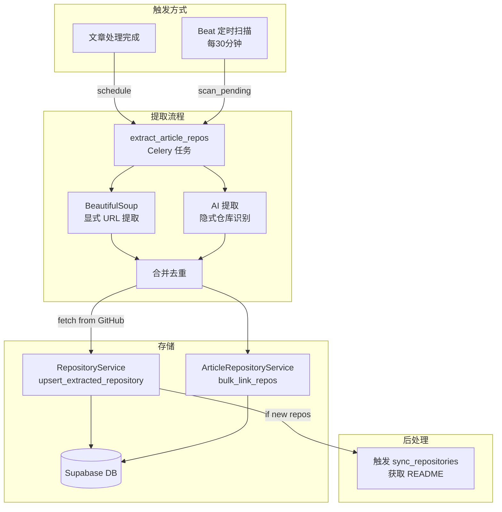
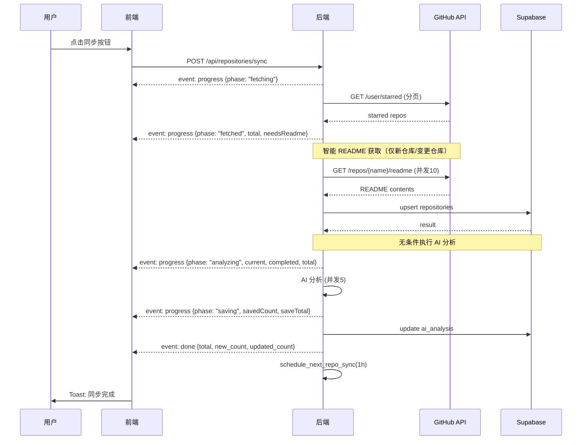

# 仓库同步流程技术文档

## 1. 概述

SaveHub 的仓库系统包含**两大核心功能**：

| 功能 | 描述 | 触发方式 |
|------|------|---------|
| **星标仓库同步** | 同步用户 GitHub 星标仓库 | 手动点击 / 自动调度（1小时） |
| **文章仓库提取** | 从 RSS 文章中提取 GitHub 仓库链接 | 文章处理后自动触发 / Beat 定时扫描 |

### 核心技术栈

- **SSE (Server-Sent Events)**：替代 WebSocket，用于流式返回同步进度
- **Celery**：异步任务队列，处理自动同步和文章仓库提取
- **Redis**：分布式锁，防止重复同步
- **BeautifulSoup + AI**：两阶段文章仓库提取（显式 URL + 隐式提及）

### 关键特性

1. **实时进度反馈**：手动同步通过 SSE 推送 `fetching → fetched → analyzing → saving → done`
2. **链式调度**：手动/自动同步完成后都会调度下一次，形成循环
3. **智能 README 获取**：只为需要的仓库获取（新仓库、pushed_at 变化、readme_content 为空）
4. **并发控制**：README 获取并发度=10，AI 分析并发度=5
5. **分布式锁**：防止同一用户的多个同步任务并发执行
6. **共享 AI 分析**：手动同步和 Celery 任务都调用同一个 `repository_analyzer.py` 服务
7. **仓库来源追踪**：`is_starred`（星标）和 `is_extracted`（文章提取）标记仓库来源

---

## 2. 架构图

### 2.1 星标仓库同步流程图


### 2.2 文章仓库提取流程图



### 2.3 SSE 事件流



---

## 3. 手动同步流程

### 3.1 前端 UI 层

**文件位置**：`frontend/components/repository/repository-page.tsx`

#### 同步按钮 (第 162-169 行)

```tsx
<Button onClick={handleSync} disabled={isSyncing} size="sm">
  <RefreshCw className={`w-4 h-4 mr-2 ${isSyncing ? "animate-spin" : ""}`} />
  {isSyncing ? "同步中..." : "同步"}
</Button>
```

#### 点击处理函数 (第 59-82 行)

```tsx
const handleSync = async () => {
  // 1. 验证 GitHub Token
  if (!settings.githubToken) {
    toast({ title: "GitHub Token 未配置", variant: "destructive" })
    return
  }

  try {
    // 2. 调用 Zustand action
    const result = await syncRepositories()
    // 3. 显示成功提示
    toast({ title: "同步完成", description: `共 ${result.total} 个仓库` })
  } catch (error) {
    toast({ title: "同步失败", variant: "destructive" })
  }
}
```

### 3.2 Zustand Store 层

**文件位置**：`frontend/lib/store/repositories.slice.ts`

#### syncRepositories Action (第 54-69 行)

```ts
syncRepositories: async () => {
  set({ isSyncing: true, syncProgress: null })
  try {
    const result = await repositoriesApi.syncWithProgress((progress) => {
      set({ syncProgress: progress })  // 实时更新进度
    })
    const repos = await repositoriesApi.getAll()
    set({ repositories: repos, lastSyncedAt: new Date().toISOString() })
    return result
  } finally {
    set({ isSyncing: false, syncProgress: null })
  }
}
```

### 3.3 前端 API 客户端层

**文件位置**：`frontend/lib/api/repositories.ts`

#### SSE 流式请求 (第 37-89 行)

```ts
async syncWithProgress(onProgress: (progress) => void): Promise<SyncResult> {
  const response = await fetch(`${API_BASE}/api/repositories/sync`, {
    method: "POST", credentials: "include",
  })
  const reader = response.body?.getReader()
  // 解析 SSE 事件流: progress / done / error
  while (true) {
    const { done, value } = await reader.read()
    if (done) break
    // 解析 event: xxx 和 data: {...}
    if (currentEvent === "progress") onProgress(data)
    if (currentEvent === "done") result = data
  }
  return result
}
```

### 3.4 后端 API 端点

**文件位置**：`backend/app/api/routers/repositories.py`

#### POST /repositories/sync (第 47-177 行)

```python
@router.post("/sync")
async def sync_repositories(request: Request, user=Depends(verify_auth)):
    """同步 GitHub 星标仓库，返回 SSE 流"""

    async def sync_task():
        # 1. 发送 fetching 进度
        await progress_queue.put({"event": "progress", "data": {"phase": "fetching"}})

        # 2. 获取所有星标仓库（分页）
        all_repos = await _fetch_all_starred_repos(github_token)
        await progress_queue.put({"event": "progress", "data": {"phase": "fetched", "total": len(all_repos)}})

        # 3. 并发获取 README（并发度=10）
        readme_map = await _fetch_all_readmes(github_token, all_repos, concurrency=10)

        # 4. 数据库 upsert
        result = repo_service.upsert_repositories(all_repos)

        # 5. AI 分析（无条件执行，分析所有需要分析的仓库）
        await analyze_repositories_needing_analysis(
            supabase=supabase,
            user_id=user_id,
            on_progress=on_progress,  # SSE 进度回调
        )

        # 6. 调度下一次自动同步
        schedule_next_repo_sync(user_id)

        # 7. 发送完成事件
        await progress_queue.put({"event": "done", "data": result})

    return StreamingResponse(event_generator(), media_type="text/event-stream")
```

### 3.5 数据库服务层

**文件位置**：`backend/app/services/db/repositories.py`

#### upsert_repositories 方法 (第 41-110 行)

```python
def upsert_repositories(self, repos: List[dict]) -> dict:
    # 1. 查询现有 github_id
    existing_ids = {row["github_id"] for row in existing_response.data}

    # 2. 计算新增数量
    new_count = sum(1 for r in repos if r["github_id"] not in existing_ids)

    # 3. Supabase upsert（冲突键：user_id, github_id）
    response = supabase.table("repositories") \
        .upsert(db_rows, on_conflict="user_id,github_id") \
        .execute()

    return {"total": len(response.data), "new_count": new_count, "updated_count": total - new_count}
```

---

## 4. Celery 任务系统

### 4.1 任务定义

**文件位置**：`backend/app/celery_app/repository_tasks.py`

```python
@app.task(
    bind=True,
    name="sync_repositories",
    max_retries=2,
    default_retry_delay=30,
    time_limit=600,       # 硬超时 10 分钟
    soft_time_limit=540,  # 软超时 9 分钟
)
def sync_repositories(self, user_id: str, trigger: str = "auto"):
    """
    参数：
    - user_id: 用户 UUID
    - trigger: "manual" 或 "auto"
    """
```

### 4.2 调度机制

> **重要**：这不是传统的 beat 定时任务，而是**链式调度**。

```python
def schedule_next_repo_sync(user_id: str):
    """调度下一次同步（1小时后）"""
    # 1. 取消现有调度（重置计时器）
    cancel_repo_sync(user_id)

    # 2. 创建新任务
    task = sync_repositories.apply_async(
        kwargs={"user_id": user_id, "trigger": "auto"},
        countdown=3600,  # 1 小时
    )

    # 3. 存储任务 ID（用于取消）
    redis.setex(f"repo_sync_task:{user_id}", 3900, task.id)
```

### 4.3 分布式锁

**文件位置**：`backend/app/celery_app/task_lock.py`

| 参数 | 值 | 说明 |
|------|-----|------|
| 锁键 | `repo_sync:{user_id}` | 每用户独立 |
| TTL | 660 秒 | 比任务超时长 60 秒 |

```python
# 任务执行时获取锁
if not task_lock.acquire(f"repo_sync:{user_id}", ttl=660, task_id=self.request.id):
    raise Reject("Sync already in progress", requeue=False)

try:
    # 1. 执行同步
    result = do_sync_repositories(user_id, github_token)

    # 2. AI 分析（无条件执行）
    ai_analysis = do_ai_analysis(user_id)

    # 3. 调度下一次自动同步
    schedule_next_repo_sync(user_id)
finally:
    task_lock.release(f"repo_sync:{user_id}", task_id=self.request.id)
```

### 4.4 AI 分析包装函数

**文件位置**：`backend/app/celery_app/repository_tasks.py:72-98`

```python
def do_ai_analysis(user_id: str) -> Dict[str, Any]:
    """
    Celery 任务中调用 AI 分析的包装函数。
    将异步的 analyze_repositories_needing_analysis 在同步上下文中执行。
    """
    supabase = get_supabase_service()

    loop = asyncio.new_event_loop()
    asyncio.set_event_loop(loop)
    try:
        result = loop.run_until_complete(
            analyze_repositories_needing_analysis(
                supabase=supabase,
                user_id=user_id,
                on_progress=None,  # Celery 任务无 SSE 进度
            )
        )
    finally:
        loop.close()

    return result
```

---

## 5. 数据流详解

### 5.1 SSE 事件类型

| 事件 | 数据 | 触发时机 |
|------|------|---------|
| `progress` | `{phase: "fetching"}` | 开始获取 GitHub 数据 |
| `progress` | `{phase: "fetched", total, needsReadme}` | 获取完成，显示需要获取 README 的数量 |
| `progress` | `{phase: "analyzing", current, completed, total}` | AI 分析中 |
| `progress` | `{phase: "saving", savedCount, saveTotal}` | 保存分析结果中 |
| `done` | `{total, new_count, updated_count}` | 同步完成 |
| `error` | `{message}` | 发生错误 |

---

## 6. 共享 AI 分析服务

### 6.1 服务定义

**文件位置**：`backend/app/services/repository_analyzer.py`

这是**单一数据源**，手动同步和 Celery 任务都调用它：

```python
async def analyze_repositories_needing_analysis(
    supabase,
    user_id: str,
    on_progress: Optional[Callable] = None,
) -> dict[str, Any]:
    """
    AI 分析所有需要分析的仓库。

    包括：
    - ai_summary 为空的仓库
    - ai_tags 为空的仓库
    - 之前分析失败的仓库（重试）
    """
    # 1. 获取用户的 chat API 配置
    config = api_config_service.get_active_config("chat")
    if not config:
        return {"skipped": True, "skip_reason": "no_config"}

    # 2. 获取需要分析的仓库
    repos_to_analyze = repo_service.get_repositories_needing_analysis()

    # 3. 创建 AI 服务并批量分析
    ai_service = create_ai_service_from_config(config)
    results = await ai_service.analyze_repositories_batch(repos_to_analyze, concurrency=5)

    # 4. 保存分析结果
    for repo_id, analysis in results.items():
        repo_service.update_ai_analysis(repo_id, analysis["data"])

    return {"analyzed": N, "failed": N}
```

### 6.2 调用链对比

| 入口 | 调用路径 | 进度回调 |
|------|---------|---------|
| **手动同步** | `repositories.py` → `analyze_repositories_needing_analysis()` | ✅ SSE 推送 |
| **Celery 任务** | `repository_tasks.py` → `do_ai_analysis()` → `analyze_repositories_needing_analysis()` | ❌ 无 |

---

## 7. 关键设计决策

### 7.1 SSE vs WebSocket

| 对比项 | SSE | WebSocket |
|--------|-----|-----------|
| 方向 | 单向（服务器→客户端） | 双向 |
| 重连 | 自动 | 需手动实现 |
| 复杂度 | 低 | 高 |
| 适用场景 | 进度推送 ✅ | 实时聊天 |

**选择 SSE 的原因**：同步进度只需单向推送，SSE 更简单。

### 7.2 分布式锁 TTL 设置

```
锁 TTL (660s) > 任务超时 (600s)
```

**原因**：防止任务超时后锁仍被持有，导致下一次同步被阻塞。

### 7.3 调度计时器重置

```
手动同步 → cancel_repo_sync() → schedule_next_repo_sync()
```

**效果**：手动同步后，自动同步计时器重置为 1 小时，避免用户刚同步完又被自动同步打断。

### 7.4 AI 分析无条件执行

**旧设计**（已废弃）：
```python
if result["new_count"] > 0:
    await ai_service.analyze_repositories_batch(new_repos)
```

**新设计**：
```python
# 无条件执行，分析所有需要分析的仓库
await analyze_repositories_needing_analysis(supabase, user_id)
```

**原因**：
1. 之前失败的仓库需要重试
2. 用户可能后来配置了 API，需要补分析
3. 仓库 README 可能更新，需要重新分析

---

## 8. 文章仓库提取流程

### 8.1 概述

从 RSS 文章内容中自动提取 GitHub 仓库链接，采用**两阶段提取**策略：

| 阶段 | 方法 | 说明 |
|------|------|------|
| **显式提取** | BeautifulSoup | 解析 HTML 中的 `<a href>` 和纯文本 URL |
| **隐式提取** | AI (可选) | 识别文章中提及但未链接的项目名称 |

### 8.2 触发方式

| 触发 | 入口 | 说明 |
|------|------|------|
| **文章处理后** | `extract_article_repos.apply_async()` | 文章图片处理完成后自动调度 |
| **Beat 定时扫描** | `scan_pending_repo_extraction` | 每 30 分钟扫描待处理文章（兜底） |

### 8.3 核心任务

**文件位置**：`backend/app/celery_app/repo_extractor.py`

```python
@app.task(name="extract_article_repos", time_limit=300)
def extract_article_repos(self, article_id: str, user_id: str):
    """
    1. 获取文章内容
    2. BeautifulSoup 显式提取 GitHub URL
    3. AI 隐式提取（如果配置了 chat API）
    4. 合并去重
    5. 从 GitHub API 获取仓库信息
    6. 保存到 repositories 表（is_extracted=True）
    7. 创建 article_repositories 关联
    8. 如果有新仓库，触发 sync_repositories 获取 README
    """
```

### 8.4 提取服务

**文件位置**：`backend/app/services/github_extractor.py`

```python
# 显式提取：解析 HTML 中的 GitHub URL
def extract_github_repos(content: str, summary: str) -> List[Tuple[str, str, str]]:
    """返回 [(owner, repo, url), ...]"""

# 隐式提取：AI 识别未链接的项目
async def extract_implicit_repos_with_ai(...) -> List[Tuple[str, str]]:
    """返回 [(owner, repo), ...]"""

# 合并去重
def merge_repos(explicit, implicit) -> List[Tuple[str, str, str]]:
    """显式优先，按 (owner.lower(), repo.lower()) 去重"""
```

### 8.5 数据表

| 表名 | 用途 |
|------|------|
| `repositories` | 存储仓库信息，`is_extracted=True` 标记来源 |
| `article_repositories` | 文章-仓库多对多关联 |

---

## 9. 关键文件清单

### 9.1 星标仓库同步

| 层级 | 文件路径 | 功能 |
|------|---------|------|
| 前端 UI | `frontend/components/repository/repository-page.tsx` | 同步按钮 |
| 前端 Store | `frontend/lib/store/repositories.slice.ts` | 状态管理 |
| 前端 API | `frontend/lib/api/repositories.ts` | SSE 客户端 |
| 后端路由 | `backend/app/api/routers/repositories.py` | API 端点 |
| 后端服务 | `backend/app/services/db/repositories.py` | 数据库操作 |
| **共享 AI 分析** | `backend/app/services/repository_analyzer.py` | AI 分析服务（单一数据源） |
| **AI 服务** | `backend/app/services/ai_service.py` | OpenAI 兼容 API 调用 |
| Celery 任务 | `backend/app/celery_app/repository_tasks.py` | 异步任务 + AI 分析 |
| Celery 配置 | `backend/app/celery_app/celery.py` | 任务配置 |
| 分布式锁 | `backend/app/celery_app/task_lock.py` | Redis 锁 |

### 9.2 文章仓库提取

| 层级 | 文件路径 | 功能 |
|------|---------|------|
| **Celery 任务** | `backend/app/celery_app/repo_extractor.py` | 文章仓库提取任务 |
| **提取服务** | `backend/app/services/github_extractor.py` | GitHub URL 解析 + AI 提取 |
| **关联服务** | `backend/app/services/db/article_repositories.py` | 文章-仓库关联操作 |
| 数据库服务 | `backend/app/services/db/repositories.py` | `upsert_extracted_repository()` |
